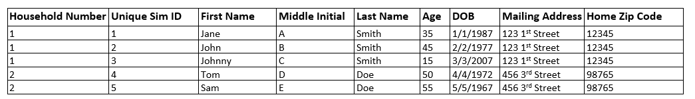
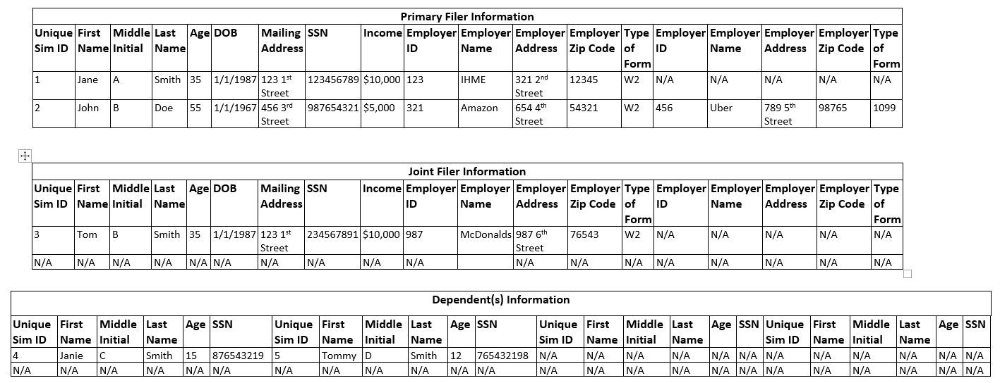

.. role:: underline
    :class: underline

..
  RST needs unique labels for its reference targets (the things you make with
  ".. my_link_name:").  This document has several pre-defined reference target
  templates you should do a find and replace on when you copy this document.
  They are {YOUR_MODEL_TITLE} which you should replace with a title-case version
  of your model name, {YOUR_MODEL_UNDERSCORE} which you should replace with an
  underscore-separated all lowercase version of your model name, and
  {YOUR_MODEL_SHORT_NAME} which you should replace with an abbreviation of your
  model title.  For instance, if you were doing a model of severe acute malnutrition
  for the Children's Investment Fund Foundation based on GBD 2019, we might have

    YOUR_MODEL_TITLE = Vivarium CIFF Severe Acute Malnutrition
    YOUR_MODEL_UNDERSCORE = 2019_concept_model_vivarium_ciff_sam
    YOUR_MODEL_SHORT_NAME = ciff_sam

..
  Section title decorators for this document:

  ==============
  Document Title
  ==============

  Section Level 1 (#.0)
  +++++++++++++++++++++
  
  Section Level 2 (#.#)
  ---------------------

  Section Level 3 (#.#.#)
  ~~~~~~~~~~~~~~~~~~~~~~~

  Section Level 4
  ^^^^^^^^^^^^^^^

  Section Level 5
  '''''''''''''''

  The depth of each section level is determined by the order in which each
  decorator is encountered below. If you need an even deeper section level, just
  choose a new decorator symbol from the list here:
  https://docutils.sourceforge.io/docs/ref/rst/restructuredtext.html#sections
  And then add it to the list of decorators above.

.. _{vivarium_census_prl_synth_data}:

==================================
Vivarium Census PRL Synthetic Data
==================================

.. contents::
  :local:

+----------------------------------------------------+
| List of abbreviations                              |
+=======+============================================+
| ACS   | American Communities Survey                |
+-------+--------------------------------------------+
| AIAN  | American Indian and Alaskan Native         |
+-------+--------------------------------------------+
| NHOPI | Native Hawaiian and Other Pacific Islander |
+-------+--------------------------------------------+
| PRL   | Probabilistic Record Linkage               |
+-------+--------------------------------------------+
| USCB  | United States Census Bureau                |
+-------+--------------------------------------------+

.. _{census_prl}1.0:

1.0 Background
++++++++++++++

Probabilistic Record Linkage (PRL) typically uses sensitive data
containing information such as name, address, date of birth, and
sometimes even social security number, and the restrictions on access
to such data has been a barrier to developing and testing new methods
and software for PRL.  By simulating realistic, but synthetic, data
which includes these attributes, we can make PRL research and
development easier for ourselves and others.

We are certainly not the first to attempt such a data synthesis
project.  Prior approaches include FEBRL, GeCO from UQ, and UALR's
`synthetic occupancy generator (SOG) approach
<https://www.researchgate.net/profile/John-Talburt/publication/215991472_SOG_A_Synthetic_Occupancy_Generator_to_Support_Entity_Resolution_Instruction_and_Research/links/5546986d0cf23ff71686d81f/SOG-A-Synthetic-Occupancy-Generator-to-Support-Entity-Resolution-Instruction-and-Research.pdf?origin=publication_detail>`_.
There is also relevant work from Chris Dibben, who developed `an R
package for producing synthetic data
<https://www.synthpop.org.uk/index.html>`_, and from Robin Linacre,
who developed `synthetic data for testing splink
<http://github.com/moj-analytical-services/splink_synthetic_data>`_.

The unique elements of our work will rely on Vivarium: our synthetic
data will be informed by the United States Census Bureau (USCB) needs
and publicly released USCB data (such as the American Community
Survey [ACS]).  By using Vivarium, we will represent some realistic
dynamics of household and family structure at large scale and with
relevant geographies.  In the longer term, I hope that this work will
also be easily extendable because of our modular framework, for
example, I hope it will be somewhat straightforward to have a mash-up
of the PRL sim with the cancer detection models we completed a
year ago, to help PRL researchers in the cancer surveillance space.

.. _{census_prl}1.1:

1.1 Project overview
--------------------

All simulants will have age and sex (:ref:`1
<census_prl_age_sex_etc>`), following our standard approach.  We will
also include attributes capturing race/ethnicity (:ref:`2
<census_prl_age_sex_etc>`), geographic location (:ref:`3
<census_prl_age_sex_etc>`), and household id (:ref:`4
<census_prl_age_sex_etc>`). To better name individuals we will also
include an attribute for their relationship to a reference person
(:ref:`5 <census_prl_age_sex_etc>`). Due to the complex interplay of
these attributes we will need an enhanced fertility model (:ref:`6
<census_prl_fertility>`).  We can use our standard mortality model
(:ref:`7 <census_prl_mortality>`), but will need totally new models
of domestic (:ref:`8 <census_prl_domestic_migration>`) and international (:ref:`9 <census_prl_international_immigration>`; :ref:`10 <census_prl_international_emigration>`) migration that account for moves
by household and individual simulants, as well as changes to geographic
location and household id.

On top of this, we will layer attributes relevant to PRL: mailing
addresses for each household (11); first, middle, and last names for
each simulant (12); date of birth (13); intended-to-be-unique
identification number modeling SSN that is missing for some and not
actually unique for others (14); and periodic survey, census, and registry
observations with realistic noise (15).

Additional components we might want: time-dependent changes to
observers of sex, based on gender assigned at birth (17); multiple
households for individuals, leading to double counting in census (18);
twins and multiparous births in fertility model (16).  To capture an
additional dimension of heterogeneity and also to enable a periodic
observer that simulates tax returns we will also need a component
representing income (19), which will look a lot like a risk factor
exposure.

.. _census_prl_components:

2.0 Vivarium modelling components
+++++++++++++++++++++++++++++++++

.. _census_prl_concept_model:

2.1 Vivarium concept model 
--------------------------

.. note:: vivarium concept model diagram to come (TK)

.. _census_prl_age-sex-etc:

2.2 Demographics
----------------

.. _census_prl_pop_descr:

2.2.1 Population description
~~~~~~~~~~~~~~~~~~~~~~~~~~~~

  - cohort type: open
  - cohort length: 20 years
  - age and sex structure: USA population from ACS 2019
  - time step: 28 days
  - fertility: as described below
  - stratifications: none --- see below for details on custom observers to capture census-, survey-, and registry-style data generation

.. _census_prl_location:

2.2.2 Location description
~~~~~~~~~~~~~~~~~~~~~~~~~~

We will begin with a model of a simple random sample of households in
Florida, but design with a plan to make a whole-USA-scale data product
eventually, as well as an idea of doing more focused geographies, such
as a single PUMA or collection of PUMAs.

.. _census_prl_models:

2.3 Components
--------------
  

.. _census_prl_age_sex_etc:

2.3.1 Components 1-5: Age, sex, race/ethnicity, nativity, geographic location, household id, and relationship
~~~~~~~~~~~~~~~~~~~~~~~~~~~~~~~~~~~~~~~~~~~~~~~~~~~~~~~~~~~~~~~~~~~~~~~~~~~~~~~~~~~~~~~~~~~~~~~~~~~~~~~~~~~~~

These attributes will be designed to follow closely the data available
in the American Communities Survey Public Use Microdata Sample.

This data includes age in years, sex of male/female, OMB
race/ethnicity, and geographic location encoded at the PUMA, which is
smaller than state but sometimes larger than county.

To match the target of the US Counties BoD team, we will aggregate
race/ethnicity into the following partition:

* Non-Latino White alone
* Non-Latino Black alone
* Non-Latino American Indian and Alaskan Native (AIAN) alone
* Non-Latino Asian alone
* Non-Latino Native Hawaiian and Other Pacific Islander (NHOPI) alone
* Non-Latino Multiracial or Some Other Race
* Latino

This is basically compatible with the surname data we will use in Section (12).

"Nativity" means whether or not someone was born in the United States.
The PUMS has more information on the specific country of birth, but we do not use this level of granularity.
The :code:`NATIVITY` column in PUMS provides the binary categorization.

For initialization on simulation start, for the population living in households, we will sample households from
ACS PUMS rows in the specified PUMAs with replacement, and with
sampling weights given by ACS data; here is sample code for a nanosim
initial population:

.. sourcecode:: python

    # load some ACS data
    columns = ['household_id', 'location', 'fips code', 'puma', 
               'weight', 'age', 'sex', 'race_eth', 'relshipp',
              ]
    acs = pd.read_csv('/home/j/Project/Models/VEHSS/prepped/acs_2019_pums.csv', low_memory=False, usecols=columns)
    acs_hh_only = acs[acs.household_id.str.contains('HU')]  # subset of rows for "household" sample, meaning those _not_ in group quarters

    # sample households to initialize population table
    n_households = 3

    p = acs_hh_only.query(location_str).groupby('household_id').weight.mean() # FIXME: load and use household weights here, instead of this
    p /= p.sum()

    resampled_households = np.random.choice(a=p.index, p=p,
                                            size=n_households, replace=True)

    g = acs.groupby('household_id')
    def household(i, hh_id):
        dfg = g.get_group(hh_id).copy()
        dfg['household_id'] = i
        return dfg
    df_population = pd.concat([household(i, hh_id) for i, hh_id in enumerate(resampled_households)])

Note that this approach will not initialize any simulants living in
Group Quarters, see :ref:`Group Quarters Initialization <census_prl_gq_init>` below for details on
how we will address this.
    
In the code above, there is a location string filter which we can use
to focus our simulation on a single state or PUMA.  For our initial
model, please focus on Florida, with

.. sourcecode:: python

    location_str = 'location == "FL"'  # restrict to subset of ACS data, e.g. specific state or PUMA

Here is a small example of what the code in this section will load from ACS:

+---------+---------------+-------+------+-----------+------+-----------+-----------+-------------+
|         | household_id  | puma  | age  | relshipp  | sex  | race_eth  | location  | fips code   |
+=========+===============+=======+======+===========+======+===========+===========+=============+
| 801679  | 0             | 1110  | 5    | 25        | 1    | 2         | FL        | 12          |
+---------+---------------+-------+------+-----------+------+-----------+-----------+-------------+
| 801678  | 0             | 1110  | 39   | 20        | 2    | 2         | FL        | 12          |
+---------+---------------+-------+------+-----------+------+-----------+-----------+-------------+
| 782698  | 1             | 7301  | 67   | 20        | 2    | 1         | FL        | 12          |
+---------+---------------+-------+------+-----------+------+-----------+-----------+-------------+
| 782699  | 1             | 7301  | 82   | 36        | 1    | 1         | FL        | 12          |
+---------+---------------+-------+------+-----------+------+-----------+-----------+-------------+
| 801484  | 2             | 12703 | 82   | 20        | 1    | 1         | FL        | 12          |
+---------+---------------+-------+------+-----------+------+-----------+-----------+-------------+

The relationship field will be relevant to Last Name generation, and
for easy reference, here are the meanings of the relationship codes
from ACS:

+-------+--------------------------------------------------+
| Code  | Meaning                                          |
+=======+==================================================+
| 20    | Reference person                                 |
+-------+--------------------------------------------------+
| 21    | Opposite-sex husband/wife/spouse                 |
+-------+--------------------------------------------------+
| 22    | Opposite-sex unmarried partner                   |
+-------+--------------------------------------------------+
| 23    | Same-sex husband/wife/spouse                     |
+-------+--------------------------------------------------+
| 24    | Same-sex unmarried partner                       |
+-------+--------------------------------------------------+
| 25    | Biological son or daughter                       |
+-------+--------------------------------------------------+
| 26    | Adopted son or daughter                          |
+-------+--------------------------------------------------+
| 27    | Stepson or stepdaughter                          |
+-------+--------------------------------------------------+
| 28    | Brother or sister                                |
+-------+--------------------------------------------------+
| 29    | Father or mother                                 |
+-------+--------------------------------------------------+
| 30    | Grandchild                                       |
+-------+--------------------------------------------------+
| 31    | Parent-in-law                                    |
+-------+--------------------------------------------------+
| 32    | Son-in-law or daughter-in-law                    |
+-------+--------------------------------------------------+
| 33    | Other relative                                   |
+-------+--------------------------------------------------+
| 34    | Roommate or housemate                            |
+-------+--------------------------------------------------+
| 35    | Foster child                                     |
+-------+--------------------------------------------------+
| 36    | Other nonrelative                                |
+-------+--------------------------------------------------+
| 37    | Institutionalized group quarters population      |
+-------+--------------------------------------------------+
| 38    | Noninstitutionalized group quarters population   |
+-------+--------------------------------------------------+

We need to choose how many people living in households to initialize (M)
out of our total simulated population (N).
Ideally, M would be
sampled from a Binomial distribution, with a probability p_HH of each
simulant being in a household (not GQ), and p_HH would itself be sampled from a Beta
distribution based on the weighted fraction of the population not in GQ
for this geography, with a concentration parameter appropriate to the
sample size from which the weighted fraction was calculated.  But for
now, to keep things simple, we will use M = 0.97*N.

It's not straightforward to sample exactly M people while preserving household structure. Instead, we approximate
M by sampling households until we have exceeded M, and then remove
the last household. The largest household size in ACS is 17, so the number
of simulants initialized in households will underestimate M by 1-16.

We perturb the PUMA and age attributes of the sampled households, as described in the
:ref:`perturbation section below <census_prl_perturbation>`.

.. _census_prl_gq_init:
    
Initializing people living in group quarters
^^^^^^^^^^^^^^^^^^^^^^^^^^^^^^^^^^^^^^^^^^^^

To initialize approximately N simulants total, including simulants
residing in group quarters when initializing our simulation, we will
first initialize approximately M individuals into households as described above.
Then, we initialize individuals in group quarters until the total population N
is reached.

To generate individuals living in group quarters, we will
use a weighted sample of people in group quarters from the appropriate
geography from ACS (sampled with replacement, analogously to
household).  This will provide each simulant residing in GQ with an
age, sex, race/ethnicity, and geographic location matching the joint
distribution from ACS.  It does not identify *which* group quarters
the individual resides in, however, and only provides information on
whether it is Institutional or Non-institutional GQ (in the TYPE
variable: 2 = Institutional; 3 = Non-institutional).

We perturb the PUMA and age attributes of the sampled GQ people, as described in the
:ref:`perturbation section below <census_prl_perturbation>`.

The final step for initializing GQ simulants is to give each
a (somewhat inappropriately named) household_id.  Eventually we shall
accomplish this so that the distribution of GQ sizes match what is
found in census, but as a simple stand-in for now we will include 6
special "household_id" values for the six broad types of GQs that we
wish to represent, and assign simulants to one of the categories
consistent with their GQ TYPE uniformly at random.  The GQ subtypes of
non-institutional are college, military, other non-institutional; and
subtypes of institutional are carceral, nursing homes, and other
institutional.

**Verification and validation strategy**: to verify this approach, we
can use an interactive simulation in a Jupyter Notebook to check that
the marginal distribution for each attribute looks as expected: age, sex,
race/ethnicity, household size, and relationship to reference person.
The group quarters population should be approximately 3% of the total.
I will also verify that the household
relationships are logical --- every household should have a reference
person, and at most one spouse/partner.

.. _census_prl_parents_init:

Initializing parent/guardian for all simulants
^^^^^^^^^^^^^^^^^^^^^^^^^^^^^^^^^^^^^^^^^^^^^^

We want to initialize all simulants who could be claimed as a 
dependent on tax forms to have a guardian. This will 
improve tracking for names, and dependent status on tax forms. 

This person will be listed as ["Guardian"]. By design, most will be 
parents, but some may be a grandparent or other relative. 

There are two groups that need to have parents/guardians initialized 
and we will address those separately: children under the age of 18, and 
those who are below 24 and in GQ for college (defined above). 

Note: "N/A" for the purposes of this simulation means that a parent/
guardian cannot be identified. For tax purposes, no one will claim 
this person as a dependent. 

**For simulant under 18 and NOT living in GQ:**

- Child is a biological, adopted, foster or step child to reference person 
    * Assign reference person 
- Child is any other relative to reference person (NOT roommate/housemate or other nonrelative)
    * Assign a relative of the reference person (anyone who is NOT a roommate/housemate or other nonrelative in the same house) who is between 20 and 45 years older than the child. If there are multiple, assign at random. 
    * If there is not a relative of the appropriate age available, assign the reference person 
- Child is non-relative (roommate or other nonrelative) to reference person 
    * Assign another non-relative of the reference person (roommate/housemate or other nonrelative in the same house) who is between 20 and 45 years older than the child. If there are multiple, assign at random. 
    * If there is not a non-relative of the appropriate age available, assign to a non-relative of any age (select at random if multiple) 
    * If there are not any other non-relatives in the house, make "N/A"
- Child is the reference person 
    * Assign a parent, if available 
    * Otherwise, assign another relative (anyone who is NOT a roommate/housemate or other nonrelative in the same house) who is between 20 and 45 years older than the child. If there are multiple, assign at random.
    * If there are no other relatives in the house, make "N/A"

Once the parent/guardian is assigned, if there is a spouse or unmarried partner 
for that simulant (reference person and spouse/unmarried partner ONLY), then 
include both as parents/guardians. Otherwise only include the one as a parent/guardian. 

(note to software engineers: if any of these rules turn out to be surprisingly hard to implement, please be in touch with research --- we have some flexibility in just how we do this!)

**For a simulant who is below 24 and in GQ at college:**

Simulant will be randomly assigned to a parent/guardian based on the below rules: 

- 78.5% will be assigned to a parent/guardian within their state. The remainder will be assigned out of state source1_. For early versions with only one state, the out of state parent/guardians can be ignored. 
- Match to a person 20 to 45 years older than the child 
- If child is not "Multiracial or Some Other Race", match parent's race. If child is "Multiracial or Some Other Race", then assign to a parent of any race
- Assign to reference people source2_ 
    * 23% female reference people without a listed spouse 
    * 5% male reference people without a listed spouse 
    * Remainder to people with spouses, include both parents 

.. _source1: https://www.statista.com/statistics/236069/share-of-us-students-who-enrolled-in-a-college-in-their-own-state/ 

.. _source2: https://nces.ed.gov/programs/coe/indicator/cce/family-characteristics 

**Limitations**

#. The foster care system is complex. We have the foster kid assigned within the house they are currently living. If we model the foster care system in more detail, we might improve this at some point. 
#. We have "parents" fall between 20-45 older than the child. This is an oversimplification. Some parents (especially men) fall outside of this range. Also some age gaps are more common than others. 
#. The only people who are seen as "in college" are in GQ in college. Plenty of people attend college from home, but we do not track education so are not accounting for this. 
#. We assign GQ college folks to "parents" instead of "parents/guardians". Some are likely supported by a grandparent or other person outside of our qualifications, but this is not included. 

.. _census_prl_fertility:

2.3.2 Component 6: Fertility
~~~~~~~~~~~~~~~~~~~~~~~~~~~~

This component will follow the basic approach of the age-specific
fertility model that we have had for a long time, but never used
seriously. But because of the data and the application, we will also
propagate information from the household.  Each simulant will have a
probability of adding a newborn simulant at each time step, derived
from the age-specific fertility rate for USA.

The race/ethnicity of the simulants added by the fertility model will
be derived from the race/ethnicity of parent; the household id,
geography attribute, street address, and surname will also be derived
from the parent.  (This approach identifies only one parent, and that
might be sufficient for now, although as I learn more about the
specific challenges of Census PRL, I will find out if we need to
revisit this and keep track of dad as well as moms).

The nativity of children born in the sim is set according to where their
parent is currently living; if their parent lives in the US they were born
in the US, otherwise they were born outside the US.

Code for pulling GBD ASFR appears in `recent Maternal IV Iron model
<https://github.com/ihmeuw/vivarium_gates_iv_iron/blob/67bbb175ee42dce4536092d2623ee4d83b15b080/src/vivarium_gates_iv_iron/data/loader.py#L166>`_.

Multiparity --- make twins with probability 4%.  See Section (16) for
additional details.

Relationship -- the sim knows a parent-child dyad when the new
simulant is initialized, and to come up with a consistent value for
the "reference person" relationship field, we use the following
mapping:

+--------------------------------------------------+----------------------------------------+
| Parent relationship to reference person          | Child relationship to reference person |
+==================================================+========================================+
| Reference Person                                 | Biological child                       |
+--------------------------------------------------+----------------------------------------+
| Opposite-sex husband/wife/spouse                 | Biological child                       |
+--------------------------------------------------+----------------------------------------+
| Opposite-sex unmarried partner                   | Biological child                       |
+--------------------------------------------------+----------------------------------------+
| Same-sex husband/wife/spouse                     | Biological child                       |
+--------------------------------------------------+----------------------------------------+
| Same-sex unmarried partner                       | Biological child                       |
+--------------------------------------------------+----------------------------------------+
| Biological son or daughter                       | Grandchild                             |
+--------------------------------------------------+----------------------------------------+
| Adopted son or daughter                          | Grandchild                             |
+--------------------------------------------------+----------------------------------------+
| Stepson or stepdaughter                          | Grandchild                             |
+--------------------------------------------------+----------------------------------------+
| Brother or sister                                | Other relative                         |
+--------------------------------------------------+----------------------------------------+
| Father or mother                                 | Brother or sister                      |
+--------------------------------------------------+----------------------------------------+
| Grandchild                                       | Other relative                         |
+--------------------------------------------------+----------------------------------------+
| Parent-in-law                                    | Other relative                         |
+--------------------------------------------------+----------------------------------------+
| Son-in-law or daughter-in-law                    | Grandchild                             |
+--------------------------------------------------+----------------------------------------+
| Other relative                                   | Other relative                         |
+--------------------------------------------------+----------------------------------------+
| Roommate or housemate                            | Other nonrelative                      |
+--------------------------------------------------+----------------------------------------+
| Foster child                                     | Grandchild                             |
+--------------------------------------------------+----------------------------------------+
| Other nonrelative                                | Other nonrelative                      |
+--------------------------------------------------+----------------------------------------+
| Institutionalized group quarters population      | Institutionalized GQ population        |
+--------------------------------------------------+----------------------------------------+
| Noninstitutionalized group quarters population   | Noninstitutionalized GQ population     |
+--------------------------------------------------+----------------------------------------+

After initializing a newborn during the sim, we make sure the parent doesn't have
another child for at least 9 months.
However, when we initialize a household at the start of the sim that includes a
reference person who likely recently gave birth (e.g. an age 32 female
reference person and an age 0 biological child) we currently don't
mark the reference person as having had a child, and so they are
eligible to give birth again the next month. We could make this more
complicated in the future.

Simulants initialized at the start of the sim with the "biological son or daughter" or "father or mother"
relationship to the reference person are assigned the same last name as
the reference person. Simulants initialized with all other relationships
have independently sampled last names. We could make this more complicated in the future.

**Verification and validation strategy**: to verify this approach, we
can use an interactive simulation in a Jupyter Notebook to check that
new simulants are being added at the expected rate, and with
attributes that match the parent.

.. _census_prl_mortality:

2.3.3 Component 7: Mortality
~~~~~~~~~~~~~~~~~~~~~~~~~~~~

This component will use the standard approach from our Vivarium Public
Health sims, and take data from the age-/sex-specific forecast of
all-cause mortality for USA as produced by the FBD team.

In the future, we may wish to switch to something derived from the
work of the US County BoD team, which is preparing race/ethnicity
specific estimates of all-cause mortality at the county level.

https://vivarium-research.readthedocs.io/en/latest/model_design/cause.html#all-cause-mortality

GBD has state-level all-cause mortality, does FBD forecast at the US
state level yet? Not necessary right now, but good to know for the
future.

When a simulant who is the reference person in a non-GQ household dies,
the oldest remaining simulant in their household is assigned to be the reference person.
All other simulants in the household are assigned a new relationship with these steps:

#. If the new reference person is this simulant's tracked parent (i.e. :code:`parent_ids`),
   the simulant is assigned 'Biological child.'
#. Otherwise, the simulant is assigned the value in the :code:`relationship_to_new_reference_person`
   column in the CSV data file below, from the row where the
   :code:`relationship_to_old_reference_person` column matches this simulant's current relationship
   attribute and the :code:`new_reference_person_relationship_to_old_reference_person` column
   matches the previous relationship attribute of the new reference person.
#. If there is no such row in the file (which would only happen with very strange combinations,
   e.g. a person having two spouses), the simulant is assigned 'Other nonrelative.'

:download:`reference_person_update_relationship_mapping.csv`

Assumptions/limitations in the creation of this file:

* There is not always sufficient information to uniquely determine a new relationship. We err
  toward the most likely scenario.
* We assume that any children of people with current partners or spouses are also children of
  the partner or spouse, unless told otherwise.
* For some combinations, we rely on the parent tracking in step 1, and assume that
  after step 1 has been applied, simulants will primarily not have children relationships
  in situations where other relationships are possible.
* We use Census' definition that a relative
  "is someone related... by birth, marriage, or adoption" [Census_ACS_Instructions]_ and that this is a transitive property
  (the relative of my relative is my relative).
  Data quality note: these instructions are only available on the ACS website and as tooltips for
  those taking ACS online, so different ACS respondents may have substantially different interpretations
  of the relationship categories.

More notes on the assumptions and specifically where they were used are included in the CSV.

**Verification and validation strategy**: to verify this approach, we
can use an interactive simulation in a Jupyter Notebook to check that
simulants are dying at the expected rates.

.. _census_prl_domestic_migration:

2.3.4 Component 8: Domestic Migration
~~~~~~~~~~~~~~~~~~~~~~~~~~~~~~~~~~~~~

A construct that will help think through the domestic migration component is
"directed tripartite graph" showing arcs from simulants (part A) to
households (part B) as well as arcs from households to housing units
(part C).

This construct allows us to distinguish between and easily represent
household migration and individual migration where the whole household
does not move.

In our simplest version, we will have a rate for changing an arc from
a simulant in A to a different household in B, and an independent rate
for changing an arc from a household in B to a new housing unit in C.

I could imagine making these rates quite complex someday, to take into
account the age, sex, race/ethnicity, household structure, and even
past migration history.  At this point, it is clear that age is
necessary to get the college dormitory migration right, so we might as
well include sex and race/ethnicity stratification in the rates as
well.

A complex type of movement that we need to capture is moving into and
out of Group Quarters; it is useful to think of six broad types of GQ
for PRL purposes grouped into two categories: non-institutional
(college, military, other non-institutional); and institutional
(carceral, nursing homes, and other institutional).  College is likely
to be the tough one in Census applications (Census will have SSN for
most military and incarcerated, Medicare for most nursing home, but
people living in dorms, especially who don't file their own tax
returns might not have a protected identification key [PIK].)

To capture this, on the research side I will develop a domestic migration rate
file, with stratification columns for age group, sex, and
race/ethnicity and data columns for the household move rate in moves
per person year and individual move rate (also in moves per person
year).  On the research side, I will also develop a migrates-to
probability file, with the probability that an individual moves a
different household or to each type GQ, also stratified by age, sex,
and race/ethnicity.
Rates of domestic migration are only applied to simulants who currently live
in the US.

To keep things simple, we will for now not have the
reference person ever move in a non-household migration, and when a
non-reference person moves to another household, we will update their
relationship to the reference person to be 36 - Other non-relative
(for simplicity, for now).
This will prevent toddlers from moving out of their parents houses. It
will still have a mother moving out of a house and leaving an
infant. We could add functionality such that children move with their
mothers from birth up to some fixed age (or something similar), but
for now we will have this limitation that our migration model does not
take family structure into account.

These notes on ACS data sources on migration could be useful for the
more complex rates in the future.  Based on age, sex, race/ethnicity,
and geography, we can calculate the probability of moving from ACS, as
the weighted average of MIGPUM.isnull(); could also determine if they
moved within the PUMAs represented in the sim or from outside those
PUMAs.
For now, we only model migration within the sim catchment area (this component)
and to/from other countries (next two components).
When the simulation only includes part of the US, there is no domestic
migration into or out of this region.

Note that each housing unit in C should be associated with a unique
mailing address, as described in Section (8).

We might also want to think about the change
in relationship type when people move, and also change surnames
sometimes.

We might also put a "demographic" model on the housing units in (C);
according to `ACS: America's Data At Risk
(p. 21) <https://censusproject.files.wordpress.com/2022/03/census_white-paper_final_march_2022.pdf>`_,
"Between 2000 and 2019, the number of housing units increased by 23.8
million or almost 21%."

But to summarize, for our initial implementation, here are the
simplifying assumptions that we have included:

#. each household will have one address

#. when a household moves, we will create a new address for them. no
   one will move back into that old address.

#. each time an individual moves, they move into an existing household
   / household id. this household is chosen at random out of all
   households excluding their current one

#. each time an individual moves into an existing household, they gain
   the relationship to head of household "Other nonrelative"

#. the head of household cannot move to a new household

#. Group Quarters address and zip code do not change

**Verification and validation strategy**: to verify this approach, we
can use an interactive simulation in a Jupyter Notebook to check that
simulants are moving at the expected rates.

.. _census_prl_international_immigration:

2.3.5 Component 9: International Immigration (In-Migration)
~~~~~~~~~~~~~~~~~~~~~~~~~~~~~~~~~~~~~~~~~~~~~~~~~~~~~~~~~~~

New simulants are added by migration into the US from other countries.
We simulate three kinds of immigration: household moves, GQ person moves,
and non-reference-person moves.

#. A **household move** is when an entire household (which may be a single-person residential household) enters from outside the country as a unit,
   preserving relationships within the unit.
#. A **GQ person move** is when a GQ person enters from outside the country and joins an existing GQ type.
   These moves have no relationship structure, because GQ people do not have tracked relationships in PUMS or our simulation.
#. A **non-reference-person move** is when a non-GQ person enters from outside the country and joins an existing non-GQ household.
   Non-reference-person moves are independent, single-person events that do not preserve relationship structure.

The number of simulants who move to the US each year in each move type is informed by the ACS' "residence one year ago" question.
A value of 2 for variable :code:`MIG` indicates that a respondent lived outside the US one year ago,
while any other value indicates that they lived within the US.
We refer to respondents who were not living in the United States one year ago as "recent immigrants."
Our assumption is that the number and characteristics of recent immigrants per year
in the 2016-2020 ACS PUMS will be replicated in each future year.

.. note::

    All ACS PUMS data used in this component should be subset to the simulation's catchment area, e.g. Florida.

We also assume that the proportions of recent immigrants by move type will remain constant.
Though in reality not all moves into the US follow one of these patterns, we assume that any new immigrant in a household
where the reference person is also a new immigrant was part of a household move, while any new immigrant in a household where the
reference person is not a new immigrant moved to the US in a non-reference-person move.
We assume that new immigrants living in GQ immigrated directly into GQ and not into a household first, and vice versa.

Specifically, the yearly rate at which simulants are added to the population by each move type is given by
the (weighted) proportion of ACS PUMS persons in the simulation catchment area that are recent immigrants consistent with that move type.
Since immigration is likely unaffected by US population change over time, the number of immigrants for a move type
is the rate multiplied by the simulation's **initial/configured** population size, not current population size.
At each time step:

#. ACS PUMS households with reference people who are recent immigrants,
   after removing any household members who are not recent immigrants,
   are sampled using household weights.
   This sampling continues with replacement until the desired number of simulants added in household moves is reached.
#. ACS PUMS GQ people who are recent immigrants are sampled using person weights with replacement until the desired number
   of simulants added in GQ person moves is reached.
#. ACS PUMS recent immigrants living in non-GQ households where the reference person is not a recent immigrant are sampled using person weights.
   This sampling continues with replacement until the desired number of simulants added in non-reference-person moves is reached.

We perturb the PUMA and age attributes of the sampled household (in the case of a household move)
or person (in the case of a GQ person or non-reference-person move), as described in the
:ref:`perturbation section below <census_prl_perturbation>`.

Added residential households are assigned a new household ID and a new address, as is done at population initialization.
Added GQ people (who all enter in "household" moves) should be assigned a household ID for a randomly-selected GQ type matching
their institutional/non-institutional status, as well as the corresponding shared address, as is done at population initialization.

Simulants added by a non-reference-person move join a randomly-selected existing non-GQ household matching their PUMA.
If there is no such household in the simulation, their PUMA is perturbed using the PUMA replacement process described in the
:ref:`perturbation section <census_prl_perturbation>`, but ensuring that their new PUMA has existing non-GQ households.
Then, they are matched in the new PUMA.
The simulants' relationship attribute is unchanged from sampling, except that "Father or mother" becomes "Other relative" and
all spouse/partner relationships (same-sex or opposite-sex, married or unmarried) become "Other nonrelative."
These changes are necessary to avoid impossible situations (more than two parents, more than one spouse/partner).

.. todo::

    In the future, we may want to make some households more likely than others to receive non-reference-person immigrants.
    Also, the current approach to relationships may create some implausible situations, e.g. grandchildren of 20-year-olds.

All attributes of newly added households and simulants that are not sampled from the ACS PUMS (e.g. addresses, names) are set
using the same method as population initialization for those attributes.

All added simulants should receive a unique simulant ID for PRL tracking, even if they are sampled from the same ACS person.
All added simulants should have a unique seed for common random numbers.
This could be done by assigning unique (or practically unique, with very low probability of collision) precise ages or date-times of entry.

.. _census_prl_international_emigration:

2.3.6 Component 10: International Emigration (Out-Migration)
~~~~~~~~~~~~~~~~~~~~~~~~~~~~~~~~~~~~~~~~~~~~~~~~~~~~~~~~~~~~

Simulants may leave the US to live in other countries.
As with immigration, there are three types of emigration events that can occur:

#. Household moves, when an entire household moves out of the US as a unit.
#. GQ person moves, when a GQ person moves out of the US individually.
#. Non-reference-person moves, when a single non-GQ person leaves their household to move out of the US.

Data sources and analysis
^^^^^^^^^^^^^^^^^^^^^^^^^

We use the Net International Migration (NIM) estimates from the Census
Bureau's Population and Housing Unit Estimates (PopEst) program to determine the
number of emigrants per year. [Census_PopEst]_
Specifically, we use the 2018-2019 annual estimates, in the assumption that this
(pre-COVID) year's emigration can be applied to each future year in the simulation.

We subtract out immigration, which we estimate from the ACS PUMS'
migration question as described in the previous section, to isolate emigration.
Specifically, these three quantities are related by the equation
:math:`\text{NIM} = \text{immigration} - \text{emigration}`.

The NIM estimates are made by the PopEst team by combining information
about immigration from ACS with information about emigration from demographic analysis
(for those born outside the US) and analysis of foreign censuses (for those born in
the US). [Census_PopEst_Methodology]_
Without access to the source data, we cannot replicate these methods, which is why we
use the published NIM values instead of directly estimating emigration.

The NIM values are not published fully stratified.
Out of the available stratifications, we chose to use the values stratified
by (broad categories of) race/ethnicity, because these are most likely to have
PRL implications.

Inspired by the methodology of the PopEst team at the Census Bureau,
we further stratify emigration by assuming that **emigrants** have the same
characteristics as **immigrants**.
There are clear reasons why this assumption would not be correct
(e.g. the fact that the US is one of the wealthiest countries in the world means
it is unlikely to have symmetric characteristics of incoming and outgoing migration)
but it does likely capture some of the ways in which people with different characteristics
have different propensities for international migration, regardless of origin/destination.

First, we distribute emigration by move type, replicating the distribution of
move type in each broad race/ethnicity group (non-Hispanic White alone, Hispanic, all other)
found in ACS PUMS recent immigrants.

Then, we distribute emigration within each race/ethnicity and move type by further demographics,
according to the distributions of these demographics in a resample of the corresponding ACS immigrant population,
with perturbation as described in the :ref:`perturbation section below <census_prl_perturbation>`.
Note that in the case of household moves, these are the demographics **of the immigrant's household's reference person**,
while for the other two types they are demographics of the immigrant themselves.

Finally, we calculate the rates of people emigrating per year of person-time "at risk":

* The "at risk" population for household moves is people living in non-GQ households.
* The "at risk" population for GQ person moves is people living in GQ.
* The "at risk" population for non-reference-person moves is people living in non-GQ households who
  are not the reference person in their household.

In order to mitigate the sampling noise in ACS PUMS stratified by all of these demographic characteristics,
we calculate the denominator for the rate from a resample of the "at risk" population, with perturbation.

Simulation strategy
^^^^^^^^^^^^^^^^^^^

Emigration events are modeled as happening to an at-risk population at a certain rate.
They are constant across time in the simulation.

Households and individuals selected to have emigration events should remain in the simulation, but their
location attributes (US state, PUMA, and address) should be set to placeholder values that signify they are
no longer in the US.
Emigrating simulants should also terminate employment -- their employer ID and income are set
to those used for unemployment.
In the future, we may want some of these simulants to continue employment in the US or
re-enter through the immigration component, but for now
they will remain unemployed and outside the US permanently.
All other simulant attributes should be unchanged by the emigration event.

.. note::

  Because simulants outside the US remain in the population table, it is important for all components
  to carefully define whether or not they act on these simulants.
  For example, the at-risk population for emigration in each type of move defined below is specified
  to be **in the US**.
  Certain observers will only observe simulants in the US, for example Census observers and household surveys.

Household moves
'''''''''''''''

The at-risk population for household moves is all simulants living in non-GQ households in the US.
This at-risk population should be stratified by age group, sex, race/ethnicity, and nativity (born in or outside the US)
**of the simulant's household's reference person**, as well as US state.
On each time step, within each stratum, the corresponding household move emigration rate **per year of person-time** should be applied to determine
a number of **simulants** to emigrate as part of household moves.
Then, households within the stratum should be sampled at random for emigration until **at least** the desired number of simulants is reached.
This means that in practice we will generally overshoot the desired number by a few, but this should have
minimal effect.

GQ person moves
'''''''''''''''

The at-risk population for GQ person moves is all simulants living in GQ in the US.
This at-risk population should be stratified by age group, sex, race/ethnicity, nativity (born in or outside the US),
and US state.
On each time step, within each stratum, the corresponding GQ person move emigration rate **per year of person-time**
should be applied to sample simulants to emigrate. 

Non-reference-person moves
''''''''''''''''''''''''''

The at-risk population for non-reference-person moves is all simulants living in non-GQ households in the US, except for those who are a household reference person.
This at-risk population should be stratified by age group, sex, race/ethnicity, nativity (born in or outside the US),
and US state.
On each time step, within each stratum, the corresponding non-reference-person move emigration rate **per year of person-time**
should be applied to sample simulants to emigrate.
The simulant is removed from the household (they may be given a blank or placeholder household ID) and the
rest of the household is unaffected by this event.

Simulation inputs
^^^^^^^^^^^^^^^^^

:download:`Household emigration rates <household_emigration_rates.csv>`

:download:`GQ person emigration rates <group_quarters_person_emigration_rates.csv>`

:download:`Non-reference-person emigration rates <non_reference_person_emigration_rates.csv>`

Limitations
^^^^^^^^^^^

#. We assume that emigration is either whole-household or totally independent at the individual level.
   In reality, it is likely that subfamilies emigrate together more frequently than would be expected under this assumption.
#. We assume that relationship does not affect emigration rates.
   In reality, people with certain relationships (e.g. boarder) likely emigrate more than others (e.g. spouse),
   even after accounting for demographics.
#. We use a single GQ person emigration rate, even though emigration likely varies by GQ type.

2.3.7 Component 11: Address
~~~~~~~~~~~~~~~~~~~~~~~~~~~

Each household id should be associated with a residential address, and
(in a future, more complicated model) when people move, they should
often move into previously vacated households, so that there are
distinct households which have had the same residential address at
different times.  We hypothesize that this will present a relevant
challenge for PRL methods in practice.

It is not clear how important it is to have housing unit address
correspond to geography, and I am trying to gauge how much effort to
put into having geographically realistic addresses.  This is also a
sensitive area for privacy and personal information --- even if the
data is synthetic, it might refer to a real location.  The risks of
this are unclear.

A generator that can generate street address and zip code is the
Python package faker: https://github.com/joke2k/faker

.. sourcecode:: python

    # addresses stay with households, can start with faker python library
    import faker
    fake = faker.Faker()

    def my_fake_address():
        orig_address = fake.unique.address()
        address = orig_address.split('\n')[0]
        return address

    address_dict = {hh_id: my_fake_address() for hh_id in df_population.household_id.unique()}

    zip_dict = {hh_id: provider.postcode_in_state('FL') for hh_id in df_population.household_id.unique()}

    df_population['address'] = df_population.household_id.map(address_dict)
    df_population['zip'] = df_population.household_id.map(zip_dict)

Some additional libraries that function similarly to ``faker`` are https://github.com/ropensci/charlatan
and https://github.com/paulhendricks/generator

It would be cool to have geographically plausible addresses, for
example by reversing the process of libpostal, based on the PUMA
geocoords. (it turns out that libpostal is an address parser, and does
not map the parsed value to a lat/lon coordinate; an updated attempt
has packaged libpostal training data conveniently:
https://github.com/GRAAL-Research/deepparse-address-data)

It would be responsible to avoid putting real addresses in the
synthetic database, perhaps by checking the synthetic data against
libpostal and rejecting the generated addresses that seem real.
Census Bureau might appreciate this and might even be able to provide
USPS data on what real addresses are and we can avoid them (although
there is an obscure potential privacy issue with that, too!).  We
could potentially use business addresses as residential addresses as a
backup plan.

A relevant disparity in linkage accuracy might arise from the
challenging nature of linking rural addresses; there is some
information in `this report
<https://www.census.gov/content/dam/Census/library/publications/2012/dec/2010_cpex_247.pdf>`_
which shows (p. 31) how people in rural counties are hard to match
(presumably due mostly to address issues).  According to `this page
from 2010 Decennial Census
<https://www.census.gov/newsroom/blogs/director/2010/02/the-four-principal-ways-we-conduct-the-census.html>`_
there is 9% of the US population where the mail is not delivered to
the residence uniformly.  For these households, we might want to
capture different addresses in the decennial census simulated output
and the tax return simulated output.  We can (in a future, more
complicated model) represent this by maintaining a *mailing address*
for each household that is sometimes different from residential
address for the household's housing unit.  A simple distinction would
be to make the mailing address a P.O. Box for 9% of the households,
although it would be great to have this vary with location, age, sex,
race/ethnicity, and income.  When households move, this would always
result in a new residential address (because of the new housing unit),
but sometimes not make a change to the PO Box (especially if the move
was not far, e.g. within the same PUMA).  For our minimal model, we
will not include this, however, and I will try to get more info about
how important this challenge to matching is in Census Bureau
applications.  I believe that I will learn it is important, however,
because decennial census will know a residential address but IRS and
Medicare will know a mailing address, which will making linking hard
for the population without mail delivery to residence.

**Verification and validation strategy**: to verify this approach, we
can manually inspect a sample of 10-100 addresses; features to
examine: does everyone in a household have the same address?  does the
zip code match the state?  does the street conform to typical
expectations?

2.3.8 Component 12: Names
~~~~~~~~~~~~~~~~~~~~~~~~~

**Last names**

Last names in USA by race
https://www2.census.gov/topics/genealogy/2010surnames/surnames.pdf
https://www.census.gov/topics/population/genealogy/data/2010_surnames.html

Note: RAND used something like this for their BISG project
https://www.rand.org/pubs/external_publications/EP20090611.html
https://www.rand.org/health-care/tools-methods/bisg.html

.. sourcecode:: python

    # last name can be race/ethnicity specific
    df_census_names = pd.read_csv('/home/j/Project/simulation_science/prl/data/Names_2010Census.csv', na_values=['(S)'])

    # fill missing values with equal amounts of what is left
    n_missing = df_census_names.filter(like='pct').isnull().sum(axis=1)
    pct_total = df_census_names.filter(like='pct').sum(axis=1)

    pct_fill = (100 - pct_total) / n_missing
    for col in df_census_names.filter(like='pct').columns:
        df_census_names[col] = df_census_names[col].fillna(pct_fill)

    def random_last_name(race_eth):
        p = df_census_names['count'].copy()

        if race_eth == 1:
            p *= .01 * df_census_names.pctwhite
        elif race_eth == 2:
            p *= .01 * df_census_names.pctblack
        elif race_eth == 3:
            p *= .01 * df_census_names.pcthispanic
        else:
            p *= .01 * (100 - (df_census_names.pctwhite + df_census_names.pctblack + df_census_names.pcthispanic))

        # make zero probabilities go away
        s_name_pr = pd.Series(np.array(p), index=df_census_names.name)
        s_name_pr = s_name_pr[s_name_pr > 0]
        s_name_pr /= s_name_pr.sum()
        return np.random.choice(s_name_pr.index, p=s_name_pr).capitalize()

    # should everyone in a household have the same last name?  seems overly normative, but what is smarter?
    for hh_id, dfg in df_population.groupby(['household_id']):
        last_name = random_last_name(dfg.race_eth.value_counts().iloc[0])  # HACK: use most common race/eth in household
        df_population.loc[dfg.index, 'last_name'] = last_name
        # TODO: for rows with relshipp value of 22, 24, 31, 32, 34, 35, 36, give different last name

Last names sometimes also include spaces or hyphens, and I have come
up with race/ethnicity specific space and hyphen probabilities from an
analysis of voter registration data (from publicly available data from
North Carolina, filename VR_Snapshot_20220101.txt; see
2022_06_02b_prl_code_for_probs_of_spaces_and_hyphens_in_last_and_first_names.ipynb
for computation details.)

For now, assign all simulants within the same household who are 
relatives of the reference person the same last name. 
This excludes "roommate/housemate" and "other nonrelative" to the 
reference person. This is an oversimplification as some relatives might have 
different last names, but works for the initial model. 

This will not be applied to anyone in a group quarter. 
	
**First and middle names**

First names from babies:
https://www.ssa.gov/oact/babynames/limits.html ; this page links to a
data file of State-specific birth certificate frequencies for first
names https://www.ssa.gov/oact/babynames/state/namesbystate.zip

How to get realistic race/ethnicity for first and middle names?  And
is that important? We could use ecological approach to back out
race/ethnicity from state-to-state variation in first names.  To test,
we would take (for example) a traditionally Black first name and see
if the state-to-state rate is correlated with the percent of Black
babies --- can use state random effects to include data from multiple
years to be increase predictive validity.

Use middle names from same distribution as first names (?). It would
be nice to get some of the national/ethnic challenges right, like
people from South America with many names getting their middle names
used as different last names.

We might want to eventually include nicknames and suffixes like Jr. and III.

.. sourcecode:: python

    # first and middle names
    # strategy: calculate year of birth based on age, use it with sex and state to find a representative name
    df_ssn_names = pd.read_csv('/home/j/Project/simulation_science/prl/data/ssn_names/FL.TXT',
                               names=['state', 'sex', 'yob', 'name', 'freq'])
    df_ssn_names['age'] = 2020 - df_ssn_names.yob
    df_ssn_names['sex'] = df_ssn_names.sex.map({'M':1, 'F':2})
    g_ssn_names = df_ssn_names.groupby(['age', 'sex'])
    def random_names(age, sex, size):
        t = g_ssn_names.get_group((age, sex))
        p = t.freq / t.freq.sum()
        return np.random.choice(t.name, size=size, replace=True, p=p)
    for (age,sex), df_age in df_population.groupby(['age', 'sex']):
        df_population.loc[df_age.index, 'first_name'] = random_names(age, sex, len(df_age))
        df_population.loc[df_age.index, 'middle_name'] = random_names(age, sex, len(df_age))

Note that if someone is born after 2020, their first name is sampled
from first names in 2020, while for individuals born earlier their
name is sampled from first names of birth year.
	
It could be valuable to include correlation between first and last
names.  There will be a little from the strategy described above, but
we could develop a strategy to more explicitly model it.  One approach
is outlined here, but we will not use it in our minimal model.  With a
large corpus of full names, (1) derive an empirical correlation matrix
of soundex of first name and soundex of last name; and then use the
sources described above to create conditional samplers for first name
and last name based on soundex.  Perhaps measure of success is to look
at entropy of character n-gram distribution.

To simulate naming after a parent or family member, we would like ~5% of 
children to have the same name as a relative. This can be separated into two 
groups: 

**People born in the simulation**

For 5% of simulants, they will be assigned a name based on these steps: 

#. Female simulants will have the same first name as their mother (who is known) 
#. Male simulants, if their mother is the reference person and has an opposite-sex spouse, they will receive that spouse's first name 
#. Otherwise, if the mother is the reference person or is related to the reference person, the new simulant will be assigned the first name of a randomly selected male in the household who is related to the reference person, if one exists 
#. If none of these are available, assign a random name 

**People initialized in the simulation**

For 5% of simulants, they will be assigned a name based on these steps: 

#. For anyone who is the reference person, assign the first name of any "parent" relationship of the same sex in the house, if not available then any "child" relationship name, then randomly assign any other relative of the same sex first name if available 
#. For anyone who has a child relationship attribute ("biological child", "adopted child") and is the same sex as the reference person, they are assigned the same first name as the reference person 
#. For anyone who has a "parent" relationship attribute and is the same sex as the reference person, they are assigned the same first name as the reference person 
#. For anyone who has a child relationship attribute ("biological child", "adopted child") and is the opposite sex as the reference person: if there is someone in the household with relationship "opposite-sex spouse", they are assigned the same first name as the spouse 
#. For anyone else, if they have a relative relationship attribute (any except "roommate/housemate" and "other nonrelative"), they are assigned the same first name as another randomly-selected person in the household who also has a relative relationship attribute and the same sex. If there is no such person, skip to the next step.
    #. If there are 2 or more simulants in this step that are selected for matched naming, beginning naming with the oldest simulant first 
#. For anyone else, they will be assigned a random name 

Note that for same sex couples, whoever is the reference person will pass their name instead of their spouse. 

**Verification and validation strategy**: to verify this approach, we
can manually inspect a sample of 10-100 names; we can also look at the
frequency of common first and last names, as well as the frequency of
common last names stratified by race/ethnicity.  There will likely be
funny combinations of first and last names for certain race groups
(e.g. South Asian first names with East Asian last names) but we are
not expecting to get that right.

Hyphenated last names are merged together from samples of random last
names (by race/ethnicity). This likely creates some strange last
names, so have a careful look at this in validation, and decide if
refinement is needed.

2.3.9 Component 13: Date of Birth
~~~~~~~~~~~~~~~~~~~~~~~~~~~~~~~~~

To create a date-of-birth column in the synthetic output data, each
simulant should have a uniformly random date of birth which is
consistent with their age.

.. sourcecode:: python

    # random date of birth for 2019 ACS data

    data_date = pd.Timestamp('2019-06-01')
    age = 365.25 * df_population.age
    age += np.random.uniform(low=0, high=365, size=len(df_population))
    dob = data_date - pd.to_timedelta(np.round(age), unit='days')
    df_population['dob'] = dob

We could enhance this by using an empirical distribution of
birthdates, since they are not uniformly distributed.  There might
even be relevant determinants of date of birth (parents' educational
attainment, perhaps?) that we could introduce in this model.  But we
will keep this simple for now, on the assumption that it does not make
a difference in how well PRL methods perform.

**Verification and validation strategy**: to verify this approach, we
can bin DOB by day of week, month, and year, and see if the DOBs are
uniformly distributed across bins.  We can assess this manually by
visual inspection and quantitatively using an appropriate statistical
test (would that be a Chi-Square test?).

2.3.10 Component 14: Social Security Number
~~~~~~~~~~~~~~~~~~~~~~~~~~~~~~~~~~~~~~~~~~~

Eventually, this should be missing for some and not actually unique
for others.  I need to do some research into how we represent this,
and how important it is.  According to `this report
<https://www.census.gov/content/dam/Census/library/publications/2012/dec/2010_cpex_247.pdf>`_,
"There were 308.7 million persons in the 2010 Census, and 279.2
million were assigned a protected identification key"

There is a python library that includes a detailed SSN generation
module:
https://github.com/joke2k/faker/blob/master/faker/providers/ssn/en_US/__init__.py#L219-L222

Zeb found some documentation from SSA confirming that ``faker`` has an
accurate algorithm for SSN generation:
https://www.ssa.gov/kc/SSAFactSheet--IssuingSSNs.pdf

In this investigation, he also noted that before 2011, SSNs
corresponded to location: https://www.ssa.gov/employer/stateweb.htm We
might want to integrate this in the future, although I'm not sure if
any PRL methods rely on the link between SSN and location.

It is also possible that it will be annoying to Census Bureau if we
have realistic SSN values, even if they are randomly generated, and we
may wish to change to numeric format for this to a synthetic SSN-like
(SSSN) value

.. sourcecode:: python

    # give everyone a unique fake ssn (for now)
    df_population['ssn'] = [fake.unique.ssn() for _ in range(len(df_population))]

As a simple mechanism to capture some of the complexity in SSNs, we
will have 10% of newborn simulants not receive a SSN.  We will also
have 10% of simulants initialized at the beginning of the simulation
not receive a SSN.

**Verification and validation strategy**: to verify this approach, we
can manually inspect a sample of 10-100 SSNs, confirm that the
expected number are missing and that the duplication count follows the
intended distribution.

2.3.11 Component 15: Periodic observations of attributes through survey, census, and registry
~~~~~~~~~~~~~~~~~~~~~~~~~~~~~~~~~~~~~~~~~~~~~~~~~~~~~~~~~~~~~~~~~~~~~~~~~~~~~~~~~~~~~~~~~~~~~

Census
^^^^^^

**When to Sample** 

- The sample will be taken on the first time step that hits April of each decade (2010, 2020, 2030)
- The sample will be taken on a single time step 

**What to Sample** 

.. list-table:: Simulant Attribute to Sample 
  :widths: 20
  :header-rows: 0

  * - Unique simulant ID (for PRL tracking)
  * - First name
  * - Middle initial 
  * - Last name
  * - Age 
  * - Date of Birth 
  * - Home Address 
  * - Relationship to Person 1 (Head of Household)
  * - Sex (binary)
  * - Race/Ethnicity 

**Who to Sample** 

Simulants currently living in the US are eligible for sampling.
Based on race/ethnicity, age, and sex, simulants will be assigned a 
probability of being missed in the census. Based on this 
probability, simulants will be randomly selected for inclusion. We decided 
to use additive effects rather than multiplicitive which is often used 
in simulations. 
All "Percent Omitted" data below is from the Census Post-Enumeration Survey. [Census_PES]_ 

.. list-table:: Simulant Omission by Race/Ethnicity 
  :widths: 20 10 10 
  :header-rows: 1

  * - Race/Ethnicity  
    - Percent Omitted 
    - Additive Risk Effect on Omission (% points)
  * - US Total (all races) 
    - 0.24
    - 0 (reference)
  * - White 
    - -1.64
    - -1.88
  * - Black 
    - 3.3
    - 3.06
  * - Asian 
    - -2.62
    - -2.86 
  * - American Indian and Alaskan Native 
    - 0.91
    - 0.67
  * - Native Hawaiian and Pacific Islander  
    - -1.28
    - -1.52 
  * - Other Races or Multiracial  
    - 4.34
    - 4.1
  * - Hispanic/Latino 
    - 4.99
    - 4.75 

.. list-table:: Simulant Omission by Age/Sex 
  :widths: 20 10 10 
  :header-rows: 1

  * - Age/Sex
    - Percent Omitted 
    - Additive Risk Effect on Omission (% points)
  * - US Total (all ages and sexes) 
    - 0.24
    - 0 (reference)
  * - 0-4, all sexes 
    - 2.79
    - 2.55
  * - 5-9, all sexes 
    - 0.1
    - -0.14
  * - 10-17, all sexes 
    - 0.21
    - -0.03
  * - 18-29, male 
    - 2.25
    - 2.01
  * - 18-29, female 
    - 0.98
    - 0.74
  * - 30-49, male 
    - 3.05
    - 2.81
  * - 30-49, female 
    - -0.1
    - -0.34
  * - 50+, male 
    - -0.55
    - -0.79
  * - 50+, female 
    - -2.63
    - -2.87

Using the tables above, a probability of omission is calculated for 
each simulant. The table below includes a few examples of this 
process. 

.. list-table:: Calculating Simulant Omission 
  :widths: 10 10 10 20
  :header-rows: 1

  * - Simulant 
    - Race/Ethnicity 
    - Age/Sex
    - Probability of Omission (%)
  * - 1
    - White 
    - 0-4, female 
    - 0.24 + (-1.88) + (2.55) = **0.91%** 
  * - 2
    - Black 
    - 30-49, male 
    - 0.24 + (3.06) + (2.81) = **6.11%** 
  * - 3
    - Asian 
    - 50+, female 
    - 0.24 + (-2.86) + (-2.87) = -5.49 is < 0 so **0%** 

Please note that for simulants with a net undercount less than 0, 
they have a 0% chance of being missed. We are not including 
duplicates at this time. 

**Data Errors/Noise** 

.. todo::
    - Addition of a noise function for misrecording data (names, addresses, birthdays) 
    - We currently have net undercounts, might want to have omissions and duplicates instead with a noise function  
    - To create these noise functions, in addition to the above survey outputs, please include: tracked guardian(s) and the tracked guardian(s) addresses; type of group quarter 

**Limitations and Possible Future Adds** 

#. Sampling on a single time step is not representative of the true census. People might move houses, change names, have babies, or have loved ones die during the census leading to additional noise in the census not modeled here 
#. Our model will underestimate total census coverage as we are not including net overcounts for certain population segments 
#. Here we model a net undercount rather than modeling duplications and omissions separately. In reality, simulants are both duplicated and omitted within each race/age/sex group which leads to additional noise in the data 
#. There are multiple other factors that contribute to omission rate including: tenure in a home, state/geography, and having a SSN (as a proxy for citizenship) [Elliot_2021]_. These are not currently included in our model 
#. There is some evidence that young children are missed in the post enumeration survey and therefore are missed more than accounted for here [OHare_2019]_ 
#. It is assumed that race and age/sex are independent, do not have interaction, and combine additively 

Household Surveys
^^^^^^^^^^^^^^^^^

There are many different types of household surveys that we might want to include 
in the model. Therefore, this documentation reflects a general framework for 
household surveys. The research team would then be responsible for providing the 
additional inputs for an individual survey. 

**When to Sample** 

There are two types of sampling plans: 

1. A new random sample of the population at a defined time interval (e.g., sample 5% of the households each month for a year)

- The sample will be taken at set time intervals (monthly, annually) that the research team will communicate in terms of time steps 
- The total duration of the survey will be specified 
- Each subsequent sample is assumed to be independent of the prior samples 

2. A longitudinal sample will sample the **same** population on defined time steps (e.g., sample the same 5% of households each month for 6 months) 

- The sample will be taken at set time intervals (monthly, annually) that the research team will communicate in terms of time steps 
- The total duration of the survey will be specified 
- The sample will be taken and kept the same for all households 

**What to Sample** 

.. list-table:: Simulant Attribute to Sample 
  :widths: 20
  :header-rows: 0

  * - Household number (random indicator which is the same for simulants in the same household)
  * - Unique simulant ID (for PRL tracking)
  * - First name
  * - Middle initial 
  * - Last name
  * - Age 
  * - DOB 
  * - Home Address 
  * - Home Zip Code 

Here is an example: 

**Who to Sample** 

Simulants currently living in the US are eligible for sampling.
For surveys, there is a much more significant amount of non-response bias 
compared to the annual census. Participation will be determined in a two 
step process. 

**Step 1:** Households will be randomly selected for participation at a rate 
predetermined by the researcher. The selection should be stratified by state, 
but no other variables. This will be a random sample. 

**Step 2:** Households will be chosen to be non-responders and removed from 
the sample. This step will vary significantly based on the mode of the survey. 
There are three possible modes: mail/online (assumed to be the same for this 
model), telephone, and personal visits. 

The below table includes the percent of responses for each mode of survey by 
race/ethnicity. These will be used to find the non-response based on the mode 
of the survey. 

This data is based on the ACS which uses all of these methods and tracks 
the percent of respondents to each. [Jackson_2007]_ Since the ACS has an order to 
their survey modes (mail -> telephone -> personal visit), this data should 
not be used out of that order (e.g., we can **not** assume that a telephone only 
interview would have an 11.9% response rate for white people). 

The data for modes below is for respondents. We assume that the non-response 
bias for ACS matches the census. Therefore, we will apply an additional omission 
rate using the rates in the simulant omission tables in the decennial census 
section above. 

This data is available as a csv here: J:\Project\simulation_science\prl\data\survey_mode_percent.csv 

.. list-table:: Simulant Response by Race/Ethnicity 
  :widths: 20 10 10 10 
  :header-rows: 1

  * - Race/Ethnicity  
    - Mail/Online Percent of Response 
    - Telephone Percent of Response
    - Personal Visit Percent of Response 
  * - White 
    - 62.5%
    - 11.9%
    - 25.6% 
  * - Black 
    - 29.7%
    - 15.1%
    - 55.2% 
  * - Asian 
    - 52.7%
    - 9.7%
    - 37.6%  
  * - American Indian and Alaskan Native 
    - 40.1% 
    - 18.0% 
    - 41.9% 
  * - Native Hawaiian and Pacific Islander  
    - 30.0%
    - 14.2%
    - 55.8% 
  * - Other Races or Multiracial  
    - 22.9% 
    - 16.7% 
    - 60.3% 
  * - Hispanic/Latino 
    - 25.9% 
    - 15.1% 
    - 58.8% 

.. list-table:: Calculating Simulant Non-Response 
  :widths: 5 10 10 10 10 10 10 
  :header-rows: 1

  * - Sim
    - Race/Ethnicity 
    - Age and Sex 
    - Survey Modes Used 
    - Census Omission Rate (%) 
    - Probability of Non-Response (%)
    - Overall Missed Respondents (%)
  * - 1
    - White 
    - 30-49, female
    - Mail/Online Only 
    - 0%  
    - 100% - 62.5% = 37.5% non-response 
    - 37.5%  + 0% = **37.5%**
  * - 2
    - Black 
    - 18-29, male 
    - Mail/Online and Telephone
    - 5.31%
    - 100% - (29.7% + 15.1%) = 55.2% non-response 
    - 55.2% + 5.31% = **60.51%**
  * - 3
    - Asian 
    - 50+, female 
    - Mail/Online, Telephone, and Personal Visits 
    - 0% 
    - 100% - (52.7% + 9.7% + 37.6%) = 0% 
    - 0% + 0% = **0%** 

For longitudinal surveys, assume that non-response is independent between 
survey iterations. 

**Data Errors/Noise** 

.. todo::

    - Creation of a noise function for misrecording data (names, addresses, birthdays) 
    - Possible changes to omission rates by survey 
    - To avoid rerunning, please oversample by 2x 
    - Might include person swaps or duplicates in the noise function 
    - To create these noise functions, in addition to the above survey outputs, please include: tracked guardian(s) and the tracked guardian(s) addresses; type of group quarter 

**Limitations and Possible Future Adds** 

#. Sampling on a single time step is not representative of most surveys. People might move houses, change names, have babies, or have loved ones die during the survey leading to additional noise not modeled here 
#. Our model does not include an option for double counting or duplicating people 
#. There are multiple other factors that contribute to non-response including: tenure in a home, state/geography, age, and having a SSN (as a proxy for citizenship) based on ACS data [Jackson_2007]_. These are not currently included in our model 
#. Simulants who do not respond to one time point in a longitudinal survey are probably more likely to not respond moving forward. We assume independence here. 
#. The ACS data is for a survey that has an unusually high response rate. This data was used as it could give an estimate for mail only or mail and telephone only data. However, this has limitations. Other surveys might have lower response rates and should be handled separately. 
#. By replicating the census omission rate for the ACS observer, we are limiting the non-response rate below what we might expect. This will lead to overcounting in the ACS. 

**Initial Survey - American Community Survey (ACS)** 

The ACS will be used for V&V testing. It is defined as: 

- Sample rate of 12,000 households nationwide  
- Sample will be stratified by state to ensure an even distribution 
- Sample at each time step (approximates monthly)
- **Not** longitudinal (independent samples) 
- Includes mail/online, telephone, and personal visits 

**Survey - Current Population Survey (CPS)** 

The CPS is a survey run by the Census Bureau and gathers data about the 
labor force, employment and unemployment, demographics, earnings, and 
more information. It is an important survey and therefore is being 
added here. 

To create this survey: 

- Sample rate of 60,000 households nationwide 
- Sample will be stratified by state to ensure an even distribution 
- Sample at each time step (approximates monthly)  
- **Not** longitudinal (independent samples) 
- This survey utilizes personal visits and phone calls. As this does not fit into the framework above, we will use the values for mail/online, telephone, and personal visits and then apply an overall non-response rate of 27.6%. This additional risk of non-response will be added to all simulants regardless of race/ethnicity, age, or sex 

[Household_Rates_2022]_

Note/limitations: 

- Applying a uniform non-response rate limits the impact of race/ethnicity, age, and sex to affect the sampled population. This might make some aspects of PRL easier as it is less likely the same simulants will be missing from each sample.

Women, Infants, and Children (WIC)
^^^^^^^^^^^^^^^^^^^^^^^^^^^^^^^^^^

WIC is a government benefits program designed to support mothers and young 
children. The main qualifications are income and presence of young children 
in the home. 

**When to Sample** 

- Sample compiled on the time step containing Jan 1st of each year (the time step might end on Jan 2nd, Jan 15th, Jan 27th, etc.)

**What to Sample** 

.. list-table:: Simulant Attribute to Sample 
  :widths: 20
  :header-rows: 0

  * - Household number (random indicator which is the same for simulants in the same household)
  * - Unique simulant ID (for PRL tracking)
  * - First name
  * - Middle initial 
  * - Last name
  * - Age 
  * - DOB 
  * - Home Address 
  * - Home Zip Code 

Here is an example: 

**Who to Sample** 

Selection for the observer will be in 2 steps: 

#. Eligibilty for WIC 
#. Covered by WIC 

Please note that multiple people in the same household can be selected and selection 
should be independent. This applies to siblings (e.g., having one child in the household 
on WIC does not mean a second child is or is not on WIC) or parent/child groups (a mother 
being on WIC does not mean her infant is or is not on WIC). Inclusion is at the simulant 
level. Do not include others in the household on the observer. 

**Eligibility for WIC**

Eligibility for WIC is based on income and age/children in the house. 
To qualify you must be both: 

- A child under the age of 5 (0-4 years old)
- OR a tracked mother OR guardian of a child under the age of 1 

And also: 

- Have a total household income less than the limit below (based on number of people in the household)

Max income = $16,410 + ($8,732 * number of people in the household) 

For example, a one person household would have a maximum income of $25,142 and 
a two person household would have a maximum income of $33,874. 

Source: [WIC_eligibility]_

**Covered by WIC**

Once someone is found to be eligible, they are then randomly assigned to be 
covered or not covered by WIC. This is a random sample based on the age of 
the participant. 

.. list-table:: Coverage Rate by Age 
  :widths: 10 10 
  :header-rows: 0

  * - Infants (less than age 1)
    - 98.4% 
  * - Children Age 1
    - 64.9% 
  * - Children Age 2
    - 48.5% 
  * - Children Age 3
    - 43.7% 
  * - Children Age 4
    - 24.5% 
  * - Tracked Mothers and Guardians with Children 
    - 84.7% 

Source: [Coverage]_

**Data Errors/Noise** 

.. todo::

    - Addition of a noise function for misrecording data (names, addresses, birthdays) 
    - To create these noise functions, in addition to the above survey outputs, please include: tracked guardian(s) and the tracked guardian(s) addresses

**Limitations and Possible Future Adds** 

#. Currently the model does not track pregnant people, therefore they are not included despite being eligible 
#. It is unclear if having one family member on WIC would increase or decrease the chance of having multiple family members on WIC. This could probably be improved upon with more data. 
#. Selection for WIC is random after eligibility. In practice, lower income individuals are more likely to sign up for WIC and the selection is therefore biased. 
#. Some states use different income cutoffs, but the ones listed are used in the majority of cases and so are implemented here 
#. Year over year WIC inclusion is independent - this is likely an oversimplification and will lead to higher rates of churn than are found in real life 

Taxes
^^^^^

Taxes, as we all know, can contain many different forms and processes. 
For this model, we will split the tax information into two main sections: 
W2/1099 forms from employers; and 1040 forms from simulants. We will look 
at these separately, starting with W2 and 1099 forms. 

W2 and 1099 Forms
'''''''''''''''''

**When to Sample** 

- Sample compiled on the time step containing Jan 1st of each year (the time step might end on Jan 2nd, Jan 15th, Jan 27th, etc.)
- However, we will want to track every job a simulant has had for any time step within a calendar year, which might require additional observers. If a simulant changes jobs in March of 2020, their tax documents on Jan 1st of 2021 will need to include both their current job, and their job from February of 2020. Jobs can be tracked for complete time steps, so through the last day of the time step containing Jan 1st. 

**What to Sample** 

.. list-table:: Simulant Attribute to Sample 
  :widths: 20
  :header-rows: 0

  * - Unique simulant ID (for PRL tracking)
  * - First name
  * - Middle initial 
  * - Last name
  * - Age 
  * - DOB 
  * - Mailing Address 
  * - Social Security Number 
  * - Wages (income from this job)
  * - Employer ID 
  * - Employer Name 
  * - Employer Address 
  * - Employer Zip Code 
  * - Type of Tax Form (W2 or 1099)

If a simulant does not have a social security number but is 
employed, they will need this number to be filled in. If there 
is a person in their household who has a SSN, use this number 
instead. If there are multiple people with a SSN, choose at random. 
If there is not a person in their household with a SSN 
then fill in a random number. This is designed to reflect 
undocumented immigrants who might use fake or no longer 
valid SSNs to obtain employment. 

For this observer, a new row should be made for each **employment**, not 
each simulant. This means that a simulant can have multiple rows of 
data, or just one row of data. 

Note that "wages" is used per the census team's request, but is the same 
value as "income" in our simulation. 

Here is an example: 

.. image:: W2_example.PNG

**Who to Sample** 

Everyone who has had an employer listed within the current calendar year 
will receive either a W2 or a 1099 form. For those with multiple jobs during 
the year, they will be duplicated and receive multiple forms. We currently 
will not model persistence from year to year on which type of form. The type 
of form is selected per job, not per person. For a person with multiple jobs, 
the form type is randomly selected each time. 

The rate of the the types of forms are below. This data is 
from a review of 2016 tax data by [Lim_2019]_ . 

.. list-table:: Percent W2 versus 1099  
  :widths: 10 10 
  :header-rows: 1

  * - Form Type 
    - Percent Receiving 
  * - W2 
    - 94.65% 
  * - 1099 
    - 5.35%

**Data Errors/Noise** 

.. todo::

    - Addition of a noise function for misrecording data (names, addresses, birthdays, employer information) 
    - Further refine "sharing" of SSN's with noise function 
    - To create these noise functions, in addition to the above survey outputs, please include: tracked dependent(s) and the tracked dependent(s) addresses; type of group quarter 

**Limitations and Possible Future Adds** 

#. Sampling on a single time step is not representative of how tax documents are compiled. 
#. Errors are made in W2s and 1099s by companies frequently, due to employees moving or changing information without communicating changes. These W2s can be reissued which leads to duplicates, or employees might not adjust them leading to different information between W2/1099s and 1040 forms. This is not currently modeled. 
#. 1099 forms are often used by self-employed people or those with small businesses. These can contain errors related in employer information. 
#. There are some employed people who do not receive a W2 or 1099, often for "under the table" work. This phenomenon might be easiest to include in the simulation as these individuals would not have a listed employer despite having an income. I chose to have all those that have an employer listed receive a W2/1099. 
#. Many workers might have multiple jobs simultaneously and receive multiple forms. This is not included in the current model. 
#. Elderly people can still have to file taxes based on social security payments, but would likely not have an employer in our model. 
#. Currently mailing addresses are the same as home addresses. This is not true, especially for rural populations. We plan to add this to the model later. 

1040 Form
'''''''''

**When to Sample** 

- Sample compiled on the time step containing April 15th of each year 
- Sample on a single time step for now 

**What to Sample** 

.. list-table:: Simulant Attribute to Sample 
  :widths: 20 20 
  :header-rows: 1

  * - Simulant Attribute 
    - Notes 
  * - Unique simulant ID (for PRL tracking)
    -  
  * - First name
    - 
  * - Middle initial 
    - 
  * - Last name
    - 
  * - Age
    -  
  * - DOB
    -  
  * - Mailing Address
    -  
  * - Social Security Number or ITIN
    -
  * - Income 
    - Can have multiple columns if simulant has multiple jobs in the prior year (multiple W2/1099 forms)  
  * - Employer ID
    - Can have multiple columns if simulant has multiple jobs in the prior year (multiple W2/1099 forms)  
  * - Employer Name
    - Can have multiple columns if simulant has multiple jobs in the prior year (multiple W2/1099 forms)  
  * - Employer Address 
    - Can have multiple columns if simulant has multiple jobs in the prior year (multiple W2/1099 forms)  
  * - Employer Zip Code 
    - Can have multiple columns if simulant has multiple jobs in the prior year (multiple W2/1099 forms)  
  * - Type of tax form (W2 or 1099)
    - Can have multiple columns if simulant has multiple jobs in the prior year (multiple W2/1099 forms)  
  * - Joint Filer 
    - This row through 'dependent' are to be included if there is a joint filer ONLY 
  * - First name 
    - 
  * - Middle initial 
    - 
  * - Last name 
    - 
  * - Age
    - 
  * - DOB
    -  
  * - Mailing Address
    -  
  * - Social Security Number or ITIN
    -
  * - Income 
    - Can have multiple columns if simulant has multiple jobs in the prior year (multiple W2/1099 forms)  
  * - Employer ID
    - Can have multiple columns if simulant has multiple jobs in the prior year (multiple W2/1099 forms)  
  * - Employer Name
    - Can have multiple columns if simulant has multiple jobs in the prior year (multiple W2/1099 forms)  
  * - Employer Address 
    - Can have multiple columns if simulant has multiple jobs in the prior year (multiple W2/1099 forms)  
  * - Employer Zip Code 
    - Can have multiple columns if simulant has multiple jobs in the prior year (multiple W2/1099 forms)  
  * - Type of tax form (W2 or 1099)
    - Can have multiple columns if simulant has multiple jobs in the prior year (multiple W2/1099 forms)  
  * - Dependent
    - This columns through the end are to be included for each dependent on the tax filing 
  * - First name 
    - 
  * - Middle initial 
    - 
  * - Last name 
    - 
  * - Age 
    -  
  * - Social Security Number or ITIN
    -

If a simulant does not have a SSN but is filing taxes, please 
include an Individual Taxpayer Identification Number (ITIN) instead. 
This is a 9 digit number that starts with 
a 9. It can be randomly generated. This applies for all types of 
filers (primary, joint, dependents). Do **NOT** include the fake 
SSN from the employer tax forms. 

For now, we will randomly assign ITIN's, but not track them over time. 
Since this makes them unhelpful for PRL work, we can also allow duplicates. 
This might be refined later if it is important for PRL. 

This is designed to reflect undocumented immigrants, who primarily 
file taxes under the ITIN system. 

For this observer, we will have one row for each tax form filed. This 
can be a bit complicated, so here are some examples: 

- A single adult will have 1 row, regardless of the number of jobs they had 
- Joint filers (a married couple) will have 1 row, regardless of the number of jobs 
- A married couple with unemployed children will have 1 row for the whole family 
- A married couple with an employed child might have 2 rows: one for the parents and child as a dependent, and a second for the child as an individual filing their own taxes 

Here is a photo showing how this might look. Note that the three tables 
are just 2 really long rows for two simulants. 

.. todo::

    Define a maximum number of dependents that a simulant can have 

**Who to Sample** 

.. todo::

    Need to allow dependents (and possibly joint filing) with people outside the household. Key cases are college students, divorced parents, etc. 

    Also need to address complex family structures 

Not everyone who receives a W2 or 1099 will end up filing taxes. 
However, those who do not are concentrated in low incomes for whom 
taxes are not required. Currently, we will chose to have all those 
who are legally required to file taxes, file taxes. This is a 
limitation and is listed below. 

For simulants that receive below the minimum income, 42.14% will 
still file taxes. [Cilke_1998]_ The remainder will not. The minimum 
income is based on the household structure and is listed in the table below. 
We will not model persistence year to year. 

**In the current model, no one will be low income, this will be changed later.** 

.. list-table:: Minimum Income  
  :widths: 20 20 
  :header-rows: 0

  * - Simulant Type 
    - Minimum Income 
  * - Single filing, under 65 
    - $12,550 
  * - Single filing, over 65 
    - $14,250
  * - Married joint filing, both under 65 
    - $25,100
  * - Married joint filing, one under 65 
    - $26,450
  * - Married joint filing, both over 65 
    - $27,800
  * - Married separate filing 
    - $5

Based on the household structure, the following rules can be applied 
for who files taxes: 

- Assume that 95% of spouses file jointly, this can be randomly assigned. [Nolo]_ Others will file separately. 
    * The only spouses we will recognize are [Reference person, Opp-sex spouse] and [Reference person, Same-sex spouse]. 
    * The reference person will submit the form, the spouse will be listed as the joint filer. 
    * There does not need to be persistence in who files jointly, it can be re-drawn each year. 
- All other non-married simulants in a household with a W2 or 1099 will file separately, based on the income rules above (e.g., a low-income earner in a house with other earners will be randomly assigned to file or not file, independent of others in the household). Please note that simulants can BOTH be claimed as a dependent AND file their own taxes. 
- All simulants eligible to be dependents will be assigned to a relative within the household 
    * If there someone listed as the dependent's parents and they are filing taxes, they will be assigned to their parent 
    * If there is not a parent, they will randomly be assigned to a tax-filing relative (not housemate or other non-relative) in the household 
- A simulant eligble to be a dependent must: 
    * Not be a "housemate/roommate" or "other nonrelative" to whoever is claiming them 
    * The dependent's income must be below $4300 
- For simulants outside of the household, they will be claimed as a dependent by their parent until age 19 OR age 24 if they are in group quarters for college 
    * For simulants born in the simulation, they should have at least one parent/guardian tracked 
    * For simulants not born in the simulantion, information on initializing parent/guardians is being added shortly 
    * For simulatns with more than one parent/guardian tracked, assign the dependent randomly 

**Data Errors/Noise** 

.. todo::

    - Addition of a noise function for misrecording data (names, addresses, birthdays) 
    - Include person swaps or duplicates - especially relevant for taxes if dependents should be double claimed sometimes 
    - Further refine "sharing" of SSN's with noise function 
    - To create these noise functions, in addition to the above survey outputs, please include: tracked dependent(s) and the tracked dependent(s) address; ; type of group quarter  

**Limitations and Possible Future Adds** 

#. Sampling on a single time step is not representative of how tax documents are compiled. 
#. In reality, there are other dependents that live outside of the home. This can include divorced parents, college students, elderly parents, etc. These relationships are not modeled and oversimplifed in this data. 
#. There are additional people who file taxes that are not included, mainly those living abroad, and those who have died in the past year. 
#. The system for having the head of household claim all dependents does not work well for complex family structures. To see this, imagine two siblings living together with their spouses and children. In the current model, one person will claim all of the children as dependents, when more accurately, each sibling would claim their children only. This is a limitation of our model. Also, the other married couple would not file jointly since our model would not identify them as spouses. 
#. As the reference person in a household is random, they might not be the one who should be claiming dependents. 
#. Not everyone files income taxes who are meant to. This might be modeled either in the above step of W2 and 1099, in this step, or both. 
#. Currently mailing addresses are the same as home addresses. This is not true, especially for rural populations. We plan to add this to the model later. 

Social Security Observer
^^^^^^^^^^^^^^^^^^^^^^^^

Social security information is kept and tracked for a range 
of different actions. For simplicity, we will limit this 
section to only creation and dates of death. Others could be 
added later (not in the minimum viable model), if desired. 

**When to Sample** 

- A sample of qualifying events is taken on every time step 
- At initialization, an observer including everyone's SSN creation will be generated 

**What to Sample** 

.. list-table:: Simulant Attributes to Sample 
  :widths: 20
  :header-rows: 0

  * - Unique simulant ID (for PRL tracking)
  * - First name
  * - Middle initial 
  * - Last name
  * - DOB 
  * - Social Security Number 
  * - Type of event 
  * - Date of event 

Currently, we will only track 2 types of events: 

#. Creation of a SSN 
#. Date of death recorded 

The creation of a SSN can be triggered by a birth or by immigration into 
the US. Both will be listed as "Creation" and are not differentiated. This 
event is only recorded for simulates that receive a SSN. 
The date of event is either the date of birth or the date of immigration. 

At initialization, a record of all SSNs creation will be generated. 
Everyone who starts in the sim with a SSN will have a creation record made 
with their date of birth. These records will match the structure of the 
ones created on time steps. 

The date of death is a recording of anyone who has died and has a SSN. The 
date of the event is the date of death. This will be listed as "Date 
of Death". 

Here is an example: 

.. image:: SSA_example.png

Note that the top row is a simulate that received a SSN at birth. The 
third row indicates someone who immigrated at age 5 and received their 
SSN then. 

**Who to Sample** 

100% of simulants with a SSN and a qualifying event in that time step 
will be recorded. 

**Data Errors/Noise** 

.. todo::

  - The omission rate (currently 0%) should be parameterizable. 
  - Additional noise functions on names and dates should be parameterizable. 

**Items NOT Included in the Minimum Viable Model** 

There are a significant number of other possible "events" that 
could be included in the observer. These are either not implemented 
in the larger simulation at this time, or more difficult and so 
have not been included. These are: 

#. Name changes - either first names (trans folks or others) or last names (commonly marriage or divorce). Not included in larger simulation 
#. Sex-coding changes - not included in larger simulation 
#. Correction of incorrect information - we would need to have noise functions in place and then add events to "correct" the intentional mistakes. This would be quite challenging to add. 
#. Receipt of social security benefits - this could be an easy add here if we add it in employment 
#. Receipt of disability benefits - similarly, could be an easy add if it is added in employment 
#. New employment - it's unclear what percent of new jobs are actually recorded. Also this leads to complications with the tax observer where simulants can "borrow" a SSN. 
#. Change of address - only applies if you tell USPS that you moved, which not everyone does. This would be more complex and so is not included right now. 

**Limitations**

#. We sample 100% of events. This is likely unrealistic, but the percent is probably very high still. 
#. There are errors in SSN data, which are not modeled here. 

For inspiration, here is the list of files that Census Bureau
routinely links:
https://www2.census.gov/about/linkage/data-file-inventory.pdf

Each of these observers must include a "unique simulant id" column so
that users can see how well they have done.

A master SSN list will be another important part of this, and perhaps
the largest of these files, including name, address, DOB, and SSN.
This list should be a linkage output, derived from annually simulated
tax return documents, which include accurate SSN values year over year
(but only for people who have household income over a certain
threshold).  The decennial census simulator will have a different
address than the tax return data for 9% of the population.

Surveys and registries capturing a simple random sample of the
population or some otherwise identified special subset (e.g. everyone
who gets cancer from a disease model that we layer on to this, at some
point down the road).

Adding noise to the fields in these observers will be another
important part of the art, but this can happen _after_ simulation.
Some existing projects with noise include
https://github.com/pinformatics/rlErrorGeneratoR and GeCo.  Or should
it perhaps be part of the simulation, since there are aspects of noise
that are better included during simulation (e.g. a child splitting
time between two households being reported at both addresses)?

GeCO distinguishes keyboard, transcription, and OCR error, and despite
being unsupported for 10 years, it seems to be the standard approach
among methods researchers, so we might aim for replicating it. The
fastLink article (APSR 2019) has five dimensions of data error: degree
of overlap, size balance, missingness mechanism, amount of missing
data, and measurement error. Some duplicates would be realistic too.

GeCO also has some capacity for including nicknames, which seems
relevant.  A NORC report titled *Assessment of the U.S. Census
Bureau's Person Identification Validation System* includes some common
non-names in an appendix, which would be good to use in simulated
survey responses and perhaps in the decennial census simulation as
well.

I also have an idea for audio distortion based on text-to-speech; use
Tacotron to generate spectragrams of names and then identify the names
that are similar in speech-space.  This could also be useful to run
backwards, as an update to metaphone and other algs.

Cancer surveillance registry -- there is an association that has
identified all common data elements used in cancer surveillance
linkage, this could provide some structure for data output:
https://www.naaccr.org/ ;
http://datadictionary.naaccr.org/default.aspx?c=10&Version=22#2350 is
an example entry in their ontology. As is
http://datadictionary.naaccr.org/default.aspx?c=10&Version=22#1830

Florida Cancer Registry uses https://www.accurint.com/ to confirm
potential matches. And this pdf shows the data elements they maintain:
https://fcds.med.miami.edu/downloads/datarequest/LinkageExample.pdf

Speaking of the Florida Cancer Registry experience, Alexandersson
suggests a mechanism for adding SSN noise: 1% of entries have some
transposed digits (e.g. wrongly typing 12 instead of 21 or 65 instead
of 56); 0.5% use wrong (e.g. spouse) SSN.

Anders Alexandersson suggests addresses with typographic errors would
be good (or is it phonetic errors?) A study of exact linkage on some
large databases relevant to voting in Texas identified address numeric
data as more accurate than the street name part.

To add noise to the DOB data, I will approximately follow the
frequencies that Buzz Campbell measured in his BHDS unduplication
work: Exact match for 96.11% of DOB, 2 of 3 fields exactly match for
3.20%, no match for 0.26%, missing for 0.24%, day and month fields
transposed for 0.18%. For future flexibility, I make all of these
values configurable options.

2.3.12 Twins and multiparous births (16)
~~~~~~~~~~~~~~~~~~~~~~~~~~~~~~~~~~~~~~~~

There is a lot we can potentially add to the model to represent how
hard it is to link twins and other multiples.  Individuals with the
same day of birth and last name will be a challenge, and if they have
the same address and same first letter of their first name, that is
even harder. For now, we will take a simple approach to this model,
with the plan to develop more complexity in the future if we determine
that it is an important part of the record linkage challenges we wish
to address.

I was planning to identify the twin rate from ACS, but I'm actually
not sure how to do it, because I can only tell if two kids have the
same age, not the same date of birth.  So for a simple model, until we
find something better let us (1) select each birth to be twins with
probablity 4\%; (2) ensure that for these births there are two
simulants added to the same household, with the same date of birth,
and the same last name.

2.3.13 Additional Components (17-18)
~~~~~~~~~~~~~~~~~~~~~~~~~~~~~~~~~~~~ 

We don't need these components for our minimal model, but we might
eventually want: time-dependent changes to observers of sex, based on
gender assigned at birth (17); multiple households for individuals,
leading to double counting in census (18).

2.3.14 Income (19)
~~~~~~~~~~~~~~~~~~

Individual income will be implemented as a risk exposure.  Average
income is basically equal to GDP per capita, so we could potentially
use that GBD covariate as the mean, but I think it will be easier to
make our own estimate of the mean and standard deviation of
log(income) for individuals stratified by age group, sex, and
race/ethnicity from ACS data. I think is it pretty common to assume
that this value is normally distributed, but we could use the GBD
ensemble risk exposure machinery if that assumption seems like a
limitation.

2.3.15 Employment (20)
~~~~~~~~~~~~~~~~~~~~~~

To represent businesses and employment dynamics we will use another
directed tripartite graph (analogous to our migration component),
showing arcs from simulants (part A) to employers (part B) as well as
arcs from employers to their addresses (part C).

This construct allows us to represent businesses that employ one or
more people, as well as individuals who are employed by multiple
businesses.  We will also be able to add business dynamics in the
future, e.g. new businesses arriving, old businesses closing down, and
even merges, as well as name changes and address changes.  All of this
will go into our simulated tax return data, which we must make a
scheme for before we access restricted tax data (since even the schema
of this data is restricted information).

To keep things simple for starters, we will give everyone age 18 and over a
random edge to an employer, chosen from a skewed distribution to
ensure that there are a few large employers and a "fat tail" of small
employers. We will change employers randomly at the rate of 50 changes
per 100 person years, and change employer addresses at a rate of 10
changes per 100 person years.  For now, we will have distinct
addresses for businesses and households, but eventually we might want
to intentionally include duplicates, e.g. if someone operates a
business out of their home.

To keep things simple, for now when businesses move to a new address,
it will be a totally new address. No household or business will ever
move into their old address.

We have also included a special "employer" to indicate individuals who
are *not* currently employed.  We assume that 58% of the population is
employed, which leads to a lot of individuals switching to being
unemployed.  We might need to refine this in the future.

The data we will extract from this network for our simulated tax
return is a list of businesses and their unique ID numbers and for
each simulant who files a tax return, a list of the businesses that
they worked for during the calendar year.  We should also extract a
list of "dependents" from the household structure and perhaps
something about spouses, but let's leave thinking that through for
later.

There is an additional piece of complexity that we need to develop
further, because some group quarters types are also employers.  For
now, we will have a special employer called "Military" and for
simulants living in military group quarters we will set their employer
to Military, and ensure that their address and zip code match their
employer_address and employer_zipcode.

.. _census_prl_perturbation:

2.3.16 Perturbation
~~~~~~~~~~~~~~~~~~~

When we sample from the ACS PUMS to generate new simulants, we are using the
empirical joint distribution of all attributes derived from ACS
variables.
This allows us to replicate correlations of arbitrary complexity, but also
causes us to over-fit to sampling variation in the ACS PUMS, which would not
be present in the full population.
For example, just because there are no individuals in the ACS PUMS with a
particular combination of demographic attributes, that does not mean we would
expect to find 0 such people in the entire US.
For PRL it is particularly important not to generate simulants that are more similar
to one another than would be expected in a real population, which
would make matching unrealistically difficult.

To decrease similarity without assuming total independence between attributes,
we perturb values at sampling time.
Specifically, we perturb the age and PUMA columns.
These are the columns with many possible values, where sampling noise is
likely to be a significant concern even at the substantial sample size (>15 million)
of the ACS PUMS.

In different components of the simulation, we sample different entity types from the PUMS:
households, group quarters people, or non-GQ people (individuals living in households).
The perturbation process is similar no matter the entity type being sampled.

All perturbation is performed completely at random; perturbation probabilities are constant
across age, sex, race/ethnicity, etc.

PUMA
^^^^

.. note::

  For the purposes of this section, "PUMA" refers to the unique geographic area.
  However, the "PUMA" column in the ACS data contains a PUMA code, which is only unique
  **in combination with state.**
  Since the simulation stores the PUMA code and state (which together identify the PUMA) separately,
  "PUMA" in this section refers to the combination of both.

**50% of the time,** we replace the PUMA with the PUMA value of
another row in the data.
How we select this replacement value depends on what we are currently sampling.

Population initialization
'''''''''''''''''''''''''

When sampling households or GQ people from the entire ACS dataset for population initialization,
all replacement values should be sampled from the same full ACS dataset, using the appropriate weights.

For example, imagine we have just sampled a GQ person (Row A) to initialize as a new simulant, and this row
was randomly determined (according to the 50% probability) to have a perturbed PUMA.
Because Row A was selected for PUMA perturbation, we do not use Row A's PUMA value.
Instead, we sample another GQ person (Row B) from the full ACS dataset, using person weighting.
We assign Row B's PUMA value to the new simulant, which is now a combination of Row A's other attributes
with Row B's PUMA.

If initializing a household, the process works similarly, except that Row A and Row B are households (not individuals),
and Row B is sampled using household weights.
All simulants in the new household are assigned Row B's PUMA value.

International immigration
'''''''''''''''''''''''''

When sampling for immigration, there are three cases:

#. We are sampling households to add in household moves.
#. We are sampling GQ people to add in GQ person moves.
#. We are sampling people in non-GQ households to add in non-reference-person moves.

The details of the initial sampling are described in the immigration component documentation;
here, we only consider how to perturb the PUMA values of an already-sampled entity (Row A),
which has already been selected according to the 50% probability to have a perturbed
PUMA.

**80% of the time** (this probability is constant) we sample a new PUMA value from the same "immigration subset"
of the same entity type in the ACS PUMS data.
Specifically:

#. If performing a household move, we sample the PUMA of another household with a recent
   immigrant reference person, using household weights.
#. If performing a GQ person move, we sample the PUMA of another GQ person who is a recent
   immigrant, using person weights.
#. If performing a non-reference-person move, we sample the PUMA of another non-GQ person
   who is a recent immigrant and resides in a household where the reference person is not a
   recent immigrant, using person weights.

**The remaining 20% of the time**, we sample a new PUMA value from the same entity type, but without
regard to immigration characteristics.
Specifically:

#. If performing a household move, we sample the PUMA of any household in the full ACS data, using household weights.
#. If performing a GQ person move, we sample the PUMA of any GQ person in the full ACS data, using person weights.
#. If performing a non-reference-person move, we sample the PUMA of any non-GQ person in the full ACS data, using person weights.

As in population initialization, if creating a new household, the entire household is assigned the replacement PUMA value.

By including the 20% probability of sampling from the full dataset, we ensure that immigration may
occur in any PUMA, even if no ACS respondents were recent immigrants to that PUMA.
Additionally, we rely less on the age, sex, race/ethnicity, etc joint distribution of recent immigrants specific to the PUMA
in PUMAs where immigration is rarer (and we likely have smaller sample size to inform this distribution).

Age
^^^

Households
''''''''''

After sampling a household to add to the simulation, whether at population initialization or
from international immigration in a household move, the following steps are **always** performed.

#. An age shift is generated by taking a random draw from a normal distribution with mean 0
   and standard deviation 10 years.
#. The age shift is added to the age values of all individuals in the household.
#. If any age values in the household exceed 125 years, they are set to 125 years.
#. Any individuals with negative age values are set to have age 0.

.. note::

  Clipping age to 0 will create more newborns in the distribution than would normally be expected.
  However, other (simple) approaches also change the distribution (e.g. dropping simulants with
  negative age decreases the number of young people).

Using a single age shift for a household makes it more likely that the age/relationship combinations
are logical.

Individuals (GQ or non-GQ)
''''''''''''''''''''''''''

We sample GQ individuals at population initialization.
Additionally, individual GQ simulants can be added by international immigration in GQ person moves,
and individual non-GQ simulants can be added in non-reference-person moves.
In all these cases, the following steps are **always** performed after sampling an individual:

#. An age shift is generated by taking a random draw from a truncated normal distribution with
   mean 0, standard deviation 10 years, and truncation such that the age shift cannot be less than
   or equal to -1 times the individual's age.
   Equivalently, this can be thought of as repeating draws from a normal distribution until the first
   draw that is greater than this lower bound.
#. The age shift is added to the individual's age value. This should never result in a negative value,
   due to the truncated distribution described in the previous step.
#. If the individual's age value is greater than 125 years, it is set to 125 years.

We do not consider relationship to reference person (for non-GQ people), GQ type (for GQ people),
or initially sampled age when determining the age shift.
This may lead to some strange combinations, but these will occur with some frequency anyway due to
our methods for initializing GQ type, as well as for assigning household IDs in non-reference-person moves.

.. _census_prl_limitations:

3.0 Limitations
+++++++++++++++

To Come (TK)

.. _census_prl_references:

4.0 References
+++++++++++++++
.. [Census_PES] Bureau, US Census. n.d. “Detailed Coverage Estimates for the 2020 Census Released Today.” Census.Gov. Accessed September 29, 2022. https://www.census.gov/library/stories/2022/03/who-was-undercounted-overcounted-in-2020-census.html. 

.. [Cilke_1998] Cilke, Jim. n.d. “A PROFILE OF NON-FILERS,” 38. 

.. [Elliot_2021] Elliott, D. et al., 2021. Simulating the 2020 Census: Miscounts and the Fairness of Outcomes, Urban Institute. United States of America. Retrieved from https://policycommons.net/artifacts/1865120/simulating-the-2020-census/2613504/ on 29 Sep 2022. CID: 20.500.12592/5fgxqv.

.. [Jackson_2007] Jackson, Geoffrey. n.d. “Response Profile of the 2005 ACS,” 9. 

.. [Lim_2019] Lim, Katherine, Alicia Miller, Max Risch, and Eleanor Wilking. n.d. “Independent Contractors in the U.S.: New Trends from 15 Years of Administrative Tax Data,” 71. 

.. [Nolo] https://www.nolo.com/legal-encyclopedia/should-married-people-always-file-jointly.html#:~:text=The%20vast%20majority%20of%20married,had%20no%20income%20or%20deductions. 

.. [Household_Rates_2022] “Household and Establishment Survey Response Rates: U.S. Bureau of Labor Statistics.” n.d. Accessed October 11, 2022. https://www.bls.gov/osmr/response-rates/home.htm. 

.. [OHare_2019] O’Hare, William P. 2019. “Who Is Missing? Undercounts and Omissions in the U.S. Census.” In Differential Undercounts in the U.S. Census: Who Is Missed?, edited by William P. O’Hare, 1–12. SpringerBriefs in Population Studies. Cham: Springer International Publishing. https://doi.org/10.1007/978-3-030-10973-8_1

.. [Census_PopEst] Bureau, US Census. n.d. “National Population by Characteristics: 2010-2019, Components of Change” Census.Gov. Accessed October 14, 2022. https://www.census.gov/data/tables/time-series/demo/popest/2010s-national-detail.html.

.. [Census_PopEst_Methodology] Bureau, US Census. n.d. “Methodology for the United States Population Estimates: Vintage 2019” Census.Gov. Accessed October 14, 2022. https://www2.census.gov/programs-surveys/popest/technical-documentation/methodology/2010-2019/natstcopr-methv2.pdf.

.. [Census_ACS_Instructions] Bureau, US Census. n.d. “Get Help Responding to the ACS.” Census.Gov. Accessed October 25, 2022. https://www.census.gov/programs-surveys/acs/respond/get-help.html#par_textimage_254354997

.. [Coverage] https://www.fns.usda.gov/wic/2019-eligibility-coverage-rates 

.. [WIC_eligibility] https://fns-prod.azureedge.us/sites/default/files/resource-files/WIC-Policy-Memo-2022-5-IEGs.pdf#page=3 
