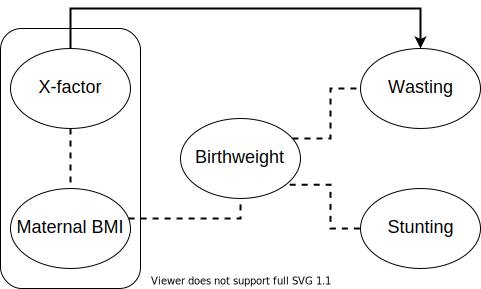

.. role:: underline
    :class: underline

..
  Section title decorators for this document:

  ==============
  Document Title
  ==============

  Section Level 1 (#.0)
  +++++++++++++++++++++

  Section Level 2 (#.#)
  ---------------------

  Section Level 3 (#.#.#)
  ~~~~~~~~~~~~~~~~~~~~~~~

  Section Level 4
  ^^^^^^^^^^^^^^^

  Section Level 5
  '''''''''''''''

  The depth of each section level is determined by the order in which each
  decorator is encountered below. If you need an even deeper section level, just
  choose a new decorator symbol from the list here:
  https://docutils.sourceforge.io/docs/ref/rst/restructuredtext.html#sections
  And then add it to the list of decorators above.

.. _2019_concept_model_vivarium_ciff_sam:

===========================
Vivarium acute malnutrition
===========================

.. contents::
  :local:

+------------------------------------+
| List of abbreviations              |
+=======+============================+
| AM    | acute malnutrition         |
+-------+----------------------------+
| MAM   | moderate acute malnutrtion |
+-------+----------------------------+
| SAM   | Severe acute malnutrition  |
+-------+----------------------------+
| OTP   | Outpatient therapeautic    |
|       | programme                  |
+-------+----------------------------+

1.0 Background
++++++++++++++

Malnutrition is an imbalance between the body’s needs and its use and intake of nutrients. The imbalance can be caused by poor or lacking diet, poor hygiene, disease states, lack of knowledge, and cultural practices, among others. Underweight, stunting, wasting, obesity, and vitamin and mineral deficiencies are all forms of malnutrition. Acute malnutrition (AM), also referred to as wasting, is recent rapid weight loss or a failure to gain weight that results from illness, lack of appropriate foods, or other underlying causes. For an individual, AM is not a chronic condition: children with AM either recover or die and recovered children can relapse to AM1. It is measured in weight-for-height z-scores (WFH) which is a comparison of a child’s WFH from the median value of the global reference population. A z-score between -2 to -3 indicates moderate acute malnutrition (MAM) and a z-score below -3 indicate severe acute malnutrition (SAM). SAM and MAM together is referred to as global acute malnutrition (GAM). Although MAM is less severe, it affects a greater number of children and is associated with more nutrition-related deaths than SAM. Children with AM are at greater risk of death from diarrhea and other infectious diseases than well-nourished children. They also face greater risk of morbidity from infectious diseases and delayed physical and cognitive development. MAM tends to peak during seasonal hunger, disease outbreaks, or during food security ‘shocks’ (e.g. economic or climatic crises) and stresses including humanitarian crises. However, MAM is a problem that not only occurs in emergencies, but also can be endemic in development contexts. MAM should not be neglected, as untreated, it can deteriorate to SAM and possible death. Furthermore, evidence is emerging that repeated episodes of MAM can have a significant impact on stunting; prevention of wasting could potentially increase height in children.

.. _1.1:

1.1 Project overview
--------------------

Wasting is commonly considered an acute condition and is categorized into moderate (MAM), and severe (SAM).  Compared to other manifestations of undernutrition it can be relatively rapid in onset and resolution. While management and treatment of children with MAM and SAM improves recovery, these children are still at risk of relapse. One possible explanation for this is that treatment does not adequately correct the metabolic disturbances or biological mechanisms that lead to wasting and children are left with a deficient immune defense after a wasting episode. Another reason for vulnerability to relapse is that the same environmental or external condition that initially caused the wasting remains, or even that an earlier risk factor during fetal development leaves a child more vulnerable to becoming wasted. Concrete evidence is still lacking on the role of metabolic and persistent environmental factors play in the progression of wasting and relapse, but potential involvement underlines the importance of catching children early in the process of wasting with wasting prevention interventions before these metabolic disturbances occur.

In addition to management and treatment of MAM and SAM, we will model a number of sufficiently robust interventions that directly prevent AM. We will also model interventions that affect risk factors for wasting including birthweight and infectious disease. For each intervention, we obtain current population coverage levels, effect sizes and costs for cost-effectiveness analysis.

We will model wasting in an individual as a collection of distinct states, where an individual is in a single state and may transition to other states following the arrows between states (see wasting exposure model). In GBD, wasting has four categories corresponding to different WFH z-score ranges. Simulants transition forward through the four wasting states by the incidence rate and backward towards healthier states by the recovery rate. Risk factors such as low birthweight (LBW) or infectious diseases increases the forward incidence rates. We will model differential incidence and recovery rates based on intervention coverage: simulants covered by direct wasting preventive interventions will experience lower forward incidence rates compared to those not covered and simulants covered by therapeutic interventions will experience a higher recovery rate than those not covered.  Wasting prevalence and incidence will be reduced either by greater effectiveness of interventions or greater coverage of interventions. Interventions that address birthweight or infectious diseases will affect wasting through the risk factor causal pathway.

This model will allow us to understand and quantify the impact of different combinations of preventive and treatment strategies on wasting and wasting attributable DALYs at the national level.

.. _1.2:

1.2 Literature review
---------------------

.. _2.0:

2.0 Modeling aims and objectives
++++++++++++++++++++++++++++++++

The primary objective of this project is to answer the following question: what is the cost and impact of combinations of preventive and therapeutic strategies for reducing overall wasting prevalence and eliminating SAM in Ethiopia?
We will use data from the 2019 GBD and published literature to inform the parameters for our simulation. We will simulate the changes in MAM and SAM disease incidence, prevalence and mortality from 2022 to 2027 in response to a combination of preventive and therapeutic treatment interventions in Ethiopia.

.. _3.0:

3.0 Causal framework
++++++++++++++++++++

While there are various well-studied risk factors that are associated with becoming wasted, we will only address those that have interventions with sufficient strength of evidence for effect. The risk factors we include in our model include birthweight and infectious diseases.

.. _3.1:

3.1 Causal diagram
------------------

.. image:: DAG_acute_malnutrition.svg

.. todo::

  Add more details on causal diagrams with interventions/GBD risk exposures

.. _3.2:

3.2 Effect sizes
----------------

4.0 Intervention
++++++++++++++++

Historically, prevention research has primarily focused on stunting, and, as a research outcome, wasting has been considered primarily within the context of humanitarian emergencies. Although the volume of studies related to wasting prevention through direct and indirect health-care sector areas has increased in recent years, this evidence base is mixed and often inconclusive. We reviewed the literature from the recent Keats et al 2021 update of effective interventions to address maternal and child malnutrition and selected interventions that have moderate or strong evidence for implementation5. We selected interventions that:

1)	Directly prevent acute malnutrition (SQ-LNS), moderate or severe;
2)	Treat or manage acute malnutrition (GAM treatment), moderate or severe;
3)	Increase rates of exclusive or continued breastfeeding;
4)	Increase birthweight;
5)	Reduce incidence of infectious disease; or
6)	Improve recovery from infectious disease.

.. note::

  Interventions that may improve wasting burden through these pathways that were not considered in our model include:

    - Indoor residual spraying for malaria vector control
    - Vitamin A supplementation
    - Cash transfers

.. _4.1:

4.1 Simulation scenarios
------------------------

**Baseline**
The baseline scenario will project GBD 2019 demographic and disease trends and GBD 2020 exposure trends out from 2022 to 2027 and coverage rates for all preventive and therapeutic interventions will be held constant across the 5 years of the microsimulation to simulate a business-as-usual treatment scenario.

**Alternative scenario 1**
Scale up (immediate, not temporal) the 'effective-coverage' of GAM treatment from baseline level of effective-coverage to scenario level of effective-coverage. Those who are 'effectively covered' have a shorter duration of SAM and MAM episodes. In this first alternative scenario, a larger proportion of simulants will be effectivey covered than baseline. Keeping incidence of MAM (i2) and SAM (i1) the same as baseline, we expect the prevalence of SAM and MAM to decrease with a shorter duration (prevalence ~ incidence x duration).

| Effective coverage = treatment coverage x treatment efficacy
| Not effectively covered = 1 - (treatment coverage x treatment efficacy)

Note: we apply an immediate scale-up rather than a temporal scale-up for now.

See linked documentation for more information :ref:`Treatment and management for acute malnutrition <intervention_wasting_treatment>`

.. list-table:: Effective coverage of GAM treatment program
  :widths: 10 10 10 15 15 15 20
  :header-rows: 1

  * - Exposure
    - Treatment coverage (c)
    - Treatment efficacy (E)
    - Effectivey covered
    - Not effectively covered
    - Reference
    - Note
  * - SAM baseline
    - 48.8% (95% CI: 37.4, 60.4)
    - 70% (95% CI: 64, 76)
    - 0.488 x 0.7 = 0.34
    - 1 - 0.34 = 0.66
    - [Isanaka_etal_2021]_ , [Zw_2020]_
    - This is for SAM-OTP which is ~98% of SAM.
  * - SAM alternative
    - 90%
    - 75%
    - 0.9 x 0.75 = 0.675
    - 1 - 0.675 = 0.325
    - Sphere standards
    - Sphere guideline for efficacy only
  * - MAM baseline
    - 48.8% (95% CI: 37.4, 60.4)
    - 73.1% (95% CI:58.5-87.7) for RUSF
    - 0.488 x 0.731 = 0.34
    - 1 - 0.34 = 0.66
    - [Ackatia_Armah_2015]_
    - Baseline coverage of MAM needs to be updated, efficacy comes from trial and may be too optimistic
  * - MAM alternative
    - 90%
    - 75% for RUSF
    - 0.9 x 0.75 = 0.675
    - 1 - 0.675 = 0.325
    - Sphere standards
    - Sphere guideline for efficacy only

**Alternative scenario 2**
Scale up the SQ-LNS for 6 month+ from 0% at baseline to 90% in addition to the intervention coverage in alternative scenario 1. The SQ-LNS intervention will decrease the **incidence rate of MAM** (i2), without affecting duration (assumption). This is expected to further decrease the prevalence of MAM and SAM.

.. todo::

  Consider targeting SQ-LNS coverage to simulants in SAM treatment.

**Alternative scenario 3**
Scale up of LBWSG interventions from baseline coverage % (TBD) to 90% in addition to the intervention coverage in alternative scenario 2.

**Alternative scenario 4**
Scale-up of vicious cycle interventions (breast-feeding) from baseline coverage % (TBD) to 90% in addition to the intervention coverage in alternative scenario 3.

.. note::

  Intervention coverage in alternative scenarios one through four should be implemented in an additive way such that the treatment intervention is introduced in scenario 1 and is also present for the remaining scenarios (2, 3, and 4), the SQ-LNS intervention is introduced in scenario 2 and is also present for the remaining scenarios 3 and 4, etc.

.. note::

    In the BEP paper reviewer comments, this 90% was deemed to be too optimistic and we are asked to do some sensitivity analysis around this. Hence, we could model a few coverages eg. 50%, 75%, 90%.

.. _ciff_sam_intervention_timing:

4.2 Simulation timeframe and intervention start dates
-----------------------------------------------------

.. list-table:: Simulation and intervention start and end dates
  :widths: 3 3 10
  :header-rows: 1

  * - Description of time point
    - Date
    - Notes
  * - Simulation start
    - 2022-01-01
    - We are running a 1-year "burn-in" period at baseline before starting any interventions. 
  * - Simulation end
    - 2026-12-31
    - The simulation will run for a total of 6 years
  * - Intervention start
    - 2023-01-01
    - All interventions in all alternative scenarios should start on the same date, 2 years after the simulation starts
  * - Intervention end
    - 2026-12-31
    - All interventions should run until the end of the sim

.. _5.0:

5.0 Vivarium modelling components
+++++++++++++++++++++++++++++++++

.. _5.1:

5.1 Vivarium concept model diagram
----------------------------------

.. image:: am_concept_model_diagram.svg

5.1.1 Cause Models
~~~~~~~~~~~~~~~~~~

* :ref:`Diarrheal Diseases (GBD 2019) <2019_cause_diarrhea>`

* :ref:`Lower Respiratory Infections (GBD 2019) <2019_cause_lower_respiratory_infections>`

* :ref:`Measles (GBD 2019) <2019_cause_measles>`

5.1.2 Joint Cause-Risk Models
~~~~~~~~~~~~~~~~~~~~~~~~~~~~~

* :ref:`Child Wasting / Protein Energy Malnutrition (GBD 2020) <2020_risk_exposure_wasting_state_exposure>`

5.1.3 Risk Exposure Models
~~~~~~~~~~~~~~~~~~~~~~~~~~

* Non-exclusive Breastfeeding

* Discontinued Breastfeeding

* :ref:`Child Stunting (GBD 2020) <2020_risk_exposure_child_stunting>`

* :ref:`Low Birthweight and Short Gestation (GBD 2019) <2019_risk_exposure_lbwsg>`

* :ref:`Maternal Body Mass Index <2019_risk_exposure_maternal_bmi>`

5.1.4 Risk Effects Models
~~~~~~~~~~~~~~~~~~~~~~~~~

* Non-exclusive Breastfeeding Risk Effects

* Discontinued Breastfeeding Risk Effects

* Child Stunting Risk Effects

* Child Wasting Risk Effects

* :ref:`Low Birthweight and Short Gestation Risk Effects (GBD 2019) <2019_risk_effect_lbwsg>`

5.1.5 Risk-Risk Correlation Models
~~~~~~~~~~~~~~~~~~~~~~~~~~~~~~~~~~

* :ref:`Birthweight and child wasting risk-risk correlation <2019_risk_correlation_birthweight_wasting>`

* :ref:`Birthweight and child stunting risk-risk correlation <2019_risk_correlation_birthweight_stunting>`

* :ref:`Maternal BMI and birthweight <2019_risk_correlation_maternal_bmi_birthweight>`

The following diagram represents the resulting model correlation structure in our simulation (including the x-factor which is described later in this document and is perfectly correlated with maternal BMI exposure and affects wasting incidence rates). The figure represents relationships that are explicitly modeled in our simulation. However, directly modeling these relationships will result in an induction of correlation between wasting and stunting through their respective correlations with birthweight. Additionally, lower birthweight and stunting will also be associated with greater wasting incidence rates through their correlations with the x-factor. The age-specific correlation between wasting and stunting risk exposures in our model should be evaluated in the model results and compared to external validation sources, described in the :ref:`wasting and stunting correlation document <2019_risk_correlation_wasting_stunting>`.

For correlated risks that affect the same outcomes in our simulation (just wasting and stunting in this model), the joint PAF calculation rather than multiplicative PAF calculation should be used for outcomes affected by wasting and stunting (see the :ref:`risk correlation proposal document <2017_risk_models>` for details). The joint PAF equation is shown below for convenient reference.

.. math::
  PAF_{joint} = 1 - \frac{1}{\frac{1}{n}\sum_{i=1}^{n} RR_1^{e1_i} \cdot RR_2^{e2_i}}

5.1.6 Feedback Loop Models
~~~~~~~~~~~~~~~~~~~~~~~~~~

* Fedback Between Wasting and Infectious Diseases (Diarrhea)

5.1.7 Intervention Models
~~~~~~~~~~~~~~~~~~~~~~~~~

* :ref:`Small quantity lipid based nutrient supplements (SQ-LNS) <lipid_based_nutrient_supplements>`

* :ref:`Treatment and management for acute malnutrition <intervention_wasting_treatment>`

* :ref:`Maternal Supplementation: Targeted Balanced Energy Protein and Maternal Micronutrient Supplementation <maternal_supplementation_intervention>`

* :ref:`Insecticide treated nets <insecticide_treated_nets>`

.. warning::

  :ref:`Intermittent malaria preventive therapy for pregnant women <maternal_malaria_prevention_therapy>`

  We may not model the intermittent malaria preventive therapy for pregnant women given that this intervention is not recommended in Ethiopia. The decision to include/exclude this intervention is pending more investigation into the national recommendation and model builds for this intervention should not begin until the decision is finalized.

* Kangaroo care for preterm and low birthweight infants

* Breastfeeding promotion

* Preventive and therapeutic zinc

.. _5.2:

5.2 Demographics
----------------

.. _5.2.1:

5.2.1 Population description
~~~~~~~~~~~~~~~~~~~~~~~~~~~~

- Location: Ethiopia
- Cohort type: Prospective open cohort of 0-5 years
- Size of largest starting population: 100,000 simulants
- Time span: Jan 1, 2022 to Dec 31, 2026
- Time step: 0.5 days

.. _5.2.2:

5.2.2 Population of interest
~~~~~~~~~~~~~~~~~~~~~~~~~~~~

.. _5.3:

5.3 Models
----------

.. list-table:: Model Versions
   :header-rows: 1

   * - Model number
     - Description
     - Note
   * - 1
     - Cause and mortality models
     - 
   * - 2
     - Exposure model stunting and wasting without baseline treatment tracking. Baseline only.
     - 
   * - 3
     - SQ-LNS baseline and intervention scale-up
     - 
   * - 4
     - SAM and MAM treatment baseline and treatment scale-up
     - Excluded wasting transitions among simulants under 6 months of age
   * - 4.5
     - X-factor 
     - x-factor exposure based on GBD maternal underweight in this model version (to be updated to maternal BMI risk exposure eventually)

.. note::

  Multiple iterations of numbered model versions were performed with incremental model improvements and may not be reflected in the table above.

  Model status is tracked and updated on the project HUB page, `found here <https://hub.ihme.washington.edu/display/COS/Severe+Acute+Malnutrition+GBD+2019+Simulation>`_.

.. _5.4:

5.4 X-Factor
------------

The x-factor is a risk exposure that tries to capture the differential risk experienced by some children who may experience more relapses of wasting. We believe this is an important component of wasting epidemiology to capture [see Brain Trust notes with Chris Murray for discussion of adding this component to the model]. There are many risk factors that have been described in the literature that pre-dispose children to wasting including maternal education, household food insecurity, family size, water and sanitation. However, we have not found any conclusive evidence yet of a single x-factor is or its effect size.

.. note::

  See Nicole's zotero library folder 'Relapse' and 'Determinants' to see studies on this topic.

**Risk exposure**

As we do not have a precise definition of the x-factor risk exposure, we will model the exposure to be equal to and perfectly correlated with the :ref:`maternal BMI risk exposure <2019_risk_exposure_maternal_bmi>`. We are using maternal undernutrition as a **proxy** for household food insecurity and other factors that have been suggested determinants of child malnutrition. [Na_2020]_ [Mohammed_2018]_ 

**Risk effect**

We do not have direct evidence or data for the risk effect of the x-factor *proxied by maternal undernutrition* on wasting incidence (from the previous source state). From the [Na_2020]_, table 4 shows the odds of infant malnutrition (wasting, stunting and underweight) at 6 months of age in infants from food-insecure households as compared with infants from food-secure households (reference group). For rare outcomes, the prevalence risk ratio, incidence rate ratio and prevalence odds ratios approximate each other which is likely to be true for SAM (<5% prevalence), but not true for MAM and MILD wasting. Hence we model a range of risk effects as a sensitivity analysis with the scale of the effect informed by [Na_2020]_. Below table is a suggested range of risk-effect values to model.

.. csv-table:: X-factor risk effect sensitivity analysis
   :file: x_factor_risk_effect.csv
   :widths: 30, 10, 10, 10, 10
   :header-rows: 1

The risk effect (relative rate ratio) of incidence would be applied as such (breaking out the exposed vs non-exposed incidence from the exposure weighted overall incidence):

 - :math:`i_{x1} = i_{wasting|markov} (1-PAF) \times rr_{x_{factor}}`
 - :math:`i_{x0} = i_{wasting|markov} \times (1-PAF)`

 where :math:`i_{wasting|markov}` are the wasting transition incidences from the Markov calibration (with vicious cycle in the final model). And the PAF is calculated as

 PAF = :math:`\frac{(\sum_{x\_factor_{cat_i} prevalence * rr_{x_{factor\_cat_i}}})-1}{\sum_{x\_factor_{cat_i} prevalence * rr_{x_{factor\_cat_i}}}}`

 - where x_factor_cati_prevalence is the x-factor exposure category prevalence for exposed (i = 1) or unexposed (i = 0)
 - rr_x_factor_cati is the relative rate ratio for exposed (i = 1) or unexposed (i = 0).
 - Note that there are 4 wasting states so there should be a PAF between every wasting state transition where the susceptible population is the source wasting state, the exposure is the 'x-factor' and the outcome is the sink wasting state.

- Note diarrhea (vicious cycle) cycle have effects on wasting incidences. Hence the x-factor should be broken out for the incidences with/without diarrhea calibrated from the Markov matrix. In our final model, we should end up with 4 sets (2 diarrhea states x 2 x-factor states) of 3 incidences (i1-3) for a total of 12 incidence rates.
- Note also that SQ-LNS affects wasting transition incidence from mild to mam. The protective effects of SQ-LNS (if covered) would be applied to the incidences from mild to mam corresponding to diarrhea and x-factor exposure.
- Let us assume that the 'x-factor' does not have differential effects on treatment recovery rates.

.. todo::

  - A more thorough literature review and support for use of this proxy should be done to strengthen our argument.
  - We have decided not to model the effect of x-factor on stunting for now. We will look more thoroughly on its effect on stunting and whether to model a direct effect of wasting on stunting as we do more research.
  - may be helpful to put this in the concept model diagram to keep track of how different factors affect incidence rates

      mam_incidence_i = mam_incidence_given_diarrheal_state_i * (1 - PAF_xfactor) * RR_xfactor_i * SQLNS_treatment_RR_i

      sam_incidence_i = sam_incidence_given_diarrheal_state_i * (1 - PAF_xfactor) * RR_xfactor_i

  - note that SQ-LNS only affects MILD to MAM incidence.

.. todo::

  Be careful of what the 'x-factor' effect size represents. While being proxied by m undernourishment exposure, it is **not** the only causal effect of m undernourishment on wasting. That's why we are using a series of RR to test out this effect since we can't find it directly in the literature. (although the Na paper has the ORs). We might need to think through how to appropriately use proxies, especially since we are also modelling m undernourishment as a risk exposure as well. So m undernourishment is acting as a risk exposure for itself AND also proxy for other risks. Perhaps we need to be specific and say the x-factor effect is all the 'other-stuff' without m undernourishment and we model m nourishment effect in addition to x-factor?

  We would need to think through carefully this web of relationships that includes x-factor, m undernourishment (m undernourishment and x-factor will be perfectly correlated), lbwsg, wasting and stunting. We need to be specific and careful about when we are referring to m undernourishment as risk exposure for itself or m nourishment as proxy for other risks (the x-factor) and use the appropriate effect sizes.

  Nathaniel asked if we should have a causal arrow from mm undernourishment to wasting. My thinking is that we need to think through what we are capturing through an indirect effect (through mediator), a direct effect and what the total effect is. For example, we are capturing this mediated effect through lbwsg [mm undernourishment (a)--> lbwsg (b)--> wasting]. So if we also have a direct effect, [mm undernourishment (c)--> wasting], we will end up with [Total effect of mm undernourishment on wasting = ab + c].  Not sure if the literature will have sufficient information for us to figure out all these effect pathways. So maybe we just use the effect of (a) and (b)?

.. _5.5:

5.5 Desired outputs
-------------------

Final outputs to report in manuscript

.. csv-table:: Final outcomes table to report in manuscript
   :file: final_outcomes_output_shell.csv
   :widths: 20, 20, 10, 10, 10, 10, 10, 10, 10
   :header-rows: 1

.. note::

  draft table to be refined

.. _5.6:

5.6 Output meta-table shell
---------------------------

.. _6.0:

6.0 Back of the envelope calculations
+++++++++++++++++++++++++++++++++++++

.. _7.0:

7.0 Limitations
+++++++++++++++

8.0 References
+++++++++++++++

.. [Isanaka_etal_2021]

  View `Isanaka 2021`_

    Improving estimates of the burden of severe wasting: analysis of secondary prevalence and incidence data from 352 sites

.. _`Isanaka 2021`: https://gh.bmj.com/content/6/3/e004342

.. [Zw_2020]

  View `Zw et al 2020`_

    Treatment outcomes of severe acute malnutrition and predictors of recovery in under-five children treated within outpatient therapeutic programs in Ethiopia: a systematic review and metaanalysis

.. _`Zw et al 2020`: https://bmcpediatr.biomedcentral.com/articles/10.1186/s12887-020-02188-5

.. [Ackatia_Armah_2015]

  View `Ackatia-Armah et al 2015`_

    Malian children with moderate acute malnutrition who are treated with lipid-based dietary supplements have greater weight gains and recovery rates than those treated with locally produced cereal-legume products: a community-based, cluster-randomized trial

.. _`Ackatia-Armah et al 2015`: https://pubmed-ncbi-nlm-nih-gov.offcampus.lib.washington.edu/25733649/

.. [Na_2020]

  View `Na 2020`_

    Maternal nutritional status mediates the linkage between household food insecurity and mid-infancy size in rural Bangladesh

.. _`Na 2020`: https://pubmed-ncbi-nlm-nih-gov.offcampus.lib.washington.edu/32102702/

.. [Mohammed_2018]

  View `Mohammed 2018`_

    Bayesian Gaussian regression analysis of malnutrition for children under five years of age in Ethiopia, EMDHS 2014

.. _`Mohammed 2018`: https://pubmed-ncbi-nlm-nih-gov.offcampus.lib.washington.edu/29636912/
