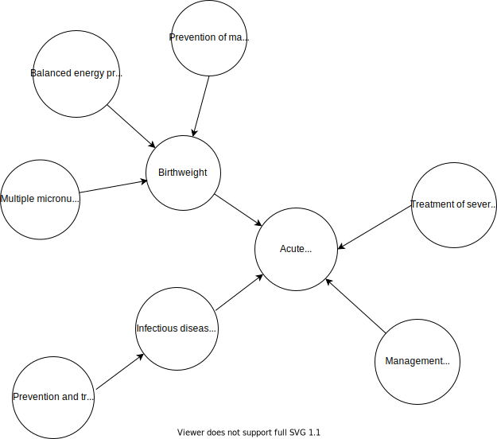

.. role:: underline
    :class: underline

..
  Section title decorators for this document:

  ==============
  Document Title
  ==============

  Section Level 1 (#.0)
  +++++++++++++++++++++

  Section Level 2 (#.#)
  ---------------------

  Section Level 3 (#.#.#)
  ~~~~~~~~~~~~~~~~~~~~~~~

  Section Level 4
  ^^^^^^^^^^^^^^^

  Section Level 5
  '''''''''''''''

  The depth of each section level is determined by the order in which each
  decorator is encountered below. If you need an even deeper section level, just
  choose a new decorator symbol from the list here:
  https://docutils.sourceforge.io/docs/ref/rst/restructuredtext.html#sections
  And then add it to the list of decorators above.

.. _2019_concept_model_vivarium_ciff_sam:

===========================
Vivarium acute malnutrition
===========================

.. contents::
  :local:

+------------------------------------+
| List of abbreviations              |
+=======+============================+
| AM    | acute malnutrition         |
+-------+----------------------------+
| MAM   | moderate acute malnutrtion |
+-------+----------------------------+
| SAM   | Severe acute malnutrition  |
+-------+----------------------------+

1.0 Background
++++++++++++++

Malnutrition is an imbalance between the body’s needs and its use and intake of nutrients. The imbalance can be caused by poor or lacking diet, poor hygiene, disease states, lack of knowledge, and cultural practices, among others. Underweight, stunting, wasting, obesity, and vitamin and mineral deficiencies are all forms of malnutrition. Acute malnutrition (AM), also referred to as wasting, is recent rapid weight loss or a failure to gain weight that results from illness, lack of appropriate foods, or other underlying causes. For an individual, AM is not a chronic condition: children with AM either recover or die and recovered children can relapse to AM1. It is measured in weight-for-height z-scores (WFH) which is a comparison of a child’s WFH from the median value of the global reference population. A z-score between -2 to -3 indicates moderate acute malnutrition (MAM) and a z-score below -3 indicate severe acute malnutrition (SAM). SAM and MAM together is referred to as global acute malnutrition (GAM). Although MAM is less severe, it affects a greater number of children and is associated with more nutrition-related deaths than SAM. Children with AM are at greater risk of death from diarrhea and other infectious diseases than well-nourished children. They also face greater risk of morbidity from infectious diseases and delayed physical and cognitive development. MAM tends to peak during seasonal hunger, disease outbreaks, or during food security ‘shocks’ (e.g. economic or climatic crises) and stresses including humanitarian crises. However, MAM is a problem that not only occurs in emergencies, but also can be endemic in development contexts. MAM should not be neglected, as untreated, it can deteriorate to SAM and possible death. Furthermore, evidence is emerging that repeated episodes of MAM can have a significant impact on stunting; prevention of wasting could potentially increase height in children.

.. _1.1:

1.1 Project overview
--------------------

Wasting is commonly considered an acute condition and is categorized into moderate (MAM), and severe (SAM).  Compared to other manifestations of undernutrition it can be relatively rapid in onset and resolution. While management and treatment of children with MAM and SAM improves recovery, these children are still at risk of relapse. One possible explanation for this is that treatment does not adequately correct the metabolic disturbances or biological mechanisms that lead to wasting and children are left with a deficient immune defense after a wasting episode. Another reason for vulnerability to relapse is that the same environmental or external condition that initially caused the wasting remains, or even that an earlier risk factor during fetal development leaves a child more vulnerable to becoming wasted. Concrete evidence is still lacking on the role of metabolic and persistent environmental factors play in the progression of wasting and relapse, but potential involvement underlines the importance of catching children early in the process of wasting with wasting prevention interventions before these metabolic disturbances occur.

In addition to management and treatment of MAM and SAM, we will model a number of sufficiently robust interventions that directly prevent AM. We will also model interventions that affect risk factors for wasting including birthweight and infectious disease. For each intervention, we obtain current population coverage levels, effect sizes and costs for cost-effectiveness analysis.

We will model wasting in an individual as a collection of distinct states, where an individual is in a single state and may transition to other states following the arrows between states (see wasting exposure model). In GBD, wasting has four categories corresponding to different WFH z-score ranges. Simulants transition forward through the four wasting states by the incidence rate and backward towards healthier states by the recovery rate. Risk factors such as low birthweight (LBW) or infectious diseases increases the forward incidence rates. We will model differential incidence and recovery rates based on intervention coverage: simulants covered by direct wasting preventive interventions will experience lower forward incidence rates compared to those not covered and simulants covered by therapeutic interventions will experience a higher recovery rate than those not covered.  Wasting prevalence and incidence will be reduced either by greater effectiveness of interventions or greater coverage of interventions. Interventions that address birthweight or infectious diseases will affect wasting through the risk factor causal pathway.

This model will allow us to understand and quantify the impact of different combinations of preventive and treatment strategies on wasting and wasting attributable DALYs at the national level.

.. _1.2:

1.2 Literature review
---------------------

.. _2.0:

2.0 Modeling aims and objectives
++++++++++++++++++++++++++++++++

The primary objective of this project is to answer the following question: what is the cost and impact of combinations of preventive and therapeutic strategies for reducing overall wasting prevalence and eliminating SAM in Ethiopia?
We will use data from the 2019 GBD and published literature to inform the parameters for our simulation. We will simulate the changes in MAM and SAM disease incidence, prevalence and mortality from 2022 to 2027 in response to a combination of preventive and therapeutic treatment interventions in Ethiopia.

.. _3.0:

3.0 Causal framework
++++++++++++++++++++

While there are various well-studied risk factors that are associated with becoming wasted, we will only address those that have interventions with sufficient strength of evidence for effect. The risk factors we include in our model include birthweight and infectious diseases.

.. _3.1:

3.1 Causal diagram
------------------

**Outcome (O)**:

**Most proximal determinant/exposure (E)**:

**Confounders (C)**:

**Effect modifiers**:

**Mediators (M)**:

.. _3.2:

3.2 Effect sizes
----------------

4.0 Intervention
++++++++++++++++

Historically, prevention research has primarily focused on stunting, and, as a research outcome, wasting has been considered primarily within the context of humanitarian emergencies. Although the volume of studies related to wasting prevention through direct and indirect health-care sector areas has increased in recent years, this evidence base is mixed and often inconclusive. We reviewed the literature from the recent Keats et al 2021 update of effective interventions to address maternal and child malnutrition and selected interventions that have moderate or strong evidence for implementation5. We selected interventions that:

1)	Directly prevent acute malnutrition, moderate or severe;
2)	Treat or manage acute malnutrition, moderate or severe;
3)	Increase rates of exclusive or continued breastfeeding;
4)	Increase birthweight;
5)	Reduce incidence of infectious disease; or
6)	Improve recovery from infectious disease.

.. _4.1:

4.1 Simulation scenarios
------------------------

**Baseline**
The baseline scenario will project GBD 2019 demographic and disease trends and GBD 2020 exposure trends out from 2022 to 2027 and coverage rates for all preventive and therapeutic interventions will be held constant across the 5 years of the microsimulation to simulate a business-as-usual treatment scenario.

**Alternative scenario 1**
Scale up the 'effective-coverage' of GAM treatment from baseline level of effective-coverage to scenario level of effective-coverage. Those who are 'effectively covered' have a shorter duration of SAM and MAM episodes. In this first alternative scenario, a larger proportion of simulants will be effectivey covered. Keeping incidence of MAM (i2) and SAM (i1) the same as baseline, we expect the prevalence of SAM and MAM to decrease  with a shorter duration (prevalence ~ incidence x duration).    

| Effective coverage = treatment coverage x treatment efficacy
| Not effectively covered = 1 - (treatment coverage x treatment efficacy)

.. list-table:: Effective coverage of GAM treatment program
  :widths: 10 10 10 15 15 15 20 
  :header-rows: 1

  * - Exposure 
    - Treatment coverage
    - Treatment efficacy
    - Effectivey covered
    - Not effectively covered
    - Reference
    - Note
  * - SAM baseline 
    - 48.8% (95% CI: 37.4, 60.4)
    - 70% (95% CI: 64, 76)
    - 0.488 x 0.7 = 0.34
    - 1 - 0.34 = 0.66
    - [Isanaka_etal_2021]_ , [Zw_2020]_
    - This is for SAM-OTP which is ~98% of SAM.  
  * - SAM alternative 
    - 90%
    - 75% 
    - 0.9 x 0.75 = 0.675
    - 1 - 0.675 = 0.325
    - Sphere standards
    - Sphere guideline for efficacy only 
  * - MAM baseline 
    - 48.8% (95% CI: 37.4, 60.4)
    - 73.1% for RUSF
    - 0.488 x 0.731 = 0.34
    - 1 - 0.34 = 0.66
    - [Ackatia_Armah_2015]_
    - Baseline coverage of MAM needs to be updated, efficacy comes from trial and may be too optimistic
  * - MAM alternative 
    - 90%
    - 75% for RUSF
    - 0.9 x 0.75 = 0.675
    - 1 - 0.675 = 0.325
    - Sphere standards
    - Sphere guideline for efficacy only 
 

**Alternative scenario 2**
Scale up the SQ-LNS for 6 month+ from 0% at baseline to 90%. The SQ-LNS intervention will decrease the **incidence rate of MAM** (i2), without affecting duration (assumption). This is expected to further decrease the prevalence of MAM and SAM.   

**Alternative scenario 3**
Scale up of LBWSG interventions from baseline coverage % (TBD) to 90%. 

**Alternative scenario 4**
Scale-up of vicious cycle interventions (breast-feeding) from baseline coverage % (TBD) to 90%. 

.. note:: 
    
    In the BEP paper reviewer comments, this 90% was deemed to be too optimistic and we are asked to do some sensitivity analysis around this. Hence, we could model a few coverages eg. 50%, 75%, 90%. 

.. _5.0:

5.0 Vivarium modelling components
+++++++++++++++++++++++++++++++++

.. _5.1:

5.1 Vivarium concept model diagram
----------------------------------

.. image:: am_concept_model_diagram.svg

5.1.1 Cause Models
~~~~~~~~~~~~~~~~~~

* :ref:`Diarrheal Diseases (GBD 2019) <2019_cause_diarrhea>`

* :ref:`Lower Respiratory Infections (GBD 2019) <2019_cause_lower_respiratory_infections>`

* :ref:`Measles (GBD 2019) <2019_cause_measles>`

5.1.2 Joint Cause-Risk Models
~~~~~~~~~~~~~~~~~~~~~~~~~~~~~

* :ref:`Child Wasting / Protein Energy Malnutrition (GBD 2020) <2020_risk_exposure_wasting_state_exposure>`

5.1.3 Risk Exposure Models
~~~~~~~~~~~~~~~~~~~~~~~~~~

* Non-exclusive Breastfeeding

* Discontinued Breastfeeding

* :ref:`Child Stunting (GBD 2020) <2020_risk_exposure_child_stunting>`

* Low Birthweight and Short Gestation (GBD 2019)

5.1.4 Risk Effects Models
~~~~~~~~~~~~~~~~~~~~~~~~~

* Non-exclusive Breastfeeding Risk Effects

* Discontinued Breastfeeding Risk Effects

* Child Stunting Risk Effects

* Child Wasting Risk Effects

* :ref:`Low Birthweight and Short Gestation Risk Effects (GBD 2019) <2019_risk_effect_lbwsg>`

5.1.5 Risk-Risk Correlation Models
~~~~~~~~~~~~~~~~~~~~~~~~~~~~~~~~~~

* LBWSG-Stunting Correlation

* LBWSG-Wasting Correlation

5.1.6 Feedback Loop Models
~~~~~~~~~~~~~~~~~~~~~~~~~~

* Fedback Between Wasting and Infectious Diseases (Diarrhea, LRI, Measles)

5.1.7 Intervention Models
~~~~~~~~~~~~~~~~~~~~~~~~~

* :ref:`Small quantity lipid based nutrient supplements (SQ-LNS) <lipid_based_nutrient_supplements>`

* :ref:`Treatment and management for acute malnutrition <intervention_wasting_treatment>`

.. _5.2:

5.2 Demographics
----------------

.. _5.2.1:

5.2.1 Population description
~~~~~~~~~~~~~~~~~~~~~~~~~~~~

- Location: Ethiopia
- Cohort type: Prospective open cohort of 0-5 years
- Size of largest starting population: 100,000 simulants
- Time span: Jan 1, 2022 to Dec 31, 2026
- Time step: 1 day

.. _5.2.2:

5.2.2 Population of interest
~~~~~~~~~~~~~~~~~~~~~~~~~~~~~~~~~

.. _5.3:

5.3 Models
----------

.. _5.3.1:

5.3.1 Model 1
~~~~~~~~~~~~~

.. _5.3.2:

5.3.2 Model 2
~~~~~~~~~~~~~

.. _5.3.3:

5.3.3 Model 3
~~~~~~~~~~~~~

.. _5.3.4:

5.3.4 Treatment model
~~~~~~~~~~~~~~~~~~~~~

.. _5.4:

5.4 Desired outputs
-------------------

.. _5.5:

5.5 Output meta-table shell
---------------------------

.. _6.0:

6.0 Back of the envelope calculations
+++++++++++++++++++++++++++++++++++++

.. _7.0:

7.0 Limitations
+++++++++++++++

8.0 References
+++++++++++++++

.. [Isanaka_etal_2021]

  View `Isanaka 2021`_

    Improving estimates of the burden of severe wasting: analysis of secondary prevalence and incidence data from 352 sites

.. _`Isanaka 2021`: https://gh.bmj.com/content/6/3/e004342

.. [Zw_2020] 
  
  View `Zw et al 2020`_

    Treatment outcomes of severe acute malnutrition and predictors of recovery in under-five children treated within outpatient therapeutic programs in Ethiopia: a systematic review and metaanalysis

.. _`Zw et al 2020`: https://bmcpediatr.biomedcentral.com/articles/10.1186/s12887-020-02188-5

.. [Ackatia_Armah_2015] 
  
  View `Ackatia-Armah et al 2015`_

    Malian children with moderate acute malnutrition who are treated with lipid-based dietary supplements have greater weight gains and recovery rates than those treated with locally produced cereal-legume products: a community-based, cluster-randomized trial

.. _`Ackatia-Armah et al 2015`: https://pubmed-ncbi-nlm-nih-gov.offcampus.lib.washington.edu/25733649/