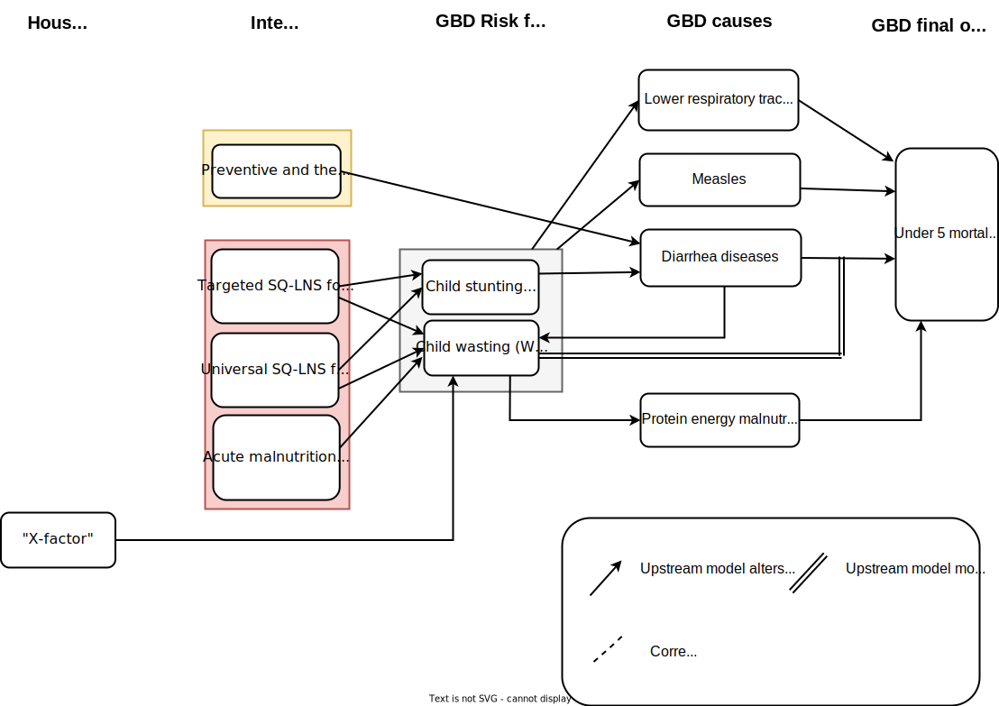

.. role:: underline
    :class: underline

..
  Section title decorators for this document:

  ==============
  Document Title
  ==============

  Section Level 1 (#.0)
  +++++++++++++++++++++

  Section Level 2 (#.#)
  ---------------------

  Section Level 3 (#.#.#)
  ~~~~~~~~~~~~~~~~~~~~~~~

  Section Level 4
  ^^^^^^^^^^^^^^^

  Section Level 5
  '''''''''''''''

  The depth of each section level is determined by the order in which each
  decorator is encountered below. If you need an even deeper section level, just
  choose a new decorator symbol from the list here:
  https://docutils.sourceforge.io/docs/ref/rst/restructuredtext.html#sections
  And then add it to the list of decorators above.

.. _2020_concept_model_vivarium_ciff_sam:

===================================
Vivarium Acute Malnutrition Phase 2
===================================

.. contents::
  :local:

1.0 Project overview
++++++++++++++++++++

This simulation will build on :ref:`phase I of the severe acute malnutrition elimination model, described here <2019_concept_model_vivarium_ciff_sam>`. 

The goal of this simulation is to investigate the question:

  - What is the required treatment volume of MAM (and SAM) under various scale-up and targeting strategies for joint community management of acute malnutrition (for SAM and/or MAM) and small quantity lipid-based nutrient supplementation (SQ-LNS). 

    We will begin to investigate this question in two waves:

      1. Universal SQ-LNS coverage scale-up strategies (no x-factor)

      2. Targeted SQ-LNS coverage scale-up strategies (untilizing x-factor)

`Additional background on the project and resources for publication can be found here. <https://uwnetid.sharepoint.com/:w:/r/sites/ihme_sim_science_collaborations/_layouts/15/Doc.aspx?sourcedoc=%7BFE3E9389-829B-4BEC-A425-7487A1A510A8%7D&file=Updated%20draft%20introduction%20outline.docx&action=default&mobileredirect=true>`_

2.0 Simulation design
+++++++++++++++++++++++++++++

2.1 Default specifications
---------------------------

.. list-table:: Default simulation specifications
  :header-rows: 1

  * - Parameter
    - Value
    - Note
  * - Location(s)
    - Ethiopia (ID: 179)
    - 
  * - Number of draws
    - 20
    - Needs to be refined based on test runs
  * - Number of seeds (per draw)
    - 10
    - Needs to be refined based on test runs
  * - Population size (per seed)
    - 10,000
    - Needs to be refined based on test runs
  * - Age start
    - Six months
    - 
  * - Age end
    - 5 years
    - 
  * - Exit age
    - 5 years
    - 
  * - Simulation start date
    - 2021-07-01
    - 
  * - Simulation observation start date
    - 2022-01-01
    - Starts six months after x-factor burn-in
  * - Simulation end date
    - 2026-12-31
    - 
  * - Timestep
    - 4 days
    - Needs to be validated

2.2 Scenarios
-------------

Simulated scenarios will involve some change of coverage/efficacy parameter values for the following interventions, in combination or isolation:

  1. SAM treatment

  2. MAM treatment

  3. SQ-LNS

    * 3a. Universal
    * 3b. Targeted to those with mild wasting
    * 3c. Targeted to those recovered from SAM/MAM treatment

.. list-table:: Intervention coverage and efficacy parameters
  :header-rows: 1

  * - Intervention
    - Baseline
    - Scale-up target
    - Zero coverage
  * - 1: SAM treatment
    - Baseline values for :math:`C_{SAM}` and :math:`E_{SAM}`, :ref:`defined here <wasting-treatment-baseline-parameters>`
    - :math:`C_{SAM} = 0.7`

      :math:`E_{SAM} = 0.75`
    - :math:`C_{SAM} = 0`
      
      :math:`E_{SAM} = \text{baseline value}`
  * - 2: MAM treatment
    - Baseline values for :math:`C_{MAM}` and :math:`E_{MAM}`, :ref:`defined here <wasting-treatment-baseline-parameters>`
    - :math:`C_{MAM} = 0.7`
      
      :math:`E_{MAM} = 0.75`
    - :math:`C_{MAM} = 0`
      
      :math:`E_{MAM} = \text{baseline value}`
  * - 3: SQ-LNS (all sub-interventions)
    - :math:`C_{SQLNS} = 0`
    - :math:`C_{SQLNS} = 0.7`
    - :math:`C_{SQLNS} = 0`

For scenarios that feature a scale-up of one of the above interventions, intervention parameters should scale between the baseline and the scale-up values according to :ref:`the algorithm described here <ciff_scale_up_algorithm>` that was used for phase I of the acute malnutrition simulation. For scenarios that feature "zero coverage" of one or more of the above interventions, intervention coverage should immediately change from the baseline to the zero coverage values at the date that the intervention scale-up would have occured according to the algorithm linked above. Intervention parameters should remain at the zero coverage values for the remainder of the simulation.

.. list-table:: Scenarios
  :header-rows: 1

  * - Scenario
    - Intervention 1
    - Intervention 2
    - Intervention 3
    - Note
  * - 1: Baseline
    - Baseline
    - Baseline
    - Baseline (0%)
    - 
  * - 2: MAM and SAM treatment scale-down
    - Zero coverage
    - Zero coverage
    - Baseline (0%)
    - 
  * - 3: SAM treatment scale-up
    - Scale-up to target
    - Baseline*
    - Baseline (0%)
    - 
  * - 4: MAM treatment scale-up
    - Baseline*
    - Scale-up to target
    - Baseline (0%)
    - 
  * - 5: MAM and SAM treatment scale-up
    - Scale-up to target
    - Scale-up to target
    - Baseline (0%)
    - 
  * - 6: Universal SQ-LNS + treatment scale-up
    - Scale-up
    - Scale-up
    - Scale-up 3a
    - 
  * - 7: SQ-LNS to mildly wasted
    - Scale-up
    - Scale-up
    - Scale-up 3b
    - [Second wave that requires x-factor inclusion]
  * - 8: SQ-LNS to SAM and MAM treatment
    - Scale-up
    - Scale-up
    - Scale-up 3c
    - [Second wave that requires x-factor inclusion]

.. todo::

  Consider if cells marked with an asterisk (*) should be replaced with zero coverage instead of baseline

.. note::

  We may add/remove scenarios based on results of existing list

  Additional scenarios to consider include one in which SQ-LNS coverage is scaled-up to baseline coverage of CMAM screenings (:math:`C_{SAM}`) and coverage of MAM and SAM treatment are increased by some magnitude as well. There is some evidence to suggest that administering SQ-LNS at CMAM screenings may increase screening coverage [Huybregts-et-al-2019]_; however, we chose not to model this scenario as the paper ultimately did not find an impact on *treatment* coverage. As more evidence on this topic becomes available, we may consider including this scenario in our model.

2.3 Modelling components
------------------------------

2.3.1 Concept model diagram
~~~~~~~~~~~~~~~~~~~~~~~~~~~~~~~~~~~~

.. note::

  X-factor will be included in the second wave of model runs/scenarios only

2.3.1.1 Cause Models
^^^^^^^^^^^^^^^^^^^^^

* :ref:`Diarrheal Diseases (GBD 2019) <2019_cause_diarrhea>`

* :ref:`Lower Respiratory Infections (GBD 2019) <2019_cause_lower_respiratory_infections>`

* :ref:`Measles (GBD 2019) <2019_cause_measles>`

2.3.1.2 Joint Cause-Risk Models
^^^^^^^^^^^^^^^^^^^^^^^^^^^^^^^^^

* :ref:`Child Wasting / Protein Energy Malnutrition (GBD 2020) <2020_risk_exposure_wasting_state_exposure>`

2.3.1.3 Risk Exposure Models
^^^^^^^^^^^^^^^^^^^^^^^^^^^^^

* :ref:`Child Stunting Risk Exposure (GBD 2020) <2020_risk_exposure_child_stunting>`

* :ref:`X-factor Risk Exposure <2019_risk_exposure_x_factor>`

2.3.1.4 Risk Effects Models
^^^^^^^^^^^^^^^^^^^^^^^^^^^^

* Child Stunting Risk Effects (GBD 2020)

* :ref:`Child Wasting Risk Effects (GBD 2020) <2019_risk_effect_wasting>`, NOTE: use the :ref:`risk effect on diarrheal diseases described here <standard-wasting-effects>`

* :ref:`X-factor Risk Effects <2019_risk_effect_x_factor>`, for wave 2 model runs only

.. note::

  Do not incude :ref:`Diarrheal Diseases Risk Effects <2019_risk_effect_diarrheal_diseases>`

2.3.1.5 Intervention Models
^^^^^^^^^^^^^^^^^^^^^^^^^^^^^

.. todo::

  Consider adding mortality impacts? We're thinking no for now.

* :ref:`Small quantity lipid based nutrient supplements universal coverage (SQ-LNS) <lipid_based_nutrient_supplements>` 

* :ref:`Treatment and management for acute malnutrition <intervention_wasting_treatment>`

2.4 Outputs
----------------------

**Primary simulation outcomes** (for each scenario):

  - Number of incident MAM and SAM cases per 100,000 PY
  - Number of *treated* MAM and SAM cases per 100,000 PY
  - Person-time spent covered by SQ-LNS per 100,000 PY 
  - Prevalence of wasting and stunting
  - All-cause mortality rates
  - All-cause YLL rates
  - Cause-specific YLD rates

  *Secondary simulation outcomes*:

    - Relative risk for all-cause mortality by intervention coverage 

      - For comparison with trial data

**Requested outputs for primary outcomes** with minimum required stratification beyond default sex, age, and year strata (additional stratification requested below if needed for V&V):

  - Stunting state person time

  - Wasting transition counts

    - Stratified by:

      - MAM treatment coverage

      - SAM treatment coverage

  - Wasting state person time

    - Stratified by:

      - SQ-LNS coverage (and MAM/SAM treatment coverage for secondary outcome)

  - Cause-specific mortality, YLL, and YLD counts

    - Stratified by:

      - SQ-LNS, MAM treatment, and SAM treatment coverage (for secondary outcome only)

3.0 Models
+++++++++++

.. note::

  Model run requests may be added to this table for iterative verification and validation processes

.. list-table:: Model runs
  :header-rows: 1

  * - Run
    - Scenarios
    - Specification modifications
    - Stratificaction modifications
    - Note
  * - 1: Baseline
    - 1
    - None
    - None
    - No x-factor component
  * - 2: Alternative scenario to optimize draws and seeds
    - 1, 5, 6
    - 50 draws, 50 seeds
    - Count data results stratified by random seed for optimization
    - No x-factor component
  * - 3: All wave 1 scenarios
    - 1 though 6
    - draws and seeds TBD
    - None
    - No x-factor component

.. list-table:: Model verification and validation tracking
   :widths: 3 10 20
   :header-rows: 1

   * - Model
     - Description
     - V&V summary
   * -  
     - 
     -  

.. list-table:: Outstanding verification and validation issues
   :header-rows: 1

   * - Issue
     - Explanation
     - Action plan
     - Timeline
   * -  
     -  
     -  
     -  

References
----------

.. [Huybregts-et-al-2019]

  View `Huybregts et al. 2019 <https://www.ncbi.nlm.nih.gov/pmc/articles/PMC6711497/pdf/pmed.1002892.pdf>`_
  
    Huybregts L, Le Port A, Becquey E, Zongrone A, Barba FM, Rawat R, Leroy JL, Ruel MT. Impact on child acute malnutrition of integrating small-quantity lipid-based nutrient supplements into community-level screening for acute malnutrition: A cluster-randomized controlled trial in Mali. PLoS Med. 2019 Aug 27;16(8):e1002892. doi: 10.1371/journal.pmed.1002892. PMID: 31454356; PMCID: PMC6711497.