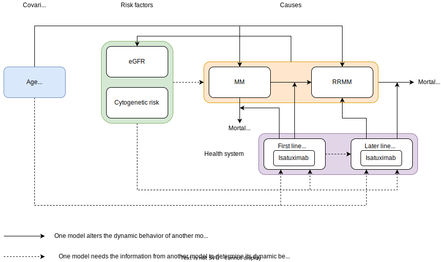

.. role:: underline
    :class: underline

..
  Section title decorators for this document:

  ==============
  Document Title
  ==============

  Section Level 1 (#.0)
  +++++++++++++++++++++

  Section Level 2 (#.#)
  ---------------------

  Section Level 3 (#.#.#)
  ~~~~~~~~~~~~~~~~~~~~~~~

  Section Level 4
  ^^^^^^^^^^^^^^^

  Section Level 5
  '''''''''''''''

  The depth of each section level is determined by the order in which each
  decorator is encountered below. If you need an even deeper section level, just
  choose a new decorator symbol from the list here:
  https://docutils.sourceforge.io/docs/ref/rst/restructuredtext.html#sections
  And then add it to the list of decorators above.

.. _2019_concept_model_vivarium_csu_multiple_myeloma_phase_2:

======================================================
Vivarium CSU Multiple Myeloma Registries Phase 2
======================================================

.. contents::
  :local:

.. list-table:: Abbreviations
  :header-rows: 1

  * - Abbreviation
    - Definition
    - Note
  * -
    -
    -

.. _mm2_1.0:

1.0 Background
++++++++++++++

This page describes Phase 2 our multiple myeloma simulation project. :ref:`Phase
1 <2019_concept_model_vivarium_csu_multiple_myeloma>` initially focused on a
planned multiple myeloma patient registry, but registry enrollment has been much
lower than expected, so it is no longer a current focus of the client. Instead,
we will use our microsimulation to help the client answer various business
questions about their new drug isatuximab.

* Phase 1 :ref:`concept model
  <2019_concept_model_vivarium_csu_multiple_myeloma>` and `HUB page
  <https://hub.ihme.washington.edu/display/COS/Multiple+Myeloma+Registries+Sim+Phase+1>`_

* `Phase 2 HUB page
  <https://hub.ihme.washington.edu/display/COS/Multiple+Myeloma+Registries+Sim+Phase+2>`_

Our :ref:`Phase 1 multiple myeloma simulation
<2019_concept_model_vivarium_csu_multiple_myeloma>` focused on a scale-up of
isatuximab as a first-line treatment in the USA. For Phase 2, the client has
asked us to expand our simulation in the following ways:

1.  Expand the set of mutually exclusive treatment categories beyond the three
    treatment categories considered in Phase 1.

2.  Consider additional patterns of scale-up of Isa. In particular, model an
    uptake of Isa following Dara as a first-line treatment, after a "washout"
    period.

3. Expand the modeled locations beyond the USA.

We gave a `presentation to the CSU client on January 20, 2022 <slides_20220120_>`_
proposing some potential business questions for Phase 2, along with an expanded
set of treatment categories based on treatment guidelines from the `NCCN
<https://www.nccn.org/>`_ as `suggested by Manoj Menon in Sep-Oct 2021
<recommendations_from_Manoj_>`_.

.. _slides_20220120: https://uwnetid.sharepoint.com/:p:/r/sites/ihme_simulation_science_team/_layouts/15/Doc.aspx?sourcedoc=%7BB3EB4DE8-7E6A-4E81-9A4E-F3C4A5F2D6AB%7D&file=20220120%20IHME%20Multiple%20Myeloma%20Simulation%20-%20Phase%202%20Next%20Steps.pptx&action=edit&mobileredirect=true

.. _slides_Manoj_20210924: https://uwnetid.sharepoint.com/:p:/r/sites/ihme_simulation_science_team/_layouts/15/Doc.aspx?sourcedoc=%7B2AC8C5F2-CFE6-4458-93AD-4B378953EED3%7D&file=Simulation_MM_Sept%2024.pptx&action=edit&mobileredirect=true

.. _recommendations_from_Manoj: https://uwnetid.sharepoint.com/:f:/r/sites/ihme_simulation_science_team/Shared%20Documents/Research/CSU_Multiple%20Myeloma/Phase%202/05_Concept%20model%20development/Recommendations%20from%20Manoj%20Menon?csf=1&web=1&e=7UwzUz

.. _mm2_1.1:

1.1 Project Overview
--------------------

.. _mm2_1.2:

1.2 Literature Review
---------------------

.. _mm2_2.0:

2.0 Modeling Aims and Objectives
++++++++++++++++++++++++++++++++

3.0 Concept Model Diagram
+++++++++++++++++++++++++

4.0 Vivarium Model Components
+++++++++++++++++++++++++++++

4.1 Cause Models
----------------

* :ref:`Multiple Myeloma <2019_cancer_model_multiple_myeloma_2>`

4.2 Risk Exposure Models
------------------------

* :ref:`Multiple Myeloma Risk Factor Exposures <2019_multiple_myeloma_risk_factor_exposures>`

4.3 Risk Effects Models
-----------------------

* :ref:`Multiple Myeloma Risk Factor Effects <2019_multiple_myeloma_risk_factor_effects>`

4.4 Intervention Models
-----------------------

* :ref:`Multiple Myeloma Treatment <multiple_myeloma_treatment>`

5.0 Simulation Scenarios
++++++++++++++++++++++++

Our scenarios differ in how treatment is assigned.

We know that our scenarios will roughly correspond to:

* Baseline scenario: Sophisticated treatment assignment, with postprocessing rules (modifying the prediction model's probabilities) about Isa and Dara by year, and a rule that there is probability 0 of Isa directly following Dara
* Alternative scenario 1: Naive treatment assignment (not dependent on covariates) with the same postprocessing rules as baseline
* Alternative scenario 2: Same as baseline, but with postprocessing rules modified such that there is 5% uptake of Isa in second line following Dara first-line treatment by 2028 -- need to define how this replaces other things
* Alternative scenario 3: Same as baseline, but with postprocessing rules modified such that there is 5% uptake of Isa first-line treatment by 2028 -- need to define how this replaces other things

.. todo::

  Rigorously define these scenarios. In particular, the scenarios above say "Isa" when we will actually want some split between Isa+PI+Dex, Isa+IMID+Dex, etc.

6.0 Simulation Parameters
+++++++++++++++++++++++++

6.1 Locations
-------------

United States.

6.2 Population and Randomness
-----------------------------

Population description:

* Cohort type: Prospective closed cohort of individuals aged 15 years and older (open cohort if we only examine on age 50+ population)
* Size of largest starting population: 100,000 simulants
* Time span: Jan 1, 2013 to Dec 31, 2027 (Jan 1, 2013 to Jan 1, 2023 is a 10-year long burn-in period)
* Time step: 28 days (final run) or 90 days (intermediate runs) -- the only input data that depends on the timestep is the time-varying hazard; we will have a copy of those CSVs for each of the two time step values

6.3 Timeframe and Intervention Start Dates
------------------------------------------

7.0 Model Builds and Validation Tracking
++++++++++++++++++++++++++++++++++++++++

.. list-table:: Model verification and validation tracking
  :widths: 3 10 20
  :header-rows: 1

  * - Model
    - Description
    - V&V summary
  * - Model 0
    - Phase 1 model re-run
    -
  * - Model 1
    - Expanded treatment categories and hazard ratios (likely placeholder values)
    -
  * - Model 2
    - Use TTNT directly for hazard of relapse, instead of subtracting OS from PFS
    -
  * - Model 3
    - Sophisticated treatment prediction model as a scenario and business-rule-modified alternative scenarios
    -

8.0 Desired Outputs
+++++++++++++++++++

8.1 Final Outputs for Client
----------------------------

8.2 Requested Outputs from Vivarium
-----------------------------------

8.2.1 Treatment output table
~~~~~~~~~~~~~~~~~~~~~~~~~~~~

.. note::

  This should be similar to the treatment output table from Phase 1, with an added stratification
  by age.

.. list-table:: Treatment observer metrics
  :header-rows: 1

  * - Variable
    - Definition
  * - input_draw
    - Input draw number. len(input_draw) = 30
  * - scenario
    - Intervention scenario. Choose from ['naive', 'baseline', ...]
  * - year
    - Calendar year
  * - treatment_line
    - Treatment line/disease state a simulant is in. If a simulant is in state
      :code:`multiple_myeloma_{x}`, assign this simulant :code:`treatment_line {x}`. Choose
      from [1, 2, 3, 4, 5+]
  * - treatment_category
    - Treatment regimen category a simulant initiated. For example, IMID+PI+Dex.
  * - age
    - Age group a simulant is in.
  * - value
    - Count of simulants in age group :code:`age` who initiated the :code:`treatment_category` in :code:`treatment_line` during :code:`year`.

8.2.2 Survival output table
~~~~~~~~~~~~~~~~~~~~~~~~~~~

.. note::

  This is very similar to :ref:`the survival output table from Phase 1 <mm5.6>`, with an added
  stratification by treatment category.

.. list-table:: Survival observer metrics
  :header-rows: 1

  * - Variable
    - Definition
  * - input_draw
    - Input draw number. len(input_draw) = 30
  * - scenario
    - Intervention scenario. Choose from ['naive', 'baseline', ...]
  * - treatment_line
    - Treatment line/disease state a simulant is in. If a simulant is in state
      :code:`multiple_myeloma_{x}`, assign this simulant :code:`treatment_line {x}`. Choose
      from [1, 2, 3, 4, 5+]
  * - treatment_category
    - Treatment regimen category a simulant is in. For example, IMID+PI+Dex.
  * - period
    - The number of days since the entrance into the :code:`treatment_line` that the
      count measures were evaluated on.
  * - alive_at_start
    - Count of at-risk simulants alive at :code:`period` - 28 days since they entered :code:`treatment_line`.
  * - died_by_end
    - Count of :code:`alive_at_start` simulants who died between :code:`period` - 28 and :code:`period` days since they entered :code:`treatment_line`.
  * - progressed_by_end
    - Count of :code:`alive_at_start` simulants who progressed to next line of treatment/disease state
      between :code:`period` - 28 and :code:`period` days since they entered :code:`treatment_line`.
  * - sim_end_on
    - Count of :code:`alive_at_start` simulants without death or progression at the end of the simulation
      between :code:`period` - 28 and :code:`period` days since they entered :code:`treatment_line`.

Time frame for survival observer (timestep = 28 days):
 1. start_date = 2021-01-01, end_date = 2025-12-31
 2. start_date = 2025-01-01, end_date = 2025-12-31

9.0 Back of the Envelope Calculations
+++++++++++++++++++++++++++++++++++++

10.0 Limitations
++++++++++++++++

11.0 References
+++++++++++++++
