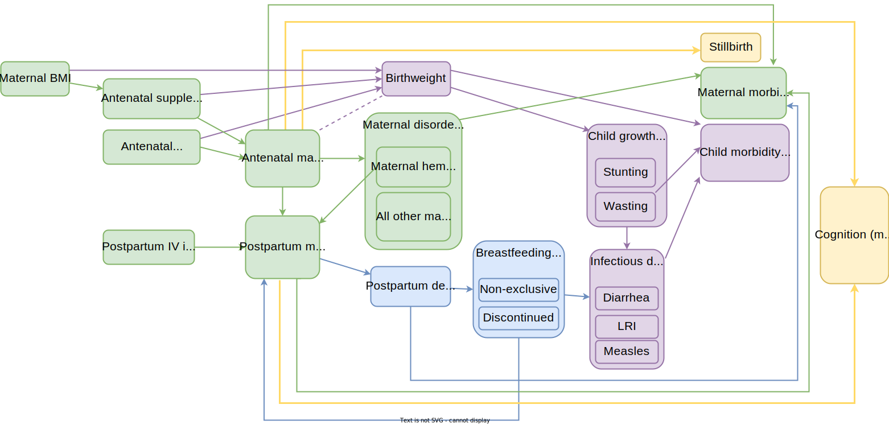

.. role:: underline
    :class: underline

..
  Section title decorators for this document:

  ==============
  Document Title
  ==============

  Section Level 1 (#.0)
  +++++++++++++++++++++

  Section Level 2 (#.#)
  ---------------------

  Section Level 3 (#.#.#)
  ~~~~~~~~~~~~~~~~~~~~~~~

  Section Level 4
  ^^^^^^^^^^^^^^^

  Section Level 5
  '''''''''''''''

  The depth of each section level is determined by the order in which each
  decorator is encountered below. If you need an even deeper section level, just
  choose a new decorator symbol from the list here:
  https://docutils.sourceforge.io/docs/ref/rst/restructuredtext.html#sections
  And then add it to the list of decorators above.

.. _2019_concept_model_vivarium_iv_iron:

===========================
Vivarium Intravenous Iron
===========================

This document is the overall page for the Intravenous Iron Intervention simulation and links to the following subpages included within the project:

.. toctree::
   :maxdepth: 2
   :glob:

   */concept_model*

Overview
+++++++++

.. contents::
  :local:

.. list-table:: Abbreviations
  :header-rows: 1

  * - Abbreviation
    - Definition
    - Note
  * - IV
    - Intravenous
    - 
  * - IDA
    - Iron deficiency anemia
    - 
  * - WRA
    - Women of reproductive age
    - 
  * - PLW
    - Pregnant and lactating women
    - 
  * - IFA
    - Iron and folic acid
    - 
  * - MMS
    - Multiple micronutrient supplementation
    - 
  * - BEP
    - Balanced energy protein
    - 
  * - BMGF
    - Bill and Melinda Gates Foundation
    - 
  * - ANC
    - Antenatal care
    - 
  * - IFD
    - In-facility delivery
    - 
  * - LMICs
    - Low and middle income countries
    - 

1.0 Background
++++++++++++++

.. note::

  Gendered terms such as "maternal disorders" and "pregnant/lactating women" are used throughout this document as the existing terminology in the GBD and other literature sources rely on such terms. However, we acknowledge that not all pregnant individuals identify as female and we are working to incorporate more inclusive language such as pregnant indiviudals/parents, chestfeeding, etc. Additionally, our simulation will rely on data specific to male/female sex without consideration of intersex individuals or gender differences, which is a limitation of our analysis.

Anemia, a condition defined by low blood hemoglobin concentration, is a significant cause of morbidity and mortality globally, particularly in low and middle income countries and in sub-Saharan Africa and south Asia. Iron deficiency is a common cause of anemia, although other conditions such as hemoglobinopathies may also contribute to the condition.

Pregnancy is a time of increased iron demands to meet the needs of fetal development. Anemia during pregnancy has several health consequences, including increased risk of adverse health outcomes for mother and child.

Iron supplementation during pregnancy can help meet the increased iron demands during this period and prevent and/or remediate iron deficiency anemia (IDA). However, for those who are severely anemic during pregnancy, intravenous (IV) iron can be a more effective strategy for resolving IDA. Additionally, anemia during the postpartum period also has potential health consequences for mother and child and postpartum IV iron may be beneficial to those who are severely anemic immediately following birth.

.. _iviron2.0:

2.0 Modeling aims and objectives
++++++++++++++++++++++++++++++++

**Objective:** Using the optimistic assumptions for the target product profiles from the Bill and Melinda Gates Foundation, estimate the cost effectiveness of a) IV iron use during pregnancy and b) IV iron use immediately postpartum under the following assumptions:

- Impact measured in terms of a) maternal anemia DALYs averted, and b) infant outcomes and stillbirths
- Assume no large-scale food fortification intervention. Comparator = routine anemia prevention/treatment in pregnancy and postpartum.
- Cost effectiveness estimates specific to all LMICs, disaggregated by region (separate estimates for South Asia and sub-Saharan Africa).

.. _iviron3.0:

3.0 Concept model
+++++++++++++++++

This simulation will be built in a series of subgroups of model components that are summarized below.

.. list-table:: Concept model versions
  :widths: 5 5 20 10
  :header-rows: 1

  * - Model version
    - Color
    - Description
    - Note
  * - I
    - Green
    - Interventions and impacts on maternal morbidity and mortality due to maternal disorders and anemia
    - Women of reproductive age (WRA) population model only 
  * - IIa
    - Purple
    - Infant birthweight and its efect on child morbidity and mortality directly as well as through child growth failure and infectious diseases (without the positive feedback loop of infectious diseases on child growth failure)
    - Includes children under five in population model as well as WRA
  * - IIb
    - N/A
    - Fertility component to familially link WRA to children under five.
    - May be swapped in implementation order with model 2a
  * - III
    - Blue
    - Postpartum depression and breastfeeding behaviors
    - 
  * - IV
    - Yellow
    - Non-standard outcomes, including stillbirths and cognition
    - Inclusion of cognition outcome on hold until BMGF trial results are received
  * - V
    - Orange
    - Orphanhood, care-seeking behaviors, and positive feedback loop between infectious diseases and child wasting
    - On hold - not shown in diagram
  * - VIa
    - Red
    - Fertility model that includes birth interval information
    - On hold - not shown in diagram
  * - VIb
    - Red
    - Access to care parameters (antenatal care and in-facility delivery) and correlation with other model components
    - On hold - not shown in diagram

.. _iviron3.1:

3.1 Simulation scenarios
------------------------

The following simulation scenarios apply to both the :ref:`women of reproductive age simulation <2019_concept_model_vivarium_iv_iron_maternal_sim>` and the :ref:`children under five simulation <2019_concept_model_vivarium_iv_iron_child_sim>`.

#. **Baseline:** baseline IFA coverage
#. **Oral iron:** MMS/BEP scale-up
#. **Antenatal IV iron:** MMS/BEP + antenatal IV iron scale-up
#. **Postpartum IV iron:** MMS/BEP + postpartum IV iron scale-up
#. **Antenatal and postpartum IV iron:** MMS/BEP + antenatal and postpartum IV iron scale-up

.. note::

  Scenario comparisons of interest to BMGF will be IV iron scenarios (antenatal IV iron, postpartum IV iron, antenatal + postpartum IV iron) relative to the oral iron scenario. However, all interventions will scale-up from baseline levels of intervention coverage.

.. list-table:: Intervention coverage of eligible individuals by scenario
  :header-rows: 1

  * - Scenario
    - IFA coverage
    - MMS/BEP coverage
    - Antenatal IV iron coverage
    - Postpartum IV iron coverage
  * - Baseline
    - To be defined for locations of interest on the :ref:`maternal supplementation intervention document <maternal_supplementation_intervention>`
    - 0
    - 0
    - 0
  * - Oral iron scale-up
    - 0
    - :math:`T * ANC`
    - 0
    - 0
  * - Antenatal IV iron scale-up
    - 0
    - :math:`T * ANC`
    - :math:`T * ANC`
    - 0
  * - Postpartum IV iron scale-up
    - 0
    - :math:`T * ANC`
    - 0
    - :math:`T * SBA`
  * - Antenatal and postpartum IV iron scale-up
    - 0
    - :math:`T * ANC`
    - :math:`T * ANC`
    - :math:`T * SBA`

Where,

.. list-table:: Intervention coverage parameter definitions
  :header-rows: 1

  * - Parameter
    - Description  
    - Value
    - Note
  * - :math:`T`
    - Target coverage
    - 0.8
    - Subject to change after confirmation with BMGF. Not location-specific.
  * - :math:`ANC`
    - Coverage of single antenatal care visit
    - GBD covariate ID=7, decomp_step='step4', normal distribution of uncertainty
    - Location-specific
  * - :math:`SBA`
    - Skilled birth attendance proportion
    - GBD covariate ID=143, decomp_step='step4', normal distribution of uncertainty
    - Location-specific

.. note::

  The coverage values in the table above are meant to represent the probability that a patient who is *eligible* for the intervention, as determined by the restrictions table on the relevant intervention model document, will receive the intervention.

.. _iviron3.2:

3.2 Simulation timeframe and intervention start dates
-----------------------------------------------------

Detailed in the :ref:`women of reproductive age simulation <2019_concept_model_vivarium_iv_iron_maternal_sim>` and the :ref:`children under five simulation <2019_concept_model_vivarium_iv_iron_child_sim>` pages.

.. _iviron4.0:

4.0 Vivarium modelling components
+++++++++++++++++++++++++++++++++

.. _iviron4.1:

4.1 Vivarium concept model diagram components
----------------------------------------------

Detailed in the :ref:`women of reproductive age simulation <2019_concept_model_vivarium_iv_iron_maternal_sim>` and the :ref:`children under five simulation <2019_concept_model_vivarium_iv_iron_child_sim>` pages.

.. _iviron4.2:

4.2 Demographics
----------------

4.2.1 Locations
~~~~~~~~~~~~~~~

Locations of interest to this project: 

- Sub-Saharan Africa (location_type=superregion; location_id=166)
- South Asia (location_type=region; location_id=159)
- All low and middle income countries (LMICs)

  - This simulation location does not have a corresponding GBD location ID. Rather, there are two location IDs that fall within this location of interest and together will make up the overall LMIC location (shown in the bullets below). We will need to calculate weighted average estimates across these two locations (and/or the national-level locations that comprise them) for use in the simulation of the LMIC location.

    - World bank lower middle income (location_type=region; location_id=44577)
    - World bank low income (location_type=region; location_id=44578)

National-level locations included in each of these locations of interest `can be found here <https://github.com/ihmeuw/vivarium_research_iv_iron/tree/main/locations>`_.

Location aggregation
^^^^^^^^^^^^^^^^^^^^^^

For GBD outcomes that do not have estimates available for the locations of interest, we will calculate aggregate weighted average estimates from the national estimates included in the regional locations of interest. Notably, for some parameters, we will want to weight to the size of the population of women of reproductive age and for others we will want to weight to the size of the pregnant population. Generally, the following steps should be followed:

#. Pull estimates specific to each national-level location_id included in the region of interest (can be found in .csv files linked above)
#. Pull estimates of the relevant weighting unit for each national-level location_id included in the region of interest (weighting unit for each parameter is shown in the table below)
#. At the draw-level, caclulate a weighted average estimate across all national locations within the region of interest, like so:

.. math::

  estimate_\text{regional} = \frac{\sum_{n=1}^{n} \text{weighting unit value}_\text{national} * estimate_\text{national}}{\sum_{n=1}^{n} \text{weighting unit value}_\text{national}}

Details on how to calculate weighted averages for specific simulation parameters are shown on the :ref:`women of reproductive age simulation <2019_concept_model_vivarium_iv_iron_maternal_sim>` and the :ref:`children under five simulation <2019_concept_model_vivarium_iv_iron_child_sim>` pages.

.. _iviron5.0:

5.0 Back of the envelope calculations
+++++++++++++++++++++++++++++++++++++

.. _iviron6.0:

6.0 Limitations
+++++++++++++++

In addition to the assumptions and limitations listed in each of the pages included in the `4.1 Vivarium concept model diagram components`_ section, our simulation is also subject to the following assumptions and limitations:

#. Our simulation is run at the regional level and does not consider sub-regional heterogeneity.
#. We do not model a distinction between iron-deficiency anemia and other types of anemia. Therefore, we may overestimate the number of individuals whose hemoglobin levels respond to our interventions, which may also vary by modeled location.
#. We do not directly model access to care among our simulated population nor any of its correlates.
#. We do not consider outcomes affected by the intervention other than those that act through maternal hemoglobin and infant birthweight. However, the maternal supplementation intervention may also have impacts on additional outcomes that we do not consider such as maternal malnourishment (including micronutrient deficiencies as well as maternal underweight). This may cause us to overestimate DALYs in our alternative scenarios.

7.0 References
+++++++++++++++

