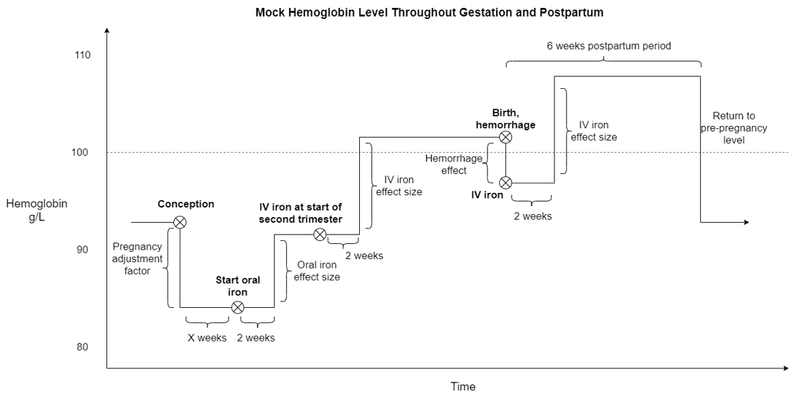

.. role:: underline
    :class: underline

..
  Section title decorators for this document:

  ==============
  Document Title
  ==============

  Section Level 1 (#.0)
  +++++++++++++++++++++

  Section Level 2 (#.#)
  ---------------------

  Section Level 3 (#.#.#)
  ~~~~~~~~~~~~~~~~~~~~~~~

  Section Level 4
  ^^^^^^^^^^^^^^^

  Section Level 5
  '''''''''''''''

  The depth of each section level is determined by the order in which each
  decorator is encountered below. If you need an even deeper section level, just
  choose a new decorator symbol from the list here:
  https://docutils.sourceforge.io/docs/ref/rst/restructuredtext.html#sections
  And then add it to the list of decorators above.

.. _2019_concept_model_vivarium_iv_iron_maternal_sim:

=======================================================
Vivarium Intravenous Iron - Women of reproductive age
=======================================================

.. contents::
  :local:

.. list-table:: Abbreviations
  :header-rows: 1

  * - Abbreviation
    - Definition
    - Note
  * - IV
    - Intravenous
    - 
  * - IDA
    - Iron deficiency anemia
    - 
  * - WRA
    - Women of reproductive age
    - 
  * - PLW
    - Pregnant and lactating women
    - 
  * - IFA
    - Iron and folic acid
    - 
  * - MMS
    - Multiple micronutrient supplementation
    - 
  * - BEP
    - Balanced energy protein
    - 
  * - BMGF
    - Bill and Melinda Gates Foundation
    - 
  * - ANC
    - Antenatal care
    - 
  * - IFD
    - In-facility delivery
    - 
  * - LMICs
    - Low and middle income countries
    - 

1.0 Background
++++++++++++++

.. _ivironWRA2.0:

2.0 Modeling aims and objectives
++++++++++++++++++++++++++++++++

.. _ivironWRA3.0:

3.0 Concept model
+++++++++++++++++

.. image:: concept_model_version_i.svg

3.1 Additional figures
-----------------------

There are several components that affect hemoglobin during pregnancy, including in multiplicative (for the hemoglobin pregnancy adjustment factor) and additive (for the :ref:`antenatal supplementation <maternal_supplementation_intervention>`, :ref:`antenatal IV iron <intervention_iv_iron_antenatal>`, and :ref:`postpartum IV iron <intervention_iv_iron_postpartum>` interventions as well as :ref:`maternal hemorrhage risk effects <2019_risk_effect_maternal_hemorrhage>`) manners. The figures below visually represent these changes.

.. note::

  The depiction above does not represent hemoglobin exposure value changes due to changing age groups, which will happen in the vivarium simulation. The following figure shows how changing age groups may change simulant hemoglobin exposure.

  .. image:: simulant_hemoglobin_trajectory.png

3.2 Simulation timeframe and intervention start dates
------------------------------------------------------

.. note::

  The simulation timestep is documented to be two weeks in these tables, but as of 5/17/2021 it is set to one week and has not yet been updated to two.

**Throughout model development and verification/validation prior to intervention implementation:**

.. list-table:: Developmental model maternal simulation timeframe and intervention dates
  :header-rows: 1

  * - Parameter
    - Value
  * - Date of simulation burn-in period start
    - N/A (no burn-in)
  * - Date of simulation observation period start
    - January 1, 2022
  * - Date of intervention scale-up start
    - Janary 1, 2023
  * - Date of simulation end
    - December 31, 2024
  * - Simulation time step
    - 2 weeks
  * - Intervention scale-up rate
    - Immediate jump to target coverage level
    
**Throughout model development and verification/validation with intervention implementation:**

.. list-table:: Developmental model maternal simulation timeframe and intervention dates
  :header-rows: 1

  * - Parameter
    - Value
  * - Date of simulation burn-in period start
    - N/A (no burn-in)
  * - Date of simulation observation period start
    - January 1, 2022
  * - Date of intervention scale-up start
    - Janary 1, 2023
  * - Date of simulation end
    - December 31, 2027
  * - Simulation time step
    - 2 weeks
  * - Intervention scale-up rate
    - Same scale-up pace as the .csv file on the :ref:`IV iron simulation landing page <2019_concept_model_vivarium_iv_iron>` over the four-year scale-up and then held constant at maximum coverage value for one year.
    
**For final model results:**

.. list-table:: Final model maternal simulation timeframe and intervention dates
  :header-rows: 1

  * - Parameter
    - Value
  * - Date of simulation burn-in period start
    - January 1, 2019 (note: 1 year burn-in to initialize pregnancy, five year burn-in to initialize child population)
  * - Date of simulation observation period start
    - January 1, 2025 (NOTE: child outcomes should be tracked starting January 1, 2020)
  * - Date of intervention scale-up start
    - Janary 1, 2025
  * - Date of simulation end
    - December 31, 2039
  * - Simulation time step
    - 2 weeks
  * - Intervention scale-up rate
    - See the .csv file on the :ref:`IV iron simulation landing page <2019_concept_model_vivarium_iv_iron>`

.. _ivironWRA4.0:

4.0 Vivarium modelling components
+++++++++++++++++++++++++++++++++

.. _ivironWRA4.1:

4.1 Vivarium concept model diagram components
----------------------------------------------

4.1.1 Cause Models
~~~~~~~~~~~~~~~~~~

* :ref:`Maternal disorders <2019_cause_maternal_disorders>`
* :ref:`Maternal hemorrhage incidence <2019_cause_maternal_hemorrhage_incidence>`
* Postpartum depression

4.1.2 Joint Cause-Risk Models
~~~~~~~~~~~~~~~~~~~~~~~~~~~~~

* :ref:`Hemoglobin, anemia, and iron deficiency model <2019_hemoglobin_anemia_and_iron_deficiency>`

Including, 

  * :ref:`Hemoglobin exposure model <2019_hemoglobin_model>`

  * :ref:`Anemia impairment model <2019_anemia_impairment>`

.. todo::

  Detail strategy for accruing anemia YLDs that is compatible with the strategy for accruing maternal disorders YLDs and postpartum depression YLDs.

4.1.3 Risk Exposure Models
~~~~~~~~~~~~~~~~~~~~~~~~~~

* :ref:`Maternal Body Mass Index conditional on hemoglobin status <2019_risk_exposure_maternal_bmi_hgb>`

* :ref:`Low Birthweight and Short Gestation (GBD 2019) <2019_risk_exposure_lbwsg>`

.. note::

  These risk exposures will be correlated, as discussed in the risk-risk correlation model section.

4.1.4 Risk Effects Models
~~~~~~~~~~~~~~~~~~~~~~~~~

* :ref:`Hemoglobin/Iron deficiency risk effects <2019_risk_effect_iron_deficiency>`, including the impact on:

  * Maternal disorders,
  * Maternal hemorrhage incidence,
  * Birth outcomes, and
  * Postpartum depression

* :ref:`Maternal hemorrhage risk effects <2019_risk_effect_maternal_hemorrhage>`

4.1.5 Risk-Risk Correlation Models
~~~~~~~~~~~~~~~~~~~~~~~~~~~~~~~~~~

* :ref:`Maternal BMI, maternal hemoglobin, and infant birthweight <2019_risk_correlation_maternal_bmi_hgb_birthweight>`

4.1.6 Non-standard Models
~~~~~~~~~~~~~~~~~~~~~~~~~~~~~

* :ref:`Pregnancy model <other_models_pregnancy>`

4.1.7 Intervention Models
~~~~~~~~~~~~~~~~~~~~~~~~~

.. note::

  Simulants should have the same propensity value for all modeled interventions (if coverage of all modeled interventions is 50%, then the same 50% of simulants will be getting each intevention). Additionally, treatment propensity is fixed throughout the simulation and does not update between multiple pregnancies.

  Also, the same propensity should be used for the effect size on of both the antenatal and postpartum IV iron interventions (referenced below) on hemoglobin.

* :ref:`Maternal supplementation <maternal_supplementation_intervention>`
* :ref:`Antenatal IV iron <intervention_iv_iron_antenatal>`
* :ref:`Postpartum IV iron <intervention_iv_iron_postpartum>`

.. _ivironWRA4.2:

4.2 Demographics
----------------

Location aggregation
~~~~~~~~~~~~~~~~~~~~~

Details on how to calculate weighted averages for specific simulation parameters are shown in the tables below.

.. list-table:: Weighted average calculation instructions
   :header-rows: 1

   * - Parameter
     - Parameter ID
     - Available location IDs
     - Weighting unit
     - Age-specific?
     - Note
   * - Population size
     - N/A (use *get_population*)
     - 159, 166, 44577, 44578
     - N/A
     - Yes
     - 
   * - Age-specific fertility rate (ASFR)
     - covariate_id 13
     - 159, 166 (not available for 44577 or 44578)
     - WRA
     - Yes
     - 
   * - Cause and sequela data
     - c366, c367, s182, s183, s184
     - 159, 166, 44577, 44578
     - PLW
     - Yes
     - 
   * - Hemoglobin modelable entity IDs
     - MEIDs 10487 and 10488
     - 159, 166 (not available for 44577 or 44578)
     - CUSTOM (see below)
     - No
     - 
   * - BMI modelable entity IDs
     - MEIDs 2548 and 18706
     - 159, 166 (not available for 44577 or 44578)
     - WRA
     - Yes
     - Parameter not currently incorporated into maternal BMI exposure model
   * - Stillbirth to live birth ratio (SBR)
     - covariate ID 2267
     - None (national only)
     - ASFR :math:`\times` WRA
     - No
     - 
   * - Antenatal care visit attendance (ANC)
     - covariate ID 7
     - None (national only)
     - PLW
     - No
     - 
   * - In-facility delivery proportion (IFD)
     - covariate ID 51
     - None (national only)
     - PLW
     - No
     - 
   * - Maternal low BMI exposure
     - covariate ID 1253
     - None (national only)
     - PLW
     - No
     - Current covariate for BMI exposure model, but may eventually be updated.
   * - Anemia impariment
     - REIDs 192, 205, 206, 207
     - 159, 166, 44577 and 44578
     - WRA
     - Yes
     - Parameter used for validation, but not for model building
   * - LBWSG exposure at birth among males
     - REI ID 339, sex_id=1, age_group_id=164
     - 159, 166 (not available for 44577 or 44578)
     - ASFR :math:`\times` WRA :math:`\times` male_sex_ratio
     - No
     - Weight each exposure category prevalence separately
   * - LBWSG exposure at birth among females
     - REI ID 339, sex_id=2, age_group_id=164
     - 159, 166 (not available for 44577 or 44578)
     - ASFR :math:`\times` WRA :math:`\times` (1 - male_sex_ratio)
     - No
     - Weight each exposure category prevalence separately

Where,

.. list-table:: Parameter values for weighted average calculations
   :header-rows: 1

   * - Parameter
     - Description   
     - Value
     - Note
   * - WRA
     - National population size of women of reproductive age (ages 10 to 54)
     - *get_population*, decomp_step='step4', age_group_id=[7,8,9,10,11,12,13,14,15], sex_id=2
     - Either age-specific or summed across age groups if not age-specific
   * - PLW
     - National number of women who become pregnant within one year   
     - WRA :math:`\times` (ASFR + (ASFR * SBR) + incidence_c996 + incidence_c374)
     - Calculate at the age-specific level and sum the result across age groups if not age-specific
   * - ASFR
     - Age-specific fertility rate   
     - covariate_id=13, decomp_step='step4'
     - For use in weighting -- either: [1] Assume normal distribution of uncertainty truncated at [0,1] and sample draw-level values for each location using different random seeds, or [2] use the mean_value point estimate
   * - SBR
     - Stillbirth to live birth ratio   
     - covariate_id=2267, decomp_step='step4'
     - Not age-specific; no uncertainty 
   * - incidence_c996
     - Incidence rate of abortion and miscarriage cause   
     - cause_id=996, source=como, decomp_step=’step5’, measure_id=6
     - 
   * - incidence_c374
     - Incidence rate of ectopic pregnancy
     - cause_id=374, source=como, decomp_step=’step5’, measure_id=6
     - 
   * - male_sex_ratio
     - Ratio of male births to all live births
     - :ref:`Defined for each modeled location on the pregnancy model document <sex_ratio_table>`
     - 

Hemoglobin distribution weighting strategy
^^^^^^^^^^^^^^^^^^^^^^^^^^^^^^^^^^^^^^^^^^^

For the continuous hemoglobin distribution parameters, rather than population-weight the mean and standard deviation of the continuous distribution and then sample from those summary statistics, we will instead **sample individual simulant hemoglobin exposures from the national-level distributions with a probability equal to the population weight of that nation within the modeled region among the age-specific population size of women of reproductive age (WRA).** 

Specifically, at the simulant level, the country from which the hemoglobin exposure is sampled should be determined at initialization or entrance into the simulation and should not change for the duration of the simulation. Notably, although simulants' sampling country and hemoglobin exposure propensities will not change throughout the simulation, their hemoglobin exposure values may change as they progress to the next age group (as described in the :ref:`hemoglobin document <2019_hemoglobin_model>`). The sampling probabilities for each country within the modeled regions are defined below.

Probability of sampling from a given country's hemoglobin distribution using the mean and standard deviation hemoglobin parameters for that country:

.. math::

  \frac{population_\text{country}}{population_\text{region}}

.. list-table:: Parameter definitions for hemoglobin distribution weighting
  :header-rows: 1

  * - Parameter
    - Definition
    - Value
    - Note
  * - :math:`population_\text{country}`
    - Age-specific population size of women of reproductive age for a given national location
    - See definition of WRA in table above
    - Summed across all age groups
  * - :math:`population_\text{region}`
    - Age-specific population size of women of reproductive age for a given regional location
    - :math:`\sum_{country=1}^{n} population_\text{country}`
    - For all countries within the region

.. note:: 

  We may update the weighting unit to pregnant and lactating women (PLW) rather than WRA once we have confirmed that our hemoglobin exposure model is functioning properly by validating to GBD. Although the hemoglobin exposure distribution is specific to women of reproductive age, we have chosen to weight the hemoglobin exposure distribution to the population size of pregnant and lactating women due to our explicit project focus on PLW. This prioritization of hemoglobin exposures among PLW may cause slight differences in our location-aggregated estimates of anemia among non-pregnant or postpartum simulants among WRA compared to the regional estimates from GBD.

  Although the hemoglobin distribution and population size parameters are age-specific, we will calculate the population weights among PLW overall rather than at the age specific level to allow us to sample from the same national-level distribution for the same simulant as they age so that we can maintain logical hemoglobin exposure trajectories at the simulant level. 

.. _ivironWRA4.2.1:

4.2.1 Population description
~~~~~~~~~~~~~~~~~~~~~~~~~~~~

**Throughout model development and verification/validation:**

.. list-table:: Maternal simulation model development population parameters
   :header-rows: 1

   * - Parameter
     - Value
     - Note
   * - Population size
     - 100,000
     - per random seed/draw combination
   * - Number of draws
     - 66
     - 
   * - Number of random seeds
     - 10
     - per draw
   * - Cohort type
     - Closed
     - 
   * - Age start
     - 7 years
     - Minimum age at initialization. Chosen by subtracting number of simulation run years from 10 years of age (minimum fertile age in GBD)
   * - Age end
     - 54 years
     - Maximum age at initialization
   * - Exit age
     - 57 years (track through the 56th year until the start of the 57th year)
     - Maximum age of tracking in simulation. Allows capture of potential events for pregnancies that occur at the end of the 54th year, including maximum gestation period and 1 year post-maternal disorder state.
   * - Sex restrictions
     - Female only
     - 

.. todo::

  The GBD defines reproductive age as 10 to 54 years of age. However, many other data sources define reproductive age as 15 to 49 years of age. 

  We should confirm with the BMGF that they would like to model the GBD definition rather than standard definition from other data sources. 

.. note::

  The overall fertility rate among women of reproductive age is 0.055 for South Asia and 0.105 for Sub-Saharan Africa (not including stillbirths). Therefore, approximately these fractions of the total population multiplied by the number of simulation years of WRA will enter the population of interest of PLW in our simulation. 

**For final model results:**

.. list-table:: Maternal simulation final model population parameters
   :header-rows: 1

   * - Parameter
     - Value
     - Note
   * - Population size
     - 10,000 
     - per random seed
   * - Number of draws
     - 50
     - 
   * - Number of random seeds
     - 120
     - per draw
   * - Cohort type
     - **Open**
     - 
   * - Age start
     - 10
     - Minimum age at initialization
   * - Age end
     - 57
     - Maximum age at initialization
   * - Exit age
     - 57
     - 
   * - Sex restrictions
     - Female only
     - 

.. _ivironWRA4.3:

4.3 Models
----------

.. list-table:: Model verification and validation tracking
   :widths: 3 10 20
   :header-rows: 1

   * - Model
     - Description
     - V&V summary
   * - I.0
     - Demography for Sub-Saharan Africa and South Asia
     - `Notebook for validation can be found here <https://github.com/ihmeuw/vivarium_research_iv_iron/blob/main/validation/model0/model_0_gbd_validation.ipynb>`_. All-cause mortality rates look good. Age fraction looks reasonable, but slightly off for boundary age groups, likely a result of the assumption of uniform distribution of ages within a five year age group -- ok to proceed.
   * - I.1
     - Pregnancy model for Sub-Saharan Africa and South Asia
     - `Validation notebook can be found here <https://github.com/ihmeuw/vivarium_research_iv_iron/blob/main/validation/maternal/model1/sim_v_and_v.ipynb>`_. [1] ASFR covariate has negative values in the youngest age group for some draws... perhaps should update to truncated normal distribution. [2] duration of postpartum period appears to be too long... closer to 7 weeks than 6. [3] Request to have pregnancy person time stratified by pregnancy outcome in order to evaluate approximate differential duration of pregnancy. [4] Request to have all pregnancy transition counts rather than just np->p.
   * - I.2
     - Maternal disorders
     - `Validation notebooks are available here <https://github.com/ihmeuw/vivarium_research_iv_iron/tree/main/validation/maternal/model2%2C%20maternal%20disorders>`_. [1] mortality rate due to other causes overestimated by a factor of approximately 50 (this is a new problem that was not present in model I.1). [2] seeing age trend in maternal disorders burden attributable to differences bewteen rate of conception and rate of birth within each age group. [3] Underestimating maternal disorders burden relative to GBD overall [4] previous issues appear to remain unresolved.
   * - I.3
     - Maternal hemorrhage incidence (not yet severity-specific), hemoglobin/anemia exposure model (with known bug in anemia state person time observer)
     - [1] `Overestimation of ACMR from model I.2 now resolved <https://github.com/ihmeuw/vivarium_research_iv_iron/blob/main/validation/maternal/model3%2C%20anemia%2C%20etc/maternal%20disorders%20cause%20model.ipynb>`_. [2] `Overestimation of total maternal disorders burden <https://github.com/ihmeuw/vivarium_research_iv_iron/blob/main/validation/maternal/model3%2C%20anemia%2C%20etc/maternal%20disorders%20cause%20model.ipynb>`_ (underestimation from model I.2 now resolved) [3] `Underestimation of maternal hemorrhage incidence <https://github.com/ihmeuw/vivarium_research_iv_iron/blob/main/validation/maternal/model3%2C%20anemia%2C%20etc/maternal%20disorders%20cause%20model.ipynb>`_. [4] `Apparent long duration of no maternal disorders pregnancy state and duration of pregnancy state does not appear to be shorter for "other" pregnancy outcome relative to live and still births <https://github.com/ihmeuw/vivarium_research_iv_iron/blob/main/validation/maternal/model3%2C%20anemia%2C%20etc/pregnancy%20model.ipynb>`_. [5] `Issue of negative draws for ASFR from previous models now resolved <https://github.com/ihmeuw/vivarium_research_iv_iron/blob/main/validation/maternal/model3%2C%20anemia%2C%20etc/pregnancy%20model.ipynb>`_. [6] `Mean hemoglobin estimates scaled to week timestep rather than annual <https://github.com/ihmeuw/vivarium_research_iv_iron/blob/main/validation/maternal/model3%2C%20anemia%2C%20etc/hemoglobin%20and%20anemia.ipynb>`_. [7] `Appear to underestimate pregnancy outcome counts <https://github.com/ihmeuw/vivarium_research_iv_iron/blob/main/validation/maternal/model3%2C%20anemia%2C%20etc/pregnancy%20model.ipynb>`_.
   * - I.3updates
     - Updated hemoglobin weighting from WRA to PLW, fixed birth outcome initialization issue, fixed pregnancy transition from all states issue, fixed some person-time issues. 
     - `Notebooks are available here <https://github.com/ihmeuw/vivarium_research_iv_iron/tree/main/validation/maternal/model3%20with%20first%20round%20fixes>`_ [1] Underestimation of maternal hemorrhage incidence remains (note: does not vary by year so likely not related to intiailization and also the ratio between moderate and severe looks as expected). [2] Hemoglobin/anemia still not totally validating. [3] The following issues were resolved: pregnancy state durations look good, birth outcome rates look good, hemoglobin pregnancy adjustment factor looks good. [4] Birth outcome counts are equal to transitions out of pregnancy state, which is appropriate (need to check and make sure it's possible for death due to maternal disorders to result in birth outcome!). Ali to investigate hemoglobin and anemia thresholds look as they should in an interactive sim.
   * - I.3 hemorrhage fix
     - Fixed issues of maternal hemorrhage incidence using GBD incidence rate rather than the probability listed :ref:`on this page <2019_cause_maternal_hemorrhage_incidence>` and observers counting multiple outcomes.
     - `Maternal hemorrhage incidence looks good! Now only off by the age-group trend previously identified <https://github.com/ihmeuw/vivarium_research_iv_iron/blob/main/validation/maternal/model3%2C%20hemorrhage%20fix/maternal%20disorders%20cause%20model.ipynb>`_.
   * - I.3 hemoglobin weighted to single national location
     - Weighted 100% of simulants to the hemoglobin distributions of Nigeria for the Sub-Saharan Africa location and to Bangladesh for the South Asia location to see if our validation issues were caused by our location aggregation strategy.
     - `Mean hemoglobin is validating well now. Anemia prevalence still very off. <https://github.com/ihmeuw/vivarium_research_iv_iron/blob/main/validation/maternal/model3%2C%20fixed%20hemoglobin%20weight%20experiment/hemoglobin%20and%20anemia.ipynb>`_
   * - I.3 hemoglobin distribution code update
     - Updated to mirrored_gumbel_ppf_2017 function
     - `Anemia prevalence is validating!! :) :) <https://github.com/ihmeuw/vivarium_research_iv_iron/blob/main/validation/maternal/model3%2C%20fixed%20hemoglobin%20weight%20experiment/hemoglobin%20and%20anemia%20distribution%20code%20update.ipynb>`_
   * - I.3.5.0 code refactor
     - Refactoring of model by James, need to check nothing broke.
     - `Validation notebooks for model 3.5.0 are available here <https://github.com/ihmeuw/vivarium_research_iv_iron/tree/main/validation/maternal/model3.5.0>`_. Maternal disorders and hemorrhage cause model, hemoglobin/anemia model, and pregnancy model are largely looking good. I noticed the following issues [1] postpartum duration in the outputs looks like it's just one week even though in the interactive sim it was consistently 5 weeks, [2] I had an issue with my validation code and we are actually *not* systematically overestimating pregnancy/maternal disorders at the population level, which means that the age shift implementation is not necessarily necessary for success, [3] it looks like the YLDs count data may not be properly stratified by cause... it looks like maternal disorders and anemia YLDs may be combined and labeled as maternal disorders only.
   * - I.3.5.1 code refactor with LBWSG gestational age
     - LBWSG exposure used to inform duration of pregnancy
     - `Validation notebooks for model 3.5.1 are available here <https://github.com/ihmeuw/vivarium_research_iv_iron/tree/main/validation/maternal/model3.5.1>`_. It appears that the duration of pregnancy, which used to be ~36 weeks, is now ~4 weeks. This is causing us to overestimate pregnancy incidence and outcomes related to it (like maternal disorders). 
   * - I.3.5.1: Bugfix and BMI
     - Fixes to pregnancy state durations and YLDs as well as implementation of BMI/Hemoglobin exposure
     - `Validation notebooks for model 3.5.1_bugfix are available here <https://github.com/ihmeuw/vivarium_research_iv_iron/tree/main/validation/maternal/model3.5.1_james_bugfix_and_bmi>`_. Postpartum duration now five weeks as expected. Pregnancy duration approximately equal to mean gestational age, as expected (but can be followed up with a more detailed validation in interactive simulation). YLDs behaving as expected. Joint BMI/hemoglobin exposure functioning as expected (although verification that exposure does not change with intervention scenarios should be done when ready).
   * - I.8 Intervention coverage
     - Implemented intervention coverage and scenarios
     - `Validation notebook for intervention coverage is available here <https://github.com/ihmeuw/vivarium_research_iv_iron/blob/main/validation/maternal/model8/intervention%20coverage.ipynb>`_. Issues added to the table below. BEP/MMS targeting looks good. Rate of scale-up looks good.
   * - I.8 Intervention coverage, bugfix
     - Run to fix issues identified with the previous run
     - `Validation notebooks for the intervention coverage bugfix run are available here <https://github.com/ihmeuw/vivarium_research_iv_iron/tree/main/validation/maternal/model8_coverage_bugfix>`_. All issues appear resolved, with the exception of the request for output of intervention administration counts. Also of note, the "antenatal_iv_iron_invalid" and "postpartum_iv_iron_invalid" person time categories are inclusive of simulants with hemoglobin levels greater than 10 g/dL at the time of administration -- this makes direct V&V of the intervention targeting difficult, and it should be doublechecked when intervention administration counts are provided as an output and/or in the interactive simulation.
   * - I.8 intervention effects
     - Implement intervention effects and add intervention administration count outputs.
     - [1] `Deaths due to maternal disorders not equal between baseline and alternative scenarios. Deaths due to other causes vary between all scenarios <https://github.com/ihmeuw/vivarium_research_iv_iron/blob/main/validation/maternal/model8_intervention_effects/intervention_effects_check.ipynb>`_ [2] `Anemia YLDs not equal in baseline and alternative scenarios in the not pregnant state. <https://github.com/ihmeuw/vivarium_research_iv_iron/blob/main/validation/maternal/model8_intervention_effects/intervention_effects_check.ipynb>`_ [3] `Anemia YLDs not varying by scenario as expected in the pregnant state, even though anemia person time does. <https://github.com/ihmeuw/vivarium_research_iv_iron/blob/main/validation/maternal/model8_intervention_effects/intervention_effects_check.ipynb>`_ [4] Would like hemoglobin sum and person time output files stratified by intervention coverage to verify intervention effect sizes, please. [5] `Intervention count outputs and coverage looks good :) <https://github.com/ihmeuw/vivarium_research_iv_iron/blob/main/validation/maternal/model8_intervention_effects/intervention%20coverage%20from%20counts.ipynb>`_ 
   * - `I.8 intervention effects bugfix <https://github.com/ihmeuw/vivarium_research_iv_iron/tree/main/validation/maternal/model8_intervention_effects_bugfix>`_
     - Fix results processing and other bugs causing issues from above model version
     - Results look as expected :). No longer have unexpected differences in scenarios. Intervention effects on hemoglobin look good in the results outputs as well as in the interative sim.
   * - `I.5 Hemoglobin effects on maternal disorders <https://github.com/ihmeuw/vivarium_research_iv_iron/tree/main/validation/maternal/model5_hgb_on_maternal_disorders>`_
     - All model 4 risk effects included now
     - Results look as expected :)
   * - I.8.2 2040 run
     - Add fertility component, run out to 2040, with risk effects and intervention models
     - `Results ran out to 2040 look as expected :) <https://github.com/ihmeuw/vivarium_research_iv_iron/tree/main/validation/maternal/model8.2_2040_run>`_. No longer have unexpected differences in scenarios. Intervention effects on hemoglobin look good in the results outputs as well as in the interative sim.
   * - I.9.1 Stillbirth
     - `Stillbirth implementation <https://github.com/ihmeuw/vivarium_research_iv_iron/blob/main/validation/maternal/model9_stillbirth/9.1%20stillbirth%20effect.ipynb>`_
     - Magnitude of effect by severe anemia status looks good. Appears to result in increases to stillbirth, but not other births (as expected). However, there is a bug that results in all birth outcome counts for "no" anemia to be zero -- there should instead be counts for "none" anemia. This prevents us from comparing counts of birth outcomes across scenarios.
   * - I.9.2
     - `Stillbirth bugfix, single draw <https://github.com/ihmeuw/vivarium_research_iv_iron/blob/main/validation/maternal/model9_stillbirth/9.2%20stillbirth%20effect.ipynb>`_
     - There are now birth outcome counts for "none" anemia and differences in birth outcome counts are as expected across scenarios. Good to go!
   * - I.9.3
     - `Ethiopia, Nigeria, and India test runs: baseline scenario only, out to 2030 <https://github.com/ihmeuw/vivarium_research_iv_iron/tree/main/validation/maternal/model9.3_national_locations>`_
     - Hemoglobin, maternal disorders, pregnancy, and intervention coverage models all looking as expected :) 

.. list-table:: Outstanding verification and validation issues
  :header-rows: 1

  * - Issue
    - Explanation
    - Action plan
    - Timeline
  * - `Age group issues (underestimation of births in young ages and overestimation in older ages) <https://github.com/ihmeuw/vivarium_research_iv_iron/blob/main/validation/maternal/model3%2C%20anemia%2C%20etc/maternal%20disorders%20cause%20model.ipynb>`_
    - Related to start versus end of pregnancy timing 
    - Ticket made
    - Lower priority -- nice to have, but not necessary for success
  * - `Hemoglobin exposure summed at the weekly rather than annual level <https://github.com/ihmeuw/vivarium_research_iv_iron/blob/main/validation/maternal/model3%2C%20anemia%2C%20etc/hemoglobin%20and%20anemia.ipynb>`_
    - 
    - SWEs to update
    - Low priority since Ali can adjust for this on the back-end

.. _ivironWRA4.4:

4.4 Desired outputs
-------------------

For model version I:

#. DALYs (YLLs and YLDs) due to a) maternal disorders, and b) anemia among a) pregnant, b) postpartum, and c) women of reproductive age
#. Severity-specific anemia prevalence during a) pregnancy, and b) the postpartum period
#. Average hemoglobin level among during a) pregnancy, and b) the postpartum period
#. Numbers of intervention regimens administered per a) 100,000 births, and b) 100,000 person years of women of reproductive age
#. Rates of each pregnancy outcome (live birth, stillbirth, abortion/miscarriage)

.. _ivironWRA4.5:

4.5 Simulation output table
---------------------------

.. csv-table:: Maternal simulation output table
   :file: output_table.csv
   :header-rows: 1

**Outputs needed to inform the children under five simulation:**

The following ouputs should be a table including the following data for each live birth that occurs in the maternal simulation:

  - Input draw
  - Scenario
  - Random seed
  - Date of birth
  - Infant sex
  - :ref:`Joint categorical maternal BMI/anemia exposure <2019_risk_exposure_maternal_bmi_hgb>`
  - Birthweight exposure (either as sampled from GBD or post-adjustment due to the :ref:`correlation between maternal anemia/BMI and birhtweight <2019_risk_correlation_maternal_bmi_hgb_birthweight>`, in which case we would not need the joint categorical maternal BMI/anemia exposure above)
  - Gestational age exposure
  - Maternal supplementation coverage
  - Maternal antenatal IV iron coverage
  - Maternal postpartum IV iron coverage
  - Birthweight shift due to intervention coverage (NOTE: alternatively, this may be calculated in the child simulation from reported maternal intervention coverage values)

.. _ivironWRA5.0:

5.0 Back of the envelope calculations
+++++++++++++++++++++++++++++++++++++

.. _ivironWRA6.0:

6.0 Limitations
+++++++++++++++

7.0 References
+++++++++++++++

