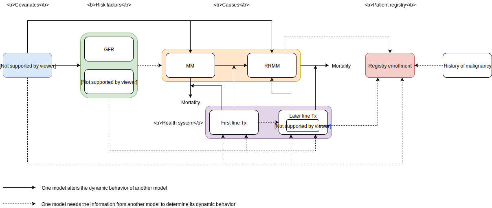

.. role:: underline
    :class: underline

..
  Section title decorators for this document:
  ==============
  Document Title
  ==============
  Section Level 1 (#.0)
  +++++++++++++++++++++
  
  Section Level 2 (#.#)
  ---------------------
  Section Level 3 (#.#.#)
  ~~~~~~~~~~~~~~~~~~~~~~~
  Section Level 4
  ^^^^^^^^^^^^^^^
  Section Level 5
  '''''''''''''''
  The depth of each section level is determined by the order in which each
  decorator is encountered below. If you need an even deeper section level, just
  choose a new decorator symbol from the list here:
  https://docutils.sourceforge.io/docs/ref/rst/restructuredtext.html#sections
  And then add it to the list of decorators above.

.. _2019_concept_model_vivarium_sanofi_multiple_myeloma:

=======================================================
Vivarium - CSU - Simulating Multiple Myeloma registries
=======================================================

.. contents::
  :local:

+------------------------------------+
| List of abbreviations              |
+=======+============================+
| ASCT  | Autologous stem cell       |
|       | transplantation            |
+-------+----------------------------+
| CKD   | Chronic kidney disease     |
+-------+----------------------------+
| eGFR  | Estimated glomerular       |
|       | filtration rate            |
+-------+----------------------------+
| HR    | Hazard ratio               |
+-------+----------------------------+
| Isa   | Isatuximab                 |
+-------+----------------------------+
| MM    | Multiple myeloma           |
+-------+----------------------------+
| OS    | Overall Survival           |
+-------+----------------------------+
| PFS   | Progression-free survival  |
+-------+----------------------------+
| RCT   | Randomized controlled trial|
+-------+----------------------------+
| RRMM  | Relapsed/ Refractory MM    |
+-------+----------------------------+

.. _mm1.0:

1.0 Background
++++++++++++++
In March of 2020, the United States (US) Food and Drug Administration approved the use of a new drug, Isatuximab, in combination with pomalidomide and dexamethasone for the treatment of relapsed/refractory multiple myeloma (RRMM) in adults who had previously received at least two prior therapies including lenalidomide and a proteasome inhibitor. ([Sanofi-2020]_) A phase 3 clinical study has shown Isatuximab, in addition to pomalidomide-dexamethasone, to significantly improve progression-free survival in patients with RRMM. ([Attal-et-al-2019]_) Since the introduction of Isatuximab on the US drug market, Sanofi has started a clinical registry in the US to observe the use of Isatuximab in patients with RRMM in a real-world setting.  

As Isatuximab is still relatively new and the clinical registry is in early stages of enrollment, Sanofi is interested in using simulation to further understand Isatuximab’s potential impact and aid in registry design. Simulation is a general method that allows the incorporation of inter-related and dynamic factors and processes to predict health outcomes over time. In this project, we employ customized agent-based simulation software in which thousands of simulated individuals (“simulants”) with individual characteristics and health backgrounds experience MM including treatment, progression, and survival in a realistic way. This project is currently planned out in three phases including, 1) simulating the general population in one location and a registry population in the same location, 2) updating input data parameters using real registry data and rerunning the microsimulation from phase 1 iteratively to calibrate with real-world evidence and 3) expanding the microsimulation to other locations of interest. This document will outline the current analysis plan for phase 1 of this project. 

FDA just approved isatuximab in combination with carfilzomib and dexamethasone (Kd), for the treatment of adult patients with RRMM who have received one to three prior lines of therapy.([Sanofi-2021]_)

Key sub-populations agreed upon include: 

* Black/African American population 

* Population with high-risk cytogenetics 

* Population with renal impairment/CKD (eGFR < 60 ml/min/1.73m^2)

* Elder population (aged > 75 years) 

In the absence of data on treatment effects for sub-groups we will need to make assumptions with client guidance. A strength of this project is that we will be able to iteratively update such assumptions as we get real world data from registries and re-run the simulation. 

.. _mm1.1:

1.1 Project overview
--------------------
This project intends to model the impact of a new treatment option for myeloma disease, Isatuximab, from 2021 to 2026 among the general population, key subpopulations listed above, and a registry population within the United States. The model will make use of the current multiple myeloma treatment guidelines in the United States, which are dependent on disease status, age, eligibility for stem cell transplantation, risk category, history of malignancy, and duration of previous treatment response. 

.. _mm1.2:

1.2 Literature review
---------------------

There is one randomized controlled trial on Isatuximab treatment that is currently active and is briefly described below.

.. list-table:: RCT Summaries
   :header-rows: 1

   * - Study Name
     - Recent Publication(s)
     - Location
     - Intervention arm
     - Control arm
     - Eligible population
     - Length of follow-up
   * - Multinational Clinical Study Comparing Isatuximab, Pomalidomide, and Dexamethasone to Pomalidomide and Dexamethasone in Refractory or Relapsed and Refractory Multiple Myeloma Patients (ICARIA-MM)
     - (1.) Dimopoulos, M.A., Leleu, X., Moreau, P. et al. 2020; (2.) Attal, Richardson, Rajkumar, San-Miguel, Beksac, Spicka, et al. 2019  [Dimopoulos-et-al-2020]_
     - 102 sites in 24 countries
     - IPd (isatuximab + pomalidomide + dexamethasone)
     - Pd (pomalidomide + dexamethasone)
     - Adult patients with relapsed and refractory multiple myeloma who had received at least two previous lines of treatment, including lenalidomide and a proteasome inhibitor.
     - 28-day treatment cycle

.. _mm2.0:

2.0 Modeling aims and objectives
++++++++++++++++++++++++++++++++

The primary objective of this project is to answer the following question: what can we expect the incidence, prevalence, mortality, and survival of MM to be overall and among a registry population in the United States, and in key sub-populations, under a business-as-usual treatment scenario and an Isatuximab treatment scenario over 5 years? The key sub-populations include the Black/African American population, population with high-risk cytogenetics, population with renal impairment and the elderly population (age > 75 years).  

To answer this question, we will gather data from the 2019 Global Burden of Disease Study (GBD), SEER, literature, and Flatiron Health and run our own survival regression to inform the parameters for our simulation. We will simulate the changes in MM and RRMM disease incidence, prevalence and survival from 2021 to 2026 in response to an Isatuximab treatment intervention scenario in the US population and simulated registry population. These outcomes will be stratified by age, sex, calendar year, race/ethnicity, renal impairment and cytogenetic risk. 

.. _mm3.0:

3.0 Causal framework
++++++++++++++++++++

.. _mm3.1:

3.1 Causal diagram
------------------

 .. note::
    link to DAGs page
    use round circles with DAGs

**Outcome (O)**:

**Most proximal determinant/exposure (E)**:

**Confounders (C)**:

**Effect modifiers**:

**Mediators (M)**:

.. _mm3.2:

3.2 Effect sizes
----------------

4.0 Intervention
++++++++++++++++

Among MM and RRMM patients, they expect to have:
 - Isatuximab treatment with coverage scale-up from 10% to 45% across 5 years 
   of the simulation. Or
 - Other (non Isa-based) treatment with constant coverage rates across 5 years 
   of the simulation

.. _mm4.1:

4.1 Simulation scenarios
------------------------

To measure the impact of Isatuximab, we will simulate two scenarios, a baseline 
scenario and an alternative scenario, outlined below. The underlying health state 
of each simulant will be measured at each 28-day time step and the probability 
that each simulant is treated will be dependent on the coverage stated in that 
scenario. 

`We might stratify the treatment covearge rates by simulant’s cytogenetic risk 
level, age, sex, and race/ethnicity if Flatiron data support us to do so.`

**Baseline** The baseline scenario will project GBD 2019 demographic and disease 
trends out from 2021 to 2026. For any simulated population, the coverage rates 
for all regimens except Isatuximab will be held constant across the 5 years of 
the simulation; Isatuximab will start to be available to simulants as a second-line 
regimen and ramp up to 45% coverage by 2026 to simulate a business-as-usual 
treatment scenario.

**Alternative** Most aspects of the alternative scenario will be the same as the 
baseline scenario: it will project GBD 2019 demographic and disease trends out 
from 2021 to 2026 and apply the same coverage rates (or ramp up) for all regimens 
specified in the baseline. In contrast to the baseline scenario, Isatuximab in 
the alternative scenario will start to be available to simulants as a first-line 
regimen among all simulated population.

In the absence of data from Flatiron, we made following assumptions:
 1. The initial treatment coverage of Isatuximab is set to be 10% in 2021.
 2. The probability of simulants treated with Isatuximab is the same across 
    different lines of treatment.
 3. The coverage scale-up of Isatuximab follows the same trend from IQVIA sales 
    projection.

.. note::

   According to IQVIA sales data, the total sales of Isatuximab equal to
   113 million dollars in 2021. The unit cost for a 12-month Isatuximab treatment
   is about 145,600 dollars, that yields a total of 776 patients in year 2021 could
   be treated with Isatuximab. In GBD 2019 summary, there were 89,566 prevalent MM
   cases in 2019 for all ages and both sexes. As a result, the initial coverage of
   Isatuximab is calculated to be 1% in 2021, and expect to reach 5% in 2026 based
   on the slope derived from IQVIA sales projection. (~350% increase from 2021 to
   2026) So, the endpoint coverage could reach 45% If we set the initial coverage
   2027) of Isatuximab to be 10% in 2021.

.. _mm5.0:

5.0 Vivarium modelling components
+++++++++++++++++++++++++++++++++

.. _mm5.1:

5.1 Vivarium concept model 
--------------------------

The simulation concept model consists of five main components: 
 1. Covariates (age, sex, race/ethnicity) 
 2. Risk factors (eGFR and cytogenetics) 
 3. Causes (progression of multiple myeloma) 
 4. Health system (multiple lines of treatment for MM and RRMM population) 
 5. Patient registry 

.. _mm5.2:

5.2 Demographics
----------------

.. _mm5.2.1:

5.2.1 Population description
~~~~~~~~~~~~~~~~~~~~~~~~~~~~

  - Location: United States
  - Cohort type: Prospective closed cohort of individuals 15 years and older
  - Size of largest starting population: 100,000 simulants
  - Time span: Jan 1, 2011 to Dec 31, 2025
  - Time step: 28 days to capture the duration of treatment, and time to response. (Time step may be revised after further model development.)

.. _mm5.2.2:

5.2.2 Population of interest
~~~~~~~~~~~~~~~~~~~~~~~~~~~~~~~~~

**General US population** and **Registry population** stratified by 
sub-population groups of following:

 - Black/African American population
 - Population with high-risk cytogenetics (abnormality includes Del(17p) t(14;16) t(14;20) Del(1p))
 - Population with Renal Impairment (RI) (eGFR < 60 ml/min/1.73m2) 
 - Elder population (aged > 75 years) 

.. _mm5.3:

5.3 Models
----------

.. _mm5.3.1:

5.3.1 Disease model
~~~~~~~~~~~~~~~~~~~

See :ref:`multiple myeloma cause model<2019_cancer_model_multiple_myeloma>`

.. _mm5.3.2:

5.3.2 Risk factor model
~~~~~~~~~~~~~~~~~~~~~~~

To study the sub-population of people with CKD and/or high-risk cytogenetics, 
the risk factor model tracks two risk factors: glomerular filtration rate (GFR) 
and cytogenetic risk. These two risk factors do not directly alter the risk of 
developing MM. Instead, they are considered as determinants in patient and 
disease characteristics. For simulants at a given age, sex, and race/ethnicity, 
the choice of therapy is based on their GFR and cytogenetic risk. 

**eGFR** has a continuous risk exposure by age, sex, and race/ethnicity. 
Simulants will be assigned to a CKD stage based on their eGFR value. We consider 
5 stages of CKD:

 - Stage 1: eGFR > 90 ml/min/1.73m^2
 - Stage 2: eGFR 60 to 90 ml/min/1.73m^2
 - Stage 3: eGFR 30 to 60 ml/min/1.73m^2
 - Stage 4: eGFR 15 to 30 ml/min/1.73m^2
 - Stage 5: eGFR < 15 ml/min/1.73m^2

**Cytogenetic risk** is a binary risk factor. Simulants will fall into one of 
two risk exposure categories: with high-risk cytogenetics, or with standard-risk 
cytogenetics. We intend to use Flatiron data to inform the existing prevalence 
of high-risk cytogenetics among adults in the US population with multiple myeloma.

.. list-table:: Cytogenetic risk stratification of myeloma ([Rajan-and-Rajkumar-et-al-2015]_)
   :header-rows: 1

   * - Risk stratification	
     - Cytogenetic abnormalities
     - Median OS from MM diagnosis
     - Percentage of patients
   * - Standard risk
     - Trisomies t(11;14) t(6;14)
     - 7 to 10 years
     - Informed by Flatiron data
   * - Intermediate risk
     - t(4;14) Gain(1q21)
     - 5 years
     - Informed by Flatiron data
   * - High risk
     - Del(17p) t(14;16) t(14;20) Del(1p)
     - 3 years
     - Informed by Flatiron data

.. note::

 In our risk model, we assume myeloma patients without high-risk cytogenetic 
 abnormalities have 'standard-risk', namely with standard- or intermediate-risk 
 abnormalities as described above. No abnormalities detected on fluorescence in 
 situ hybridization (FISH) is considered 'standard-risk' as well. 

.. _mm5.3.3:

5.3.3 Treatment model
~~~~~~~~~~~~~~~~~~~~~

Research Background
^^^^^^^^^^^^^^^^^^^^

Treatment guidelines for multiple myeloma are complex and varied. [Rajkumar-and-Kumar-2020]_ and [Nijhof-et-al-2017]_ published recent reviews on multiple myeloma treatment options and guidelines. Important classes of anti-myeloma drugs are summarized (non-exhaustively) below, according to [Nijhof-et-al-2017]_:

.. list-table:: Select anti-myeloma drug classes
   :header-rows: 1

   * - Class
     - Acronym
     - Drugs
   * - Immunomodulatory agents
     - IMiDs
     - Thalidomide, lenalidomide, pomalidomide
   * - Proteasome inhibitors
     - PIs
     - Bortezomib, carfilzomib, ixazomib, marizomib, oprozomib
   * - Monoclonal antibodies
     - MoABs
     - isatuximab (anti-CD38), daratumumab (anti-CD38), MOR202 (anti-CD38), elotuzamab (anti-CS1/anti-SLAM7), denosumab (anti-RANKL), siltuximab (anti-IL6), IPH2101 (anti-KIR2DL1/2/3)
   * - Corticosteroids
     - 
     - Dexamethasone, prednisone

The treatment indications with FDA approval for isatuxamib [FDA-prescribing-information-isa-2021]_ are listed below: 

- in combination with pomalidomide (PI) and dexamethasone, for the treatment of adult patients with multiple myeloma who have received at least two prior therapies including lenalidomide (IMiD) and a proteasome inhibitor (PI)
- in combination with carfilzomib (PI) and dexamethasone, for the treatment of adult patients with relapsed or refractory multiple myeloma who have received 1 to 3 prior lines of therapy

.. note::

   Clinical trial efficacy data exists for isatuxamib + pomalidomide + dexamethasone treatment relative to pomalidomide + dexamethasone alone [Attal-et-al-2019]_. A clinical trial comparing isatuxamib + carfilzomib + dexamethasone relative to carfilzomib + dexamethasone is ongoing [Moreau-et-al-2019]_.

The treatment indications with FDA approval for DARZALEX FASPRO [FDA-prescribing-information-dara-2021]_, a monoclonal antibody competitor to isatuxamib, include:

- in combination with lenalidomide (PI) and dexamethasone in newly diagnosed patients ineligible for autologous stem cell transplant (ASCT)
- in combination with lenalidomide (PI) and dexamethasone in newly diagnosed patients ineligible for ASCT *and* in patients with replased or refractory multiple myeloma who have received at least one prior therapy
- in combination with bortezomib (PI), thalidomide (IMiD), and dexamethasone in newly diagnosed patients who are eligible for ASCT
- in combination with bortezomib (PI) and dexamethasone in patients who have received at least one prior therapy
- as monotherapy in patients who have received at least three prior lines of therapy including a PI and an IMiD or who are double-refractory to a PI and an IMiD
- in combination with bortezomib (PI), cyclophosphamide, and dexamethasome in newly diagnosed patients 

[Braulin-et-al-2021]_ summarized the multiple myeloma treatment landscape among recent years using Flatiron registry data. [Goto-et-al-2019]_ and [Jagannath-et-al-2016]_ published similar, but less recent, studies using SEER and International Oncology Netword data, respectively.

A figure of the multiple myeloma treatment regimens by line of treatment from [Braulin-et-al-2021]_ is shown below. Notably, the usage of different treatment regimens has significantly changed over time as more treatments have become avaliable.

.. image:: treatment_landscape_braulin_et_al_2021.png

Notably, [Braulin-et-al-2021]_ reported that 90.7 percent of all patients received at least one treatment. As shown by [Goto-et-al-2019]_, older patients are significantly more likely to receive no treatment than younger patients.

As discussed in treatment guideline reviews, in general triplet regimens are preferred, but doublet regimens should be considered if patients are frail [Rajkumar-and-Kumar-2020]_. Additionally, for relapsed multiple myeloma, at least two new drugs that the patient is not refractory to, and preferably from a different class, should be considered [Rajkumar-and-Kumar-2020]_. [Rajkumar-and-Kumar-2020]_ notes that "patients refractory to a drug are likely to be reractory to different drug[s] in the same class"; although, two important exceptions exist, including pomalidomide for patients refractory to lenalidomide and carfilzombib in patients refractory to bortezomib (p. 6). 

[Rajkumar-and-Kumar-2020]_ provide treatment recommendations for first line therapy based on ASCT eligibility and cytogenetic risk-stratification, summarized in the table below. Notably, ASCT improves median overall survival and can be delayed until first relapse, primarily based on patient choice (overall survival is similar whether ASCT was performed early or delayed until relapse) [Rajkumar-and-Kumar-2020]_.

.. list-table:: Initial therapy recommendations
   :header-rows: 1

   * - ASCT eligibility
     - Cytogenetic risk
     - Treatment recommendation
   * - Eligible
     - Standard
     - VRd: bortezomib + lenalidomide + dexamethasone
   * - Eligible
     - High
     - VRd: bortezomib + lenalidomide + dexamethasone; OR dara-VRD: daratumumab + bortezomib + lenalidomide + dexamethasone 
   * - Ineligible
     - Standard
     - VRd: bortezomib + lenalidomide + dexamethasone; OR DRd: daratumumab, lenalidomide, dexamethasone
   * - Ineligible
     - High
     - VRd: bortezomib + lenalidomide + dexamethasone

Treatment Modeling Strategy
^^^^^^^^^^^^^^^^^^^^^^^^^^^^

**Scope**:

This modeling strategy allows us to track the proportion of MM/RRMM simulants that receive isatuxamib as part of their regimen for a given treatment line. We assume that the scale-up of isatuxamib coverage will result in isatuxamib incorporation as an additional drug added to an existing treatment regimen that would have been delivered in the absence of an isatuxamib coverage scale-up. It also allows for coherent assignment of isatuxamib-containing treatments at the simulant level so that any given simulant is not assigned an isatuxamib-containing treatment an illogical amount of times, which will reduce noise in our estimations.

This model strategy does NOT consider:

- Differences between isatuxamib-containing treatment regimens (ex: isatuxamib + pomalidomide + dexamethasone versus isatuxamib + carfilzomib + dexamethasone)
- Differences between existing treatment regimens that would be eligible/ineligible for the addition of isatuxamib (For instance, isatuxamib logically would not be added to a treatment regimen that already contains dara. Additionally, isatuxamib is more likely to be added to a doublet treatment regimen than a triplet regimen.)
- Differences between the numerous treatment regimens that do NOT contain isatuxamib 
- Eligibility requirements for isatuxamib-containing treatments other than previous treatment with isatuxamib. Specifically, 

	- We do not directly consider the requirement of previous treatment with lenalidomide and a PI, although this is likely minimally impactful as these are very common treatment regimens and "almost all" patients with myeloma develop disease that is eventually refracotory to lenalidomide and PIs, [Attal-et-al-2019]_.
	- We do not consider previous treatment with other monoclonal antibody drugs such as daratumumab, which may impact probability of receiving an isa-containing treatment

We will consider the following treatment categories in our treatment model:

- Isa-containing treatment regimen
- Non-isa-containing treatment regimen

.. note::

	Other treatment categories to consider tracking include: daratumumab-containing regimens

Importantly, we will assume that a given percentage of patients who receive isa-containing regimen for a specific line of treatment will not receive an isa-containing regimen at a later line of treatment.

	Currently, we will assume that 100% of patients who receive isa-containing regimens will not receive isa-containing regimens at a later line of treatment.

.. todo::
	
	Confirm use of probability 1.0 for ineligibility for future isa-containing treatment regimen based on past treatment with isa.

	Alternative approach: make ineligible if simulant progresses on or within 60 days seven months time OR with a probability of 60% if simulant progresses within seven months. This was chosen because the ISA trial defined non-response as progression on or within 60 days or progression within 6 months after achieving at least a partial response and reported at least partial response in 60% of subjects and a median time to response among this group was 35 days).

.. note::

	Consider similarly assuming that patients who recieve dara-containing regimens will not receive isa-containing regimens at later lines of treatment.

The overall proportion of incident cases that receive isa-containing treatment regimens upon diagnosis of MM or RRMM at each line of treatment and in each scenario is shown in the table below.

.. list-table:: Isatuximab treatment coverage assumptions
   :header-rows: 1

   * - Treatment line
     - 2021 coverage (Baseline and Alternative)
     - 2025 coverage (Baseline)
     - 2025 coverage (Alternative)
   * - 1st
     - 0%
     - 0%
     - 20%
   * - 2nd
     - 0%
     - 20%
     - 20%
   * - 3rd 
     - XXX
     - 20%
     - 20%
   * - 4th+
     - XXX
     - 20%
     - 20%

.. todo::

	Describe linear scale-up

	Finalize numbers currently marked as "XXX" based on commercial team input

Notably, for the scale-up of isatuxamib coverage, we will assume that coverage of all other treatment regimens will remain constant from 2021 to 2025 and that isatuxamib will be incorporated into treatment coverage as an additional drug in the existing regimen for a given line of treatment. For example, if a given patient were to receive a doublet regimen for their second line of treatment (pomalidamide + dexamethasone, for example) in the absence of an isatuxamib scale-up, then we assume they would receive an isatuxamib-containing triplet regimen for their second line of treatment (isatuxamib + pomalidamide + dexamethasone, for example). This modeling strategy has the following important implications:

- In the absence of available data to inform alternate strategies, we will assume that the addition of isatuxamib to the doublet pomalidomide + dexamethasone reigmen will have the same relative effect on progression free survival and overall survival as the addition of isatuxamib to all other multiple myeloma treatment regimens, as obtained from [Attal-et-al-2019]_
- This strategy assumes that isatuxamib will be *added* to existing treatment regimens so that monotherapies become doublet therapies, doublets become triplets, and so on, rather than assuming that isatuxamib will replace a drug in an existing treatment regimen. This may or may not accurately reflect clinical practice as the number of drugs administered in a given line of treatment is a clinical decision based on patient frailty and triplet therapies are generally preferred in the absence of frailty.
- This strategy currently does not (yet) consider that isatuxamib logically would not be added to treatment regimens that already contain monoclonal antibody drugs such as dara and does not consider that such treatments already are benefitting from the additional clinical impact of an anti-C38 MoAB drug as part of the treatment regimen and therefore would likely not see an additional clinical benefit from an isatuxamib scale-up.

.. todo::

	Consider tracking this treatment category as part of baseline coverage so that it can be appropriately considered in the baseline calibration strategy.

**How to assign treatment category to a simulant:**

*Initialization*:

	Each simulant initialized into a multiple myeloma state should be assigned to a treatment category. They should be assigned to the isa-containing treatment category or non-isa-containing treatment category with the probability of the isa-containing treatment category equal to the isatuxamib treatment coverage values for 2021 in the table above, specific to the cause model state that the simulant occupies.

	For simulants assigned to the isatuxamib-containing treatment category, assign the attribute :code:`ineligible_for_future_isa = True` with a probability of 1. For all other simulants, set :code:`ineligible_for_future_isa` to :code:`False`.

		NOTE: This strategy makes several assumptions, including:

			- Incident treatment coverage is equal to prevalent treatment coverage of isatuxamib. In other words, it assumes that there is similar progression-free survival among patients who have been treated with isatuxamib and those not treated with isatuxamib.
			- Isatuxamib treatment coverage at the time of most recent relapse was equal to isatuxamib treatment coverage in 2021.

*Later time-steps*:

	When a simulant progresses through the cause model states of the MM cause model diagram, they should be assigned to a treatment category for that state in the following manner:

		If :code:`ineligible_for_future_isa = True`, assign the non-isa-containing treatment category.

		If :code:`ineligible_for_future_isa = False`, assign the isa-containing treatment category with the probability of the isatuxamib treatment coverage defined above *divided by the proportion of simulants in the preeceding cause model state with the attribute* :code:`ineligible_for_future_isa = False`.

			NOTE: this is an approximation that assumes similar progression free survival rates among :code:`ineligible_for_future_isa` states, which will cause a slightly greater number of simulants to be assigned to the isa treatment category than specified in the above table, especially for earlier lines of treatment -- consider a transformation based on the Isa HR?

	If a simulant is assigned an isa-containing treatment regimen, assign them an attribute :code:`ineligible_for_future_isa = True` with a probability of 1. Otherwise, this attribute should be set to False.

.. note::

   The multiple myeloma cause model does not differentiate between the fourth relapse and any subsequent relapses. However, **treatment lines** should continue to be tracked in the same way as described above for all relapses after the fourth. For example, if a simulant is treated with an isa-containing regimen at fourth relapse and becomes ineligible for future isa-containing treatment regimens, that simulant should not receive isa-containing treatment regimens at subsequent relapses. Further, if a simulant remains eligible for isa-containing treatment through the fourth relapse, they can be assigned an isa-containing treatment at the fifth relapse.

.. todo::

   Confirm use of probability 1.0 for ineligibility for future isa-containing treatment regimen based on past treatment with isa.

.. _mm5.3.4:

5.3.4 Patient registry model
~~~~~~~~~~~~~~~~~~~~~~~~~~~~

Inlcusion criteria
^^^^^^^^^^^^^^^^^^

This model will track which simulants are included in a registry. To achieve this, 
we need to know who is a registry candidate, and what factors affect the probability 
they will be included in a registry. The registry is running for RRMM patients 
(any newly incident RRMM cases developed from multiple myeloma and the pre-existing 
RRMM cases at the start of the simulation). In general, we will use the criteria 
listed below to decide who is eligible to be enrolled in the registry.

  - 18 years and older
  - With relapsed/refractory multiple myeloma (RRMM according to IMWG definition)
  - First time using Isa (never received Isa for treatment of disease other than RRMM)
  - No personal history of other malignant cancers in the past 3 years

Besides age and disease status, there are two additional factors we need to 
consider for making a simulant (with RRMM) a registry candidate. First, eligibility 
for Isatuximab treatment, which means this RRMM patient must have had at least 
one previous line of treatment and was never previously treated with Isatuximab 
for diseases other than RRMM.  Second, personal history of malignancy. We will 
exclude any RRMM patients who have been diagnosed and/or treated for another 
malignant neoplasm within three years from the registry.

.. note::
 
 The eligibility of Isatuximab treatment might change based on the guidance from our clients.

Power calculation
^^^^^^^^^^^^^^^^^

To calculate the number of simulants in the registry for each calendar year from 
2021 to 2026, we will use the equation presented below: 

:math:`N_{enroll}(t) = N_{0} + Prev_{RRMM}(t) \times F_{Isa} \times (1 - F_{other malignancy})`

Where,
 - :math:`N_{enroll}(t)` is the number of simulants in the registry in year t
 - :math:`N_{0}` is the number of simulants in the registry at the beginning of 
   the simulation (e.g., 2021-01-01)
 - :math:`Prev_{RRMM}(t)` is the number of prevalent RRMM cases in year t
 - :math:`F_{Isa}` is the proportion of population eligible for Isatuximab treatment
 - :math:`F_{other malignancy}` is the proportion of population with another 
   malignancy other than RRMM in the past three years

.. _mm5.4:

5.4 Input data sources
----------------------

.. _mm5.5:

5.5 Output meta-table shell
---------------------------

.. list-table:: Output shell table
   :header-rows: 1

   * - Location
     - Year
     - Age group
     - Sex
     - Poulation group
     - Population subgroup
     - Scenario
     - Cause
     - Outcome
   * - United States
     - 2021
     - 15 to 19
     - Female
     - General population
     - Black/African American population
     - Baseline
     - Multiple myeloma
     - Incidence (cases per person-year)
   * - 
     - 2022
     - 20 to 24
     - Male
     - Registry population
     - High-risk cytogenetics population
     - Alternative
     - Relapsed/refractory multiple myeloma
     - Prevalence (cases per person-year)
   * - 
     - 2023
     - 25 to 29
     - 
     - 
     - Population with RI
     - 
     - 
     - Death (per person-year)
   * - 
     - 2024
     - ...
     - 
     - 
     - Elder population
     - 
     - 
     - Median PFS (months)
   * - 
     - 2025
     - 95 plus
     - 
     - 
     - 
     - 
     - 
     - One-year PFS (%)
   * - 
     - 
     - 
     - 
     - 
     - 
     - 
     - 
     - Median OS (months)
   * - 
     - 
     - 
     - 
     - 
     - 
     - 
     - 
     - One-year OS (%)

- High-risk cytogenetics: abnormalities of Del(17p) t(14;16) t(14;20) Del(1p)
- Renal impairment (RI): eGFR < 60 ml/min/1.73m^2
- Elder: aged > 75 years
- Median PFS (months): median length of time-to-progression in months
- One-year PFS (%): proportion of patients survival without progression during a one-year period
- Median OS (months): median length of time-to-death in months
- One-year OS (%): proportion of patients survival without death during a one-year period

.. _mm6.0:

6.0 Back of the envelope calculations
+++++++++++++++++++++++++++++++++++++

.. _mm7.0:

7.0 Limitations
+++++++++++++++

 1. The incorporation of ASCT into the treatment model of the simulation is 
    dependent on data availability. If it is not incorporated we may underestimate 
    the duration to first relapse among MM patients (though because it would not 
    be incorporated in either the baseline or alternative scenarios, we do not 
    expect the proportional difference between the two scenarios would be significantly 
    impacted). To model the effect of ASCT along with the first-line treatment 
    for MM patients, we need additional information on how long patients wait 
    before they can get the transplant. We may overestimate the hazard of not 
    receiving a transplant if we assume any patient who dies before receiving a 
    transplant is a non-transplant patient. We do not intend to incorporate an 
    option for “delayed transplant” in which transplant occurs at first relapse.
 2. We assume the incidence of MM from GBD is the detection rate of symptomatic 
    cases.
 3. Guided by Sanofi’s RRMM patient registry protocol, patients who had previous 
    malignancy in the past 3 years are not eligible to be enrolled in the registry. 
    That means some RRMM patients will be excluded based on their personal history 
    of malignancy. We will use literature evidence or SEER data to inform the 
    proportion of RRMM patients with other malignancy in the past 3 years.

8.0 References
+++++++++++++++

.. [Attal-et-al-2019]
   Attal M, Richardson PG, Rajkumar SV, et al. Isatuximab plus pomalidomide and 
   low-dose dexamethasone versus pomalidomide and low-dose dexamethasone in patients 
   with relapsed and refractory multiple myeloma (ICARIA-MM): a randomised, 
   multicentre, open-label, phase 3 study. Lancet 2019; 394: 2096–107.

.. [Braulin-et-al-2021]
	Braunlin, Megan, et al. "Trends in the multiple myeloma treatment landscape and survival: A US analysis using 2011–2019 oncology clinic electronic health record data." Leukemia & Lymphoma 62.2 (2021): 377-386.

.. [Dimopoulos-et-al-2020]
   Dimopoulos MA, Leleu X, Moreau P, et al. Isatuximab plus pomalidomide and 
   dexamethasone in relapsed/refractory multiple myeloma patients with renal 
   impairment: ICARIA-MM subgroup analysis. Leukemia 2021; 35: 562–72.

.. [FDA-prescribing-information-dara-2021]
	`FDA Dara <https://www.accessdata.fda.gov/drugsatfda_docs/label/2021/761145s002lbl.pdf>`_

.. [FDA-prescribing-information-isa-2021]
	`FDA Isa <https://www.accessdata.fda.gov/drugsatfda_docs/label/2021/761113s003lbl.pdf>`_

.. [Goto-et-al-2019]
	Goto, Daisuke, et al. "Utilization of novel systemic therapies for multiple myeloma: A retrospective study of front‐line regimens using the SEER‐Medicare data." Cancer medicine 9.2 (2020): 626-639.

.. [Jagannath-et-al-2016]
	Jagannath, Sundar, et al. "Real-world treatment patterns and associated progression-free survival in relapsed/refractory multiple myeloma among US community oncology practices." Expert review of hematology 9.7 (2016): 707-717.

.. [Moreau-et-al-2019]
	Moreau P, Dimopoulos MA, Yong K, Mikhael J, Risse ML, Asset G, Martin T. Isatuximab plus carfilzomib/dexamethasone versus carfilzomib/dexamethasone in patients with relapsed/refractory multiple myeloma: IKEMA Phase III study design. Future Oncol. 2020 Jan;16(2):4347-4358. doi: 10.2217/fon-2019-0431. Epub 2019 Dec 13. PMID: 31833394.

.. [Nijhof-et-al-2017]
	Nijhof, Inger S., et al. "Current and new therapeutic strategies for relapsed and refractory multiple myeloma: an update." Drugs 78.1 (2018): 19-37.

.. [Rajan-and-Rajkumar-et-al-2015]
   Rajan AM, Rajkumar SV. Interpretation of cytogenetic results in multiple 
   myeloma for clinical practice. Blood Cancer J 2015; 5: e365.

.. [Rajkumar-and-Kumar-2020]
	Rajkumar, S. Vincent, and Shaji Kumar. "Multiple myeloma current treatment algorithms." Blood cancer journal 10.9 (2020): 1-10.

.. [Sanofi-2020] 	Sanofi : FDA approves Sarclisa® (isatuximab-irfc) for patients with relapsed refractory multiple myeloma. Sanofi. 2020; 2 March 2021.
    Retrieved 18 March 2021.
    https://www.sanofi.com/en/media-room/press-releases/2020/2020-03-02-19-51-16

.. [Sanofi-2021] FDA approves Sarclisa® (isatuximab) in combination with carfilzomib and dexamethasone for patients with relapsed or refractory multiple myeloma. Sanofi. 2021; 31 March 2021.
    Retrieved 9 April 2021.
    https://www.sanofi.com/en/media-room/press-releases/2021/2021-03-31-23-15-00-2202919

