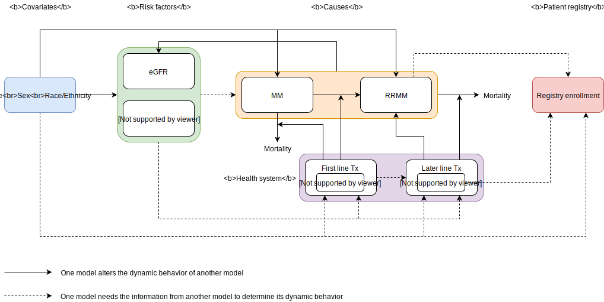

.. role:: underline
    :class: underline

..
  Section title decorators for this document:

  ==============
  Document Title
  ==============

  Section Level 1 (#.0)
  +++++++++++++++++++++

  Section Level 2 (#.#)
  ---------------------

  Section Level 3 (#.#.#)
  ~~~~~~~~~~~~~~~~~~~~~~~

  Section Level 4
  ^^^^^^^^^^^^^^^

  Section Level 5
  '''''''''''''''

  The depth of each section level is determined by the order in which each
  decorator is encountered below. If you need an even deeper section level, just
  choose a new decorator symbol from the list here:
  https://docutils.sourceforge.io/docs/ref/rst/restructuredtext.html#sections
  And then add it to the list of decorators above.

.. _2019_concept_model_vivarium_sanofi_multiple_myeloma_phase_2:

======================================================
Vivarium CSU Multiple Myeloma Registries Phase 2
======================================================

.. contents::
  :local:

.. list-table:: Abbreviations
  :header-rows: 1

  * - Abbreviation
    - Definition
    - Note
  * -
    -
    -

.. _mm2_1.0:

1.0 Background
++++++++++++++

This page describes Phase 2 our multiple myeloma simulation project. :ref:`Phase
1 <2019_concept_model_vivarium_sanofi_multiple_myeloma>` initially focused on a
planned multiple myeloma patient registry, but registry enrollment has been much
lower than expected, so it is no longer a current focus of the client. Instead,
we will use our microsimulation to help the client answer various business
questions about their new drug isatuximab.

* Phase 1 :ref:`concept model
  <2019_concept_model_vivarium_sanofi_multiple_myeloma>` and `HUB page
  <https://hub.ihme.washington.edu/display/COS/Multiple+Myeloma+Registries+Sim+Phase+1>`_

* `Phase 2 HUB page
  <https://hub.ihme.washington.edu/display/COS/Multiple+Myeloma+Registries+Sim+Phase+2>`_

.. _mm2_1.1:

1.1 Project Overview
--------------------

.. _mm2_1.2:

1.2 Literature Review
---------------------

.. _mm2_2.0:

2.0 Modeling Aims and Objectives
++++++++++++++++++++++++++++++++

3.0 Concept Model Diagram
+++++++++++++++++++++++++

.. note::

  This is the concept model diagram from :ref:`Phase 1
  <2019_concept_model_vivarium_sanofi_multiple_myeloma>`. It may need to be
  updated for Phase 2.

4.0 Vivarium Model Components
+++++++++++++++++++++++++++++

4.1 Cause Models
----------------

* :ref:`Multiple Myeloma <2019_cancer_model_multiple_myeloma>`

4.2 Risk Exposure Models
------------------------

4.3 Risk Effects Models
-----------------------

4.4 Intervention Models
-----------------------

5.0 Simulation Scenarios
++++++++++++++++++++++++

6.0 Simulation Parameters
+++++++++++++++++++++++++

6.1 Locations
-------------

6.2 Population and Randomness
-----------------------------

6.3 Timeframe and Intervention Start Dates
------------------------------------------

7.0 Model Builds and Validation Tracking
++++++++++++++++++++++++++++++++++++++++

8.0 Desired Outputs
+++++++++++++++++++

8.1 Final Outputs for Client
----------------------------

8.2 Requested Outputs from Vivarium
-----------------------------------

9.0 Back of the Envelope Calculations
+++++++++++++++++++++++++++++++++++++

10.0 Limitations
++++++++++++++++

11.0 References
+++++++++++++++
