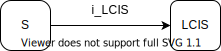

.. role:: underline
    :class: underline

..
  Section title decorators for this document:

  ==============
  Document Title
  ==============

  Section Level 1 (#.0)
  +++++++++++++++++++++
  
  Section Level 2 (#.#)
  ---------------------

  Section Level 3 (#.#.#)
  ~~~~~~~~~~~~~~~~~~~~~~~

  Section Level 4
  ^^^^^^^^^^^^^^^

  Section Level 5
  '''''''''''''''

  The depth of each section level is determined by the order in which each
  decorator is encountered below. If you need an even deeper section level, just
  choose a new decorator symbol from the list here:
  https://docutils.sourceforge.io/docs/ref/rst/restructuredtext.html#sections
  And then add it to the list of decorators above.

.. _2017_concept_model_vivarium_swissre_breastcancer:

====================================
Vivarium CSU Breast Cancer Screening
====================================

.. contents::
  :local:

+------------------------------------+
| List of abbreviations              |
+=======+============================+
| DCIS  | ductal carcinoma in situ   |
+-------+----------------------------+
| LCIS  | lobular carcinoma in situ  |
+-------+----------------------------+
| BC    | breast cancer              |
+-------+----------------------------+
| CII   | critical illness insurance |
+-------+----------------------------+
| NCDs  | non-communicable diseases  |
+-------+----------------------------+
| Tx    | treatment                  |
+-------+----------------------------+
| ACMR  | all cause mortality rate   |
+-------+----------------------------+
| MAM   | mammography                |
+-------+----------------------------+
| BUS   | breast ultra sound         |
+-------+----------------------------+

.. _swbc1.0:

1.0 Background
++++++++++++++

.. _swbc1.1:

1.1 Project overview
--------------------

A health insurance provider in China offers routine breast cancer screening for their insurees. The provider also offers critical illness insurance to cover treatment for those if cancer a diagnosis is made. 

The health insurance provider is interested in estimating the yearly number of detected breast cancer cases for their Chinese insured population under specific screening practices to identify the trends that are important to its critical illness insurance product. This will inform their projections of how much they will pay out for different cancer types under different screening coverage rates. 

.. todo::
  
  - add more project Background
  - Is the provider also interested in mortality/morb from breast cancer? if not, then we can delete the mortality/morb dag?

.. _swbc1.2:

1.2 Literature review
---------------------

  - The peak onset age for breast cancer in Chinese women is between 40 and 50 years, which is younger than that in Western countries by 5 to 10 years. (China Anti-Cancer Association 2019)

.. todo::
 maybe just a brief summary of what the literature says about the exposures/outcome/exp-outcome relationship?

  - what is breast cancer?
  - types of breast cancer?
  - risk factors for breast cancer? 
  - why breast cancer screening
  - predictors of breast cancer screening
  - types of breast cancer screening 

.. _swbc2.0:

2.0 Modeling aims and objectives
++++++++++++++++++++++++++++++++

To estimate the yearly number of cases of breast cancer detected under specific screening practices and the yearly number of deaths from undetected breast cancer (both in unit of per 100,000 insured person-years) in order to identify pay-out trends for critical insurance claims (CII).  

.. _swbc3.0:

3.0 Causal framework
++++++++++++++++++++

.. _swbc3.1:

3.1 Causal diagram
------------------

  .. image:: causal_dagmodel_all.svg

**Outcome (O)**:

  - Breast cancer diagnosis/detection stage 0, 1+
  - Mortality and morbidity

**Most proximal determinant/exposure (E)**:
  
  - Breast cancer status
  - Screening 

**Confounders (C)**:

  - age
  - sex

**Effect modifiers**:

  - N/A

**Mediators (M)**:

  - N/A

.. _swbc3.2:

3.2 Effect sizes
----------------

.. _swbc4.0:

4.0 Intervention
++++++++++++++++

Scale-up of breast cancer screening coverage among insured population 

.. _swbc4.1:

4.1 Simulation scenarios
------------------------

:underline:`Baseline scenario`

30% of insured Chinese female initiate breast cancer screening in 2020 and hold constant to 2040 for blended provinces, where

  * 30 to 69 year olds with family history are provided with MRI every year;
  * 30 to 44 year olds with previous diagnosis of DCIS/LCIS but not family history are provided with ultrasound every year;
  * 45 to 69 year olds with previous diagnosis of DCIS/LCIS but not family history are provided with ultrasound and mammography every year;
  * 30 to 69 year olds at average risk (no family history nor previous diagnosis of DCIS/LCIS) are given mammography every two years.

:underline:`Alternative scenario`

30% of insured Chinese female initiated breast cancer screening in 2020, stay 30% for one year then linearly project to 75% by 2030 and hold constant till 2040 for blended provinces, where:

  * same screening mechanisms as compared to baseline for different age groups and risk exposure level.

.. note::

 high-risk population for breast cancer are women 

  1. with a family history of breast cancer (such that parent, sibling, or child with BRCA1/BRCA2 gene mutation or breast cancer).
  2. with ductal/lobular carcinoma in-situ

 -  GBD risk factors including BMI, smoking, and FPG are not used to determine the high-risk population for breast cancer.

 - Initial screening coverage is a flexible number greater than 22.5%.

 - The target screening coverage is fixed to 75% based on UK setting. 
  

.. _swbc5.0:

5.0 Vivarium modelling components
+++++++++++++++++++++++++++++++++

.. _swbc5.1:

5.1 Vivarium concept model 
--------------------------

.. image:: viviarium_concept_model_vcm.svg

.. _swbc5.2:

5.2 Demographics
----------------

.. _swbc5.2.1:

5.2.1 Population description
~~~~~~~~~~~~~~~~~~~~~~~~~~~~

* Cohort type: Closed cohort of 200,000 insured male (50%) and female (50%) simulants
* Age and sex: Aged 15 to 95+, 5 year-age bands, uniformly distributed age and sex structure
* Time span: Jan 1, 2020 to Dec 31, 2040 with 36.5-day time-steps. 
* Currently assume the sim population buys insurance on the first day of sim start. This means no one has prior insurance and were paid out for their cancers before sim start. 

.. _swbc5.2.2:

5.2.2 Location description
~~~~~~~~~~~~~~~~~~~~~~~~~~

Provinces to model include Tianjin, Jiangsu, Guangdong, Henan, and Heilongjiang. The same population distribution of age and sex will be used among the different provinces.

+-----------------------------------+
| Population size weight table      |
+============+=============+========+
| Province   | location_id | Weight |
+------------+-------------+--------+
| Tianjian   |  517        | 18%    |
+------------+-------------+--------+
| Jiangsu    |  506        | 28%    |
+------------+-------------+--------+
| Guangdong  |  496        | 22%    |
+------------+-------------+--------+
| Henan      |  502        | 16%    |
+------------+-------------+--------+
| Heilong-   |  501        | 16%    |
| jiang      |             |        |
+------------+-------------+--------+

file paths for 2019 forecast data:

   * ACMR (per person-year): /ihme/csu/swiss_re/forecast/294_deaths_12_29_ng_smooth_13.csv
   * incidence (cases per person-year):  /ihme/csu/swiss_re/forecast/429_incidence_12_29_ng_smooth_13.csv
   * prevalence (proportion): /ihme/csu/swiss_re/forecast/429_prevalence_12_29_ng_smooth_13.csv
   * cause-specific mortality (per person-year): /ihme/csu/swiss_re/forecast/429_deaths_12_29_ng_smooth_13.csv

.. note::

 - Multiply acmr, csmr and incidence by 100,000 to get cases per 100,000 person-years.
 - See column **noised_forecast** for output value.  

.. _swbc5.3:

5.3 Models
----------

.. _swbc5.3.1:

5.3.1 Core breast cancer model 
~~~~~~~~~~~~~~~~~~~~~~~~~~~~~~

see :ref:`breast cancer model with stage 0<2017_cancer_model_breast_cancer_with_stage_0>`

Click here to download notebook exploring the forecasted data .nc files:
`forecast data <sw breast cancer forecasted data.ipynb>`

.. _swbc5.3.2:

5.3.2 Screening and detection model
~~~~~~~~~~~~~~~~~~~~~~~~~~~~~~~~~~~

:underline:`I. Screening algorithm`

Breast cancer screening algorithm was derived from the 2019 guidelines from the China Anti-Cancer Association and National Clinical Research Center for Cancer. All simulants will follow this decision tree to decide if they are due a screening. The decision tree branches according to:  

   1) Sex
   2) Age 
   3) Family history
   4) With diagnosis of DCIS/LCIS 

  .. image:: breast_cancer_screening_tree_China2.svg

+--------------------------------------------------------------------------------------------------+
| Screening branches                                                                               | 
+========+========+=======+==========+===========+=====================+=============+=============+
| Branch | Sex    | Age   | Family   | With DCIS | Screening           | Sensitivity | Specificity |
|        |        | group | history  | or LCIS   | tech                |             |             |
+--------+--------+-------+----------+-----------+---------------------+-------------+-------------+
| A      | Female | 30-69 | Yes      | either    | MRI, every year     | 91%         | 100%        |
+--------+        +-------+----------+-----------+---------------------+-------------+-------------+                                             
| B      |        | 30-44 | No       | Yes       | BUS, every year     | 73.7%       | 100%        |      
+--------+        +-------+----------+-----------+---------------------+-------------+-------------+   
| C      |        | 45-69 | No       | Yes       | MAM+BUS, every year | 93.9%       | 100%        |      
+--------+        +-------+----------+-----------+---------------------+-------------+-------------+    
| D      |        | 30-69 | No       | No        | MAM, every 2 years  | 84.8%       | 100%        |
+--------+        +-------+----------+-----------+---------------------+-------------+-------------+    
| E      |        | <30   | either   | either    | No screening                                    |
|        |        | or 70+|          |           |                                                 |
+--------+--------+-------+----------+-----------+-------------------------------------------------+
| F      | Male   | any   | either   | either    | No screening                                    |
+--------+--------+-------+----------+-----------+-------------------------------------------------+
| MAM: mammography; BUS: breast ultrasound                                                         |
| sensitivity and specficity here refers to the entire screening series. We expect the specificity |
| to be 100% (no 'false positives') as a biopsy will likely be done before a cancer diagnosis      | 
+--------------------------------------------------------------------------------------------------+
 
In initialization, We assume that no one has prior knowledge of their DCIS or BC status. Hence no one will be initialized into branch B or C at initialization. Subsequently, if DCIS or LCIS was detected.

For individuals in disease state BC (regardless of detection) they have a transition rate of 0.1 (per person-year) of moving into a recovered state (R); this results in an average duration in state BC of 10 years. Individuals do not ever make a second BC CI claim. We assume that people in breast cancer state and recovered state follow exactly the same screening algorithm, namely branch A, B, or C depending on their age, sex, and family history status. Note that the negaive screening results were expected for those in R state in order to avoid double counting the CI claim from detected breast cancer.

Swiss Re confirmed that no material is available in context of critical illness products for male at any age or female blelow 30 or above 70 in China. The entry age for adult products is 35 and 50 for senior products. So for a 20-year simulation, we wouldn't have much exposure above age 70. Also, for women who have purchased insurance, you would expect them to take up regular screening before 70 anyhow. 

.. note:: 
  see :download:`breast cancer screening memo <breast_cancer_screening_memo.docx>` for more in depth explanation how modelling decisions were adpated from guidelines, as well as assumptions and limitations of these modelling decisions. 

:underline:`II. Probability of attending screening`

 - 1) All simulants will be due a screening according to their attributes in the decision tree
 - 2) Probability of simulants attending their first due screening is 30% (SD=0.3). *Note: this is the parameter we vary in the scale-up scenario* 
 - 3) If a simulant attended their last screening, they have 1.89 (95%CI 1.06-2.49) (Yan et al 2017) more odds of attending the next screening than those who did not attend their last screening. 

+---------------------------------------------------------+
| Hypothetical cross-sectional 2x2 table                  |
+----------------+-------------+---------------+----------+
|                | Attended    |Did not attend | Total    |
|                | last screen |last screen    |          |
+----------------+-------------+---------------+----------+
| Attends        |  a          |  b            | a+b      |
| screening      |             |               |          |
+----------------+-------------+---------------+----------+
| Does not attend|  c          |  d            | c+d      |
| screening      |             |               |          |
+----------------+-------------+---------------+----------+
|                | a+c         | b+d           | a+b+c+d  |
+----------------+-------------+---------------+----------+ 

      (1) :math:`P(\text{attended last screen}) = \frac{a+c}{a+b+c+d}` = 30% (SD 0.3%)
      (2) :math:`P(\text{attends screening}) = \frac{a+b}{a+b+c+d}`  = 30% (SD 0.3%)
      (3) OR = :math:`\frac{a/c}{b/d}=\frac{ad}{bc}` = 1.89 (95%CI 1.06-2.49)
      (4) a+b+c+d = 1

.. code-block:: Python

  1. Solve for a, b, c, d by first solving the following quadratic equation:

  (OR-1)b^2 + b - P(1-P) = 0 

  Once you obtain b, then
  | c=b
  | a=P-b
  | d=(1-P)-b

Using OR value of 1.89 and P as 0.3

  - a = 0.11912
  - b = 0.18088
  - c = 0.18088
  - d = 0.51912

  
*if OR came from a cross-sectional study, then use this set of values*
:math:`P(\text{attends screening among those who attended last screen}) = \frac{a}{a+c}` = 39.7%
:math:`P(\text{attends screening among those who did not attend last screen}) =\frac{b}{b+d}` = 25.8%

.. todo::
  Describe the Yan et al cross-sectional study that produced the OR, and the potential biases

.. note::
  - For now, use normal distibutions with 1% SD around the mean for all parameters i.e. for probability of attending screening, mean is 30%, so please use draws from distribution Normal(mean=30%,SD=0.3)
  - These values are mainly placeholders for now, they may chance. Probability simulant attends first screening is was found to be 22.5% (95%CI 20.4-24.6%) among the general population in Bao et al 2017. We may want to use a slightly higher attendence coverage of ~30% because we believe it might be higher in the population with critical insurance coverage. More research needs to be done to investigate how much higher. 

:underline:`III. Time to next scheduled screening`
 
 - scheduled time to next screening based on algorithm tree irregardless of whether they attended screening. 
 - For those who are in Branch A, B, C (yearly screening): truncated normal distribution with mean 364 days, SD +/- 156 days, lower limit is 100 days, upper limit is 700 days
 - for those in Branch D (every two years screening): truncated normal distribution with mean 728 days, SD +/- 156 days, lower limit is 200 days, upper limit is 1400 days

.. todo:: 

    - (upload notebook exploring Marketscan data that informed the distribution paratmers)

    - I'm wondering if the upper and lower limits of the truncated normal distributions should be narrower? What we are modelling here are the 'guideline times' to next screening, hence shouldn't they fall within the bounds of 1 year or 2 years according to the screening tree? Currently for someone who is in branch A, B, or C and supposed to have yearly screens, their next scheduled screen can be as far in the future as two years (with an upper bound of 700 days). 

    - I'm wondering if the Marketscan data, where we got the empirical distributions from, is giving us the time interval between screens that the patient actually showed up to? (which in our model is a combintation of time to next scheduled screening + probabiltiy of showing up)
    
    - For individuals survive more than 10 years after the diagnosis and treatment, they are going into a remission state and then continuing to get screened in the model.

:underline:`IV. Screening initialization`

The date of the first screening appointment (T_appt) for females at age between 30 and 70 is determined as follows. We assume that each simulant had a previous appointment scheduled at some point before the simulation begins. We calculate the time between that past appointment and their next appointment (delta_T) using the methodology outlined in Section 5.3.2.III (Time to next scheduled screening). With a uniform distribution we randomly determine how far along that time interval between appointments each individual is (X) at the beginning of the simulation (T_0). For females under 30 when the simulation begins the methodology is identical, except T_0 is the simulant's 30th birthday rather than the beginning of the simulation. No screening appointment will be initialized for males at any age, as well as females above 70.

.. image:: screening_event_time.svg

.. _swbc5.3.3:

5.3.3 Alternative screening scenarios model
~~~~~~~~~~~~~~~~~~~~~~~~~~~~~~~~~~~~~~~~~~~

 (1) **Baseline**: breast cancer screening uptake of 30% among insured population from 2020-2040.
 (2) **Alternative scenario**: breast cancer screening uptake of 30% among insured population from 2020-2021, then linear increase to 75% by 2030 and hold constant until 2040

.. image:: screening_scale_up_figure.svg

.. todo:: 
  -More work needs to be done to finalize a baseline screening uptake value. Right now the 30% comes from a 22.5% screening uptake in the general population by Bao et a 2018. We believe the insured population would have a higher screening uptake than the general population.     

.. _swbc5.3.4:

5.3.4 Family history model
~~~~~~~~~~~~~~~~~~~~~~~~~~

Family history determines which screening branch a simulant will undertake. Subsequently, the screening branch and the underlying incidence of disease among simulants within each branch determines the rate of disease detection. 

Family history is a risk factor that increases the likelihood that one gets breast cancer. Hence the state transition incidence rate for those who have a family history of breast cancer is higher than the incidence rate for those who do not have a family history of breast cancer. In order to model disease incidence among those with and without family history, we need to obtain the marginal incidences of those with and without family history from the joint incidence. 

:underline:`1. From susceptable S state to DCIS state`

.. image:: S_to_DCIS.svg

- Let family history be denoted as fh
- Let the prevalence of family history **among the S state populatio** be :math:`P_{fh{s}}`
- Let i_DCIS be the overall incidence from S state to DCIS state (:ref:`see breast cancer with stage 0 model for i_DCIS value <2017_cancer_model_breast_cancer_with_stage_0>`)
- Let Incidence among those with family history be  :math:`i_{DCIS{|fh1}}`
- Let Incidence among those without family history be :math:`i_{DCIS{|fh0}}`
- Let PAF be the population attributable fraction of family history on DCIS among the S population
- Let RR be the ratio of the probability of developing the outcome DCIS in the exposed to family history group versus the probability of developing the outcome DCIS in the unexposed to family history group among the S state population.

(1) RR = 2.64 (95%CI 1.56–4.47) for China population
(2) :math:`P_{fh{s}}` = 0.02
(3) PAF= :math:`\frac{P_{fh{s}}(RR-1)}{1+P_{fh{s}}(RR-1)}`
(4) 1-PAF= 

(5) :math:`i_{DCIS{|fh1}} =  i_{DCIS}\times(1-PAF)\times RR`
(6) :math:`i_{DCIS{|fh0}} =  i_{DCIS}\times(1-PAF)`

:underline:`2. From susceptable S state to LCIS state`

- Let family history be denoted as fh
- Let the prevalence of family history **among the S state population** be :math:`P_{fh{s}}`
- Let i_LCIS be the overall incidence from S state to LCIS state (:ref:`see breast cancer with stage 0 model for i_LCIS value <2017_cancer_model_breast_cancer_with_stage_0>`)
- Let incidence among those with family history be  :math:`i_{LCIS{|fh1}}`
- Let incidence among those without family history be :math:`i_{LCIS{|fh0}}`
- Let PAF be the population attributable fraction of family history on LCIS among the S population
- Let RR be the ratio of the probability of developing the outcome LCIS in the exposed to family history group versus the probability of developing the outcome LCIS in the unexposed to family history group among the S state population (we are using the RR for breast cancer for this value, see note below).

(1) RR = 2.64 (95%CI 1.56–4.47) for China population
(2) :math:`P_{fh{s}}` = 0.02
(3) PAF= :math:`\frac{P_{fh{s}}(RR-1)}{1+P_{fh{s}}(RR-1)}`
(4) 1-PAF= 

(5) :math:`i_{LCIS{|fh1}} =  i_{LCIS}\times(1-PAF)\times RR`
(6) :math:`i_{LCIS{|fh0}} =  i_{LCIS}\times(1-PAF)`

.. note::

  - The value of RR we use in the above is actually for family history (exposure) to breast cancer (outcome). We are using the RR for breast cancer outcome instead of DCIS or LCIS because are unable to obtain a relative risk from DCIS or LCIS state to breast cancer among the DCIS or LCIS population respectively. 
  - In using the RR for breast cancer outcome as the RR for DCIS/LCIS outcome, we over-estimate the DCIS cases detected by screening and under-estimate breast cancer cases detected by screening (this is because those with family history are screened twice as often). This means it will under-estimate the total pay-out value. (assuming there is a relative risk > 1 of family history on breast cancer from DCIS and LCIS state in reality).
  - The RR of family history is a pooled estimate derived from 10 China-specific studies. 

.. todo::

  if the bias stated above is unclear, I can write out a numberical example to illustrate this

:underline:`3. From susceptable DCIS state to Breast cancer state`

.. image:: DCIS_to_BC.svg

We assume family history does not affect incidence rates from DCIS to breast cancer among the DCIS population. The RR of breast cancer among those with family history vs. those without family history is 1. 

:underline:`4. From susceptable LCIS state to Breast cancer state`

.. image:: LCIS_to_BC.svg

We assume family history does not affect incidence rates from LCIS to breast cancer among the DCIS population. The RR of breast cancer among those with family history vs. those without family history is 1. 

.. _swbc5.3.5:

5.3.5 DCIS and LCIS treatment model
~~~~~~~~~~~~~~~~~~~~~~~~~~~~~~~~~~~

 - treatment model baseline (using forecasted breast cancer incidence)
 - screening scale-up and treatment coverage scale-up model (change in incidence should reduce breast cancer prevalence, mortaliaty and morbidity)

:underline:`Baseleine scenario for DCIS`

:math:`i_{BC|DCIS{tx1}}  = i_{BC|DCIS} \times (1 - PAF) \times RR_{tx|DCIS}`
:math:`i_{BC|DCIS{tx0}}  = i_{BC|DCIS} \times (1 - PAF)`

- Let tx be denoted as treatment for DCIS
- Let :math:`i_{BC|DCIS{tx1}}` be the incidence of breast cancer from DCIS after treatment.
- Let  :math:`i_{BC|DCIS{tx0}}` be the incidence of breast cancer from DCIS among those without treatment
- Let PAF be the population attributable fraction of treatment for people who have DCIS
- :math:`i_{BC|DCIS}` is the incidence of breast cancer from DCIS
- :math:`P_{tx1}` is the proportion of people who have DCIS and treatment 
- :math:`1-P_{tx1}` is the poportion of people who have DCIS and no treatment
- :math:`RR_{tx|DCIS}` is the ratio of probability of developing breast cancer in treatment group versus no treatment group among the DCIS population, where value changes according to treatment type.

(1) :math:`RR_{tx|DCIS}` = 0.53 for mastectomy versus no surgery, 0.40 for lumpectomy + radiotherapy versus no surgery, and 0.69 for lumpectomy only versus no surgery, respectively. (Mannu 2020, BMJ)
(2) PAF = :math:`\frac{P_{tx1}(RR_{tx|DCIS}-1)}{1+P_{tx1}(RR_{tx|DCIS}-1)}`
(3) :math:`P_{tx1}` = 30% as baseline screening uptake x 97.5% as treatment uptake

.. list-table:: The distribution of DCIS treatment types (Mannu 2020, BMJ) 
   :header-rows: 1

   * - Treatment among women diagnosed with unilateral DCIS 1988-2014 (N=30,496)
     - Percent (%)
   * - lumpectomy only
     - 49.8%
   * - lumpectomy + radiotherapy
     - 17.6%
   * - mastectomy
     - 27.8%
   * - no surgery
     - 4.7%

.. note:: 
   - verification: check to see if :math:`i_{BC|DCIS{tx1}} < i_{BC|DCIS{tx0}}`
   - note conclusions from Narod 2015: However, although it is accepted that, for women with invasive breast cancer, prevention of in breast recurrence does not prevent death, (see ref 26 in paper) this has not been widely accepted for women with DCIS. Also, for women with invasive cancers it is accepted that, in terms of survival, lumpectomy is equivalent to mastectomy, (see ref 27 in paper) even though patients who undergo mastectomy experience fewer local recurrences. For women with invasive cancer, radiotherapy is given to prevent in-breast recurrence, but the effect of radiotherapy on mortality is acknowledged to be small. (see ref 26 in paper) In the SEER database, these relationships between local recurrence and mortality hold equally well for patients with DCIS. These observations have been reported in other studies as well. (see ref 7, 10, and 28 in paper)

:underline:`Baseleine scenario for LCIS`

:math:`i_{BC|LCIS{tx1}}  = i_{BC|LCIS} \times (1 - PAF) \times RR_{tx|LCIS}`
:math:`i_{BC|LCIS{tx0}}  = i_{BC|LCIS} \times (1 - PAF)`

- Let tx be denoted as treatment for LCIS
- Let :math:`i_{BC|LCIS{tx1}}` be the incidence of breast cancer from LCIS after treatment.
- Let  :math:`i_{BC|LCIS{tx0}}` be the incidence of breast cancer from LCIS among those without treatment
- Let PAF be the population attributable fraction of treatment for people who have LCIS
- :math:`i_{BC|LCIS}` is the incidence of breast cancer from LCIS
- :math:`P_{tx1}` is the proportion of people who have LCIS and treatment 
- :math:`1-P_{tx1}` is the poportion of people who have LCIS and no treatment
- :math:`RR_{tx|LCIS}` is the ratio of probability of developing breast cancer in treatment group versus no treatment group among the LCIS population, where value changes according to treatment type.

(1) :math:`RR_{tx|LCIS}` = 0.44 (95% CI 0.16-1.06) for those treated with tamoxifen versus placebo. (Fisher 1998, JNCI)
(2) PAF = :math:`\frac{P_{tx1}(RR_{tx|LCIS}-1)}{1+P_{tx1}(RR_{tx|LCIS}-1)}`
(3) :math:`P_{tx1}` = 30% as baseline screening uptake x 20% as treatment uptake

.. list-table:: The distribution of LCIS treatment types (King 2015, J Clin Oncol) 
   :header-rows: 1

   * - Treatment among women diagnosed with LCIS 1980-2009 (N=1,060)
     - Percent (%)
   * - surveillance alone
     - 78.4%
   * - surveillance +  chemoprevention
     - 16.3%
   * - mastectomy
     - 5.3%

.. note:: 
   - verification: check to see if :math:`i_{BC|LCIS{tx1}} < i_{BC|LCIS{tx0}}` 
   - note treatment efficacy of tamoxifen is slightly lower in paticipants with family history as compared with those without family history, hence we can assume that the relative risk of treatment is weakly or not associated with family history. 

:underline:`Alternative scenarios`

As screening coverage increases, so does :math:`P_{tx1}`. Therefore, a larger proportion of simulants will have incidence :math:`i_{BC|DCIS{tx1}}` or :math:`i_{BC|LCIS{tx1}}`. 

.. _swbc5.4:

5.4 Input Data Sources
-----------------------

.. list-table:: Correspondence With Manoj, Cancer Expert 
   :header-rows: 1

   * - Assumption in Model
     - Evidence
     - Manoj’s Expert Opinion
     - Final Value
   * - Excess mortality of 0 for in-situ growths
     - 
     - We are correct in this assumption. Those who did die were likely improperly 
       diagnosed or treated and invasive cancer would have been the real cause 
       of death.
     - Excess mortality of **0** for in-situ growths
   * - DCIS duration of 3 years
     - Ma et al 2017, Chinese Journal of Epidemiology
     - Elshof et al found that fifteen years after DCIS diagnosis, cumulative 
       incidence of invasive breast cancer was 1.9 % after mastectomy, 8.8 % 
       after breast conservation surgery plus radiation and 15.4 % after breast 
       conservation surgery alone.
     - **3 years.** In Ma et al, abstract states that median of annual transition 
       rate from DCIS to stage 1 invasive breast cancer is 0.279. The duration 
       was calculated as inverse of the annual transition rate, approximately 
       3.6 years. A total of 7 studies reported the duration from predinical to 
       clinical stage for DCIS, the values vary from 0 to 7 years for all ages. 
   * - LCIS duration of 5 years
     - Assumption, have not found evidence for this yet besides a longer duration 
       than DCIS.
     - 
     - **5 years.** TO-DO: write justification to explain why LCIS duration longer 
       than DCIS.
   * - Relative Risk of family history of 2.64 (UI 1.56–4.47) for China 
       population and 1.92 (UI 1.55-2.38) for China and other countries
     - Meta-analyses using 10 Chinese specific papers. Wang 1992, Huang 2007, 
       Zheng 2010, Yu 2012, Zhou 2013, Wang 2015, Wang 2019, Yu 2012, 
       Wang 1992, Li 2013, Tao 1988 and 7 other countries papers Wahidin 2018, 
       Gokdemir-Yazar 2014, Martin 2010, Thomson 2014, Baglia 2018, 
       Carpenter 2003, Khalis 2018
     - I think it makes sense to use the China specific data for family history.
     - Relative Risk of family history of 2.64 (UI 1.56–4.47) for China 
       population. Justification: There are 7 other country papers, but they lead 
       to a lower synthesized estimate (1.92) and we erred on the side of more 
       uncertainty and a higher mean. Use Log-normal distribution: **exp(normal( 
       mean=log(2.64), SD=0.27))**
   * - DCIS treatment efficacy
     - Literature, Mannu 2020 BMJ
     - With regard to treatment efficacy, the comparison groups are not the same, 
       but the relative risk of developing an invasive breast cancer after 
       mastectomy is lower than for the other interventions. Any typically 
       mastectomy would be the preferred option if the DCIS is diffuse.
     - Relative risk of 0.40 for lumpectomy + radiotherapy versus no surgery. 
       Use normal distribution: **normal(mean=0.40, SD=0.05)**
   * - LCIS treatment efficacy
     - Literature, Fisher 1998 JNCI
     - 
     - Relative risk of 0.44 (UI 0.16–1.06) for those treated with tamoxifen 
       versus placebo. Use Log-normal distribution: **exp(normal(mean=log(0.44), 
       SD=0.48))**
   * - DCIS treatment coverage
     - Literature, Mannu 2020  BMJ
     - Among US women, the percentages receiving the various treatment for DCIS 
       are different than what you document. Using SEER data, Worni et al of over 
       120,000 women with DCIS between 1991 and 2010, found that the most common 
       treatment was lumpectomy with radiation (43%), then lumpectomy (27%), then 
       mastectomy (unilateral - 24%, bilateral 4.5%). 2.3% did not receive any 
       intervention. There were changes over time.
     - 97.5% (UI 95-100%) of people diagnosed with DCIS receive treatment. 
       Justification: SEER found 2.3% no intervention in USA, Mannu 2020 found 
       no surgery in 4.7% in UK. Use triangular distribution: **triangular(lower limit=0.95, mode=0.975, upper limit=1)**
   * - LCIS treatment coverage
     - King 2015, J Clin Oncol
     - I think the proportion of treatment for LCIS is accurate.
     - 20.0% (UI 15-25%) of people diagnosed with LCIS receive treatment. 
       Justification: 21.6% treated in King 2015 (MSK cancer center, USA), but 
       value might be different in china insured population. Use triangular 
       distribution: **triangular(lower limit=0.15, mode=0.20, upper limit=0.25)**
   * - 30% screening coverage in baseline scenario
     - Bao et al found 22.5% screening probability in general population and we 
       assumed that the insured population in our simulation would have a higher attendance coverage than the general population.
     - 
     - Use normal distribution: **normal(mean=0.3, SD=0.003)**

.. _swbc5.5:

5.5 Desired outputs
-------------------

.. _swbc5.6:

5.6 Output meta-table shell
---------------------------

:download:`output table shell<output_table_shell_breastcancer.csv>`

.. todo::
  any special stratifications?

.. _swbc5.7:

5.7 Validation and verification
-------------------------------

:underline:`Model 1: Core Cancer`

See :ref:`core cancer model validation criteria <2017_cancer_model_breast_cancer_with_stage_0>`

:underline:`Model 2: Screening and Detection`

Compare age-/sex-specific breast cancer detection rate calculated from simulation baseline to insured claim rate of 2016 provided by Swiss Re. They do expect breast claims to increase 4% annually, so we need to multiply by (1+4%)^4 on the 2016 data for all ages above 20 in order to project the breast cancer claim rates to simulation star year 2020.

:underline:`Model 3: Alternative Screening Scenario`

Compare year-specific screening coverage yield from simulation to what we proposed in scenario design. The population screening coverage can be calculated from dividing `attended screening event count` by `scheduled screening event count` for each year. This coverage is supposed to be 30% whole time at baseline, it reaches 75% in 2030 at alternative scenario with 5% average increase from 2021 to 2030 and keep 75% till 2040.

:underline:`Model 4: Family History Risk Factor`

Compare prevalence and relative risk of family history from simulation to extracted literature values, neither of the measures are dependent on age, sex, and year in simulation. 

:underline:`Model 5: Treatment`

After we adjust the treatment coverage for DCIS and LCIS to a value not equal to 100%, we should compare relative risk of treatment for DCIS yield from simulation to literature evidence, and also repeat the comparison for LCIS.  

.. _swbc6.0:

6.0 Back-of-envelope calculations
+++++++++++++++++++++++++++++++++

What's the proportion of deaths due to breast cancer out of total deaths we would expect if we made following assumptions:

 1. breast cancer deaths in China among female at all ages in 2020 = 1.89% of the total deaths (95CI% 1.48-2.43)
 2. assume treatment efficacy for those who diagnosed DCIS or LCIS and received surgical management = 50% reduction to invasive breast cancer
 3. assume treatment coverage = 95% for those who undergo breast cancer screening
 4. change in screening coverage from baseline to alternative scenario = 75% - 30% = 45% for a 20-year simulation

In 2040, the averted breast cancer deaths in China among female at all ages = 1.89% * 50% * 95% * 45% = 0.40% of the total deaths by scaling up breast cancer screening.

.. todo::
  
  What would we expect for breast cancer detection rate at the end of simulation? 

.. _swbc7.0:

7.0 Limitations
+++++++++++++++

a.  How to incorporate the health utilization estimates when building the screening algorithm?
b.  How to capture the change of risk exposure level or screening coverage switching from general population to insured population? (e.g. 20% less of smoking prevalence for insured population)
c.  How do we design a scenario that initiates the commercial screening like liquid biopsy to all cancer sites?
d.  What's the duration of people stay in DCIS or LCIS?
e.  No forecast data is avalialbe for DCIS and LCIS, the measures are imputed from marketscan outpatient data and breast cancer forecasts.
f.  No false positives will be captured in the simulation if we assume 100% specificity for different breast cancer screening tests.
g.  We assume that breast cancer always progress through the cancer in-situ stage to the malignant stage.
h.  We set a constant breast cancer screening coverage across ages, where the real world may have a larger value in younger population and smaller value in elder population.
