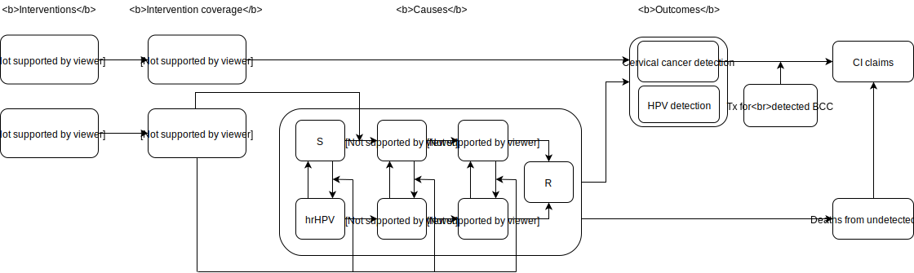
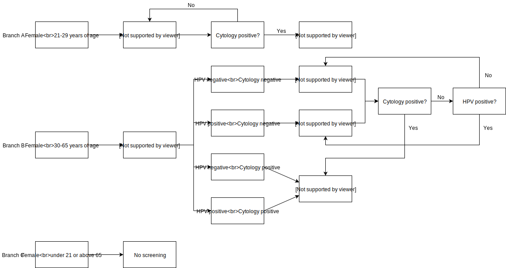

.. role:: underline
    :class: underline

..
  Section title decorators for this document:

  ==============
  Document Title
  ==============

  Section Level 1 (#.0)
  +++++++++++++++++++++
  
  Section Level 2 (#.#)
  ---------------------

  Section Level 3 (#.#.#)
  ~~~~~~~~~~~~~~~~~~~~~~~

  Section Level 4
  ^^^^^^^^^^^^^^^

  Section Level 5
  '''''''''''''''

  The depth of each section level is determined by the order in which each
  decorator is encountered below. If you need an even deeper section level, just
  choose a new decorator symbol from the list here:
  https://docutils.sourceforge.io/docs/ref/rst/restructuredtext.html#sections
  And then add it to the list of decorators above.

.. _cervical_cancer_concept_model:

=======================================
Vivarium CSU Cervical Cancer Simulation
=======================================

.. contents::
  :local:

.. list-table:: List of abbreviations
   :header-rows: 1

   * - Label
     - Definition
   * - BCC
     - benign cervical cancer
   * - CC
     - cervical cancer 
   * - ACMR
     - all-cause mortality rate
   * - prev_c432
     - prevalence of cervical cancer
   * - incidence_c432
     - incidence of cervical cancer
   * - csmr_c432
     - cause-specific mortality rate of cervical cancer

.. _1.0:

1.0 Background
++++++++++++++

.. _1.1:

1.1 Project overview
--------------------
This project will generate forecasts of cervical cancer mortality and morbidity 
to allow Swiss Re to identify trends that are important to its business 
decision-making. IHME will produce both a baseline (business as usual) forecast, 
and an alternative scenario forecast in which key cervical cancer screening 
practice and HPV vaccination are implemented in a simulation framework. Baseline 
forecasts will incorporate expected trends in relevant risk factors. Alternative 
scenario forecasts will incorporate baseline forecasts and the expected impact of 
new screening technologies and vaccination. All forecasts will represent the Swiss 
Re’s insured population from the weighted blend of Chinese provinces. Forecasts 
run from year 2020 to 2040.

.. _1.2:

1.2 Literature review
---------------------

.. todo::

 add more literature background

.. _2.0:

2.0 Modeling aims and objectives
++++++++++++++++++++++++++++++++
IHME will estimate the yearly number of cases of benign and invasive cervical 
cancer detected under specific cervical cancer screening practices and the yearly 
number of deaths from undetected cervical cancer (both in unit of per 100,000 
insured person-years) in order to identify pay-out trends for cervical cancer 
claims.

.. _3.0:

3.0 Causal framework
++++++++++++++++++++

.. _3.1:

3.1 Causal variables
--------------------
 
Outcome
 - Cervical cancer detection (benign and invasive)
 - Mortality and morbidity of cervical cancer
Most proximal determinant/exposure
 - Cervical cancer status
 - Cervical cancer screening
 - HPV infection
 - HPV vaccination status
Confounders
 - age
 - sex
Effect modifiers
 - N/A
Mediators
 - N/A

.. _4.0:

4.0 Intervention
++++++++++++++++
Scale-up of both cervical cancer screening coverage and HPV vaccination rate 
among insured population

.. _4.1:

4.1 Simulation scenarios
------------------------
**Baseline:** by 2040, project existing level of cervical cancer screening for 
women aged 21 to 65; linear ramp up HPV vaccination to cover 90% of the women 
aged 15 to 45 in 2030, then stay 90% in 2031-2040. Where:
 - Women without HPV infection are provided with cytology every three years
 - Women with HPV infection are provided cytology every year

**Alternative scenario:** by 2040, project existing level of HPV vaccination for 
women aged 15 to 45; linear ramp up cervical cancer screening to cover 70% of the 
women aged 21 to 65 in 2030, then stay 70% in 2031-2040. Where:
 - Women without HPV infection are provided with cytology every three years
 - Women with HPV infection are provided cytology every year

.. image:: cervical_cancer_scale_up.PNG

.. list-table:: Intervention scale-up
   :header-rows: 1

   * - Scenario
     - Intervention
     - Year
     - Coverage
   * - Baseline
     - Cervical cancer screening
     - 2020-2040
     - 25%
   * - Baseline
     - HPV vaccination
     - 2020-2030
     - Stay 10% in 2020-2021, then linearly ramp up from 10% to 90% in 2021-2030.
   * - Baseline
     - HPV vaccination
     - 2031-2040
     - 90%
   * - Alternative
     - HPV vaccination
     - 2020-2040
     - 10%
   * - Alternative
     - Cervical cancer screening
     - 2020-2030
     - Stay 25% in 2020-2021, then linearly ramp up from 25% to 70% in 2021-2030.
   * - Alternative
     - Cervical cancer screening
     - 2031-2040
     - 70%

.. note::

 - Wang et al. reported a current cervical cancer screening coverage of 20.7% 
   with 95%CI 18.6-22.8 in China. We set it as 25% as we believe insured population has higher screening coverage than general population. 
 - No data has identified for current HPV vaccination rates in China. Temporarily 
   we will use 10%.
 - The target screening and HPV vaccination coverage in 2030 are guided by WHO 
   cervical cancer elimination strategy.

.. _5.0:

5.0 Vivarium modelling components
+++++++++++++++++++++++++++++++++

.. _5.1:

5.1 Vivarium concept model 
--------------------------

.. _5.2:

5.2 Demographics
----------------

.. _5.2.1:

5.2.1 Population description
~~~~~~~~~~~~~~~~~~~~~~~~~~~~
 - Cohort type: Closed cohort of 200,000 insured female (100%) simulants.
 - Age and sex: Age 15 to 95+, 5 year-age bands, uniformly distributed age and 
   sex structure.
 - Time span: Jan 1, 2020 to Dec 31, 2040 with 36.5-day time-steps.
 - Location: blended with province-specific weight in China.

.. _5.2.2:

5.2.2 Location description
~~~~~~~~~~~~~~~~~~~~~~~~~~
Provinces to model include Tianjin, Jiangsu, Guangdong, Henan, and Heilongjiang. 
The uniform distribution of age and sex structure will be used among the different 
provinces.

.. list-table:: location weight table
   :header-rows: 1

   * - Province
     - location id
     - Weight
     - Weighted ACMR (per 100,000 person-years)
     - Weighted prev_c432 (proportion)
     - Weighted incidence_c432 (cases per 100,000 person-years)
     - Weighted csmr_c432 (per 100,000 person-years)
   * - Tianjin
     - 517
     - 18%
     - e^(ACMR) * 100,000 * 18%
     - e^(prev_c432) * 18%
     - incidence_c432 * 100,000 * 18%
     - csmr_c432 * 100,000 * 18%
   * - Jiangsu
     - 506
     - 28%
     - e^(ACMR) * 100,000 * 28%)
     - e^(prev_c432) * 28%
     - incidence_c432 * 100,000 * 28%
     - csmr_c432 * 100,000 * 28%
   * - Guangdong
     - 496
     - 22%
     - e^(ACMR) * 100,000 * 22%
     - e^(prev_c432) * 22%
     - incidence_c432 * 100,000 * 22%
     - csmr_c432 * 100,000 * 22%
   * - Henan
     - 502
     - 16%
     - e^(ACMR) * 100,000 * 16%
     - e^(prev_c432) * 16%
     - incidence_c432 * 100,000 * 16%
     - csmr_c432 * 100,000 * 16%
   * - Heilongjiang
     - 501
     - 16%
     - e^(ACMR) * 100,000 * 16%
     - e^(prev_c432) * 16%
     - incidence_c432 * 100,000 * 16%
     - csmr_c432 * 100,000 * 16%

.. note::

 Forecast data were temporarily saved to /ihme/costeffectiveness/vivarium_csu_cancer/{measure_name}_scaled_logit_no_bounds_max_6_1000_year_fix_lik.nc

 - ACMR: Using transformed data from breast cancer model
 - prev_c432: 432_ets_prevalence
 - incidence_c432: 432_ets_incidence
 - csmr_432: 432_ets_deaths
 
 Zach is working on updating forecast data to GBD 2019, so expect these filenames 
 to change soon. 

.. _5.3:

5.3 Models
----------

.. _5.3.1:

5.3.1 Core cervical cancer model
~~~~~~~~~~~~~~~~~~~~~~~~~~~~~~~~

see :ref:`cervical cancer cause model<2017_cancer_model_cervical_cancer>`

.. _5.3.2:

5.3.2 Screening and detection model
~~~~~~~~~~~~~~~~~~~~~~~~~~~~~~~~~~~

:underline:`I. Screening algorithm`

Cervical cancer screening algorithm was determined by three variables 
 1) Sex
 2) Age 
 3) Diagnosis of HPV infection

.. list-table:: Screening branches
   :header-rows: 1

   * - Branch
     - Sex
     - Age
     - Screening technology
     - Co-test result
     - Co-test sensitivity
     - Co-test specificity
     - Follow-up test
     - Follow-up test sensitivity
     - Follow-up test specificity
   * - A
     - Female
     - 21-65
     - Cytology plus HPV test, every 3 years
     - HPV negative, Cytology negative
     - 17.4%
     - 100%
     - Cytology, every 3 years
     - 65.9% (95%CI 54.9 to 75.3)
     - 100%
   * - B
     - Female
     - 21-65
     - Cytology plus HPV test, every 3 years
     - HPV positive, Cytology negative
     - 23.5%
     - 100%
     - Cytology, every year
     - 65.9% (95%CI 54.9 to 75.3)
     - 100%
   * - C
     - Female
     - 21-65
     - Cytology plus HPV test, every 3 years
     - HPV negative, Cytology positive
     - 5.9%
     - 100%
     - 
     - 
     - 
   * - D
     - Female
     - 21-65
     - Cytology plus HPV test, every 3 years
     - HPV positive, Cytology positive
     - 53.2%
     - 100%
     - 
     - 
     - 
   * - E
     - Female
     - <21 or 65+
     - No screening
     - 
     - 
     - 
     - 
     - 
     - 
   * - F
     - Male
     - Any
     - No screening
     - 
     - 
     - 
     - 
     - 
     - 

.. note::
 
 - Co-test (cytology plus HPV test) is not highly recommended for women under 
   30 according to guidelines from American Cancer Society and U.S. Preventive Services Task Force. To simply our screening algorithm, we decided to set initial age of the co-test to be the same as initial age of cytology alone, 
   namely 21 years old in our simulation.
 - The stand-in value of co-test sensitivity was extracted from Schiffman et al. 
   2018.
 - For now, follow-up test is not applicable with positive Cytology results. 
   Though colposcopy is recommended after diagnosis of benign/invasive cervical cancer, we could use colposcopy referral rate to determine treatment coverage for benign cervical cancer. 
 - Specificity for both co-test and cytology alone are set to 100% in our model. 

In initialization, We assume that
 - No one has prior knowledge of their disease status (and HPV status) on day one 
   of the simulation.
 - All simulants are buying insurance on day one of the simulation.
 - For simulants in cervical cancer (CC) state regardless of detection, they have 
   a transition rate of 0.1 (per person-year) of moving into a recovered (R) state; this results in an average duration in state CC of 10 years. People in state CC and R follow exactly the same screening algorithm, namely branch A, B, C, or D depending on their age, sex, and co-test result. Simulants do not ever make a second cervical cancer claim, therefore the negative screening results were expected for those in R state in order to avoid double counting the CI claim from detected cervical cancer.

:underline:`II. Screening schedule and attendance`

Probability of attending screening
 - Generate 1000 draws from normal distribution with mean=0.2, SD=0.002 for
   calculating the probability of simulants attending their first due screening.
 - If a simulant attended their last screening, they have 1.89 with 95%CI 1.06-2.49
   (Yan et al. 2017) more odds of attending the next screening than those who did
   not attend their last screening. 
Time to next scheduled screening
 - For those who are in Branch A (yearly cytology): use truncated normal
   distribution with mean 364 days, SD +/- 148 days, lower limit is 100 days,
   upper limit is 700 days.
 - For those in Branch B (every 3 years cytology): use truncated normal
   distribution with mean 1092 days, SD +/- 148 days, lower limit is 300 days,
   upper limit is 2100 days.

:underline:`III. Screening initialization`

The date of the first screening appointment (T_appt) for females at age between 
21 and 65 is determined as follows. We assume that each simulant had a previous 
appointment scheduled at some point before the simulation begins. We calculate 
the time between that past appointment and their next appointment (delta_T) using 
the methodology outlined in Section 5.3.2.II (Time to next scheduled screening). 
With a uniform distribution we randomly determine how far along that time interval 
between appointments each individual is (X) at the beginning of the simulation (
T_0). For females under 21 when the simulation begins the methodology is identical, 
except T_0 is the simulant's 30th birthday rather than the beginning of the 
simulation. No screening appointment will be initialized for males at any age, as 
well as females above 65.

.. image:: cervical_cancer_screening_event_time.svg

.. _5.3.3:

5.3.3 Risk factor model
~~~~~~~~~~~~~~~~~~~~~~~
GBD risk factors: N/A

Non-GBD risk factor: Human Papilloma Virus (HPV)
 - prevalence: 19.0% with 95%CI 17.1-20.9 (Li et al. 2019)
 - Incidence: TBD
 - exposure distirbution: dichotomous
 - relative risk: RR = 16.2 with 95%CI 9.6 to 27.3 (Chen et al. 2011)

relevant formulas 
 (1) PAF = :math:`\frac{\text{Prev_HPV}(RR-1)}{\text{Prev_HPV}(RR-1)+1}`
 (2) :math:`\text{i_HPV+} =  i \times (1-PAF) \times RR`
 (3) :math:`\text{i_HPV-} =  i \times (1-PAF)`

.. note::

  - Find HPV incidence (age-specific or age-standardized) from external sources
  - How can we include the change of HPV incience by year?

.. _5.3.4:

5.3.4 Treatment model
~~~~~~~~~~~~~~~~~~~~~
Treatment for benign cervical cancer

.. todo::

 add more details

.. _5.4:

5.4 Input data sources
----------------------

.. list-table:: Model inputs
   :header-rows: 1

   * - Input parameter
     - Value
     - Source
     - Note
   * - Duration from BCC to CC
     - 14.5 years
     - Chen et al. 2011
     - Globally, the duration ranged from 5-15 years
   * - Initial cervical cancer screening coverage
     - 25%
     - Wang et al. 2015
     - It's an arbitrary number greater than 20.7%.
   * - Target cervical cancer screening coverage in 2030
     - 70%
     - WHO cervical cancer elimination strategy
     - 
   * - Initial HPV vaccination coverage
     - 10%
     - 
     - The current HPV vaccination rates remain low in China, no data has
       identified.
   * - Target HPV vaccination coverage in 2030
     - 90%
     - WHO cervical cancer elimination strategy
     - 
   * - Screening sensitivity of co-test
     - The detection rates of HPV-/Cytology-, HPV+/Cytology-, HPV-/Cytology+, 
       HPV+/Cytology+ are 17.4%, 23.5%, 5.9%, 53.2%, respectively.
     - Schiffman et al. 2018
     - 
   * - Screening sensitivity of cytology alone
     - 65.9% (95% CI 54.9 to 75.3)
     - Koliopoulos et al. 2017
     - 
   * - Screening specificity of both co-test and cytology alone
     - 100%
     - 
     - by client’s assumption
   * - Prevalence of HPV
     - 19.0% (95%CI 17.1-20.9)
     - Li et al. 2019
     - 
   * - Incidence of HPV
     - 
     - 
     - 
   * - Relative risk of HPV
     - 16.2 (95%CI 9.6 to 27.3)
     - Chen et al. 2011
     - 
   * - BCC treatment coverage
     - 
     - 
     - 
   * - BCC treatment efficacy
     - 
     - 
     - 

.. _5.5:

5.5 Output meta-table shell
---------------------------

.. list-table:: Output shell table
   :header-rows: 1

   * - Location
     - Year
     - Birth cohort
     - Sex
     - Risk group
     - Scenario
     - Outcome
   * - Blended provinces in China
     - 2020
     - 2000-2005
     - Female
     - Average risk without HPV infection
     - Baseline
     - Number of benign cervical cancer cases detected among policyholders
   * - 
     - ...
     - ...
     - 
     - High risk with HPV infection
     - Alternative
     - Number of invasive cervical cancer cases detected among policyholders
   * - 
     - 2040
     - 1925-1930
     - 
     - 
     - 
     - Number of deaths from undetected invasive cervical cancer among policyholders
   * - 
     - 
     - 
     - 
     - 
     - 
     - Change of detected benign cervical cancer cases as compared with baseline
   * - 
     - 
     - 
     - 
     - 
     - 
     - Change of detected invasive cervical cancer cases as compared with baseline
   * - 
     - 
     - 
     - 
     - 
     - 
     - Change of deaths from undetected invasive cervical cancer as compared with
       baseline

.. _6.0:

6.0 Validation and verification
+++++++++++++++++++++++++++++++
TBD

.. _7.0:

7.0 Limitations
+++++++++++++++
TBD

.. _8.0:

8.0 References
++++++++++++++

.. todo::

 add cited works
