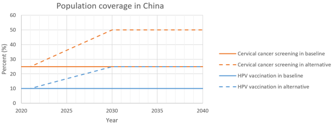
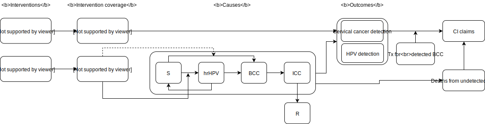
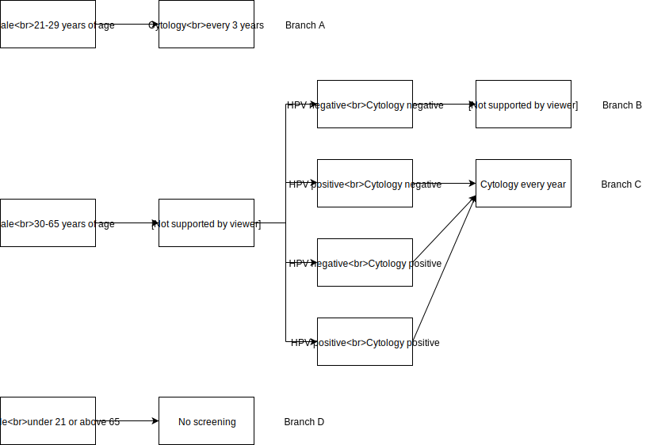
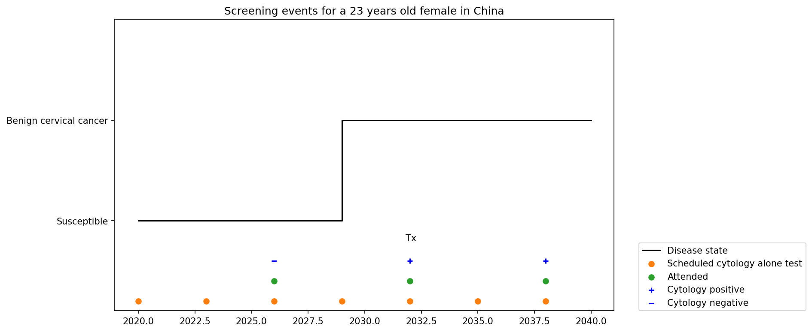
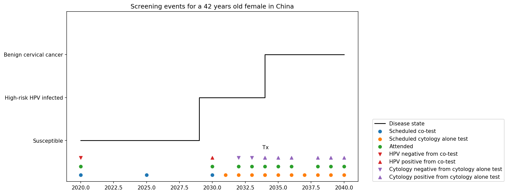

.. role:: underline
    :class: underline

..
  Section title decorators for this document:

  ==============
  Document Title
  ==============

  Section Level 1 (#.0)
  +++++++++++++++++++++
  
  Section Level 2 (#.#)
  ---------------------

  Section Level 3 (#.#.#)
  ~~~~~~~~~~~~~~~~~~~~~~~

  Section Level 4
  ^^^^^^^^^^^^^^^

  Section Level 5
  '''''''''''''''

  The depth of each section level is determined by the order in which each
  decorator is encountered below. If you need an even deeper section level, just
  choose a new decorator symbol from the list here:
  https://docutils.sourceforge.io/docs/ref/rst/restructuredtext.html#sections
  And then add it to the list of decorators above.

.. _cervical_cancer_concept_model:

=======================================
Vivarium CSU Cervical Cancer Simulation
=======================================

.. contents::
  :local:

.. list-table:: List of abbreviations
   :header-rows: 1

   * - Label
     - Definition
   * - S
     - susceptible
   * - hrHPV
     - high-risk HPV
   * - S_hrHPV
     - without high-risk HPV infection
   * - C_hrHPV
     - with high-risk HPV infection
   * - BCC
     - benign cervical cancer
   * - ICC
     - invasive cervical cancer
   * - R
     - recovered
   * - Tx
     - treatment
   * - CI claim
     - critical illness claim
   * - ACMR
     - all-cause mortality rate
   * - prev_c432
     - prevalence of cervical cancer
   * - incidence_c432
     - incidence of cervical cancer
   * - csmr_c432
     - cause-specific mortality rate of cervical cancer

see :ref:`full disease state definition<2017_cancer_model_cervical_cancer>`

.. _swcc1.0:

1.0 Background
++++++++++++++

.. _swcc1.1:

1.1 Project overview
--------------------
This project will generate forecasts of cervical cancer mortality and morbidity 
to allow Swiss Re to identify trends that are important to its business 
decision-making. IHME will produce both a baseline (business as usual) forecast, 
and an alternative scenario forecast in which key cervical cancer screening 
practice and HPV vaccination are implemented in a simulation framework. Baseline 
forecasts will incorporate expected trends in relevant risk factors. Alternative 
scenario forecasts will incorporate baseline forecasts and the expected impact of 
new screening technologies and vaccination. All forecasts will represent the Swiss 
Re’s insured population from the weighted blend of Chinese provinces. Forecasts 
run from year 2020 to 2040.

.. _swcc1.2:

1.2 Literature review
---------------------

.. todo::

 add more literature background

.. _swcc2.0:

2.0 Modeling aims and objectives
++++++++++++++++++++++++++++++++
IHME will estimate the yearly number of cases of benign and invasive cervical 
cancer detected under specific cervical cancer screening practices and the yearly 
number of deaths from undetected cervical cancer (both in unit of per 100,000 
insured person-years) in order to identify pay-out trends for cervical cancer 
claims.

.. _swcc3.0:

3.0 Causal framework
++++++++++++++++++++

.. _swcc3.1:

3.1 Causal variables
--------------------
 
Outcome
 - Cervical cancer detection (benign and invasive)
 - Mortality and morbidity of cervical cancer
Most proximal determinant/exposure
 - Cervical cancer status
 - Cervical cancer screening
 - HPV infection
 - HPV vaccination status
Confounders
 - age
 - sex
Effect modifiers
 - N/A
Mediators
 - N/A

.. _swcc4.0:

4.0 Intervention
++++++++++++++++
There is an urgent need to implement the evidenced-based interventions (e.g. HPV 
vaccination, cervical cancer screening, management of detected disease) for eliminating cervical cancer as a public health problem, such action must be 
strategic in nature. [WHO cervical cancer elimination strategy]_

Based on SwissRe's interest, our simulation intervention combined the cervical 
cancer screening and HPV vaccination to evaluate the cervical cancer detection 
in following scenarios:

 - Baseline (status quo scenario): keep HPV vaccination and cervical cancer
   screening coverage constant over time among insured female.
 - Alternative (expected future scenario): scale-up of both cervical cancer 
   screening and HPV vaccination over time among insured female.

.. _swcc4.1:

4.1 Simulation scenarios
------------------------
**Baseline:** by 2040, project existing level of cervical cancer screening for 
insured female aged 21 to 65 years and HPV vaccination for insured female aged 
15 to 45 years.

**Alternative scenario:** by 2030, linear ramp up cervical cancer screening to 
cover 50% of the insured female aged 21 to 65 years and HPV vaccination to cover 
25% of the insured female aged 15 to 45 years. Both of the HPV vaccination and 
cervical cancer screening coverage remain constant in 2030 to 2040.

.. list-table:: Intervention scale-up
   :header-rows: 1

   * - Scenario
     - Intervention
     - Year
     - Coverage
   * - Baseline
     - Cervical cancer screening
     - 2020-2040
     - 25%
   * - Baseline
     - HPV vaccination
     - 2020-2040
     - 10%
   * - Alternative
     - Cervical cancer screening
     - 2020-2030
     - Stay 25% in 2020-2021, then linearly ramp up from 25% to 50% in 2021-2030.
   * - Alternative
     - Cervical cancer screening
     - 2030-2040
     - 50%
   * - Alternative
     - HPV vaccination
     - 2020-2030
     - Stay 10% in 2020-2021, then linearly ramp up from 10% to 25% in 2021-2030.
   * - Alternative
     - HPV vaccination
     - 2030-2040
     - 25%

.. note::

 - Wang et al. reported a current cervical cancer screening coverage of 20.7% 
   with 95%CI 18.6-22.8 in China. We set it as 25% as we believe insured population has higher screening coverage than general population. 
 - No data has identified for current HPV vaccination rates in China. Temporarily 
   we will use 10%.
 - The target HPV vaccination and cervical cancer screening coverage in 2030 are 
   guided by IHME and SwissRe's assumption for Chinese insured female.

.. _swcc5.0:

5.0 Vivarium modelling components
+++++++++++++++++++++++++++++++++

.. _swcc5.1:

5.1 Vivarium concept model 
--------------------------

.. _swcc5.2:

5.2 Demographics
----------------

.. _swcc5.2.1:

5.2.1 Population description
~~~~~~~~~~~~~~~~~~~~~~~~~~~~
 - Cohort type: Closed cohort of 200,000 insured female (100%) simulants.
 - Age and sex: Age 15 to 95+, 5 year-age bands, uniformly distributed age and 
   sex structure.
 - Time span: Jan 1, 2020 to Dec 31, 2040 with 36.5-day time-steps.
 - Location: blended with province-specific weight in China.

.. _swcc5.2.2:

5.2.2 Location description
~~~~~~~~~~~~~~~~~~~~~~~~~~
Provinces to model include Tianjin, Jiangsu, Guangdong, Henan, and Heilongjiang. 
The uniform distribution of age and sex structure will be used among the different 
provinces.

.. list-table:: location weight table
   :header-rows: 1

   * - Province
     - location id
     - Weight
     - Weighted ACMR (per person-year)
     - Weighted prev_c432 (proportion)
     - Weighted incidence_c432 (cases per person-year)
     - Weighted csmr_c432 (per person-year)
   * - Tianjin
     - 517
     - 18%
     - ACMR * 18%
     - prev_c432 * 18%
     - incidence_c432 * 18%
     - csmr_c432 * 18%
   * - Jiangsu
     - 506
     - 28%
     - ACMR * 28%
     - prev_c432 * 28%
     - incidence_c432 * 28%
     - csmr_c432 * 28%
   * - Guangdong
     - 496
     - 22%
     - ACMR * 22%
     - prev_c432 * 22%
     - incidence_c432 * 22%
     - csmr_c432 * 22%
   * - Henan
     - 502
     - 16%
     - ACMR * 16%
     - prev_c432 * 16%
     - incidence_c432 * 16%
     - csmr_c432 * 16%
   * - Heilongjiang
     - 501
     - 16%
     - ACMR * 16%
     - prev_c432 * 16%
     - incidence_c432 * 16%
     - csmr_c432 * 16%

.. note::

 GBD (2019 round) cervical cancer forecast data can be found at `/ihme/csu/swiss_re/forecast` 

 - ACMR: 294_deaths_12_29_ng_smooth_13.csv
 - prev_c432: 432_prevalence_12_29_ng_smooth_13.csv
 - incidence_c432: 432_incidence_12_29_ng_smooth_13.csv
 - csmr_c432: 432_deaths_12_29_ng_smooth_13.csv

See column **noised_forecast** for output value.

.. _swcc5.3:

5.3 Models
----------

.. _swcc5.3.1:

5.3.1 Core cervical cancer model
~~~~~~~~~~~~~~~~~~~~~~~~~~~~~~~~

see :ref:`cervical cancer cause model<2017_cancer_model_cervical_cancer>`

.. _swcc5.3.2:

5.3.2 Screening and detection model
~~~~~~~~~~~~~~~~~~~~~~~~~~~~~~~~~~~

:underline:`I. Screening algorithm`

Cervical cancer screening algorithm was determined by three variables 
 1) Sex
 2) Age 
 3) Diagnosis of HPV infection

.. list-table:: Screening branches
   :header-rows: 1

   * - Branch
     - Sex
     - Age
     - Screening technology
     - Screening frequency
     - Screening result
     - Follow-up test
     - Follow-up frequency
   * - A
     - Female
     - 21-29
     - Cytology
     - in 3 years
     - Cytology positive
     - Cytology
     - in 1 year
   * - A
     - Female
     - 21-29
     - Cytology
     - in 3 years
     - Cytology negative
     - Cytology
     - in 3 years
   * - B
     - Female
     - 30-65
     - Cytology plus HPV test
     - in 5 years
     - HPV negative, Cytology negative
     - Cytology plus HPV test
     - in 5 years
   * - B
     - Female
     - 30-65
     - Cytology plus HPV test
     - in 5 years
     - HPV positive, Cytology negative
     - Cytology plus HPV test
     - in 1 year
   * - B
     - Female
     - 30-65
     - Cytology plus HPV test
     - in 5 years
     - HPV negative, Cytology positive
     - Cytology
     - in 1 year
   * - B
     - Female
     - 30-65
     - Cytology plus HPV test
     - in 5 years
     - HPV positive, Cytology positive
     - Cytology
     - in 1 year
   * - C
     - Female
     - <21 or >65
     - No screening
     - 
     - 
     - 
     - 

.. list-table:: Screening sensitivity and specificity
   :header-rows: 1

   * - Screening technology
     - Sensitivity
     - Specificity
   * - Cytology plus HPV test
     - HPV+: 76.7%
     - HPV-: 94.1% 
   * - Cytology plus HPV test
     - Cytology+: 59.1%
     - Cytology-: 100%
   * - Cytology
     - 65.9% (95% CI 54.9 to 75.3)
     - 100%

.. note::
 
 - Co-test (cytology plus HPV test) is not recommended for women under 30 
   according to guidelines from American Cancer Society and U.S. Preventive Services Task Force.
 - We are not testing HPV for women under 30 and those follow-up with
   cytology alone in one year at Branch B.
 - Women who have been vaccinated or detected BCC and treated should continue 
   to be screened.
 - HPV- specificity value 94.1% is HPV test alone as a proxy for co-test HPV test 
   specificity ( `Reference paper <https://search.proquest.com/openview/73be186c328532400a3e69524aed0bf9/1?pq-origsite=gscholar&cbl=35707>`_ )

In initialization, We assume that

 - No one has prior knowledge of their disease status (and HPV status) on day one
   of the simulation.
 - All simulants are buying insurance on day one of the simulation.
 - For simulants in cervical cancer (CC) state regardless of detection, they have 
   a transition rate of 0.1 (per person-year) of moving into a recovered (R) state; this results in an average duration in state CC of 10 years. People in state CC and R follow exactly the same screening algorithm, namely branch A, B, or C depending on their age. Simulants do not ever make a second cervical cancer claim, therefore the negative screening results were expected for those in R state in order to avoid double counting the CI claim from detected cervical cancer.

:underline:`II. Screening schedule and attendance`

Probability of attending screening
 - Generate 1000 draws from normal distribution with mean=0.25, SD=0.0025 for
   calculating the probability of simulants attending their first due screening.
 - If simulant attended their last screening, they have a truncated normal 
   distirbution with mean=1.89, SD=0.36, lower=1.0 (Yan et al. 2017) more odds 
   of attending the next screening than those who did not attend their last screening. 

Time to next scheduled screening

.. list-table:: Screening waiting time distribution (days)
   :header-rows: 1

   * - Screening method
     - Distribution
     - Mean
     - Standard deviation
     - Lower limit
     - Upper limit
   * - Cytology in 3 years
     - Normal distribution
     - 1185
     - 72
     - 
     - 
   * - Cytology plus HPV test in 5 years
     - Normal distribution
     - 1975
     - 72
     - 
     - 
   * - Annual cytology
     - Truncated normal distribution
     - 395
     - 72
     - 180
     - 1800

:underline:`III. Screening initialization`

The date of the first screening appointment (T_appt) for females at age between 
21 and 65 is determined as follows. We assume that each simulant had a previous 
appointment scheduled at some point before the simulation begins. We calculate 
the time between that past appointment and their next appointment (delta_T) using 
the methodology outlined in Section 5.3.2.II (Time to next scheduled screening). 
With a uniform distribution we randomly determine how far along that time interval 
between appointments each individual is (X) at the beginning of the simulation (
T_0). For females under 21 when the simulation begins the methodology is identical, 
except T_0 is the simulant's 21th birthday rather than the beginning of the 
simulation. No screening appointment will be initialized for females above 65.

:underline:`IV. Simulant screening trajectory`

Screening events for women aged 21-29 years

Screening events for women aged 30-65 years

:underline:`V. Symptomatic presentation`

In our model, cancer cases are detected through two pathways. (1) individuals 
who get diagnosed from routine screening with a positive test result. (2) 
individuals who didn't go for routine screening but found symptoms then get 
diagnosed. After we add symptomatic presentation module, we will see detected 
cancer cases in cohorts not eligible for routine screening and a smaller 
difference of detection rate between baseline and alternative scenario. We 
assume symptoms will not occur in pre-invasive cervical cancer state, the 
transition rate (lambda) from pre-clinical screening detectable asymptomatic 
invasive cervical cancer (PC) to clinical symptomactic invasive cervical cancer 
is equal to 1 divided by average time spent in PC state (mean sojourn time). In 
cervical cancer development, the mean sojourn time is around **4** years.

.. image:: symptomatic_presentation.svg

.. _swcc5.3.3:

5.3.3 HPV model
~~~~~~~~~~~~~~~

:underline:`I. Disease model inputs`

 - prevalence: /ihme/costeffectiveness/vivarium_csu_cancer/hpv_prevalence_dismod.csv
 - Incidence: /ihme/costeffectiveness/vivarium_csu_cancer/hpv_incidence_dismod.csv
 - remission: /ihme/costeffectiveness/vivarium_csu_cancer/hpv_clearance_dismod.csv
 - relative risk of HPV 16 and/or 18 causing CIN2+ (RR_hrHPV): use log-normal 
   distribution **exp(normal(mean=log(27.4), SD=0.17))**

relevant formulas 
 (1) PAF = :math:`\frac{\text{prev_hrHPV}\times(\text{RR_hrHPV}-1)}{\text{prev_hrHPV}\times(\text{RR_hrHPV}-1)+1}`
 (2) :math:`\text{incidence_BCC_HPV+} =  \text{incidence_BCC}\times(1-PAF)\times\text{RR_hrHPV}`
 (3) :math:`\text{incidence_BCC_HPV-} =  \text{incidence_BCC}\times(1-PAF)`
  
:underline:`II. HPV vaccination`

Vaccine coverage
 - Create 1000 draws of HPV vaccination propensity from an uniform distributon 
   U[0, 1] and use constant propensity for every simulation timestep. We assume 
   no one has been vaccinated on day one of the simulation. At each simulation 
   timestep, give the vaccination to unvaccinated women who at 15 to 45 years 
   of age and has a `HPV_vacciation_propensity` value less than the current HPV 
   vaccine coverage level. Use the vaccine coverage specified in section 4.1 
   Simulation scenarios to differentiate coverage threshold between baseline 
   and alternative scenarios.

Vaccine efficacy
 - Zhu et al. reported a relative risk of getting HPV 16/18 infection for those 
   unvaccinated versus vaccinated (RR_no_vaccine_hrHPV): use normal distribution 
   **normal(mean=4.71, SD=0.94)**
 - Lu et al. reported a relative risk of getting BCC without hrHPV infection for 
   those unvaccinated versus vaccinated (RR_no_vaccine_CIN2+): use normal 
   distribution **normal(mean=1.77, SD=0.26)**
 - Use same relative risk (RR_no_vaccine_hrHPV) distribution for people moving
   from `BCC_S_hrHPV to BCC_C_hrHPV` and `ICC_S_hrHPV to ICC_C_hrHPV` among those
   unvaccinated versus vaccinated.

relevant formulas 
 (1) PAF = :math:`\frac{\text{prev_vaccine}\times(\text{RR_vaccine}-1)}{\text{prev_vaccine}\times(\text{RR_vaccine}-1)+1}`
 (2) :math:`\text{incidence_hrHPV_with_vaccine} =  \text{incidence_hrHPV}\times(1-PAF)`
 (3) :math:`\text{incidence_hrHPV_without_vaccine} =  \text{incidence_hrHPV}\times(1-PAF)\times\text{RR_no_vaccine_hrHPV}`
 (4) :math:`\text{incidence_BCC_S_hrHPV_with_vaccine} =  \text{incidence_BCC}\times(1-PAF)`
 (5) :math:`\text{incidence_BCC_S_hrHPV_without_vaccine} =  \text{incidence_BCC}\times(1-PAF)\times\text{RR_no_vaccine_CIN2+}`
 (6) :math:`\text{incidence_hrHPV_for_BCC_S_hrHPV_to_BCC_C_hrHPV_with_vaccine} =  \text{incidence_hrHPV}\times(1-PAF)`
 (7) :math:`\text{incidence_hrHPV_for_BCC_S_hrHPV_to_BCC_C_hrHPV_without_vaccine} =  \text{incidence_hrHPV}\times(1-PAF)\times\text{RR_no_vaccine_hrHPV}`
 (8) :math:`\text{incidence_hrHPV_for_ICC_S_hrHPV_to_ICC_C_hrHPV_with_vaccine} =  \text{incidence_hrHPV}\times(1-PAF)`
 (9) :math:`\text{incidence_hrHPV_for_ICC_S_hrHPV_to_ICC_C_hrHPV_without_vaccine} =  \text{incidence_hrHPV}\times(1-PAF)\times\text{RR_no_vaccine_hrHPV}`
 
.. _swcc5.3.4:

5.3.4 Treatment model
~~~~~~~~~~~~~~~~~~~~~

 - PAF = :math:`\frac{\text{prev_tx}\times(\text{RR_tx}-1)}{\text{prev_tx}\times(\text{RR_tx}-1)+1}`
 - :math:`\text{incidence_ICC_with_tx} =  \text{incidence_ICC}\times(1-PAF)`
 - :math:`\text{incidence_ICC_without_tx} =  \text{incidence_ICC}\times(1-PAF)\times\text{RR_no_tx}`

1. prev_tx = baseline screening coverage * treatment coverage among those who 
   attended cervical cancer screening = 25% * 9% = **2.25%** (Tai et al. 2018)
2. RR_no_tx = relative risk of developing CIN3+ for ASCUS women without treatment 
   versus with treatment: use log-normal distribution **exp(normal(mean=log(4.86), SD=0.51))** 
   (Tai et al. 2018)

.. _swcc5.4:

5.4 Input data sources
----------------------

.. list-table:: Model inputs
   :header-rows: 1

   * - Input parameter
     - Value
     - Source
     - Note
   * - Duration of BCC
     - 10 years
     - [Burger-et-al-2020]_
     - 
   * - Mean sojourn time
     - 4 years
     - [Burger-et-al-2020]_
     - 
   * - Initial cervical cancer screening coverage
     - 25%
     - [Wang-et-al-2015]_
     - It's an arbitrary number greater than 20.7%.
   * - Target cervical cancer screening coverage in 2030
     - 50%
     - 
     - by assumption
   * - Initial HPV vaccination coverage
     - 10%
     - 
     - The current HPV vaccination rates remain low in China, no data has
       identified.
   * - Target HPV vaccination coverage in 2030
     - 25%
     - 
     - by assumption
   * - Screening sensitivity of co-test
     - HPV+: 76.7%; Cytology+: 59.1%
     - [Schiffman-et-al-2018]_
     - 
   * - Screening specificity of co-test
     - HPV-: 94.1%; Cytology-: 100%
     - [Kripke-et-al-2008]_
     - 
   * - Screening sensitivity of cytology alone test
     - 65.9% (95% CI 54.9 to 75.3)
     - [Koliopoulos-et-al-2017]_
     - 
   * - Screening specificity of cytology alone test
     - 100%
     - 
     - by client’s assumption
   * - Prevalence of HPV
     - /ihme/costeffectiveness/vivarium_csu_cancer/hpv_prevalence_dismod.csv
     - [Zhao-et-al-2012]_
     - We used Abie's dismod 1.1.1 to generate draw-/age- specific prevalence data
   * - Incidence of HPV
     - /ihme/costeffectiveness/vivarium_csu_cancer/hpv_incidence_dismod.csv
     - 
     - We used Abie's dismod 1.1.1 to generate draw-/age- specific incidence data
   * - remission of HPV
     - /ihme/costeffectiveness/vivarium_csu_cancer/hpv_clearance_dismod.csv
     - [Kang-et-al-2014]_
     - We used Abie's dismod 1.1.1 to generate draw-/age- specific remission data
   * - Relative risk of HPV
     - 27.4 (95%CI 19.7 to 38.0); use log-normal distribution **exp(normal( 
       mean=log(27.4), SD=0.17))**
     - [Naucler-et-al-2007]_
     - 
   * - HPV vaccine according to protocol efficacy against incident HPV 16/18 
       infection
     - use normal distribution **normal(mean=4.71, SD=0.94)**
     - [Zhu-et-al-2019]_
     - We convert the efficacy to a relatiev risk of HPV 16/18 infection for 
       those unvaccinated versus vaccinated
   * - HPV vaccine according to protocol efficacy against CIN2+
     - use normal distribution **normal(mean=1.77, SD=0.26)**
     - [Lu-et-al-2011]_
     - In this study, CIN2+ was associated with non-16/18 HPV infection (other 
       oncogenic types including 31/33/45/52/58)
   * - BCC treatment coverage
     - 9%
     - [Tai-et-al-2018]_
     - proportion of people treated among those who attended cervical cancer 
       screening
   * - BCC treatment efficacy
     - 0.22 (95%CI 0.07 to 0.68); relative risk of developing CIN3+ for ASCUS 
       women with treatment versus no treatment
     - [Tai-et-al-2018]_
     - use log-normal distribution **exp(normal(mean=log(4.86), SD=0.51))** 
       for inverse distribution

.. _swcc5.5:

5.5 Output meta-table shell
---------------------------

.. list-table:: Output shell table
   :header-rows: 1

   * - Location
     - Year
     - Birth cohort
     - Sex
     - Risk group
     - Scenario
     - Outcome
   * - Blended provinces in China
     - 2020
     - 2000-2005
     - Female
     - Average risk without HPV infection
     - Baseline
     - Number of benign cervical cancer cases detected among policyholders
   * - 
     - ...
     - ...
     - 
     - High risk with HPV infection
     - Alternative
     - Number of invasive cervical cancer cases detected among policyholders
   * - 
     - 2040
     - 1925-1930
     - 
     - 
     - 
     - Number of deaths from undetected invasive cervical cancer among policyholders
   * - 
     - 
     - 
     - 
     - 
     - 
     - Change of detected benign cervical cancer cases as compared with baseline
   * - 
     - 
     - 
     - 
     - 
     - 
     - Change of detected invasive cervical cancer cases as compared with baseline
   * - 
     - 
     - 
     - 
     - 
     - 
     - Change of deaths from undetected invasive cervical cancer as compared with
       baseline

.. _swcc6.0:

6.0 Validation and verification
+++++++++++++++++++++++++++++++
TBD

.. _swcc7.0:

7.0 Limitations
+++++++++++++++
TBD

.. _swcc8.0:

8.0 References
++++++++++++++

.. [Burger-et-al-2020]
   Burger EA, de Kok IMCM, Groene E, et al. Estimating the Natural History of 
   Cervical Carcinogenesis Using Simulation Models: A CISNET Comparative Analysis. 
   J Natl Cancer Inst 2020; 112: 955–63.
.. [Wang-et-al-2015]
   Wang B, He M, Chao A, et al. Cervical Cancer Screening Among Adult Women in 
   China, 2010. Oncologist 2015; 20: 627–34.
.. [Schiffman-et-al-2018]
   Schiffman M, Kinney WK, Cheung LC, et al. Relative Performance of HPV and 
   Cytology Components of Cotesting in Cervical Screening. J Natl Cancer Inst 
   2018; 110: 501–8.
.. [Kripke-et-al-2008]
   Kripke, C. (2008). Pap smear vs. HPV screening tests for cervical cancer. 
   American Family Physician, 77(12), 1740.
.. [Koliopoulos-et-al-2017]
   Koliopoulos G, Nyaga VN, Santesso N, et al. Cytology versus HPV testing for 
   cervical cancer screening in the general population. Cochrane Database Syst 
   Rev 2017; 8: CD008587.
.. [Zhao-et-al-2012]
   Zhao F-H, Lewkowitz AK, Hu S-Y, et al. Prevalence of human papillomavirus 
   and cervical intraepithelial neoplasia in China: a pooled analysis of 17 
   population-based studies. Int J Cancer 2012; 131: 2929–38.
.. [Kang-et-al-2014]
   Kang L-N, Castle PE, Zhao F-H, et al. A prospective study of age trends of 
   high-risk human papillomavirus infection in rural China. BMC Infect Dis 2014; 
   14: 96.
.. [Naucler-et-al-2007]
   Naucler P, Ryd W, Törnberg S, et al. HPV type-specific risks of high-grade 
   CIN during 4 years of follow-up: a population-based prospective study. Br J 
   Cancer 2007; 97: 129–32.
.. [Zhu-et-al-2019]
   Zhu F-C, Hu S-Y, Hong Y, et al. Efficacy, immunogenicity and safety of the 
   AS04-HPV-16/18 vaccine in Chinese women aged 18-25 years: End-of-study 
   results from a phase II/III, randomised, controlled trial. Cancer Med 2019; 
   8: 6195–211.
.. [Lu-et-al-2011]
   Lu B, Kumar A, Castellsagué X, Giuliano AR. Efficacy and safety of prophylactic 
   vaccines against cervical HPV infection and diseases among women: a systematic 
   review & meta-analysis. BMC Infect Dis 2011; 11: 13.
.. [Tai-et-al-2018]
   Tai YJ, Chen YY, Hsu HC, et al. Risks of cervical intraepithelial neoplasia 
   grade 3 or invasive cancers in ASCUS women with different management: a 
   population-based cohort study. J Gynecol Oncol 2018; 29: e55.
