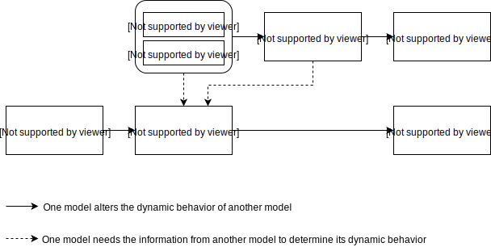

.. role:: underline
    :class: underline

..
  Section title decorators for this document:

  ==============
  Document Title
  ==============

  Section Level 1 (#.0)
  +++++++++++++++++++++
  
  Section Level 2 (#.#)
  ---------------------

  Section Level 3 (#.#.#)
  ~~~~~~~~~~~~~~~~~~~~~~~

  Section Level 4
  ^^^^^^^^^^^^^^^

  Section Level 5
  '''''''''''''''

  The depth of each section level is determined by the order in which each
  decorator is encountered below. If you need an even deeper section level, just
  choose a new decorator symbol from the list here:
  https://docutils.sourceforge.io/docs/ref/rst/restructuredtext.html#sections
  And then add it to the list of decorators above.

.. _colon_and_rectum_cancer_concept_model:

===============================================
Vivarium CSU Colon and Rectum Cancer Simulation
===============================================

.. contents::
  :local:

.. list-table:: List of abbreviations
   :header-rows: 1

   * - Label
     - Definition
   * - PC
     - Pre-clinical and screen-detectable state, with asymptomatic condition
   * - C
     - Clinical state, with symptomatic condition
   * - MST
     - Mean sojourn time, average time spent in PC state
   * - CRC
     - Colon and rectum cancer
   * - FOBT
     - Fecal occult blood test
   * - ACMR
     - All-cause mortality rate
   * - prev_c441
     - Prevalence of colon and rectum cancer
   * - incidence_c441
     - Incidence of colon and rectum cancer
   * - csmr_c441
     - Cause-specific mortality rate of colon and rectum cancer

.. _1.0:

1.0 Background
++++++++++++++

.. _1.1:

1.1 Project overview
--------------------
This project will generate forecasts of colon and rectum cancer prevalence, 
incidence, and cause-specific mortality to allow Swiss Re to identify trends 
that are important to its business decision-making. IHME will produce both a 
baseline (business as usual) forecast, and an alternative scenario forecast 
in which key colon and rectum cancer screening practice is implemented in a 
simulation framework. Baseline forecasts will incorporate expected trends in 
relevant risk factors. Alternative scenario forecasts will incorporate baseline 
forecasts and the expected impact of screening technologies. All forecasts will 
represent the Swiss Re’s insured population from the weighted blend of Chinese 
provinces. Forecasts will be from year 2020 to 2040.

.. _1.2:

1.2 Literature review
---------------------

.. todo::

 add more literature background

.. _2.0:

2.0 Modeling aims and objectives
++++++++++++++++++++++++++++++++
To help SwissRe identify pay-out trends for colon and rectum cancer claims, 
IHME will estimate the yearly number of cases of colon and rectum cancer 
detected (per 100,000 insured person-years) via colon and rectum cancer 
screening and symptomatic presentation in a baseline with no screening scale-up 
and an alternativein in which screening scaled-up.

.. _3.0:

3.0 Causal framework
++++++++++++++++++++

.. _3.1:

3.1 Causal variables
--------------------
 
Outcome
 - Colon and rectum cancer detection
 - Mortality and morbidity of colon and rectum cancer
Most proximal determinant/exposure
 - Family history of colon and rectum cancer
 - Personal history of adenoma
 - Colon and rectum cancer screening
Confounders
 - age
Effect modifiers
 - N/A
Mediators
 - N/A

.. _4.0:

4.0 Intervention
++++++++++++++++
Scale-up of colon and rectum cancer screening coverage among insured population.

.. _4.1:

4.1 Simulation scenarios
------------------------
Baseline: project existing level of colon and rectum cancer screening for 
simulants aged 50 to 74 years, where:
 - Medium-risk group are provided with FOBT (fecal occult blood test) 
   every year
 - High-risk group (with family history of colon and rectum cancer or 
   personal history of adenoma) are provided colonoscopy every 5 years

Alternative scenario: by 2040, linear ramp up colon and rectum cancer screening 
to cover 60% of women aged 50 to 74 years in 2030, then keep 60% coverage till 
2040, where:
 - Medium-risk group are provided with FOBT (fecal occult blood test) 
   every year
 - High-risk group (with family history of colon and rectum cancer or 
   personal history of adenoma) are provided colonoscopy every 5 years

.. list-table:: Intervention scale-up
   :header-rows: 1

   * - Scenario
     - Intervention
     - Year
     - Coverage
   * - Baseline
     - Colon and rectum cancer screening
     - 2020-2040
     - 20%
   * - Alternative
     - Colon and rectum cancer screening
     - 2020-2035
     - Stay 20% in 2020-2021 then linearly scale up to 60% from 2021 to 
       2030
   * - Alternative
     - Colon and rectum cancer screening
     - 2030-2040
     - 60%

.. note::

 - Lin et al. reported an uptake rate of 15.4% for colorectal cancer screening 
   among Chinese adults in Guangzhou. In this study, the screening update rate 
   varies by age and sex, but less likely associated with residence of urban and 
   rual. Temporarily, let's use 20% as baseline screening coverage across all 
   ages and sexes for SwissRe's insured population.
 - We assume that the screenig uptake rate in China is 20 years behind the US; 
   therefore, we will use the documented number in 2015 among US general 
   population to determine the target screening coverage in China.

.. _5.0:

5.0 Vivarium modelling components
+++++++++++++++++++++++++++++++++

.. _5.1:

5.1 Vivarium concept model 
--------------------------

.. _5.2:

5.2 Demographics
----------------

.. _5.2.1:

5.2.1 Population description
~~~~~~~~~~~~~~~~~~~~~~~~~~~~
 - Cohort type: Closed cohort of 200,000 insured male (50%) and female (50%) 
   simulants.
 - Age and sex: Age 15 to 95+, 5 year-age bands, uniformly distributed age and 
   sex structure.
 - Time span: Jan 1, 2020 to Dec 31, 2040 with 36.5-day time-steps.
 - Location: blended with province-specific weight in China.

.. _5.2.2:

5.2.2 Location description
~~~~~~~~~~~~~~~~~~~~~~~~~~
Provinces to model include Tianjin, Jiangsu, Guangdong, Henan, and Heilongjiang. 
The uniform distribution of age and sex structure will be used among the different 
provinces.

.. list-table:: location weight table
   :header-rows: 1

   * - Province
     - location id
     - Weight
     - Weighted ACMR
     - Weighted prev_c441
     - Weighted incidence_c441
     - Weighted csmr_c441
   * - Tianjin
     - 517
     - 18%
     - e^(ACMR) * 18% (per person-year)
     - prev_c441 * 18% (proportion)
     - incidence_c441 * 18% (cases per person-year)
     - csmr_c441 * 18% (per person-year)
   * - Jiangsu
     - 506
     - 28%
     - e^(ACMR) * 28% (per person-year)
     - prev_c441 * 28% (proportion)
     - incidence_c441 * 28% (cases per person-year)
     - csmr_c441 * 28% (per person-year)
   * - Guangdong
     - 496
     - 22%
     - e^(ACMR) * 22% (per person-year)
     - prev_c441 * 22% (proportion)
     - incidence_c441 * 22% (cases per person-year)
     - csmr_c441 * 22% (per person-year)
   * - Henan
     - 502
     - 16%
     - e^(ACMR) * 16% (per person-year)
     - prev_c441 * 16% (proportion)
     - incidence_c441 * 16% (cases per person-year)
     - csmr_c441 * 16% (per person-year)
   * - Heilongjiang
     - 501
     - 16%
     - e^(ACMR) * 16% (per person-year)
     - prev_c441 * 16% (proportion)
     - incidence_c441 * 16% (cases per person-year)
     - csmr_c441 * 16% (per person-year)

.. note::

 GBD 2019 Forecast data can be found at `/ihme/costeffectiveness/vivarium_csu_cancer/` 

 - ACMR: Using transformed data from breast cancer model
 - prev_c441: 441_ets_prevalence.nc
 - incidence_c441: 441_ets_incidence.nc
 - csmr_c441: 441_ets_deaths.nc

.. _5.3:

5.3 Models
----------

.. _5.3.1:

5.3.1 Core colon and rectum cancer model
~~~~~~~~~~~~~~~~~~~~~~~~~~~~~~~~

see :ref:`colon and rectum cancer cause model<2017_cancer_model_colon_and_rectum_cancer>`

.. _5.3.2:

5.3.2 Screening and detection model
~~~~~~~~~~~~~~~~~~~~~~~~~~~~~~~~~~~

:underline:`I. Screening algorithm`

Colon and rectum cancer screening algorithm was determined by three variables:
 1) Age
 2) Family history of colon and rectum cancer
 3) Personal history of adenoma

People met any of following criteria are considered high-risk for colon and 
rectum cancer screening:
 - With family history of colon and rectum cancer
 - With personal history of adenoma

Positive for FOBT does not necessarily mean you have colorectal cancer

.. list-table:: Screening branches
   :header-rows: 1

   * - Branch
     - Age
     - Sex
     - Risk group
     - Screening technology
     - Screening frequency
     - Sensitivity
     - Specificity
   * - A
     - 50-75
     - Both
     - Medium-risk
     - Fecal occult blood test (FOBT)
     - every year
     - 33%-75%
     - 100%
   * - B
     - 50-75
     - Both
     - High-risk
     - Colonoscopy
     - every 5 years
     - >95%
     - 100%
   * - C
     - Under 50 or above 75
     - Both
     - Any risk level
     - No screening
     - N/A
     - N/A
     - N/A

.. note::
 
  - There are studies suggest an earlier colon and rectum cancer screeening 
    starts from age of 40 years for high-risk population.
  - One or two negative examinations of colonoscopy may signal lifetime protection 
    against CRC. We should confirm with cancer experts whether we want to 
    discontinue screening for those who had negative results of prior colonoscopy.

In initialization, We assume that
 - No one has prior knowledge of their disease status on day 1 of the simulation.
 - All simulants are buying insurance on day 1 of the simulation.
 - For simulants in clinical (C) state regardless of detection, they have a 
   transition rate of 0.1 (per person-year) of moving into a recovered (R) state; 
   People in state C and R follow exactly the same screening algorithm, namely 
   branch A, B, and C depending on their age and risk level. Negative screening 
   results are expected for those in R state in order to avoid double counting 
   the CI claim from detected colon and rectum cancer.

:underline:`II. Screening schedule and attendance`

Probability of attending screening
 - Generate 1000 draws from normal distribution with mean of `current screening 
   coverage` (e.g., 0.2 for baseline), SD of `1% of current screening coverage` 
   (e.g., 0.002 for baseline) for calculating the probability of simulants 
   attending their first due screening.
 - If a simulant attended their last screening, they have {X} more odds of
   attending the next screening than those who did not attend their last screening.

Time to next scheduled screening

.. list-table:: Screening waiting time distribution (days)
   :header-rows: 1

   * - Screening method
     - Distribution
     - Mean
     - Standard deviation
     - Lower limit
     - Upper limit
   * - Annual FOBT
     - 
     - 
     - 
     - 
     - 
   * - Colonoscopy in 5 years
     - 
     - 
     - 
     - 
     - 

:underline:`III. Screening initialization`

The date of the first screening appointment (T_appt) for simulants at age between 
50 and 75 is determined as follows. We assume that each simulant had a previous 
appointment scheduled at some point before the simulation begins. We calculate 
the time between that past appointment and their next appointment (delta_T) 
using the methodology outlined in Section 5.3.2.II (Time to next scheduled 
screening). With a uniform distribution we randomly determine how far along 
that time interval between appointments each individual is (X) at the beginning 
of the simulation (T_0). For simulants under 50, the methodology is identical 
when the simulation begins, except T_0 is the simulant's 50th birthday rather 
than the beginning of the simulation. No screening appointment will be initialized 
for simulants at any age above 65.

.. _5.3.3:

5.3.3 Risk factor model
~~~~~~~~~~~~~~~~~~~~~~~
GBD risk factors: N/A

Non-GBD risk factor 1: Family history of colon and rectum cancer
 - prevalence:
 - exposure distirbution: dichotomous
 - relative risk:
Non-GBD risk factor 2: Personal history of adenoma 
 - prevalence:
 - exposure distirbution: dichotomous
 - relative risk: 

Relevant formulas 
 1. PAF= :math:`\frac{prev_{rf}(RR-1)}{prev_{rf}(RR-1)+1}`
 2. :math:`i_{PC|exposed} =  i_{PC} \times(1-PAF) \times RR`
 3. :math:`i_{PC|unexposed} =  i_{PC} \times (1-PAF)`

.. _5.4:

5.4 Input data sources
----------------------

.. list-table:: Model inputs
   :header-rows: 1

   * - Input parameter
     - Value
     - Source
     - Note
   * - MST
     - 4.5-5.8 years
     - [Brenner-et-al-2012]_
     - 
   * - Colon and rectum cancer screening coverage in baseline
     - 20%
     - [lin-et-al-2019]_
     - 
   * - Colon and rectum cancer screening covearge in alternative scenario
     - scale up to 60% in 2035
     - [de-Moor-et-al-2018]_
     - We applied 20-year lag based on the US screening coverage in 2015
   * - Screening sensitivity
     - 
     - 
     - 
   * - Screening specificity
     - 100%
     - 
     - by client’s assumption (no false positive results of screening)
   * - Prevalence of family history of colon and rectum cancer
     - 
     - 
     - 
   * - Relative risk of family history of colon and rectum cancer
     - 2.33
     - Tung et al.
     - 
   * - Prevalence of personal history of adenoma
     - 
     - 
     - 
   * - Relative risk of personal history of adenoma
     - 4.5
     - Tung et al.
     - 

.. _5.5:

5.5 Output meta-table shell
---------------------------

.. list-table:: Output shell table
   :header-rows: 1

   * - Location
     - Year
     - Birth cohort
     - Sex
     - Risk group
     - Scenario
     - Outcome
   * - Blended provinces in China
     - 2020
     - 2000-2005
     - Female
     - Medium-risk without family history of colon and rectum cancer or personal 
       history of adenoma
     - Baseline
     - Number of colon and rectum cancer cases detected among policyholders
   * - 
     - ...
     - ...
     - Male
     - High-risk with family history of colon and rectum cancer or personal 
       history of adenoma
     - Alternative
     - Change of detected colon and rectum cancer cases as compared with baseline
   * - 
     - 2040
     - 1935-1940
     - 
     - 
     - 
     - 

.. _6.0:

6.0 Validation and verification
+++++++++++++++++++++++++++++++
TBD

.. _7.0:

7.0 Limitations
+++++++++++++++
 1. Adenoma will be modeled as a risk factor rathern than a disease state because 
    of minimum information on its transition to pre-clinical colorectal cancer. 
    Hence, detection of adenoma is not tracted in our simulation, and we don't 
    need to model treatment for detected adenoma.
 2. The screening waiting time distirbution is built based on Marketscan data 
    (clinical records for US general population).
 3. The external parameters are not stratified by attributes like age, sex or 
    residence (urban vs rural), unless the literature tells us to do so. We will 
    compare the evidence from China to studies conducted in other locations.

.. _8.0:

8.0 References
++++++++++++++

.. todo::

 add cited works
