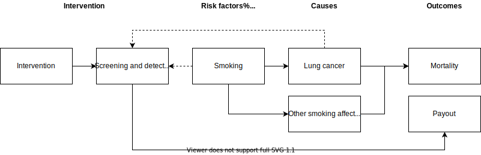

.. _lung_cancer_cancer_concept_model:
..
  Section title decorators for this document:

  ==============
  Document Title
  ==============

  Section Level 1 (#.0)
  +++++++++++++++++++++
  
  Section Level 2 (#.#)
  ---------------------

  Section Level 3 (#.#.#)
  ~~~~~~~~~~~~~~~~~~~~~~~

  Section Level 4
  ^^^^^^^^^^^^^^^

  Section Level 5
  '''''''''''''''

  The depth of each section level is determined by the order in which each
  decorator is encountered below. If you need an even deeper section level, just
  choose a new decorator symbol from the list here:
  https://docutils.sourceforge.io/docs/ref/rst/restructuredtext.html#sections
  And then add it to the list of decorators above.

=======================================
Vivarium CSU Lung Cancer Simulation
=======================================

.. contents::
  :local:

.. list-table:: List of abbreviations
   :header-rows: 1

   * - Label
     - Definition
   * - TBL
     - Tracheal, Bronchus, and Lung cancer
   * - MST
     - Mean sojourn time
   * - AST
     - Average survival time
   * - ODF
     - Overdiagnosis factor
   * - LDCT
     - Low dose computed topography
   * - CXR
     - Chest x-ray

.. _1.0:

1.0 Background
++++++++++++++

.. _1.1:

For this project, we are interested in the expected impact of increases in lung cancer screening coverage on the rates of detected lung cancer over the next 20 years among the insured population in select areas in China. 

1.1 Project overview
--------------------

This project intends to model the impact of increased lung cancer screening coverage on lung cancer detection forecasted from 2020 to 2040 among the insured population in select areas of China. The model will make use of the current lung cancer screening guidelines, which are dependent on age, smoking status, and cumulative smoking history. Screening will affect the timing of dection for some lung cancers (in the preclinical rather than clinical phase) as well as whether indolent cancers are detected or not.

.. _1.2:

1.2 Literature review
---------------------

.. _2.0:

There is a concensus that lung cancer screening programs do not significantly affect smoking behaviors among the screened population, as supported by a systemtatic review [Slatore-et-al-2014]_. However, this conclusion is limited in that it included studies from Europe and the United States only. It is therefore possible that lung cancer screening programs could either *increase* smoking behaviors by providing a sense of safety or *decrease* smoking behaviors by drawing attention to the risks of smoking in our population of interest that was not studied by the systematic review. 

[Li-et-al-2018]_ found that low insurance reimbursement rates negatively affected the diagnosis and treatment of non-small cell lung cancer in China.

There have been several recent studies that have analyzed screening programs implemented in China with respect to screening compliance and performance, including [Qiao-et-al-2020]_ in Sichuan, [Wei-et-al-2020]_ in Gejiu and Yunnan, [Guo-et-al-2020]_ in Henan (article in Chinese), and [Lin-et-al-2019]_ in Kunming, Yunnan (article in Chinese). 

Lung cancer screening coverage by LDCT for the eligible population has been low according to the available data [Jemal-and-Fedewa-2017]_, [Smith-et-al-2019]_ at 3.3% in 2010 and 3.9% in 2015 based on the National Health Interview Survey. Notably, [Blom-et-al-2019]_ conducted a modeling study that suggested "full-scale implementation" of the lung cancer screening guidelines in the United States would cause a major increase in surgical demand and that a "gradual buildup of adherence can spread this peak over time."

  Note: the United States screening adherence data is relevant because it may be used as a proxy for Chinese adherence with a lag period.

.. todo::

  Include overview of LDCT screening trials conducted

2.0 Modeling aims and objectives
++++++++++++++++++++++++++++++++

The main outcome of this model is lung cancer *detections*, diagnosed either via screening or symptomatic presentation. This outcome will be assessed yearly in a baseline scenario with no lung cancer screening scale-up and an alternative scenario in which lung cancer screening coverage is scaled up. 

.. _3.0:

3.0 Causal framework
++++++++++++++++++++

.. _3.1:

3.1 Causal variables
--------------------
 
.. _4.0:

4.0 Intervention
++++++++++++++++

.. _4.1:

4.1 Simulation scenarios
------------------------

**Baseline**: Lung cancer screening coverage from 2020-2040 in the model population is assumed to follow 20 year lag from US coverage rates.

**Alternative**: Lung cancer screening coverage from 2020-2040 in the model population is scaled up to target coverage.

.. todo::

  Refine this... also, see section below

.. _5.0:

5.0 Vivarium modelling components
+++++++++++++++++++++++++++++++++

.. _5.1:

5.1 Vivarium concept model 
--------------------------

Note that we are not modeling an effect of lung cancer screening coverage on lung cancer mortality and morbidity because it is not an explicit outcome of interest in this project, although there is evidence that there is an effect.

.. _5.2:

5.2 Demographics
----------------

The demographic model for this project should follow the same demographic model for the existing SwissRe models, as defined in the 
:ref:`Vivarium CSU Breast Cancer Screening Concept Model Documentation <2017_concept_model_vivarium_swissre_breastcancer>`, both in terms of the population and location descriptions.

.. _5.3:

5.3 Models
----------

.. _5.3.1:

5.3.1 Core lung cancer model
~~~~~~~~~~~~~~~~~~~~~~~~~~~~~~~~

The lung cancer cause model that should be used for this project is documented on the :ref:`2017 Tracheal, Bronchus, and Lung Cancer Page <2017_lung_cancer>`.

.. _5.3.2:

5.3.2 Screening and detection model
~~~~~~~~~~~~~~~~~~~~~~~~~~~~~~~~~~~

5.3.2.1 Screening Model
^^^^^^^^^^^^^^^^^^^^^^^

*Annual* screenings should be scheduled for simulants who meet ALL of the following criteria: 

#. 50-74 years old
#. 20+ pack-year history
#. Current smokers or former smokers with <5 years since quitting
#. Lung cancer not already detected

.. todo::

  Include probability of attending screening data, time to next scheduled screen distribution, screenining initialization information

5.3.2.2 Detection Model
^^^^^^^^^^^^^^^^^^^^^^^

Lung cancers may be detected in one of two ways in this simulation: either via screening or symptomatic presentation.

  Detection via screening occurs when:

    - Simulant is in the PC or I states of the lung cancer cause model
    - Simulant attends a scheduled lung cancer screening
    - Lung cancer is detected according to sensitivity parameters defined below

  Detection via symptomatic presentation occurs when:

    - Simulant has not already had lung cancer detection via screening
    - Simulant transitions from PC to C state in the lung cancer cause model

.. note::

  We may want to eventually incorporate some lag period here between when simulant begins to experience symptoms and when lung cancer is actually formally diagnosed.

5.3.2.3 Screening Sensitivity and Specificity
^^^^^^^^^^^^^^^^^^^^^^^^^^^^^^^^^^^^^^^^^^^^^

Lung cancer screening specificity is assumed to be 100%; in other words, we assume that there will be no false negative lung cancer results detected via screening. 

.. todo::

  Document screening sensitivity value and references

5.3.2.4 Screening Coverage
^^^^^^^^^^^^^^^^^^^^^^^^^^

- Baseline

.. todo:: 
  
  Document values for 20 year lag from US coverage, as suggested by SwissRe. Sex-specific values if possible. 

- Alternative

.. todo::

  Document target screening coverage rate and scale-up algorithm

.. _5.3.3:

5.3.3 Smoking model
~~~~~~~~~~~~~~~~~~~

The smoking risk exposure model to be used for this project is documented :ref:`here <2017_smoking_risk_exposure_forecasted>`.

The smoking risk factor will affect lung cancer incidence, as described in the :ref:`smoking risk effects page <2017_risk_effect_smoking>`.

The smoking risk exposure should also be used to determine the lung cancer screening model algorithm, as described in section `5.3.2`_ Screening and detection model.

.. _5.4:

5.4 Input data sources
----------------------

.. _5.5:

5.5 Output meta-table shell
---------------------------

.. csv-table:: Output table shell metadata
  :file: output_table_shell.csv
  :header-rows: 1

.. _6.0:

6.0 Validation and verification
+++++++++++++++++++++++++++++++

.. _7.0:

7.0 Limitations
+++++++++++++++

- Assumes that lung cancer screening programs have no effect on smoking behaviors. This assumption is somewhat supported by [Slatore-et-al-2014]_, although there is no evidence that this conclusion is generalizable to the Chinese population.

.. _8.0:

8.0 References
++++++++++++++

.. [Blom-et-al-2019]

  Blom EF, Ten Haaf K, Arenberg DA, de Koning HJ. Treatment capacity required for full-scale implementation of lung cancer screening in the United States. Cancer. 2019 Jun 15;125(12):2039-2048. doi: 10.1002/cncr.32026. Epub 2019 Feb 27. PMID: 30811590; PMCID: PMC6541509. `Available here <https://pubmed.ncbi.nlm.nih.gov/30811590/>`_.

.. [Jemal-and-Fedewa-2017]

  Jemal A, Fedewa SA. Lung Cancer Screening With Low-Dose Computed Tomography in the United States-2010 to 2015. JAMA Oncol. 2017 Sep 1;3(9):1278-1281. doi: 10.1001/jamaoncol.2016.6416. PMID: 28152136; PMCID: PMC5824282. `Available here <https://pubmed.ncbi.nlm.nih.gov/28152136/>`_.

.. [Li-et-al-2018]

  Li X, Zhou Q, Wang X, Su S, Zhang M, Jiang H, Wang J, Liu M. The effect of low insurance reimbursement on quality of care for non-small cell lung cancer in China: a comprehensive study covering diagnosis, treatment, and outcomes. BMC Cancer. 2018 Jun 25;18(1):683. doi: 10.1186/s12885-018-4608-y. PMID: 29940893; PMCID: PMC6019825. `Available here <https://pubmed.ncbi.nlm.nih.gov/29940893/>`_.

.. [Lin-et-al-2019]

  Lin Y, Ma J, Feng J, Zhang Q, Huang Y. [Results of Lung Cancer Screening among Urban Residents in Kunming]. Zhongguo Fei Ai Za Zhi. 2019 Jul 20;22(7):413-418. Chinese. doi: 10.3779/j.issn.1009-3419.2019.07.02. PMID: 31315779; PMCID: PMC6712263. `Available here <https://pubmed.ncbi.nlm.nih.gov/31315779/>`_.

.. [Guo-et-al-2020]

  Guo LW, Zhang SK, Liu SZ, Yang FN, Wu Y, Zheng LY, Chen Q, Cao XQ, Sun XB, Zhang JG. [Compliance of lung cancer screening with low-dose computed tomography and influencing factors in urban area of Henan province]. Zhonghua Liu Xing Bing Xue Za Zhi. 2020 Jul 10;41(7):1076-1080. Chinese. doi: 10.3760/cma.j.cn112338-20190730-00564. PMID: 32741174. `Available here <https://pubmed.ncbi.nlm.nih.gov/32741174/>`_.

.. [Slatore-et-al-2014]

  Slatore CG, Baumann C, Pappas M, Humphrey LL. Smoking behaviors among patients receiving computed tomography for lung cancer screening. Systematic review in support of the U.S. preventive services task force. Ann Am Thorac Soc. 2014 May;11(4):619-27. doi: 10.1513/AnnalsATS.201312-460OC. PMID: 24701999. `Available here <https://pubmed.ncbi.nlm.nih.gov/24701999/>`_.

.. [Smith-et-al-2019]

  Smith RA, Andrews KS, Brooks D, Fedewa SA, Manassaram-Baptiste D, Saslow D, Wender RC. Cancer screening in the United States, 2019: A review of current American Cancer Society guidelines and current issues in cancer screening. CA Cancer J Clin. 2019 May;69(3):184-210. doi: 10.3322/caac.21557. Epub 2019 Mar 15. PMID: 30875085. `Available here <https://pubmed.ncbi.nlm.nih.gov/30875085/>`_.

.. [Qian-et-al-2020]

  Qiao L, Zhou P, Li B, Liu XX, Li LN, Chen YY, Ma J, Zhao YQ, Li TY, Li Q. Performance of low-dose computed tomography on lung cancer screening in high-risk populations: The experience over five screening rounds in Sichuan, China. Cancer Epidemiol. 2020 Oct 2;69:101801. doi: 10.1016/j.canep.2020.101801. Epub ahead of print. PMID: 33017728. `Available here <https://pubmed.ncbi.nlm.nih.gov/33017728/>`_.

.. [Wei-et-al-2020]

  Wei MN, Su Z, Wang JN, Gonzalez Mendez MJ, Yu XY, Liang H, Zhou QH, Fan YG, Qiao YL. Performance of lung cancer screening with low-dose CT in Gejiu, Yunnan: A population-based, screening cohort study. Thorac Cancer. 2020 May;11(5):1224-1232. doi: 10.1111/1759-7714.13379. Epub 2020 Mar 20. PMID: 32196998; PMCID: PMC7180575. `Available here <https://pubmed.ncbi.nlm.nih.gov/32196998/>`_.