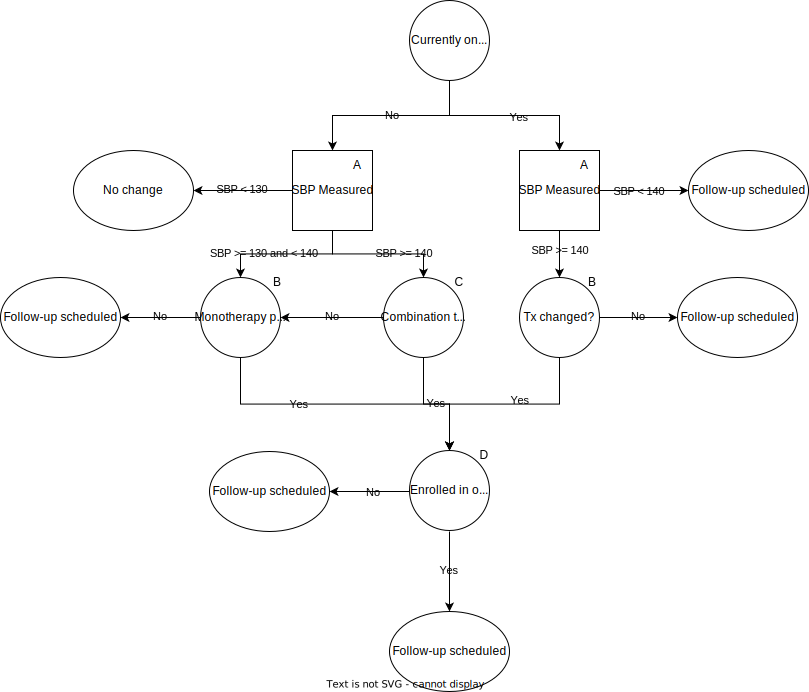

.. _us_cvd_concept_model:
..
  Section title decorators for this document:

  ==============
  Document Title
  ==============

  Section Level 1 (#.0)
  +++++++++++++++++++++
  
  Section Level 2 (#.#)
  ---------------------

  Section Level 3 (#.#.#)
  ~~~~~~~~~~~~~~~~~~~~~~~

  Section Level 4
  ^^^^^^^^^^^^^^^

  Section Level 5
  '''''''''''''''

  The depth of each section level is determined by the order in which each
  decorator is encountered below. If you need an even deeper section level, just
  choose a new decorator symbol from the list here:
  https://docutils.sourceforge.io/docs/ref/rst/restructuredtext.html#sections
  And then add it to the list of decorators above.

====================================================
Vivarium - US Health Disparities - CVD Interventions
====================================================

.. contents::
  :local:

.. list-table:: Definitions of terms and abbreviations
  :widths: 15 15 15
  :header-rows: 1

  * - Term or Abbreviation
    - Definition
    - Note
  * - BMI
    - Body Mass Index
    - Risk Factor
  * - FPG
    - Fasting Plasma Glucose
    - Risk Factor
  * - HbA1c
    - Hemoglobin A1c
    - Measures blood glucose control over the last 2-3 months
  * - LDL-C
    - Low Density Lipoprotein Cholesterol
    - Risk Factor
  * - SBP
    - Systolic blood pressure
    - Risk Factor
  * - DBP
    - Diastolic blood pressure
    - Risk Factor; not currently modeled as part of GBD, but used clinically to define hypertension
  * - Stage 1 hypertension
    - SBP 130-139 OR DBP 80-89
    - American Heart Association/American College of Cardiology guidelines
  * - Stage 2 hypertension
    - SBP 140 or higher OR DBP 90 or higher
    - American Heart Association/American College of Cardiology guidelines
  * - PDC
    - Percent days covered
    - :math:`\frac{Number\ of\ days\ in\ period\ medication\ taken}{Number\ of\ days\ in\ period}`

.. _uscvd1.0:

1.0 Background
++++++++++++++
We have shown that geographic disparities in cardiovascular disease (CVD) are large and have persisted over 
the past 40 years. For example, the age-standardized death rate due to ischemic heart disease in Oklahoma 
remains more than twice that of Minnesota (144 vs. 63 per 100,000). Alarmingly, many states have seen no 
further decline in CVD since 2010 and the gap in CVD between states has not improved. 

In a projection of CVD risk factors and mortality, we found that over 2 million premature deaths would 
be prevented with expanded control of risk factors. Our research also estimated that in the U.S., the 
absolute risk of premature CVD death would be reduced more than 4% if major risk factor targets are 
achieved by 2025. 

These results indicate that reducing risk factors would be very impactful in reducing CVD, however due to the 
geographic disparities, these national results have limited usefulness. A subnational evaluation of the impact 
of population-level evidence-based interventions is an important goal. 

The NIH has recognized the importance of studying health disparities, as required by the Minority Health and 
Health Disparities Research and Education Act. In its strategic plan, NHLBI has encouraged the investigation 
of “strategies that effectively address these differences,” asking the question “how can cardiometabolic risk 
be managed to improve health trajectories in specific populations?” 

We distinguish between two areas of research needed to understand population-level CVD trajectories: 
a) population health projections and b) health policy models. Population health projections are the result 
of a particular set of assumptions on future health trends. Health policy models are a subtype of projection 
that project future changes in health due to interventions after the efficacy of the intervention is 
established. Previous health policy models developed with NIH support operate only for only a single 
geographic region (usually the United States), and consider only a limited set of risks and outcomes.  

.. _uscvd2.0:

2.0 Modeling Aims and Objectives
++++++++++++++++++++++++++++++++

**Objective:** Model the effect of three different interventions on the development of cardiometabolic burden 
in the United States, contingent on each state’s current population characteristics, patterns of CVD risk, 
health care access, level of effective medication delivery, and differential effects of risk factor 
interventions by subgroups. 

- Intervetions are aimed at: 1) improving blood pressure and LDL-cholesterol control, 2) increasing exercise, 3) decreasing BMI/weight, and 4) improving control of fasting plasma glucose 
- Initial efforts will focus on the 50 US states and Washington DC  
- Comparisons will be with the GBD results of incidence, prevalence, and mortality for various causes and risks associated with CVD  

.. _uscvd3.0:

3.0 Concept Model
+++++++++++++++++

**Ideal Concept Model**

.. image:: concept_model_v2.svg

**Minimum Viable Model**

.. image:: concept_model_v3.svg

.. _uscvd3.1:

3.1 Simulation Scenarios
------------------------

.. todo::
  Lacking clarity on if these are implemented together or one at a time. I am coded them as separate and a final 
  combined run currently but this is a lot of scenarios to run. Should consider limiting this list. 

#. **Baseline**  
#. **Medical Outreach 50% Coverage**  
#. **Medical Outreach 100% Coverage**
#. **Polypill 50% Coverage**  
#. **Polypill 100% Coverage**
#. **Lifestyle Modification 50% Coverage**
#. **Lifestyle Modification 100% Coverage**
#. **Combination of All Modifications 50% Coverage**
#. **Combination of All Modifications 100% Coverage**

**Baseline** is assumed to have no one enrolled in any intervention. 

**Medical Outreach 50% Coverage** assumes 50% of eligible simulants are enrolled in the outreach intervention. Scales 
linearly over 1 year such that there is 0% coverage at baseline and 50% at year 1. Remain at 50% coverage for 
the remainder of the simulation. 

**Medical Outreach 100% Coverage** assumes all eligible simulants are enrolled in the intervention. Scales 
linearly over 1 year such that there is 0% coverage at baseline and 100% at year 1. 

**Polypill 50% Coverage** assumes 50% of eligible simulants receive the polypill intervention. Scales 
linearly over 1 year such that there is 0% coverage at baseline and 50% at year 1. Remain at 50% coverage for 
the remainder of the simulation. 

**Polypill 100% Coverage** assumes all eligible simulants receive the polypill intervention. Scales 
linearly over 1 year such that there is 0% coverage at baseline and 100% at year 1.

**Lifestyle Modification 50% Coverage** assumes 50% of eligible simulants are enrolled in the lifestyle modification 
intervention. Scales linearly over 1 year such that there is 0% coverage at baseline and 50% at year 1. Remain at 50% 
coverage for the remainder of the simulation. 

**Lifestyle Modification 100% Coverage** assumes all eligible simulants are enrolled in the lifestyle modeification 
intervention. Scales linearly over 1 year such that there is 0% coverage at baseline and 100% at year 1. 

**Combination of All Modifications 50% Coverage** assumes 50% coverage for all interventions, implemented 
simultaneously. Scales linearly over 1 year such that there is 0% coverage at baseline and 50% at year 1. 
Remain at 50% coverage for the remainder of the simulation. 

**Combination of All Modifications 100% Coverage** assumes 100% coverage for all interventions, implemented 
simultaneously. Scales linearly over 1 year such that there is 0% coverage at baseline and 100% at year 1.

.. _uscvd3.2:

3.2 Simulation Timeframe and Intervention Start Dates
-----------------------------------------------------

.. todo::
  Need to add intervention start date. 
  Need to validate observation start date.  

.. list-table:: Developmental model CVD simulation timeframe and intervention dates
  :header-rows: 1

  * - Parameter
    - Value
  * - Date of simulation burn-in period start
    - January 1, 2021
  * - Date of simulation observation period start
    - January 1, 2023
  * - Date of intervention scale-up start
    - January 1, 2024
  * - Date of simulation end
    - December 31, 2040
  * - Simulation time step
    - 28 days
  * - Intervention scale-up rate
    - Linear scale-up over 1 year

.. _uscvd4.0:

4.0 Vivarium Modeling Components
++++++++++++++++++++++++++++++++

.. _uscvd4.1:

4.1 Vivarium Concept Model Diagram Components 
---------------------------------------------

.. _4.1.1:

4.1.1 Cause Models
~~~~~~~~~~~~~~~~~~
* :ref:`Hypertensive Heart Disease <2019_cause_hhd>`
* :ref:`Ischemic Heart Disease <2019_cause_ihd>`
* :ref:`Ischemic Stroke <2019_cause_Ischemic_Stroke>`
* :ref:`Intracerebral Hemorrhage <2019_cause_ich>`
* :ref:`Subarachnoid Hemorrhage <2019_cause_sah>`
* :ref:`Diabetes Mellitus <2019_cause_diabetes>`
* :ref:`Peripheral Arterial Disease <2019_cause_pad>`
* :ref:`Aortic Aneurysm <2019_cause_Aortic_Aneurysm>`
* :ref:`Atrial Fibrillation and Flutter <2019_cause_afib>`
* :ref:`Heart Failure <2019_cause_Heart_Failure>`
* :ref:`Chronic Obstructive Pulmonary Disease <2019_cause_copd>`

.. todo::
  CKD does not currently exist in 2019 models, need to investigate and/or create 

.. _4.1.2:

4.1.2 Risk Exposure Models
~~~~~~~~~~~~~~~~~~~~~~~~~~
* :ref:`Systolic Blood Pressure <2019_risk_sbp>`
* :ref:`High LDL Cholesterol <2019_risk_exposure_ldl>`
* :ref:`Body Mass Index <2019_risk_bmi>`
* :ref:`Fasting Plasma Glucose <2019_risk_exposure_fpg>`

.. todo::
  Decide on inclusion of tobacco and create as needed  

.. _4.1.3:

4.1.3 Risk Effects Models
~~~~~~~~~~~~~~~~~~~~~~~~~~
* :ref:`Systolic Blood Pressure <2019_risk_effect_sbp>`
* :ref:`High LDL Cholesterol <2019_risk_effect_ldl>`

.. todo::
  Create risk effect models for BMI and FPG 

.. _4.1.4:

4.1.4 Intervention Models
~~~~~~~~~~~~~~~~~~~~~~~~~
.. note::
  Main intervention page will be deleted once information is transferred to individual pages 
  :ref:`Carbiometabolic Risk Management <intervention_crm_mgmt>`

Individual intervention pages: 

* :ref:`Outreach Intervention <intervention_crm_mgmt_outreach>`
* :ref:`Polypill Intervention <intervention_crm_mgmt_polypill>`
* :ref:`Lifestyle Modification Intervention <intervention_crm_mgmt_lifestyle>`

.. _4.1.5:

4.1.5 Other Models
~~~~~~~~~~~~~~~~~~
.. note::
  I plan to integrate these into other pages and to delete all in the final version  

  * :ref:`Health Care Visit Types <intervention_crm_mgmt_visit>`
  * :ref:`Medications <intervention_crm_mgmt_tx>`
  * :ref:`Affected Outcomes <intervention_crm_mgmt_affected_outcomes>`
  * :ref:`Initialization <intervention_crm_mgmt_initialization>`

.. _uscvd4.2:

4.2 Demographics 
----------------

.. _uscvd4.2.1:

4.2.1 Population Description
~~~~~~~~~~~~~~~~~~~~~~~~~~~~

**Throughout model development and verification/validation:**

.. list-table:: CVD simulation model development population parameters
   :header-rows: 1

   * - Parameter
     - Value
     - Note
   * - Population size
     - 50,000
     - per random seed/draw combination
   * - Number of draws
     - 10
     - 
   * - Number of random seeds
     - 15
     - per draw
   * - Cohort type
     - Closed
     - 
   * - Age start
     - 7 years
     - Minimum age at initialization was chosen to have youngest simulants be 25 at the end. Ages 7-25 will be modeled but not observed. 
   * - Age end
     - 125 years
     - Maximum age at initialization
   * - Sex restrictions
     - None 
     - 

.. todo::
  Discuss appropriate number of seeds and draws  

**Additional Stratification of Population:**
Intended to identify groups that we are interested in being able to track and compare in the simulation.

  - P\ :sub:`1`\: healthy individuals: Simulants that never receive an intervention, develop risk factors, or experience a qualifying event 
  - P\ :sub:`2`\: new initiators, primary: Simulants who receive an intervention following identification of elevated risk factors 
  - P\ :sub:`3`\: new initiators, secondary: Simulants who receive an intervention following an acute qualifying event 
  - P\ :sub:`4`\: previous diagnosis: Simulants who meet intervention eligibility at the start of the simulation. They have been prescribed medication and/or received guidance about lifestyle modifications according to standard practice of care. 

.. _uscvd4.2.2:

4.2.2 Location description
~~~~~~~~~~~~~~~~~~~~~~~~~~

**Locations**: All 50 US states and District of Columbia

.. _uscvd4.3:

4.3 Healthcare System Modeling
------------------------------

Within this model, simulants move through the healthcare system. The initialization parameters for screening visits 
are listed separately. Below are diagrams for how blood pressure and LDL-C measurement and medication are handled. 
Regardless of visit type (screening, follow-up, or emergency), simulants will move through the same pathway for both 
conditions at each visit. 

First, it is determined if the simulant will have a healthcare interaction in that time step. 

.. list-table:: Visit Interactions per Time Step 
  :widths: 3 15 15
  :header-rows: 1

  * - Visit Type 
    - Assignment to Visit  
    - Notes
  * - No Visit 
    - Default assignment   
    - 
  * - Screening 
    - If simulant does not have a follow-up or emergency visit, use: outpatient_visits=HealthcareEntity (name='outpatient_visits', kind='healthcare_entity', gbd_id=me_id(19797), utilization=me_id(19797),)
    - Outpatient utilization envelope from GBD; will want to update to use NHANES data in future
  * - Follow-up 
    - Scheduled at time of medication prescription or emergency event 
    - Scheduling of follow-up is pulled from uniform distribution ranging between 3 and 6 months 
  * - Emergency 
    - If simulant has an acute event during this time step, 100% will have an emergency visit 
    - Acute events are ischemic stroke or acute myocardial infarction 

.. todo::
  - Currently 100% of patients with a follow-up scheduled, go to that appointment. Is this an okay assumption?  

**SBP Treatment Ramp**

.. list-table:: SBP Treatment Inputs
  :widths: 3 15 15
  :header-rows: 1

  * - ID
    - Decision Information 
    - Notes
  * - A
    - SBP measurement error pulled from a normal distribution with mean=0 and SD=2.9 mm Hg
    - [Wallace_2011]_
  * - B
    - 41.76% will not change medication due to theraputic inertia 
    - [Ali_2021]_ [Liu_2017]_
  * - C
    - 41.76% will not start medication; 26.25% will receive two drugs at half dose, remainder will receive one drug at half dose  
    - [Byrd_2011]_ [Ali_2021]_ [Liu_2017]_
  * - D
    - If simulant is eligible, either 50% or 100% depending on scenario  
    - For 50% scenario, assignment is random 

**LDL-C Treatment Ramp**

.. image:: ldl_ramp_all.svg

.. list-table:: LDL-C Treatment Inputs
  :widths: 3 15 15
  :header-rows: 1

  * - ID
    - Decision Information 
    - Notes
  * - A
    - ASCVD = -19.5 + (0.043 * SBP) + (0.266 * Age) + (2.32 * Sex)
    -  
  * - B
    - LDL-C measreument error pulled from a normal distribution with mean=0 and SD=3 mg/dL    
    - [McCormack_2020]_
  * - C
    - 19.4% will not start medication; 14.2% will receive high intensity statin; 55.1% medium intensity; and 11.3% low intensity 
    - [Morales_2018]_ [Arnett_2019]_
  * - D
    - 19.4% will not change medication due to theraputic inertia 
    - [Morales_2018]_ 
  * - E
    - If simulant is eligible, either 50% or 100% depending on scenario  
    - For 50% scenario, assignment is random 

.. _uscvd4.4:

4.4 Treatment Assignment and Effect Modeling
--------------------------------------------

Adherence
~~~~~~~~~

Adherence is a widely recognized issue both in the US and globally [Sabate_2003]_. Non-adherence to medication 
costs the US an estimated $170 billion annually in healthcare expenses, and is a major cause of negative 
patient outcomes [Fischer_2010]_. This can be especially pronounced in chronic conditions, such as hypertension and hyperlipidemia. 

In our modeling, we categorize adherence into dichotomous outcomes, where adherent simulants receive the full 
benefit of their medication and non-adherent simulants receive no benefit. The selection of an 80% cutoff matches 
current literature standards, and has been validated for both hypertension and hyperlipidemia [Baumgartner_2018]_. 

Adherence is categorized into three buckets: 

#. Primary nonadherent - simulant never fills their prescription 
#. Secondary nonadherent - simulant fills prescription for medication but has a percent of days covered (PDC) less than 0.8 
#. Adherent - simulant has a PDC greater than or equal to 0.8 

If a simulant is primary or secondary nonadherent, their adherence score in the model is 0. If they are 
adherent, their adherence score is 1. 

 .. Note::
    This is an opportunity area for improvement in later models. Adherence can include partial benefit, and can be done at a state level with survey or Medicare data if there is available time. 

**LDL-C Treatments**

.. list-table:: Adherence Score Values 
  :widths: 10 10 10 
  :header-rows: 1

  * - Category
    - Percent of Simulants 
    - Notes
  * - Primary Non-adherence
    - 25%
    - [Cheen_2019]_
  * - Secondary Non-adherence
    - 35.85%
    - 
  * - Adherent
    - 39.15%
    - [Oung_2017]_

**Blood Pressure Treatments**

.. list-table:: Adherence Score Values 
  :widths: 10 10 10 
  :header-rows: 1

  * - Category
    - Percent of Simulants 
    - Notes
  * - Primary Non-adherence
    - 16%
    - [Cheen_2019]_
  * - Secondary Non-adherence
    - 36.46%
    - 
  * - Adherent
    - 47.54%
    - [Oung_2017]_

Treatment Assignments
~~~~~~~~~~~~~~~~~~~~~

**Blood Pressure Treatments** 

In general, blood pressure medication is prescribed "start low and go slow" where medication is started at a low level 
and slowly increased over subsequent visits when a patient is not reaching targets. This approach can lead to under 
medicating individuals, but is followed here to best simulate real world practice. [Arnett_2019]_

Further details about treatment assignment to simulants can be found in the healthcare visits above. At a high level, 
for simulants where theraputic inertia is overcome: 

- A new simulant with SBP >=130 and <140 is assigned to one medication at half dose 
- A new simulant with SBP >=140: 
  
  - 45% will receive two drugs at half dose 
  - 55% will receive one drug at half dose 
- A simulant already on medication with SBP >= 140 will move up one treatment category 
  
  - For example: a simulant receiving two drugs at standard dose will move to three drugs at half dose 
  - Once a simulant is receiving three drugs at standard dose, they will remain in the treatment category permanently 

For all medication prescriptions and increases, theraputic inertia must be overcome. 

**LDL-C Treatments** 

LDL-C treatments follow a similar pattern as the blood pressure ramp decribed above. The decision to assign a 
simulant treatment is completed in the healthcare visits above. The choice of intensity is determined by the 
simulant's ASCVD score and LDL-C. For simulants where theraputic inertia is overcome, the treatment assignements
are summarized below. [Arnett_2019]_

- A new simulant with ASCVD greater than 7.5% and LDL-C greater than 70 mg/dL:
  
  - 17.7% are assigned a high intensity statin 
  - 68.4% are assigned a medium intensity statin 
  - 14.0% are assigned a low intensity statin 

- A simulant already on medication with LDL-C > 70 mg/dL will move up one treatment category 
  
  - For example: a simulant receiving a high intensity statin will move to a low/medium intensity statin with a non-statin medication 
  - Once a simulant is receiving a high intensity statin with a non-statin therapy, they will remain in the treatment category permanently 

For all medication prescriptions and increases, theraputic inertia must be overcome. 

Treatment Effects
~~~~~~~~~~~~~~~~~

**Blood Pressure Treatments**  

Blood pressure treatment efficacy is dependent on a simulant's SBP value. Full efficacy data is here:
/share/scratch/projects/cvd_gbd/cvd_re/simulation_science/drug_efficacy_sbp_new.csv [Law_2009]_

Blood pressure treatment is split into 6 categories based on the number of medications and dosage. It 
is assumed that different medications have a similar impact and therefore are not modeled individually. 
The maximum number of medications a simulant can receive is 3 at standard dose. 

SBP decrease for an individual simulant is based on both the medication impact and adherence score:  

SBP decrease = SBP treatment efficacy * Adherence score

**LDL-C Treatments** 

LDL-C treatment efficacy is a percent reduction in LDL-C level. This means that simulants with higher 
initial LDL-C levels will see a higher total reduction. The full efficacy data is here: 
/share/scratch/projects/cvd_gbd/cvd_re/simulation_science/drug_efficacy_ldl.csv [Hou_2009]_ [Goff_2014]_

LDL-C treatment is split into 5 categories based on the intensity of statins prescribed, and the inclusion 
of additional treatments with statins. This assumes that the impact of different individual therapies is 
similar and they therefore are not modeled individually. The maximum amount of medications a 
simulant can receive is high intensity statins with an additional non-statin medication. 

LDL-C decrease for an individual simulant is based on both the medication impact and adherence score:  

LDL-C decrease = LDL-C treatment efficacy * Adherence score 

.. _uscvd4.5:

4.5 Initialization Parameters
-----------------------------

.. list-table:: Key parameters for initialization
  :widths: 5 5 10 10
  :header-rows: 1

  * - Parameter
    - Reference
    - Data Source for Simulation
    - Notes
  * - Baseline Coverage Data for Medication of SBP or LDL-C 
    - See below code and equations 
    - Generated from NHANES data 
    - 
  * - SBP baseline coverage rate for each ramp position
    - [An_2021]_
    - 43% receive two drugs at half dose; 57% one drug at half dose 
    - Burn in period will allow some simulants to move to different medication buckets prior to sim start 
  * - LDL-C baseline coverage rate
    - [Garcia-Gil_2016]_
    - 3.82% receive low intensity; 71.94% medium intensity; 24.24 high intensity 
    - Burn in period will allow some simulants to move to different medication buckets prior to sim start 
  * - Follow-up visit initialization 
    - 
    - All simulants on SBP medication, LDL-C medication, or a history of an acute event will receive a follow-up visit (post myocaridal infarction or chronic stroke state) 
    - Burn in period will allow some simulants to have appointments for hypertension or hyperlipidemia prior to sim start 
  * - Follow-up visit time distribution  
    - 
    - With burn in, all simulants can be assigned a follow-up from the normal uniform distribution 
    - Burn in period will allow some simulants to have appointments on sim start time step 

Baseline Coverage Data for Medication of SBP or LDL-C
~~~~~~~~~~~~~~~~~~~~~~~~~~~~~~~~~~~~~~~~~~~~~~~~~~~~~

Baseline coverage of treatment for elevated SBP and elevated LDL-c is substantial and expected to vary by age, sex, and time. Bask To initialize simulants, the research team has fit a multinomial regression to NHANES data. 

 :math:`\ln(\frac{P(tx=SBPonly)}{P(tx=none)}) = b_{10} + b_{11}(SBP_{level}) + b_{12}(LDL_{level}) + b_{13}age_{(yrs)} + b_{14}sex`
 :math:`\ln(\frac{P(tx=LDLonly)}{P(tx=none)}) = b_{20} + b_{21}(SBP_{level}) + b_{22}(LDL_{level}) + b_{23}age_{(yrs)} + b_{24}sex`
 :math:`\ln(\frac{P(tx=Both)}{P(tx=none)}) = b_{30} + b_{31}(SBP_{level}) + b_{32}(LDL_{level}) + b_{33}age_{(yrs)} + b_{34}sex`

 
 .. code-block:: R

  ###### Setup ######
  rm(list=ls())

  suppressMessages(library(data.table))
  library(ggplot2)
  library(nnet)

  ###### Files and paths ######
  file_path <- "/share/scratch/projects/cvd_gbd/cvd_re/simulation_science/nhanes/"

  ###### Read in file ######
  load(paste0(file_path, "nhanes_microdata.rdata"))

  # Recode treatment variables to account for skip pattern
  data[,sbptx:=ifelse(highbp==0 & is.na(bpmeds), 0, bpmeds)]
  data[,choltx:=ifelse(highchol==0 & is.na(cholmeds), 0, cholmeds)]
  data[,tx:=ifelse(sbptx==0 & choltx==0, "none", ifelse(sbptx==1 & choltx==0, "bponly", 
      ifelse(sbptx==0 & choltx==1, "cholonly", ifelse(sbptx==1 & choltx==1, "both", NA))))]
  data[,tx2:=factor(tx, levels=c("none", "bponly", "cholonly", "both"))]

  meds <- multinom(tx2 ~ bpsys + lbdldl + sex_id + age_year, data=data)

  # weights:  24 (15 variable)
  initial  value 21425.179351 
  iter  10 value 16793.908492
  iter  20 value 14903.770849
  final  value 14903.720511 
  converged

  summary(meds)
  Call: multinom(formula = tx2 ~ bpsys + lbdldl + sex_id + age_year, 
    data = data)

  Coefficients:
           (Intercept)        bpsys       lbdldl     sex_id   age_year
  bponly     -6.746432  0.024905946 -0.004474287  0.1578084 0.05006270
  cholonly   -4.234380 -0.002564668 -0.005063271 -0.1900133 0.06173726
  both       -6.262507  0.018470096 -0.013548739  0.1326292 0.06909707

  Std. Errors:
           (Intercept)       bpsys       lbdldl     sex_id    age_year
  bponly     0.1863489 0.001265926 0.0006439986 0.04686429 0.001632670
  cholonly   0.2665387 0.001872484 0.0009045871 0.06485975 0.002270549
  both       0.2067298 0.001371421 0.0007557389 0.05139671 0.001875866

  Residual Deviance: 29807.44 
  AIC: 29837.44 

.. _uscvd4.6:

4.6 Models
----------
`Simulation Results <https://shiny.ihme.washington.edu/content/416/>`_

 .. note::
    validation notebooks and results are stored in /mnt/team/cvd/pub/usa_re/sim_science/validation/
    
 .. todo::
    Complete table with plan for the models in order of implementation 

.. list-table:: Model verification and validation tracking
  :widths: 3 10 20
  :header-rows: 1

  * - Model
    - Description
    - V&V summary
  * - 1.0
    - Alabama; IHD, ischemic stroke
    - Incidence of MI matches GBD but is overestimated in simulation compared to the artifact. Results appear sensitive to small sample sizes. 
  * - 2.0
    - SBP and LDL-C 
    - Validated 
  * - 3.0
    - FPG and BMI 
    - Validated 
  * - 4.0
    - HF 
    - Not validating 
  * - 5.0
    -  
    -  
  * - 6.0
    -  
    -  
  
.. _uscvd4.7:

4.7 Desired outputs
-------------------
 .. todo::
    Validate the below with project partners: 

    - Are DALYs cause specific or is total DALYs okay? 
    - Is change in risk factor by state also important? (i.e., a XX drop in SBP)
    - What is missing from the below? 

Outputs:

#. DALYs (YLLs and YLDs) due to cause specific mortality 
#. Average values for risk factors by state and year (SBP, LDL-C, FPG, and BMI)
#. Numbers of interventions administered per a) 100,000 population, and b) 100,000 person years 

.. _uscvd4.8:

4.8 Output meta-table shell
---------------------------

.. todo::
  - add table 

.. _uscvd5.0:

5.0 Back of the Envelope Calculations
+++++++++++++++++++++++++++++++++++++

.. _uscvd6.0:

6.0 Limitations
+++++++++++++++

.. _uscvd7.0:

7.0 References
++++++++++++++

.. [Ali_2021] Ali, Dalia H., Birsen Kiliç, Huberta E. Hart, Michiel L. Bots, Marion C. J. Biermans, Wilko Spiering, Frans H. Rutten, and Monika Hollander. 2021. “Therapeutic Inertia in the Management of Hypertension in Primary Care.” Journal of Hypertension 39 (6): 1238–45. 
  https://doi.org/10.1097/HJH.0000000000002783.

.. [An_2021] An, Jaejin, Tiffany Luong, Lei Qian, Rong Wei, Ran Liu, Paul Muntner, Jeffrey Brettler, Marc G. Jaffe, Andrew E. Moran, and Kristi Reynolds. 2021. “Treatment Patterns and Blood Pressure Control With Initiation of Combination Versus Monotherapy Antihypertensive Regimens.” Hypertension 77 (1): 103–13. 
  https://doi.org/10.1161/HYPERTENSIONAHA.120.15462.

.. [Arnett_2019] Arnett, Donna K., Roger S. Blumenthal, Michelle A. Albert, Andrew B. Buroker, Zachary D. Goldberger, Ellen J. Hahn, Cheryl Dennison Himmelfarb, et al. 2019. “2019 ACC/AHA Guideline on the Primary Prevention of Cardiovascular Disease: Executive Summary: A Report of the American College of Cardiology/American Heart Association Task Force on Clinical Practice Guidelines.” Circulation 140 (11). 
  https://doi.org/10.1161/CIR.0000000000000677  

.. [Baumgartner_2018] Baumgartner, Pascal C., R. Brian Haynes, Kurt E. Hersberger, and Isabelle Arnet. 2018. “A Systematic Review of Medication Adherence Thresholds Dependent of Clinical Outcomes.” Frontiers in Pharmacology 9. 
  https://www.frontiersin.org/articles/10.3389/fphar.2018.01290 

.. [Becker-2005] Becker, Diane M., et al. "Impact of a community-based multiple risk factor intervention on cardiovascular risk in black families with a history of premature coronary disease." Circulation 111.10 (2005): 1298-1304.
  https://www.ahajournals.org/doi/10.1161/01.CIR.0000157734.97351.B2

.. [Byrd_2011] Byrd, James B., Chan Zeng, Heather M. Tavel, David J. Magid, Patrick J. O’Connor, Karen L. Margolis, Joe V. Selby, and P. Michael Ho. 2011. “Combination Therapy as Initial Treatment for Newly Diagnosed Hypertension.” American Heart Journal 162 (2): 340–46. 
  https://doi.org/10.1016/j.ahj.2011.05.010.

.. [Cheen_2019] Cheen, McVin Hua Heng, Yan Zhi Tan, Ling Fen Oh, Hwee Lin Wee, and Julian Thumboo. 2019. “Prevalence of and Factors Associated with Primary Medication Non-Adherence in Chronic Disease: A Systematic Review and Meta-Analysis.” International Journal of Clinical Practice 73 (6): e13350. 
  https://doi.org/10.1111/ijcp.13350

.. [Derose-2013] Derose, Stephen F., et al. "Automated outreach to increase primary adherence to cholesterol-lowering medications." JAMA internal medicine 173.1 (2013): 38-43.
	https://jamanetwork.com/journals/jamainternalmedicine/fullarticle/1399850

.. [Ely-2017] Ely, Elizabeth K., et al. "A national effort to prevent type 2 diabetes: participant-level evaluation of CDC’s National Diabetes Prevention Program." Diabetes care 40.10 (2017): 1331-1341.
  https://care.diabetesjournals.org/content/40/10/1331

.. [Fischer_2010] Fischer, Michael A., Margaret R. Stedman, Joyce Lii, Christine Vogeli, William H. Shrank, M. Alan Brookhart, and Joel S. Weissman. 2010. “Primary Medication Non-Adherence: Analysis of 195,930 Electronic Prescriptions.” Journal of General Internal Medicine 25 (4): 284–90. 
  https://doi.org/10.1007/s11606-010-1253-9 

.. [Garcia-Gil_2016] García-Gil, Maria, Jordi Blanch, Marc Comas-Cufí, Josep Daunis-i-Estadella, Bonaventura Bolíbar, Ruth Martí, Anna Ponjoan, Lia Alves-Cabratosa, and Rafel Ramos. 2016. “Patterns of Statin Use and Cholesterol Goal Attainment in a High-Risk Cardiovascular Population: A Retrospective Study of Primary Care Electronic Medical Records.” Journal of Clinical Lipidology 10 (1): 134–42. 
  https://doi.org/10.1016/j.jacl.2015.10.007.

.. [Goff_2014] Goff, David C., Donald M. Lloyd-Jones, Glen Bennett, Sean Coady, Ralph B. D’Agostino, Raymond Gibbons, Philip Greenland, et al. 2014. “2013 ACC/AHA Guideline on the Assessment of Cardiovascular Risk.” Circulation 129 (25_suppl_2): S49–73. 
  https://doi.org/10.1161/01.cir.0000437741.48606.98

.. [Hou_2009] Hou, Runhua, and Anne Carol Goldberg. 2009. “Lowering Low-Density Lipoprotein Cholesterol: Statins, Ezetimibe, Bile Acid Sequestrants, and Combinations: Comparative Efficacy and Safety.” Endocrinology and Metabolism Clinics of North America, Lipids, 38 (1): 79–97. 
  https://doi.org/10.1016/j.ecl.2008.11.007

.. [Law_2009] Law, M. R., J. K. Morris, and N. J. Wald. 2009. “Use of Blood Pressure Lowering Drugs in the Prevention of Cardiovascular Disease: Meta-Analysis of 147 Randomised Trials in the Context of Expectations from Prospective Epidemiological Studies.” BMJ 338 (May): b1665. 
  https://doi.org/10.1136/bmj.b1665

.. [Liu_2017] Liu, Xuefeng, Tinghui Zhu, Milisa Manojlovich, Hillel W. Cohen, and Dennis Tsilimingras. 2017. “Racial/Ethnic Disparity in the Associations of Smoking Status with Uncontrolled Hypertension Subtypes among Hypertensive Subjects.” PloS One 12 (8): e0182807. 
  https://doi.org/10.1371/journal.pone.0182807.

.. [McCormack_2020] McCormack, James P., and Daniel T. Holmes. 2020. “Your Results May Vary: The Imprecision of Medical Measurements.” BMJ 368 (February): m149. 
  https://doi.org/10.1136/bmj.m149.

.. [Metz-et-al-2000] Metz, Jill A., et al. "A randomized trial of improved weight loss with a prepared meal plan in overweight and obese patients: impact on cardiovascular risk reduction." Archives of internal medicine 160.14 (2000): 2150-2158.
  https://jamanetwork.com/journals/jamainternalmedicine/fullarticle/485403

.. [Morales_2018] Morales, Clotilde, Núria Plana, Anna Arnau, Laia Matas, Marta Mauri, Àlex Vila, Lluís Vila, et al. 2018. “Causas de no consecución del objetivo terapéutico del colesterol de las lipoproteínas de baja densidad en pacientes de alto y muy alto riesgo vascular controlados en Unidades de Lípidos y Riesgo Vascular. Estudio EROMOT.” Clín. investig. arterioscler. (Ed. impr.), 1–9.

.. [Munoz-NEJM] Muñoz, Daniel, et al. "Polypill for cardiovascular disease prevention in an underserved population." New England Journal of Medicine 381.12 (2019): 1114-1123.
  https://www.nejm.org/doi/10.1056/NEJMoa1815359

.. [Oung_2017] Oung, Alvin B., Emily Kosirog, Benjamin Chavez, Jason Brunner, and Joseph J. Saseen. 2017. “Evaluation of Medication Adherence in Chronic Disease at a Federally Qualified Health Center.” Therapeutic Advances in Chronic Disease 8 (8–9): 113–20. 
  https://doi.org/10.1177/2040622317714966

.. [Sabate_2003] Sabaté, Eduardo, and World Health Organization, eds. 2003. Adherence to Long-Term Therapies: Evidence for Action. Geneva: World Health Organization. 

.. [Thom-2013] Thom, Simon, et al. "Effects of a fixed-dose combination strategy on adherence and risk factors in patients with or at high risk of CVD: the UMPIRE randomized clinical trial." Jama 310.9 (2013): 918-929.
	https://jamanetwork.com/journals/jama/fullarticle/1734704

.. [Wallace_2011] Wallace, Emma, and Tom Fahey. 2011. “Measuring Blood Pressure in Primary Care: Identifying ‘White Coat Syndrome’ and Blood Pressure Device Comparison.” The British Journal of General Practice 61 (590): 544–45.
  https://doi.org/10.3399/bjgp11X593749. 
