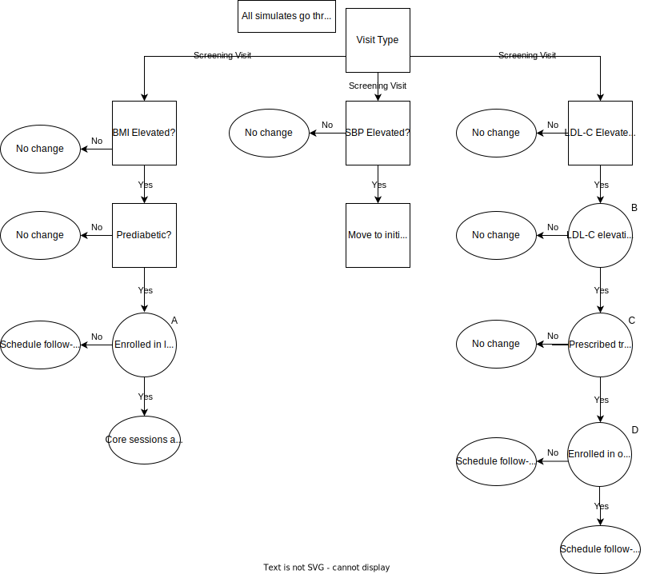
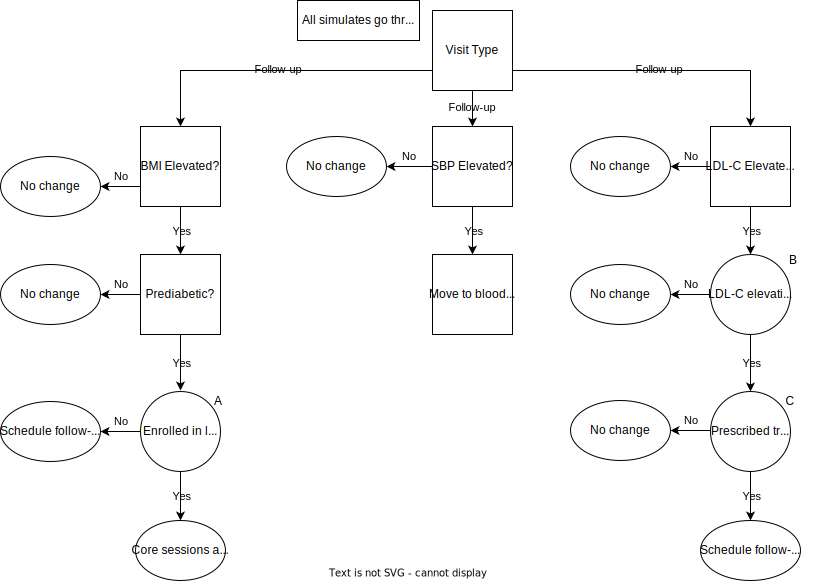
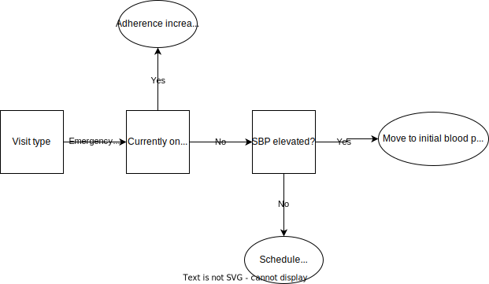
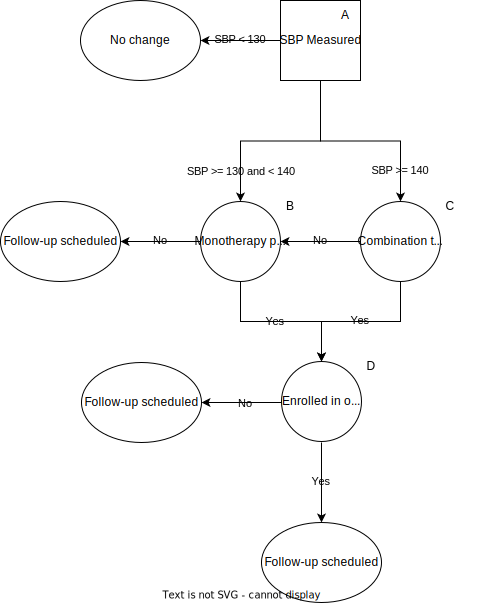
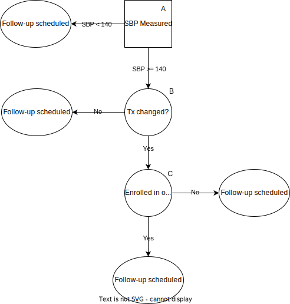

.. _us_cvd_concept_model:
..
  Section title decorators for this document:

  ==============
  Document Title
  ==============

  Section Level 1 (#.0)
  +++++++++++++++++++++
  
  Section Level 2 (#.#)
  ---------------------

  Section Level 3 (#.#.#)
  ~~~~~~~~~~~~~~~~~~~~~~~

  Section Level 4
  ^^^^^^^^^^^^^^^

  Section Level 5
  '''''''''''''''

  The depth of each section level is determined by the order in which each
  decorator is encountered below. If you need an even deeper section level, just
  choose a new decorator symbol from the list here:
  https://docutils.sourceforge.io/docs/ref/rst/restructuredtext.html#sections
  And then add it to the list of decorators above.

====================================================
Vivarium - US Health Disparities - CVD Interventions
====================================================

.. contents::
  :local:

.. list-table:: Definitions of terms and abbreviations
  :widths: 15 15 15
  :header-rows: 1

  * - Term or Abbreviation
    - Definition
    - Note
  * - BMI
    - Body Mass Index
    - Risk Factor
  * - FPG
    - Fasting Plasma Glucose
    - Risk Factor
  * - HbA1c
    - Hemoglobin A1c
    - Measures blood glucose control over the last 2-3 months
  * - LDL-C
    - Low Density Lipoprotein Cholesterol
    - Risk Factor
  * - SBP
    - Systolic blood pressure
    - Risk Factor
  * - DBP
    - Diastolic blood pressure
    - Risk Factor; not currently modeled as part of GBD, but used clinically to define hypertension
  * - Stage 1 hypertension
    - SBP 130-139 OR DBP 80-89
    - American Heart Association/American College of Cardiology guidelines
  * - Stage 2 hypertension
    - SBP 140 or higher OR DBP 90 or higher
    - American Heart Association/American College of Cardiology guidelines
  * - PDC
    - Percent days covered
    - :math:`\frac{Number\ of\ days\ in\ period\ medication\ taken}{Number\ of\ days\ in\ period}`

.. _uscvd1.0:

1.0 Background
++++++++++++++
We have shown that geographic disparities in cardiovascular disease (CVD) are large and have persisted over 
the past 40 years. For example, the age-standardized death rate due to ischemic heart disease in Oklahoma 
remains more than twice that of Minnesota (144 vs. 63 per 100,000). Alarmingly, many states have seen no 
further decline in CVD since 2010 and the gap in CVD between states has not improved. 

In a projection of CVD risk factors and mortality, we found that over 2 million premature deaths would 
be prevented with expanded control of risk factors. Our research also estimated that in the U.S., the 
absolute risk of premature CVD death would be reduced more than 4% if major risk factor targets are 
achieved by 2025. 

These results indicate that reducing risk factors would be very impactful in reducing CVD, however due to the 
geographic disparities, these national results have limited usefulness. A subnational evaluation of the impact 
of population-level evidence-based interventions is an important goal. 

The NIH has recognized the importance of studying health disparities, as required by the Minority Health and 
Health Disparities Research and Education Act. In its strategic plan, NHLBI has encouraged the investigation 
of “strategies that effectively address these differences,” asking the question “how can cardiometabolic risk 
be managed to improve health trajectories in specific populations?” 

We distinguish between two areas of research needed to understand population-level CVD trajectories: 
a) population health projections and b) health policy models. Population health projections are the result 
of a particular set of assumptions on future health trends. Health policy models are a subtype of projection 
that project future changes in health due to interventions after the efficacy of the intervention is 
established. Previous health policy models developed with NIH support operate only for only a single 
geographic region (usually the United States), and consider only a limited set of risks and outcomes.  

.. _uscvd2.0:

2.0 Modeling Aims and Objectives
++++++++++++++++++++++++++++++++

**Objective:** Model the effect of three different interventions on the development of cardiometabolic burden 
in the United States, contingent on each state’s current population characteristics, patterns of CVD risk, 
health care access, level of effective medication delivery, and differential effects of risk factor 
interventions by subgroups. 

- Intervetions are aimed at: 1) improving blood pressure and LDL-cholesterol control, 2) increasing exercise, 3) decreasing BMI/weight, and 4) improving control of fasting plasma glucose 
- Initial efforts will focus on the 50 US states and Washington DC  
- Comparisons will be with the GBD results of incidence, prevalence, and mortality for various causes and risks associated with CVD  

.. _uscvd3.0:

3.0 Concept Model
+++++++++++++++++

**Ideal Concept Model**

.. image:: concept_model_v2.svg

**Minimum Viable Model**

.. image:: concept_model_v3.svg

.. _uscvd3.1:

3.1 Simulation Scenarios
------------------------

.. todo::
  Lacking clarity on if these are implemented together or one at a time. I am coded them as separate and a final 
  combined run currently but this is a lot of scenarios to run. Should consider limiting this list. 

#. **Baseline**  
#. **Medical Outreach 50% Coverage**  
#. **Medical Outreach 100% Coverage**
#. **Polypill 50% Coverage**  
#. **Polypill 100% Coverage**
#. **Lifestyle Modification 50% Coverage**
#. **Lifestyle Modification 100% Coverage**
#. **Combination of All Modifications 50% Coverage**
#. **Combination of All Modifications 100% Coverage**

**Baseline** is assumed to have no one enrolled in any intervention. 

**Medical Outreach 50% Coverage** assumes 50% of eligible simulants are enrolled in the outreach intervention. Scales 
linearly over 1 year such that there is 0% coverage at baseline and 50% at year 1. Remain at 50% coverage for 
the remainder of the simulation. 

**Medical Outreach 100% Coverage** assumes all eligible simulants are enrolled in the intervention. Scales 
linearly over 1 year such that there is 0% coverage at baseline and 100% at year 1. 

**Polypill 50% Coverage** assumes 50% of eligible simulants receive the polypill intervention. Scales 
linearly over 1 year such that there is 0% coverage at baseline and 50% at year 1. Remain at 50% coverage for 
the remainder of the simulation. 

**Polypill 100% Coverage** assumes all eligible simulants receive the polypill intervention. Scales 
linearly over 1 year such that there is 0% coverage at baseline and 100% at year 1.

**Lifestyle Modification 50% Coverage** assumes 50% of eligible simulants are enrolled in the lifestyle modification 
intervention. Scales linearly over 1 year such that there is 0% coverage at baseline and 50% at year 1. Remain at 50% 
coverage for the remainder of the simulation. 

**Lifestyle Modification 100% Coverage** assumes all eligible simulants are enrolled in the lifestyle modeification 
intervention. Scales linearly over 1 year such that there is 0% coverage at baseline and 100% at year 1. 

**Combination of All Modifications 50% Coverage** assumes 50% coverage for all interventions, implemented 
simultaneously. Scales linearly over 1 year such that there is 0% coverage at baseline and 50% at year 1. 
Remain at 50% coverage for the remainder of the simulation. 

**Combination of All Modifications 100% Coverage** assumes 100% coverage for all interventions, implemented 
simultaneously. Scales linearly over 1 year such that there is 0% coverage at baseline and 100% at year 1.

.. _uscvd3.2:

3.2 Simulation Timeframe and Intervention Start Dates
-----------------------------------------------------

.. todo::
  Need to add intervention start date. 
  Need to validate observation start date.  

.. list-table:: Developmental model CVD simulation timeframe and intervention dates
  :header-rows: 1

  * - Parameter
    - Value
  * - Date of simulation burn-in period start
    - N/A (no burn-in)
  * - Date of simulation observation period start
    - January 1, 2023
  * - Date of intervention scale-up start
    - 
  * - Date of simulation end
    - December 31, 2040
  * - Simulation time step
    - 1 month
  * - Intervention scale-up rate
    - Linear scale-up over 1 year

.. _uscvd4.0:

4.0 Vivarium Modeling Components
++++++++++++++++++++++++++++++++

.. _uscvd4.1:

4.1 Vivarium Concept Model Diagram Components 
---------------------------------------------

.. _4.1.1:

4.1.1 Cause Models
~~~~~~~~~~~~~~~~~~
* :ref:`Hypertensive Heart Disease <2019_cause_hhd>`
* :ref:`Ischemic Heart Disease <2019_cause_ihd>`
* :ref:`Ischemic Stroke <2019_cause_Ischemic_Stroke>`
* :ref:`Intracerebral Hemorrhage <2019_cause_ich>`
* :ref:`Subarachnoid Hemorrhage <2019_cause_sah>`
* :ref:`Diabetes Mellitus <2019_cause_diabetes>`
* :ref:`Peripheral Arterial Disease <2019_cause_pad>`
* :ref:`Aortic Aneurysm <2019_cause_Aortic_Aneurysm>`
* :ref:`Atrial Fibrillation and Flutter <2019_cause_afib>`
* :ref:`Heart Failure <2019_cause_Heart_Failure>`
* :ref:`Chronic Obstructive Pulmonary Disease <2019_cause_copd>`

.. todo::
  CKD does not currently exist in 2019 models, need to investigate and/or create 

.. _4.1.2:

4.1.2 Risk Exposure Models
~~~~~~~~~~~~~~~~~~~~~~~~~~
* :ref:`Systolic Blood Pressure <2019_risk_sbp>`
* :ref:`High LDL Cholesterol <2019_risk_exposure_ldl>`
* :ref:`Body Mass Index <2019_risk_bmi>`
* :ref:`Fasting Plasma Glucose <2019_risk_exposure_fpg>`

.. todo::
  Decide on inclusion of tobacco and create as needed  

.. _4.1.3:

4.1.3 Risk Effects Models
~~~~~~~~~~~~~~~~~~~~~~~~~~
* :ref:`Systolic Blood Pressure <2019_risk_effect_sbp>`
* :ref:`High LDL Cholesterol <2019_risk_effect_ldl>`

.. todo::
  Create risk effect models for BMI and FPG 

.. _4.1.4:

4.1.4 Intervention Models
~~~~~~~~~~~~~~~~~~~~~~~~~
.. note::
  Main intervention page will be deleted once information is transferred to individual pages 
  :ref:`Carbiometabolic Risk Management <intervention_crm_mgmt>`

Individual intervention pages: 

* :ref:`Outreach Intervention <intervention_crm_mgmt_outreach>`
* :ref:`Polypill Intervention <intervention_crm_mgmt_polypill>`
* :ref:`Lifestyle Modification Intervention <intervention_crm_mgmt_lifestyle>`

.. _4.1.5:

4.1.5 Other Models
~~~~~~~~~~~~~~~~~~
.. note::
  I plan to integrate these into other pages and to delete all in the final version  

  * :ref:`Health Care Visit Types <intervention_crm_mgmt_visit>`
  * :ref:`Medications <intervention_crm_mgmt_tx>`
  * :ref:`Affected Outcomes <intervention_crm_mgmt_affected_outcomes>`
  * :ref:`Initialization <intervention_crm_mgmt_initialization>`

.. _uscvd4.2:

4.2 Demographics 
----------------

.. _uscvd4.2.1:

4.2.1 Population Description
~~~~~~~~~~~~~~~~~~~~~~~~~~~~

**Throughout model development and verification/validation:**

.. list-table:: CVD simulation model development population parameters
   :header-rows: 1

   * - Parameter
     - Value
     - Note
   * - Population size
     - 100,000
     - per random seed/draw combination
   * - Number of draws
     - 
     - 
   * - Number of random seeds
     - 
     - per draw
   * - Cohort type
     - Closed
     - 
   * - Age start
     - 3 years
     - Minimum age at initialization was chosen to have youngest simulants be 25 at the end. Ages 3-25 will be modeled but not observed. 
   * - Age end
     - 125 years
     - Maximum age at initialization
   * - Sex restrictions
     - None 
     - 

.. todo::
  Discuss appropriate number of seeds and draws  

**Additional Stratification of Population:**
Intended to identify groups that we are interested in being able to track and compare in the simulation.

  - P\ :sub:`1`\: healthy individuals: Simulants that never receive an intervention, develop risk factors, or experience a qualifying event 
  - P\ :sub:`2`\: new initiators, primary: Simulants who receive an intervention following identification of elevated risk factors 
  - P\ :sub:`3`\: new initiators, secondary: Simulants who receive an intervention following an acute qualifying event 
  - P\ :sub:`4`\: previous diagnosis: Simulants who meet intervention eligibility at the start of the simulation. They have been prescribed medication and/or received guidance about lifestyle modifications according to standard practice of care. 

.. _uscvd4.2.2:

4.2.2 Location description
~~~~~~~~~~~~~~~~~~~~~~~~~~

**Locations**: All 50 US states and District of Columbia

.. _uscvd4.3:

4.3 Healthcare System Modeling
------------------------------

Within this model, simulants move through the healthcare system. The initialization parameters for screening visits 
are listed separately. Below are diagrams for each visit type, information on each decision point, and the 
possible outcomes for simulants. 

.. list-table:: Visit Interactions per Time Step 
  :widths: 3 15 15
  :header-rows: 1

  * - Visit Type 
    - Assignment to Visit  
    - Notes
  * - No Visit 
    - Default assignment   
    - 
  * - Screening 
    - If simulant does not have a follow-up or emergency visit, can have screening based on initialization parameters    
    - 
  * - Follow-up 
    - Scheduled at time of medication prescription or emergency event 
    - Scheduling of follow-up is pulled from uniform distribution ranging between 3 and 6 months 
  * - Emergency 
    - If simulant has an acute event during this time step, 100% will have an emergency visit 
    - Acute events are ischemic stroke or acture myocardial infarction 

**No Visit in Time Step**

.. image:: decision_tree_none.svg

**Screening Visit**

.. list-table:: Screening Inputs
  :widths: 3 15 15
  :header-rows: 1

  * - ID
    - Decision Information 
    - Notes
  * - A
    - Dependent on scenario, either 50% or 100%  
    - For 50% scenario, assignment is random 
  * - B
    - LDL-c is tested if ASCVD score >= 5% 
    - ASCVD = -19.5 + (0.043 * SBP) + (0.266 * Age) + (2.32 * Sex)
  * - C
    - If age>40 and LDL-c>70mg/dL, 85% receive treatment prescription 
    - Type of treatment assignment below. 85% is random chance. 
  * - D 
    - If simulant is eligible, either 50% or 100% depending on scenario  
    - For 50% scenario, assignment is random 

**Follow-up Visit**

.. list-table:: Followup Inputs
  :widths: 3 15 15
  :header-rows: 1

  * - ID
    - Decision Information 
    - Notes
  * - A
    - Dependent on scenario, either 50% or 100%  
    - For 50% scenario, assignment is random 
  * - B
    - If LDL-c>70mg/dL and patient is adherent 85% chance of increasing intensity 
    - Further details below. 85% is random chance.
  * - C
    - If simulant is eligible, either 50% or 100% depending on scenario  
    - For 50% scenario, assignment is random 

**Emergency Visit**

**Blood Pressure Ramp - Initial Diagnosis**

.. list-table:: Blood Pressure Ramp Initial Diagnosis 
  :widths: 3 15 15
  :header-rows: 1

  * - ID
    - Decision Information 
    - Notes
  * - A
    - NEEDED  
    -  
  * - B
    - If simulant is eligible, either 50% or 100% depending on scenario  
    - For 50% scenario, assignment is random 
  * - C
    - NEEDED  
    -  

.. todo::
  - Unclear how patients are assigned mono or combo therapy and probability of assignment 
  - Need to figure out how treatment effect works 

**Blood Pressure Ramp - Follow-up**

.. list-table:: Blood Pressure Ramp Follow-up 
  :widths: 3 15 15 
  :header-rows: 1

  * - ID
    - Decision Information 
    - Notes
  * - A
    - NEEDED  
    -  
  * - B
    - If simulant is eligible, either 50% or 100% depending on scenario  
    - For 50% scenario, assignment is random 
  * - C
    - NEEDED  
    -  

.. todo::
  - Unclear how patients are assigned mono or combo therapy and probability of assignment 
  - Need to figure out how treatment effect works 

.. _uscvd4.4:

4.4 Treatment Assignment and Effect Modeling
--------------------------------------------

**Treatment Assignments** 

**LDL-C Treatments** 

The decision to assign a patient treatment is completed in the healthcare visits above. All LDL-c treatments are 
statins for simplicity in this model. The choice of intensity is determined by the patients ASCVD score and LDL-c. 

- ASCVD is between 5 and 7.5%, patient is assigned low intensity statin 
- ASCVD is greater than 7% and less than 20%, patient is assigned medium intensity statin 
- ASCVD is greater than 20% **OR** LDL-c is greater than 190md/dL, patient is assigned high intensity statin 

For follow-up visits, statin increases will utilize below. Patient can only move up one intensity group at 
each follow-up visit. 

- If patient is on low intensity, will move to medium 
- If patient is on medium intensity, will move to high 
- If patient is on high intensity statin, no change is made 

**Blood Pressure Treatments** 

The decision to assign a patient treatment is completed in the healthcare visits above. 

 .. todo::
    Add information on what blood pressure medication is choosen  

**Treatment Effects** 

**LDL-C Treatments** 

Once a simulant is assigned a treatment, there are multiple factors that determine the affect on 
LDL-c levels. 

LDL-c decrease = Initiation Rate * LDL-c treatment efficacy * Adherence

- Initiation is assumed to be 100% currently 
- Adherence is determined by PDC, or percent of days covered, is the number of days a patient takes their medication compared to days with a prescription. PAD values range between 0 and 1. They are randomly assigned from a XX distribution 
- If adherence is less than 80%, PCD value will be redrawn after each healthcare interaction 
- PDC 0-79%: adherence = 0
- PDC 80%+: adherence = 1

 .. todo::
    Need to add in LDL-c treatment efficacy by intensity level 
    Consider if adherence should be split into more buckets (0-50: 0 effect, 50-80: 50% effect, 80+: full effect)
    Consider having initiation vary and have additional impact of outreach intervention   

**Blood Pressure Treatments** 

Once a simulant is assigned a treatment, there are multiple factors that determine the affect on 
SBP levels. 

SBP decrease = Initiation Rate * SBP treatment efficacy * Adherence

- Initiation is assumed to be 100% currently 
- Adherence is determined by PDC, or percent of days covered, is the number of days a patient takes their medication compared to days with a prescription. PAD values range between 0 and 1. They are randomly assigned from a XX distribution 
- If adherence is less than 80%, PCD value will be redrawn after each healthcare interaction 
- PDC 0-79%: adherence = 0
- PDC 80%+: adherence = 1

 .. todo::
    Need to add in SBP treatment efficacy by intensity level 

.. _uscvd4.5:

4.5 Models
----------
`Simulation Results <https://shiny.ihme.washington.edu/content/416/>`_

 .. note::
    validation notebooks and results are stored in /mnt/team/cvd/pub/usa_re/sim_science/validation/
    
 .. todo::
    Complete table with plan for the models in order of implementation 

.. list-table:: Model verification and validation tracking
  :widths: 3 10 20
  :header-rows: 1

  * - Model
    - Description
    - V&V summary
  * - 1.0
    - Alabama; IHD, ischemic stroke
    - All-cause mortality results look reasonable; issue with angina CSMR
  * - 2.0
    - SBP and LDL-C 
    - Validated 
  * - 3.0
    - FPG and BMI 
    - Validated 
  * - 4.0
    - HF 
    - Not validating 
  * - 5.0
    -  
    -  
  * - 6.0
    -  
    -  
  
.. _uscvd4.6:

4.6 Desired outputs
-------------------
 .. todo::
    Validate the below with project partners: 

    - Are DALYs cause specific or is total DALYs okay? 
    - Is change in risk factor by state also important? (i.e., a XX drop in SBP)
    - What is missing from the below? 

Outputs:

#. DALYs (YLLs and YLDs) due to cause specific mortality 
#. Average values for risk factors by state and year (SBP, LDL, FPG, and BMI)
#. Numbers of interventions administered per a) 100,000 population, and b) 100,000 person years 

.. _uscvd4.7:

4.7 Output meta-table shell
---------------------------

.. todo::
  - add table 

.. _uscvd5.0:

5.0 Back of the Envelope Calculations
+++++++++++++++++++++++++++++++++++++

.. _uscvd6.0:

6.0 Limitations
+++++++++++++++

.. _uscvd7.0:

7.0 References
++++++++++++++

.. [Derose-2013] Derose, Stephen F., et al. "Automated outreach to increase primary adherence to cholesterol-lowering medications." JAMA internal medicine 173.1 (2013): 38-43.
	https://jamanetwork.com/journals/jamainternalmedicine/fullarticle/1399850

.. [Becker-2005] Becker, Diane M., et al. "Impact of a community-based multiple risk factor intervention on cardiovascular risk in black families with a history of premature coronary disease." Circulation 111.10 (2005): 1298-1304.
	https://www.ahajournals.org/doi/10.1161/01.CIR.0000157734.97351.B2

.. [Thom-2013] Thom, Simon, et al. "Effects of a fixed-dose combination strategy on adherence and risk factors in patients with or at high risk of CVD: the UMPIRE randomized clinical trial." Jama 310.9 (2013): 918-929.
	https://jamanetwork.com/journals/jama/fullarticle/1734704

.. [Munoz-NEJM] Muñoz, Daniel, et al. "Polypill for cardiovascular disease prevention in an underserved population." New England Journal of Medicine 381.12 (2019): 1114-1123.
	https://www.nejm.org/doi/10.1056/NEJMoa1815359

.. [Ely-2017] Ely, Elizabeth K., et al. "A national effort to prevent type 2 diabetes: participant-level evaluation of CDC’s National Diabetes Prevention Program." Diabetes care 40.10 (2017): 1331-1341.
	https://care.diabetesjournals.org/content/40/10/1331

.. [Metz-et-al-2000] Metz, Jill A., et al. "A randomized trial of improved weight loss with a prepared meal plan in overweight and obese patients: impact on cardiovascular risk reduction." Archives of internal medicine 160.14 (2000): 2150-2158.
	https://jamanetwork.com/journals/jamainternalmedicine/fullarticle/485403
