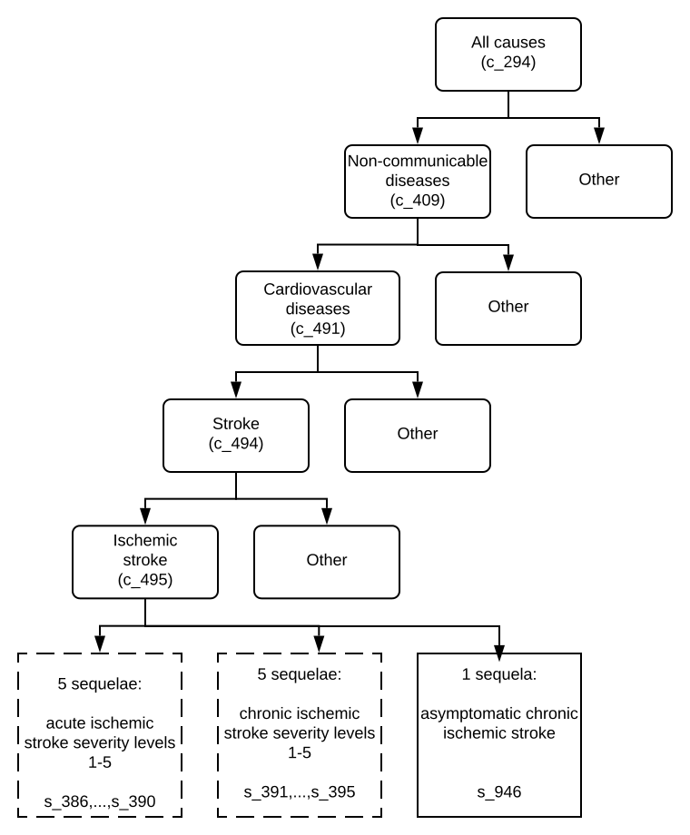

.. _2017_cause_ischemic_stroke:

===============
Ischemic Stroke
===============

Disease Description
-------------------

.. todo::

   Add more information and references. In particular, find data about global prevalence and relation to disease fatal and non-fatal description.

GBD 2017 Modeling Strategy
--------------------------

Strokes in GBD 2017
+++++++++++++++++++

Cause Hierarchy
++++++++++++++++

Restrictions
++++++++++++

The following table describes any restrictions in GBD 2017 on the effects of
this cause (such as being only fatal or only nonfatal), as well as restrictions
on the ages and sexes to which the cause applies.

.. list-table:: GBD 2017 Cause Restrictions
   :widths: 15 15 20
   :header-rows: 1

   * - Restriction Type
     - Value
     - Notes
   * - Male only
     - False
     -
   * - Female only
     - False
     -
   * - YLL only
     - False
     -
   * - YLD only
     - False
     -
   * - YLL age group start
     - Early Neonatal
     - [0, 7 days), age_group_id=2
   * - YLL age group end
     - 95 plus
     - [95, 125 years), age_group_id=235
   * - YLD age group start
     - Early Neonatal
     - [0, 7 days), age_group_id=2
   * - YLD age group end
     - 95 plus
     - [95, 125 years), age_group_id=235

.. todo::

   Describe more assumptions and limitations of the model.

Vivarium Modeling Strategy
--------------------------

Scope
+++++

Model Assumptions and Limitations
+++++++++++++++++++++++++++++++++

Cause Model Diagram
-------------------

According to GBD 2017, stroke cases are considered acute from the day of incidence of a first-ever stroke through day 28 following the event. Post, also known as chronic, stroke includes the sequelae of an acute stroke AND all recurrent stroke events. Stroke cases are considered post beginning 28 days following the occurrence of an event. Post stroke includes the sequelae of an acute stroke AND all recurrent stroke events.

.. image:: cause_model_is.svg

Data Description
----------------

State and Transition Data Tables
++++++++++++++++++++++++++++++++

.. list-table:: State Definitions
   :widths: 1, 5, 20
   :header-rows: 1

   * - State
     - State Name
     - Definition
   * - S
     - **S**\ usceptible to Ischemic Stroke
     - Simulant that has not already had an ischemic stroke event 
   * - A
     - **A**\ cute Ischemic Stroke
     - Simulant that is in duration-based period starting day of incidence of a first-ever stroke through day 28 following the event
   * - P
     - **P**\ ost Ischemic Stroke
     - Simulant that is in duration-based period beginning 28 days following the occurrence of a stroke event

.. todo::

   Discuss with the RT/SE team how to correctly assign ids into state data and transition equations, based on case definition of IS states.

.. list-table:: State Data
   :widths: 1, 5, 5, 10
   :header-rows: 1

   * - State
     - Measure
     - Value
     - Notes
   * - -
     - cause-specific mortality rate (csmr)
     - :math:`\frac{\text{deaths_c495}}{\text{population}}`
     -
   * - P
     - excess mortality rate (emr)
     - emr_m10837
     - 
   * - A
     - excess mortality rate (emr)
     - emr_m9310
     - 
   * - S
     - excess mortality rate (emr)
     - 0
     - This is not applicable
   * - P
     - disability weight
     - :math:`\displaystyle{\sum_{s\in \text{391}}}^{395} \scriptstyle{\text{disability_weight}_s \,\times\, \text{prevalence}_s}` + disability_weight_s946 :math:`\times` prevalence_s946
     - = average disability weight over all sequelae in the post ischemic stroke state
   * - A
     - disability weight
     - :math:`\displaystyle{\sum_{s\in \text{386}}}^{390} \scriptstyle{\text{disability_weight}_s \,\times\, \text{prevalence}_s}`
     - = average disability weight over all sequelae in the acute ischemic stroke state
   * - S
     - disability weight
     - 0
     - This is not applicable
   * - P
     - prevalence
     - prevalence_c495
     -
   * - A
     - prevalence
     - 0
     - This is not applicable
   * - S
     - prevalence
     - :math:`\displaystyle{1 - \text{ prev_c495}}`
     - = 1 - prevalence of ischemic stroke (population that has not already had ischemic stroke incidence)

.. list-table:: Transition Data
   :widths: 1, 1, 1, 5, 10
   :header-rows: 1

   * - Transition
     - Source State
     - Sink State
     - Value
     - Notes
   * - 1
     - S 
     - A 
     - incidence_c495
     - 
   * - 2
     - A 
     - P
     - 28 days 
     - duration-based transition from acute state then progress into post state
   * - 3
     - P
     - A 
     - incidence_c495
     - 

.. list-table:: Data Sources and Definitions
   :widths: 1, 3, 10, 10
   :header-rows: 1

   * - Value
     - Source
     - Description
     - Notes
   * - prevalence_c495
     - dismod-mr 2.1
     - Prevalence of ischemic stroke
     - 
   * - deaths_c495
     - codcorrect
     - Deaths from ischemic stroke
     -
   * - incidence_c495
     - dismod-mr 2.1
     - Incidence of ischemic stroke
     -
   * - population
     - demography
     - Mid-year population for given age/sex/year/location
     -
   * - sequelae_c495
     - gbd_mapping
     - List of 11 sequelae for ischemic stroke
     -
   * - prevalence_s{`sid`}
     - dismod-mr 2.1
     - Prevalence of sequela with id `sid`
     - 
   * - disability_weight_s{`sid`}
     - como
     - Disability weight of sequela with id `sid`
     -
   * - emr_m10837
     - dismod-mr 2.1
     - excess mortality rate of post ischemic stroke with CSMR
     -
   * - emr_m9310
     - dismod-mr 2.1
     - excess mortality rate of first ever acute ischemic stroke with CSMR
     - 
   * - disability_weight_s{sid}
     - YLD Appendix
     - Disability weight of sequela with id sid
     - 

Model Assumptions and Limitations
---------------------------------

Validation Criteria
-------------------

.. todo::

   Describe tests for model validation.

References
----------