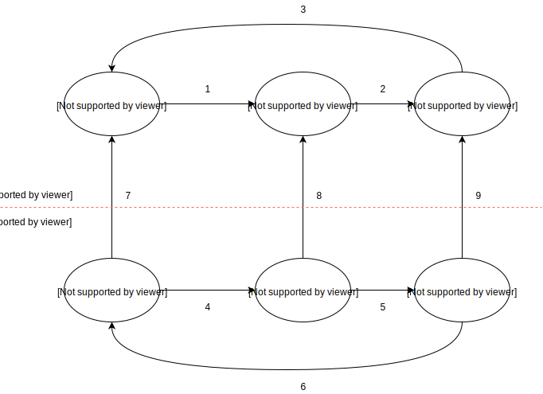

.. _2017_cause_latent_tb:

===================
Latent Tuberculosis
===================

.. list-table:: Abbreviations
   :widths: 5 10
   :header-rows: 1

   * - Label
     - Definition
   * - S
     - susceptible
   * - C
     - with condition
   * - TB
     - tuberculosis
   * - LTBI
     - latent tuberculosis infection
   * - AcTB
     - active tuberculosis
   * - DS-TB
     - Drug-susceptible TB
   * - MDR-TB
     - Multidrug-resistant TB
   * - XDR-TB
     - Extensively drug-resistant TB
   * - HIV
     - human immunodeficiency virus
   * - HIV+ DS-TB
     - HIV/AIDS - Drug-susceptible TB
   * - HIV+ MDR-TB
     - HIV/AIDS - Multidrug-resistant TB
   * - HIV+ XDR-TB
     - HIV/AIDS - Extensively drug-resistant TB
   * - prev
     - prevalence
   * - i
     - incidence
   * - csmr
     - cause-specific mortality rate
   * - emr
     - excess mortality rate
   * - dw
     - disability weight
   * - {measure}_{gbd_id_type}{gbd_id}
     - e.g. prev_c954 = prevalence of LTBI

Disease Overview
----------------

TB definitions
++++++++++++++
Tuberculosis (TB) is a disease caused by the bacteria Mycobacterium 
tuberculosis. It most commonly affects the lungs, although it can affect 
other parts of the body. TB can be fatal if not recognized and treated. 
It also can spread from person to person to infect others. Anyone who 
inhales the airborne droplets that contains TB bacteria is called a "contact". 
A contact can be someone who living with the person who has active TB, 
like a family member, friend, or coworker. [UpToDate]_

What is latent TB?
++++++++++++++++++
Latent tuberculosis infection (LTBI) is defined as a state of persistent 
immune response to stimulation by Mycobacterium tuberculosis antigens with 
no evidence of clinically manifested active TB. [WHO]_

What is active TB?
++++++++++++++++++
Active tuberculosis, also known as reactivation TB. It occurs when individual's 
immune system becomes weakened and is no longer able to contain the latent 
bacteria; then the TB bacteria become "active", overwhelm the immune system and 
cause a person to become ill. [UpToDate]_ In GBD, active TB consists of 6 child 
causes: Drug-susceptible TB, Multidrug-resistant TB, Extensively drug-resistant 
TB, HIV/AIDS - Drug-susceptible TB, HIV/AIDS - Multidrug-resistant TB, and 
HIV/AIDS - Extensively drug-resistant TB.

TB progression
++++++++++++++
Active TB disease developed within 2 years is called rapid progression. Individuals 
who do not have rapid progression are classified as having slow-progressing latent 
tuberculosis infection. With latent infection, individuals experience no adverse 
health effects and will not transmit Mycobacterium tuberculosis, but they face 
an ongoing risk of developing active tuberculosis through reactivation.

GBD 2017 Modeling Strategy
--------------------------
First, GBD estimated risk-weighted (a set collection of risks defined by GBD) 
prevalence of LTBI by demographic characteristics using data from population-based 
tuberculin surveys and cohort studies reporting the risk of developing active TB 
disease as a function of induration size. Next, they divided the inputs on 
prevalence, incidence, and cause-specific mortality rate (CSMR) by the risk-weighted 
LTBI prevalence in order to model TB among at risk populatoin. GBD ran a mixed 
effects regression (with region random effects) using logit transformed 
mortality-to-incidence (MI) ratios from locations with a 4-star or above rating 
(countries with poor surveillance systems are classified as less than 4 stars) 
on causes of death with HAQI as a covariate anchoring the lower bound of the 
HAQI scale with a data point reported in the Bangalore study to predict age-sex 
specific MI ratios for all locations and years. Then the age-sex-specific 
incidence were estimated based on those predicted MI ratios. GBD used DisMod-MR 
2.1 (Bayesian meta-regression tool) to generate consistent trends in all parameters, 
and multiplied the outputs by the risk-weighted prevalence of LTBI to get 
population-level estimates of incidence and prevalence. GBD disaggregated the 
all-form TB outputs from DisMod-MR 2.1 into MDR-TB and XDR-TB by HIV status. 
To do so, they estimated the proportions of TB cases with MDR-TB for all locations 
and years, and then estimated the proportions of MDR-TB among HIV-negative and 
HIV-positive individuals based on the risk of MDR-TB associated with HIV infection 
from a meta-analysis. To split MDR-TB into MDR-TB with and without extensive drug 
resistance, GBD pooled the notification and survey data on the proportion of 
MDR-TB cases with extensive drug resistance by super-region, and applied these 
proportions to MDR-TB cases among HIV-negative and HIV-positive individuals, 
respectively. [GBD-2017-YLD-Capstone-Appendix-1]_

Cause hierarchy
+++++++++++++++

.. image:: cause_hierarchy.svg

- {Anemia} = [no_anemia, mild_anemia, moderate_anemia, severe_anemia]
- {HIV/AIDS} = [early_hiv, symptomatic_hiv, hiv_aids_with_art, aids]
The causes in the GBD at any level of hierarchy are mutually exclusive 
and collectively exhaustive. 

Restrictions
++++++++++++
The following table describes any restrictions in GBD 2017 on the effects of 
tuberculosis.

.. list-table:: GBD 2017 Cause Restrictions
   :header-rows: 1

   * - Restriction Type
     - Value
     - Notes
   * - Male only
     - False
     -
   * - Female only
     - False
     -
   * - YLL only
     - False
     -
   * - YLD only
     - False
     -
   * - YLL age group start
     - age_group_id = 4
     - Post neonatal
   * - YLL age group end
     - age_group_id = 235
     - 95+ years
   * - YLD age group start
     - age_group_id = 2
     - Early neonatal
   * - YLD age group end
     - age_group_id = 235
     - 95+ years

Vivarium Modeling Strategy
--------------------------
Our TB model includes both tuberculosis and HIV/AIDS. We combine TB and HIV 
together because HIV has impacts on both progression rate of LTBI to active TB 
and active TB excess mortality rate. Note that we have excluded the active TB 
drug resistance and GBD predicted the proportion of new TB cases with MDR-TB or 
XDR-TB by ST-GPR. In this joint model, each simulant occupies a state at each 
discrete time step. It is convenient to distinguish two sub-state types: a healthy 
(susceptible) state and a disease (with condition) state. Many simulants began 
the simulation in a susceptible state with, for example, no TB and remain in the 
susceptible state until they contract LTBI, progress to active TB, or die due to 
TB or other causes. Each state is mutually exclusive (e.g. a simulant can be 
susceptible or be a prevalent case of TB, but not both). However, a simulant may 
have TB and still be susceptible to HIV or vice versa. Prevalence is the measure 
that describes the proportion of individuals with disease in the total population 
during the given simulation time step. The prevalence of a disease state determines 
what proportion of the population will occupy that disease state during each time 
step. Each disease state has transition attributes defining the simulant transitions 
into and out of the state. We calculate transition probabilities from rates 
estimated in the GBD study and external data sources as required. In addition, 
it is worth noting that this model for CSU contracted project is not a dynamic 
transmission model. We will not model infection passing between specific individuals 
in the simulation, although the model is individual-based. In other words, individuals 
in the simulation will, for example, move from uninfected to infected states, but 
the model will not specify that individual X infected individual Y. As described 
above, the model will be calibrated in aggregated level, the outputs from 
simulation baseline scenario should match the population level rates estimated 
in the GBD.

Cause model diagram
+++++++++++++++++++

State and transition data tables
++++++++++++++++++++++++++++++++

.. list-table:: States Definition
   :widths: 5 10
   :header-rows: 1

   * - State
     - Definition
   * - S_TB, S_HIV
     - Susceptible to TB or HIV infection
   * - LTBI, S_HIV
     - Latent TB infected, but not HIV infected
   * - AcTB, S_HIV
     - HIV negative active TB, which contains DS-TB, MDR-TB, and XDR-TB
   * - S_TB, C_HIV
     - HIV infected, but not (latent) TB infected
   * - LTBI, C_HIV
     - Latent TB infected, and HIV infected
   * - AcTB, C_HIV
     - HIV positive active TB, which contains HIV+ DS-TB, HIV+ MDR-TB, and HIV+ XDR-TB

.. list-table:: States Data
   :widths: 5 5 15 15
   :header-rows: 1

   * - State
     - Measure
     - Value
     - Notes
   * - S_TB, S_HIV
     - prevalence
     - 1 - everything (sum of all other states prev)
     - confirm everything = (prev_c297 + prev_c298) - prev_c954 * prev_c300
   * - S_TB, S_HIV
     - excess mortality rate
     - 0
     - 
   * - S_TB, S_HIV
     - disability weight
     - 0
     - 
   * - LTBI, S_HIV
     - prevalence
     - prev_c954 * (1 - prev_c300)
     - 
   * - LTBI, S_HIV
     - excess mortality rate
     - 0
     - 
   * - LTBI, S_HIV
     - disability weight
     - 0
     - 
   * - AcTB, S_HIV
     - prevalence
     - prev_c934 + prev_c946 + prev_c947
     - 
   * - AcTB, S_HIV
     - excess mortality rate
     - :math:`\frac{\text{csmr_c934} \,+\, \text{csmr_c946} \,+\,
       \text{csmr_c947}}{\text{prev_c934} \,+\, \text{prev_c946} \,+\,
       \text{prev_c947}}`
     - confirm csmr_c954 = 0, csmr_c297 = csmr_c934 + csmr_c946 + csmr_c947
   * - AcTB, S_HIV
     - disability weight
     - :math:`\frac{\displaystyle{\sum_{s\in\text{sequelae_c934, sequelae_c946,
       sequelae_c947}}} \text{dw_s} \,\times\, \text{prev_s}}{\displaystyle
       {\sum_{s\in\text{sequelae_c934, sequelae_c946, sequelae_c947}}}
       \text{prev_s}}`
     - sequelae_c934, sequelae_c946, sequelae_c947; each of them has a list of
       4 sequelaes. dw_c934, dw_c946, dw_c947; expect to match 0.333 [0.224, 0.454].
   * - S_TB, C_HIV
     - prevalence
     - (1 - prev_c954) * prev_c300
     - 
   * - S_TB, C_HIV
     - excess mortality rate
     - :math:`\text{emr_c300} = \frac{\text{csmr_c300}}{\text{prev_c300}}`
     -
   * - S_TB, C_HIV
     - disability weight
     - :math:`\frac{\displaystyle{\sum_{s\in\text{sequelae_c300}}} \text{dw_s}
       \,\times\, \text{prev_s}}{\displaystyle{\sum_{s\in\text{sequelae_c300}}}
       \text{prev_s}}`
     - sequelae_c300 has a list of 16 sequelaes
   * - LTBI, C_HIV
     - prevalence
     - prev_c954 * prev_c300
     - 
   * - LTBI, C_HIV
     - excess mortality rate
     - :math:`\text{emr_c300} = \frac{\text{csmr_c300}}{\text{prev_c300}}`
     -
   * - LTBI, C_HIV
     - disability weight
     - :math:`\frac{\displaystyle{\sum_{s\in\text{sequelae_c300}}} \text{dw_s}
       \,\times\, \text{prev_s}}{\displaystyle{\sum_{s\in\text{sequelae_c300}}}
       \text{prev_s}}`
     - sequelae_c300 has a list of 16 sequelaes
   * - AcTB, C_HIV
     - prevalence
     - prev_c948 + prev_c949 + prev_c950
     - 
   * - AcTB, C_HIV
     - excess mortality rate
     - :math:`\frac{\text{csmr_c948} \,+\, \text{csmr_c949} \,+\,
       \text{csmr_c950}}{\text{prev_c948} \,+\, \text{prev_c949} \,+\,
       \text{prev_c950}}`
     - 
   * - AcTB, C_HIV
     - disability weight
     - :math:`\frac{\displaystyle{\sum_{s\in\text{sequelae_c948, sequelae_c949,
       sequelae_c950}}} \text{dw_s} \,\times\, \text{prev_s}}{\displaystyle
       {\sum_{s\in\text{sequelae_c948, sequelae_c949, sequelae_c950}}}
       \text{prev_s}}`
     - sequelae_c948, sequelae_c949, sequelae_c950; each of them has a list of
       4 sequelaes. dw_c948, dw_c949, dw_c950; expect to match 0.408 [0.274, 0.549].

.. list-table:: Transition Data
   :widths: 1 5 5 10 10
   :header-rows: 1

   * - Label
     - Source State
     - Sink State
     - Value
     - Notes
   * - 1
     - S_TB, C_HIV
     - LTBI, C_HIV
     - LTBI incidence (i_c954)
     - calculated by dismod_mr 1.1.0
   * - 2
     - LTBI, C_HIV
     - AcTB, C_HIV
     - :math:`\frac{\text{i_c948} \,+\, \text{i_c949} \,+\,
       \text{i_c950}}{\text{prev_c954} \,\times\, \text{prev_c300}}`
     - 
   * - 3
     - AcTB, C_HIV
     - S_TB, C_HIV
     - All-form TB remission
     - dismod id 9422 stand-in
   * - 4
     - S_TB, S_HIV
     - LTBI, S_HIV
     - LTBI incidence (i_c954)
     - calculated by dismod_mr 1.1.0
   * - 5
     - LTBI, S_HIV
     - AcTB, S_HIV
     - :math:`\frac{\text{i_c934} \,+\, \text{i_c946} \,+\,
       \text{i_c947}}{\text{prev_c954} \,\times\, (1 \,-\, \text{prev_c300})}`
     -
   * - 6
     - AcTB, S_HIV
     - S_TB, S_HIV
     - All-form TB remission
     - dismod id 9422 stand-in
   * - 7
     - S_TB, S_HIV
     - S_TB, C_HIV
     - i_c300
     - 
   * - 8
     - LTBI, S_HIV
     - LTBI, C_HIV
     - i_c300
     -
   * - 9
     - AcTB, S_HIV
     - AcTB, C_HIV
     - i_c300
     -

.. list-table:: Data Sources
   :widths: 5 10 5
   :header-rows: 1
   
   * - Measure
     - Sources
     - Notes
   * - Prevalence
     - como
     - 
   * - Incidence
     - como
     - 
   * - Cause-specific mortality rate
     - codcorrect
     -
   * - Disability weight
     - [GBD-2017-YLD-Capstone-Appendix-1]_
     -

Modeling strategy for non-standard data sources
+++++++++++++++++++++++++++++++++++++++++++++++
LTBI incidence
 - We ran DisMod-MR 1.1.0 and used LTBI prevalence, excess mortality rate 
   (equivalent to AcTB incidence / LTBI prevalence), remission (assume zero), 
   and all-cause mortality rate as inputs to back calculate the LTBI incidence 
   data that are not exist in GBD. Then we load the location-/age-/sex-/year-/draw- 
   specific LTBI incidence estimates into the artifact. (Note that the age range 
   for estimated LTBI incidence is 0 to 100 and age interval equal to one.)
TB remission
 - The current model applied all-form active TB remission (dismod_id=9422)
   to inform the transition flow from HIV-positive active TB and HIV-negative
   active TB back to susceptible. The future plan is to disaggregate the all-form
   active TB remission by HIV status based on TB duration data.
   [Global-TB-Burden-2018]_ (Table 1, pp. 26)

Validation criteria
+++++++++++++++++++

Objective
~~~~~~~~~
External
 - Model results should be checked against local TB epidemiology
    - e.g. rate of decline in burden of disease should be compared
      with historical evidence.
 - Compare our results (e.g., Deaths) to similar models or empirical
   assessments where possible
Internal
 - Test hypotheses without develop a full simulation. (e.g., nano simulation)
 - Calibrate simulation baseline against GBD 2017 results
    - Sim outputs mean should perfectly match GBD results.
    - Sim outputs uncertainty should be wider than GBD results,
      because both stochastic and parametric uncertainty are included.

V&V strategy
~~~~~~~~~~~~
Model validation
 - Check the logical structure and input data for cause model,
   make sure
    - the theories and assumptions underlying the cause model are correct.
    - the data to build, evaluate, and test model are correct.
Model verification
 - Check the translation from cause model document to Vivarium scripts,
   make sure
    - the computer programming and implementation of the cause model is correct.
    - the output of the model can be calibrated against GBD results.

GBD post-processing steps
~~~~~~~~~~~~~~~~~~~~~~~~~
GBD starts from All-form TB results, then they stratify the results by following 
the steps described below:
    1. Find proportion of HIV+ cases among all TB cases
    2. Disaggregate all TB cases into HIV+ TB and HIV- TB
    3. Find proportion of drug-resistant cases among HIV+ TB cases
       and HIV- TB cases
    4. Breakdown those cases into:
        - drug-susceptible TB, multidrug-resistant TB, and extensively
          drug-resistant TB
        - HIV+ drug-susceptible TB, HIV+ multidrug-resistant TB,
          and HIV+ extensively drug-resistant TB

Formula
~~~~~~~
For certain location-/age-/sex-
    - Deaths due to all causes equal to sum of:
        - Deaths due to all-form TB (aggregate all child active TB causes)
        - Deaths due to HIV resulting in other diseases
        - Deaths due to other causes
Apply the formula to other measures (e.g., DALYs)

Steps of model verification
~~~~~~~~~~~~~~~~~~~~~~~~~~~
1. Set hypothesis
    - The sum of the prevalences of all model states should equal
      to the GBD TB prevalence plus HIV prevalence. (Pre_297 + Prev_298
      = Sum(Prev_state))
    - The sum of the cause-specific mortality of all model states
      should equal to the GBD TB CSMR plus HIV CSMR. (CSMR_297 + 
      CSMR_298 = Sum(Prev_state * ExcessMR_state))
    - The prevalence weighted sum of the disability weight of all model states
      should equal to the GBD TB YLDs plus HIV YLDs. (ylds_297 + ylds_298 
      = Sum(Prev_state * dw_state))
2. Check for proposed hypothesis (e.g. prevalence for the whole model)
    - **Data:** Once the model input data is produced and put in the artifact,
      produce a graph of the sum of the input data prevalences and compare
      it to the GBD data not in the model.
    - **Sim initialization:** Initialize a simulation using the model input data
      and count the disease event to make sure it matches with GBD data 
      not in the model.
    - **Historical calibration:** Run a simulation from 2012 to 2017 and count
      the disease event at the end of the sim to make sure it matches with
      GBD data not in the model.
    - **Baseline verification:** Run a simulation from 2020 to 2025 and count
      the disease event at the end of the sim to make sure the baseline
      model outcomes match with GBD 2017 results.

Measure types in verification
~~~~~~~~~~~~~~~~~~~~~~~~~~~~~
Constrained verification
 - Compare (disease preson time / total person time) to prevalence in GBD
 - Compare (disease counts / person time) to incidence in GBD
Unconstrained verification
 - CSMR
 - YLLs
 - YLDs

Back-envelope calculation for concept model
~~~~~~~~~~~~~~~~~~~~~~~~~~~~~~~~~~~~~~~~~~~
We can roughly calculate the expected value of averted active TB Deaths (or DALYs) 
by TB preventive therapy (TPT) if given following values:
 - X: deaths due to active TB in certain location and year
 - Y: percent reduction in active TB incidence if received and adherent to TPT (TPT per-protocol efficacy)
 - Z: change in TPT coverage between baseline and alternative scenarios
Then, active TB deaths averted = X * Y * Z

References
----------
.. [UpToDate] Tuberculosis (Beyond the Basics).
   Retrieved Dec 23, 2019.
   https://www.uptodate.com/contents/tuberculosis-beyond-the-basics

.. [WHO] Latent tuberculosis infection (LTBI).
   Retrieved Dec 23, 2019.
   https://www.who.int/tb/areas-of-work/preventive-care/ltbi_faqs/en/

.. [GBD-2017-YLD-Capstone-Appendix-1] Supplementary Appendix 1:
   James SL, Abate D, Abate KH, et al. Global, regional, and national
   incidence, prevalence, and years lived with disability for 354 diseases and injuries for 195 countries and territories, 1990–2017: a systematic analysis
   for the Global Burden of Disease Study 2017. The Lancet 2018; 392: 1789–858.
   (pp. 65-74)
   https://www.thelancet.com/cms/10.1016/S0140-6736(18)32279-7/attachment/6db5ab28-cdf3-4009-b10f-b87f9bbdf8a9/mmc1.pdf

.. [Global-TB-Burden-2018] Methods used by WHO to estimate the global burden of TB disease
   https://www.who.int/tb/publications/global_report/gtbr2018_online_technical_appendix_global_disease_burden_estimation.pdf
