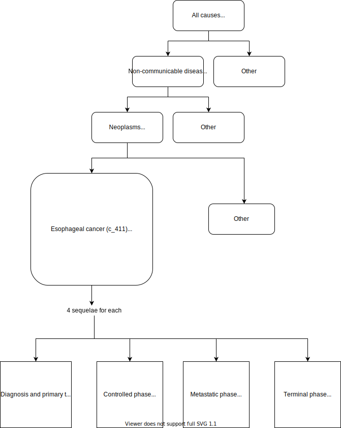

.. _2017_cancer_model_cancers:

=======
Cancers
=======

This is a common document for the cancers that are modelled similarly in GBD. This document currently has information related to the following cancers:

- Tracheal, bronchus and lung cancer 
- Cervical cancer 
- Stomach Cancer
- Kidney cancer 
- Gallbladder and biliary tract cancer 
- Esophageal cancer 
- Pancreatic cancer 
- Thyroid cancer 
- Non-hodgkin lymphoma 
- Multiple myeloma 
- Other pharynx cancer 
- Nasopharynx cancer 
- Lip and oral cavity cancer 
- Ovarian cancer
- Uterine cancer

Any of the other cancers that have similar modelling strategy can be added to this list.

Disease Overview
----------------

.. todo::

   Add individual definitions of each cancer. In particular, find data about global prevalence and disease fatal and non fatal description.

GBD 2017 Modeling Strategy
--------------------------

Cancers in GBD 2017
+++++++++++++++++++

GBD 2017 uses similar modeling strategies to estimate the prevalence and
resulting disability of these categories of cancers [GBD-2017-YLD-Capstone-Appendix-1-Neoplasms]_.

Incidence is estimated directly from mortality using mortality to incidence ratios (MIR).

Prevalence for all these cancers are estimated for a maximum of ten years. To estimate the disability, total prevalence 
for each cancer is split into

1. Diagnosis and primary therapy
2. Controlled phase
3. Metastatic phase
4. Terminal phase

.. todo::

   Add more details about cancer modeling in GBD 2017.

Cause Hierarchy
++++++++++++++++

The following table helps to identify cause id and associated sequelae ids for each cancer.

.. list-table:: Ids of causes and associated  sequelae
   :widths: 10, 5, 10 
   :header-rows: 1
   
   * - Cancer
     - Cause Id
     - Sequelae Ids
   * - Esophageal cancer 
     - c_411
     - s_244, s_245, s_246, s_247
   * - Stomach cancer
     - c_414
     - s_248, s_249, s_250, s_251
   * - Tracheal, bronchus and lung cancer 
     - c_426
     - s_273, s_274, s_275, s_280
   * - Cervical cancer 
     - c_432
     - s_282, s_283, s_284, s_285
   * - Uterine cancer 
     - c_435
     - s_286, s_287, s_288, s_289
   * - Lip and oral cavity cancer 
     - c_444
     - s_301, s_302, s_303, s_304
   * - Nasopharynx cancer 
     - c_447
     - s_305, s_306, s_307, s_308
   * - Other pharynx cancer 
     - c_450
     - s_309, s_310, s_311, s_312
   * - Gallbladder and biliary tract cancer 
     - c_453
     - s_313, s_314, s_315, s_316
   * - Pancreatic cancer 
     - c_456
     - s_317, s_318, s_319, s_320
   * - Ovarian cancer 
     - c_465
     - s_329, s_330, s_331, s_332
   * - Kidney cancer 
     - c_471
     - s_337, s_338, s_339, s_340
   * - Thyroid cancer 
     - c_480
     - s_350, s_351, s_352, s_353
   * - Non-hodgkin lymphoma 
     - c_485
     - s_362, s_363, s_364, s_365
   * - Multiple myeloma 
     - c_486
     - s_366, s_367, s_368, s_369

Restrictions
++++++++++++

.. todo::

   Add restrictions table.

Vivarium Modeling Strategy
--------------------------

Scope
+++++

.. todo::

   Add scope.

Assumptions and Limitations
+++++++++++++++++++++++++++

1. Within GBD 2017, after diagnosis/ treatment if a patient survives more than 10 years, they are considered cured for calculating disability. 
For simulation models, this means that if the simulation is run for more than 10 years, then excess mortality rate exists due to cancer after 
10 years and the number of deaths increase. But as per GBD 2017, after 10 years, the patients do not have excess mortality rate. So, this model 
might over estimate deaths in that scenario.

.. todo::

   Add more assumptions and limitations.

Cause Model Diagram
+++++++++++++++++++

Within GBD 2017 data, the remission rate is not available which makes it difficult to transition through the states. 
So, due to data limitations we are simplifying the model.
 
Note: This simpliflication might over estimate the number of deaths. See Model Assumptions and Limitations section for more information.

.. image:: cancer_cause_model.svg

State and Transition Data Tables
++++++++++++++++++++++++++++++++

.. list-table:: Definitions
   :widths: 15 20 30
   :header-rows: 1

   * - State
     - State Name
     - Definition
   * - S
     - Susceptible
     - Susceptible to cancer
   * - I
     - Infected
     - Infected with cancer

.. list-table:: States Data
   :widths: 20 25 30 30
   :header-rows: 1
   
   * - State
     - Measure
     - Value
     - Notes
   * - S
     - prevalence
     - 1-prevalence_c{cid}
     - {cid} represents each cancer in the list of cancers modelled in this document 
   * - S
     - excess mortality rate
     - 0
     - 
   * - S
     - disabilty weights
     - 0
     -
   * - I
     - prevalence
     - prevalence_c{cid}
     - 
   * - I
     - excess mortality rate
     - :math:`\frac{\text{deaths_c{cid}}}{\text{population} \times \text{prevalence_c{cid}}}`
     - 
   * - I
     - disability weights
     - :math:`\displaystyle{\sum_{s\in \text{sequelae_c{cid}}}} \scriptstyle{\text{disability_weight}_s \,\times\, \text{prevalence}_s}`
     - average disability weight over all sequelae corresponding to the cancer
   * - ALL
     - cause specific mortality rate
     - :math:`\frac{\text{deaths_c{cid}}}{\text{population}}`
     - 

.. list-table:: Transition Data
   :widths: 10 10 10 30 30
   :header-rows: 1
   
   * - Transition
     - Source 
     - Sink 
     - Value
     - Notes
   * - i
     - S
     - I
     - :math:`\frac{\text{incidence_rate_c{cid}}}{\text{1 - prevalence_c{cid}}}`
     - Incidence rate in total population is divided by 1-prevalence_c{cid} to get incidence rate among the recovered and susceptible population.

.. list-table:: Data Sources
   :widths: 20 25 25 25
   :header-rows: 1
   
   * - Measure
     - Sources
     - Description
     - Notes
   * - prevalence_c{cid}
     - como
     - Prevalence of cause {cancer}
     - {cancer} represents each cancer in the list of cancers modelled in this document
   * - deaths_c{cid}
     - codcorrect
     - Deaths from {cancer}
     - 
   * - population
     - demography
     - Mid-year population for given country
     - 
   * - incidence_rate_c{cid}
     - como
     - Incidence rate for {cancer}
     - 
   * - disability_weight_s{`sid`}
     - YLD appendix
     - Disability weights associated with each sequelae
     - 
   * - prevalence_s{`sid`}
     - como
     - Prevalence of each sequelae
     - 

Model Assumptions and Limitations
+++++++++++++++++++++++++++++++++

.. todo::

   Add model assumptions and limitations.

Validation Criteria
+++++++++++++++++++

.. todo::

   Describe tests for model validation.

References
----------

.. [GBD-2017-YLD-Capstone-Appendix-1-Neoplasms]
   Supplement to: `GBD 2017 Disease and Injury Incidence and Prevalence
   Collaborators. Global, regional, and national incidence, prevalence, and
   years lived with disability for 354 diseases and injuries for 195 countries
   and territories, 1990–2017: a systematic analysis for the Global Burden of
   Disease Study 2017. Lancet 2018; 392: 1789–858`
   (pp. 310-317)
