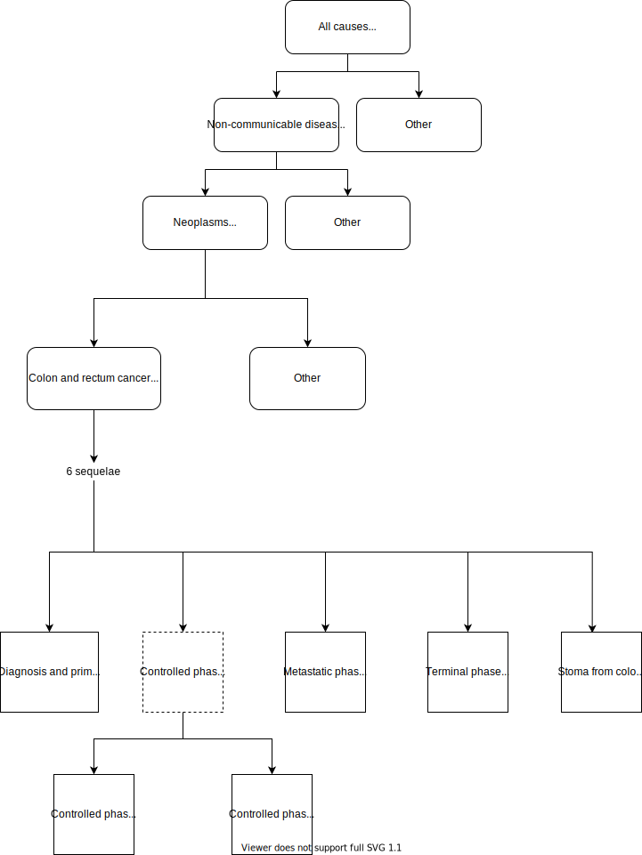

.. _2017_cancer_model_colon_and_rectum_cancer:

=======================
Colon and Rectum Cancer
=======================

Disease Overview
----------------

.. todo::

   Add definition of colon and rectum cancer. In particular, find data about global prevalence and disease fatal and non fatal description.

GBD 2017 Modeling Strategy
--------------------------

Colon and rectum cancer in GBD 2017
+++++++++++++++++++++++++++++++++++

The GBD modelling strategy can be found in the GBD YLD Capstone Appendix [GBD-2017-YLD-Capstone-Appendix-1-Colon-and-rectum-Cancer]_.

Incidence is estimated directly from mortality using mortality to incidence ratios (MIR).

Because of long-term disability associated with stoma, prevalence for colon and rectum cancer is estimated beyond ten years. To estimate the disability, 
total prevalence for colon and rectum cancer is split into

#. Diagnosis and primary therapy
#. Controlled phase

   #. Controlled phase of colon and rectum cancer, with stoma
   #. Controlled phase of colon and rectum cancer, without stoma
#. Metastatic phase
#. Terminal phase
#. Stoma from colon and rectum cancer, beyond 10 years

.. todo::

   Add more details about GBD modelling strategy of Colon and rectum cancer.

Cause Hierarchy
++++++++++++++++

Restrictions
++++++++++++

.. todo::

   Add restrictions table.

Vivarium Modeling Strategy
--------------------------

Scope
+++++

.. todo::

   Add scope.

Model Assumptions and Limitations
+++++++++++++++++++++++++++++++++

1. Within GBD 2017, after diagnosis/ treatment if a patient survives more than 10 years, they are considered cured for calculating disability. 
For simulation models, this means that if the simulation is run for more than 10 years, then excess mortality rate exists due to cancer after 
10 years and the number of deaths increase. But as per GBD 2017, after 10 years, the patients do not have excess mortality rate. So, this model 
might over estimate deaths in that scenario.

.. todo::

   Add more assumptions and limitations.

Cause Model Diagram
+++++++++++++++++++

Within GBD 2017 data, the remission rate is not available which makes it difficult to transition through the states. So, due to data limitations we are simplifying the model.
 
Note: This simpliflication might over estimate the number of deaths. See Model Assumptions and Limitations section for more information.

.. image:: cancer_cause_model.svg

State and Transition Data Tables
++++++++++++++++++++++++++++++++

.. todo::

   Add state and transitions  data tables.

Validation Criteria
+++++++++++++++++++

.. todo::

   Describe tests for model validation.

References
----------

.. [GBD-2017-YLD-Capstone-Appendix-1-Colon-and-rectum-Cancer]
   Supplement to: `GBD 2017 Disease and Injury Incidence and Prevalence
   Collaborators. Global, regional, and national incidence, prevalence, and
   years lived with disability for 354 diseases and injuries for 195 countries
   and territories, 1990–2017: a systematic analysis for the Global Burden of
   Disease Study 2017. Lancet 2018; 392: 1789–858`
   (pp. 310-317)
