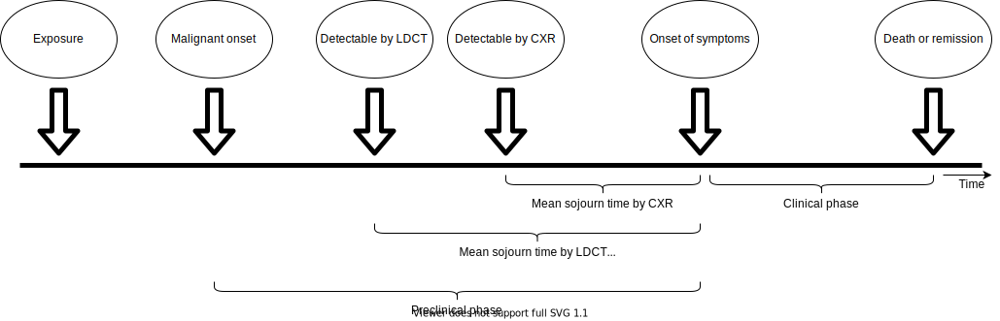
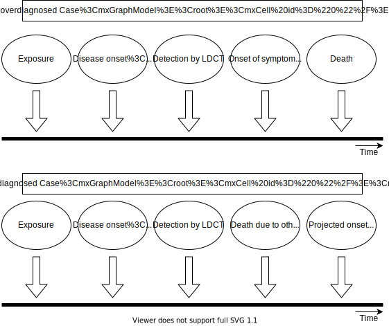

.. _2017_lung_cancer:

===================================
Tracheal, Bronchus, and Lung Cancer
===================================

.. contents::
   :local:
   :depth: 1

.. list-table:: Abbreviations
   :widths: 15 15 15
   :header-rows: 1

   * - Abbreviation
     - Definition
     - Note
   * - TBL
     - Tracheal, bronchus, and lung
     - 
   * - MST
     - Mean sojourn time
     - Time between screen-detectable and symptom onset
   * - ODF
     - Overdiagnosis factor
     - Increase in lung cancer incidence attributable to screening program
   * - AST
     - Average survival time
     - 
   * - LDCT
     - Low-dose computed tomography
     - Lung cancer screening
   * - CXR
     - Chest x-ray
     - Lung cancer screening
   * - ACMR
     - All-cause mortality rate
     - 
   * - CSMR
     - Cause-specific mortality rate
     -
   * - EMR
     - Excess mortality rate
     - 

Disease Overview
----------------

The trachea, commonly referred to as the windpipe, is part of the lower respiratory tract that connects the larynx (lower portion of the upper respiratory tract) to the primary bronchi, which biforcate from the trachea and lead to each lung. Most cases of tracheal and bronchus cancer are secondary to primary cancer in other sites; however, primary cancers can occur in these sites as well [Sherani-et-al-2015]_, [Javidan-Nejad-2010]_. Notably, tracheal cancer makes up only a small portion of tracheal, bronchus, and lung cancers [Sherani-et-al-2015]_, [Javidan-Nejad-2010]_. 

Lung cancer screening and diagnosis is performed via low-dose computed topography (LDCT), which provides an image of the chest. Screening guidelines typically depend on age, smoking history, and current health status. Bronchus and tracheal cancer diagnoses are performed using LDCT as well as bronchioscopy (or a scope of the respiratory tract) [Sherani-et-al-2015]_, [Javidan-Nejad-2010]_. 

Risk factors for lung cancer include genetic and environmental factors, notably tobacco smoke and air pollution. Despite advances in TCL cancer early detection and therapy options, its burden is still increasing due to an aging popuation and risk factors such as smoking history [Deng-et-al-2020]_.

GBD 2017 Modeling Strategy
--------------------------

The following information was obtained from the GBD 2017 fatal and non-fatal methods appendices [GBD-2017-YLD-Appendix-TBL-cancer]_, [GBD-2017-CoD-Appendix-TBL-cancer]_.

Tracheal, bronchus, and lung (TBL) cancers are modeled together as a single cause in GBD. These cancers are not differentiated in the input data for the GBD model and are not crosswalked for alternative cause definitions. 

As with the majority of neoplasm causes in GBD, a remission rate for TBL cancer is not explicitly modeled. Rather, there is no morbidity modeled for TBL cancer after 10 years. As such, prevalence for TBL cancer extends for no more than 10 years after incidence.

.. note::

  According to the GBD lung cancer modeler, this assumption is generally appropriate for TBL cancer because it is fairly lethal cancer, although investigation into the long term survival rates of TBL cancer using SEER data could provide a more in-depth analysis of the limitations of this assumption.

Total prevalence of TBL cancer is split into four sequelae: 

#. Diagnosis and primary therapy: onset of symptoms through the end of treatment; assumed 3.3 month duration for TBL cancer. Disability weight of 0.288 (0.193, 0.399).
#. Controlled phase: time between end of primary treatment and cure, death, or progression to metastatic phase; duration calculated based on remainder of time after attributing other sequelae. Disability weight of 0.049 (0.031, 0.072).
#. Metastatic phase: time period of intensive treatment for metastatic disease; assumed 4.51 month duration for TBL cancer. Disability weight of 0.451 (0.307, 0.600).
#. Terminal phase: one-month period prior to death. Disability weight of 0.540 (0.377, 0.687).

.. note:: 
  
  The disability weights for these sequelae phases are the same across all GBD neoplasms (excluding specific cancers with additional sequelae).

GBD neoplasm models rely on mortality incidence ratios (MIRs), which are estimated in a separate modeling process. According to the GBD modeler, MIRs should be retrieved from the GBD cancer modeler and not calculated from GBD estimates of location-specific incidence and moratlity rates. The fatal estimates are modeled first and then the MIRs are used to model the incidence estimates.

.. note::

  The GBD modeler mentioned that for specific locations, the input data may be primarily cancer incidence registries, although it is possible that the GBD incidence estimates may not align with the incidence input data due to this modeling process.

Covariates used in the fatal TBL cancer model for GBD 2017 included:

  Level 1: alcohol (liters per capita), cumulative cigarettes (5, 10, 15, and 20 years), smoking prevalence, tobacco (cigarettes per capita), secondhand smoke, log-transformed SEV scalar: lung C, log-transformed age-standardized SEV scalara: Lung C

  Level 2: indoor air pollution (all cooking fuels), outdoor air pollution (PM2.5), residential radon, diabetes fasting plasma glucose (mmol/L) 

  Level 3: Education (years per capita), LDI ($ per capita), socio-demographic index

.. list-table:: Tracheal, Bronchus, and Lung Cancer ICD Codes used for GBD 2017
   :widths: 15 15
   :header-rows: 1

   * - ICD 10
     - ICD 9
   * - C33-C34.9, D02.1-D02.3, D14.2-D14.3, D38.1
     - 162-162.9, 212.2-212.3, 231.1-231.2, 235.7

.. todo::

	What moment of cancer progression does GBD intend to model as incidence? Cancer onset or symptom onset? What are the limitations of this? Most likely symptom onset/diagnosis.

	How can we integrate the 10 year GBD assumption into our vivarium strategy while also accounting for pre-symptomatic incidence?

Cause Hierarchy
+++++++++++++++

.. image:: lung_cancer_hierarchy.svg

Restrictions
++++++++++++

The following table describes any restrictions in GBD 2017 on the effects of
this cause (such as being only fatal or only nonfatal), as well as restrictions
on the ages and sexes to which the cause applies.

.. list-table:: GBD 2017 Cause Restrictions
   :widths: 15 15 20
   :header-rows: 1

   * - Restriction Type
     - Value
     - Notes
   * - Male only
     - False
     -
   * - Female only
     - False
     -
   * - YLL only
     - False
     -
   * - YLD only
     - False
     -
   * - YLL age group start
     - age_group_id = 8
     - 15-19 years
   * - YLL age group end
     - age_group_id = 235
     - 95+ years
   * - YLD age group start
     - age_group_id = 8
     - 15-19 years
   * - YLD age group end
     - age_group_id = 235
     - 95+ years

Vivarium Modeling Strategy
--------------------------

Scope
+++++

This Vivarium modeling strategy is intended to simulate TBL cancer incidence/morbidity as well as mortality so that it reflects the estimates and assumptions of GBD. Additionally, this cause model intends to allow for the differentiation of preclinical screen-detectable (asymptomatic) phase of TBL cancer and the clinical (symptomatic) phase of TBL lung cancer. Additionally, this cause model will allow for the differentiation of indolent lung cancers from other lung cancers. 

Assumptions and Limitations
+++++++++++++++++++++++++++

1. This model will assume the existence of a "recovered" cause model state in an attempt to be consistent with the GBD assumption that no morbidity due to TBL cancer occurs more than ten years past incidence of the *clinical* phase of TBL cancer. The assumption also asserts that there is no recurrance of TBL cancer.

2. This model assumes that the GBD incidence rate corresponds to the incidence of asymptomatic preclinical/LDCT screen-detectable TBL cancer rather than *detected* lung cancer, which is a mix of preclinical and clinical detections. This assumption has a few notable downstream limitations, including:

	- Underestimation of clinical TBL cancer as a result of simulants dying between incidence of preclinical/screen-detectable TBL cancer and progression to clinical TBL cancer (death due to other causes during the mean sojourn time period).

	- Simulation incidence of *clinical* TBL cancer will lag slightly behind forecasted incidence of TBL cancer due to the mean sojourn time period delay

.. todo::

  Quantify the potential impact of this assumption here

3. The prevalence of preclinical/screen-detectable TBL cancer is assumed to be equal to prevalence of detected TBL cancer (GBD prevalence of TBL cancer) scaled to the ratio of duration spent in the preclinical/screen-detectable state (mean sojourn time) and the clinical state (average survival time). This method relies on the assumption that GBD prevalence of TBL cancer represents clinical TBL cancers; this may be a reasonable assumption for China given that the current screening coverage is low.

4. This model assumes that TBL cancers are interchangeable with lung cancer with respect to mean sojourn time, average survival time, and screening sensitivity and specificity by LDCT.

Cause Model Diagram
+++++++++++++++++++

State and Transition Data Tables
++++++++++++++++++++++++++++++++

.. list-table:: State Definitions
   :widths: 5 5 20
   :header-rows: 1

   * - State
     - State Name
     - Definition
   * - S
     - Susceptible
     - Without condition OR with asymptomatic condition, but not screen-detectable
   * - PC
     - Preclinical, screen-detectable TBL cancer
     - With asymptomatic condition, screen-detectable, will progress to clinical phase
   * - I
     - Indolent, screen-detectable TBL cancer
     - With asymptomatic condition, screen-detectable, will not progress to clinical phase during remainder of simulant lifespan 
   * - C
     - Clinical TBL cancer
     - With symptomatic condition
   * - R
     - Recovered
     - Without condition; not susceptible

.. list-table:: States Data
   :widths: 20 25 30 30
   :header-rows: 1
   
   * - State
     - Measure
     - Value
     - Notes
   * - S
     - prevalence
     - :math:`1 - prevalence_I - prevalence_\text{PC} - prevalence_C`
     - Note: this assumes no initial prevalence in R state
   * - S
     - birth prevalence
     - 0
     - 
   * - S
     - excess mortality rate
     - 0
     - 
   * - S
     - disabilty weights
     - 0
     -
   * - PC
     - prevalence
     - :math:`prevalence_C * MST / AST`
     - Note: assumes all cancers in prevalence_c426 are in clinical phase
   * - PC
     - birth prevalence
     - 0
     - 
   * - PC
     - excess mortality rate
     - 0
     - 
   * - PC
     - disability weights
     - 0 
     - 
   * - I
     - prevalence
     - :math:`screening_\text{baseline} * prevalence_\text{c426} * \frac{ODF}{1+ODF} + (1 - screening_\text{baseline}) * prevalence_\text{PC} * ODF`
     - Note: this may be an underestimate of initial prevalence due to longer duration than preclinical TBL cancer
   * - I
     - birth prevalence
     - 0
     - 
   * - I
     - excess mortality rate
     - 0
     - 
   * - I
     - disability weights
     - 0
     - 
   * - C
     - prevalence
     - :math:`screening_\text{baseline} * prevalence_\text{c426} * \frac{1}{1+ODF} + (1 - screening_\text{baseline}) * prevalence_\text{c426}`
     - 
   * - C
     - birth prevalence
     - 0
     - 
   * - C
     - excess mortality rate
     - :math:`csmr_\text{c426} / prevalence_C`
     - 
   * - C
     - disabilty weights
     - :math:`\displaystyle{\sum_{s\in\text{s_c426}}}\scriptstyle{\text{disability_weight}_s\,\times\,\frac{\text{prev}_s}{\text{prevalence_c426}}}`
     - Total TBL cancer disability weight over all sequelae with IDs s273, s274, s275, s276
   * - R
     - prevalence
     - 0
     - No initialization into recovered state
   * - R
     - birth prevalence
     - 0
     - 
   * - R
     - excess mortality rate
     - 0
     - No excess mortality in recovered state assumed
   * - R
     - disabilty weights
     - 0
     - No long term disability in recovered state assumed

.. list-table:: Transition Data
   :widths: 10 10 10 20 30
   :header-rows: 1
   
   * - Transition
     - Source 
     - Sink 
     - Value
     - Notes
   * - i_pc
     - S
     - PC
     - :math:`\frac{screening_\text{baseline} * incidence_\text{c426*} * \frac{1}{1+ODF} + (1 - screening_\text{baseline}) * incidence_\text{c426*}}{prevalence_S}`
     - NOTE: :math:`incidence_\text{c426*}` is the rate from the age group equal to simulant's age plus MST 
   * - i_i
     - S
     - I
     - :math:`\frac{screening_\text{baseline} * incidence_\text{c426*} * \frac{ODF}{1+ODF} + (1 - screening_\text{baseline}) * i_\text{pc} * ODF}{prevalence_S}`
     - NOTE: :math:`incidence_\text{c426*}` is the rate from the age group equal to simulant's age plus MST 
   * - i_c
     - PC
     - C
     - 1/MST
     - See MST definition in table below
   * - r
     - C
     - R
     - 0.1
     - To be consistent with 10 year GBD assumption

.. list-table:: Data Sources
   :widths: 20 25 25 25
   :header-rows: 1
   
   * - Measure
     - Sources
     - Description
     - Notes
   * - prevalence_c426
     - /ihme/csu/swiss_re/forecast/426_ets_prevalence_scaled_logit_phi_89_minmax_3_1000_gbd19.csv
     - CSU TBL cancer prevalence forecasts
     - 2020-2040; defined as proportion of population with condition
   * - csmr_c426
     - /ihme/csu/swiss_re/forecast/426_ets_deaths_scaled_logit_phi_89_minmax_3_1000_gbd19.csv
     - CSU TBL cancer cause specific mortality rate forecast
     - 2020-2040; defined as deaths per person-year in general population
   * - incidence_rate_c426
     - /ihme/csu/swiss_re/forecast/426_ets_deaths_scaled_logit_phi_89_minmax_3_1000_gbd19.csv
     - CSU TBL cancer cause-specific mortality rate forecast
     - 2020-2040; defined as incidence cases per person-year in general population
   * - disability_weight_s{273, 274, 275, 276}
     - YLD appendix
     - Sequela disability weights
     - 0.288 (0.193-0.145), 0.049 (0.031-0.072), 0.451 (0.307-0.6), 0.54 (0.377-0.687)
   * - prevalence_s{273, 274, 275, 276}
     - GBD 2019, COMO, decomp_step='step4'
     - TBL cancer sequelae prevalence
     - Not forecasted
   * - MST
     - 2.06 years (95% CI: 0.42 - 3.83); normal distrbution of uncertainty at draw level
     - Mean sojourn time; duration of time between onset of the CT screen-detectable preclinical phase to the clinical phase
     - See below for instructions on how to sample and research background. NOTE: may update this value
   * - AST
     - :math:`1/(csmr_\text{c426} / prevalence_C + ACMR - csmr_\text{c426})`
     - Average survival time; mean duration of time between detection and death
     - ACMR: all cause-mortality rate for demographic group from GBD
   * - ODF
     - 0.35 (0.2, 0.5); normal distribution of uncertainty at the draw level
     - Overdiagnosis factor (ex: 35% excess incidence of lung cancer associated with LDCT screening program)
     - See details for sampling below. NOTE: placeholder value
   * - :math:`screening_\text{baseline}`
     - Defined in :ref:`Lung Cancer Screening Cause Model Document <lung_cancer_cancer_concept_model>`
     - Baseline coverage of lung cancer screening by LDCT
     - 

.. todo::

	Update/confirm placeholder values

Mean Sojourn Time
^^^^^^^^^^^^^^^^^

**Parameter for Use in Model:**

This parameter should be sampled *at the draw level* from the distribution detailed below and should be applied universally to all simulants within that draw.

.. code-block:: Python

  from scipy.stats import norm

  # mean and 0.975-quantile of normal distribution for mean difference (MD)
  mean = 2.06
  q_975 = 3.83

  # 0.975-quantile of standard normal distribution (=1.96, approximately)
  q_975_stdnorm = norm().ppf(0.975)

  std = (q_975 - mean) / q_975_stdnorm # std dev of normal distribution

  # Frozen normal distribution for MST, representing uncertainty in the parameter
  mst_distribution = norm(mean, std)

.. note::

  May consider adding individual-level variation to this parameter at a later date.

**Research Background:**

A systematic literature search was performed to obtain estimates of the mean sojourn time of lung cancer using low-dose computed topography (LDCT) screening methodology. The search yielded the following relevant studies:

.. list-table:: Mean Sojourn Time References
   :widths: 20 25 25 25
   :header-rows: 1
   
   * - Paper
     - Description
     - Results
     - Notes
   * - [Chien-and-Chen-2008]_
     - Used a Markov model to estimate MST using data meta-analyzed from six studies. Assumes a gamma distribution of MSTs.
     - Median: 2.06 years (95% CI: 0.42 - 3.83)
     - 
   * - [ten-Haaf-et-al-2015]_
     - Used the MISCAN-Lung model to estimate MST using data from SEER, the National Lung Screening Trial (NLST), and the Prostate, Lung, Ovarian Colon and Ovarian Cancer Screening Trial (PLCO). Estimated MST at the sex-, stage- and histology-specific level. Assumed a weilbull distribution of MSTs.
     - Not reported here due to specificity at the histological level. Notably, MST was greater in women than men.
     - 
   * - [Patz-et-al-2014]_
     - Used data from the National Lung Screening Trial (NLST) to estimate MST 
     - For non-BAC NSCLC: 3.6 years (95% CI: 3.0-4.3); For BAC: 32.1 years (17.3-270.7)
     - NSCLC: non-small cell carcinoma lung cancer, BAC: bronchioloalveolar carcinoma
   * - [Gonzalez-Maldonado-et-al-2020]_
     - German RCT among long-term smokers 50.3-71.9 years of age; LDCT screening versus no screening. Median follow-up of 9.77 years.
     - 5.38 years (95% CI: 4.76, 5.88)
     - 

Given that our model is not specific to any given histologies or cancer stages, we selected the [Chien-and-Chen-2008]_ paper as the data source for the mean sojourn time in this model. 

  Notably, this is limited in that it does not consider variation by sex or histology.

Further, an analysis by [Veronesi-et-al-2012]_ suggested that mean doubling time of lung cancer tumors (a measure related to mean sojourn time) did not significantly vary by age or pack-year cigarette consumption. 

.. note::

  The model results for the :ref:`SwissRe lung cancer screening model <lung_cancer_cancer_concept_model>` will be sensitive to this parameter. Given that there is variation around this parameter, this is a value that we should reach consensus on with the client. 

Overdiagnosis Factor
^^^^^^^^^^^^^^^^^^^^^

**Parameter for Use in Model:**

.. warning::

  This is currently a stand-in value based on the [Broderson-et-al-2020]_ meta-analysis finding that LDCT screening programs increase lung cancer incidence by 20% or 50% based on sensitivity analyses.

This parameter should be sampled *at the draw level* from the distribution detailed below and should be applied universally within that draw.

.. code-block:: Python

  from scipy.stats import norm

  # mean and 0.975-quantile of normal distribution for mean difference (MD)
  mean = 0.35
  q_975 = 0.5

  # 0.975-quantile of standard normal distribution (=1.96, approximately)
  q_975_stdnorm = norm().ppf(0.975)

  std = (q_975 - mean) / q_975_stdnorm # std dev of normal distribution

  # Frozen normal distribution for MST, representing uncertainty in the parameter
  odf_distribution = norm(mean, std)

.. todo::

  Update/confirm stand-in value

**Research Background:**

Overdiagnosis by cancer screening is defined as the detection/diagnosis of very slow growing or indolent cancers that never would have resulted in a clinical cancer due to death from other causes first. The following figure demonstrates this phenomenon. 

Overdiagnosis is a major concern associated with lung cancer screening programs and as such has been evaluated for LDCT lung cancer screening programs by several investigators. Notably, when investigating overdiagnosis by LDCT an adequate follow-up period is critical to allow for suspected indolent cancers to progress to the clinical phase. Additionally, the age distribution of the study subjects will also impact the potential for overdiagnosis (older subjects are more susceptible due to their higher background mortality rates).

Estimates of overdiagnosis factors in LDCT lung cancer screening programs have varied greatly, from as low as 1.03 to nearly as high as 1.5. A summary of the relevant literature is included below.

.. list-table:: Overdiagnosis References
   :widths: 20 25 25 25
   :header-rows: 1
   
   * - Paper
     - Description
     - Results
     - Notes
   * - [Broderson-et-al-2020]_
     - Meta-analysis of overdiagnosis in LDCT screening RCTs. 3.6 years considered sufficient lead time (time between screen-detect and clinical presentation).
     - 49% (11-87) of screen-detected cancers were overdiagnosed from two RCTs with low risk of bias; 38% (14-63) from all RCTs. RR for lung cancer incidence 1.51 (1.06-2.14) based on low-bias RCTs; 1.22 (1.02-1.47) based on all RCTs.
     - "There is uncertainty about this substantial degree of overdiagnosis due to unexplained heterogeneity and low precision of the summed estimate across the two trials" (p. 2).
   * - [de-Koning-et-al-2020]_
     - NELSON trial: RCT among former and current smokers; LDCT screening versus no screening. 11 years follow-up from initial screening.
     - 8.9% (bootstrapped 95% CI, −18.2 to 32.4) of cancers were overdiagnosed; consider this estimate the upper limit due to limited follow-up period.
     - This most recent update was not included in the [Broderson-et-al-2020]_ meta-analysis estimate 
   * - [Gonzalez-Maldonado-et-al-2020]_
     - German RCT among long-term smokers 50.3-71.9 years of age; LDCT screening versus no screening. Median follow-up of 9.77 years.
     - 25.4% (95% CI: -11.3, 64.3) of screen-detected cancer cases were overdiagnosed.
     - Not included in [Broderson-et-al-2020]_ meta-analysis due to more recent publication.
   * - [de-Koning-et-al-2014]_
     - Cohort study
     - 8.7% - 13.5% of screen-detected lung cancers are overdiagnosed
     - 

.. note::  

  Some percentage of non-screen-detected lung cancers may be overdiagnosed as well (i.e. incidental findings). Inflation of incidence rate (as reported in the [Broderson-et-al-2020]_ study as RR = 1.2 or 1.5 depending on sensitivity analysis) may be the more appropriate parameter to use here.

.. note::

  The model results for the :ref:`SwissRe lung cancer screening model <lung_cancer_cancer_concept_model>` will be highly sensitive to this parameter. Given that there is so much variation and contraversy around the degree of overdiagnosis in LDCT screening programs, this is a value that we should reach consensus on with the client. 

Validation Criteria
+++++++++++++++++++

The following should be true:

  :math:`incidence_\text{c426} \approx incidence_C + incidence_I * screening_\text{baseline}`

  :math:`prevalence_\text{c426} \approx< prevalence_C + prevalence_I * screening_\text{baseline}`

    NOTE: The simulation will overestimate prevalence because there is no excess mortality in the indolent state

  :math:`csmr_\text{c426} \approx csmr_C`

Some test simulations of this cause model that aim to verify the modelling strategy described here are available `here on the Vivarium Data Analysis Repository <https://github.com/ihmeuw/vivarium_data_analysis/pull/90>`_.

.. todo::

  Update this link to https://github.com/ihmeuw/vivarium_data_analysis/tree/master/pre_processing/lung_cancer_model once the PR is merged

References
----------

.. [Broderson-et-al-2020]

  Brodersen J, Voss T, Martiny F, et al. Overdiagnosis of lung cancer with low-dose computed tomography screening: meta-analysis of the randomised clinical trials. Breathe 2020; 16: 200013

.. [Chien-and-Chen-2008]

  Chien, Chun‐Ru, and Tony Hsiu‐Hsi Chen. "Mean sojourn time and effectiveness of mortality reduction for lung cancer screening with computed tomography." International journal of cancer 122.11 (2008): 2594-2599. `Available here <https://pubmed.ncbi.nlm.nih.gov/18302157/>`_

.. [de-Koning-et-al-2014]

  de Koning et al. Benefits and harms of computed tomography lung cancer screening strategies: a comparative modeling study for the U.S. Preventive Services Task Force. Ann Intern Med. 2014 Mar 4;160(5):311-20. doi: 10.7326/M13-2316. `Available here <https://pubmed.ncbi.nlm.nih.gov/24379002/>`_.

.. [de-Koning-et-al-2020]
  
  de Koning et al. "Reduced Lung-Cancer Mortality with Volume CT Screening in a Randomized Trial." The New England Journal of Medicine 382.6 (2020): 503-513.

.. [Deng-et-al-2020]

  Deng, Yujiao, et al. "Epidemiological trends of tracheal, bronchus, and lung cancer at the global, regional, and national levels: a population-based study." Journal of hematology & oncology 13.1 (2020): 1-16. `Available here <https://pubmed.ncbi.nlm.nih.gov/32690044/>`_

.. [Gonzalez-Maldonado-et-al-2020]

  González Maldonado, Sandra, et al. "Overdiagnosis in lung cancer screening: Estimates from the German Lung Cancer Screening Intervention Trial." International Journal of Cancer (2020). `Available here <https://pubmed.ncbi.nlm.nih.gov/32930386/>`_

.. [Javidan-Nejad-2010]

  Javidan-Nejad, Cylen. "MDCT of trachea and main bronchi." Radiologic Clinics 48.1 (2010): 157-176. `Available here <https://pubmed.ncbi.nlm.nih.gov/19995634/>`_

.. [Patz-et-al-2014]

  Patz, Edward F., et al. "Overdiagnosis in low-dose computed tomography screening for lung cancer." JAMA internal medicine 174.2 (2014): 269-274. `Available here <https://pubmed.ncbi.nlm.nih.gov/24322569/>`_

.. [Sherani-et-al-2015]

  Sherani, Khalid, et al. "Malignant tracheal tumors: a review of current diagnostic and management strategies." Current Opinion in Pulmonary Medicine 21.4 (2015): 322-326. `Available here <https://journals.lww.com/co-pulmonarymedicine/Abstract/2015/07000/Malignant_tracheal_tumors__a_review_of_current.4.aspx>`_

.. [ten-Haaf-et-al-2015]

  ten Haaf, Kevin, Joost van Rosmalen, and Harry J. de Koning. "Lung cancer detectability by test, histology, stage, and gender: estimates from the NLST and the PLCO trials." Cancer Epidemiology and Prevention Biomarkers 24.1 (2015): 154-161. `Available here <https://pubmed.ncbi.nlm.nih.gov/25312998/>`_

.. [Veronesi-et-al-2012]

  Veronesi, Giulia, et al. "Estimating overdiagnosis in low-dose computed tomography screening for lung cancer: a cohort study." Annals of internal medicine 157.11 (2012): 776-784. `Available here <https://pubmed.ncbi.nlm.nih.gov/23208167/>`_

.. [GBD-2017-YLD-Appendix-TBL-cancer]

   Pages ???-??? in `Supplementary appendix 1 to the GBD 2017 YLD Capstone <YLD
   appendix on ScienceDirect_>`_:

     **(GBD 2017 YLD Capstone)** GBD 2017 Disease and Injury Incidence and
     Prevalence Collaborators. :title:`Global, regional, and national incidence,
     prevalence, and years lived with disability for 354 diseases and injuries
     for 195 countries and territories, 1990–2017: a systematic analysis for the
     Global Burden of Disease Study 2017`. Lancet 2018; 392: 1789–858. DOI:
     https://doi.org/10.1016/S0140-6736(18)32279-7

.. _YLD appendix on ScienceDirect: https://ars.els-cdn.com/content/image/1-s2.0-S0140673618322797-mmc1.pdf
.. _YLD appendix on Lancet.com: https://www.thelancet.com/cms/10.1016/S0140-6736(18)32279-7/attachment/6db5ab28-cdf3-4009-b10f-b87f9bbdf8a9/mmc1.pdf

.. [GBD-2017-CoD-Appendix-TBL-cancer]

   Pages ???-??? in `Supplementary appendix 1 to the GBD 2017 CoD Capstone <CoD
   appendix on ScienceDirect_>`_:

     **(GBD 2017 CoD Capstone)** GBD 2017 Causes of Death Collaborators.
     :title:`Global, regional, and national age-sex-specific mortality for 282
     causes of death in 195 countries and territories, 1980–2017: a systematic
     analysis for the Global Burden of Disease Study 2017`. Lancet 2018; 392:
     1736–88. DOI: http://dx.doi.org/10.1016/S0140-6736(18)32203-7

.. _CoD appendix on ScienceDirect: https://ars.els-cdn.com/content/image/1-s2.0-S0140673618322037-mmc1.pdf
.. _CoD appendix on Lancet.com: https://www.thelancet.com/cms/10.1016/S0140-6736(18)32203-7/attachment/5045652a-fddf-48e2-9a84-0da99ff7ebd4/mmc1.pdf
