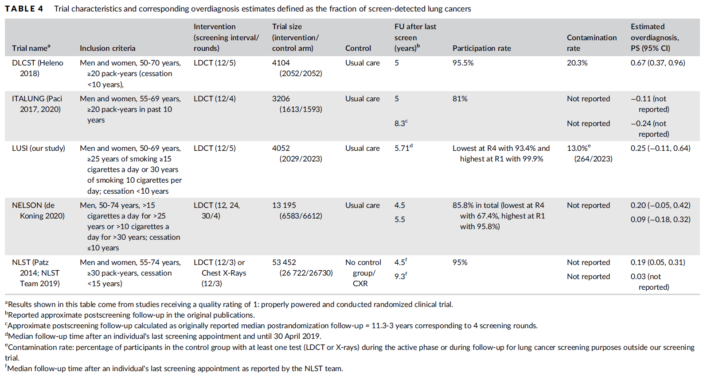

.. _2017_lung_cancer:

===================================
Tracheal, Bronchus, and Lung Cancer
===================================

.. contents::
   :local:
   :depth: 1

.. list-table:: Abbreviations
   :widths: 15 15 15
   :header-rows: 1

   * - Abbreviation
     - Definition
     - Note
   * - TBL
     - Tracheal, bronchus, and lung
     - 
   * - MST
     - Mean sojourn time
     - Time between screen-detectable and symptom onset
   * - ODF
     - Overdiagnosis factor
     - Increase in lung cancer incidence attributable to screening program
   * - AST
     - Average survival time
     - 
   * - LDCT
     - Low-dose computed tomography
     - Lung cancer screening
   * - CXR
     - Chest x-ray
     - Lung cancer screening
   * - ACMR
     - All-cause mortality rate
     - 
   * - CSMR
     - Cause-specific mortality rate
     -
   * - EMR
     - Excess mortality rate
     - 

Disease Overview
----------------

The trachea, commonly referred to as the windpipe, is part of the lower respiratory tract that connects the larynx (lower portion of the upper respiratory tract) to the primary bronchi, which biforcate from the trachea and lead to each lung. Most cases of tracheal and bronchus cancer are secondary to primary cancer in other sites; however, primary cancers can occur in these sites as well [Sherani-et-al-2015]_, [Javidan-Nejad-2010]_. Notably, tracheal cancer makes up only a small portion of tracheal, bronchus, and lung cancers [Sherani-et-al-2015]_, [Javidan-Nejad-2010]_. 

Lung cancer screening and diagnosis is performed via low-dose computed topography (LDCT), which provides an image of the chest. Screening guidelines typically depend on age, smoking history, and current health status. Bronchus and tracheal cancer diagnoses are performed using LDCT as well as bronchioscopy (or a scope of the respiratory tract) [Sherani-et-al-2015]_, [Javidan-Nejad-2010]_. 

Risk factors for lung cancer include genetic and environmental factors, notably tobacco smoke and air pollution. Despite advances in TCL cancer early detection and therapy options, its burden is still increasing due to an aging popuation and risk factors such as smoking history [Deng-et-al-2020]_.

GBD 2017 Modeling Strategy
--------------------------

The following information was obtained from the GBD 2017 fatal and non-fatal methods appendices [GBD-2017-YLD-Appendix-TBL-cancer]_, [GBD-2017-CoD-Appendix-TBL-cancer]_.

Tracheal, bronchus, and lung (TBL) cancers are modeled together as a single cause in GBD. These cancers are not differentiated in the input data for the GBD model and are not crosswalked for alternative cause definitions. Notably, GBD estimates represent *diagnosed* cases of TBL cancers in a given population. 

As with the majority of neoplasm causes in GBD, a remission rate for TBL cancer is not explicitly modeled. Rather, there is no morbidity modeled for TBL cancer after 10 years. As such, prevalence for TBL cancer extends for no more than 10 years after incidence.

.. note::

  According to the GBD lung cancer modeler, this assumption is generally appropriate for TBL cancer because it is fairly lethal cancer, although investigation into the long term survival rates of TBL cancer using SEER data could provide a more in-depth analysis of the limitations of this assumption.

Total prevalence of TBL cancer is split into four sequelae: 

#. Diagnosis and primary therapy: onset of symptoms through the end of treatment; assumed 3.3 month duration for TBL cancer. Disability weight of 0.288 (0.193, 0.399).
#. Controlled phase: time between end of primary treatment and cure, death, or progression to metastatic phase; duration calculated based on remainder of time after attributing other sequelae. Disability weight of 0.049 (0.031, 0.072).
#. Metastatic phase: time period of intensive treatment for metastatic disease; assumed 4.51 month duration for TBL cancer. Disability weight of 0.451 (0.307, 0.600).
#. Terminal phase: one-month period prior to death. Disability weight of 0.540 (0.377, 0.687).

.. note:: 
  
  The disability weights for these sequelae phases are the same across all GBD neoplasms (excluding specific cancers with additional sequelae).

GBD neoplasm models rely on mortality incidence ratios (MIRs), which are estimated in a separate modeling process. According to the GBD modeler, MIRs should be retrieved from the GBD cancer modeler and not calculated from GBD estimates of location-specific incidence and moratlity rates. The fatal estimates are modeled first and then the MIRs are used to model the incidence estimates.

.. note::

  The GBD modeler mentioned that for specific locations, the input data may be primarily cancer incidence registries, although it is possible that the GBD incidence estimates may not align with the incidence input data due to this modeling process.

Covariates used in the fatal TBL cancer model for GBD 2017 included:

  Level 1: alcohol (liters per capita), cumulative cigarettes (5, 10, 15, and 20 years), smoking prevalence, tobacco (cigarettes per capita), secondhand smoke, log-transformed SEV scalar: lung C, log-transformed age-standardized SEV scalara: Lung C

  Level 2: indoor air pollution (all cooking fuels), outdoor air pollution (PM2.5), residential radon, diabetes fasting plasma glucose (mmol/L) 

  Level 3: Education (years per capita), LDI ($ per capita), socio-demographic index

.. list-table:: Tracheal, Bronchus, and Lung Cancer ICD Codes used for GBD 2017
   :widths: 15 15
   :header-rows: 1

   * - ICD 10
     - ICD 9
   * - C33-C34.9, D02.1-D02.3, D14.2-D14.3, D38.1
     - 162-162.9, 212.2-212.3, 231.1-231.2, 235.7

Cause Hierarchy
+++++++++++++++

.. image:: lung_cancer_hierarchy.svg

Restrictions
++++++++++++

The following table describes any restrictions in GBD 2017 on the effects of
this cause (such as being only fatal or only nonfatal), as well as restrictions
on the ages and sexes to which the cause applies.

.. list-table:: GBD 2017 Cause Restrictions
   :widths: 15 15 20
   :header-rows: 1

   * - Restriction Type
     - Value
     - Notes
   * - Male only
     - False
     -
   * - Female only
     - False
     -
   * - YLL only
     - False
     -
   * - YLD only
     - False
     -
   * - YLL age group start
     - age_group_id = 8
     - 15-19 years
   * - YLL age group end
     - age_group_id = 235
     - 95+ years
   * - YLD age group start
     - age_group_id = 8
     - 15-19 years
   * - YLD age group end
     - age_group_id = 235
     - 95+ years

Vivarium Modeling Strategy
--------------------------

Scope
+++++

This Vivarium modeling strategy is intended to simulate TBL cancer incidence/morbidity as well as mortality so that it reflects the estimates and assumptions of GBD. This cause model intends to allow for the differentiation of preclinical screen-detectable (asymptomatic) phase of TBL cancer and the clinical (symptomatic) phase of TBL lung cancer as well as allow for the differentiation of indolent lung cancers from other lung cancers. This cause model intends to use cancer forecast data from 2020-2040 in tandem with the :ref:`Lung cancer screening concept model <lung_cancer_cancer_concept_model>`. This cause model document should not be used in other concept models without careful review and appropriate edits.

Assumptions and Limitations
+++++++++++++++++++++++++++

1. This model will assume the existence of a "recovered" cause model state in an attempt to be consistent with the GBD assumption that no morbidity due to TBL cancer occurs more than ten years past incidence of the *clinical* phase of TBL cancer. The assumption also asserts that there is no recurrance of TBL cancer.

2. This model assumes that the GBD incidence rate corresponds to the incidence of asymptomatic preclinical/LDCT screen-detectable TBL cancer rather than *detected* lung cancer, which is a mix of preclinical and clinical detections. This assumption has a few notable downstream limitations, including:

	- Underestimation of clinical TBL cancer as a result of simulants dying between incidence of preclinical/screen-detectable TBL cancer and progression to clinical TBL cancer (death due to other causes during the mean sojourn time period).

	- Simulation incidence of *clinical* TBL cancer will lag slightly behind forecasted incidence of TBL cancer due to the mean sojourn time period delay

.. todo::

  Quantify the potential impact of this assumption here

3. The prevalence of preclinical/screen-detectable TBL cancer is assumed to be equal to prevalence of detected TBL cancer (GBD prevalence of TBL cancer) scaled to the ratio of duration spent in the preclinical/screen-detectable state (mean sojourn time) and the clinical state (average survival time). This method relies on the assumption that GBD prevalence of TBL cancer represents clinical TBL cancers; this may be a reasonable assumption for China given that the current screening coverage is low.

4. This model assumes that TBL cancers are interchangeable with lung cancer with respect to mean sojourn time, average survival time, and screening sensitivity and specificity by LDCT.

Cause Model Diagram
+++++++++++++++++++

.. image:: cause_model_diagram.svg

State and Transition Data Tables
++++++++++++++++++++++++++++++++

.. list-table:: State Definitions
   :widths: 5 5 20
   :header-rows: 1

   * - State
     - State Name
     - Definition
   * - S
     - Susceptible
     - Without condition OR with asymptomatic condition, but not screen-detectable
   * - PC
     - Preclinical, screen-detectable TBL cancer
     - With asymptomatic condition, screen-detectable, will progress to clinical phase
   * - I
     - Indolent, screen-detectable TBL cancer
     - With asymptomatic condition, screen-detectable, will not progress to clinical phase during remainder of simulant lifespan 
   * - C
     - Clinical TBL cancer
     - With symptomatic condition
   * - R
     - Recovered
     - Without condition; not susceptible

.. list-table:: States Data
   :widths: 20 25 30 30
   :header-rows: 1
   
   * - State
     - Measure
     - Value
     - Notes
   * - S
     - prevalence
     - :math:`1 - prevalence_I - prevalence_\text{PC} - prevalence_C`
     - Note: this assumes no initial prevalence in R or C states
   * - S
     - birth prevalence
     - 0
     - 
   * - S
     - excess mortality rate
     - 0
     - 
   * - S
     - disabilty weights
     - 0
     -
   * - PC
     - prevalence
     - :math:`\frac{incidence_\text{PC} * MST}{1 - prevalence_\text{C, general population}} - \frac{incidence_\text{PC} * MST}{1 - prevalence_\text{C, general population}} * baseline_\text{screening}`
     - Note: :math:`incidence_\text{PC}` defined in table below. This assumes that there are no prevalent *detected* preclinical lung cancers
   * - PC
     - birth prevalence
     - 0
     - 
   * - PC
     - excess mortality rate
     - 0
     - 
   * - PC
     - disability weights
     - 0 
     - 
   * - I
     - prevalence
     - :math:`\frac{incidence_\text{PC} * MST}{1 - prevalence_\text{C, general population}} * ODF`
     - Note: this may be an underestimate of initial prevalence due to longer duration than preclinical TBL cancer
   * - I
     - birth prevalence
     - 0
     - 
   * - I
     - excess mortality rate
     - 0
     - 
   * - I
     - disability weights
     - 0
     - 
   * - C
     - prevalence
     - 0
     - Assumed that there are no prevalent clinical (detected) lung cancers in the insured population; see the definition of :math:`prevalence_\text{C, general population}` for the prevalence of clinical lung cancers in the general population (Data Sources Table)
   * - C
     - birth prevalence
     - 0
     - 
   * - C
     - excess mortality rate
     - :math:`csmr_\text{c426} / prevalence_\text{C, general_population}`
     - 
   * - C
     - disabilty weights
     - :math:`\displaystyle{\sum_{s\in\text{s_c426}}}\scriptstyle{\text{disability_weight}_s\,\times\,\frac{\text{prev}_s}{\text{prevalence_c426}}}`
     - Total TBL cancer disability weight over all sequelae with IDs s273, s274, s275, s276. Use GBD 2019 sequalea prevalence for weighting since these were not forecasted. Can be excluded from model for simplicity (YLDs not in output table shell).
   * - R
     - prevalence
     - 0
     - No initialization into recovered state
   * - R
     - birth prevalence
     - 0
     - 
   * - R
     - excess mortality rate
     - 0
     - No excess mortality in recovered state assumed
   * - R
     - disabilty weights
     - 0
     - No long term disability in recovered state assumed

.. list-table:: Transition Data
   :widths: 10 10 10 20 30
   :header-rows: 1
   
   * - Transition
     - Source 
     - Sink 
     - Value
     - Notes
   * - i_pc
     - S
     - PC
     - :math:`\frac{screening_\text{baseline} * incidence_\text{c426*} * \frac{1}{1+ODF} + (1 - screening_\text{baseline}) * incidence_\text{c426*}}{prevalence_\text{S, general population}}`
     - NOTE: :math:`incidence_\text{c426*}` is the rate from the age group equal to simulant's age plus MST. SEE SECTION BELOW FOR HOW TO CALCULATE.
   * - i_i
     - S
     - I
     - :math:`\frac{screening_\text{baseline} * incidence_\text{c426*} * \frac{ODF}{1+ODF} + (1 - screening_\text{baseline}) * i_\text{pc} * ODF}{prevalence_\text{S, general population}}`
     - NOTE: :math:`incidence_\text{c426*}` is the rate from the age group equal to simulant's age plus MST 
   * - i_c
     - PC
     - C
     - 1/MST
     - See MST definition in table below
   * - r
     - C
     - R
     - 0.1
     - To be consistent with 10 year GBD assumption

.. list-table:: Data Sources
   :widths: 20 25 25 25
   :header-rows: 1
   
   * - Measure
     - Sources
     - Description
     - Notes
   * - prevalence_c426
     - /ihme/csu/swiss_re/forecast/426_ets_prevalence_scaled_logit_phi_89_minmax_3_1000_gbd19.csv
     - CSU TBL cancer prevalence forecasts
     - 2020-2040; defined as proportion of population with condition
   * - csmr_c426
     - /ihme/csu/swiss_re/forecast/426_ets_deaths_scaled_logit_phi_89_minmax_3_1000_gbd19.csv
     - CSU TBL cancer cause specific mortality rate forecast
     - 2020-2040; defined as deaths per person-year in general population
   * - incidence_rate_c426
     - /ihme/csu/swiss_re/forecast/426_ets_deaths_scaled_logit_phi_89_minmax_3_1000_gbd19.csv
     - CSU TBL cancer cause-specific mortality rate forecast
     - 2020-2040; defined as incidence cases per person-year in general population
   * - disability_weight_s{273, 274, 275, 276}
     - YLD appendix
     - Sequela disability weights
     - 0.288 (0.193-0.145), 0.049 (0.031-0.072), 0.451 (0.307-0.6), 0.54 (0.377-0.687)
   * - prevalence_s{273, 274, 275, 276}
     - GBD 2019, COMO, decomp_step='step4'
     - TBL cancer sequelae prevalence from GBD 2019
     - Not forecasted
   * - MST
     - Uniform distribution between 2.06 and 5.38 years
     - Mean sojourn time; duration of time between onset of the CT screen-detectable preclinical phase to the clinical phase
     - See below for instructions on how to sample and research background. NOTE: may update this value
   * - ODF
     - Triangle distribution of uncertainty with min=4, point=10, max=23. np.random.triangular(4, 10, 23)
     - Overdiagnosis factor (ex: 35% excess incidence of lung cancer associated with LDCT screening program)
     - 
   * - :math:`screening_\text{baseline}`
     - 0.06
     - Baseline coverage of lung cancer screening by LDCT
     - The value in this table should be used prior to implementation of the screening model, which will be defined in the :ref:`Lung Cancer Screening Cause Model Document <lung_cancer_cancer_concept_model>` and should then supercede the 0.06 value.
   * - :math:`prevalence_\text{C, general population}`
     - :math:`screening_\text{baseline} * prevalence_\text{c426} * \frac{1}{1+ODF} + (1 - screening_\text{baseline}) * prevalence_\text{c426}`
     - Prevalence of clinical TBL cancer in the general (insured and uninsured) population. Will be used in incidence_pc equation
     - Should use the forecasted prevalence for this parameter
   * - :math:`prevalence_\text{PC, general population}`
     - :math:`incidence_\text{PC} * MST`
     - 
     - Does not need to be calculated for use in model; shown as a proof for incidence_pc equation
   * - :math:`prevalence_\text{I, general population}`
     - :math:`screening_\text{baseline} * prevalence_\text{c426} * \frac{ODF}{1+ODF} + (1 - screening_\text{baseline}) * prevalence_\text{PC, general population} * ODF`
     - 
     - Does not need to be calculated for use in model; shown as a proof for incidence_pc equation
   * - :math:`prevalence_\text{S, general population}`
     - :math:`1 - prevalence_\text{C, general population} - prevalence_\text{PC, general population} - prevalence_\text{I, general population}`
     - 
     - Does not need to be calculated for use in model; shown as a proof for incidence_pc equation

The following equation demonstrates how to solve for :math:`incidence_\text{PC}` based on the dependent equalities for the definitions of :math:`incidence_\text{c426}` and :math:`prevalence_\text{S, general population}`.

.. math ::

  a = -MST + (1 - screening_\text{baseline}) * MST * ODF

.. math ::

  b = 1 - prevalence_\text{C, general population} - screening_\text{baseline} * prevalence_\text{c426} * \frac{ODF}{1+ODF}

.. math ::

  c = -(screening_\text{baseline} * incidence_\text{c426} * \frac{1}{1+ODF} + (1 - screening_\text{baseline}) * incidence_\text{c426})

.. math ::

  incidence_\text{PC} = \frac{-b + \sqrt{b^2 - 4ac}}{2a}

The below equations show a proof for the above equation.

1.

.. math ::

  prevalence_\text{S, general population} = 1 - prevalence_\text{C, general population} 
  
  - prevalence_\text{PC, general population} - prevalence_\text{I, general population}

2. 

.. math ::

  prevalence_\text{S, general population} = 1 - prevalence_\text{C, general population} - incidence_\text{PC} * MST 
  
  - (screening_\text{baseline} * prevalence_\text{c426} * \frac{ODF}{1+ODF} + (1 - screening_\text{baseline}) * incidence_\text{PC} * MST * ODF

3. 

.. math :: 

  \frac{screening_\text{baseline}*incidence_\text{c426}*\frac{1}{1+ODF} + (1-screening_\text{baseline})*incidence_\text{c426}}{incidence_\text{PC}} = 
  
  1 - prevalence_\text{C, general population} - incidence_\text{PC} * MST 
  
  - (screening_\text{baseline} * prevalence_\text{c426} * \frac{ODF}{1+ODF} + (1 - screening_\text{baseline}) * incidence_\text{PC} * MST * ODF

4. 

.. math ::

  0 = (-MST + (1 - screening_\text{baseline}) * MST * ODF) * {incidence_\text{PC}}^2 

  + (1 - prevalence_\text{C, general population} - screening_\text{baseline} * prevalence_\text{c426} * \frac{ODF}{1+ODF}) * incidence_\text{PC}

  - (screening_\text{baseline} * incidence_\text{c426} * \frac{1}{1+ODF} + (1 - screening_\text{baseline}) * incidence_\text{c426})

Mean Sojourn Time
^^^^^^^^^^^^^^^^^

**Research Background:**

.. image:: mst_diagram.svg

A systematic literature search was performed to obtain estimates of the mean sojourn time of lung cancer using low-dose computed topography (LDCT) screening methodology. The search yielded the following relevant studies:

.. list-table:: Mean Sojourn Time References
   :widths: 20 25 25 25
   :header-rows: 1
   
   * - Paper
     - Description
     - Results
     - Notes
   * - [Chien-and-Chen-2008]_
     - Used a Markov model to estimate MST using data meta-analyzed from six studies. Assumes a gamma distribution of MSTs.
     - Median: 2.06 years (95% CI: 0.42 - 3.83)
     - 
   * - [ten-Haaf-et-al-2015a]_
     - Used the MISCAN-Lung model to estimate MST using data from SEER, the National Lung Screening Trial (NLST), and the Prostate, Lung, Ovarian Colon and Ovarian Cancer Screening Trial (PLCO). Estimated MST at the sex-, stage- and histology-specific level. Assumed a weilbull distribution of MSTs.
     - Not reported here due to specificity at the histological level. Notably, MST was greater in women than men.
     - 
   * - [Patz-et-al-2014]_
     - Used data from the National Lung Screening Trial (NLST) to estimate MST 
     - For non-BAC NSCLC: 3.6 years (95% CI: 3.0-4.3); For BAC: 32.1 years (17.3-270.7)
     - NSCLC: non-small cell carcinoma lung cancer, BAC: bronchioloalveolar carcinoma
   * - [Gonzalez-Maldonado-et-al-2020]_
     - German RCT among long-term smokers 50.3-71.9 years of age; LDCT screening versus no screening. Median follow-up of 9.77 years.
     - 5.38 years (95% CI: 4.76, 5.88)
     - 

Given that our model is not specific to any given histologies or cancer stages, we selected the [Chien-and-Chen-2008]_ paper as the data source for the mean sojourn time in this model. 

  Notably, this is limited in that it does not consider variation by sex or histology.

Further, an analysis by [Veronesi-et-al-2012]_ suggested that mean doubling time of lung cancer tumors (a measure related to mean sojourn time) did not significantly vary by age or pack-year cigarette consumption. 

.. note::

  The model results for the :ref:`SwissRe lung cancer screening model <lung_cancer_cancer_concept_model>` will be sensitive to this parameter. Given that there is variation around this parameter, this is a value that we should reach consensus on with the client. 

Cumulative Excess Incidence Factor
^^^^^^^^^^^^^^^^^^^^^^^^^^^^^^^^^^

**Research Background:**

Overdiagnosis by cancer screening is defined as the detection/diagnosis of very slow growing or indolent cancers that never would have resulted in a clinical cancer due to death from other causes first (and therefore would not be expected to experience clinical detection of the cancer). The following figure demonstrates the concept of an "overdiagnosed" case. 

.. image:: overdiagnosis_figure.svg

Overdiagnosis is a major concern associated with lung cancer screening programs and as such has been evaluated for LDCT lung cancer screening programs by several investigators. 

Cumulative excess incidence in the experimental arm relative to the control arm of RCTs can be used to estimate overdiagnosis of lung cancer screening by LDCT. The table below provides a summary of RCTs that have estimated overdiagnosis using the excess cumulative incidence approach, as summarized by [Gonzalez-Maldonado-et-al-2020]_.

Further, [Broderson-et-al-2020]_ conducted a meta-analysis of overdiagnosis as estimated by LDCT RCTs and concluded that the RR for lung cancer incidence 1.51 (1.06-2.14) based on low-bias RCTs; 1.22 (1.02-1.47) based on all RCTs. They also concluded that 49% (11-87) of screen-detected cancers were overdiagnosed from two RCTs with low risk of bias; 38% (14-63) from all RCTs. They noted that "there is uncertainty about this substantial degree of overdiagnosis due to unexplained heterogeneity and low precision of the summed estimate across the two trials" (p. 2).

Notably, excess incidence in RCTs (lead time greater than the study follow-up period) does not necessarily reflect overdiagnosis (lead time greater than life expectancy). Therefore, if the follow-up period since the last screening is shorter than the maximum leda times for all participants, then cumulative excess incidence estimates will *overestimate* overdiagnosis. 

  This is illustrated with the NLST trial results for which the cumulative excess incidence estimate decreased from 19% with 4.5 years of follow-up to 3% with 9.3 years of follow-up (note that this was in comparison to CXR screening rather than no screening). Similarly, excess incidence overdiagnosis was estimated at 19.7% with 4.5 years of follow-up since last screening in the NELSON trial, which was then updated to 8.9% after 5.5 years of follow-up after the last screening round.

As discussed by [Gonzalez-Maldonado-et-al-2020]_ and [de-Koning-et-al-2020]_, additional follow-up times are needed to more accurately measure cumulative excess incidence in these RCTs, as lead times of CT screening can be up to 9 to 12 years for some cancers [ten-Haaf-et-al-2015a]_.

Additionally, background lung cancer risk, screening eligibility, and the age distribution of the study subjects will also impact the potential for overdiagnosis/excess incidence (older subjects are more susceptible due to their higher background mortality rates) [Blom-et-al-2020]_.

Due to the limitations of evaluating excess incidence/overdiagnosis through randomized controlled trials with insufficient follow-up periods, modeling studies may provide additional insight.

  [McMahon-et-al-2014]_, [de-Koning-et-al-2014]_, [ten-Haaf-et-al-2015b]_, [Han-et-al-2017]_, and [ten-Haaf-et-al-2020]_ have evaluated the impact of LDCT screening programs on overdiagnosis in the US among a single birth cohort.

  [Criss-et-al-2018]_ and [Blom-et-al-2020]_ have evaluated the impact of LDCT screening programs on overdiagnosis at the population level in the US.

As a whole, most of these models found overdiagnosed cases as a proportion of screen-detected lung cancers to be generally less than 10%. However, it was noted that this figure varies with screening eligibility by age (younger ages have lower proportion), screening frequency (more frequent have greater proportion), smoking history (greater pack-years have greater proportion), and histological subtype (BAC at highest risk, small cell at lowest risk) [Han-et-al-2017]_. Also found in [Han-et-al-2017]_, three of the four independent models used found similar or no difference in the proportion of overdiagnosed screen-detected cancers by sex, although one of the models found that females had a higher proportion of overdiagnosis. Notably, stopping age of screening eligibility was the most influential of these parameters [Han-et-al-2017]_.

Given that these modeling studies were fit to data from the US, it is challenging to generalize to different populations given that the results are sensitive to age, screening eligibility, histologic make-up, background mortality rates, etc. However, because age is so influential, the analysis by [Criss-et-al-2018]_ provides particularly useful data stratified by age groups, presented in the figure below.

.. image:: overdiagnosis_by_age.png

Additionally, the [Han-et-al-2017]_ study provides estimates of overdiagnosis by several stratifying variables that can aid in the consideration of additional detail.

In addition to the modeling studies discussed, cohort studies with long term follow-up may also provide information on overdiagnosis in CT lung cancer screening programs, as discussed by [Carter-et-al-2015]_.

A retrospective cohort study of patients aged 50-74 screened by LDCT relative to CXR in Japan found that lung cancer incidence among those screened via LDCT was 1.23 times that of those screened via CXR, which the authors noted was a maximum estimate [Nawa-et-al-2019]_. Notably, the CT group had a mean follow-up period of 9.85 years (+/- 2.71) and the CXR group had a mean follow-up period of 8.65 (+/- 2.09). Additionally, there were no smoking eligibility requirements in this study population and the authors noted that considerably more cancers with long doubling-times would be detected in individuals with no or low smoking histories.

[Sone-et-al-2007]_ conducted a long-term follow-up study of a population-based mass CT screening program among those aged 40-74 in Japan and estimated that 13.3% of cases might be overdiagnosed. Postoperative follow-up of the 50 survived patients ranged from 70 to 117 (median, 101) months. Notably, this study relied on the assumption of constant tumor volume doubling time and noted that if this assumption does not hold that the number of over-diagnosed cases would be smaller. Additionally, the study population included never and light smokers, which they noted had tumors with slower volume doubling times and therefore were more likely to be overdiagnosed than smokers. 

.. note::

  The model results for the :ref:`SwissRe lung cancer screening model <lung_cancer_cancer_concept_model>` will be highly sensitive to this parameter. Given that there is so much variation and contraversy around the degree of overdiagnosis in LDCT screening programs, this is a value that we should reach consensus on with the client. 

Validation Criteria
+++++++++++++++++++

The following should be true:

  :math:`incidence_\text{c426} \approx incidence_C + incidence_I * screening_\text{baseline}`

    NOTE: our incidence estimates will lag behind the GBD forecasts by the duration of MST. Each of these incidence rates should be defined with person-time in the *general population* as the denominator.

  :math:`prevalence_\text{c426} \approx< prevalence_C + prevalence_I * screening_\text{baseline}`

    NOTE: The simulation prevalence will lag behind the forecasted prevalence in the early years of the simulation because of the assumption that there are no prevalent detected cancers at the start of the simulation.

    NOTE: The simulation will overestimate prevalence because there is no excess mortality or remission in the indolent state currently. Screening sensitivity information avaialable on the :ref:`Lung cancer concept model documentation page <lung_cancer_cancer_concept_model>`.

  :math:`csmr_\text{c426} \approx csmr_C`

.. note::  
  
  Estimates of YLLs and YLDs likely will no longer validate well with high levels of baseline screening due to the incorporation of asymptomatic cases.

Some test simulations of this cause model that aim to verify the modelling strategy described here are available `here on the Vivarium Data Analysis Repository <https://github.com/ihmeuw/vivarium_data_analysis/pull/90>`_.

.. todo::

  Update this link to https://github.com/ihmeuw/vivarium_data_analysis/tree/master/pre_processing/lung_cancer_model once the PR is merged

References
----------

.. [Blom-et-al-2020]

  Blom EF, Ten Haaf K, de Koning HJ. Trends in lung cancer risk and screening eligibility affect overdiagnosis estimates. Lung Cancer. 2020 Jan;139:200-206. doi: 10.1016/j.lungcan.2019.11.024. Epub 2019 Nov 28. PMID: 31816564. `Available here <https://pubmed.ncbi.nlm.nih.gov/31816564/>`_.

.. [Broderson-et-al-2020]

  Brodersen J, Voss T, Martiny F, et al. Overdiagnosis of lung cancer with low-dose computed tomography screening: meta-analysis of the randomised clinical trials. Breathe 2020; 16: 200013

.. [Carter-et-al-2015]

  Carter, J. L., Coletti, R. J., & Harris, R. P. (2015). Quantifying and monitoring overdiagnosis in cancer screening: A systematic review of methods. BMJ (Clinical Research Ed.), 350, g7773. `Available here <https://doi.org/10.1136/bmj.g7773>`_.

.. [Chien-and-Chen-2008]

  Chien, Chun‐Ru, and Tony Hsiu‐Hsi Chen. "Mean sojourn time and effectiveness of mortality reduction for lung cancer screening with computed tomography." International journal of cancer 122.11 (2008): 2594-2599. `Available here <https://pubmed.ncbi.nlm.nih.gov/18302157/>`_

.. [Criss-et-al-2018]

  Criss SD, Sheehan DF, Palazzo L, Kong CY. Population impact of lung cancer screening in the United States: Projections from a microsimulation model. PLoS Med. 2018 Feb 7;15(2):e1002506. doi: 10.1371/journal.pmed.1002506. PMID: 29415013; PMCID: PMC5802442. `Available here <https://pubmed.ncbi.nlm.nih.gov/29415013/>`_.

.. [de-Koning-et-al-2014]

  de Koning et al. Benefits and harms of computed tomography lung cancer screening strategies: a comparative modeling study for the U.S. Preventive Services Task Force. Ann Intern Med. 2014 Mar 4;160(5):311-20. doi: 10.7326/M13-2316. `Available here <https://pubmed.ncbi.nlm.nih.gov/24379002/>`_.

.. [de-Koning-et-al-2020]
  
  de Koning et al. "Reduced Lung-Cancer Mortality with Volume CT Screening in a Randomized Trial." The New England Journal of Medicine 382.6 (2020): 503-513.

.. [Deng-et-al-2020]

  Deng, Yujiao, et al. "Epidemiological trends of tracheal, bronchus, and lung cancer at the global, regional, and national levels: a population-based study." Journal of hematology & oncology 13.1 (2020): 1-16. `Available here <https://pubmed.ncbi.nlm.nih.gov/32690044/>`_

.. [Gonzalez-Maldonado-et-al-2020]

  González Maldonado, Sandra, et al. "Overdiagnosis in lung cancer screening: Estimates from the German Lung Cancer Screening Intervention Trial." International Journal of Cancer (2020). `Available here <https://pubmed.ncbi.nlm.nih.gov/32930386/>`_

.. [Han-et-al-2017]

  Han SS, Ten Haaf K, Hazelton WD, Munshi VN, Jeon J, Erdogan SA, Johanson C, McMahon PM, Meza R, Kong CY, Feuer EJ, de Koning HJ, Plevritis SK. The impact of overdiagnosis on the selection of efficient lung cancer screening strategies. Int J Cancer. 2017 Jun 1;140(11):2436-2443. doi: 10.1002/ijc.30602. PMID: 28073150; PMCID: PMC5516788. `Available here <https://pubmed.ncbi.nlm.nih.gov/28073150/>`_.

.. [Javidan-Nejad-2010]

  Javidan-Nejad, Cylen. "MDCT of trachea and main bronchi." Radiologic Clinics 48.1 (2010): 157-176. `Available here <https://pubmed.ncbi.nlm.nih.gov/19995634/>`_

.. [McMahon-et-al-2014]

  McMahon PM, Meza R, Plevritis SK, Black WC, Tammemagi CM, Erdogan A, ten Haaf K, Hazelton W, Holford TR, Jeon J, Clarke L, Kong CY, Choi SE, Munshi VN, Han SS, van Rosmalen J, Pinsky PF, Moolgavkar S, de Koning HJ, Feuer EJ. Comparing benefits from many possible computed tomography lung cancer screening programs: extrapolating from the National Lung Screening Trial using comparative modeling. PLoS One. 2014 Jun 30;9(6):e99978. doi: 10.1371/journal.pone.0099978. PMID: 24979231; PMCID: PMC4076275. `Available here <https://pubmed.ncbi.nlm.nih.gov/24979231/>`_.

.. [Nawa-et-al-2019]

  Nawa, T., Fukui, K., Nakayama, T., Sagawa, M., Nakagawa, T., Ichimura, H., & Mizoue, T. (2019). A population-based cohort study to evaluate the effectiveness of lung cancer screening using low-dose CT in Hitachi city, Japan. Japanese Journal of Clinical Oncology, 49(2), 130–136. `Available here <https://doi.org/10.1093/jjco/hyy185>`_.

.. [Patz-et-al-2014]

  Patz, Edward F., et al. "Overdiagnosis in low-dose computed tomography screening for lung cancer." JAMA internal medicine 174.2 (2014): 269-274. `Available here <https://pubmed.ncbi.nlm.nih.gov/24322569/>`_

.. [Sherani-et-al-2015]

  Sherani, Khalid, et al. "Malignant tracheal tumors: a review of current diagnostic and management strategies." Current Opinion in Pulmonary Medicine 21.4 (2015): 322-326. `Available here <https://journals.lww.com/co-pulmonarymedicine/Abstract/2015/07000/Malignant_tracheal_tumors__a_review_of_current.4.aspx>`_

.. [Sone-et-al-2007]

  Sone, S., Nakayama, T., Honda, T., Tsushima, K., Li, F., Haniuda, M., Takahashi, Y., Suzuki, T., Yamanda, T., Kondo, R., Hanaoka, T., Takayama, F., Kubo, K., & Fushimi, H. (2007). Long-term follow-up study of a population-based 1996–1998 mass screening programme for lung cancer using mobile low-dose spiral computed tomography. Lung Cancer, 58(3), 329–341. `Available here <https://doi.org/10.1016/j.lungcan.2007.06.022>`_.

.. [ten-Haaf-et-al-2015a]

  ten Haaf, Kevin, Joost van Rosmalen, and Harry J. de Koning. "Lung cancer detectability by test, histology, stage, and gender: estimates from the NLST and the PLCO trials." Cancer Epidemiology and Prevention Biomarkers 24.1 (2015): 154-161. `Available here <https://pubmed.ncbi.nlm.nih.gov/25312998/>`_

.. [ten-Haaf-et-al-2015b]

  Ten Haaf K, de Koning HJ. Overdiagnosis in lung cancer screening: why modelling is essential. J Epidemiol Community Health 2015; 69: 1035-9.

.. [ten-Haaf-et-al-2020]

  Ten Haaf K, Jeon J, Tammemägi MC, Han SS, Kong CY, Plevritis SK, Feuer EJ, de Koning HJ, Steyerberg EW, Meza R. Risk prediction models for selection of lung cancer screening candidates: A retrospective validation study. PLoS Med. 2017 Apr 4;14(4):e1002277. doi: 10.1371/journal.pmed.1002277. Erratum in: PLoS Med. 2020 Sep 25;17(9):e1003403. PMID: 28376113; PMCID: PMC5380315. `Available here <https://pubmed.ncbi.nlm.nih.gov/28376113/>`_.

.. [Veronesi-et-al-2012]

  Veronesi, Giulia, et al. "Estimating overdiagnosis in low-dose computed tomography screening for lung cancer: a cohort study." Annals of internal medicine 157.11 (2012): 776-784. `Available here <https://pubmed.ncbi.nlm.nih.gov/23208167/>`_

.. [GBD-2017-YLD-Appendix-TBL-cancer]

   Pages ???-??? in `Supplementary appendix 1 to the GBD 2017 YLD Capstone <YLD
   appendix on ScienceDirect_>`_:

     **(GBD 2017 YLD Capstone)** GBD 2017 Disease and Injury Incidence and
     Prevalence Collaborators. :title:`Global, regional, and national incidence,
     prevalence, and years lived with disability for 354 diseases and injuries
     for 195 countries and territories, 1990–2017: a systematic analysis for the
     Global Burden of Disease Study 2017`. Lancet 2018; 392: 1789–858. DOI:
     https://doi.org/10.1016/S0140-6736(18)32279-7

.. _YLD appendix on ScienceDirect: https://ars.els-cdn.com/content/image/1-s2.0-S0140673618322797-mmc1.pdf
.. _YLD appendix on Lancet.com: https://www.thelancet.com/cms/10.1016/S0140-6736(18)32279-7/attachment/6db5ab28-cdf3-4009-b10f-b87f9bbdf8a9/mmc1.pdf

.. [GBD-2017-CoD-Appendix-TBL-cancer]

   Pages ???-??? in `Supplementary appendix 1 to the GBD 2017 CoD Capstone <CoD
   appendix on ScienceDirect_>`_:

     **(GBD 2017 CoD Capstone)** GBD 2017 Causes of Death Collaborators.
     :title:`Global, regional, and national age-sex-specific mortality for 282
     causes of death in 195 countries and territories, 1980–2017: a systematic
     analysis for the Global Burden of Disease Study 2017`. Lancet 2018; 392:
     1736–88. DOI: http://dx.doi.org/10.1016/S0140-6736(18)32203-7

.. _CoD appendix on ScienceDirect: https://ars.els-cdn.com/content/image/1-s2.0-S0140673618322037-mmc1.pdf
.. _CoD appendix on Lancet.com: https://www.thelancet.com/cms/10.1016/S0140-6736(18)32203-7/attachment/5045652a-fddf-48e2-9a84-0da99ff7ebd4/mmc1.pdf
