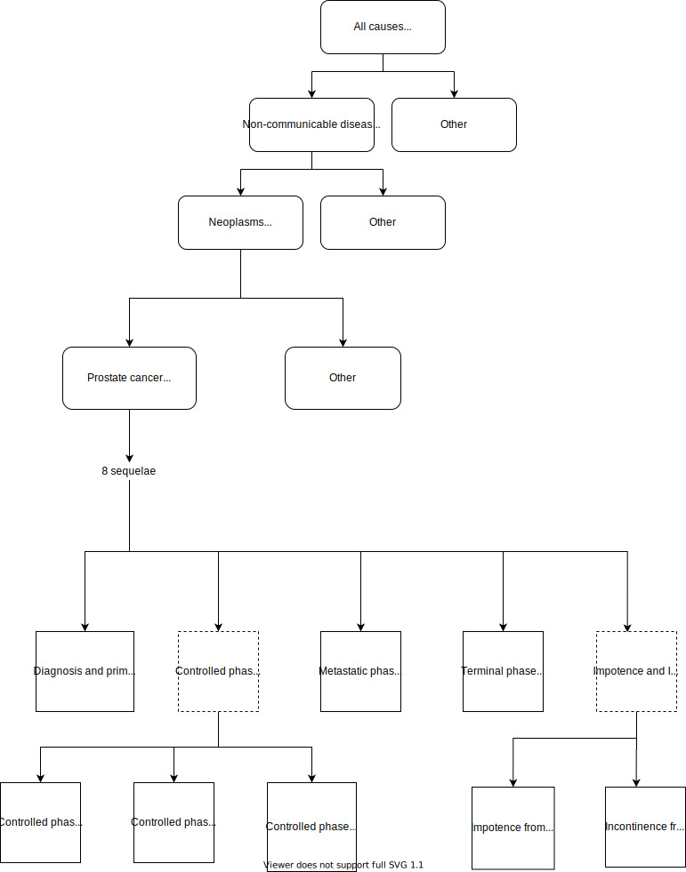

.. _2017_cancer_model_prostate_cancer:

===============
Prostate Cancer
===============

Disease Overview
----------------

.. todo::

   Add definition of each cancer. In particular, find data about global prevalence and disease fatal and non fatal description.

GBD 2017 Modeling Strategy
--------------------------

Prostate cancer in GBD 2017
+++++++++++++++++++++++++++

The GBD modelling strategy can be found in the GBD YLD Capstone Appendix [GBD-2017-YLD-Capstone-Appendix-1-Prostate-Cancer]_.

Incidence is estimated directly from mortality using mortality to incidence ratios (MIR).

Because of long-term disability associated with prostatectomy, prevalence for prostate cancer is estimated beyond ten years. To estimate the disability, 
total prevalence for prostate cancer is split into

#. Diagnosis and primary therapy
#. Controlled phase

   #. Controlled phase of prostate cancer, with impotence
   #. Controlled phase of prostate cancer, with incontinence
   #. Controlled phase of prostate cancer, without impotence or incontinence
#. Metastatic phase
#. Terminal phase
#. Impotence and Incontinence after 10-year survival from prostate cancer

   #. Impotence from prostate cancer, beyond 10 years
   #. Incontincence from prostate cancer, beyond 10 years

.. todo::

   Add more details about GBD modelling strategy of Prostate cancer.

Cause Hierarchy
+++++++++++++++

Restrictions
++++++++++++

.. todo::

   Add restrictions table.

Vivarium Modeling Strategy
--------------------------

Scope
+++++

.. todo::

   Add scope.

Model Assumptions and Limitations
+++++++++++++++++++++++++++++++++

.. todo::

   Add assumptions and limitations.

Cause Model Diagram
-------------------

Within GBD 2017 data, the remission rate is not available which makes it difficult to transition through the states.
 So, due to data limitations we are simplifying the model.
 
Note: This simpliflication might over estimate the number of deaths. 

.. image:: cancer_cause_model.svg

State and Transition Data Tables
--------------------------------

.. todo::

   Add state and transitions  data tables.

Model Assumptions and Limitations
---------------------------------

.. todo::

   Add model assumptions and limitations.

Validation Criteria
-------------------

.. todo::

   Describe tests for model validation.

References
----------

.. [GBD-2017-YLD-Capstone-Appendix-1-Prostate-Cancer]
   Supplement to: `GBD 2017 Disease and Injury Incidence and Prevalence
   Collaborators. Global, regional, and national incidence, prevalence, and
   years lived with disability for 354 diseases and injuries for 195 countries
   and territories, 1990–2017: a systematic analysis for the Global Burden of
   Disease Study 2017. Lancet 2018; 392: 1789–858`
   (pp. 310-317)
