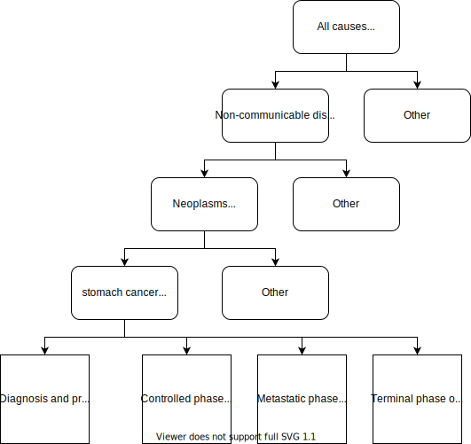

.. role:: underline
    :class: underline

..
  Section title decorators for this document:

  ==============
  Document Title
  ==============

  Section Level 1 (#.0)
  +++++++++++++++++++++
  
  Section Level 2 (#.#)
  ---------------------

  Section Level 3 (#.#.#)
  ~~~~~~~~~~~~~~~~~~~~~~~

  Section Level 4
  ^^^^^^^^^^^^^^^

  Section Level 5
  '''''''''''''''

  The depth of each section level is determined by the order in which each
  decorator is encountered below. If you need an even deeper section level, just
  choose a new decorator symbol from the list here:
  https://docutils.sourceforge.io/docs/ref/rst/restructuredtext.html#sections
  And then add it to the list of decorators above.

.. _2017_stomach_cancer:

==============
Stomach Cancer
==============

.. contents::
   :local:
   :depth: 1

+------------------------------------+
| List of abbreviations              |
+=======+============================+
| MST   | Mean Sojourn Time          |
+-------+----------------------------+
| AST   | Average Survival Time      |
+-------+----------------------------+
| PC    | Pre-Clinical Cancer        |
+-------+----------------------------+
| S     | Susceptible                |
+-------+----------------------------+
| C     | With Cancer condition      |
+-------+----------------------------+

Disease Overview
----------------

Stomach/gastric cancer (GC) epidemiology and risk factors Gastric carcinogenesis is a multifactorial, multistep process. Host factors include blood group A, pernicious anemia, prior gastric surgery, family history, hereditary diffuse GC, and genetic syndromes. Smoking, salt, salty and smoked food, red meat, obesity, and low socioeconomic status are environmental factors. Moreover, infection with Helicobacter pylori and Epstein–Barr virus also play a role in gastric carcinogenesis. Information on these risk factors helps characterize individuals at risk of GC during their lifetime. Furthermore, identification of premalignant lesions is important for the purpose of screening and surveillance. Premalignant lesions of GC include atrophic gastritis (AG), intestinal metaplasia (IM), and dysplasia (DYS). It has been estimated that annually 0%–1.8%, 0%–10%, and 0%–73% of the patients with AG, IM, and dysplasia, respectively, progress to GC. The wide variations on the reported progression rates may result from differences in the study design, recruited population, and definitions. The Netherlands cohort study also revealed that premalignant lesions would progress to GC with an annual incidence of 0.2% from AG, 0.25% from IM, 0.6% from mild-to-moderate dysplasia, and 6% from severe dysplasia2. 
  
Endoscopic surveillances in individuals with premalignant lesions may detect GC at an early and curable stage and therefore improve their survival. Prognosis of upper gastrointestinal cancer depends largely on disease stage at diagnosis. The survival rate is less than 10% when diagnosed at an advanced stage but is as high as 85% if detected at an earlier stage. Endoscopic screening can potentially prevent upper gastrointestinal cancers by early diagnosis and early treatment and has been widely adopted in screening programmes. 

Stomach cancers tend to develop slowly over many years. Before a true cancer develops, pre-cancerous changes often occur in the inner lining (mucosa) of the stomach. These early changes rarely cause symptoms and therefore often go undetected. Most (about 90% to 95%) cancers of the stomach are adenocarcinomas. A stomach cancer or gastric cancer almost always is an adenocarcinoma. These cancers develop from the cells that form the innermost lining of the stomach (the mucosa). Correa pointed out that the human gastric carcinogenesis is a slow progressive, multistep, and multifactorial pathology process. The multistep process is composed of chronic superficial gastritis, atrophy gastritis, intestinal metaplasia (IM), dysplasia (DYS), and adenocarcinoma (malignant neoplasm).

GBD 2017 Modeling Strategy
--------------------------

The following information was obtained from the GBD 2017 fatal and non-fatal methods appendices [GBD-2017-YLD-Appendix]_, [GBD-2017-CoD-Appendix]_.

As with the majority of neoplasm causes in GBD, a remission rate for stomach cancer is not explicitly modeled. Prevalence for all cancers is estimated for a maximum of ten years after incidence meaning if a person survives for more than 10 years, he/she is considered 'cured'. In other words, a surviving person will no longer be a prevalent case 10 years after incidence and does not have excess mortality and morbidity/disability from stomach cancer.

Total yearly prevalence of stomach cancer is split into four sequelae (see page 310-312 of YLD appendix): 

#. :underline:`Diagnosis and primary therapy`: 
  - time from onset of symptoms through to the end of treatment 
  - assumed 5.2 month duration for stomach cancer 
  - Disability weight of 0.288 (0.193, 0.399)
#. :underline:`Controlled phase`: 
 - time between end of primary treatment and earlist of either:  cure (defined as recurrence- and progression-free survival after ten years), death from another cause, or progression to the metastatic phase
 - duration calculated based on remainder of time after attributing other sequelae. 
 - Disability weight of 0.049 (0.031, 0.072)
#. :underline:`Metastatic phase`: 
 - time period of intensive treatment for metastatic disease
 - assumed 3.88 month duration for stomach cancer
 - Disability weight of 0.451 (0.307, 0.600)
#. :underline:`Terminal phase`: 
 - 1 month prior to death
 - Disability weight of 0.540 (0.377, 0.687)

.. note:: 
  
  The disability weights for these sequelae phases are the same across all GBD neoplasms (excluding specific cancers with additional sequelae).

GBD neoplasm models rely on mortality incidence ratios (MIRs), which are estimated in a separate modeling process. According to the GBD modeler, MIRs should be retrieved from the GBD cancer modeler and not calculated from GBD estimates of location-specific incidence and moratlity rates. The fatal estimates are modeled first and then the MIRs are used to model the incidence estimates.

.. note::

  The GBD modeler mentioned that for specific locations, the input data may be primarily cancer incidence registries, although it is possible that the GBD incidence estimates may not align with the incidence input data due to this modeling process.

Covariates used in the fatal stomach cancer model for GBD 2017 included page 189 in YLL/CoD appendix):

  Level 1: diet high in sodium +, cumulative cigarettes + (5, 10, 15, and 20 years), smoking prevalence +, tobacco + (cigarettes per capita), log-transformed SEV scalar: Stomach C +, SEV unsafe water +, SEV unsafe sanitation + 

  Level 2: vegetables adjusted (g) -, fruits adjusted (g) -, mean BMI +, sanitation (proportion with access) -, improved water source (proportion with access) -, healthcare access and quality index -

  Level 3: Education (years per capita) -, LDI ($ per capita) 0, socio-demographic index 0

.. list-table:: Stomach Cancer ICD Codes used for GBD 2017
   :widths: 15 15
   :header-rows: 1

   * - ICD 10
     - ICD 9
   * - C16-C16.9, D00.2, D13.1, D37.1
     - 151-151.9, 211.1, 230.2

Cause Hierarchy
+++++++++++++++

Restrictions
++++++++++++

The following table describes any restrictions in GBD 2017 on the effects of
this cause (such as being only fatal or only nonfatal), as well as restrictions
on the ages and sexes to which the cause applies.

.. list-table:: GBD 2017 Cause Restrictions
   :widths: 15 15 20
   :header-rows: 1

   * - Restriction Type
     - Value
     - Notes
   * - Male only
     - False
     -
   * - Female only
     - False
     -
   * - YLL only
     - False
     -
   * - YLD only
     - False
     -
   * - YLL age group start
     - age_group_id = 8
     - 15-19 years
   * - YLL age group end
     - age_group_id = 235
     - 95+ years
   * - YLD age group start
     - age_group_id = 8
     - 15-19 years
   * - YLD age group end
     - age_group_id = 235
     - 95+ years

Vivarium Modeling Strategy
--------------------------

Scope
+++++

This Vivarium modeling strategy is intended to simulate stomach cancer incidence/morbidity as well as mortality so that it reflects the estimates and assumptions of GBD. Additionally, this cause model intends to allow for the differentiation of preclinical screen-detectable (asymptomatic) phase of stomach cancer and the clinical (symptomatic) phase of stomach cancer. 

Assumptions and Limitations
+++++++++++++++++++++++++++

1. This model will assume the existence of a "recovered" cause model state in an attempt to be consistent with the GBD assumption that no morbidity due to stomach cancer occurs more than ten years past incidence of the *clinical* phase of stomach cancer. The assumption also asserts that there is no recurrance of stomach cancer.

2. This model assumes that the GBD incidence rate corresponds to the incidence of all pre-clinical asymptomatic stomach cancer rather than symptomatic clinical stomach cancer arising from symptomatic presentation at the doctor's office. This assumption has a few notable downstream limitations, including:

	- simulation incidence of *clinical* stomach cancer will lag slightly behind forecasted incidence of stomach cancer due to the mean sojourn time period delay
  - assume a short mean sojourn time 

.. todo::

  think more about these assumptions in relation to the sojourn time

3. The prevalence of pre-clinical (the pre-clincial cancer is screen-detectable for stomach cancer) is assumed to be equal to incidence of pre-clinical cancer (per assumption #2, this would be i_c414 which is the GBD incidence rate scaled to the susceptable population) x duration in the pre-clinical state which is the mean sojourn time (MST).

4. If there is any baseline screening in the general population (GBD population), then the prevalence obtained from GBD (prev_c414) is equal to a combination of asymptomatic cancers detected from screening and symptomatic cancers that were not screened and reached clinical stage. Our simulation population is slightly different from the general population- we exclude any symptomatic cancers in the sim population. Additioanlly, we also exclude those pre-clinical cancers detected from any baseline screening in the general population. Hence, the susceptive population S in the sim population is prev_PC x (1- baseline screening %). Prev_PC (per assumption #2 and 3) = i_c414 (GBD incidence) / prevalence of susceptibles in the general population (GBD population) x MST.

Cause Model Diagram
+++++++++++++++++++

This causal diagram reflects the simulation population which is different from the general population (GBD). In the simulation population, we assume there are no symptomatic cancers (prev_C = 0). Note that the general population refers to the GBD population. 

State and Transition Data Tables
++++++++++++++++++++++++++++++++

.. list-table:: State Definitions
   :widths: 5 5 20
   :header-rows: 1

   * - State
     - State Name
     - Definition
   * - S
     - Susceptible
     - Without cancer condition (may have pre-cancer states)
   * - PC
     - Pre-clinical asymptomatic cancer, endoscopy detectable  
     - With asymptomatic condition, detectable through endoscopy screening, will progress to clinical symptomatic phase
   * - C
     - Clinical stomach cancer
     - With symptomatic condition
   * - R
     - Recovered
     - Without condition; not susceptible

.. list-table:: States Data
   :widths: 20 25 30 30
   :header-rows: 1
   
   * - State
     - Measure
     - Value
     - Notes
   * - S
     - prevalence
     - 1 - prev_PC - prev_C - prev_R
     - Note: we assume no initial prevalence in C or R state (prev_C and prev_R =0)
   * - S
     - birth prevalence
     - 0
     - 
   * - S
     - excess mortality rate
     - 0
     - 
   * - S
     - disabilty weights
     - 0
     -
   * - PC
     - prevalence
     - prev_PC = (1-baseline screening %) x i_pc x MST
     - see definition of i_pc below
   * - PC
     - birth prevalence
     - 0
     - 
   * - PC
     - excess mortality rate
     - 0
     - 
   * - PC
     - disability weights
     - 0 
     - 
   * - C
     - prevalence
     - 0
     - 
   * - C
     - birth prevalence
     - 0
     - 
   * - C
     - excess mortality rate
     - csmr_c414 / prevalence_c414
     - 
   * - C
     - disabilty weights
     - :math:`\displaystyle{\sum_{s\in\text{s_c414}}}\scriptstyle{\text{disability_weight}_s\,\times\,\frac{\text{prev}_s}{\text{prev_c414}}}`
     - Total stomach cancer disability weight over all sequelae with IDs s248, s249, s250, s251
   * - R
     - prevalence
     - 0
     - No initialization into recovered state
   * - R
     - birth prevalence
     - 0
     - 
   * - R
     - excess mortality rate
     - 0
     - No excess mortality in recovered state assumed
   * - R
     - disabilty weights
     - 0
     - No long term disability in recovered state assumed

.. list-table:: Transition Data
   :widths: 10 10 10 20 30
   :header-rows: 1
   
   * - Transition
     - Source 
     - Sink 
     - Value
     - Notes
   * - i_pc
     - S
     - PC
     - i_c414*/ prev_S, general population
     - *at age 'current age + MST'; prev_S, general population = 1 - prev_c414   
   * - i_c
     - PC
     - C
     - 1/MST per person-year
     - See MST definition in table below
   * - i_c414
     - 
     - 
     - GBD incidence
     -    
   * - r
     - C
     - R
     - 0.1 per person-year for each sex and age group	
     - To be consistent with 10 year GBD assumption

.. note::

  * we need to draw from i_c414/(1-prev_c414) + MST because otherwise we are making people get clinical cancer a period of +MST older than they would have otherwise by giving them the pre-clinical cancer first with i_c414 and then waiting MST time to get clinical cancer. To keep clinical cancer incidence consistent with the right age groups, we can draw the incidence rates for preclinical cancer from the future- age group MST-time older than the stimulants current age. This depends on what duration of MST we end up using- if its shorter than the time incidence rates increase (1 year?), then we might not need to add this period. 

.. list-table:: Data Sources
   :widths: 20 25 25 25
   :header-rows: 1
   
   * - Measure
     - Sources
     - Description
     - Notes
   * - prevalence_c414
     - 414_ets_prevalence_scaled_logit_phi_89_minmax_3_1000_gbd19.csv
     - CSU stomach cancer prevalence forecasts
     - 2020-2040; defined as proportion of population with condition
   * - csmr_c414
     - 414_ets_deaths_scaled_logit_phi_89_minmax_3_1000_gbd19.csv
     - CSU stomach cancer cause specific mortality rate forecast
     - 2020-2040; defined as deaths per person-year in general population
   * - incidence_rate_c414
     - 414_ets_incidence_scaled_logit_phi_89_minmax_3_1000_gbd19.csv
     - CSU stomach cancer cause-specific mortality rate forecast
     - 2020-2040; defined as incidence cases per person-year in general population
   * - disability_weight_s{248, 249, 250, 251}
     - YLD appendix
     - Sequela disability weights
     - 0.288 (0.193-0.145), 0.049 (0.031-0.072), 0.451 (0.307-0.6), 0.54 (0.377-0.687)
   * - prevalence_s{248, 249, 250, 251}
     - GBD 2019, COMO, decomp_step='step4'
     - stomach cancer sequelae prevalence
     - Not forecasted
   * - MST
     - 4.5 months (95%UI:4-5m); distrbution of uncertainty at draw level
     - Mean sojourn time; duration of time between onset of the asymptomtic stomach cancer to the clinical phase
     - See below for instructions on how to sample and research background. NOTE: this is stand in value for now

.. todo::

	Update/confirm placeholder values

Mean Sojourn Time
^^^^^^^^^^^^^^^^^

**Parameter for Use in Model:**

This parameter is be sampled *at the draw level* from the distribution detailed below and should be applied universally to all simulants within that draw.

.. code-block:: Python

  from scipy.stats import norm

  # mean and 0.975-quantile of normal distribution for mean difference (MD)
  mean = 4.5
  q_975 = 5

  # 0.975-quantile of standard normal distribution (=1.96, approximately)
  q_975_stdnorm = norm().ppf(0.975)

  std = (q_975 - mean) / q_975_stdnorm # std dev of normal distribution

  # Frozen normal distribution for MST, representing uncertainty in the parameter
  mst_distribution = norm(mean, std)

.. note::

  Currently I have an individual sojourn time (IST) from Yeh et al's 2008 modelling paper. The IST likely follows a beta distribution with median 4m, and max 24m. Computing the MST as the sample mean from the beta distribution gives (sampling distribution of the mean) a mean of 4.5m. We use +/- 10% as approximate UIs. I will refine this parameter. 

  Alternatively, we can model the transition duration at the individual level using the IST and the incidence rate at the individual level using 1/IST. 

.. todo::

  refine value, upload beta distribution

Validation Criteria
+++++++++++++++++++

The incidence and prevalence of *clinical* stomach cancers in the general population should approximately validate to the GBD incidence and prevalence of stomach cancers. The mortality rates (CSMR and EMR) of stomach cancer should validate to those of GBD.

References
++++++++++

.. [GBD-2017-YLD-Appendix]

   Pages 310-317 in `Supplementary appendix 1 to the GBD 2017 YLD Capstone <YLD
   appendix on ScienceDirect_>`_:

     **(GBD 2017 YLD Capstone)** GBD 2017 Disease and Injury Incidence and
     Prevalence Collaborators. :title:`Global, regional, and national incidence,
     prevalence, and years lived with disability for 354 diseases and injuries
     for 195 countries and territories, 1990–2017: a systematic analysis for the
     Global Burden of Disease Study 2017`. Lancet 2018; 392: 1789–858. DOI:
     https://doi.org/10.1016/S0140-6736(18)32279-7

.. _YLD appendix on ScienceDirect: https://ars.els-cdn.com/content/image/1-s2.0-S0140673618322797-mmc1.pdf
.. _YLD appendix on Lancet.com: https://www.thelancet.com/cms/10.1016/S0140-6736(18)32279-7/attachment/6db5ab28-cdf3-4009-b10f-b87f9bbdf8a9/mmc1.pdf

.. [GBD-2017-CoD-Appendix]

   Pages 190-198 in `Supplementary appendix 1 to the GBD 2017 CoD Capstone <CoD
   appendix on ScienceDirect_>`_:

     **(GBD 2017 CoD Capstone)** GBD 2017 Causes of Death Collaborators.
     :title:`Global, regional, and national age-sex-specific mortality for 282
     causes of death in 195 countries and territories, 1980–2017: a systematic
     analysis for the Global Burden of Disease Study 2017`. Lancet 2018; 392:
     1736–88. DOI: http://dx.doi.org/10.1016/S0140-6736(18)32203-7

.. _CoD appendix on ScienceDirect: https://ars.els-cdn.com/content/image/1-s2.0-S0140673618322037-mmc1.pdf
.. _CoD appendix on Lancet.com: https://www.thelancet.com/cms/10.1016/S0140-6736(18)32203-7/attachment/5045652a-fddf-48e2-9a84-0da99ff7ebd4/mmc1.pdf
