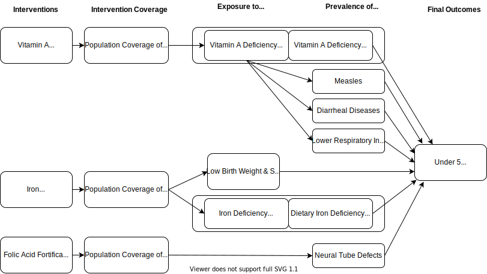

.. _2017_concept_model_vivarium_conic_lsff:

=============================================
Vivarium CoNIC Large Scale Food Fortification
=============================================

Model Overview
--------------

Objective
+++++++++

Intervention Definitions
++++++++++++++++++++++++

Questions of Interest
+++++++++++++++++++++

Scope of Modeling
+++++++++++++++++

Concept Model Diagram
---------------------

Model Components
----------------

Time
++++

* Start and end year: **2020 -- 2025**
* Simulation time step: **1 day** to capture short timeframe of diarrheal
  diseases and neonatal causes

Demographics
++++++++++++

* Locations: **Nigeria, India, Ethiopia**
* Population: **Prospective open cohort of 0-5 year-olds**
* Size of largest starting population: **100,000 simulants**
* Youngest start-age and oldest end-age: **0 -- 5 years**
* Exit age (at what age to stop tracking simulants): **5 years**
* Fertility: **Crude birth rate**

Stratification
++++++++++++++

Stratify by **location, age, sex, and year**.

Scenarios
+++++++++

Simulate five scenarios (each nutrient separately, plus iron and
folic acid together, plus baseline):

#. Baseline (using data on existing coverage of fortification)
#. Vitamin A scale-up
#. Iron scale-up
#. Folic Acid scale-up
#. Iron + Folic Acid scale-up

GBD Causes
++++++++++

* :ref:`Measles <2017_cause_measles>`

* :ref:`Diarrheal Diseases <2017_cause_diarrhea>`

* :ref:`Lower Respiratory Infections <2017_cause_lower_respiratory_infections>`

* :ref:`Neural Tube Defects <2017_cause_neural_tube_defects>`

GBD Risks
+++++++++

* :ref:`Low Birth Weight and Short Gestation (LBWSG) <2017_risk_lbwsg>`

PAF-of-1 Cause/Risk Pairs
+++++++++++++++++++++++++

* :ref:`Vitamin A Deficiency / Vitamin A Deficiency <2017_cause_vitamin_a_deficiency>`

* :ref:`Dietary Iron Deficiency / Iron Deficiency <2017_cause_iron_deficiency>`

Risk-Outcome Relationships
++++++++++++++++++++++++++

Coverage Gap Framework
++++++++++++++++++++++

Interventions
+++++++++++++

Vitamin A Fortification
~~~~~~~~~~~~~~~~~~~~~~~

Effect Size
^^^^^^^^^^^

**Research Considerations**

In this model, the vitamin A fortification intervention affects the 
**prevalence of vitamin A deficiency**. The effect size for this intervention 
was obtained from a Cochrane review performed by Hombali et al. (2019) on the 
fortification of staple foods with vitamin A for vitamin A deficiency. 
Notably, the relative risk for vitamin A foritification on vitamin A 
deficiency from this review only included data from two randomized controlled 
trials and the authors of the review assessed the certainty of the evidence to 
be "very low" (Hombali et al. 2019). The relative risk of vitamin A deficiency 
prevalence among an intervention population exposed to vitamin A fortified 
staple foods relative to a control population given the same staple foods not 
fortified with vitamin A from this review was **0.45 (95% CI: 0.19 - 1.05)**.

Therefore, we conducted a supplementary analysis of the effect of the 
intervention by pooling the RCT studies from the Cochrane review with studies 
included in the systematic review and meta-analysis performed by Keats et al. 
(2019). Notably, none of the studies identified from the Keats et al. (2019) 
review *directly* reported measures of relative risk of vitamin A deficiency 
prevalence among the population exposed to vitamin A fortification relative to 
the population unexposed to vitamin A fortification. Therefore, we manually 
calculated this value based on data reported in study tables and figures, 
which required visual approximations of certain values. Notably, when this 
supplementary meta-analysis was performed, the resulting relative risk was 
calcualted as **0.43 (95% CI: 0.28 - 0.65)**. However, when limited to sugar 
and oil vehicles for the vitamin A forticant, the relative risk was **0.36 
(95% CI: 0.26 - 0.50)**. These two supplementary meta-analyses are represented 
in the forest plots below. 

.. image:: vitamin_a_meta.png

.. image:: vitamin_a_meta_sugar_oil.png

While the supplementary meta-analysis shown above contains more studies and 
data than the Cochrane review, it relies on results that were not directly 
reported in the individual studies (and in some cases visaully estimated 
values). **Therefore, we will conservatively use the results from the Cochrane 
review, with increased certainty in the results based on the confirmatory 
results from the supplementary meta-analysis.**

Notably, all of these studies included in the supplementary analysis were 
conducted among children. Additionally, the study locations included 
Guatemala, South Africa, Nicaragua, Indonesia, and the Phillipines. Therefore, 
we concluded that it is **reasonable to assume generalizability of these 
results to our model populations.**

Regarding effect sizes in young age groups, Sandjaja et al. (2015) reported 
that population vitamin A fortification improved serum retinol concentrations 
among infants aged 6-11 months. Therefore, **we assumed that the effect size 
from the Cochrane review applies to all age groups above six months of age.** 

	Notably, the effect can occur either through the direct consumption of 
	vitamin A fortified foods or through the consumption of breastmilk from 
	mothers who consume vitamin A fortified foods (Sandjaja et al. 2015; WHO 
	Guidelines).

For individuals aged between 0 and six months, we made the following 
assumptions:

	1. Maternal consumption of vitamin A fortified foods has no effect on 
	infant vitamin A deficiency birth prevalence. This assumption is supported 
	by studies performed by Dror and Allen (2018).

	2. There is a scale up in effect size from no effect (RR=1) at birth to 
	the full effect size (RR=0.45) at six months of age. While there was no 
	data identified for the effect of vitamin A *fortification* in children 
	less than six months of age, we found that there were mixed results on the 
	impact of maternal vitamin A *supplementation* (via breastmilk) on three 
	month old infants (as discussed by Martins et al. 2010) and based our 
	assumption on this finding.

	3. The scale-up in the *reciprocal* effect size occurs in a linear fashion 
	from birth to six months of age. We made this assumption in the absence of 
	supporting data.

.. todo::

	Add citations for all of these studies/references.

	Add descriptions of strategy and assumptions regarding differences between baseline and intervention coverage (intervention effect lag, non-age-dependent, SOURCES for these)

**Vivarium Modeling Strategy**

In our Vivarium simulation, the effect of exposure foods **not** fortified 
with vitamin A on the prevalence of vitamin A deficiency realtive to those 
exposed to vitamin A fortified foods will be represented as follows: 

.. math::

  RR = \frac{P(\text{VAD prevalence} \mid \text{no fortification})}
  {P(\text{VAD prevalence} \mid \text{fortification})}
  \approx \frac{1}{0.45\: (0.19, 1.05)}
  \approx 2.22\: (0.95, 5.26).

.. note::

	We are modeling the reciprocal of the relative risk reported in the 
	Cochrane review.

	Additionally, this effect size crosses the null, and therefore, in some 
	draws it will cause increasing coverage of the intervention to *increase* 
	vitamin A deficiency prevalence. This is a limitation caused by the low 
	quality evidence regarding the relative risk of vitamin A fortification on 
	vitamin A prevalence. However, on average, increasing coverage of vitamin 
	A fortification will decrease VAD.

To model the uncertainty in this estimate, the above RR should be drawn from a
`lognormal <https://en.wikipedia.org/wiki/Log-normal_distribution>`_
distribution with median = 2.22, 2.5\ :superscript:`th`-percentile = 0.95, and
97.5\ :superscript:`th`-percentile = 5.26. This distbibution can be created
using `SciPy's lognorm function
<https://docs.scipy.org/doc/scipy/reference/generated/scipy.stats.lognorm.html>`_
as follows:

.. code-block:: Python

  from numpy import log
  from scipy.stats import norm, lognorm

  # median and 0.975-quantile of lognormal distribution for RR
  median = 2.22
  q_975 = 5.26

  # 0.975-quantile of standard normal distribution (=1.96, approximately)
  q_975_stdnorm = norm().ppf(0.975)

  mu = log(median) # mean of normal distribution for log(RR)
  sigma = (log(q_975) - mu) / q_975_stdnorm # std dev of normal distribution for log(RR)

  # Frozen lognormal distribution for RR, representing uncertainty in our effect size
  # (s is the shape parameter)
  rr_distribution = lognorm(s=sigma, scale=median)

.. note::

	I copied this from Nathaniel's documentation for the folic acid RR, but I 
	think that the same approach is appropriate. Perhaps we can eventually 
	create a separate page that lists similar strategies that we can reference 
	via links.

Additionally, as described in the research considerations above, the 
intervention effect is dependent on age and time since intervention coverage.

For simulants covered by *baseline coverage*, the effect of the intervention 
is applied continuously from the start of the simulation to the end of the 
simulation and only depends on age, such that:

.. code-block:: Python

  if age_i < 0.5:
  	rr_i = 1 + (rr_distribution.rvs(random_number_i) - 1) * age_i / 0.5
  else:
  	rr_i = rr_distribution.rvs(random_number_i)

For simulants covered by the *intervention scale-up*, the effect of the 
intervention will scale up linearly from zero at the start of coverage to the 
full effect after six months of coverage and does *not* depend on age (
research assumption), such that:

.. code-block:: Python

  if coverage_time_i < 0.5:
  	rr_i = 1 + (rr_distribution.rvs(random_number_i) - 1) * coverage_time_i / 0.5
  else:
  	rr_i = rr_distribution.rvs(random_number_i)

.. note::

	Any ideas from the research team on how we might want to combine
	the impact of age_i < 0.5 and coverage_time_i < 0.5 here?

Where,

	- **age_i** = age of simulant in years

	- **coverage_time_i** = time since start of intervention coverage for a simulant in years

	- **rr_i** = relative risk to be applied to an individual simulant

	- **rr_distribution** = distribution for the relative risk of the  intervention, as described above

	- **random_number_i** = a random number between 0 and 1, assigned to a simulant *for the entirety of the simulation*

Iron Fortification
~~~~~~~~~~~~~~~~~~

Folic Acid Fortification
~~~~~~~~~~~~~~~~~~~~~~~~

Effect Size
^^^^^^^^^^^

Folic acid fortification affects the birth prevalence of :ref:`neural tube
defects (NTDs) <2017_cause_neural_tube_defects>`. The effect size is measured as
a risk ratio (RR):

.. math::

  RR = \frac{P(\text{born with NTD} \mid \text{no fortification})}
  {P(\text{born with NTD} \mid \text{fortification})}
  \approx \frac{1}{0.59\: (0.49, 0.70)}
  \approx 1.71\: (1.43, 2.04).

We are estimating this effect size as the reciprocal of the odds ratio (OR) of
:math:`0.59\: (0.49, 0.70)` found in the Keats review; this odds ratio is the
ratio of the odds of being born with NTDs in the fortified population to the
odds of being born with NTDs in the unfortified population. Since the prevalence
of NTDs is small, the odds ratio is very close to the risk ratio.

To model the uncertainty in the estimate, the above RR should be drawn from a
`lognormal <https://en.wikipedia.org/wiki/Log-normal_distribution>`_
distribution with median = 1.71, 2.5\ :superscript:`th`-percentile = 1.43, and
97.5\ :superscript:`th`-percentile = 2.04. This distbibution can be created
using `SciPy's lognorm function
<https://docs.scipy.org/doc/scipy/reference/generated/scipy.stats.lognorm.html>`_
as follows:

.. code-block:: Python

  from numpy import log
  from scipy.stats import norm, lognorm

  # median and 0.975-quantile of lognormal distribution for RR
  median = 1.71
  q_975 = 2.04

  # 0.975-quantile of standard normal distribution (=1.96, approximately)
  q_975_stdnorm = norm().ppf(0.975)

  mu = log(median) # mean of normal distribution for log(RR)
  sigma = (log(q_975) - mu) / q_975_stdnorm # std dev of normal distribution for log(RR)

  # Frozen lognormal distribution for RR, representing uncertainty in our effect size
  # (s is the shape parameter)
  rr_distribution = lognorm(s=sigma, scale=median)

Desired Model Outputs
---------------------

Observers
+++++++++

Verification and Validation Strategy
------------------------------------

Design Decisions and Rationales
-------------------------------

Do not explicitly model neonatal disorders, meningitis, or other LBWSG-affected causes
++++++++++++++++++++++++++++++++++++++++++++++++++++++++++++++++++++++++++++++++++++++

For context, here are `treemaps for Nigeria and India on GBD Compare <http://ihmeuw.org/51tj>`_ showing that the majority of DALYs attributable to low birth weight and short gestation in the under-5 age groups are due to neonatal disorders, LRI, diarrhea, and meningitis.

Although the sub-causes of  :ref:`neonatal disorders
<2017_cause_neonatal_disorders>` account for the majority of disease burden in
the neonatal age groups, we are not explicitly modeling the neonatal causes in
this simulation. Instead, the relative risks from :ref:`low birth weight and
short gestation <2017_risk_lbwsg>` will directly affect each simulant's
mortality rate, which indirectly accounts for mortality due to neonatal
disorders and other causes like meningitis. Since iron fortification affects
birth weight and hence the relative risk of mortality that a simulant
experiences, this approach allows us to count how many deaths can be averted
from an increased birth weight resulting from iron fortification. This approach
ignores morbidity from neonatal disorders, meningitis, and other causes in the
neonatal age groups, but YLDs for neonates are negligible compared to YLLs (on
the order of 100 times smaller), so ignoring YLDs due to neonatal disorders and
other causes is not a concern.

Additional reasons for excluding neonatal disorders, meningitis, and other
causes affected by low birth weight and short gestation are as follows:

* The relative risks for :ref:`low birth weight and short gestation
  <2017_risk_lbwsg>` are not cause-specific, but rather apply to all-cause
  mortality. Thus it is simpler and more consistent with the input data to group
  all the LBWSG-affected causes together rather than modeling them explicitly,
  unless those causes need to interact with other model components (as is the
  case with :ref:`diarrheal diseases <2017_cause_diarrhea>` and :ref:`lower
  respiratory infections <2017_cause_lower_respiratory_infections>`, which are
  affectd by :ref:`vitamin A deficiency <2017_cause_vitamin_a_deficiency>`).

* Neonatal disorders is potentially problematic because:

  #. We know its (birth) prevalence does not include (birth) prevalence of
     :ref:`other neonatal disorders <2017_cause_neonatal_other>`, for which
     there is no data, and

  #. We know the relative risks are wrong for :ref:`preterm birth
     <2017_cause_neonatal_preterm>` because this sub-cause is PAF-of-1 with
     LBWSG.

* Meningitis is potentially problematic because we have not successfully
  modeled it before. In our initial attempt to include meningitis in the BEP
  model, the simulated meningitis CSMR significantly underestimated the GBD CSMR
  for meningitis in all age groups.

* Other causes affected by LBWSG, such as encephalitis, upper respiratory
  infections, and otitis media, have very few DALYs attributable to LBWSG. Thus
  it is not worth the effort to model these causes explicitly, though averted
  YLLs due to these cause will in theory be captured by the above strategy of
  using the LBWSG relative risks to affect the overall mortality rate of
  simulants.
