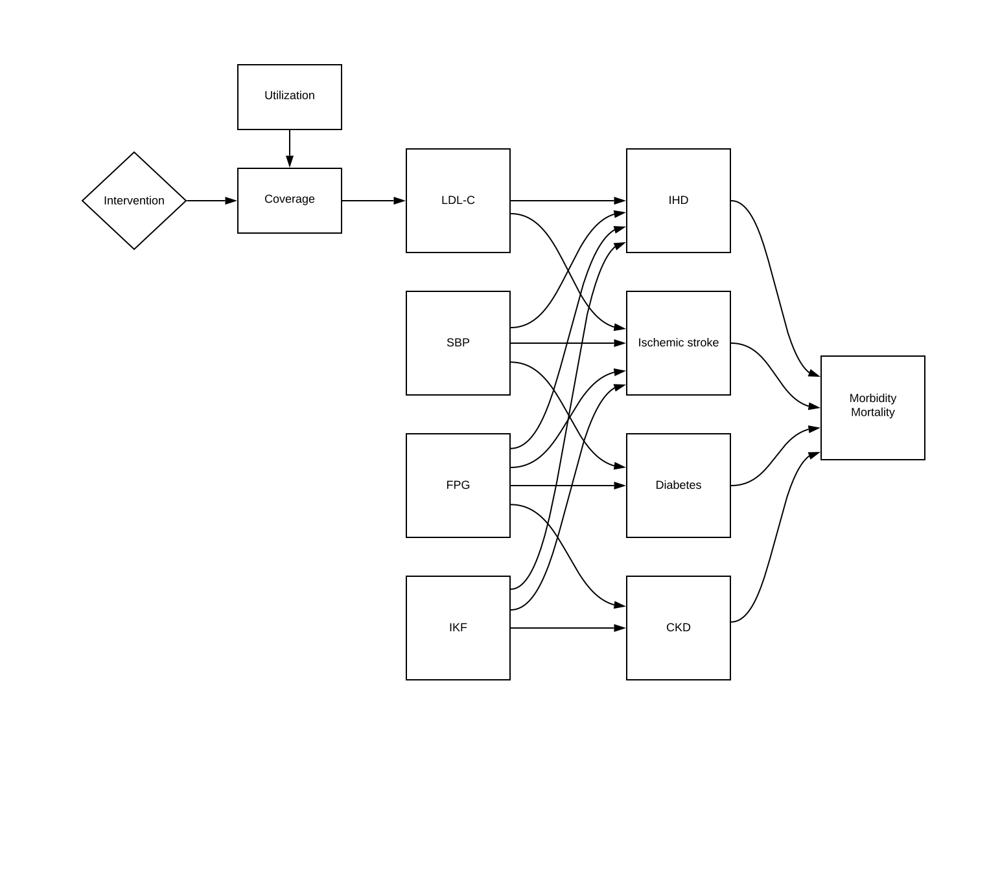
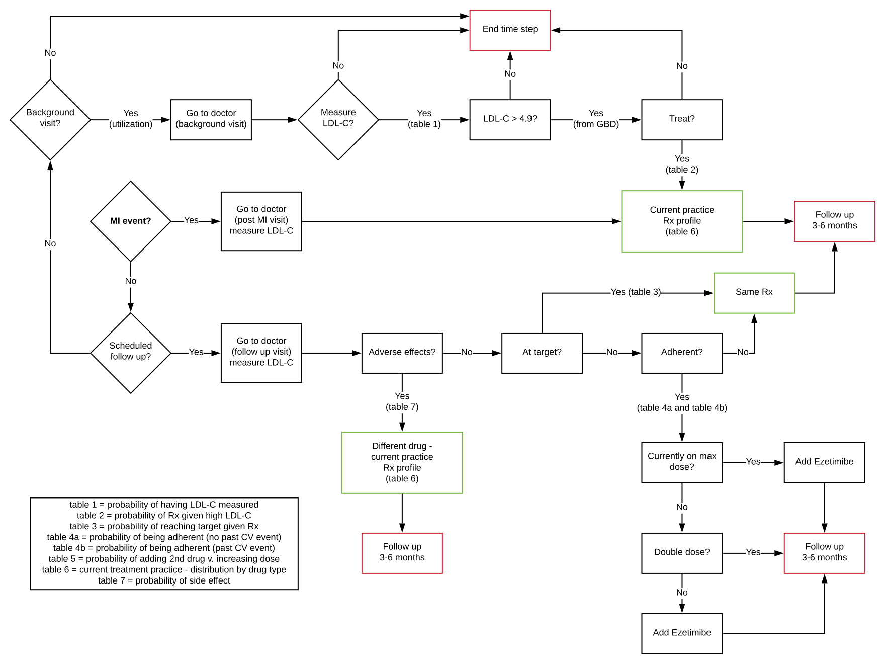
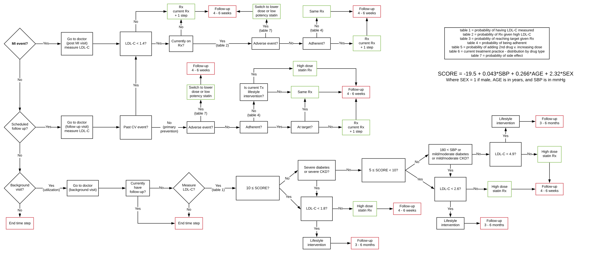

.. _2017_concept_model_vivarium_sanofi_zenon:

=====================================================
Vivarium - Sanofi - Zenon - Simulating lipid lowering
=====================================================

Model Overview
--------------

Objective
+++++++++

The objective is to model and simulate the Public Health Impact of fixed dose combination on LDL cholesterol and ASCVD (Ischemic heart disease, Ischemic stroke) in Brazil, China, France, Spain, and Russia. This includes the intervention targets of reducing deaths and DALYs due to Ischemic Heart Disease and Ischemic Stroke based on the intervention scenario. 

Intervention Definitions
++++++++++++++++++++++++

Business As Usual (BAU) scenario
~~~~~~~~~~~~~~~~~~~~~~~~~~~~~~~~

A baseline scenario projecting current treatment (per location), patient adherence, and trends of LDL-c and ASCVD outcomes, for the current year and five years into the future. (2019-2024). This scenario will be used to compare the two subsequent scenarios. The definition of adherence is the probability of a patient taking their medication 80% of the time. The proportion of patients that are adherent come from literature. More detailed information about adherence and probability of prescription given are included in the Data Artifact and subsequent to change during the development of the Zenon project.

2019 Guidelines with multiple pills scenario
~~~~~~~~~~~~~~~~~~~~~~~~~~~~~~~~~~~~~~~~~~~~

For each of the simulated populations/locations, IHME will run a counterfactual scenario in which all initial variables are identical to the BAU Scenario, but in which treatments follow the ESC 2019 Guidelines using individual components (i.e., multiple pills) for simulants meeting guideline criteria. The same treatment pathway will be applied to all countries based on ESC 2019 Guidelines. The guidelines propose a more proactive treatment than current treatment practices. More information about this scenario and associated adherence to multiple pills treatment can be found in the Treamtent Ramp below and is included in the Data Artifact.

2019 Guidelines with combination single pill scenario
~~~~~~~~~~~~~~~~~~~~~~~~~~~~~~~~~~~~~~~~~~~~~~~~~~~~~

For each of the simulated populations/locations, IHME will run a counterfactual scenario in which all initial variables are identical to '2019 Guidelines with multiple pills scenario', but in which treatments follow the ESC 2019 Guidelines using FDC rather than individual components for simulants meeting guideline criteria. This scenario would include an assumption about the increased adherence to single pill treatment compared to multiple pills. More information about this scenario and the increased adherence to single pill treatment can be found in the Treamtent Ramp below and is included in the Data Artifact.

Questions of Interest
+++++++++++++++++++++

Scope of Modeling
+++++++++++++++++

Concept Model Diagram
---------------------

Model Components
----------------

Time
++++

* Start and end date: **Jan 1, 2020 -- Dec 31, 2024**
* Simulation time step: **28 days** to capture cardiovascular events and treatment timesteps

Demographics
++++++++++++

* Locations: **Brazil, China, France, Italy, Spain, Russia**
* Population: **Prospective open cohort of 40-74 year olds**
* Size of largest starting population: **100,000 simulants**
* Youngest start-age and oldest end-age: **30 - 100 years**
* Exit age (at what age to stop tracking simulants): **101 years**
* Fertility: **Not applicable**

GBD Causes
++++++++++

* :ref:`Ischemic Heart Disease <2017_cause_ischemic_heart_disease>`

* :ref:`Ischemic Stroke <2017_cause_ischemic_stroke>`

GBD Risks
+++++++++

* :ref:`High LDL cholesterol <2017_risk_high_ldl_c>`

PAF-of-1 Cause/Risk Pairs
+++++++++++++++++++++++++

* :ref:`Chronic Kidney Disease (CKD) / Impaired Kidney Function (IKF) <2017_cause_ckd>`

* :ref:`Diabetes Mellitus (DM) / Fasting Plasma Glucose (FPG) <2017_cause_diabetes_mellitus>`

Risk-Outcome Relationships
++++++++++++++++++++++++++

Coverage Gap Framework
++++++++++++++++++++++

Eligible to Treatment Criteria
++++++++++++++++++++++++++++++

Simulants who are eligible to treatment fall in the criteria of: Starting age group of 40 years old or greater. No new treatment would be given to simulants over 75 years old but they continue treatment. 

We will assign treatment to new simulant patients who are currently not on treatment but meet the treatment criteria, based on scenario, and simulants who are currently on treatment but have had a CVD event or meet the treatment criteria to increase dosage. Treatment is not a one-time treatment but is a continuing treatment over 5 years. During the 5 year simulation, treatment for a patient may stay constant or may ramp up, based on the simulant and their LDL-c level, SBP level, or if they have had a CVD event. 

Utilization estimates used in this model are for the average number of outpatient healthcare visits, which will inform the treatment ramp of when a patient will seek care through a visit and get their LDL-c levels measured. The utilization rates are based on GHDx_, 'Global Inpatient and Outpatient Health Care Utilization, Unit Costs, and Costs and Services Needed to Achieve Universal Health Coverage 1990-2016'.

.. _GHDx: http://ghdx.healthdata.org/record/ihme-data/UHC-cost-and-services-2016

Initialization of patients into treatment for BAU
+++++++++++++++++++++++++++++++++++++++++++++++++

We have distributions for the probability of being on Rx given high LDL-C and the probability of control given Rx.
Using GBD data on high LDL-C (LDL-C > 4.9 mmol/L), we will have the population with measured LDL-C above the relevant threshold.  This, however, ignores the portion of the population that would have high LDL-C if they were not currently on medication.  
To correct for this, we do the following:

.. todo::

	Add all equation components as probabilities

:math:`\text{pop with high LDL if Rx did not exist=} \frac{\text{GBD estimate of pop with high LDL}} {\text{(1-prob(Rx|high LDL)} \times\ {\text{prob(control|Rx))}}}`

In BAU, patients will be initialized into “currently on treatment” or “no current treatment” based on the “pop with high LDL if Rx did not exist” and the prob(Rx|high LDL).  This will be inconsistent with reality in the following way: individual simulants that are currently on treatment in reality may not initialize into “currently on treatment” in the simulation – but the total population on treatment should be the same as actual current practice.
Patience that have experienced a CVD event will be on medication with probability 1.
Selection of which Rx a patient currently on treatment is given will be taken from the distribution of “current Rx” data from the literature.  These data are separated into “high potency” and “low potency” statins, and average dose in mg is available from the literature.  So we will initialize randomly the type of statin (or statin + ezetimibe, etc.) and then draw from the distribution of doses for the dose.
New patients will be added to Tx based on utilization data and the probability of having LDL-C tested (from literature).
Rx efficacy data are available from the literature.
The probability of being adherent (defined as > 80% of days covered) is taken from the literature, and is a function of duration on treatment and history of CVD events (past MI = greater adherence).
QUESTION:  how should we initialize adherence?  I.e. since I won’t know how long a simulant has been on treatment at time = 0 in the simulation, I can’t determine their adherence.  SUGGESTION: use average adherence taken over time?
The probability of side effects is also taken from the literature, and if a person experiences a side-effect, it will be assumed that they don’t take their medicine (non-adherent).  

Interventions
+++++++++++++

Both treatment scenarios are based on the CV RISK score, which is a function of Age, Sex and SBP:

SCORE = -16.5 + 0.043*SBP + 0.266*AGE + 2.32*SEX 
wher SEX = 1 if male, AGE is in years, and SBP is in mmHg

There are two caveats involving DM state and CKD state, which are included in the treatment diagram.
New patients will be started on a high dose, high potency statin (max dose of a statin randomly selected from the “high potency” list according to the weighted probability of use for each statin flavor).  
If a patient experiences a side effect, they will wither have their dose cut in half – unless they are at the minimum dose already, in which case they will be given a low potency statin.  If they are not at target, they will combine these changes with addition of ezetimibe.

2019 Guidelines with multiple pills scenario
~~~~~~~~~~~~~~~~~~~~~~~~~~~~~~~~~~~~~~~~~~~~

2019 Guidelines with combination single pill scenario 
~~~~~~~~~~~~~~~~~~~~~~~~~~~~~~~~~~~~~~~~~~~~~~~~~~~~~

Treatment Ramp
++++++++++++++

Business As Usual (BAU) Scenario
~~~~~~~~~~~~~~~~~~~~~~~~~~~~~~~~

Intervention Scenarios (Both scenarios illustrated)
~~~~~~~~~~~~~~~~~~~~~~~~~~~~~~~~~~~~~~~~~~~~~~~~~~~

Desired Model Outputs
---------------------

.. list-table:: Desired Model Outputs
   :widths: 1, 5, 10, 5, 5, 30, 30, 20
   :header-rows: 1

   * - Location name
     - Year
     - Subpopulations
     - Age group
     - Sex 
     - Scenario
     - Outcome
     - Outcome Metric
   * - Brazil 
     - 2020
     - Hypertension (SBP > 140 mmHg)
     - 40-44
     - Male 
     - Business As Usual (BAU)
     - All-cause mortality
     - Rate per 100k 
   * - China
     - 2021
     - Diabetes (FPG > 7.0 mmol/L)
     - 45-49 
     - Female
     - 2019 Guidelines with multiple pills 
     - DALYs by all four causes 
     - Rate per 100k
   * - Italy 
     - 2022
     - Entire Population
     - 50-54
     - Both
     - 2019 Guidelines with combination single pill 
     - YLLS by all four causes
     - Rate per 100k
   * - France
     - 2023
     - Post-ACS
     - 55-59 
     - 
     - 
     - YLDs by all four causes
     - Rate per 100k
   * - Spain 
     - 2024
     - Treated, single drug
     - 60-64
     - 
     -
     - Mean, Standard Deviation for FPG
     - mmol/L
   * - Russia
     - 
     - Treated, multiple drugs
     - 65-69
     -
     -
     - Treatment Coverage
     - Percent 
   * -
     -
     - Not Treated
     - 70-74
     -
     -
     - Monotherapy vs. multiple pills
     - Percent
   * - 
     - 
     -
     - 75+
     -
     -
     - Population achieving target LDL-c
     - Percent 
   * -
     - 
     -
     - 40-74
     -
     -
     - CV risk score
     - Number
   * -
     - 
     -
     - 40-100
     -
     -
     - Proportion of people adherent
     - Percent
   * - 
     - 
     - 
     - 
     -
     -
     - Deaths by four causes
     - Rate per 100k
   * - 
     - 
     -
     -
     -
     -
     - Mean, Standard Deviation for SBP 
     - mmHg 
   * - 
     -
     -
     -
     -
     -
     - Mean, Standard Deviation for LDL-c level
     - mmol/ L
    
Stratification
++++++++++++++

Stratify by **location, age, sex, year, and Subpopulation (listed in Desired Model Outputs)**.

Observers
+++++++++

.. todo::

   Confirm with RT/SE teams if these are the correct observers or if any observers should be removed/added. I added 'FPGTimeSeries', SBPTimeSeries', and 'LDLCTimeSeries' observers to account for the need to be able to provide Mean LDL-C/SBP/FPG value per location/sex/age group/scenario.

- DisabilityObserver()
- MedicationObserver()
- DiseaseCountObserver('ischemic_heart_disease')
- DiseaseCountObserver('ischemic_stroke)
- DiseaseCountObserver('chronic_kidney_disease')
- DiseaseCountObserver('diabetes_mellitus')
- LDLCTimeSeriesObserver()
- FPGTimeSeriesObserver()
- SBPTimeSeriesObserver()
- SimulantTrajectoryObserver()
- LDLCMortalityObserver()

Verification and Validation Strategy
------------------------------------

1. Develop hypothesis about how this model will behave
2. Write assumptions down

.. todo::

   Add assumptions from back-of-the-envelope calculations + preliminary data input validation

3. Check internal consistency - all epi measures (data inputs) agree and produce results that make sense

  * Cause-Specific Mortality Rate (CSMR) = Excess Mortality Rate (EMR) * Prevalence for all causes 

4. Check the model outputs as outside sources

* for location in Brazil, China, France, Italy, Spain, Russia:

* for cause in ischemic_heart_disease, ischemic_stroke, chronic_kidney_disease, diabetes_mellitus:

* for measure in incidence, death, yll, yld, daly, emr, csmr:

* for age_group in 30-34, 35-39, 40-44, 45-49, 50-54, 55-59, 60-64, 65-69, 70-74, 75-79, 80-84, 85-89, 90-94, 95+:

  - Simulate history & check against GBD 2017 
  - model_outputs_location_cause_measure_sex_age_group = gbd_2017__location_cause_measure_sex_age_group

