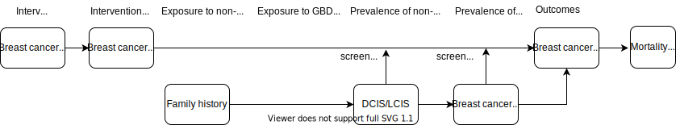

.. role:: underline
    :class: underline

..
  Section title decorators for this document:

  ==============
  Document Title
  ==============

  Section Level 1 (#.0)
  +++++++++++++++++++++
  
  Section Level 2 (#.#)
  ---------------------

  Section Level 3 (#.#.#)
  ~~~~~~~~~~~~~~~~~~~~~~~

  Section Level 4
  ^^^^^^^^^^^^^^^

  Section Level 5
  '''''''''''''''

  The depth of each section level is determined by the order in which each
  decorator is encountered below. If you need an even deeper section level, just
  choose a new decorator symbol from the list here:
  https://docutils.sourceforge.io/docs/ref/rst/restructuredtext.html#sections
  And then add it to the list of decorators above.

.. _2017_concept_model_vivarium_swissre_breastcancer:

====================================
Vivarium CSU Breast Cancer Screening
====================================

Contents: 
	
	+ :ref:`1.0 Background <1.0>`

		* :ref:`1.1 Project overview <1.1>`
		* :ref:`1.2 Literature review <1.2>`
	+ :ref:`2.0 Modelling aims and objectives <2.0>`

	+ :ref:`3.0 Baseline causal framework <3.0>`

		* :ref:`3.1 Causal diagram <3.1>`
		* :ref:`3.2 Effect size <3.2>`
	+ :ref:`4.0 Intervention <4.0>`

		* :ref:`4.1 scenarios <4.1>`
	+ :ref:`5.0 Vivarium modelling components <5.0>`

        * :ref:`5.1 Vivarium concept model diagram <5.1>`

		* :ref:`5.2 Demographics <5.2>`

			- :ref:`5.2.1 Population <5.2.1>`
			- :ref:`5.2.2 Location <5.2.2>`
		* :ref:`5.3 Models <5.3>`

			- :ref:`5.3.1 Model 1: Core breast cancer model <5.3.1>`
			- :ref:`5.3.2 Model 2: Screening and detection model <5.3.2>`
			- :ref:`5.3.3 Model 3: Alternative screening scenarios model <5.3.3>`
			- :ref:`5.3.4 Model 4: Family history model <5.3.4>`
		* :ref:`5.4 Desired outputs <5.4>`
		* :ref:`5.5 Meta-table shell <5.5>`
	+ :ref:`6.0 Limitations <6.0>`

+------------------------------------+
| List of abbreviations              |
+=======+============================+
| DCIS  | ductal carcinoma in situ   |
+-------+----------------------------+
| LCIS  | lobular carcinoma in situ  |
+-------+----------------------------+
| BC    | breast cancer              |
+-------+----------------------------+
| CII   | critical illness insurance |
+-------+----------------------------+
| NCDs  | non-communicable diseases  |
+-------+----------------------------+
| Tx    | treatment                  |
+-------+----------------------------+
| ACMR  | all cause mortality rate   |
+-------+----------------------------+
| MAM   | mammography                |
+-------+----------------------------+
| BUS   | breast ultra sound         |
+-------+----------------------------+

.. _1.0:

1.0 Background
++++++++++++++

.. _1.1:

1.1 Project overview
--------------------

A health insurance provider in China offers routine breast cancer screening for their insurees. The provider also offers critical illness insurance to cover treatment for those if cancer a diagnosis is made. 

The health insurance provider is interested in estimating the yearly number of detected breast cancer cases for their Chinese insured population under specific screening practices to identify the trends that are important to its critical illness insurance product. This will inform their projections of how much they will pay out for different cancer types under different screening coverage rates. 

.. todo::
  
  - add more project Background
  - Is the provider also interested in mortality/morb from breast cancer? if not, then we can delete the mortality/morb dag?

.. _1.2:

1.2 Literature review
---------------------

  - The peak onset age for breast cancer in Chinese women is between 40 and 50 years, which is younger than that in Western countries by 5 to 10 years. (China Anti-Cancer Association 2019)

.. todo::
 maybe just a brief summary of what the literature says about the exposures/outcome/exp-outcome relationship?

  - what is breast cancer?
  - types of breast cancer?
  - risk factors for breast cancer? 
  - why breast cancer screening
  - predictors of breast cancer screening
  - types of breast cancer screening 

.. _2.0:

2.0 Modeling aims and objectives
++++++++++++++++++++++++++++++++

To estimate the yearly number of cases of breast cancer detected per 100,000 insured population under specific screening practices in order to identify pay-out trends for critical insurance claims (CII).  

.. _3.0:

3.0 Causal framework
++++++++++++++++++++

.. _3.1:

3.1 Causal diagram
------------------

  .. image:: causal_dagmodel_all.svg

**Outcome (O)**:

  - (1) Breast cancer diagnosis/detection stage 0, 1+
  - (2) Mortality and morbidity

**Most proximal determinant/exposure (E)**:
  
  - (1) Breast cancer status
  - (2) Screening 

**Confounders (C)**:

  - age
  - sex

**Effect modifiers**:

  -
  -

**Mediators (M)**:

  -
  -

.. _3.2:

3.2 Effect sizes
----------------

.. _4.0:

4.0 Intervention
++++++++++++++++

Scale-up of breast cancer screening coverage among insured population 

.. _4.1:

4.1 Simulation scenarios
------------------------

:underline:`Baseline scenario`

30% of insured Chinese female initiate breast cancer screening in 2020 and hold constant to 2040 for selected provinces, where

  * 30 to 69 year olds with family history are provided with MRI every year;
  * 30 to 44 year olds with previous treatment of DCIS but not family history are provided with ultrasound every year;
  * 45 to 69 year olds with previous treatment of DCIS but not family history are provided with ultrasound and mammography every year;
  30 to 69 year olds at average risk (no family history nor previous treatment of DCIS) are given mammography every two years.

:underline:`Alternative scenario`

30% of insured Chinese female initiated breast cancer screening in 2020, project to 75% by 2030 and hold constant till 2040 for selected provinces, where:

  * same screening mechanisms as compared to baseline for different age groups and risk exposure level.

.. note::

 high-risk population for breast cancer are women 

  ● with a family history of breast cancer (such that parent, sibling, or child with BRCA1/BRCA2 gene mutation or breast cancer).
  ● with ductal/lobular carcinoma in-situ

 -  GBD risk factors including BMI, smoking, and FPG are not used to determine the high-risk population for breast cancer.

 - Initial screening coverage is a flexible number greater than 22.5%.

 - The target screening coverage is fixed to 75% based on UK setting. 
  
 - Should we apply screening guidelines proposed by SR?

.. _5.0:

5.0 Vivarium modelling components
+++++++++++++++++++++++++++++++++

.. _5.1:

5.1 Vivarium concept model 
--------------------------

.. _5.2:

5.2 Demographics
----------------

.. _5.2.1:

5.2.1 Population description
~~~~~~~~~~~~~~~~~~~~~~~~~~~~

* Cohort type: Closed cohort of 100,000 insured male (50%) and female (50%) simulants
* Age and sex: Aged 15 to 95+, 5 year-age bands, uniformly distributed age and sex structure
* Time span: Jan 1, 2020 to Dec 31, 2040 with 30-day time-steps. 

.. _5.2.2:

5.2.2 Location description
~~~~~~~~~~~~~~~~~~~~~~~~~~

*Potential* provinces to model include Tianjin, Jiangsu, Guangdong, Henan, and Heilongjiang (optional). The same population distribution of age and sex will be used among the different provinces.

+--------------------------------------------------------------------------------------------------------+
| Population size weight table                                                                           | 
+============+=============+========+===============+====================================================+
| Province   | location_id | Weight | Weighted ACMR | Forecasted ACMR in log space                       |
+------------+-------------+--------+---------------+----------------------------------------------------+
| Tianjian   |  517        | 18%    | e^(mr) x 0.18 | filepath                                           |
+------------+-------------+--------+---------------+ :download:`asmr<filepaths_acmr_c294_forecast.xlsx>`|                                             
| Jiangsu    |  506        | 28%    | e^(mr) x 0.28 |                                                    |
+------------+-------------+--------+---------------+ Note: GBD does not produce estimates below         |
| Guangdong  |  496        | 22%    | e^(mr) x 0.22 | province level, so we do not have data for         |
+------------+-------------+--------+---------------+ sub-provinces. Therefore, we are summing           |
| Henan      |  502        | 16%    | e^(mr) x 0.16 | the sub-province weights (not shown) that was      |
+------------+-------------+--------+---------------+ given by CSU to get total province weights         |
| Heilong-   |  501        | 16%    | e^(mr) x 0.16 | for Guangdong and Heilongjiang.                    |
| jiang      |             |        |               |                                                    |
+------------+-------------+--------+---------------+----------------------------------------------------+

.. note::

  Note about 'mr' in the column 'Weighted ACMR' in the above table: The forecasted data is stored in .nc files. The acmr estimate under column labelled as 'mr' is in log space with base natural e. To get the simulation population's all-cause mortality rate (acmr), first take the exponential of the mr values for location in the .nc files, then mulitply by the population weight, and sum over all locations. The unit after the exp transformation is in person years. Multiply by 100,000 to get per 100,000 person years.    

.. _5.3:

5.3 Models
----------

.. _5.3.1:

5.3.1 Core breast cancer model 
~~~~~~~~~~~~~~~~~~~~~~~~~~~~~~

see :ref:`breast cancer model with stage 0<2017_cancer_model_breast_cancer_with_stage_0>`

Click here to see notebook exploring the forecasted data .nc files: :ref:`forecast data <  >`   

.. _5.3.2:

5.3.2 Screening and detection model
~~~~~~~~~~~~~~~~~~~~~~~~~~~~~~~~~~~

:underline:`I. Screening algorithm`

Breast cancer screening algorithm was derived from the 2019 guidelines from the China Anti-Cancer Association and National Clinical Research Center for Cancer. All simulants will follow this decision tree to decide if they are due a screening. The decision tree branches according to:  

   1) Sex
   2) Age 
   3) Family history
   4) With diagnosis of DCIS/LCIS 

  .. image:: breast_cancer_screening_tree_China2.svg

+--------------------------------------------------------------------------------------------------+
| Screening branches                                                                               | 
+========+========+=======+==========+===========+=====================+=============+=============+
| Branch | Sex    | Age   | Family   | With DCIS | Screening           | Sensitivity | Specificity |
|        |        | group | history  | or LCIS   | tech                |             |             |
+--------+--------+-------+----------+-----------+---------------------+-------------+-------------+
| A      | Female | 30-69 | Yes      | either    | MRI, every year     | 91%         | 100%        |
+--------+        +-------+----------+-----------+---------------------+-------------+-------------+                                             
| B      |        | 30-44 | No       | Yes       | BUS, every year     | 73.7%       | 100%        |      
+--------+        +-------+----------+-----------+---------------------+-------------+-------------+   
| C      |        | 45-69 | No       | Yes       | MAM+BUS, every year | 93.9%       | 100%        |      
+--------+        +-------+----------+-----------+---------------------+-------------+-------------+    
| D      |        | 30-69 | No       | No        | MAM, every 2 years  | 84.8%       | 100%        |
+--------+        +-------+----------+-----------+---------------------+-------------+-------------+    
| E      |        | <30   | either   | either    | No screening                                    |
|        |        | or 70+|          |           |                                                 |
+--------+--------+-------+----------+-----------+-------------------------------------------------+
| F      | Male   | any   | either   | either    | No screening                                    |
+--------+--------+-------+----------+-----------+-------------------------------------------------+
| MAM: mammography; BUS: breast ultrasound                                                         |
| sensitivity and specficity here refers to the entire screening series. We expect the specificity |
| to be 100% (no 'false positives') as a biopsy will likely be done before a cancer diagnosis      | 
+--------------------------------------------------------------------------------------------------+
 
 

.. note:: 
  see :download:`breast cancer screening memo <breast_cancer_screening_memo.docx>` for more in depth explanation how modelling decisions were adpated from guidelines, as well as assumptions and limitations of these modelling decisions. 

:underline:`II. Probability of attending screening`

 - 1) All simulants will be due a screening according to their attributes in the decision tree
 - 2) Probability of simulants attending their first due screening is 30% (SD=0.3). *Note: this is the parameter we vary in the scale-up scenario* 
 - 3) If a simulant attended their last screening, they have 1.89 (95%CI 1.06-2.49) (Yan et al 2017) more odds of attending the next screening than those who did not attend their last screening. 

+---------------------------------------------------------+
| Hypothetical cross-sectional 2x2 table                  |
+----------------+-------------+---------------+----------+
|                | Attended    |Did not attend | Total    |
|                | last screen |last screen    |          |
+----------------+-------------+---------------+----------+
| Attends        |  a          |  b            | a+b      |
| screening      |             |               |          |
+----------------+-------------+---------------+----------+
| Does not attend|  c          |  d            | c+d      |
| screening      |             |               |          |
+----------------+-------------+---------------+----------+
|                | a+c         | b+d           | a+b+c+d  |
+----------------+-------------+---------------+----------+ 

      (1) :math:`P(\text{attended last screen}) = \frac{a+c}{a+b+c+d}` = 30% (SD 0.3%)
      (2) :math:`P(\text{attends screening}) = \frac{a+b}{a+b+c+d}`  = 30% (SD 0.3%)
      (3) OR = :math:`\frac{a/c}{b/d}=\frac{ad}{bc}` = 1.89 (95%CI 1.06-2.49)
      (4) a+b+c+d = 1

.. code-block:: Python

  1. Solve for a, b, c, d by first solving the following quadratic equation:

  (OR-1)b^2 + b - P(1-P) = 0 

  Once you obtain b, then
  | c=b
  | a=P-b
  | d=(1-P)-b

Using OR value of 1.89 and P as 0.3

  - a = 0.11912
  - b = 0.18088
  - c = 0.18088
  - d = 0.51912

  
*if OR came from a cross-sectional study, then use this set of values*
:math:`P(\text{attends screening among those who attended last screen}) = \frac{a}{a+c}` = 39.7%
:math:`P(\text{attends screening among those who did not attend last screen}) =\frac{b}{b+d}` = 25.8%

.. todo::
  Describe the Yan et al cross-sectional study that produced the OR, and the potential biases

.. note::
  - For now, use normal distibutions with 1% SD around the mean for all parameters i.e. for probability of attending screening, mean is 30%, so please use draws from distribution Normal(mean=30%,SD=0.3)
  - These values are mainly placeholders for now, they may chance. Probability simulant attends first screening is was found to be 22.5% (95%CI 20.4-24.6%) among the general population in Bao et al 2017. We may want to use a slightly higher attendence coverage of ~30% because we believe it might be higher in the population with critical insurance coverage. More research needs to be done to investigate how much higher. 

:underline:`III. Time to next scheduled screening`
 
 - scheduled time to next screening based on algorithm tree irregardless of whether they attended screening. 
 - For those who are in Branch A, B, C (yearly screening): truncated normal distribution with mean 364 days, SD +/- 156 days, lower limit is 100 days, upper limit is 700 days
 - for those in Branch D (every two years screening): truncated normal distribution with mean 728 days, SD +/- 156 days, lower limit is 200 days, upper limit is 1400 days

 .. todo:: 

    - (upload notebook exploring Marketscan data that informed the distribution paratmers)

    - I'm wondering if the upper and lower limits of the truncated normal distributions should be narrower? What we are modelling here are the 'guideline times' to next screening, hence shouldn't they fall within the bounds of 1 year or 2 years according to the screening tree? Currently for someone who is in branch A, B, or C and supposed to have yearly screens, their next scheduled screen can be as far in the future as two years (with an upper bound of 700 days). 

    - I'm wondering if the Marketscan data, where we got the empirical distributions from, is giving us the time interval between screens that the patient actually showed up to? (which in our model is a combintation of time to next scheduled screening + probabiltiy of showing up)

.. _5.3.3:

5.3.3 Alternative screening scenarios model
~~~~~~~~~~~~~~~~~~~~~~~~~~~~~~~~~~~~~~~~~~~

| **Baseline**: breast cancer screening uptake of 30% among insured population from 2020-2040
| **Alternative scenario**: breast cancer screening uptake of 30% among insured population from 2020-2021, then linear increase to 75% by 2030 and hold constant until 2040

.. image:: screening_scale_up_figure.svg

 .. todo:: 
  -More work needs to be done to finalize a baseline screening uptake value. Right now the 30% comes from a 22.5% screening uptake in the general population by Bao et a 2018. We believe the insured population would have a higher screening uptake than the general population.     

.. _5.3.4:

5.3.4 Family history model
~~~~~~~~~~~~~~~~~~~~~~~~~~

  - family history (non-GBD)
  - (history of breast cancer<--do we want to model this?) 

  .. todo::
    - distribution of family history
    - relative risk of family history and breast cancer DCIS/LCIS and stage 1+?

  .. note:: 
    - GBD risk factors will not be modelled

.. _5.3.5:

5.3.5 DCIS and LCIS treatment model
~~~~~~~~~~~~~~~~~~~~~~~~~~~~~~~~~~~

.. _5.4:

5.4 Desired outputs
-------------------

.. _5.5:

5.5 Output meta-table shell
---------------------------

:download:`output table shell<output_table_shell_breastcancer.xlsx>`

.. todo::
  any special stratifications?

.. _6.0:

6.0 Back-of-envelope calculations
+++++++++++++++++++++++++++++++++

.. _7.0:

7.0 Limitations
+++++++++++++++

a.  How to incorporate the health utilization estimates when building the screening algorithm?
b.  Which one is suitable for vivarium software settings, one model with all cancer sites included or five separate models to study the screening impact on cancer outcomes.?
c.  How to capture the change of risk exposure level or screening coverage switching from general population to insured population? (e.g. 20% less of smoking prevalence for insured population)
d.  What’s our approach known that GBD does not have separate clinical mapping for cervical versus uterine for benign and in situ cervical and uterine neoplasms?
e.  How do we design a scenario that initiates the commercial screening like liquid biopsy to all cancer sites?
f.  What kind of histopathological test exists for further cell analysis after a positive screening? <- Could we include false positives in the simulation?
g.  Does cancer always progress through the cancer in-situ (non-invasive) stage to the malignant stages? If that is true, can we backout the incidence of developing non-invasive/stage 0 cancer?
h.  Can we stratify the screening results like sensitivity and specificity by cancer stages?
