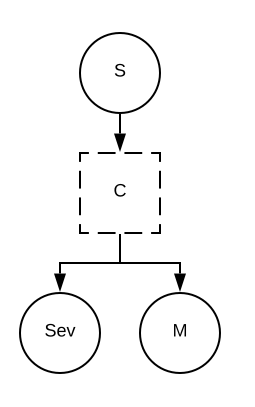

.. _2017_cause_diabetes_mellitus:

======================
Diabetes Mellitus (DM)
======================

WHO defines Diabetes Mellitus (DM) as a chronic, metabolic disease characterized by elevated levels of blood glucose (or blood sugar), which leads over time to serious damage to the heart, blood vessels, eyes, kidneys, and nerves. The most common is type 2 diabetes, usually in adults, which occurs when the body becomes resistant to insulin or doesn't make enough insulin. In the past three decades the prevalence of type 2 diabetes has risen dramatically in countries of all income levels. Type 1 diabetes, once known as juvenile diabetes or insulin-dependent diabetes, is a chronic condition in which the pancreas produces little or no insulin by itself. [WHO-Diabetes-Definition]_

GBD 2017 Modeling Strategy
--------------------------

According to GBD 2017, the case definitions and diagnostic criteria for overall diabetes mellitus, type 1 diabetes mellitus, and type 2 diabetes mellitus are presented differently. The overall diabetes mellitus model is defined as fasting plasma glucose (FPG) > 126 mg/dL (7 mmol/L) or being on treatment for diabetes. The overall type 1 diabetes mellitus model is defined as cases of DM that are on insulin or diagnosed with a biomarker (eg, c-peptide levels) that is not fasting plasma glucose. Type 2 diabetes mellitus cases are those that are not reported as type 1 diabetes mellitus. [GBD-2017-YLD-Capstone-Appendix-1-Diabetes-Mellitus]_

Fasting Plasma Glucose (FPG) in GBD 2017 
++++++++++++++++++++++++++++++++++++++++

GBD 2017 predicted mean FPG from diabetes prevalence using an ensemble distribution. GBD 2017 also used the ensemble distribution methodology to estimate the prevalence of diabetes based on mean FPG in locations where data on prevalence of diabetes were not available. 

Other measures of blood sugar to estimate diabetes in GBD 2017
++++++++++++++++++++++++++++++++++++++++++++++++++++++++++++++

GBD 2017 incorporated all available data related to population-representative estimates of diabetes, so other measures of blood sugar (glycated hemoglobin A1c, oral glucose tolerance test, post-prandial glucose test) were used to define diabetes and mean fasting plasma glucose (FPG) in a population when data on diabetes were not available as data inputs. 

Cause Hierarchy
+++++++++++++++
.. image:: cause_hierarchy_dm.svg

Restrictions
++++++++++++

The following table describes any restrictions in GBD 2017 on the effects of this cause (such as being only fatal or only nonfatal), as well as restrictions on the ages and sexes to which the cause applies. If sub cause restrictions vary, then the conflicting restrictions are noted below. 

.. list-table:: GBD 2017 Cause Restrictions
   :widths: 15 15 20
   :header-rows: 1

   * - Restriction Type
     - Value
     - Notes
   * - Male only
     - False
     -
   * - Female only
     - False
     -
   * - YLL only
     - False
     -
   * - YLD only
     - False
     -
   * - YLL age group start (DM Type 1)
     - Early Neonatal
     - (0, 6 days], age_group_id = 2
   * - YLL age group start (DM Type 2)
     - 15 to 19
     - (15, 19], age_group_id = 8
   * - YLL age group end
     - 95 plus
     - (95, 125], age_group_id = 235
   * - YLD age group start
     - Early Neonatal
     - (0, 6 days], age_group_id = 2
   * - YLD age group end
     - 95 Plus
     - (95, 125], age_group_id = 235

Vivarium Modeling Strategy
--------------------------

Scope
+++++

The aspects of the disease this cause model is designed to simulate is the basic structure of the disease, its sub causes, associated measures (deaths, prevalence, incidence, emr), associated sequelae, and associated disability weights. This cause model is designed differently, with a transient disease state titled 'With Condition' based on incidence of diabetes. From there, the sub causes and sequelae are categorized within either a 'moderate' or 'severe' diabetes state. Across the 2 diabetes sub causes, some of the associated sequelae will either be grouped into the 'Moderate' or 'Severe' diabetes state.  The 'uncomplicated' sequelae for diabetes mellitus type 1 & type 2 are included in the 'Moderate' diabetes state, which are designated as non-fatal only and include only YLDs. The sequelae which map to 'Severe' diabetes state include all other sequelae. These sequelae are fatal and include YLLs and YLDs. The assocaited sequelae in each state can be found below in the 'State Severity Split Definitions' table.

Vivarium Modeling Strategy for Risk Factor FPG
++++++++++++++++++++++++++++++++++++++++++++++

This cause model is designed to simulate the basic structure of the risk factor (FPG) continuous exposure ensemble distribution model. The FPG distribution will range, starting at the theoretical minimum-risk exposure level (TMREL) of 4.5-5.4 mmol/L to the maximum FPG value for each location/sex/age group. For simulants that are in 'Susceptible' state in the vivarium model, the model will randomly draw a value of FPG that is equal to or less than the TMREL and less than  7.0 mmol/L (case definition for 'With Condition' of overall diabetes mellitus). For simulants that are 'With condition' of Diabetes, the model will randomly draw a value of FPG that is equal to or greater than 7.0 mmol/L.

Assumptions and Limitations
+++++++++++++++++++++++++++

1. In vivarium, 'uncomplicated DM Type 1 and Type 2' is 'Moderate', which is different from how GBD 2017 is modelling it. In the future, severity splits will be revisited using disability weights. 

3. EMR is greater than zero for severe diabetes only.

4. Case definition cross-walks on FPG and HbA1c: GBD 2017 assumed that HbA1c >6.5% was equivalent to FPG >126 mg/dL.

Cause Model Diagram
-------------------

Data Description
----------------

State and Transition Data Tables
++++++++++++++++++++++++++++++++

.. list-table:: State Definitions
   :widths: 1, 10, 10
   :header-rows: 1

   * - State
     - State Name
     - Definition
   * - S
     - **S**\ usceptible
     - Susceptible to Diabetes Mellitus
   * - C
     - With **C**\ ondition of Diabetes Mellitus
     - Transient with condition
   * - M
     - **M**\ oderate
     - Simulant is with condition of Uncomplicated Diabetes Mellitus, based on 'uncomplicated' sequelae of Diabetes Mellitus Type 1 and Type 2
   * - Sev
     - **S**\ evere
     - Simulant is with condition of Severe Diabetes Mellitus, based on all other sequelae of Diabetes Mellitus Type 1 and Type 2

.. list-table:: State Severity Split Definitions
   :widths: 5 10 10 
   :header-rows: 1

   * - State
     - State Name
     - Definition
   * - S
     - **S**\ usceptible
     - Susceptible to Diabetes Mellitus
   * - C
     - With **C**\ ondition of Diabetes Mellitus
     - :math:`\displaystyle{\sum_{s\in \text{sequelae_c587}}}`
   * - M
     - **M**\ oderate
     - sequelae_mod = [s_5441, s_5465]
   * - Sev
     - **S**\ evere
     - sequelae_sev = [s_5429, s_5432, s_s5435, s_5438, s_5444, s_5447, s_5450, s_5453, s_5456, s_5459, s_5462, s_5468, s_5471, s_5474]

.. list-table:: State Data
   :widths: 5 10 10 20
   :header-rows: 1

   * - State
     - Measure
     - Value
     - Notes
   * - S
     - simulants not prevalent with overall Diabetes Mellitus
     - 1 - prevalence_c587
     - 
   * - C 
     - prevalence
     - 0
     - 
   * - M 
     - prevalence
     - :math:`{\sum_{s\in \text{prevalence_sequelae_mod.sub_causes.c587}}}` 
     - = (prevalence of Diabetes Mellitus Type 1 uncomplicated sequelae + prevalence of Diabetes Mellitus Type 2 uncomplicated sequelae  
   * - Sev
     - prevalence
     - :math:`{\sum_{s\in \text{prevalence_sequelae_sev.sub_causes.c587}}}`
     - = (prevalence of Diabetes Mellitus Type 1 all other sequelae (not including uncomplicated) + prevalence of Diabetes Mellitus Type 2 all other sequelae (not including uncomplicated)
   * - Sev
     - excess mortality rate (EMR) for severe DM 
     - :math:`\frac{\text{CSMR_c587}}{\sum_{s\in \text{prevalence_sequelae_sev.sub_causes.c587}}}`
     - = (cause-specific mortality rate of DM) / sum of prevalence of severe DM sequelae
   * - M
     - excess mortality rate (EMR) of moderate DM
     - 0
     - EMR for Moderate DM is 0, given the assumption that moderate DM is non-fatal only. 
   * - M
     - disability_weight
     - :math:`\frac{{\sum_{s\in \text{sequelae_mod}}} \scriptstyle{\text{disability_weight}_s \times\ \text{prevalence}_s}}{\text{prevalence_c587}}`
     -
   * - Sev
     - disability_weight
     - :math:`\frac{{\sum_{s\in \text{sequelae_sev}}} \scriptstyle{\text{disability_weight}_s \times\ \text{prevalence}_s}}{\text{prevalence_c587}}`
     -
   * - All
     - cause-specific mortality rate (csmr)
     - :math:`\frac{\text{deaths_c587}}{\text{population}}`
     - 

.. list-table:: Data Sources and Definitions
   :widths: 10 10 20 20
   :header-rows: 1

   * - Variable
     - Source
     - Description
     - Notes
   * - prevalence_c587
     - dismod
     - prevalence of overall diabetes mellitus
     -
   * - deaths_c587
     - codcorrect
     - Count of deaths due to overall Diabetes Mellitus
     - 
   * - population
     - demography
     - Mid-year population for given sex/age/year/location
     - 
   * - prevalence_s{sid}
     - dismod
     - Prevalence of sequela with id {id}
     - 
   * - disability_weight_s{sid}
     - YLD appendix
     - Disability weight of sequela with id {id}
     - 
   * - incidence_c587
     - como
     - Incidence of overall diabetes mellitus
     -  

Validation Criteria
-------------------

Model Validation
++++++++++++++++

Check the logical structure and input data for concept model, make sure that 

  * the theories and assumptions underlying the conceptual model are correct
  * the data to build, evaluate, and test the model are correct

Logic
+++++

* Parent cause is the sum of child causes and/or the sum of sequela 

  * Fatal: Deaths (CSMR, Excess MR), YLLs

  * Non-fatal: YLDs, Prevalence, Incidence

  * DALYS = YLLs + YLDs 

* By location-/age-/sex-

1. Sum of prevalence of sequela of Diabetes Mellitus sub_causes = prevalence of Diabetes Mellitus

References
----------

.. [WHO-Diabetes-Definition]
    Retrieved 30 Jan 2020.
    https://www.who.int/health-topics/diabetes

.. [GBD-2017-YLD-Capstone-Appendix-1-Diabetes-Mellitus]
    Supplement to: `GBD 2017 Disease and Injury Incidence and Prevalence
    Collaborators. Global, regional, and national incidence, prevalence, and
    years lived with disability for 354 diseases and injuries for 195 countries
    and territories, 1990–2017: a systematic analysis for the Global Burden of
    Disease Study 2017. Lancet 2018; 392: 1789–858`
    (pp. 559-572)