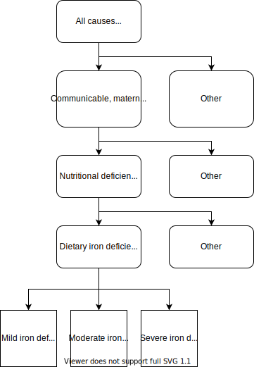

.. _2017 cause iron deficiency:

================================================
Dietary Iron Deficiency (Iron Deficiency Anemia)
================================================

Disease Description
-------------------

Generally, **anemia** is a condition defined by a deficiency of red blood cells 
or a deficiency of hemoglobin in the blood. Anemia is typically classified by 
hemoglobin concentrations below a defined threshold that varies by age and sex. 
Severity of anemia is similarly classified according to ranges of hemoglobin 
concentrations. Anemia is associated with increased morbidity and mortality and 
symptoms of anemia often include weakness, fatigue, and difficulty 
concentrating [Kassebaum-et-al-2016]_.

 Notably, anemia may be caused by many diverse factors. Examples of factors 
 that may cause anemia include genetic mutations in hemoglobin genes, acute or 
 chronic blood loss, altered red blood cell morphology, inadequate nutritional 
 intake, and others [Kassebaum-et-al-2016]_.

**Iron deficiency anemia** is a type of anemia that is due to insufficient 
iron levels, which lead to a deficiency of hemoglobin in the blood. Notably, 
iron deficiency anemia can occur when dietary intake of iron is insufficient, 
although it may occur in other situations as well, such as when iron is lost 
through bleeding (ex: menstrual disorders, hookworm disease, etc.). Iron 
deficiency anemia is the most common cause of anemia globally in most 
populations.

**Dietary iron deficiency anemia** is a specific type of iron deficiency anemia 
that is due to inadequate dietary intake of iron, leading to inadequate iron 
levels in the body and a subsequent deficiency of hemoglobin in the blood.

Modeling Iron Deficiency in GBD 2017
------------------------------------

In GBD 2017, there is an anemia *impairment* that represents **all** forms of 
anemia that are attributable to several causes, including causes such as 
hemoglobinopathies and hemolytic anemias that are not considered iron 
deficiency anemias.

The dietary iron deficiency *cause* is a population attributable fraction (PAF) 
of 1 cause with the iron deficiency risk factor. This means that 100% of the 
dietary iron deficiency cases are attributable to the iron deficiency risk 
factor. Notably, the iron deficiency risk factor affects maternal disorder 
causes, although these relationships are outside of the scope of this document.

Anemia Impairment
+++++++++++++++++

The anemia impairment in GBD 2017 represents the total prevalence of anemia due 
to all causes modeled in GBD (ex: dietary iron deficiency anemia, anemia due to 
maternal hemorrhage, sickle cell anemia, etc.). Estimating the total prevalence 
of the anemia impairment for a given population is the first step in modeling 
anemia in GBD 2017. This is done by fitting a distribution of hemoglobin levels 
for that population from primary input data based on the population's 
hemoclobin concentration mean and standard deviation. For GBD 2017, an ensemble 
distribution was used, which was 40% gamma and 60% mirror gumbel. Source code 
for this process is available `here <https://stash.ihme.washington.edu/projects/MNCH/repos/anemia/browse/model/envelope>`_.

Once a distribution is fit to hemoglobin levels for a particular age-, 
sex-, and location-specific demographic group, the prevalence of anemia (by 
severity level) in each group is determined by the WHO hemoglobin thresholds 
defined in the following table.

.. _above:

.. list-table:: WHO Hemoglobin Thresholds (g/L) [Kassebaum-et-al-2016]_
	:widths: 15, 15, 15, 15
	:header-rows: 1

	* - Group
	  - Mild Anemia
	  - Moderate Anemia
	  - Severe Anemia
	* - Males and Females <1 month
	  - 150
	  - 130
	  - 90
	* - Males and Females 1 month - 4 years
	  - 110
	  - 100
	  - 70
	* - Males and Females 5-14 years
	  - 115
	  - 110
	  - 80
	* - Males 15+ years
	  - 130
	  - 110
	  - 80
	* - Females 15+ years, non-pregnant 
	  - 120
	  - 110
	  - 80
	* - Females 15+ years, pregnant
	  - 110
	  - 80
	  - 70

.. note::

	The threshold values in this table are **not** inclusive. For instance, if 
	a male less than one month old has a hemoglobin level of exactly 130 g/L, 
	he is not considered mildly anemic. If he has a hemoglobin level of 129 g/
	L, he is considered moderately anemic.

The prevalence of anemia as calculated in the process described above serves as 
the overall anemia envelope for a age-, sex-, and location-specific demographic 
groups, and prevalent cases of anemia in the anemia envelope are then causally 
attributed to various causes in GBD 2017 that have anemia as seqeulae. This is 
done through a process described in the [GBD-2017-YLD-Appendix-IDA]_. Notably, 
the causes iron deficiency anemia, other infectious diseases, other neglected 
tropical diseases, other hemoglobinopathies andhemolytic anemias, and other 
endorcine, nutrition, blood, and immune disorders are not directly modeled via 
the causal attribution process. Rather, these causes were allocated to the 
residual anemia envelope following the causal attribution process for all other 
anemic causes [GBD-2017-YLD-Appendix-IDA]_. A minimum of 10% of all anemia was 
assigned to residual categories (a figure selected based on data from the 
United States) [GBD-2017-YLD-Appendix-IDA]_.

Notably, early neonatal and late neonatal age groups (age group IDs 2 and 3) 
are excluded from this process; instead, these age groups are assigned the 
anemia prevalence from the postneonatal age group (age group ID 4).

Additionally, a pregnancy correction is performed for women of reproductive 
age. Therefore, additional considerations beyond the scope of the current 
documentation will need to be made if planning to model hemoglobin among women 
of reproductive age.

Dietary Iron Deficiency Cause
+++++++++++++++++++++++++++++

The dietary iron deficiency cause in GBD 2017 is 100% attributable to the 
iron deficiency risk factor. The dietary iron deficiency cause in GBD is a 
YLD-only cause, meaning that it contributes to morbidity, but not mortality.

Modeling Strategy for the Dietary Iron Deficiency Cause
^^^^^^^^^^^^^^^^^^^^^^^^^^^^^^^^^^^^^^^^^^^^^^^^^^^^^^^

As noted above, the dietary iron deficiency cause in GBD 2017 is not modeled 
directly. Rather, it is assigned to a portion of the residual anemia envelope 
following causal attribution of other anemic causes.

Cause Hierarchy
^^^^^^^^^^^^^^^

Health States and Sequela
^^^^^^^^^^^^^^^^^^^^^^^^^

The sequela associated with the dietary iron deficiency cause in GBD 2017 
include mild iron deficiency anemia, moderate iron deficiency anemia, and 
severe iron deficiency anemia. The severity of iron deficiency anemia is 
determined by the WHO age- and sex- specific hemoglobin concentrations, as 
described in the table above.

Iron Deficiency Risk Factor
+++++++++++++++++++++++++++

In GBD 2017, the iron deficiency risk factor is used for two applications. The 
first is the PAF of 1 relationship with the dietary iron deficiency anemia 
cause and the second is a risk outcome relationship with maternal disorder 
causes. 

Notably, the iron deficiency risk factor in GBD 2017 represents the **age-, 
sex-, and location-specific mean hemoglobin concentration among the total 
population.** The mean value for the iron deficiency risk factor is 
stored under modelable entity ID 10487 (also REI ID 95) and the standard 
deviation is stored under modelable entity ID 10488. The iron deficiency risk 
factor (population hemoglobin concentration) follows a 40% gamma and 60% mirror 
Gumbel ensemble distribution. 

NOTE:

	The values stored in the iron deficiency risk factor (i.e. population  
	hemoglobin concentration parameters) are used in the GBD modeling process 
	to calculate risk-deleted population hemoglobin concentration where the 
	risk is all iron deficiency (i.e. iron responsive anemias), which serves as 
	the population TMREL, in order to calculate the population attributable 
	fraction between the iron deficiency risk factor and maternal disorder 
	causes. See the GBD 2017 Risk Factor Methods Appendix for more information. 
	However, this process is not relevant for the simulation science team use 
	of the iron deficiency risk factor as it relates to the dietary iron 
	deficiency cause in GBD 2017.

.. todo::

	Add citation for the GBD risk factor methods appendix.

Risk Factor Hierarchy
^^^^^^^^^^^^^^^^^^^^^

.. image:: iron_risk_hierarchy.svg

Iron Responsive Anemias in GBD 
++++++++++++++++++++++++++++++

Notably, not all causes of anemia in the GBD anemia impairment are considered 
iron responsive (i.e. will respond to iron supplementation). A list of causes 
with iron responsive anemia health states along with their cause and 
anemia-afflicated sequelae IDs are included in the table below.

.. list-table:: Iron Responsive Anemia Causes 
	:widths: 40 40 40
	:header-rows: 1

	* - Cause
	  - Cause ID
	  - Anemia-Afflicated Sequela ID
	* - Dietary Iron Deficiency
	  - 390
	  - 206, 207, 208
	* - Endocrine, Metabolic, Blood, and Immune Disorders
	  - 619
	  - 537, 538, 539
	* - Uterine Fibroids
	  - 604
	  - 1106, 1107, 1108
	* - Other Gynecological Diseases
	  - 612
	  - 525, 526, 527
	* - Hookworm disease
	  - 363
	  - 172, 173, 174
	* - Schistosomiasis
	  - 351
	  - 144, 145, 146
	* - Other Neglected Tropical Diseases
	  - 365
	  - 177, 178, 179
	* - Other Unspecified Infectious Diseases
	  - 408
	  - 240, 241, 242
	* - Maternal Hemorrhage
	  - 367
	  - 182, 183, 184
	* - Vitamin A Deficiency
	  - 389
	  - 5393, 5396, 5399
	* - Peptic Ulcer Disease
	  - 527
	  - 4952, 4955, 4958, 4961, 4964, 4967, 4976, 4979, 4982, 5627, 5630, 5633, 7202, 7205, 7208
	* - Gastritis and Duodenitis
	  - 528
	  - 4985, 4988, 4991, 4994, 4997, 5000, 5009, 5012, 5015, 5678, 5681, 5684, 7214, 7217, 7220
	* - Chronic Kidney Disease
	  - 589 (591, 592, 593, 997, 998)
	  - 1004, 1005, 1006, 1008, 1009, 1010, 1012, 1013, 1014, 1016, 1017, 1018, 1020, 1021, 1022, 1024, 1025, 1026, 1028, 1029, 1030, 1032, 1033, 1034, 1361, 1364, 1367, 1373, 1376, 1379, 1385, 1388, 1391, 1397, 1400, 1403, 1409, 1412, 1415, 1421, 1424, 1427, 1433, 1436, 1439, 1445, 1448, 1451, 5213, 5216, 5219, 5222, 5225, 5228, 5237, 5240, 5243, 5246, 5249, 5252, 5261, 5264, 5267, 5270, 5273, 5276

.. note::

	According to the GBD modelers, ESRD - Dialysis, Crohn's disease, and 
	ulcerative colitis were also included in this list, although there do not 
	appear to be results for these causes in GBD 2017. Additionally, according 
	to the GBD modelers, cirrhosis should be included in this list, although 
	there do not appear to be any anemia-afflicted sequelae with results in 
	GBD 2017 within any of the cirrhosis causes.

Vivarium Modeling Strategy
--------------------------

Model Scope
+++++++++++

The scope of the Vivarium modeling strategy detailed in this document is to 
sample the hemoglobin concentration for an individual simulant (who is not a 
woman of reproductive age) and evaluate if that simulant's hemoglobin 
concentration will respond to iron supplementation (iron responsive). 

The modeling strategy detailed in this document aims to evaluate *all* iron 
responsive anemias rather than dietary iron deficiency anemia, specifically. 
However, the modeling strategy can be modified to include only dietary iron 
deficiency (PAF of 1 cause), if desired by assuming that dietary iron 
deficiency anemia is the only iron responsive cause of anemia.

.. note:: 

	The Vivarium modeling strategy described here is a strategy to model the 
	PAF-of-one GBD cause dietary iron deficiency (attributable to the iron 
	deficiency risk factor). The modeling strategy described here does *not* 
	consider the realtionship between the GBD iron deficiency risk factor and 
	other causes (i.e. maternal disorders).

Initialization
++++++++++++++

At the start of a Vivarium simulation, each simulant must be initalized with 
two parameters, including 1) a hemoglobin concentration, and 2) an indicator of 
whether the simulant will respond to iron supplementation. Details on how to 
intialize these parameters are included in the following sections.

Notably, the initialization of a simulant's hemoglobin concentration should 
occur *before* the initialization of iron responsiveness.

.. todo::

	Confirm order in which initialization occurs with research team.

Hemoglobin Concentration
^^^^^^^^^^^^^^^^^^^^^^^^

In order to initialize an individual's hemoglobin concentration, each simulant 
should be assigned a random number between 0 and 1 (random_number_i). This 
number will represent the percentile of hemoglobin concentration for that 
individual simulant relative to the baseline population distribution of 
hemoglobin concentrations (from the GBD iron deficiency risk factor rei_92) *
for the remainder of the simulation*. The corresponding hemoglobin concetration 
for that percentile should then be assigned to the simulant using the 
methodology described in the reaminder of this section. 

Any shifts in hemoglobin concentration (due to baseline coverage or 
intervention effects) should be applied *after* an individual's hemoglobin 
concentration is sampled from the population distribution as described above. 
The post-shift hemoglobin concentration will then act as the simulant's 
assigned hemoglobin concentration.

Notably, because the mean and standard deviation for the population hemoglobin 
concentration varies by age group, an individual's assigned hemoglobin 
concentration will vary as they transition between age groups, although their 
assigned *percentile* within that population hemoglobin concentration 
distribution will **not** vary as the simulant ages.

The ensemble distribution of population hemoglobin concentrations can be 
recreated with the following equations and code: 

.. list-table:: Population Hemoglobin Parameters
	:widths: 10, 5, 15
	:header-rows: 1

	* - Parameter
	  - Value
	  - Note
	* - hemoglobin_mean
	  - rei_92_exposure
	  - meid_10487
	* - hemoglobin_sd
	  - rei_92_sd
	  - meid_10488
	* - w_gamma
	  - 0.4
	  - Ensemble weight for gamma distribution
	* - w_mirror_gumbel
	  - 0.6
	  - Ensemble weight for mirror gumbel distribution
	* - eulers_constant
	  - 0.57721566
	  - 
	* - xmax
	  - 220
	  - 
	* - pi
	  - 3.14.....
	  - Use `math.pi` for all significant figures
	* - gamma_shape
	  - (hemoglobin_mean)^2 / (hemoglobin_sd)^2
	  -
	* - gamma_rate
	  - (hemoglobin_mean) / (hemoglobin_sd)^2
	  - 
	* - mirror_gumbel_alpha
	  - xmax - (hemoglobin_mean) - eulers_constant * (hemoglobin_sd) * sqrt(6) / pi
	  - 
	* - mirror_gumbel_scale
	  - (hemoglobin_sd) * sqrt(6) / pi
	  - 
	* - random_number_i
	  - random number between 0 and 1
	  - Assigned to an individual simulant

.. code-block:: Python

	import scipy.stats

	# TO-DO: WRITE SOME CODE THAT ACCURATELY SAMPLES FROM THE ENSEMBLE DIST. 
	# BASED ON ASSIGNED RANDOM PERCENTILE

Iron Responsiveness
^^^^^^^^^^^^^^^^^^^

As previously discussed, not all anemias in the anemia impairment are iron 
deficiency anemias, meaning that not all anemias will respond to iron 
supplementation. Therefore, the probability that a simulant with mild, 
moderate, or severe anemia (based on their sampled hemoglobin concentration 
and WHO anemia threshold values) will respond to iron supplementation/
fortification can be measured by: 

.. math::

	\frac{\text{prevalence}_\text{iron responsive anemia}}{\text{prevalence}_\text{total anemia}}

Where *prevalence_iron_responsive_anemia* and *prevalence_total_anemia* are 
equal to the severity-, age-, sex-, and location-specific prevalence (from COMO)
summed across all iron responsive anemia and all total anemia sequela IDs, 
respectively. Sequela IDs for each category are listed in the table below. 

.. list-table:: Sequela IDs 
	:widths: 5, 30, 20
	:header-rows: 1

	* - Anemia Severity
	  - All Anemia Sequela
	  - Iron Responsive Anemia Sequela
	* - Mild
	  - 144, 172, 177, 182, 206, 240, 438, 442, 525, 531, 537, 645, 648, 651, 654, 1004, 1008, 1012, 1016, 1020, 1024, 1028, 1032, 1057, 1061, 1065, 1069, 1079, 1089, 1099, 1106, 1120, 1361, 1373, 1385, 1397, 1409, 1421, 1433, 1445, 4952, 4955, 4976, 4985, 4988, 5009, 5018, 5027, 5036, 5051, 5063, 5075, 5087, 5099, 5111, 5123, 5225, 5228, 5249, 5252, 5273, 5276, 5393, 5567, 5579, 5606, 5627, 5648, 5651, 5654, 5678, 5699, 5702, 5705, 7202, 7214, 22989, 22990, 22991, 22992, 22993, 23030, 23034, 23038, 23042, 23046
	  - 144, 172, 177, 182, 206, 240, 438, 442, 525, 537, 1004, 1008, 1012, 1016, 1020, 1024, 1028, 1032, 1106, 1361, 1373, 1385, 1397, 1409, 1421, 1433, 1445, 4952, 4955, 4976, 4985, 4988, 5009, 5225, 5228, 5249, 5252, 5273, 5276, 5393, 5567, 5579, 5627, 5648, 5651, 5654, 5678, 5699, 5702, 7202, 7214, 22989, 22990, 22991, 22992, 22993, 23030, 23034, 23038, 23042, 23046
	* - Moderate
	  - 145, 173, 178, 183, 207, 241, 439, 443, 526, 532, 538, 646, 649, 652, 655, 1005, 1009, 1013, 1017, 1021, 1025, 1029, 1033, 1058, 1062, 1066, 1070, 1080, 1090, 1100, 1107, 1121, 1364, 1376, 1388, 1400, 1412, 1424, 1436, 1448, 4958, 4961, 4979, 4991, 4994, 5012, 5021, 5030, 5039, 5054, 5066, 5078, 5090, 5102, 5114, 5126, 5219, 5222, 5243, 5246, 5267, 5270, 5396, 5570, 5582, 5609, 5630, 5657, 5660, 5663, 5681, 5708, 5711, 5714, 7205, 7217, 22999, 23000, 23001, 23002, 23003, 23031, 23035, 23039, 23043, 23047
	  - 145, 173, 178, 183, 207, 241, 439, 443, 526, 538, 1005, 1009, 1013, 1017, 1021, 1025, 1029, 1033, 1107, 1364, 1376, 1388, 1400, 1412, 1424, 1436, 1448, 4958, 4961, 4979, 4991, 4994, 5012, 5219, 5222, 5243, 5246, 5267, 5270, 5396, 5570, 5582, 5630, 5657, 5660, 5663, 5681, 5708, 5711, 5714, 7205, 7217, 22999, 23000, 23001, 23002, 23003, 23031, 23035, 23039, 23043, 23047
	* - Severe
	  - 146, 174, 179, 184, 208, 242, 440, 444, 527, 533, 539, 647, 650, 653, 656, 1006, 1010, 1014, 1018, 1022, 1026, 1030, 1034, 1059, 1060, 1063, 1064, 1067, 1068, 1071, 1074, 1075, 1077, 1081, 1083, 1085, 1087, 1091, 1093, 1095, 1097, 1101, 1108, 1122, 1367, 1379, 1391, 1403, 1415, 1427, 1439, 1451, 4964, 4967, 4982, 4997, 5000, 5015, 5024, 5033, 5042, 5057, 5069, 5081, 5093, 5105, 5117, 5129, 5213, 5216, 5237, 5240, 5261, 5264, 5399, 5573, 5585, 5612, 5633, 5666, 5669, 5672, 5684, 5717, 5720, 5723, 7208, 7220, 23009, 23010, 23011, 23012, 23013, 23032, 23036, 23040, 23044, 23048
	  - 146, 174, 179, 184, 208, 242, 440, 444, 527, 539, 1006, 1010, 1014, 1018, 1022, 1026, 1030, 1034, 1108, 1367, 1379, 1391, 1403, 1415, 1427, 1439, 1451, 4964, 4967, 4982, 4997, 5000, 5015, 5213, 5216, 5237, 5240, 5261, 5264, 5399, 5573, 5585, 5633, 5666, 5669, 5672, 5717, 5720, 5723, 5684, 7208, 7220, 23009, 23010, 23011, 23012, 23013, 23032, 23036, 23040, 23044, 23048

Therefore, each simulant should be initialized as either iron responsive (1) or 
non-iron responsive (0) according to the following rules:

.. code-block:: Python

	if hb_i < severe_threshold: 
		if random_number_i =< prevalence_severe_ira / prevalence_total_severe_anemia:
			iron_responsive_i = 1
		else:
			iron_responsive_i = 0
	elif hb_i < moderate_threshold:
		if random_number_i =< prevalence_moderate_ira / prevalence_total_moderate_anemia:
			iron_responsive_i = 1
		else:
			iron_responsive_i = 0
	elif hb_i < mild_threshold:
		if random_number_i =< prevalence_mild_ira / prevalence_total_mild_anemia:
			iron_responsive_i = 1
		else:
			iron_responsive_i = 0
	else:
		if random_number_i <= ((1 - prevalence_total_overall_anemia 
					    - (prevalence_c_613 
					       + prevalence_c_298 
					       + prevalence_c_345 
					       - (prevalence_total_overall_anemia
					          - prevalence_overall_ira)) 
					  / (1 - prevalence_total_overall_anemia)):
			iron_responsive_i = 1
		else:
			iron_responsive_i = 0

	# NOTE: use <, not =< for anemia thresholds 

.. todo::

	Confirm how to handle final "else" statement with research team. 

Where:

.. list-table:: Parameters
	:widths: 15, 20, 20
	:header-rows: 1

	* - Parameter
	  - Description
	  - Note
	* - hb_i
	  - An individual simulant's hemoglobin distribution
	  - Sampled from population hemoglobin distribution
	* - random_number_i
	  - An independent random number between 0 and 1 assigned to an individual simulant
	  - Generated in Vivarium 
	* - iron_responsive_i
	  - An individual simulant's value for the iron responsive indicator variable
	  - 1=iron responsive, 0=not iron responsive
	* - {severity}_threshold
	  - Age-, sex-, and severity-specific hemoglobin anemia threshold
	  - Defined in WHO treshold table
	* - prevalence_{severity}_ira
	  - Severity-specific prevalence of iron responsive anemia
	  - Sum of iron responsive anemia sequelae
	* - prevalence_total_{severity}_anemia
	  - Severity-specific prevalence of all anemia
	  - Sum of all anemia sequelae
	* - prevalence_c_316
	  - Prevalence of hemoglobinopathies and hemolytic anemias
	  - COMO (NOT a most detailed cause)
	* - prevalence_c_298
	  - Prevalence of HIV/AIDs
	  - COMO (NOT a most detailed cause)
	* - prevalence_c_345
	  - Prevalence of malaria
	  - COMO (most detailed cause)

Then, effect sizes for iron supplementation or fortification interventions as 
shifts in mean hemoglobin concentrations should be applied only to those who 
are initialized in the model as iron responsive (iron_responsive_i = 1) based 
on the methodology described here.

.. todo::

	Describe how to handle the changing prev_ira/prev_total_anemia across age 
	groups, which generally decreases by about 2% between the early NN and 1-4 
	year age groups for locations of interest (India, Nigeria, Ethiopia).

	Tentative approach: initialize only once using the minimum probability of 
	iron responsiveness across all age groups in simulation. 

	Confirm with research team.

Other Model Notes/Strategies
++++++++++++++++++++++++++++

Neonatal Age Groups
^^^^^^^^^^^^^^^^^^^

Neonatal age groups should be excluded from the process described in this 
document. Simulants should be initialized with a hemoglobin value and an iron 
responsiveness indicator at the start of the simulation and/or when they age 
into the postneonatal age group.

.. todo:: 

	Confirm this with research team pending validation of this age groups with 
	functioning code.

Tracking Years Lived with Disability due to Anemia
^^^^^^^^^^^^^^^^^^^^^^^^^^^^^^^^^^^^^^^^^^^^^^^^^^

Person time in mild, moderate, and severe anemic states (based on assigned 
simulant hemoglobin concentration and age- and sex- specific hemoglobin 
thresholds for anemia) should be tracked in the Vivarium simulation and 
multiplied by the severity-spefic anemia disability weight to obtain a measure 
of YLDs due to anemia in the model. This can be done for all anemia or 
iron-responsive anemias (among simulants with iron_responsive_i = 1 only), 
depending on model needs (use corresponding anemia prevalences for validation).

Model Assumptions and Limitations
+++++++++++++++++++++++++++++++++

If any causes with anemia health state sequelae are included in the Vivarium 
simulation, any disability associated with anemic sequela of that cause will be 
counted both through the process described in this document as well as through 
the disability weight associated with that cause. The impact of this double 
counting should be considered when this is the case before implementation in a 
model and recorded as a model limitation if applicable.

Our approach of assigning individual simulants propensity scores (percentiles 
within the population hemoglobin concentration distribution) is a limitation of 
our modeling strategy in that it assumes that this remains constant over time 
and age groups.

Because we are not modeling individual causes of anemia (and their associated 
mortality), we assume that all simulants have the same mortality rate regardless 
of their hemoglobin value, when in reality, those with lower hemoglobin values 
will have higher mortality rates than those with higher hemoglobin values. 
Notably, deaths due to causes with iron responsive anemia sequelae account for 
approximately 1.1% of deaths in the first five years of life globally. 

Because hemoglobin concentrations are not directly modeled among the early and 
late neonatal age groups in GBD, the prevalence of mild, moderate, and severe 
anemia are assumed to be equal to the prevalence in the postneonatal age group. 
Therefore, this model is limited when applied to neonatal age groups.

The modeling strategy currently described in this document does not consider 
the effect of pregnancy on hemoglobin concentration and therefore is limited in 
that is should not be used to model women of reproductive age.

The modeling strategy both as conducted by the GBD modelers and as described in 
this document assume a constant shape and standard deviation in the hemoglobin 
distribution throughout the modeling process. This is a limitation of our 
modeling strategy in that we assume the distribution before a shift is applied 
maintains the same shift after a shift due to the intervention is applied.

	Essentially, both the GBD modeling process and our Vivarium implementation 
	assume that hemoglobin shifts are constant regardless of an individual's 
	starting hemoglobin concentration. 

Further, the model is limited due to GBD not directly modeling the prevalence 
of dietary iron deficiency, which may cause error in the estimation of the 
prevalence of this cause.

Validation Criteria
+++++++++++++++++++

The overall prevalence and YLDs of anemia should be equal between:

- The anemia impairment (rei_192 for all anemia, rei_205 for mild anemia, rei_206 for moderate anemia, and rei_207 for severe anemia)
- The sum across all anemia sequlae (overall and severity-specific)
- The result of anemia prevalence calculated from the population hemoglobin distribution as described in the modeling strategy for prevalence, and prevalence multiplied by the disability weight(s) for YLDs (overall and severity-specific)

The prevalence of anemia using the population hemoglobin distribution can be 
calculated using the code below using the parameters defined earlier in this 
document and assuming age- and sex- specific *anemia_threshold* values as 
defined in the table above_:

.. warning::

	There is an error either in the parameter definitions described in the 
	table above or the code described in the block below that is causing a 
	failure in the validation criteria of anemia prevalence. Error to be 
	investigated and updated.

.. code-block:: Python

	import scipy.stats

	# overall anemia prevalence
	gamma_prev = scipy.stats.gamma(gamma_shape, loc=0, 
				scale=1/gamma_rate).cdf(mild_anemia_threshold)
	mirror_gumbel_prev = 1 - scipy.stats.gumbel_r(mirror_gumbel_alpha, 
				mirror_gumbel_scale).cdf(xmax - mild_anemia_threshold)
	ensemble_prev = w_gamma * gamma_prev + w_mirror_gumbel * mirror_gumbel_prev

	# severe anemia prevalence
	gamma_severe_prev = scipy.stats.gamma(gamma_shape, loc=0, 
				scale=1/gamma_rate).cdf(severe_anemia_threshold)
	mirror_gumbel_severe_prev = 1 - scipy.stats.gumbel_r(mirror_gumbel_alpha, 
				mirror_gumbel_scale).cdf(xmax - severe_anemia_threshold)
	ensemble_severe_prev = w_gamma * gamma_severe_prev + w_mirror_gumbel * mirror_gumbel_severe_prev	

	# moderate anemia prevalence
	gamma_moderate_prev = scipy.stats.gamma(gamma_shape, loc=0, 
				scale=1/gamma_rate).cdf(moderate_anemia_threshold) - gamma_severe_prev
	mirror_moderate_severe_prev = 1 - scipy.stats.gumbel_r(mirror_gumbel_alpha, 
				mirror_gumbel_scale).cdf(xmax - moderate_anemia_threshold) - gamma_severe_prev
	ensemble_moderate_prev = w_gamma * gamma_moderate_prev + w_mirror_gumbel * mirror_gumbel_moderate_prev	

	# mild anemia prevalence
	gamma_mild_prev = scipy.stats.gamma(gamma_shape, loc=0, 
				scale=1/gamma_rate).cdf(mild_anemia_threshold) - gamma_moderate_prev
	mirror_mild_severe_prev = 1 - scipy.stats.gumbel_r(mirror_gumbel_alpha, 
				mirror_gumbel_scale).cdf(xmax - mild_anemia_threshold) - gamma_moderate_prev
	ensemble_mild_prev = w_gamma * gamma_mild_prev + w_mirror_gumbel * mirror_mild_moderate_prev	

References
----------

.. [Kassebaum-et-al-2016]

	View `Kassebaum et al. 2016`_ 

		Kassebaum NJ, GBD 2013 Anemia Collaborators. The Global Burden of 
		Anemia. Hematol Oncol Clin North Am. 2016 Apr;30(2):247-308. doi: https://doi.org/10.1016/j.hoc.2015.11.002

.. _`Kassebaum et al. 2016`: https://www.clinicalkey.com/service/content/pdf/watermarked/1-s2.0-S0889858815001896.pdf?locale=en_US&searchIndex=

.. [GBD-2017-YLD-Appendix-IDA]

   Pages 763-774 in `Supplementary appendix 1 to the GBD 2017 YLD Capstone <YLD
   appendix on ScienceDirect_conda activate vivarium_research>`_:

     **(GBD 2017 YLD Capstone)** GBD 2017 Disease and Injury Incidence and
     Prevalence Collaborators. :title:`Global, regional, and national incidence,
     prevalence, and years lived with disability for 354 diseases and injuries
     for 195 countries and territories, 1990–2017: a systematic analysis for the
     Global Burden of Disease Study 2017`. Lancet 2018; 392: 1789–858. DOI:
     https://doi.org/10.1016/S0140-6736(18)32279-7

.. _YLD appendix on ScienceDirect: https://ars.els-cdn.com/content/image/1-s2.0-S0140673618322797-mmc1.pdf
.. _YLD appendix on Lancet.com: https://www.thelancet.com/cms/10.1016/S0140-6736(18)32279-7/attachment/6db5ab28-cdf3-4009-b10f-b87f9bbdf8a9/mmc1.pdf
