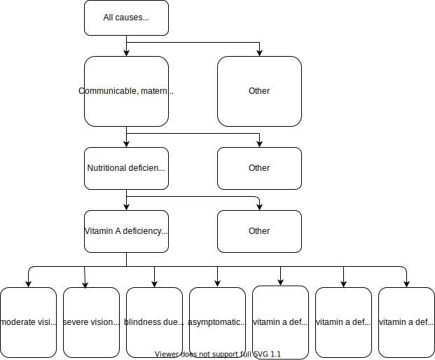

.. _2017_cause_vitamin_a_deficiency:

====================
Vitamin A Deficiency
====================

Disease Description
-------------------

Vitamin A deficiency (VAD) is a lack of vitamin A in blood and tissues.
Vitamin A deficiency is considered as one of the most serious public health concerns in developing countries
and can contribute directly or indirectly to disability.[1]

GBD 2017 Modeling Strategy
------------------------------------
In Global Burden of Disease (GBD) 2017, VAD exposure definition is proportion of the population with serum retinol concentration <0·7 μmol/L.
Like iron deficiency, the cause VAD is also a population attributable fraction (PAF) of 1 cause with the VAD risk factor. That is, 100% of the VAD cases are attributable
to the VAD risk factor. VAD Risk exposure and VAD cause prevalence data are the same.[2]

Vitamin A Deficiency Cause
+++++++++++++++++++++++++++++

The VAD in GBD 2017 that is 100% attributable to the
VAD risk factor. The VAD cause in GBD is a
YLD-only cause, meaning that it contributes to morbidity, but not mortality.

Modeling Strategy for the Vitamin A Deficiency Cause
^^^^^^^^^^^^^^^^^^^^^^^^^^^^^^^^^^^^^^^^^^^^^^^^^^^^^^^
.. todo::

	Describe cause in detail

Cause Hierarchy
^^^^^^^^^^^^^^^

Health States and Sequela
^^^^^^^^^^^^^^^^^^^^^^^^^
The sequela associated with the Vitamin A deficiency cause in GBD 2017 
include moderate vision impairment loss due to Vitamin A deficiency, 
severe vision impairment loss due to Vitamin A deficiency, blindness due to Vitamin A deficiency, 
asymptomatic Vitamin A deficiency, Vitamin a deficiency with mild anemia, Vitamin A deficiency with moderate anemia,
Vitamin A deficiency with severe anemia.

Restrictions
^^^^^^^^^^^^

.. list-table:: GBD 2017 Cause Restrictions
   :widths: 15 15 20
   :header-rows: 1

   * - Restriction Type
     - Value
     - Notes
   * - Male only
     - False
     -
   * - Female only
     - False
     -
   * - YLL only
     - False
     -
   * - YLD only
     - True
     -
   * - YLD age group start
     - Early Neonatal
     - [0, 7 days), age_group_id = 2
   * - YLD age group end
     - 95 Plus
     - [95, 125 years), age_group_id = 235

Vitamin A Deficiency Risk Factor
++++++++++++++++++++++++++++++++

The Vitamin A deficiency risk factor in GBD 2017 is a **dichotomous variable** .
Below is a list of measures and corresponding IDs:

.. list-table:: Measures
	:widths: 20 45 40
	:header-rows: 1

	* - Measure
	  - ID
	  - Data source
	* - Remission
	  - gbd_id = 2510, measure_id = 7
	  - epi, use get_model_results function
	* - Incidence rate
	  - gbd_id = cid(389)
	  - como, use get_measure
	* - Risk factor exposure
	  - gbd_id = reiid(96)
	  - como, use get_measure

Risk Factor Hierarchy
^^^^^^^^^^^^^^^^^^^^^

.. image:: vitA_risk_hierarchy.svg

Restrictions
^^^^^^^^^^^^

.. list-table:: GBD 2017 Risk Restrictions
   :widths: 15 15 20
   :header-rows: 1

   * - Restriction Type
     - Value
     - Notes
   * - Male only
     -
     -
   * - Female only
     -
     -
   * - YLL only
     -
     -
   * - YLD only
     -
     -
   * - YLL age group start
     - Post Neonatal
     - [28, 365 days), age_group_id = 4
   * - YLL age group end
     - 1-4 years
     - [1, 5 years), age_group_id = 5
   * - YLD age group start
     - Early Neonatal
     - [0, 7 days), age_group_id = 2
   * - YLD age group end
     - 95 Plus
     - [95, 125 years), age_group_id = 235

Relative Risks
^^^^^^^^^^^^^^

The affected causes with the Vitamin A deficiency cause in GBD 2017 include
:ref:`lower respiratory infections <2017_cause_lower_respiratory_infections>`,
:ref:`diarrhoeal diseases <2017_cause_diarrhea>`, :ref:`measles
<2017_cause_measles>`. The relative risks for these causes appear in Table 4 on
p. 112 of [GBD-2017-Risk-Appendix-VAD]_.

.. list-table:: Pooled relative risks for risk-outcome pairs included in GBD 2017
	:widths: 15 13 15 15
	:header-rows: 1

	* - Cause
	  - GBD 2016 RR
	  - GBD 2017 RR
	  - Include in GBD 2017
	* - Diarrhea
	  - 1.6 (1.21 - 2.02)
	  - 2.35 (2.17 - 2.54)
	  - Yes
	* - Measles
	  - 2.4 (1.61 - 3.48)
	  - 2.76 (2.01 - 3.78)
	  - Yes
	* - Lower Respiratory Infections (LRI)
	  - 
	  - 1.23 (1.03 - 1.48)
	  - Yes
	* - Meningitis
	  - 
	  - 3.2 (0.69 - 14.75)
	  - No (not significant)
	* - Malaria
	  - 
	  - 3.65 (2.23 - 5.97)
	  - No (only one study)
	  
Vivarium Modeling Strategy
--------------------------

Scope
+++++

Assumptions and Limitations
+++++++++++++++++++++++++++

Cause Model Diagram
+++++++++++++++++++

State and Transition Data Tables
++++++++++++++++++++++++++++++++

Validation Criteria
+++++++++++++++++++

References
----------

1. Amy L. Rice, Keith P. West JR. and Robert E. Black. Comparative quantification of health risks. Chapter 4 Vitamin A deficiency.
2. GBD 2017 Risk Factor Collaborators. Global, regional, and national comparative risk assessment of 84 behavioural, environmental and occupational, and metabolic risks or clusters of risks for 195 countries and territories, 1990-2017: a systematic analysis for the Global Burden of Disease Study 2017. Lancet 2018; 392: 1923–94.

.. [GBD-2017-Risk-Appendix-VAD]

	Pages 109-114 in `Supplementary appendix 1 to the GBD 2017 Risk Capstone <Risk
	appendix on ScienceDirect_>`_:

		**(GBD 2017 Risk Capstone)** GBD 2017 Risk Factor Collaborators. Global,
		regional, and national comparative risk assessment of 84 behavioural,
		environmental and occupational, and metabolic risks or clusters of risks for
		195 countries and territories, 1990–2017: a systematic analysis for the
		Global Burden of Disease Study 2017. :title:`The Lancet`. 8 Nov 2018; 392:
		1923-94. doi: http://dx.doi.org/10.1016/S0140-6736(18)32225-6.

.. _Risk appendix on ScienceDirect: https://ars.els-cdn.com/content/image/1-s2.0-S0140673618322256-mmc1.pdf
