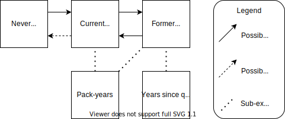

.. _2017_risk_smoking_forecasted:

======================================
Smoking Risk Exposure 
======================================

Risk Exposure Overview
----------------------

.. todo::

  Risk exposure overview

Risk Exposures Description in GBD
---------------------------------

The smoking risk factor in GBD is multifactorial and includes estimates on:

- The prevalence of current/former/never smokers 
- Cumulative pack-year smoking history *among current smokers* 
- Years since quitting *among former smokers*

This document will cover all three of these risk exposures. 

The TMREL for the smoking risk factor is never-smokers.

Smoking Status
++++++++++++++++++

Smoking status is a categorical risk exposure model with three categories: never smokers, current smokers, and former smokers.

Pack-years for Current Smokers
++++++++++++++++++++++++++++++

This is a *continuous* risk exposure model that follows an *ensemble* distribution that has been converted to a **categorical** risk exposure model for the CSU forecasts.

One pack‐year represents the equivalent of smoking one pack of cigarettes (assuming a 20‐cigarette pack) per day for one year. Since the pack‐years indicator collapses duration and intensity into a single dimension, one pack‐year of exposure can reflect smoking 40 cigarettes per day for six months or smoking 10 cigarettes per day for two years. Pack-years is a transformed measure of cumulative cigarettes smoked.

The categorical version of this risk exposure is binned into the following categories of pack-years: 0 to 2, 2 to 4, 5 to 9, 10 to 19, 20 to 29, 30 to 39, 40 to 49, 50 to 99.

This risk exposure is formatted in population counts (average, lower, upper, and standard deviation counts) in each exposure bin for each demographic group (received from the GBD 2019 tobacco team, hosted here: :code:`/ihme/gbd/WORK/05_risk/TEAM/sub_risks/tobacco/smoking_direct_prev/exposure/modeling/GBD2019/outputs/client_services_data_update/by_location/py/`). 1,000 draws for these exposure measures were generated by assuming a truncated normal distribution according to the parameters listed. Then, these draws were converted from population counts to proportions of the current smoker population in each exposure bin by dividing the population count in each exposure bin by the summed population count across all exposure bins for a given demographic group.

Years Since Quitting for Former Smokers
+++++++++++++++++++++++++++++++++++++++

This is a *continuous* risk exposure model that follows an *ensemble* distribution that has been converted to a **categorical** risk exposure model for the CSU forecasts from 2020-2040.

The categorical version of this risk exposure is binned into the following categories of pack-years: 0 to 2, 2 to 4, 5 to 9, 10 to 19, 20 to 29, 30 to 39, 40 to 49, 50 to 99.

Similar to the pack-year exposures, this risk exposure is formatted in population counts (average, lower, upper, and standard deviation counts) in each exposure bin for each demographic group (received from the GBD 2019 tobacco team, hosted here: :code:`/ihme/gbd/WORK/05_risk/TEAM/sub_risks/tobacco/smoking_direct_prev/exposure/modeling/GBD2019/outputs/client_services_data_update/by_location/ysq/`). 1,000 draws for these exposure measures were generated by assuming a truncated normal distribution according to the parameters listed. Then, these draws were converted from population counts to proportions of the former smoker population in each exposure bin by dividing the population count in each exposure bin by the summed population count across all exposure bins for a given demographic group.

Vivarium Modeling Strategy
--------------------------

The overall scope of the Vivarium modeling strategy for the smoking risk exposure for the :ref:`Lung Cancer Screening Model <lung_cancer_cancer_concept_model>` is that simulants will be assigned exposure values based on the exposure distribution for a given age-, sex-, and location-specific demographic group and their exposure will be updated each time they move through these groups. Age-, sex-, and location-specific demographic group exposures are assumed to remain constant over time (although individual simulant exposure values may change as they age). Each simulant will be given propensity scores that determines the relative magnitude of their individual exposure value to the exposure distribution(s). However, this strategy does allow for the possibility of illogical smoking exposure transitions for individual simulants (i.e.: moving from a current smoker to a never smoker, decreases in pack-year exposure values over time).

.. todo::

  Quantify these possibilities based on exposure forecasts using Abie's nano sim for stomach cancer and/or Yongquans cohort plots

This strategy is in contrast to modeling a rate of smoking initiation/cessation and number of cigarettes smoked, which would allow for detailed logical sample histories of each individual simulant.

The below diagram displays the exposure possibilities within the Vivarium modeling strategy for the smoking risk exposure: simulants can transition between never, curent, and former smoking status groups (although the transition from current to never smokers is illogical). Additionally, current and former smokers are assigned pack-year exposures and former smokers are assigned years since quitting exposures.

Smoking Status
++++++++++++++

Each simulant should get a smoking status propensity score (smoking_status_propensity_i) that is a random value assigned based on a uniform distribution from 0 to 1. This propensity score for an individual should remain constant for the entire duration of the simulation. 

Smoking status for individual simulants (smoking_status_i) should be assigned in the following fashion:

.. code-block:: python

  if 11 <= age_group_i <= 20:
    if smoking_status_propensity_i < never_smoker_prevalence:
      smoking_status_i = 'never'
    elif smoking_status_propensity_i < never_smoker_prevalence + current_smoker_prevalence:
      smoking_status_i = 'current'
    else:
      smoking_status_i = 'former'
  else:
    smoking_status_i = 'unassigned'

.. note::

  'unassigned' smoking status is an auxillary category to classify simulants for whom the smoking risk effects do not apply based on their age group (see the Restrictions_ section).

Where,

.. list-table:: Smoking Status Data Table
  :header-rows: 1

  * - Parameter
    - Definition
    - Source
    - Note
  * - current_smoker_prevalence
    - Prevalence of current smokers
    - :code:`J\Project\simulation_science\cancer\data\smoking\smoking_status_exposure_2019.csv`, measure='current'
    - Province-weighted location for :ref:`Lung Cancer Screening Model <lung_cancer_cancer_concept_model>`
  * - former_smoker_prevalence
    - Prevalence of former smokers
    - :code:`J\Project\simulation_science\cancer\data\smoking\smoking_status_exposure_2019.csv`, measure='former'
    - Province-weighted location for :ref:`Lung Cancer Screening Model <lung_cancer_cancer_concept_model>`
  * - never_smoker_prevalence
    - Prevalence of never smokers
    - :code:`J\Project\simulation_science\cancer\data\smoking\smoking_status_exposure_2019.csv`, measure='never'
    - Province-weighted location for :ref:`Lung Cancer Screening Model <lung_cancer_cancer_concept_model>`

The GBD 2019 prevalence estimates of current/former/never smokers are age-, sex-, location-specific.

Notably, this modeling strategy has the potential for current smokers to become never smokers (an illogical transition) if the prevalence of never smokers *increases* from one age group to the next. However, this possibility should be relatively inconsequential given that this should only happen if the current and former smokers die at a greater rate than they are replaced.

Pack-years Among Current Smokers
+++++++++++++++++++++++++++++++++

Pack-years among current smokers should be assigned as a categorical exposure value that is assigned in the following way:

- Each simulant gets an individual pack-year propensity value (pack_year_propensity_i), which is a random value between 0 and 1 (uniformly distributed). This propensity value does not change over the course of the simulant's life and should be separate and independent from smoking_status_propensity_i.

- This propensity will determine the exposure category such that the probability of occupying an exposure category will be defined as the value for that category in the datafile specified below 

- The *point* value for pack-year exposure used for the calculation of relative risk should be the **minimum** value of the exposure bin to which the simulant was assigned.

- Pack-year exposure values are updated when the exposure distribution for that simulant's demographic group changes (each year of the simulation and/or when a simulant ages into a new age group).

.. note::

  This method has the possibility that some simulants will have *decreases* in their pack-year exposure value, which is a measure of cumulative cigarettes smoked and therefore should logically increase monotonically.

Pack-year exposure data for the blended province location for the :ref:`Lung Cancer Screening Model <lung_cancer_cancer_concept_model>` are stored here: :code:`J:\Project\simulation_science\cancer\data\smoking\years_since_quitting_exposure_2019.csv` and are age-, sex-, location-, and year-specific. The values in this file represent the proportion of current smokers in each pack-year exposure category such that the sum across all exposure categories for a given draw is equal to one.

For current smokers, the exposure distribution specific to 2019 should be used and should remain constant at the sex- and age-specific population level over the 2020-2040 period of the lung cancer screening simulation (although individual simulant exposure values may change as the simulant ages). (Note: there are other years in this data file which will be used to assign pack-year exposures to former smokers as defined below.)

Pack-years Among Former Smokers
+++++++++++++++++++++++++++++++

Pack-years among former smokers should be assigned in a similar way to pack-years among current smokers, although the exposure should be sampled from the pack-year distribution among current smokers *the last year that the former smoker was a current smoker*. In other words, the year equal to the current year minus the simulant's years since quitting (see section below). 

  If a simulant becomes a former smoker *during* the simulation, they will keep their previously assigned pack-year exposure value that was assigned when they were a current smoker (using the GBD 2019 pack-year exposure distribution). 

  For simulants initialized as former smokers, historical (pre-2019) pack-year exposure distributions may be used (given that the simulant has a years since quitting exposure of at least one). 

    Notably, there are only estimates for the following years: :code:`[1980,1985,1990,1995,2000,2005,2007,2009,2010,2012,2014,2015,2017,2019]`. 

    Since there are not pack-year estimates for every year prior to 2019, select the most proximal year with estimates in the event that there is not a pack-year estimation for the year in which a simulant quit smoking.

The pack-year exposure data for former smokers **should not change for the entire duration that a simulant is classified as a former smoker.**

If a former smoker simulant becomes a current smoker, that simulant's pack-year exposure should be updated to reflect the pack-year exposure distribution in the current year (the year in which the former smoker becomes a current smoker, which for our purposes is the 2019-specific pack-year exposure distribution).

Years Since Quitting Among Former Smokers
+++++++++++++++++++++++++++++++++++++++++++

Years since quitting exposures among former smokers should be assigned in a similar manner to pack-year exposures among current smokers.

Years since quitting exposures should be assigned to former smokers based on the  categorical exposure distribution in the following manner:

- Each simulant gets an individual years since quitting propensity value (ysq_propensity_i), which is a random value between 0 and 1 (uniformly distributed). This propensity value does not change over the course of the simulant's life and should be separate and independent from smoking_status_propensity_i.

- This propensity will determine the exposure category such that the probability of occupying an exposure category will be defined as the value for that category in the datafile specified below

- The *point* value for pack-year exposure used to calculate relative risk should be the **maximum** value of the exposure bin (ex: 5-9 exposure category assigned point value of 10) to which the simulant was assigned for all exposure categories except for 50-99 YSQ. A point value of 50 YSQ should be used to calculate the relative risk for simulants in the 50-99 YSQ exposure group (the exception for this exposure bin was implemented because the highest mesh point for the relative risk is often lower than the upper range of the exposure category).

- Years-since quitting exposure values should be initialized among former smokers at the start of the simulation and also when a simulant newly *becomes* a former smoker. YSQ exposures should be updated when the exposure distribution for that simulant's demographic group changes (i.e. when a simulant ages into a new age group).

Years since quitting exposure data for the blended province location for the :ref:`Lung Cancer Screening Model <lung_cancer_cancer_concept_model>` are stored here: :code:`J:\Project\simulation_science\cancer\data\smoking\years_since_quitting_exposure_2019.csv` and are age-, sex-, location-, and 2019-specific. The values in this file represent the proportion of former smokers that occupy each exposure category such that the sum across all exposure categories for a given draw sum to one.

These exposure distributions at the age- and sex-specific population level should remain constant over the course of the 2020-2040 lung cancer screening simulation (although individual simulant exposure values may change as they age).

Restrictions
++++++++++++

.. list-table:: GBD 2017 Risk Exposure Restrictions
   :widths: 15 15 20
   :header-rows: 1

   * - Restriction Type
     - Value
     - Notes
   * - Male only
     - False
     - 
   * - Female only
     - False
     - 
   * - Age group start
     - age_group_id=11
     - 30-35 years; note: smoking prevalence starts at age_group_id=9 (20-24), pack-years and years since quitting start at age_group_id=11
   * - Age group end
     - age_group_id=20
     - 75 to 79 years; note: risk factor in GBD ends at age_group_id=235 (95+))

.. note:: 

  As noted in the table, the GBD risk factor ends at age_group_id 235 (95+ years). However, this vivarium model will restrict the risk factor to end at age_group_id 20 (75 to 79 years) because there is a data issue for which there is no current smoker prevalence among age groups older than age_group_id 20. This restriction will not limit the lung cancer screening model because lung cancer screening does not occur in ages older than 74 (see the :ref:`Lung Cancer Screening Model <lung_cancer_cancer_concept_model>`).

Assumptions and Limitations
+++++++++++++++++++++++++++

Our model is limited in that it does not enforce logical individual simulant smoking exposure trajectories.

Our model is additionally limited in that it converts from a continous exposure distribution from GBD (as described in the methods appendix), to a categorical exposure distribution from the CSU forecasts, and then back to a continous exposure distribution for Vivarium. We assume that the continuous exposures are equal to the minimum values for each exposure category, which causes a unrealistic continuous exosure distribution among our simulants, but was chosen to most closely recreate the lung cancer population attributable fraction for smoking.

For use in the :ref:`Lung Cancer Screening Model <lung_cancer_cancer_concept_model>` that runs from 2020 to 2040, we assume that the smoking exposure distribution at the sex- and age-specific population level remains constant over this period and is equal to the exposure in 2019 (although individual simulant exposure values may change over time as they age).

Validation Criteria
+++++++++++++++++++

The prevalence of current and former smokers in our simulation should validate the GBD 2019 prevalence.

The mean and standard deviation pack year exposure values among current smokers reported in the simulation output should validate to the externally transformed (categorical to continuous) and calculated values (mean and standard deviaation) from the input data.

The mean and standard deviation years since quitting exposure values among former smokers reported in the simulation output should validate to the externally transformed (categorical to continuous) and calculated values (mean and standard deviaation) from the input data. Note that these parameters may not validate as closely as the others because this modeling strategy only uses the CSU forecasts for initialization at the beginning of the simulation.

References
----------