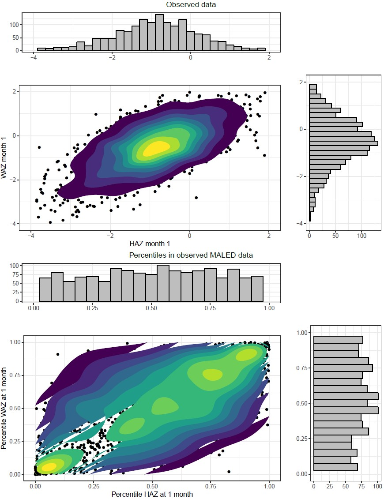
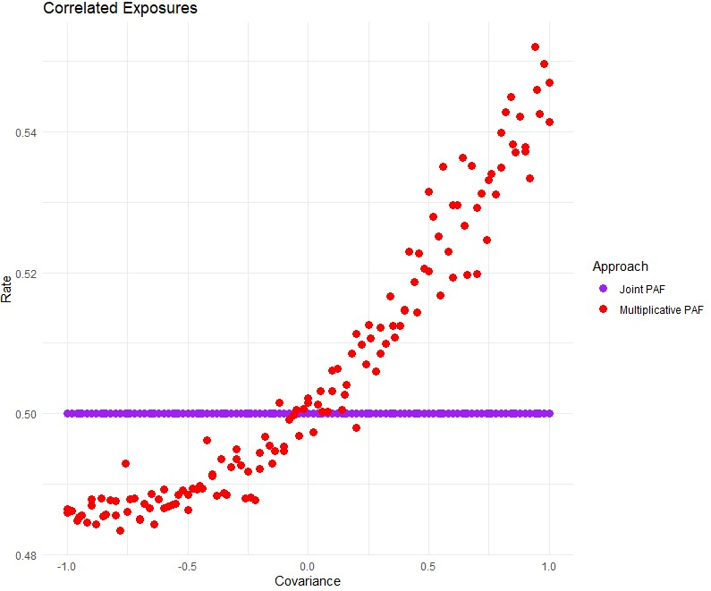

.. _2017_risk_models:

====================
Risk Correlation Proposal
====================

Background and motivation
----------------------

At the individual level, exposure to risk factors are likely to be correlated. Several examples include high body mass index and high fasting plasma glucose, tobacco smoking and alcohol use, and childhood height and weight. Vivarium takes population exposure prevalence estimates by age/sex/year/location and determines the if a simulant is exposed to the risk factor such that the prevalence within the simulation matches the GBD estimate. The exposure status for multiple risk factors of the individuals within Vivarium should be adjusted so that they are correlated across those risks.

Although correlated risk factor exposure may be important in a variety of contexts, we are proposing using childhood height and weight as a testing and motivating example. Childhood growth is an important metric for how children are developing. Children with low height and weight for their age are at higher risk of getting and dying from infectious diseases like diarrhea, lower respiratory infections, and measles. Height and weight should be correlated between children and each child should have dynamic but correlated height and weight over time as they age.  

Risk exposure correlation
------------------------------

The proposed method to introduce correlation in risk factor exposure is by finding the Spearman’s correlation coefficient between two or more risks and sampling from a multivariate normal distribution when assigning a position on an exposure distribution. This plot shows data from a joint distribution reflecting the variance and covariance between height and weight at one month using data from a cohort study. The top panel shows the values for the height and weight and the bottom panel shows the percentiles within the distributions (propensity values).

Please see the ipynb Notebook for an example of how we intend to code this. 
												 
Attributable fraction correlation
-------------------------------------
Suppose that we introduce correlation in risk exposure but don’t properly adjust for the changes this causes in the combined attributable fractions between the two or more risks. The rate of disease among individuals and in aggregate will be wrong and the amount of error increases with larger values of the combined attributable fractions. 

With some testing and simulation, we are able to show that the population attributable fraction for multiple risk factors depends on the correlation in those risks. To date, Vivarium has been using a risk deleted rate (e.g. incidence or mortality) based on an assumption that the risk exposures are independent. However, the more correlated the risks exposures, the more wrong this assumption will be. The overall idea is to take GBD rates and remove the combined contribution of risk factor attributable fractions (PAFs):
 
.. math::
	i_0 = \left(1-\text{PAF}\right) \cdot i_{\text{GBD}}
 
Where i_0 is the risk-deleted rate, PAF is the population attributable fraction for a single or multiple risk factors, and  i_GBDis the rate from GBD. A combined PAF for multiple risk factors is the product of 1 minus the independent PAFs. 
 
.. math::
	1 - \text{PAF}_{\text{Multiplicative}} = \left(1 - \text{PAF}_{\text{Risk1}}\right)\cdot\left(1 - \text{PAF}_{\text{Risk2}}\right)
	
This can be written in a slightly different way for each individual in the simulation and what we are calling the Multiplicative approach to combined PAFs:
 
.. math::
	PAF_{multiplicative} = 1 - (1 - \frac{1}{\frac{1}{n}\sum_{i=1}^{n}RR_1^{e1_i}}) \cdot (1 - \frac{1}{\frac{1}{n}\sum_{i=1}^{n}RR_2^{e2_i}})
	
Where RR is a relative risk and e1 & e2 are indicators {0,1} for exposure status to each risk factor for each individual. We are proposing a slight variation on this formulation, what we are calling the Joint approach to combined PAFs: 
 
.. math::
	PAF_{joint} = 1 - \frac{1}{\frac{1}{n}\sum_{i=1}^{n} RR_1^{e1_i} \cdot RR_2^{e2_i}}
	
These two approaches give nearly the same value for the attributable fraction when the exposure to each risk is independent. However, when the exposures to the risk factors are correlated, the so-called Joint approach gives a higher value of the attributable fraction than the Multiplicative (current Vivarium) approach. 
We have conducted some simple tests to determine how this impacts the final rate of events among individuals. In this test, we calculate a risk deleted rate as:
 
.. math::
	i_0 = \left(1-\text{PAF}\right) \cdot i_{\text{GBD}}
 
And calculate the attributable fraction in the two ways described above, as a multiplicative and a joint PAF that we compared. 
 
.. math::
	i_{multi,0} = (1-{PAF_{multi}}) \cdot i_{{GBD}}  
.. math::
	i_{joint,0} = (1-{PAF_{joint}}) \cdot i_{{GBD}}
	
	
Each individual then has a rate of event defined by 
 
.. math::
	i_{e_1, e_2} = i_0 \cdot \left(\text{RR}_1\right)^{e_1}\cdot \left(\text{RR}_2\right)^{e_2}
 
Where i is the rate for an individual, i0 is the risk deleted rate, RR is a relative risk and e is an indicator {0,1} denoting if the individual is exposed to that risk factor.

Our simple tests show that when evaluating these attributable fractions on individuals with a known rate of event, the joint PAFs return rates nearly identical to the known rate of events. In contrast, the multiplicative PAFs return rates that are too high when the risk exposures are correlated (rate here is 0.5).

Proposal to test
-----------------------
We would like to test these two changes for exposures and attributable fractions in the Balanced Energy Protein model as sensitivity analyses supplementing the primary analysis. The risks that we want to test are childhood growth failure: stunting, underweight, and wasting. We are proposing using correlation structures for these exposures from analyses of individual-level data. 

Also in the BEP model, we would like to attempt creating correlated changes to propensity scores for stunting, underweight, and wasting within individuals over time. This would involve implementing multiple samples for these risk factors to determine propensity and risk exposure for each simulant. There would not be any changes to the attributable fractions for these risks, the only change would be in allowing these propensity values to change at defined time points, corresponding with GBD age groups. 
