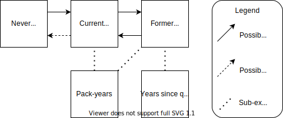

.. _2017_risk_exposure_smoking_forecasted:

======================================
Smoking Risk Exposure -- Forecasted
======================================

Risk Exposure Overview
----------------------

.. todo::

  Risk exposure overview

Risk Exposures Description in GBD
---------------------------------

The smoking risk factor in GBD is multifactorial and includes estimates on:

- The prevalence of current/former/never smokers 
- Cumulative pack-year smoking history *among current smokers* 
- Years since quitting *among former smokers*

This document will cover all three of these risk exposures. 

The TMREL for the smoking risk factor is never-smokers.

Smoking Status
++++++++++++++++++

Smoking status is a categorical risk exposure model with three categories: never smokers, current smokers, and former smokers.

Pack-years for Current Smokers
++++++++++++++++++++++++++++++

This is a *continuous* risk exposure model that follows an *ensemble* distribution that has been converted to a **categorical** risk exposure model for the CSU forecasts from 2020-2040.

One pack‐year represents the equivalent of smoking one pack of cigarettes (assuming a 20‐cigarette pack) per day for one year. Since the pack‐years indicator collapses duration and intensity into a single dimension, one pack‐year of exposure can reflect smoking 40 cigarettes per day for six months or smoking 10 cigarettes per day for two years. Pack-years is a transformed measure of cumulative cigarettes smoked.

The categorical version of this risk exposure is binned into the following categories of pack-years: 0 to 2, 2 to 4, 5 to 9, 10 to 19, 20 to 29, 30 to 39, 40 to 49, 50 to 99.

This risk exposure was forecast from 2020-2040 based on the GBD 2019 risk exposure estimates as a measure of number of individuals in each exposure category per person year in the *general population* (note that the denominator here is not person time among current smokers).

Years Since Quitting for Former Smokers
+++++++++++++++++++++++++++++++++++++++

This is a *continuous* risk exposure model that follows an *ensemble* distribution that has been converted to a **categorical** risk exposure model for the CSU forecasts from 2020-2040.

The categorical version of this risk exposure is binned into the following categories of pack-years: 0 to 2, 2 to 4, 5 to 9, 10 to 19, 20 to 29, 30 to 39, 40 to 49, 50 to 99.

This risk exposure was forecast from 2020-2040 based on the GBD 2019 risk exposure estimates as a measure of number of individuals in each exposure category per person year in the *general population* (note that the denominator here is not person time among former smokers).

Vivarium Modeling Strategy
--------------------------

The overall scope of the Vivarium modeling strategy for the smoking risk exposure for the :ref:`Lung Cancer Screening Model <lung_cancer_cancer_concept_model>` is that simulants will be assigned exposure values based on the exposure distribution for a given age-, sex-, location-, and year-specific demographic group and their exposure will be updated each time they move through these groups. Each simulant will be given a propensity score that determines the relative magnitude of their individual exposure value to the exposure distribution. However, this strategy does allow for the possibility of illogical smoking exposure transitions for individual simulants (i.e.: moving from a current smoker to a never smoker, decreases in pack-year exposure values over time).

.. todo::

  Quantify these possibilities based on exposure forecasts using Abie's nano sim for stomach cancer and/or Yongquans cohort plots

This strategy is in contrast to modeling a rate of smoking initiation/cessation and number of cigarettes smoked, which would allow for detailed logical sample histories of each individual simulant.

The below diagram displays the exposure possibilities within the Vivarium modeling strategy for the smoking risk exposure: simulants can transition between never, curent, and former smoking status groups (although the transition from current to never smokers is illogical). Additionally, current and former smokers are assigned pack-year exposures and former smokers are assigned years since quitting exposures.

Smoking Status
++++++++++++++

Each simulant should get a smoking status propensity score (smoking_status_propensity_i) that is a random value assigned based on a uniform distribution from 0 to 1. This propensity score for an individual should remain constant for the entire duration of the simulation. 

Smoking status for an individual simulant (smoking status_i) should be assigned in the following fashion:

.. code-block:: python

  if smoking_status_propensity_i < never_smoker_prevalence:
    smoking_status_i = 'never'
  elif smoking_status_propensity_i < never_smoker_prevalence + current_smoker_prevalence:
    smoking_status_i = 'current'
  else:
    smoking_status_i = 'former'

Where,

.. list-table:: Smoking Status Data Table
  :header-rows: 1

  * - Parameter
    - Definition
    - Source
    - Note
  * - current_smoker_prevalence
    - Prevalence of current smokers
    - /ihme/csu/swiss_re/forecast/prev_forecast_draws.csv, measure='current'
    - Forecasted from 2020-2040
  * - former_smoker_prevalence
    - Prevalence of former smokers
    - /ihme/csu/swiss_re/forecast/prev_forecast_draws.csv, measure='former'
    - Forecasted from 2020-2040
  * - never_smoker_prevalence
    - Prevalence of never smokers
    - 1 - current_smoker_prevalence - former_smoker_prevalence
    - Derived from estimates forecasted from 2020-2040

The prevalence estimates of current/former/never smokers are age-, sex-, location-, and year-specific.

Notably, this modeling strategy has the potential for current smokers to become never smokers (an illogical transition) if the prevalence of never smokers *increases* from one age group to the next. However, this possibility should be relatively inconsequential given that this should only happen if the current and former smokers die at a greater rate than they are replaced.

.. todo::

  Evaluate this possibility in the forecast data

.. note::

  Current and former smoking exposure are forecasted starting with age group ID 9 (20-24 years), although exposures only need to be assigned starting at age group ID 11 (30-34 years) because this is the age group for which pack-year and years since quitting exposure data begins.

Pack-years Among Current Smokers
+++++++++++++++++++++++++++++++++

A point-value of pack-years should be assigned to current smokers based on the forecasted categorical exposure distribution.

Pack-years among current smokers should be assigned as a categorical exposure value that is assigned in the following way:

- Each simulant gets an individual propensity value, which is a random value between 0 and 1 (uniformly distributed). This propensity value does not change over the course of the simulant's life.

- This propensity will determine the exposure category such that the probability of occupying an exposure category will be defined as the value for that category divided by the sum of values across all exposure categories for each age/sex/year/location group.

- The *point* value for pack-year exposure assigned to each simulant should be the **minimum** value of the exposure bin to which the simulant was assigned.

.. note::

  See the notebook `here <https://github.com/ihmeuw/vivarium_data_analysis/pull/95>`_ that demonstrates this method most closely replicates the smoking PAF (most likely because the higher exposure bins are very large and likely right skewed).

- Pack-year exposure values are updated when the exposure distribution for that simulant's demographic group changes (each year of the simulation and/or when a simulant ages into a new age group).

.. note::

  This method has the possibility that some simulants will have *decreases* in their pack-year exposure value, which is a measure of cumulative cigarettes smoked and therefore should logically increase monotonically.

Pack-year exposure data are stored here: `/ihme/csu/swiss_re/forecast/py_forecast_draws.csv` and are age-, sex-, location-, and year-specific. The units of this file are number of individuals in each exposure bin per person-year of the *general population.* 

Pack-years Among Former Smokers
+++++++++++++++++++++++++++++++

Pack-years among former smokers should be assigned in a similar way to pack-years among current smokers, although the exposure should be sampled from the pack-year distribution among current smokers *the last year that the former smoker was a current smoker*. In other words, the year equal to the current year minus the simulant's years since quitting (see section below).

The pack-year exposure data for former smokers should not change for the entire duration that a simulant is classified as a former smoker. 

If a former smoker simulant becomes a current smoker, that simulant's pack-year exposure should be updated to reflect the pack-year exposure distribution in the current year (the year in which the former smoker becomes a current smoker).

Years Since Quitting Among Former Smokers
+++++++++++++++++++++++++++++++++++++++++++

Years since quitting should be assigned to former smokers upon initialization of the simulation using the forecasted exposure distribution data located here: /ihme/csu/swiss_re/forecast/ysq_forecast_draws.csv

Simulants who are intialized into the simulation as former smokers should be assigned a years since quitting point value based on the forecasted categorical exposure values in the following manner:

  - Simulants will be assigned to an exposure category such that the probability of occupying a given category is the exposure value for that category divided by the sum of exposure values across all exposure categories for a given age/sex/location/year group.

  - Simulants will then be assigned a *point* exposure value that is equal to the minimum value for that exposure bin.

.. note::

  See the notebook here `here <https://github.com/ihmeuw/vivarium_data_analysis/pull/95>`_ that demonstrates this method most closely replicates the smoking PAF (most likely because the higher exposure bins are very large and likely right skewed).

As simulants progress through the simulation:

- Former smokers will accurue years since quitting exposure over time such that simulation time that passes is added to their years since quitting exposure value.

- Simulants that *become* former smokers over the course of the simulation will be immediately initialized with zero years since quitting and then will begin to accrue years since quitting exposure as simulation time passes.

Restrictions
++++++++++++

.. list-table:: GBD 2017 Risk Exposure Restrictions
   :widths: 15 15 20
   :header-rows: 1

   * - Restriction Type
     - Value
     - Notes
   * - Male only
     - False
     - 
   * - Female only
     - False
     - 
   * - Age group start
     - age_group_id=11
     - 30-35 years; note: smoking prevalence starts at age_group_id=9 (20-24), pack-years and years since quitting start at age_group_id=11
   * - Age group end
     - age_group_id=235
     - 95+ years

Assumptions and Limitations
+++++++++++++++++++++++++++

Our model is limited in that it does not enforce logical individual simulant smoking exposure trajectories.

Our model is additionally limited in that it converts from a continous exposure distribution from GBD, to a categorical exposure distribution from the CSU forecasts, and then back to a continous exposure distribution for Vivarium. We assume that the continuous exposures are equal to the minimum values for each exposure category, which causes a unrealistic continuous exosure distribution among our simulants, but was chosen to most closely recreate the lung cancer population attributable fraction for smoking.

Validation Criteria
+++++++++++++++++++

The prevalence of current and former smokers in our simulation should validate the the forecasted CSU prevalence from 2020 to 2040.

The mean and standard deviation pack year exposure values among current smokers reported in the simulation output should validate to the externally transformed (categorical to continuous) and calculated values (mean and standard deviaation) from the CSU forecasts.

The mean and standard deviation years since quitting exposure values among former smokers reported in the simulation output should validate to the externally transformed (categorical to continuous) and calculated values (mean and standard deviaation) from the CSU forecasts. Note that these parameters may not validate as closely as the others because this modeling strategy only uses the CSU forecasts for initialization at the beginning of the simulation.

References
----------