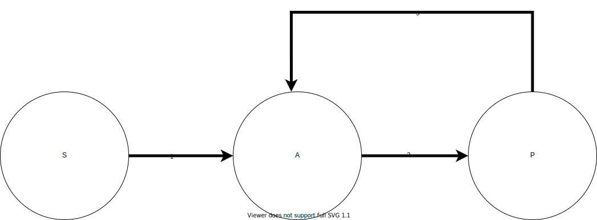

.. _2019_cause_ihd:

======================
Ischemic Heart Disease
======================

.. contents::
   :local:
   :depth: 1

.. list-table:: Abbreviations
   :widths: 15 15 15
   :header-rows: 1

   * - Abbreviation
     - Definition
     - Notes
   * - IHD
     - Ischemic heart disease
     - 
   * - MI
     - Myocardial infarction
     - 
   * - AMI
     - Acute myocardial infarction
     - 

Disease Overview
----------------

Ischemic heart disease (IHD) is a non-communicable cardiovascular disease which occurs when the arteries of the heart cannot deliver enough oxygen-rich blood to the heart. Since 1990, this disease has been a leading cause of global Years of Life Lost (YLL). GBD 2019 listed IHD as the leading cause of YLLs globally, with a mean percentage increase of 4.19% in all-age YLL rate since 2007. According to NIH_, IHD is also known as Coronary Artery Disease, Coronary Heart Disease, and Coronary Microvascular Disease. Symptoms and complications can vary by person, even if they have the same type of ischemic heart disease. Reported symptoms vary whether a person is experiencing an acute coronary event, such as a heart attack, or has chronic IHD. Symptoms may get worse as the buildup of plague continues to narrow the coronary arteries. 

Acute coronary events may cause symptoms such as angina, cold sweats, dizziness, nausea, neck pain, shortness of breath, sleep disturbances, or weakness. 

Chronic ischemic heart disease can cause signs and symptoms such as angina, anxiety or nervousness, fatigue, or neck pain. 

.. _NIH: https://www.nhlbi.nih.gov/health-topics/ischemic-heart-disease

GBD 2019 Modeling Strategy
--------------------------

GBD 2019 Non-Fatal Modeling Strategy
++++++++++++++++++++++++++++++++++++

**Case definitions:**\

1. Acute myocardial infarction (MI): Definite and possible MI according to the third universal definition of myocardial infarction:
  
  a. When there is clinical evidence of myocardial necrosis in a clinical setting consistent with myocardial ischaemia or
  b. Detection of a rise and/or fall of cardiac biomarker values and with at least one of the following: i) symptoms of ischaemia, ii) new or presumed new ST-segment-T wave changes or new left bundle branch block, iii) development of pathological Q waves in the ECG, iv) imaging evidence of new loss of viable myocardium or new regional wall motion abnormality, or v) identification of an intracoronary thrombus by angiography or autopsy.
  c. Sudden (abrupt) unexplained cardiac death, involving cardiac arrest or no evidence of a non-coronary cause of death
  d. Prevalent MI is considered to last from the onset of the event to 28 days after the event and is divided into an acute phase (0-2 days) and subacute (3-28 days).

2. Chronic IHD:
  
  a. Angina; clinically diagnosed stable exertional angina pectoris or definite angina pectoris according to the Rose Angina Questionnaire, physician diagnosis, or taking nitrate medication for the relief of chest pain.
  b. Asymptomatic ischaemic heart disease following myocardial infarction; survival to 28 days following incident MI. The GBD study does not use estimates based on ECG evidence for prior MI, due to its limited specificity and sensitivity.

**Input data:**\

Apart from inpatient hospital and inpatient claims data, we did not include any data from sources other than the literature for myocardial infarction. 

The primary input for the asymptomatic ischaemic heart disease following myocardial infarction model are 28-day survivors calculated from the excess mortality estimates for the myocardial infarction model. We included data for excess mortality and standardised mortality ratio to inform the estimates of survival after myocardial infarction.

For angina, the data sources used include literature data, survey data, and U.S. claims data (but we did not include inpatient hospital data from any locations). All outpatient data were excluded as they were implausibly low for all locations when compared with literature and claims data.

**Severity split inputs:**\

Acute myocardial infarction was split into two severity levels by length of time since the event – days 1 and 2 versus days 3 through 28. Disability weights were established for these two severities using the standard approach for GBD 2019. 

.. list-table:: Severity distribution for acute myocardial infarction
   :widths: 15 25 12
   :header-rows: 1

   * - Severity level
     - Lay description
     - DW (95% CI)
   * - Acute myocardial infarction, days 1-2
     - Has severe chest pain that becomes worse with any physical activity. The person feels nauseated, short of breath, and very anxious
     - 0.432 (0.288–0.579)
   * - Acute myocardial infarction, days 3-28 
     - Gets short of breath after heavy physical activity, and tires easily, but has no problems when at rest. The person has to take medication every day and has some anxiety. 
     - 0.074 (0.049–0.105)

Asymptomatic ischaemic heart disease following myocardial infarction was all assigned to the asymptomatic severity level. No disability weight is assigned to this level. 

.. list-table:: Severity distribution for asymptomatic ischaemic heart disease following myocardial infarction
   :widths: 15 25 12
   :header-rows: 1

   * - Severity level
     - Lay description
     - DW (95% CI)
   * - Asymptomatic ischaemic heart disease
     - 
     - N/A

Angina was split into asymptomatic, mild, moderate, and severe groups using information from MEPS. Disability weights were established for these severities using the standard approach for GBD 2019. 

.. list-table:: Severity distribution for angina pectoris
   :widths: 15 25 12
   :header-rows: 1

   * - Severity level
     - Lay description
     - DW (95% CI)
   * - Asymptomatic angina
     - 
     - N/A
   * - Mild angina
     - Has chest pain that occurs with strenuous physical activity, such as running or lifting heavy objects. After a brief rest, the pain goes away.
     - 0.033 (0.02–0.052)
   * - Moderate angina
     - Has chest pain that occurs with moderate physical activity, such as walking uphill or more than half a kilometer (around a quarter-mile) on level ground. After a brief rest, the pain goes away.
     - 0.08 (0.052–0.113)
   * - Severe angina
     - Has chest pain that occurs with minimal physical activity, such as walking only a short distance. After a brief rest, the pain goes away. The person avoids most physical activities because of the pain.
     - 0.167 (0.11–0.24)

GBD 2019 Fatal Modeling Strategy
++++++++++++++++++++++++++++++++

**Input data:**\

Vital registration and verbal autopsy data were used to model ischaemic heart disease.

Cause Hierarchy
+++++++++++++++

Restrictions
++++++++++++

The following table describes any restrictions in GBD 2019 on the effects of
this cause (such as being only fatal or only nonfatal), as well as restrictions
on the ages and sexes to which the cause applies.

.. list-table:: GBD 2019 Cause Restrictions
   :widths: 15 15 20
   :header-rows: 1

   * - Restriction Type
     - Value
     - Notes
   * - Male only
     - False
     -
   * - Female only
     - False
     -
   * - YLL only
     - False
     -
   * - YLD only
     - False
     -
   * - YLL age group start
     - 15
     - [15, 20), age_group_id=8
   * - YLL age group end
     - 125
     - [95, 125 years), age_group_id=235
   * - YLD age group start
     - 15
     - [15, 20), age_group_id=8
   * - YLD age group end
     - 125
     - [95, 125 years), age_group_id=235

Vivarium Modeling Strategy
--------------------------

Scope
+++++

The aspects of the disease this cause model is designed to simulate are the states, transitions, and sequelae. The Vivarium model of IHD has been of a similar design to GBD 2019 by modeling IHD using MI sequelae to estimate the prevalence of IHD. Like GBD 2019, Vivarium's design includes several states:

  a) Acute myocardial infarction ('Acute MI' or AMI) is a GBD sequela and simulants should have myocardial infarction at the GBD incidence rate. Vivarium's design of 'Acute MI' is modeled exactly after GBD 2019's 'Acute MI' case definition and informed by the GBD 2019 "Myocardial infarction due to ischemic heart disease - EMR comparison"
  b) Post-MI is a state entered by survivors of AMI. Vivarium's design of 'Post MI' is modeled exactly after GBD 2019's 'Chronic IHD' case definition, which is captured in GBD as the "Asymptomatic Ischemic Heart Disease following myocardial infarction" dismod model and sequelae.
  c) Angina (stable coronary artery disease) is a state entered by individuals based on the incidence rate of the "angina due to ischemic heart disease" dismod model and sequelae.

Assumptions and Limitations
+++++++++++++++++++++++++++

The risk factors BMI, SBP, LDL-c, smoking, FPG, physical inactivity, total alcohol inactivity, diet high in processed meats, and diet high in sugar-sweetened beverage could all affect the transition rates 1, 3, and 4 listed below, through the GBD measure of incidence_c493.

Cause Model Diagram
+++++++++++++++++++

MI
"""""""""""

Angina
"""""""""""

State and Transition Data Tables
++++++++++++++++++++++++++++++++

Definitions
"""""""""""

.. list-table:: State Definitions
   :widths: 1, 10, 15
   :header-rows: 1

   * - State
     - State Name
     - Definition
   * - S
     - **S**\ usceptible
     - Susceptible to IHD
   * - A
     - **A**\ cute Myocardial Infarction (MI)
     - Simulant that experiences acute MI symptoms
   * - P
     - **P**\ ost-MI IHD
     - Simulant that experiences angina and asymptomatic ischemic heart
       disease following myocardial infarction; survival to 28 days following
       incident MI
   * - S2
     - **S**\ usceptible
     - Susceptible to IHD
   * - A2
     - **A**\ ngina
     - Sequelae

States Data
"""""""""""

.. list-table:: State Data
   :widths: 5 10 10 20
   :header-rows: 1

   * - State
     - Measure
     - Value
     - Notes
   * - All
     - cause-specific mortality rate
     - :math:`\frac{\text{deaths_c493}}{\text{population}}`
     -
   * - P
     - excess mortality rate
     - emr_m15755
     -
   * - A
     - excess mortality rate
     - emr_m24694
     -
   * - S
     - excess mortality rate
     - 0
     -
   * - A2
     - excess mortality rate
     - emr_m1817
     -
   * - S2
     - excess mortality rate
     - 0
     -
   * - P
     - disability weight
     - :math:`\frac{1}{\text{prevalence_c493}} \times \sum\limits_{s \in post-mi-sequelae} \text{disability_weight}_s \cdot \text{prevalence}_s`
     -
   * - A
     - disability weight
     - :math:`\frac{1}{\text{prevalence_c493}} \times \sum\limits_{s\in acute-sequelae} \text{disability_weight}_s \cdot \text{prevalence}_s`
     -
   * - S
     - disability weight
     - 0
     -
   * - A2
     - disability weight
     - :math:`\frac{1}{\text{prevalence_c493}} \times \sum\limits_{s\in angina-sequelae} \text{disability_weight}_s \cdot \text{prevalence}_s`
     -
   * - S2
     - disability weight
     - 0
     -
   * - P
     - prevalence
     - :math:`\sum\limits_{s\in post-mi-sequelae} \text{prevalence}_s`
     -
   * - A
     - prevalence
     - :math:`\sum\limits_{s\in acute-sequelae} \text{prevalence}_s`
     -
   * - S
     - prevalence
     - 1-prevalence_493
     - simulants not prevalent with IHD
   * - A2
     - prevalence
     - :math:`\sum\limits_{s\in angina-sequelae} \text{prevalence}_s`
     -
   * - S2
     - prevalence
     - 1-prevalence_493
     - simulants not prevalent with IHD

Transition Data
"""""""""""""""

.. list-table:: Transition Data
   :widths: 10 10 10 10 10
   :header-rows: 1

   * - Transition
     - Source State
     - Sink State
     - Value
     - Notes
   * - 1
     - S
     - A
     - :math:`\frac{\text{incidence_m24694}}{(1-\text{prevalence_c493})}`
     - IHD is prevalent enough in older ages to warrant including the correction from "population rate" to "susceptible rate"
   * - 2
     - A
     - P
     - 28 days
     - duration-based transition from acute state then progress into post state
   * - 3
     - P
     - A
     - :math:`\frac{\text{incidence_m24694}}{(1-\text{prevalence_c493})}`
     - IHD is prevalent enough in older ages to warrant including the correction from "population rate" to "susceptible rate"
   * - 4
     - S2
     - A2
     - :math:`\frac{\text{incidence_m1817}}{(1-\text{prevalence_c493})}`
     - IHD is prevalent enough in older ages to warrant including the correction from "population rate" to "susceptible rate"

Data Sources
""""""""""""

.. list-table:: Data Sources and Definitions
   :widths: 10 10 20 20
   :header-rows: 1

   * - Variable
     - Source
     - Description
     - Notes
   * - prevalence_c493
     - como
     - prevalence of ischemic heart disease
     -
   * - deaths_c493
     - codcorrect
     - Count of deaths due to ischemic heart disease
     -
   * - population
     - demography
     - Mid-year population for given sex/age/year/location
     -
   * - prevalence_s{sid}
     - como
     - Prevalence of sequela with id {id}
     -
   * - disability_weight_s{sid}
     - YLD appendix
     - Disability weight of sequela with id {id}
     -
   * - :math:`\frac{\text{incidence_m24694}}{(1-\text{prevalence_c493})}`
     - dismod-mr, como
     - Incidence of MI due to ischemic heart disease
     - IHD is prevalent enough in older ages to warrant including the correction from "population rate" to "susceptible rate"
   * - :math:`\frac{\text{incidence_m1817}}{(1-\text{prevalence_c493})}`
     - dismod-mr, como
     - Incidence of angina due to ischemic heart disease
     - IHD is prevalent enough in older ages to warrant including the correction from "population rate" to "susceptible rate"
   * - emr_m15755
     - dismod-mr
     - excess-mortality rate of post-MI ischemic heart disease
     -
   * - emr_m24694
     - dismod-mr
     - excess-mortality rate of MI due to ischemic heart disease
     -
   * - emr_m1817
     - dismod-mr
     - excess-mortality rate of angina due to ischemic heart disease
     -
   * - acute-sequelae
     - model assumption
     - {s378, s379}
     -
   * - post-mi-sequelae
     - model assumption
     - {s383, s384, s385, s1040, s5726}
     -
   * - angina-sequelae
     - model assumption
     - {s380, s381, s382, s953}
     -

Validation Criteria
+++++++++++++++++++

At the IHD cause level:

  - Validate that the simulation comes up with rates within X% of the GBD estimates for age-/sex-specific incidence, prevalence, excess mortality, cause-specific mortality, and all-cause mortality rates
  - Is CSMR close to last known GBD2019 CSMR? Is it close to FHS CSMR for the same year?

References
----------

Appendix_ to: `GBD 2019 Diseases and Injuries Collaborators. Global burden of 369 diseases and injuries in 204 countries and territories, 1990–2019: a systematic analysis for the Global Burden of Disease Study 2019. The Lancet. 17 Oct 2020;396:1204-1222` 

.. _Appendix: https://www.thelancet.com/cms/10.1016/S0140-6736(20)30925-9/attachment/deb36c39-0e91-4057-9594-cc60654cf57f/mmc1.pdf