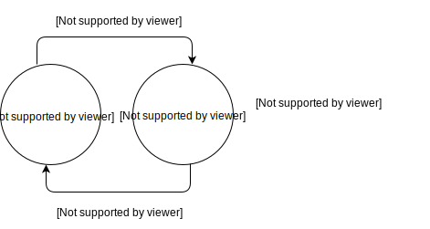

.. _2019_cause_lower_respiratory_infections:

============================
Lower Respiratory Infections
============================

Disease Description
-------------------
Lower respiratory infections (*LRI*), principally clinician-diagnosed pneumonia
and bronchiolitis, is a major global killer of both children and adults. Symptoms
include shortness of breath, weakness, fever, coughing and fatigue. It is important to check for a fever. Symptoms can last about 7 days and the infection is contagious
to others shortly before and while experiencing symptoms. It is mainly
caused by four pathogens - Streptococcus pneumoniae (*pneumococcal
pneumonia*), Haemophilus influenzae type B (*Hib*), influenza, and respiratory
syncytial virus (*RCV*). Those pathogens may co-infect.
Pneumococcal pneumonia is the largest cause of LRI
mortality. [Wikipedia]_, [GBD-2019-Capstone-Appendix]_

The lower respiratory tract or lower airway is derived from the developing foregut
and consists of the trachea, bronchi (primary, secondary and tertiary),
bronchioles (including terminal and respiratory), and lungs (including alveoli).
It also sometimes includes the larynx. [Wikipedia]_

Transmission of LRI may occur via several pathways, including direct physical contact,
fomites, direct droplet spread, and suspended small particles. Intermingling of
large numbers of people can facilitate transmission of respiratory pathogens. [CDC]_

In GBD 2016, malnutrition was identified as a leading risk factor for lower respiratory infection
mortality among children younger than 5 years and, together with air pollution (both household and ambient)
and increased antibiotic use, was identified as a focus for targeted intervention measures. [Lancet]_

.. todo::

   Describe more about deaths and complications due to LRI.
   Talk about current vaccination against influenza and pneumonia.
   https://apps.who.int/iris/bitstream/handle/10665/241904/WER8714_129-144.PDFp

Modeling LRI in GBD 2019
------------------------

The GBD LRI model comprises a fatal and a nonfatal model. The outputs of each of 
these are fit to four etiologies, which are modeled separately.

LRI deaths are estimated using separate CODEm models for children under 5 and 
persons aged 5-95+, due to the significant difference in fatality patterns. These 
models run using CoD data from vital registration systems, surveillance 
systems, and verbal autopsy, along with a set of covariates updated slightly 
from those used in GBD 2017. [GBD-2019-Capstone-Appendix]_

.. todo:: 

   include covariate tables. p96: https://www.thelancet.com/cms/10.1016/S0140-6736(20)30925-9/attachment/deb36c39-0e91-4057-9594-cc60654cf57f/mmc1.pdf

These estimates are then adjusted using CodCorrect to fit the overall mortality 
envelope estimated by the GBD, and mapped to etiologies by location, year, age, 
and sex.

The case definition used for the nonfatal LRI model is "clinician- diagnosed 
pneumonia or bronchiolitis". Primary input data types include incidence and prevalence 
data from population surveys, scientific literature, and hospital/claims 
records. The modelers first adjust survey data for seasonality; then all input 
data with a non-reference case definition is adjusted using correction factors 
estimated with MR-BRT. The modelers defined time to recovery as 10 (5-15) days, 
which corresponds with a remission 36.5. The comprise the inputs for a DisMod 
model. LRI severity splits are obtained from a meta-analysis, and then the 
DisMod outputs are split according to severity before disablility weights for 
YLD calculation are applied. [GBD-2019-Capstone-Appendix]_

.. todo::

   ask sim science, and then gbd team, what "model-MR" is. different from dismod?

LRI viral etiologies include influenza and respiratory syncytial virus (RSV), 
and bacterial etiologies include Streptococcus pneumoniae and Haemophilus 
influenzae type B (Hib). The two types of etiologies are modeled using two different 
counterfactual strategies, and then for each etiology a PAF is calculated. Note 
that as LRI pathogens can co-infect, these PAFs can overlap. Due to a lack of 
data, the modelers did not map neonatal deaths to etiologies. [GBD-2019-Capstone-Appendix]_

The viral etiologies were modeled using the following formula:

.. math:: 

   PAF = Proportion(modeled)*(1-\frac{1}{OR})

Here, *Proportion* is the proportion of LRI cases that test positive for 
influenza or LRI, and *OR* is defined to be the odds ratio of LRI given the 
presence of the pathogen. The odds ratios were obtained from a log-linear 
interpolation model, and the proportion data for each etiology was modeled 
using DisMod. [GBD-2019-Capstone-Appendix]_

The bacterial etiologies were modeled using a vaccine probe design: the
modelers first calculated the ratio of vaccine effectiveness against
nonspecific pneumonia to pathogen-specific pneumonia. Estimates were adjusted by 
vaccine coverage and exoected vaccine performance to generate country- and year-
specific PAFs. DisMod was used to model an age pattern, resulting in the final
location- year- and age- specific PAF estimates. Due to a lack of vaccine
efficacy data for children over two years old, the modelers did not map LRI in 
over-5 year olds to Hib. [GBD-2019-Capstone-Appendix]_

GBD hierarchy
-------------
.. image:: lri_hierarchy.svg

c_{} - cause_{gbd_id}, s_{} - sequelae_{gbd_id}

GBS stands for Guillain-Barré syndrome.

Cause Model Diagram
-------------------

Model Assumptions and Limitations
---------------------------------

Data Description
----------------

Validation Criteria
-------------------

References
----------
.. [Wikipedia] Lower respiratory tact infection. From Wikipedia, the Free Encyclopedia.
   Retrieved 22 Nov 2019.
   https://en.wikipedia.org/wiki/Lower_respiratory_tract_infection

.. [CDC] Respiratory Infections (*The Yellow Book*). Centers for Disease Control and Prevention, 2019. Retrieved 20 Dec 2019.
   https://wwwnc.cdc.gov/travel/yellowbook/2020/posttravel-evaluation/respiratory-infections

.. [Lancet] The Global Burden of Lower Respiratory Infections: Making Progress, but We Need to Do Better (*Volume 18*).
   The Lancet Infectious Diseases, 2018. Retrieved 20 Dec 2019.
   https://www.sciencedirect.com/science/article/pii/S1473309918304079?via%3Dihub

.. [GBD-2019-Capstone-Appendix]
  Appendix_ to: `GBD 2019 Diseases and Injuries Collaborators. Global burden of 
  369 diseases and injuries in 204 countries and territories, 1990–2019: a 
  systematic analysis for the Global Burden of Disease Study 2019. The Lancet. 
  17 Oct 2020;396:1204-1222` 
