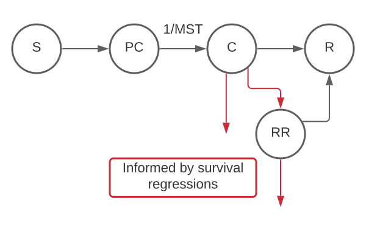

.. _2019_cancer_model_multiple_myeloma:

================
Multiple Myeloma
================

.. contents::
   :local:
   :depth: 1

Disease Overview
----------------

Multiple myeloma (MM) is a clonal plasma cell neoplasm with substantial morbidity and mortality, characterized by end organ damage—renal 
impairment, hypercalcemia, lytic bony lesions, and anemia. 

According to Global Burden of Multiple Myeloma Capstone Publication, there were 156 000 incident cases (95% UI 137 000–173 000), 113 000 deaths (99 500–122 000), and 2·50 million (2·19–2·72) DALYs due to multiple myeloma globally in 2019.

From 2010 to 2019, MM incident cases increased by 28.8%, and deaths increased by 28.8% for both sexes globally. Among SDI quintiles, the largest increase (176%) was seen in middle SDI countries (from 7 653 [95% UI, 6 695-9 513] in 
1990 to 21 143 [95% UI, 17 470-24 144] in 2019).

.. todo::

   Add statistics on region-specific increases, and largest cause-specific contributors.

With the development of better therapies, myeloma has changed from an untreatable ailment to one that is still not curable but treatable with mostly outpatient therapy. 
Although several new treatment options for multiple myeloma are now available, there is no cure for this disease. And almost all patient with multiple myeloma develop relapse/refractory.
Relapse is an inevitable feature of multiple myeloma, resulting in a continued need for new active treatments. Relapse is the return of a cancer, multiple myeloma here, after a clinically disease-free interval. The term relapse is usually used to describe the return of a leukemia, lymphoma, or other hematopoietic malignancy, rather than the return of a carcinoma, according to National Cancer Institute's Surveillance, Epidemiology, and End Results Program (SEER)_. 

Refractory multiple myeloma is multiple myeloma that is not responsive to usual therapies. Patients are considered to have relapsed/ refractory multiple myeloma if they have achieved a minor response or better to treatment relapse and then progress on salvage therapy, or experience progression within 60 days of their last therapy.

The combination of pomalidomide and low-dose dexamethasone is an approved and established option for the treatment of relapsed and refractory myeloma in
patients who have received at least two previous therapies. A randomised, multicentre, open-label, phase 3 study [Attal et al. 2019]
was taken to compare isatuximab plus pomalidomide and dexamethasone with pomalidomide and dexamethasone in patients with relapsed and refractory multiple myeloma. Result shows that the addition of isatuximab to pomalidomide and dexamethasone was associated with a significant and
clinically meaningful benefit in progression-free survival in heavily treated patients with relapsed and refractory multiple myeloma with results from both the investigators
and an independent response committee being consistent.

GBD 2019 Modeling Strategy
--------------------------

Multiple myeloma in GBD 2019
++++++++++++++++++++++++++++

In GBD 2019, MM includes death and disability resulting from malignant neoplasms of plasma cells, including ICD-10 codes such as C90.0. The GBD modelling strategy can be found in the GBD YLD Capstone Appendix [GBD-2019-YLD-Capstone-Appendix-1-Neoplasms]_. 

There is nothing custom about how MM is modeled in GBD compared to the other cancer causes that go through our standard fatal and non-fatal modeling pipelines.

.. list-table:: 
   :widths: 20 25 30 30 20
   :header-rows: 1
   
   * - sequelae
     - health states
     - health state lay descriptions
     - disability weights
     - duration of four prevalence sequelae (in months)
   * - Diagnosis and primary therapy phase 
     - Cancer, diagnosis and primary therapy 
     - has pain, nausea, fatigue, weight loss and high anxiety
     - 0.288 (0.193-0.399)
     - :math:`7^{12}`
   * - Controlled phase 
     - Generic uncomplicated disease: worry and daily medication
     - medication every day and causes some worry but minimal interference with daily activities
     - 0.049 (0.031-0.072)
     - 
   * - Metastatic phase
     - Cancer, metastatic
     - has severe pain, extreme fatigue, weight loss and high anxiety
     - 0.451 (0.307-0.600)
     - :math:`36.82^{10}`
   * - Terminal phase
     - Terminal phase, with medication
     - has lost a lot of weight and regularly uses strong medication to avoid constant pain.
     - 0.540 (0.377-0.687)
     - 1

Remission is calculated based on remainder of time after attributing other sequelae. Duration of these four sequelae remained the same as for GBD 2013, GBD 2015, GBD 2016, and GBD 2017. The sources used to determine their length are SEER Median age standardized survival all patients, all years.

Cause Hierarchy
++++++++++++++++

.. image:: mm_hierarchy.svg

This cause hierarchy has not changed since GBD 2017.

Restrictions
++++++++++++

The following table describes any restrictions in GBD 2019 on the effects of
this cause (such as being only fatal or only nonfatal), as well as restrictions
on the ages and sexes to which the cause applies.

.. list-table:: GBD 2019 Cause Restrictions
   :widths: 15 15 20
   :header-rows: 1

   * - Restriction Type
     - Value
     - Notes
   * - Male only
     - False
     -
   * - Female only
     - False
     -
   * - YLL only
     - False
     -
   * - YLD only
     - False
     -
   * - YLL age group start
     - 15 to 19
     - GBD age group id 8
   * - YLL age group end
     - 95 plus
     - GBD age group id 235
   * - YLD age group start
     - 15 to 19
     - GBD age group id 8
   * - YLD age group end
     - 95 plus
     - GBD age group id 235

This cause's restrictions have not changed since GBD 2017.

Vivarium Modeling Strategy
--------------------------

Scope
+++++

.. todo::

   Add scope.

Model Assumptions and Limitations
+++++++++++++++++++++++++++++++++

.. todo::

   Describe model assumptions and limitations.

Cause Model Diagram
+++++++++++++++++++

State and Transition Data Tables
++++++++++++++++++++++++++++++++
.. list-table:: State Definitions
   :widths: 1, 10, 15
   :header-rows: 1

   * - State
     - State Name
     - Definition
   * - S
     - **S**\ usceptible
     - Susceptible to MM
   * - PC
     - **P**\ re- **C**\linical, detectable MM cancer
     - With asymptomatic condition, screen-detectable, will progress to clinical phase
   * - C
     - **C**\ linical MM cancer
     - With symptomatic condition
   * - RR
     - **R**\ elapsed/ **R**\efractory MM
     - With condition which becomes non-responsive or progressive on therapy or within 60 days of the last treatment in patients who had achieved a minimal response (MR) or better on prior therapy.
   * - R
     - **R**\ ecovered
     - Without condition; not susceptible

.. todo::

  Add State Data & Transition Data tables. 
  If screening is not necessary for this project, can we get rid of PC state since GBD didn't model such state.
  Let's confirm with Manoj whether or not patient can go directly to recovered state from clinical MM state. If duration of recovery is long enough, simulants must go through RRMM before they step into a recovered state.

Validation Criteria
+++++++++++++++++++

.. todo::

   Describe tests for model validation.

References
----------

..[Attal et al. 2019]
   Attal M, Richardson PG, Rajkumar SV, et al. Isatuximab plus pomalidomide and low-dose 
   dexamethasone versus pomalidomide and low-dose dexamethasone in patients with relapsed 
   and refractory multiple myeloma (ICARIA-MM): a randomised, multicentre, open-label, phase 
   3 study. Lancet 2019; 394: 2096–107.
   
..[Cowan et al. 2018]
   Cowan AJ, Allen C, Barac A, et al. Global Burden of Multiple Myeloma: A Systematic 
   Analysis for the Global Burden of Disease Study 2016. JAMA Oncol 2018; 4: 1221–7.

..[GBD-2019-YLD-Capstone-Appendix-1-Neoplasms]
   Supplement to: `GBD 2019 Disease and Injury Incidence and Prevalence
   Collaborators. Global, regional, and national incidence, prevalence, and
   years lived with disability for 354 diseases and injuries for 195 countries
   and territories, 1990–2017: a systematic analysis for the Global Burden of
   Disease Study 2017. Lancet 2018; 392: 1789–858`
   (pp. 803-811)

.. (SEER): https://seer.cancer.gov/seertools/seerrx/rx/53c44b1e102c1290262dd895/?regimen_field=name&rx_type=regimen&drug_offset=0&regimen_offset=125&q=&limit=100&drug_field=name&search_mode=&drug_direction=UP&regimen_direction=UP&mode=