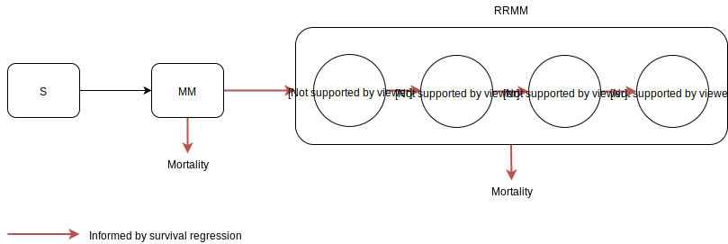

.. _2019_cancer_model_multiple_myeloma:

================
Multiple Myeloma
================

.. contents::
   :local:
   :depth: 1

Disease Overview
----------------

Multiple myeloma (MM) is a clonal plasma cell neoplasm with substantial morbidity and mortality, characterized by end organ damage—renal 
impairment, hypercalcemia, lytic bony lesions, and anemia. 

According to GBD 2019, there were 27 thousand incident cases (95%UI 23-33), 18 thousand deaths (95%UI 16-21), and 350 thousand (95%UI 326–431) disability adjusted life years (DALYs) due to multiple myeloma in the US in 2019.

From 2010 to 2019, MM incident cases increased by 25%, and deaths increased by 27% for both sexes in the US.

With the development of better therapies, myeloma has changed from an untreatable ailment to one that is still not curable but treatable with mostly outpatient therapy. 
Although several new treatment options for multiple myeloma are now available, there is no cure for this disease. And almost all patient with multiple myeloma develop relapse/refractory.
Relapse is an inevitable feature of multiple myeloma, resulting in a continued need for new active treatments. Relapse is the return of a cancer, multiple myeloma here, after a clinically disease-free interval. The term relapse is usually used to describe the return of a leukemia, lymphoma, or other hematopoietic malignancy, rather than the return of a carcinoma, according to National Cancer Institute's Surveillance, Epidemiology, and End Results Program (SEER)_. 

Refractory multiple myeloma is multiple myeloma that is not responsive to usual therapies. Patients are considered to have relapsed/ refractory multiple myeloma if they have achieved a minor response or better to treatment relapse and then progress on salvage therapy, or experience progression within 60 days of their last therapy.

The combination of pomalidomide and low-dose dexamethasone is an approved and established option for the treatment of relapsed and refractory myeloma in
patients who have received at least two previous therapies. A randomised, multicentre, open-label, phase 3 study [Attal et al. 2019]
was taken to compare isatuximab plus pomalidomide and dexamethasone with pomalidomide and dexamethasone in patients with relapsed and refractory multiple myeloma. Result shows that the addition of isatuximab to pomalidomide and dexamethasone was associated with a significant and
clinically meaningful benefit in progression-free survival in heavily treated patients with relapsed and refractory multiple myeloma with results from both the investigators
and an independent response committee being consistent.

GBD 2019 Modeling Strategy
--------------------------

Multiple Myeloma in GBD 2019
++++++++++++++++++++++++++++

In GBD 2019, MM includes death and disability resulting from malignant neoplasms of plasma cells, including ICD-10 codes such as C90.0. The GBD modelling strategy can be found in the GBD YLD Capstone Appendix [GBD-2019-YLD-Capstone-Appendix-1-Neoplasms]_. 

There is nothing custom about how MM is modeled in GBD compared to the other cancer causes that go through our standard fatal and non-fatal modeling pipelines.

.. list-table:: 
   :widths: 20 25 30 30 20
   :header-rows: 1
   
   * - sequelae
     - health states
     - health state lay descriptions
     - disability weights
     - duration of four prevalence sequelae (in months)
   * - Diagnosis and primary therapy phase 
     - Cancer, diagnosis and primary therapy 
     - has pain, nausea, fatigue, weight loss and high anxiety
     - 0.288 (0.193-0.399)
     - :math:`7^{12}`
   * - Controlled phase 
     - Generic uncomplicated disease: worry and daily medication
     - medication every day and causes some worry but minimal interference with daily activities
     - 0.049 (0.031-0.072)
     - 
   * - Metastatic phase
     - Cancer, metastatic
     - has severe pain, extreme fatigue, weight loss and high anxiety
     - 0.451 (0.307-0.600)
     - :math:`36.82^{10}`
   * - Terminal phase
     - Terminal phase, with medication
     - has lost a lot of weight and regularly uses strong medication to avoid constant pain.
     - 0.540 (0.377-0.687)
     - 1

Remission is calculated based on remainder of time after attributing other sequelae. Duration of these four sequelae remained the same as for GBD 2013, GBD 2015, GBD 2016, and GBD 2017. The sources used to determine their length are SEER Median age standardized survival all patients, all years.

Cause Hierarchy
++++++++++++++++

.. image:: mm_hierarchy.svg

This cause hierarchy has not changed since GBD 2017.

Restrictions
++++++++++++

The following table describes any restrictions in GBD 2019 on the effects of
this cause (such as being only fatal or only nonfatal), as well as restrictions
on the ages and sexes to which the cause applies.

.. list-table:: GBD 2019 Cause Restrictions
   :widths: 15 15 20
   :header-rows: 1

   * - Restriction Type
     - Value
     - Notes
   * - Male only
     - False
     -
   * - Female only
     - False
     -
   * - YLL only
     - False
     -
   * - YLD only
     - False
     -
   * - YLL age group start
     - 15 to 19
     - GBD age group id 8
   * - YLL age group end
     - 95 plus
     - GBD age group id 235
   * - YLD age group start
     - 15 to 19
     - GBD age group id 8
   * - YLD age group end
     - 95 plus
     - GBD age group id 235

This cause's restrictions have not changed since GBD 2017.

Vivarium Modeling Strategy
--------------------------

Scope
+++++

To study the impact of different lines of treament for myeloma patients, we 
split multiple myeloma into two disease states: active multiple myeloma (MM); 
and relapsed and refractory multiple myeloma (RRMM). The RRMM state consists of 
multiple relpase stages. Each relapse stage is subsequent outcome corresponding 
to each line of treatment. This MM cause model is intended to simulate MM incidence, 
RRMM incidence, RRMM progression, as well as the mortality from MM and RRMM. The 
inputs for this cause model come from GBD 2019 estimates, scientific literature, 
and survival regression analysis supported by Flatiron data.

Model Assumptions and Limitations
+++++++++++++++++++++++++++++++++

1. This cause model assumes no recovery from MM and RRMM since myeloma is an 
   incurable disease. Patients with MM will inevitably develop relapse and the 
   health outcomes worsen with every relapse and line of treatment.
2. This cause model assumes that the GBD incidence rate corresponding to the incidence 
   of symptomatic MM. That's said, we are comfortable using GBD incidence of MM 
   as the detection rate of symptomatic MM cases. The incidence of RRMM will be 
   calculated from survival regression analysis using Cox's proportional hazard model.
3. The asymptomatic/idolent state (smoldering MM) is excluded from this cause 
   model because we are not interested in the screening and early managment for 
   MM. As a result, the simulation will not track/model simulants with asymptomatic 
   condition.
4. YLLs are substantially larger than YLDs for this cause. For now, we will not 
   build a disability component to capture those secondary outcomes.

Cause Model Diagram
+++++++++++++++++++

State and Transition Data Tables
++++++++++++++++++++++++++++++++

.. list-table:: State Definitions
   :widths: 1, 5, 15
   :header-rows: 1

   * - State
     - State Name
     - Definition
   * - S
     - Susceptible
     - Susceptible to MM, without condition
   * - MM
     - Multiple myeloma
     - With symptomatic condition
   * - RRMM
     - Relpased/refractory multiple myeloma
     - Myeloma returns after initial treatment and can include multiple bouts of 
       relapse before mortality

.. list-table:: State Data
   :widths: 1, 5, 15, 15
   :header-rows: 1
   
   * - State
     - Measure
     - Value
     - Notes
   * - S
     - prevalence
     - (1 - prev_c486)
     - 
   * - S
     - excess mortality rate
     - 0
     - 
   * - MM
     - prevalence
     - prev_c486 * prevalence ratio of MM to RRMM
     - The prevalence ratio is based on literature evidence
   * - MM
     - excess mortality rate
     - Derived from survival regression analysis
     - 
   * - RRMM
     - prevalence
     - prev_c486 * (1 - prevalence ratio of MM to RRMM)
     - The prevalence ratio is based on literature evidence
   * - RRMM
     - excess mortality rate
     - Derived from survival regression analysis
     - 

.. list-table:: Transition Data
   :widths: 1, 1, 1, 10, 10
   :header-rows: 1

   * - Transition
     - Source state
     - Sink state
     - Value
     - Notes
   * - incidence_MM
     - S
     - MM
     - :math:`\frac{\text{incidence_c486}}{1-\text{prev_c486}}`
     - incidence of MM among susceptible population
   * - incidence_RRMM
     - MM
     - RRMM
     - Derived from survival regression analysis
     - 
   * - incidence_relapse
     - (N-1)th relapse
     - Nth relapse
     - Derived from survival regression analysis
     - 

.. list-table:: Data sources
   :widths: 5 10 10
   :header-rows: 1
   
   * - Measure
     - Sources
     - Notes
   * - prev_c486
     - GBD 2019
     - 
   * - incidence_c486
     - GBD 2019
     - 
   * - emr_MM
     - Derived from survival regression analysis
     - Don't use emr_c486
   * - prev_RRMM
     - GBD 2019 and literature review
     - Calculated from prev_c486 and prevalence ratio of MM to RRMM
   * - prevalence ratio of MM to RRMM
     - literature review
     - 
   * - incidence_RRMM
     - Derived from survival regression analysis
     - 
   * - emr_RRMM
     - Derived from survival regression analysis
     - 
   * - incidence_relapse
     - Derived from survival regression analysis
     - 

.. todo::

   Describe methods for splitting the RRMM prevalene by relapse stage.

Survival Regression Model
-------------------------

Model Overview
++++++++++++++

The rates for RRMM are unknown from GBD. So we plan to use the `time-varying Cox's 
proportional hazard model` to predict the transition from MM to RRMM, the transition 
between relapses within RRMM, the mortality from MM, and the mortality from RRMM 
(every relapse). These rates are assumed to be dependent on covariates such as 
age, sex, race/ethnicity, renal function, cytogenetic risk, and different lines 
of therapy. Our survival regression aims to model the rates as a function of hazard 
that is determined by time and a series of covariates. Moreover, time-varying 
regression model will allow us to model individuals' covariate (e.g., age) that 
changes over time. The idea behind this model is that the log-hazard of an individual 
is a linear function of their covariates and a population-level baseline that 
changes over time. Mathematically: 

:math:`h(t|x) = b_{0}(t) \times \exp\left(\sum \limits_{i=1}^n \beta_{i}(x_{i}(t)-\bar{x_{i}})\right)`

Where,
 - :math:`t` is the survival time
 - :math:`x` is the covariate
 - :math:`h(t|x)` is the hazard function determined by a set of covariates
 - :math:`b_{0}(t)` is the baseline hazard
 - :math:`\beta_{i}` is the coefficient that measures the impact of covariate
 - :math:`\sum \limits_{i=1}^n \beta_{i}(x_{i}(t)-\bar{x_{i}})` is the time-variant log partial hazard

This survival model consists of two parts: the underlying baseline hazard function, 
often denoted as :math:`b_{0}(t)`, describing how the risk of event per time unit 
changes over time at baseline levels of covariates; and the effect parameters, 
describing how the hazard varies in response to explanatory covariates. The baseline 
hazard function is consistent across time, calculated from the start when all 
covariates are set to zero. It could be parametric or non-parametric depending 
on what data are available in Flatiron. We hope that the coefficient of effect 
for all relevant covariates can be guided by Flatiron data as well.

From the survival regression model, we expect to output the survival/hazard as a 
function of time to tell when an event will happen and its likelihood, in a 
baseline survival model and a model with different values of covariates. In general, 
We will create two survival regression models:
 1. Mortality hazard model to predict time to death from MM and time to death from 
    each of relapse states. 
 2. Transition hazard model to predict time from MM to RRMM, and time between last 
    relapse and next relapse within RRMM state. 

Model Assumptions
+++++++++++++++++

 - The proportional hazard model assumes that `all` individuals have the same hazard 
   function, but a unique scaling factor infront. So the `shape` of the hazard function 
   is the same for all individuals, and only a scalar multiple changes per individual.
 - Another key assumption is that each covariate has a multiplicative effect in 
   the hazard function that is constant over time.

Diagnostics for the Cox Model
+++++++++++++++++++++++++++++

 - Testing the proportional hazards assumption (Schoenfeld residual)
 - Detecting nonlinearity for continous variables (Martingale residual)
 - Examining influential observations (Deviance residual)

We will perform certain diagnostic tests for the Cox’s proportional hazard model. 
To check the model assumptions, residual methods are intended to be used in our 
survival analysis. In principle, the Schoenfeld residuals are independent of time. 
A plot that shows a non-random pattern against time is evidence of a violation of 
the PH assumption. By plotting event time against the Schoenfeld residual for each 
covariate, we except to see a non-significant relationship between Schoenfeld 
residuals and time. Often, we assume that continuous covariates have a linear form. 
However, this assumption should be checked. We can detect the nonlinearity between 
log hazard and the covariates by plotting the Martingale residual against continuous 
covariates. In addition, we plan to use the Deviance residual (a normalized 
transform of the martingale residual) to examine any influential observations 
or outliers.

To check the performance of Cox's model, we will include goodness of fit in our 
survival analysis results. Specifically, Cox-Snell residuals will be used to assess 
a model's goodness-of-fit. By plotting the Cox-Snell residual against the cumulative 
hazard function a model's fit can be assessed. We might modify the standard Cox-Snell 
residuals to account for the censored observations.

Input Data Table
++++++++++++++++

.. list-table:: Combination of different observations
   :header-rows: 1
   
   * - Age
     - Sex
     - Race
     - CKD
     - Cytogenetic risk
     - Transplantation
     - Treatment
     - Duration
     - Event
   * - 15 to 95 plus with 5-year age bin
     - ['Male', 'Female']
     - ['Black/African', 'Non-Black/African']
     - ['Stage 1', 'Stage 2', 'Stage 3', 'Stage 4', 'Stage 5']
     - ['High-risk', 'Standard-risk']
     - ['Eligible', 'Ineligible']
     - ['First line not Isa', 'Second line not Isa', 'Third or later line not Isa', 'Isatuximab']
     - ['Duration from MM to RRMM', 'Duration from MM to death', 'Duration from Nth relapse to (N+1)th relapse', 'Duration from Nth relapse to death']
     - ['Event of transition from MM to RRMM', 'Event of transition from Nth relapse to (N+1)th relapse', 'Event of death from MM', 'Event of death from Nth relapse']

.. todo::

   Add more details

Validation Criteria
+++++++++++++++++++

.. todo::

   Describe tests for model validation.

References
----------

..[Attal et al. 2019]
   Attal M, Richardson PG, Rajkumar SV, et al. Isatuximab plus pomalidomide and low-dose 
   dexamethasone versus pomalidomide and low-dose dexamethasone in patients with relapsed 
   and refractory multiple myeloma (ICARIA-MM): a randomised, multicentre, open-label, phase 
   3 study. Lancet 2019; 394: 2096–107.
   
..[Cowan et al. 2018]
   Cowan AJ, Allen C, Barac A, et al. Global Burden of Multiple Myeloma: A Systematic 
   Analysis for the Global Burden of Disease Study 2016. JAMA Oncol 2018; 4: 1221–7.

..[GBD-2019-YLD-Capstone-Appendix-1-Neoplasms]
   Supplement to: `GBD 2019 Disease and Injury Incidence and Prevalence
   Collaborators. Global, regional, and national incidence, prevalence, and
   years lived with disability for 354 diseases and injuries for 195 countries
   and territories, 1990–2017: a systematic analysis for the Global Burden of
   Disease Study 2017. Lancet 2018; 392: 1789–858`
   (pp. 803-811)

.. (SEER): https://seer.cancer.gov/seertools/seerrx/rx/53c44b1e102c1290262dd895/?regimen_field=name&rx_type=regimen&drug_offset=0&regimen_offset=125&q=&limit=100&drug_field=name&search_mode=&drug_direction=UP&regimen_direction=UP&mode=