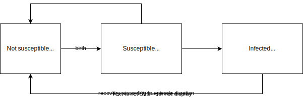

.. _2019_cause_postpartum_depression:

==============================
Postpartum depression
==============================

.. contents::
   :local:
   :depth: 1

.. list-table:: Abbreviations
  :widths: 15 15 15
  :header-rows: 1

  * - Abbreviation
    - Definition
    - Note
  * - PPD
    - Postpartum depression
    - 
  * - MDD
    - Major depressive disorder
    - 

Disease Overview
----------------

The postpartum period is a time of intense transition and can cause new mothers and birthing parents to be vulnerable to psychiatric disorders. Depression episodes can be twice as likely during the postpartum period relative to other times of life and postpartum depression (PPD) can adversely affect the wellbeing of mothers and birthing parents, infants, and other family members. 

PPD refers to non-psychotic depressive episodes in the postpartum period that persist for more than two weeks and shares the same diagnostic criteria as major depressive disorder in the DSM-5 [Shorey-et-al-2018]_. Specifically, major depressive disorders are marked by depressed mood or loss of interest/pleasure that represent a change from the person's baseline and impaired functioning observed across social, occupational, and educational domains. Additional symptoms may include excessive sleeping or insomnia; change in eating, appetite, or weight; agitated or slow motor activity; fatigue; feeling worthless or inappropriately guilty; trouble concentrating; and repeated thoughts about death. [GBD-2019-Capstone-Appendix-PPD]_

GBD 2019 Modeling Strategy
--------------------------

Postpartum depression is not specifically estimated by the GBD. Rather, we will inform the prevalence of postpartum depression from a recent review and meta-analysis performed by [Shorey-et-al-2018]_. This review focused on healthy mothers with no prior history of postpartum depression, but found similar results to previous evaluations of postpartum depression prevalence among the broader population. [Shorey-et-al-2018]_ reported that the incidence of postpartum depression was equal to 12% (95% CI 0.04–0.20).

While the GBD does not model PPD, it does model major depressive disorder. The GBD estimated that the average duration of major depressive disorder was 0.65 (95% UI: 0.59, 0.70) of one year (as informed through analysis of longitudinal studies on remission from major depressive disorder and the assumption that 40 years is the maximum duration of the condition), which we will use to inform the duration of postpartum depression in our simulation [GBD-2019-Capstone-Appendix-PPD]_ (page 1013). 

Additionally, the GBD models severity distributions and associated disability weights for major depressive disorder, summarized in the table below [GBD-2019-Capstone-Appendix-PPD]_ (page 1013). Notably, the GBD defines major depressive disorder (MDD) as an episodic mood disorder involving the experience of one or more major depressive episode(s). The percent of case severity was determined from the US National Epidemiological Survey on Alchol and Related Conditions (conducted in two waves from 2001-2002 and 2004-2005) and the Australian National Survey of Mental Health and Wellbeing of Adults. Notably, burden due to major depressive disorder in GBD begins in the 1 to 4 year age group.

.. list-table:: Major depressive disorder disability weights
  :header-rows: 1

  * - Severity
    - Percent of cases
    - Disability weight
  * - Asymptomatic
    - 13 (10, 17)
    - 0
  * - Mild
    - 59 (49, 69)
    - 0.145 (0.099, 0.209)
  * - Moderate
    - 17 (13, 22)
    - 0.396 (0.267, 0.531)
  * - Severe
    - 10 (3, 20)
    - 0.658 (0.477, 0.807)

We will conservatively assume that postpartum depression is not a cause/contributor of maternal mortality due to suicide or other causes in our simulation. While the GBD estimates deaths due to self-harm, these estimates are not specific to the postpartum population and therefore may not be generalizable.  

Vivarium Modeling Strategy
--------------------------

Scope
+++++

We will not model PPD as a dynamic transition model, but rather a probabilistic condition that begins at the time of birth (see the :ref:`pregnancy model document <other_models_pregnancy>`) and persists for some specified duration. The probability of experiencing PPD will be informed by a ratio per birth from the literature. PPD will be modeled as a YLD-only cause, although this is a limitation of our model as PPD may be associated with risk of suicide.

Assumptions and Limitations
+++++++++++++++++++++++++++

- We are limited in that the rate of PPD in our model is informed from a systematic literature review and meta-analysis that is not location-, year-, or age-specific and the analysis of PPD incidence primarily conducted in high-resource settings.

- We are limited in that we do not consider mortality associated with PPD in our model.

- We are limited in that we assume all PPD cases persist for the same average duration of a single MDD episode. This is limited in the sense that duration may vary by MDD severity (for example, a longer duration for more severe cases), which could cause our estimation of YLDs to be biased. Additionally, we assume that duration of PPD is equal to the duration of all MDD episodes.

- We assume that the GBD MDD severity distribution, which is based on analysis of high-resource settings, generalizes to the severity of PPD in our simulation population of interest.

.. todo::

  Reach out to the GBD modeler to get a sense of if the asymtomatic sequela for MDD should be applied to PPD, per `Abie's comment here <https://github.com/ihmeuw/vivarium_research/pull/1012#discussion_r990678992>`_

- We assume that the onset of PPD occurs immediately following birth. However, the onset of PPD may peak around two or three months postpartum [Shorey-et-al-2018]_.

.. todo::

  Consider adding a delay to PPD episode onset if it is included in a model where this delay may be consequential (PPD impacts on fertility in a model that considers birth intervals, for example).

- We assume that there is no autocorrelation of PPD at the individual level across subsequent pregnancies independent of that introduced through the hemoglobin risk factor for PPD. This is likely not reflective of reality given that experiencing prior depressive episodes is a risk factor for PPD. This should have little impact on our estimates of PPD YLDs among women of reproductive age. However, this may be a limiting assumption if we were to model the impacts of PPD on child health (e.g. first sibling experiences maternal PPD episode at birth *and* at birth of second child).

Cause Model Diagram
+++++++++++++++++++

Data Tables
++++++++++++++++++++++++++++

Restrictions
""""""""""""

The postpartum depression cause model restrictions are the same as the restrictions for the :ref:`pregnancy model <other_models_pregnancy>` with the exception of the age end parameter.

.. list-table:: Postpartum Depression Cause Restrictions
   :widths: 15 15 20
   :header-rows: 1

   * - Restriction Type
     - Value
     - Notes
   * - Male only
     - False
     -
   * - Female only
     - True
     -
   * - YLL only
     - False
     - 
   * - YLD only
     - True
     -
   * - YLL age group start
     - N/A
     -
   * - YLL age group end
     - N/A
     -
   * - YLD age group start
     - 10 to 14 (ID=7)
     -
   * - YLD age group end
     - 55 to 59 (ID=16)
     - Note that this is older than able to *become* pregnant, but PPD may extend into this age group among pregnancies that begin in the 50 to 54 year age group. 

Frequency
"""""""""

This incidence value should represent the probability that a simulant experiences a postpartum depression episode **at the time of birth** in our simulation (see the :ref:`pregnancy model <other_models_pregnancy>` for details). Simulant propensity for determining whether a PPD case occurs should not be fixed and should be independent for each pregnancy.

.. list-table:: Ratio per birth
   :header-rows: 1

   * - Event
     - Value
     - Note
   * - Incidence of postpartum depression
     - 0.12 (95% CI 0.04, 0.20), truncated normal distribution (truncate at 95% CI limits)
     - [Shorey-et-al-2018]_

Duration
""""""""""""""""""

If a simulant is determined to experience a PPD episode according to the `Frequency`_ section above, they should remain in the PPD state for a duration of **0.65 years (95% UI: 0.59, 0.70; truncated normal distribution** of uncertainty with bounds equal to UI limits).

Disability
""""""""""""""""""

If a simulant is determined to experience a PPD episode according to the `Frequency`_ section above, the severity of the episode should be randomly determined according to the percent of cases column in the table below. Then, the simulant should accrue years lived with disability according to the severity-specific disability weights in the table below for the `Duration`_ of the episode. Note that the values in the table below come from page 1013 of the [GBD-2019-Capstone-Appendix-PPD]_.

.. list-table:: Major depressive disorder disability weights
  :header-rows: 1

  * - Severity
    - Percent of cases
    - Disability weight
  * - Asymptomatic
    - 14
    - 0
  * - Mild
    - 59 
    - 0.145 (0.099, 0.209)
  * - Moderate
    - 17 
    - 0.396 (0.267, 0.531)
  * - Severe
    - 10 
    - 0.658 (0.477, 0.807)

Validation Criteria
++++++++++++++++++++

- Our simulation should replicate input data for PPD incidence and duration.

- We do not have a validation target for postpartum depression YLDs specifically. However, prevalence should be compared to to values reported in [Shorey-et-al-2018]_. Additionally, we should compare PPD YLDs per PPD case in our simulation to the implied value from GBD for the major depressive disorders cause. 

References
----------

.. [GBD-2019-Capstone-Appendix-PPD]
  Appendix to: `GBD 2019 Diseases and Injuries Collaborators. Global burden of
  369 diseases and injuries in 204 countries and territories, 1990–2019: a 
  systematic analysis for the Global Burden of Disease Study 2019. The Lancet. 
  17 Oct 2020;396:1204-1222` 

.. [Shorey-et-al-2018]
  Shorey S, Chee CYI, Ng ED, Chan YH, Tam WWS, Chong YS. Prevalence and incidence of postpartum depression among healthy mothers: A systematic review and meta-analysis. J Psychiatr Res. 2018 Sep;104:235-248. doi: 10.1016/j.jpsychires.2018.08.001. Epub 2018 Aug 3. PMID: 30114665.