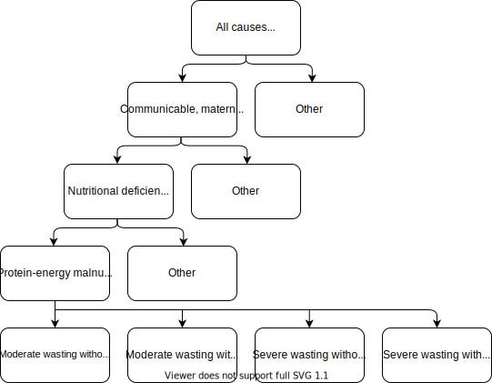

.. role:: underline
    :class: underline

..
  Section title decorators for this document:

  ==============
  Document Title
  ==============

  Section Level 1 (#.0)
  +++++++++++++++++++++
  
  Section Level 2 (#.#)
  ---------------------

  Section Level 3 (#.#.#)
  ~~~~~~~~~~~~~~~~~~~~~~~

  Section Level 4
  ^^^^^^^^^^^^^^^

  Section Level 5
  '''''''''''''''

  The depth of each section level is determined by the order in which each
  decorator is encountered below. If you need an even deeper section level, just
  choose a new decorator symbol from the list here:
  https://docutils.sourceforge.io/docs/ref/rst/restructuredtext.html#sections
  And then add it to the list of decorators above.

.. _2019_risk_exposure_static_wasting:

====================================================================
GBD 2019 Static Child Wasting Model and Protein Energy Malnutrition
====================================================================

.. contents::
  :local:

Overview
++++++++

This page contains information pertaining to the *static* joint risk-cause wasting model. An :ref:`alternative dynamic transition model of wasting exposure (specific to GBD 2020) is described elsewhere <2020_risk_exposure_wasting_state_exposure>`. Given that wasting is generally considered an acute rather than chronic condition, it is more appropriate to model it as a dynamic transition model. However, a dynamic exposure model of child wasting is not modeled by GBD and is complex and data intensive. As a simplication to the :ref:`dynamic transition wasting model <2020_risk_exposure_wasting_state_exposure>` used for the :ref:`acute malnutrition simulation <2019_concept_model_vivarium_ciff_sam>`, this document will describe a propensity-based *static* child wasting exposure modeling strategy for 2019 similar to the modeling strategy for :ref:`GBD 2020 child stunting exposure <2020_risk_exposure_child_stunting>`.

GBD stratifies wasting 
into four categories: TMREL, mild, moderate, and severe wasting. All PEM cases 
are attributed to moderate and severe wasting, making PEM a PAF-of-1 model. 
Under the GBD framework, wasting is additionally a risk for measles, diarrheal diseases, 
and lower respiratory infections. These relationships are detailed under the 
:ref:`risk effects page for wasting <2019_risk_effect_wasting>`.

.. list-table:: Abbreviations
  :header-rows: 1

  * - Abbreviation
    - Definition
    - Note
  * - WHZ
    - Weight for height z-score
    - 
  * - PEM
    - Protein energy malnutrition
    - 

Wasting background
++++++++++++++++++

See description on the :ref:`dynamic transition wasting exposure model document <2020_risk_exposure_wasting_state_exposure>`.

Wasting Exposure in GBD 2019
++++++++++++++++++++++++++++

Child wasting REI ID = 240

.. list-table:: Wasting categories in GBD 2019
  :header-rows: 1

  * - Category
    - Description
    - Range
    - Note
  * - cat1
    - Severe child wasting
    - Less than -3 WHZ
    - 
  * - cat2
    - Moderate child wasting
    - Between -2 and -3 WHZ
    - 
  * - cat3
    - Mild child wasting
    - Between -1 and -2 WHZ
    - 
  * - cat4
    - No child wasting
    - Greater than -1 WHZ
    - TMREL

.. list-table:: Wasting Restrictions 2019
   :widths: 10 10 20
   :header-rows: 1

   * - Restriction type
     - Value
     - Notes
   * - Male only
     - False
     -
   * - Female only
     - False
     -
   * - Risk exposure age group start
     - Early Neonatal
     - age_group_id = 2. This is the earliest age group for which the wasting risk exposure estimates nonzero prevalence.
   * - Risk effects age group start
     - Post neonatal
     - age_group_id = 4. This is the earliest age group for which there exist wasting RRs.
   * - Age group end (risk exposure and effects)
     - 1 to 4
     - age_group_id = 5

Protein Energy Malnutrition in GBD 2019
++++++++++++++++++++++++++++++++++++++++++++

PEM is a PAF-of-1 cause with child wasting in GBD 2019 among the unrestricted ages for child wasting. There are fatal and non-fatal components.

.. list-table:: PEM Restrictions 2020
   :widths: 10 10 20
   :header-rows: 1

   * - Restriction type
     - Value
     - Notes
   * - Male only
     - False
     - 
   * - Female only
     - False
     - 
   * - YLL only
     - False
     - 
   * - YLD only
     - False
     - 
   * - YLL age group start
     - Post neonatal
     - age_group_id = 4
   * - YLL age group end
     - 95 plus
     - age_group_id = 235
   * - YLD age group start
     - Early Neonatal
     - age_group_id = 2
   * - YLD age group end
     - 95 Plus
     - age_group_id = 235

Vivarium Modeling Strategy
++++++++++++++++++++++++++

The wasting exposure model should be implemented as a propensity risk exposure model such that a simulant's child wasting exposure state may change as they age into the next age group, but their child wasting percentile within the population will remain constant.

If a simulant is in wasting risk exposure :code:`cat1` or :code:`cat2`, they should be considered "infected" with severe and moderate PEM (respectively) and accrue YLDs according to the disability weights as well as experience the associated excess mortality rates defined in the table below.

.. list-table:: State data
  :header-rows: 1

  * - State
    - Measure
    - Value
    - Note
  * - cat1 (severe wasting, severe PEM)
    - disability weight
    - :math:`\frac{\text{dw_s199} * \text{prevalence_s199} + \text{dw_s2036} * \text{prevalence_s2036}}{\text{prevalence_s199} + \text{prevalence_s2036}}`
    - 
  * - cat1 (severe wasting, severe PEM)
    - excess mortality rate
    - :math:`\frac{\text{deaths_c387}}{\text{population} * \text{prevalence_c387}}`
    - Assumed same excess mortality rate as cat2 moderate PEM
  * - cat2 (moderate wasting, severe PEM)
    - disability weight
    - :math:`\frac{\text{dw_s198} * \text{prevalence_s198} + \text{dw_s2033} * \text{prevalence_s2036}}{\text{prevalence_s198} + \text{prevalence_s2033}}`
    - 
  * - cat2 (moderate wasting, severe PEM)
    - excess mortality rate
    - :math:`\frac{\text{deaths_c387}}{\text{population} * \text{prevalence_c387}}`
    - Assumed same excess mortality rate as cat1 severe PEM
  * - cat3 (mild wasting)
    - disability weight
    - 0
    - 
  * - cat3 (mild wasting)
    - excess mortality rate
    - 0
    - 
  * - cat4 (tmrel)
    - disability weight
    - 0
    - 
  * - cat4 (tmrel)
    - excess mortality rate
    - 0
    - 

.. list-table:: Data values
  :header-rows: 1

  * - Parameter
    - Source
    - Note
  * - Wasting risk exposure, rei_id=240
    - source='exposure', decomp_step='step4', status='best', gbd_round_id=6, year_id=2019, gbd_id_type='rei', gbd_id=240
    - 
  * - deaths_c387
    - source='codcorrect', decomp_step='step5', version_id=260, gbd_round_id=6, year_id=2019, gbd_id_type='cause', gbd_id=387
    - 
  * - prevalence_c387
    - source='como', decomp_step='step5', status='best', gbd_round_id=6, year_id=2019, gbd_id_type='cause', gbd_id=387, measure_id=5
    - 
  * - prevalence_s{198,199,2033,2036}
    - source='como', decomp_step='step5', status='best', gbd_round_id=6, year_id=2019, gbd_id_type='sequela', gbd_id=[198,199,2033,2036], metric_id=5
    - 
  * - dw_s198
    - 0.051 (0.031–0.079)
    - Moderate wasting with edema (from the GBD 2019 risk appendix table S13)
  * - dw_s2033
    - 0
    - Moderate wasting without edema (from the GBD 2019 risk appendix table S13)
  * - dw_s199
    - 0.128 (0.082–0.183)
    - Severe wasting without edema (from the GBD 2019 risk appendix table S13)
  * - dw_s2036
    - 0.172 (0.115-0.238)
    - Severe wasting with edema (from the GBD 2019 risk appendix table S13)

.. note::

  It looks like these sequelae descriptions are mislabeled if logical numbering patterns were followed, but I have confirmed they are correct despite this suspicion.

Validation 
++++++++++

- Wasting exposure state person time should validate to GBD wasting risk exposure
- PEM exposure state person time, CSMR, EMR, YLDs, and YLLs should validate to GBD prevalence
- Moderate PEM state person time should occur among those in wasting exposure cat2 only 
- Severe PEM state person time should occur among those in wasting exposure cat1 only 

Assumptions and limitations
+++++++++++++++++++++++++++++

We are modeling wasting as a chronic condition rather than the acute condition that it is. This may cause us to overestimate wasting burden among the population afflicted with correlated factors and vise versa. Additionally, we may underestimate wasting exposures in the older age groups as simulants with propensities for wasting exposure will die at a higher rate than those without. We also assume that moderate and severe PEM have equal excess mortality rates when it is likely higher for severe PEM.

References
++++++++++

