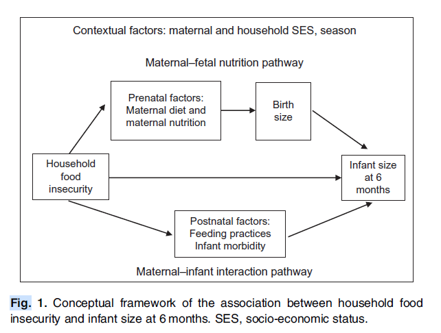

.. _2019_risk_correlation_child_growth:

..
  Section title decorators for this document:

  ==============
  Document Title
  ==============

  Section Level 1
  ---------------

  Section Level 2
  +++++++++++++++

  Section Level 3
  ^^^^^^^^^^^^^^^

  Section Level 4
  ~~~~~~~~~~~~~~~

  Section Level 5
  '''''''''''''''

  The depth of each section level is determined by the order in which each
  decorator is encountered below. If you need an even deeper section level, just
  choose a new decorator symbol from the list here:
  https://docutils.sourceforge.io/docs/ref/rst/restructuredtext.html#sections
  And then add it to the list of decorators above.

=================================================
Child Growth Failure Risk Correlations
=================================================

Risk Exposures Overview
------------------------

Child anthropometry is measured through several different correlated metrics, generally related to length/height, weight, and age. Relevant metrics include:

.. list-table:: Child Anthropometry Metrics
   :header-rows: 1

   * - Metric
     - Typical threshold value
   * - Gestational age
     - Preterm birth: <37 weeks
   * - Birthweight
     - Low birthweight: <2500 grams
   * - Length/height for age (LAZ/HAZ)
     - Stunted: 2+ standard deviations below mean
   * - Weight for length/height (WLZ/WHZ)
     - Wasted: 2+ standard deviations below mean
   * - Weight for age (WAZ)
     - Underweight: 2+ standard deviations below mean

Notably, these metrics tend to be highly correlated, with the magnitude of correlation varying with age. The metrics are related both through common causes as well as through suspected direct causal influences in some cases. The below diagram represents a causal framework for child growth metrics at birth as they relate to child growth metrics throughout the pre- and post-natal periods, as presented by [Na-et-al-2020]_.

Notably, it is critical to distinguish between the correlation between these metrics attributable to shared common causes between them from correlation between these metrics attributable to direct causal relationships. However, the influence of confounding factors in the estimation of the causal relationship between these factors must be carefully considered due to the high correlation between them and the observational nature of child antropometry studies. Additionally, child age should be considered as an important effect modifier in the associations between each of these metrics, as discussed by [Alderman-and-Headey-2018]_.

Correlation
++++++++++++

Spearman correlation coefficients between birthweight and LAZ, WAZ, and WLZ among the first two years of age were estimated from the MAL-ED study [MAL-ED-investigators-2014]_ and presented in the figures below.

.. image:: bw_laz_correlation_plot.png

.. image:: bw_waz_correlation_plot.png

.. image:: bw_wlz_correlation_plot.png

.. note::

   These correlation coefficients were estimated by Chris for previous work on the :ref:`risk correlation proposal <2017_risk_models>` for the :ref:`Balanced Energy Protein simulation <2017_concept_model_vivarium_gates_bep>`.

.. todo::

  Confirm if the following hypotheses are true:

   The figures are shown for birthweight rather than small for gestational age. Additionally, the figures above for LAZ and WAZ are based on chronological age since birth without consideration for gestational age at birth. Since birthweight and gestational age are highly correlated and the above figures do not consider this, the high correlations seen between birthweight and LAZ and WAZ in the first few months of life in the above figures may be partially attributable to preterm birth, with the signficance of this influence waning over time.

   The correlation between birthweight and WHZ increases in magnitude over time, which may be a result of the burden of wasting typically reaching a peak at around 12 months of age [Alderman-and-Headey-2018]_ as well as the autocorrelation between previous episodes of wasting and future episodes of wasting among individual children.

Causation
+++++++++++

Risk Exposures in GBD
-----------------------

Birthweight and Wasting
++++++++++++++++++++++++

Correlation
^^^^^^^^^^^^

Causation
^^^^^^^^^^^

Assumptions and Limitations
^^^^^^^^^^^^^^^^^^^^^^^^^^^^

Validation Criteria
^^^^^^^^^^^^^^^^^^^^^

References
-----------

.. [Alderman-and-Headey-2018]
  Alderman H, Headey D. The timing of growth faltering has important implications for observational analyses of the underlying determinants of nutrition outcomes. PLoS One. 2018 Apr 25;13(4):e0195904. doi: 10.1371/journal.pone.0195904. PMID: 29694431; PMCID: PMC5919068. `Available here <https://pubmed.ncbi.nlm.nih.gov/29694431/>`_.

.. [MAL-ED-investigators-2014]
  The MAL-ED Network Investigators, The MAL-ED Study: A Multinational and Multidisciplinary Approach to Understand the Relationship Between Enteric Pathogens, Malnutrition, Gut Physiology, Physical Growth, Cognitive Development, and Immune Responses in Infants and Children Up to 2 Years of Age in Resource-Poor Environments, Clinical Infectious Diseases, Volume 59, Issue suppl_4, November 2014, Pages S193–S206, `doi.org/10.1093/cid/ciu653 <https://doi.org/10.1093/cid/ciu653/>`_

.. [Na-et-al-2020]
  Na M, Shamim AA, Mehra S, Labrique A, Ali H, Wu LS, Shaikh S, Klemm R, Christian P, West KP. Maternal nutritional status mediates the linkage between household food insecurity and mid-infancy size in rural Bangladesh. Br J Nutr. 2020 Jun 28;123(12):1415-1425. doi: 10.1017/S0007114520000707. Epub 2020 Feb 27. PMID: 32102702. `Available here <https://pubmed.ncbi.nlm.nih.gov/32102702/>`_.

