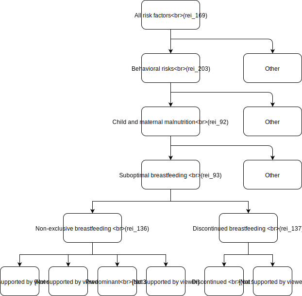

.. _2020_risk_suboptimal_breastfeeding:

========================
Suboptimal Breastfeeding
========================

Risk Exposure Overview
----------------------
Exposure to suboptimal breastfeeding is composed of two distinct categories: 
non-exclusive breastfeeding and discontinued breastfeeding. 

**Non-exclusive breastfeeding** is defined as the proportion of children under 6 
months of age who are not exclusively breastfed. GBD divides those not exclusively 
breastfed into three categories: predominant, partial, and no breastfeeding.

 - Predominant breastfeeding is the proportion of children whose predominant 
   source of nourishment is breastmilk but also receive other liquids.
 - Partial breastfeeding is the proportion of children who receive breastmilk 
   as well as food and liquids, including non-human milk and formula.
 - No breastfeeding is the proportion of children who do not receive breastmilk 
   as a source of nourishment.

**Discontinued breastfeeding** is defined as the proportion of children between 
6 and 23 months who receive no breastmilk as a source of nourishment. 

Risk Exposures Description in GBD
---------------------------------
In GBD, non-exclusive breastfeeding is modeled as a categorical variable 
(predominant, partial, and none) using ST-GPR based on processed individual-level 
microdata from surveys (e.g., Demographic and Health Surveys, Multiple Indicator 
Cluster Surveys, etc.); in the case where microdata were unavailable, GBD used 
tabulated data from survey reports and scientific literature. Data used to 
categorise type of non-exclusive breastfeeding come from surveys with 24-hour 
dietary logs based on maternal recall.

To generate exposure categories for non-exclusive breastfeeding, GBD converted 
the modelled ratios of exclusive, predominant, and partial breastfeeding to the 
total category prevalence by multiplying each ratio by the estimates of any 
breastfeeding among children aged 0–5 months. This ensured that these categories 
sum correctly to the “any breastfeeding 0–5 months” envelope. GBD calculated the 
proportion of children receiving no breastmilk 0–5 months of age by subtracting 
the estimates of current breastfeeding from 1. They perform the same operation 
to estimate discontinued breastfeeding in the 6-11 months and 12-23 months 
categories.

Exposure modeling strategy
++++++++++++++++++++++++++
GBD generated a complete time series from 1980 to 2022 for the prevalence of 
breastfeeding patterns for children 0 to 5 months and 6 to 23 months using a 
three-step ST-GPR modelling process. In previous GBD rounds, 
[GBD-2019-Capstone-Appendix-Breastfeeding]_ “any breastfeeding” was modelled 
separately for each of the estimated age groups. In GBD 2020 with the addition 
of new under-5 age groups, they incorporated the three age groups into a single 
model of “any breastfeeding.” This allowed them to borrow additional strength 
over space, age, and time by incorporating data from all sources in one model. 
GBD built 6 models to produce each of breastfeeding categories:

 1. proportion of currently breastfeeding infants 0-5 months
 2. proportion of currently breastfeeding infants 6-11 months
 3. proportion of currently breastfeeding infants 12-23 months
 4. ratio of infants exclusively breastfed to any breastfed infants 0-5 months
 5. ratio of infants predominantly breastfed to any breastfed infants 0-5 months
 6. ratio of infants partially breastfed to any breastfed infants 0-5 months

Theoretical minimum risk exposure level
+++++++++++++++++++++++++++++++++++++++
For non-exclusive breastfeeding, children aged 0-6 months who received no source 
of nourishment other than breastmilk ("exclusively breastfed") were considered to 
be at the lowest risk of any of the disease outcomes. For discontinued 
breastfeeding, children aged 6 to 23 months who received any breastmilk as a 
source of nourishment ("any breastfed") were considered to be at the 
lowest risk of disease outcome.

Assessment of risk-outcome pairs
++++++++++++++++++++++++++++++++

.. list-table:: Risk-Outcome Pairs for Suboptimal Breastfeeding
   :header-rows: 1

   * - Risk
     - Outcome
   * - Non-exclusive breastfeeding
     - Diarrheal disease
   * - Non-exclusive breastfeeding
     - Lower respiratory infection
   * - Discontinued breastfeeding
     - Diarrheal disease

Relative risk
+++++++++++++
GBD estimated relative risks for both non-exclusive and discontinued breastfeeding 
in a meta-analysis using relative risks from studies compiled in a published 
review by WHO. [WHO-Breastfeeding]_ These estimates were produced using the 
"metareg" package in Stata. They did not estimate separate relative risk for 
morbidity and mortality. The values are detailed in table below.

.. list-table:: GBD 2020 Non-exclusive Breastfeeding Relative Risk Estimates
   :header-rows: 1

   * - Outcome
     - Exposure category
     - Morbidity/Mortality
     - Sex
     - Age
     - Value
   * - Diarrheal disease
     - Exclusive breastfeeding
     - Both
     - Both
     - 0-5 months
     - 1.0 (1.0-1.0)
   * - Lower respiratory infection
     - Exclusive breastfeeding
     - Both
     - Both
     - 0-5 months
     - 1.0 (1.0-1.0)
   * - Diarrheal disease
     - Predominant breastfeeding
     - Both
     - Both
     - 0-5 months
     - 2.35 (1.67-3.23)
   * - Lower respiratory infection
     - Predominant breastfeeding
     - Both
     - Both
     - 0-5 months
     - 1.37 (1.06-1.80)
   * - Diarrheal disease
     - Partial breastfeeding
     - Both
     - Both
     - 0-5 months
     - 2.63 (1.94-3.48)
   * - Lower respiratory infection
     - Partial breastfeeding
     - Both
     - Both
     - 0-5 months
     - 1.48 (1.21-1.79)
   * - Diarrheal disease
     - No breastfeeding
     - Both
     - Both
     - 0-5 months
     - 3.60 (2.72-4.70)
   * - Lower respiratory infection
     - No breastfeeding
     - Both
     - Both
     - 0-5 months
     - 1.74 (1.49-2.03)

.. list-table:: GBD 2020 Discontinued Breastfeeding Relative Risk Estimates
   :header-rows: 1

   * - Outcome
     - Exposure category
     - Morbidity/Mortality
     - Sex
     - Age
     - Value
   * - Diarrheal disease
     - Any breastfeeding
     - Both
     - Both
     - 6-23 months
     - 1.0 (1.0-1.0)
   * - Diarrheal disease
     - Discontinued breastfeeding
     - Both
     - Both
     - 6-23 months
     - 1.31 (1.11-1.55)

.. code-block:: Python

  #Relative risks for non-exclusive breastfeeding
  #age_group_id = [3, 388, 389] 
  get_draws("rei_id",
     gbd_id = 136,
     source = "rr", 
     gbd_round_id = 7, 
     decomp_step = "iterative", 
     year_id = 2020)

  #Relative risks for discontinued breastfeeding
  #age_group_id = [388, 389, 238, 34] 
  get_draws("rei_id",
     gbd_id = 137,
     source = "rr", 
     gbd_round_id = 7, 
     decomp_step = "iterative", 
     year_id = 2020)

Population attributable fraction
++++++++++++++++++++++++++++++++
GBD used the standard GBD PAF equation to calculate PAFs for non-exclusive 
breastfeeding and discontinued breastfeeding and each of their paired outcomes 
using exposure estimates, TMREL, and relative risks.

:math:`PAF = \frac{(\sum_{breastfeeding\_category_i} exposure_{i} * RR_{i})-1}{\sum_{breastfeeding\_category_i} exposure_{i} * RR_{i}}`

Vivarium Modeling Strategy
--------------------------
Non-exclusive breastfeeding exposure (rei_id=136) is a categorical variable with 
4 categories: exclusive, predominant, partial, and no breastfeeding. Discontinued 
breastfeeding exposure (rei_id=137) is a binary variable with only two categories: 
any breastfeeding or discontinued breastfeeding. For non-exclusive breastfeeding 
risk factor, we will assign a simulant to an exposure category (cat 1, 2, 3, or 4 
specified in `Risk Exposure Model Diagram`) using the "randomness" approach, 
in which each simulant is given an exposure category drawn from 
``np.random.choice(['cat1', 'cat2', 'cat3', 'cat4'], p=[p1, p1, p3, p4])``, where 
p is a location-/year-/age-/sex-specific probability determined by draw-level 
GBD exposure data. The Vivarium implementation of decision between a set of 
choices can be found at `Vivarium random choice <https://github.com/ihmeuw/vivarium/blob/43cb0165e6d5da3b8653b51a965da842ed56ea07/src/vivarium/framework/randomness.py#L268>`_. 
We will apply the same approach for modeling the discontinued breastfeeding exposure 
category.

The risk-outcome pairs listed in `Assessment of risk-outcome pairs` are standard 
GBD relationships. The relative risks produced by GBD are identical across location 
and year, but varies by age and sex. Exposure to suboptimal breastfeeding affects 
the likelihood of both morbidity and mortality from lower respiratory infection 
(gbd_cause_id=322) and diarrheal disease (gbd_cause_id=302). We will model this 
in Vivarium such that exposure to non-exclusive breastfeeding will impact the 
incidence rates of both lower respiratory infection and diarrheal disease, and 
exposure to discontinued breastfeeding will impact the incidence rates of diarrheal 
disease only.

Restrictions
++++++++++++

.. list-table:: Non-exclusive Breastfeeding Exposure Restrictions
   :header-rows: 1

   * - Restriction Type
     - Value
     - Notes
   * - Male only
     - False
     -
   * - Female only
     - False
     -
   * - YLD only
     - False
     -
   * - YLL only
     - False
     -
   * - Age group start
     - 3
     - 7-27 days
   * - Age group end
     - 389
     - 6-11 months

.. list-table:: Discontinued Breastfeeding Exposure Restrictions
   :header-rows: 1

   * - Restriction Type
     - Value
     - Notes
   * - Male only
     - False
     -
   * - Female only
     - False
     -
   * - YLD only
     - False
     -
   * - YLL only
     - False
     -
   * - Age group start
     - age_group_id = 388
     - age_group_name = 1-5 months
   * - Age group end
     - age_group_id = 34
     - age_group_name = 2-4 years

Risk Exposure Model Diagram
+++++++++++++++++++++++++++

Assumptions and Limitations
+++++++++++++++++++++++++++

1. The distinct age groups in suboptimal breastfeeding risk model are 7-27 days, 
   1-5 months, 6-11 months, 12-23 months, and 2-4 years.
2. The PAFs for non-exclusive breastfeeding and discontinued breastfeeding are 
   not available from GBD 2020, we will use equation specified in `Population 
   attributable fraction` to calculate it.

Validation Criteria
+++++++++++++++++++

1. Does the location-/year-/age-/sex-specific exposure distribution in the 
   Vivarium model match GBD 2020?
2. Does the age-/sex-specific relative risk for cause incidence in the Vivarium 
   model match GBD 2020?

References
----------

.. [GBD-2019-Capstone-Appendix-Breastfeeding]
   Appendix to `GBD 2019 Risk Factors Collaborators. Global burden of 87 risk factors in 204 countries and territories, 1990–2019; a systematic analysis for the Global Burden of Disease Study 2019. The Lancet. 17 Oct 2020;396:1223-1249`
   https://www.thelancet.com/cms/10.1016/S0140-6736(20)30752-2/attachment/54711c7c-216e-485e-9943-8c6e25648e1e/mmc1.pdf

.. [WHO-Breastfeeding]
   Horta, B., Voctora, C. (2013) Short-term effects of breastfeeding: a systematic review on the benefits of breastfeeding on diarrhoea and pneumonia mortality. The World Health Organization.
   https://apps.who.int/iris/bitstream/handle/10665/95585/9789241506120_eng.pdf?sequence=1&isAllowed=y
