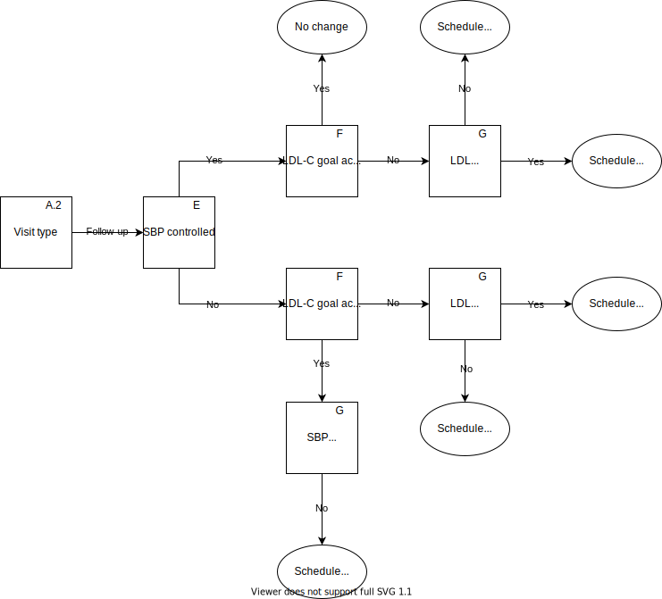
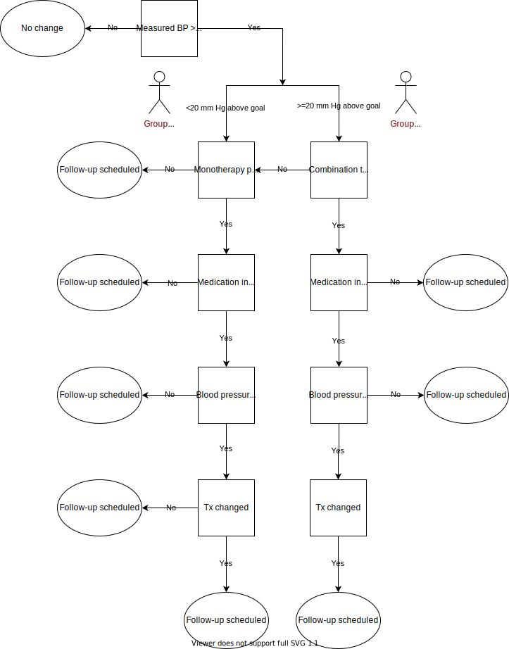

.. _intervention_crm_mgmt:

==================================================
Cardiometabolic Risk Management Intervention Model
==================================================

This model includes behavioral and pharmaceutical interventions aimed
at: 1) improving blood pressure and LDL-cholesterol control, 2)
increasing exercise, 3) decreasing BMI/weight, 4) improving control of
fasting plasma glucose, and 5) decreasing tobacco use. Altering an individual's 
risk factor exposures is expect to improve outcomes for many cardiometabolic
conditions.

This model requires a simulant to have attributes of: age, sex, SBP,
LDL-C, BMI, FPG, cigarette smoking.

It adds attributes of: untreated SBP, untreated LDL-C, untreated BMI,
untreated FPG, untreated smoking, polypill prescription, hypertension
prescription ramp position, LLT prescription, lifestyle modification
education status, medication outreach status, adherence propensity,
adherence status, last measured SBP, last measured LDL-C, follow-up
visit propensity, LDL-C prescription initiation propensity, SBP
prescription initiation propensity, polypill initiation propensity

.. contents::
   :local:
   :depth: 1

.. list-table:: Definitions of terms and abbreviations
  :widths: 15 15 15
  :header-rows: 1

  * - Term or Abbreviation
    - Definition
    - Note
  * - BMI
    - Body Mass Index
    - Risk Factor
  * - FPG
    - Fasting Plasma Glucose
    - Risk Factor
  * - LDL-C
    - Low Density Lipoprotein Cholesterol
    - Risk Factor
  * - SBP
    - Systolic blood pressure
    - Risk Factor
  * - DBP
    - Diastolic blood pressure
    - Risk Factor; not currently modeled as part of GBD, but used clinically to define hypertension
  * - Stage 1 hypertension
    - SBP 130-139 OR DBP 80-89
    - American Heart Association/American College of Cardiology guidelines
  * - Stage 2 hypertension
    - SBP 140 or higher OR DBP 90 or higher
    - American Heart Association/American College of Cardiology guidelines

Intervention Overview
-----------------------

The interventions included in this model include treatment of 
high SBP and high LDL Cholesterol with individual medications, polypill
therapies, and education and outreach to support lifestyle
modification. Alternative scenarios will consider expanded
implementation of medical outreach, which is known to increase
treatment adherence, as well as expanded access to polypill
treatment, which is known to increase adherence.

.. todo::

  Add to the following table to include known outcomes affected by the intervention, which are **not** in the simulation model, as it is important to recognize potential unmodeled effects of the intervention and note them as limitations as applicable.

.. list-table:: Affected Outcomes
  :widths: 15 15 15 15
  :header-rows: 1

  * - Outcome
    - Effect
    - Modeled?
    - Note (ex: is this relationship direct or mediated?)
  * - SBP
    - additive shift
    - yes
    - there is a “ramp” of increasing intensity of treatments
  * - LDL-C
    - multiplicative shift
    - yes
    - options include not on treatment, low-intensity statin, high-intensity statin;
  * - BMI
    - multiplicative (% BMI lost)
    - yes
    - [[need more detail on this effect; how to handle mediation]]
  * - FPG
    - additive
    - yes
    - 
  * - Tobacco
    - ?
    - yes
    - 

Baseline Coverage Data
++++++++++++++++++++++++

Baseline coverage of treatments for LDL-C and SBP are substantial and expected to vary by age, sex, and time.  To initialize simulants, researchers will fit a multinomial or logistic regression (as appropriate) to NHANES data, and provide the results to the engineers to use as a prediction of the probability of each treatment for a simulant with a known age, sex, and measured LDL-C and SBP level. [[Should this also predict which simulants are non-adherent to treatment?]] 

This initialization scheme will also allow initialization of "untreated LDL-C" and "untreated SBP" attributes, which refer to what a simulants risk exposure would be, if they were not receiving treatment.   Individuals who are initialized to be receive treatment will also need to be initialized to have a follow-up visit date somehow.

Baseline coverage of polypill, medication outreach, and lifestyle modification education are all low, and we will assume that they are 0%. (This means that we will can initialize the untreated BMI, FPG, and smoking risk exposures to be equal to the actual BMI, FPG, and smoking exposures.)

Weighted means of treatment (not specific to drug class) by age, sex, and SBP category (in 10 mm Hg groups) are here: /share/scratch/projects/cvd_gbd/cvd_re/simulation_science/nhanes_sbp_tx_info.csv

.. todo:: add link to stash repo with collapse code 
.. todo:: update with file for LDL 

.. list-table:: Baseline coverage data
  :widths: 15 15 15 15 15
  :header-rows: 1

  * - Location
    - Subpopulation
    - Coverage parameter
    - Value
    - Note
  * - USA
    - General Population
    - Hypertension Treatment
    - Distribution from NHANES
    - empirical calibration needed
  * - USA
    - General Population
    - Lipid lowering therapy
    - Distribution from NHANES
    - empirical calibration needed
  * - USA
    - General Population
    - Polypill
    - 0.0%
    - assumption
  * - USA
    - General Population
    - Medication outreach
    - 0.0%
    - assumption
  * - USA
    - General Population
    - Lifestyle modification education
    - 0.0%
    - assumption
    

Vivarium Modeling Strategy
--------------------------

.. todo::

  Add an overview of the Vivarium modeling section.

Decision tree and algorithm for outreach intervention
-----------------------------------------------------
Visit type: emergency

.. image:: decision_tree_outreach_emergency.svg

Visit type: follow-up

Visit type: screening

.. image:: decision_tree_outreach_screening.svg

Visit type: none

.. image:: decision_tree_outreach_none.svg

Blood pressure ramp

A.  Visit type

   1.  Experienced an AMI/IS in previous time step -> emergency visit
   2.  Subject was scheduled for follow-up due to existing tx  - > follow-up
   3.  P(screening visit)=1-e-t, where  is the rate of health care utilization for this type of visit. Type of visit is only to include “check-ups” – e.g., well adult visits/wellness physical with primary care provider. We are explicitly excluding urgent care visits for illness or injury or emergency visits for illness or injury (handling of emergency visit for AMI/IS noted above). Sample to determine Screening or None
   4.  None: no visit

B.  SBP elevated

   1.  SBP >=140
   2.  Assume everyone has their BP measured at every visit
   3.  Includes measurement error (+/- X mmHg) [Code snippet that shows what the distribution should be (normal, truncated normal, log-normal commonly used]
   
       a.  Mean = actual blood pressure
       b.  SD = variation around this (10 mm Hg)
       c.  Assume normal distribution

C.  LDL-C tested 
   
   1.  if follow-up | emergency, everyone 
   2.  if screening, ASCVD risk score >threshold (sbp, age, sex)

D.  LDL-C elevated
   
   1.  Thresholds: https://www.ccjm.org/content/87/4/231
   2.  Measurement of LDL-C determined by LDL-C tested algorithm in C
   3.  Includes measurement error (+/- X mmol/L) [Code snippet that shows what the distribution should be (normal, truncated normal, log-normal commonly used]
       
       a.  Mean = actual blood pressure
       b.  SD = variation around this (10 mmol/L)
       c.  Assume normal distribution

E.  SBP controlled
   
   1.  SBP <140 mm Hg after treatment

F.  LDL-C goal achieved
   
   1.  Dependent on ASCVD score; https://www.ccjm.org/content/87/4/231

G.  Prescribed treatment
   
   1.  SBP above threshold; LDL-C not above threshold

       a.  Start on BP ramp
              1.  Assign specific medications(s) and dosage(s) based on algorithm 
              2.  Change in medication(s) and/or dosage(s) determined by whether SBP controlled at follow-up visit (E) [potential future work: add impact of side effects [initiated tx, return for FU, reports problems -> diff med; attributes can change w/out returning to MD office][impact on adherence; affect whether controlled at next visit; may be able to include in adherence]
       b.  Therapeutic inertia
              1.  Probability of being prescribed treatment = 0.85 [Flipping a weighted coin; heads 85% of the time]
              2.  Current assumption is that this is the same for anti-hypertensive and lipid-lowering medications
       c.  If prescribed meds, schedule for follow-up in 3-6 months to check on response to medication; sample from uniform distribution to determine time step for next visit
  
  2.  SBP not above threshold; LDL-C above threshold

       a.  Start on statin; decision between low-, moderate-, and high-intensity statin depending on ASCVD risk; https://www.ccjm.org/content/87/4/231
              1.  Change in medication(s) and/or dosage(s) determined by whether LDL-C controlled at follow-up visit (F) [potential future work: add impact of side effects [initiated tx, return for FU, reports problems -> diff med; attributes can change w/out returning to MD office][impact on adherence; affect whether controlled at next visit; may be able to include in adherence]
       b.  Therapeutic inertia
              1.  Probability of being prescribed treatment = 0.85 [Flipping a weighted coin; heads 85% of the time]
              2.  Current assumption is that this is the same for anti-hypertensive and lipid-lowering medications
       c.  Schedule for follow-up in 3-6 months to check on response to medication; sample from uniform distribution to determine timestep for next visit
  
   3.  SBP above threshold; LDL-C above threshold
       
       a.  Start on BP ramp
              1.  Assign specific medications(s) and dosage(s) based on algorithm 
              2.  Change in medication(s) and/or dosage(s) determined by whether SBP controlled at follow-up visit (E) [potential future work: add impact of side effects [initiated tx, return for FU, reports problems -> diff med; attributes can change w/out returning to MD office][impact on adherence; affect whether controlled at next visit; may be able to include in adherence]
       b.  Start on statin; decision between low-, moderate-, and high-intensity statin depending on ASCVD risk;  https://www.ccjm.org/content/87/4/231
              1.  Change in medication(s) and/or dosage(s) determined by whether LDL-C controlled at follow-up visit (F) [potential future work: add impact of side effects [initiated tx, return for FU, reports problems -> diff med; attributes can change w/out returning to MD office][impact on adherence; affect whether controlled at next visit; may be able to include in adherence]
       c.  Therapeutic inertia
              1.  Probability of being prescribed treatment = 0.85 [Flipping a weighted coin; heads 85% of the time]
              2.  Current assumption is that this is the same for anti-hypertensive and lipid-lowering medications
       d.  Schedule for follow-up in 3-6 months to check on response to medication; sample from uniform distribution to determine timestep for next visit

Blood pressure ramp and LDL-C treatment algorithms
  SBP target: 130 mm Hg
  LDL target: depends on ASCVD risk

  Treatment prescribed (BP)
    1)  Is therapeutic inertia overcome y/n
    2)  If therapeutic inertia is overcome AND BP measurement is within 20 mm Hg of target
        a.  Assume monotherapy initiated: Proportions by drug class in /share/scratch/projects/cvd_gbd/cvd_re/simulation_science/drug_initialization_percentages.csv
        b.  Follow-up scheduled (uniform distribution 3-6 months)
    3)  If therapeutic inertia is overcome AND BP reading is more than 20 mm Hg from target
        a.  Either monotherapy OR combination therapy is initiated
        b.  Proportion assigned to combination therapy: 0.45 (parameter table)
        c.  Proportions of initial prescriptions by drug class in /share/scratch/projects/cvd_gbd/cvd_re/simulation_science/drug_initialization_percentages.csv

   Treatment Changed (BP)
    1)  If monotherapy initiated for hypertension: If blood pressure not controlled at follow up (control defined as being below threshold), 50/50 choice between increasing dosage of current medication and adding new class of medication
    2)  If combination therapy initiated for hypertension: If blood pressure not controlled at follow up (control defined as being below threshold), 50/50 choice between increasing dosage of current medication and adding new class of medication (medication cannot be in current class). Proportions of combinations in /share/scratch/projects/cvd_gbd/cvd_re/simulation_science/meps_drug_combinations.csv

    Treatment Prescribed (LDL)

    Treatment Changed (LDL)

Medication initiation:
All simulants enrolled in the intervention initiate treatment (defined as initial fill of prescription(s))

Adherence:
All simulants get number from 0 to 1 drawn from non-uniform distribution of adherence in the general population [need to find]. Simulants with values >=0.8 are considered adherent and receive the full benefit of their medication.

ASCVD Risk score
score = -19.5 + 0.043 * sbp + 0.266 * age + 2.32 * sex

Implementation in previous code found here: https://github.com/ihmeuw/vivarium_csu_zenon/blob/7a1ba2a0eef46d8184bc4a38926224b95bebf58a/src/vivarium_csu_zenon/components/cvd.py#L57

.. list-table:: Key parameters for intervention model
  :widths: 15 15 15 15
  :header-rows: 1

  * - Parameter
    - Reference
    - Data Source for Simulation
    - Notes
  * - Outpatient visit rate
    - GBD outpatient envelope
    - outpatient_visits=HealthcareEntity (name='outpatient_visits', kind='healthcare_entity', gbd_id=me_id(19797), utilization=me_id(19797),)
    - Outpatient utilization envelope from GBD; will want to update to use NHANES data in future
  * - Follow-up visit rate for cardiometabolic risk management 
    - AHA/ACC recommendations
    - uniform distribution from 3 to 6 months
    - 
  * - SBP measurement error
    - Br J Gen Pract 2011; DOI: 10.3399/bjgp11X593884
    - Normal distribution, mean=0, SD=2.9
    - 85% measurements within +/- 3 mm Hg; 15% within +/- 4-9 mm Hg
  * - SBP therapeutic inertia [TO UPDATE]
    - Hypertension. 2006 Mar;47(3):345-51. doi: 10.1161/01.HYP.0000200702.76436.4b., J Hypertens 39:1238–1245 DOI:10.1097/HJH.0000000000002783
    - 19% of the variance in SBP; 90% of the time there is therapeutic inertia
    - 
  * - SBP prescription initiation rate
    - Assumption for current run; will reevaluate in future
    - 100 %
    - 
  * - SBP adherence rate
    - Medical Expenditure Panel Survey, 2014
    - /share/scratch/projects/cvd_gbd/cvd_re/simulation_science/pdc_meps_2014.csv
    - 
  * - SBP treatment efficacy
    - BMJ 2009 May 19;338:b1665. doi: 10.1136/bmj.b1665.
    - /share/scratch/projects/cvd_gbd/cvd_re/simulation_science/drug_efficacy_sbp.csv
    - 
  * - SBP baseline coverage rate for each ramp position
    - 
    - 
    -
  * - Proportion of Group 2 from SBP ramp algorithm receiving combination therapy
    - Byrd et al Am Heart J 2011;162:340-6.
    - 45%
    - Represents non-compliance with guidelines  
  * - LDL-C measurement error
    - BMJ 2020;368:m149 doi: 10.1136/bmj.m149
    - normal distribution from 2 to 5%; mean and standard deviation
    - 
  * - LDL-C therapeutic inertia
    - https://pesquisa.bvsalud.org/portal/resource/fr/ibc-171028
    - 0.194
    - 
  * - LDL-C prescription initiation rate
    - Assumption; will revisit later
    - 100%
    - 
  * - LDL-C adherence rate
    - 
    - 
    - 
  * - LDL-C treatment efficacy
    - 
    - 
    - 
  * - LDL-C baseline coverage rate
    - 
    - 
    - 
  * - Medication outreach effectiveness on medication adherence
    - Circulation. 2005;111(10):1298-1304. doi:10.1161/01.CIR.0000157734.97351.B2
    - OR 2.3 (95% CI 1.39-3.88) 
    - 
  * - Medication outreach baseline coverage
    - Assumption
    - 0%
    - 
  * - Polypill effectiveness on medication adherence
    - 
    - 
    - 
  * - Polypill baseline coverage rate
    - 
    - 
    - 
  * - Lifestyle Modification Education effectiveness on BMI, FPG, and Tobacco Initiation/Cessation
    - 
    - 
    - 
  * - Lifestyle Modification Education baseline coverage rate
    - 
    - 
    - 

On each time step, follow this a decision tree to adjust the treatment for a simulant: (a) does simulant interact with health system? Answer depends on outpatient visit rate, emergency visit if simulant had a heart attack, follow-up visit scheduled time and adherence rate.
If (a) is yes, if visit is for an emergency, (b) does provider overcome therapeutic inertia?
If (b) is yes, increase treatment for SBP and/or LDL-C
If (b) is no, (c) does measured SBP and/or measured LDL-C exceed threshold for increased treatment?
If (c) is yes, (d) does provider overcome therapeutic inertia?
If (d) is yes, increase treatment for SBP and/or LDL-C
If treatment was increased for SBP and/or LDL-C, (e) does patient initiate new prescription?
If patient has initiated a prescription (on this timestep or previously), (f) does patient adhere to treatment?
[[to add: schedule follow-up visit, give polypill instead of separate pills, refer to lifestyle medication education, enroll in medical outreach. Also make sure to document data sources for all parameters, e.g. probability simulant has outpatient visit to help answer (a) in simulation.]]

.. list-table:: Modeled Outcomes
  :widths: 15 15 15 15 15 15 15
  :header-rows: 1

  * - Outcome
    - Outcome type
    - Outcome ID
    - Affected measure
    - Effect size measure
    - Effect size
    - Note
  * - SBP
    - 
    - 
    - 
    - 
    - 
    - 
  * - LDL-C
    - 
    - 
    - 
    - 
    - 
    - 
  * - BMI
    - 
    - 
    - 
    - 
    - 
    - 
  * - FPG
    - 
    - 
    - 
    - 
    - 
    - 
  * - Tobacco
    - 
    - 
    - 
    - 
    - 
    - 

Affected Outcome #1 - SBP
+++++++++++++++++++++++++

.. todo::

  Link to existing document of the affected outcome (ex: cause or risk exposure model document)

.. todo::

  Describe exactly what measure the intervention will affect

.. todo::

  Fill out the tables below

.. list-table:: Affected Outcome #1 Restrictions
  :widths: 15 15 15
  :header-rows: 1

  * - Restriction
    - Value
    - Note
  * - Male only
    - 
    - 
  * - Female only
    - 
    - 
  * - Age group start
    - 
    - 
  * - Age group end
    - 
    - 
  * - Other
    - 
    - 

.. list-table:: Affected Outcome #1 Effect Size
  :widths: 15 15 15 
  :header-rows: 1

  * - Population
    - Effect size
    - Note
  * - 
    - 
    - 
  * - 
    - 
    - 

.. todo::

  Describe exactly *how* to apply the effect sizes to the affected measures documented above

Affected Outcome #2 - LDL-C
+++++++++++++++++++++++++++

.. todo::

  Link to existing document of the affected outcome (ex: cause or risk exposure model document)

.. todo::

  Describe exactly what measure the intervention will affect

.. todo::

  Fill out the tables below

.. list-table:: Affected Outcome #2 Restrictions
  :widths: 15 15 15
  :header-rows: 1

  * - Restriction
    - Value
    - Note
  * - Male only
    - False
    - 
  * - Female only
    - False
    - 
  * - Age group start
    - no restriction
    - 
  * - Age group end
    - no restriction
    - 
  * - Other
    - 
    - 

.. list-table:: Affected Outcome #2 Effect Size
  :widths: 15 15 15 
  :header-rows: 1

  * - Population
    - Effect size
    - Note
  * - 
    - 
    - 
  * - 
    - 
    - 

.. todo::

  Describe exactly *how* to apply the effect sizes to the affected measures documented above

Affected Outcome #3 - BMI
+++++++++++++++++++++++++

.. todo::

  Link to existing document of the affected outcome (ex: cause or risk exposure model document)

.. todo::

  Describe exactly what measure the intervention will affect

.. todo::

  Fill out the tables below

.. list-table:: Affected Outcome #3 Restrictions
  :widths: 15 15 15
  :header-rows: 1

  * - Restriction
    - Value
    - Note
  * - Male only
    - 
    - 
  * - Female only
    - 
    - 
  * - Age group start
    - 
    - 
  * - Age group end
    - 
    - 
  * - Other
    - 
    - 

.. list-table:: Affected Outcome #3 Effect Size
  :widths: 15 15 15 
  :header-rows: 1

  * - Population
    - Effect size
    - Note
  * - 
    - 
    - 
  * - 
    - 
    - 

.. todo::

  Describe exactly *how* to apply the effect sizes to the affected measures documented above

Affected Outcome #4 - FPG
+++++++++++++++++++++++++

.. todo::

  Link to existing document of the affected outcome (ex: cause or risk exposure model document)

.. todo::

  Describe exactly what measure the intervention will affect

.. todo::

  Fill out the tables below

.. list-table:: Affected Outcome #4 Restrictions
  :widths: 15 15 15
  :header-rows: 1

  * - Restriction
    - Value
    - Note
  * - Male only
    - False
    - 
  * - Female only
    - False
    - 
  * - Age group start
    - unrestricted
    - 
  * - Age group end
    - unrestricted
    - 
  * - Other
    - 
    - 

.. list-table:: Affected Outcome #4 Effect Size
  :widths: 15 15 15 
  :header-rows: 1

  * - Ramp position
    - Effect size
    - Note
  * - 
    - 
    - 
  * - 
    - 
    - 

.. todo::

  Describe exactly *how* to apply the effect sizes to the affected measures documented above

Affected Outcome #5 - Smoking
+++++++++++++++++++++++++++++

.. todo::

  Link to existing document of the affected outcome (ex: cause or risk exposure model document)

.. todo::

  Describe exactly what measure the intervention will affect

.. todo::

  Fill out the tables below

.. list-table:: Affected Outcome #5 Restrictions
  :widths: 15 15 15
  :header-rows: 1

  * - Restriction
    - Value
    - Note
  * - Male only
    - 
    - 
  * - Female only
    - 
    - 
  * - Age group start
    - 
    - 
  * - Age group end
    - 
    - 
  * - Other
    - 
    - 

.. list-table:: Affected Outcome #5 Effect Size
  :widths: 15 15 15 
  :header-rows: 1

  * - Population
    - Effect size
    - Note
  * - 
    - 
    - 
  * - 
    - 
    - 

.. todo::

  Describe exactly *how* to apply the effect sizes to the affected measures documented above

.. todo::

  Note research considerations related to generalizability of the effect sizes listed above as well as the strength of the causal criteria, as discussed on the :ref:`general research consideration document <general_research>`.

Assumptions and Limitations
~~~~~~~~~~~~~~~~~~~~~~~~~~~~

Validation and Verification Criteria
~~~~~~~~~~~~~~~~~~~~~~~~~~~~~~~~~~~~~~
