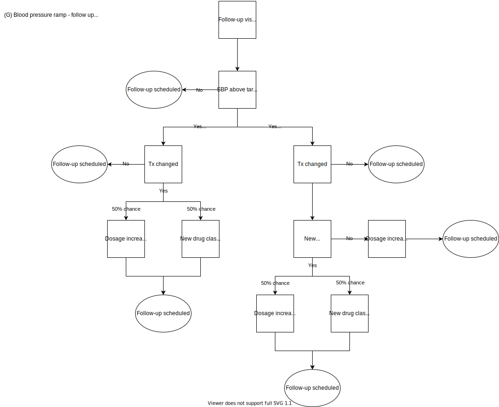

Health care visit types 
***********************

There are four main types of interactions with the health care system that we are accounting for in this simulation.

1) No visit: no visit occurs for the simulant for this time step. 

2) Screening visit: this is a physical exam that may include blood work, based on the patient's age, risk factors, and state of health. This type of examination is typically done yearly and is intended to provide routine preventive care, identify risk factors for or early signs and symptoms of chronic diseases, and initiate medication treatment as appropriate.

3) Follow-up visit: this is an appointment for monitoring of chronic conditions and to check whether any changes to dosage or type of medication are necessary to appropriately manage the medical condition of interest. 

4) Emergency visit: this is an ER or direct inpatient admission for an acute myocardial infarction or an acute ischemic stroke. For both of these conditions, a patient should be prescribed lipid-lowering therapy regardless of their LDL-c level and should have their blood pressure assessed.

Simulants may be enrolled in the outreach and polypill interventions if a screening visit where they meet enrollment criteria or an emergency visit occurs during a time step. Simulants may only be enrolled in the lifestyle intervention during if a screening visit where they meet enrollment criteria occurs during a time step.

Note: there are other types of medical visits that can occur, but are not included here because they would not be opportunities for enrollment into one of the interventions nor are they necessary to account for the medication monitoring and titration required for blood pressure or lipid-lowering treatments. Examples of these include visits for acute illnesses or injuries, vaccination-only appointments (e.g., for travel or seasonal influenza), and visits for specific screening tests (e.g., colonoscopies or mammograms).

Decision tree and algorithm for outreach intervention
-----------------------------------------------------
Visit type: emergency

.. image:: decision_tree_outreach_emergency.svg

Visit type: follow-up

.. image:: decision_tree_outreach_followup.svg

Visit type: screening

.. image:: decision_tree_outreach_screening.svg

Visit type: none

.. image:: decision_tree_outreach_none.svg

Blood pressure ramp: initial prescription

.. image:: sbp_ramp_initial.svg

Blood pressure ramp: follow-up

A.  Visit type

   1.  Experienced an AMI/IS in previous time step -> emergency visit
   2.  Subject was scheduled for follow-up due to existing tx  - > follow-up
   3.  P(screening visit)=1-e-t, where  is the rate of health care utilization for this type of visit. Type of visit is only to include “check-ups” – e.g., well adult visits/wellness physical with primary care provider. We are explicitly excluding urgent care visits for illness or injury or emergency visits for illness or injury (handling of emergency visit for AMI/IS noted above). Sample to determine Screening or None
   4.  None: no visit

B.  SBP elevated

   1.  SBP >=130 mm Hg
   2.  Assume everyone has their BP measured at every visit
   3.  Includes measurement error (see parameter table below)
   
C.  LDL-C tested 
   
   1.  if visit type is follow up or emergency, everyone is tested
   2.  if screening, ASCVD risk score >threshold (sbp, age, sex)

D.  LDL-C elevated
   
   1.  Thresholds: https://www.ccjm.org/content/87/4/231
   2.  Measurement of LDL-C determined by LDL-C tested algorithm in C
   3.  Includes measurement error (+/- X mmol/L) [Code snippet that shows what the distribution should be (normal, truncated normal, log-normal commonly used]
       
       a.  Mean = actual blood pressure
       b.  SD = variation around this (10 mmol/L)
       c.  Assume normal distribution

E.  SBP controlled
   
   1.  SBP <140 mm Hg after treatment

F.  LDL-C goal achieved
   
   1.  Dependent on ASCVD score; https://www.ccjm.org/content/87/4/231

G.  Prescribed treatment
   
   1.  SBP above threshold; LDL-C not above threshold

       a.  Start on BP ramp
              1.  Assign specific medications(s) and dosage(s) based on algorithm 
              2.  Change in medication(s) and/or dosage(s) determined by whether SBP controlled at follow-up visit (E) [potential future work: add impact of side effects [initiated tx, return for FU, reports problems -> diff med; attributes can change w/out returning to MD office][impact on adherence; affect whether controlled at next visit; may be able to include in adherence]
       b.  Therapeutic inertia
              1.  Probability of being prescribed treatment = 0.85 [Flipping a weighted coin; heads 85% of the time]
              2.  Current assumption is that this is the same for anti-hypertensive and lipid-lowering medications
       c.  If prescribed meds, schedule for follow-up in 3-6 months to check on response to medication; sample from uniform distribution to determine time step for next visit
  
  2.  SBP not above threshold; LDL-C above threshold

       a.  Start on statin; decision between low-, moderate-, and high-intensity statin depending on ASCVD risk; https://www.ccjm.org/content/87/4/231
              1.  Change in medication(s) and/or dosage(s) determined by whether LDL-C controlled at follow-up visit (F) [potential future work: add impact of side effects [initiated tx, return for FU, reports problems -> diff med; attributes can change w/out returning to MD office][impact on adherence; affect whether controlled at next visit; may be able to include in adherence]
       b.  Therapeutic inertia
              1.  Probability of being prescribed treatment = 0.85 [Flipping a weighted coin; heads 85% of the time]
              2.  Current assumption is that this is the same for anti-hypertensive and lipid-lowering medications
       c.  Schedule for follow-up in 3-6 months to check on response to medication; sample from uniform distribution to determine timestep for next visit
  
   3.  SBP above threshold; LDL-C above threshold
       
       a.  Start on BP ramp
              1.  Assign specific medications(s) and dosage(s) based on algorithm 
              2.  Change in medication(s) and/or dosage(s) determined by whether SBP controlled at follow-up visit (E) [potential future work: add impact of side effects [initiated tx, return for FU, reports problems -> diff med; attributes can change w/out returning to MD office][impact on adherence; affect whether controlled at next visit; may be able to include in adherence]
       b.  Start on statin; decision between low-, moderate-, and high-intensity statin depending on ASCVD risk;  https://www.ccjm.org/content/87/4/231
              1.  Change in medication(s) and/or dosage(s) determined by whether LDL-C controlled at follow-up visit (F) [potential future work: add impact of side effects [initiated tx, return for FU, reports problems -> diff med; attributes can change w/out returning to MD office][impact on adherence; affect whether controlled at next visit; may be able to include in adherence]
       c.  Therapeutic inertia
              1.  Probability of being prescribed treatment = 0.85 [Flipping a weighted coin; heads 85% of the time]
              2.  Current assumption is that this is the same for anti-hypertensive and lipid-lowering medications
       d.  Schedule for follow-up in 3-6 months to check on response to medication; sample from uniform distribution to determine timestep for next visit

Blood pressure ramp and LDL-C treatment algorithms
  SBP target: 130 mm Hg
  LDL target: depends on ASCVD risk

  Treatment prescribed (BP)
    1)  Is therapeutic inertia overcome y/n
    2)  If therapeutic inertia is overcome AND BP measurement is within 20 mm Hg of target
        a.  Assume monotherapy initiated: Proportions by drug class in /share/scratch/projects/cvd_gbd/cvd_re/simulation_science/drug_initialization_percentages.csv
        b.  Follow-up scheduled (uniform distribution 3-6 months)
    3)  If therapeutic inertia is overcome AND BP reading is more than 20 mm Hg from target
        a.  Either monotherapy OR combination therapy is initiated
        b.  Proportion assigned to combination therapy: 0.45 (parameter table)
        c.  Proportions of initial prescriptions by drug class in /share/scratch/projects/cvd_gbd/cvd_re/simulation_science/drug_initialization_percentages.csv

   Treatment Changed (BP)
    1)  If monotherapy initiated for hypertension: If blood pressure not controlled at follow up (control defined as being below threshold), 50/50 choice between increasing dosage of current medication and adding new class of medication
    2)  If combination therapy initiated for hypertension: If blood pressure not controlled at follow up (control defined as being below threshold), 50/50 choice between increasing dosage of current medication and adding new class of medication (medication cannot be in current class). Proportions of combinations in /share/scratch/projects/cvd_gbd/cvd_re/simulation_science/meps_drug_combinations.csv

    Treatment Prescribed (LDL)

    Treatment Changed (LDL)
