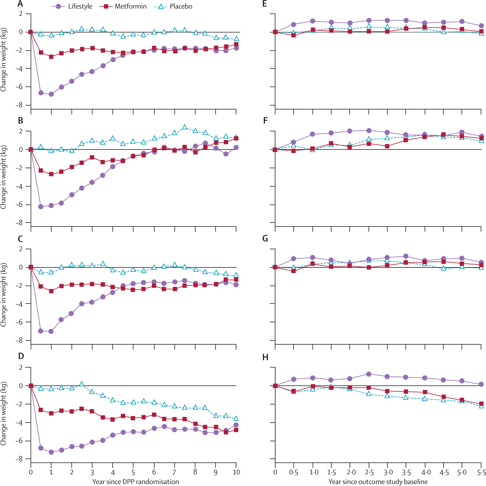
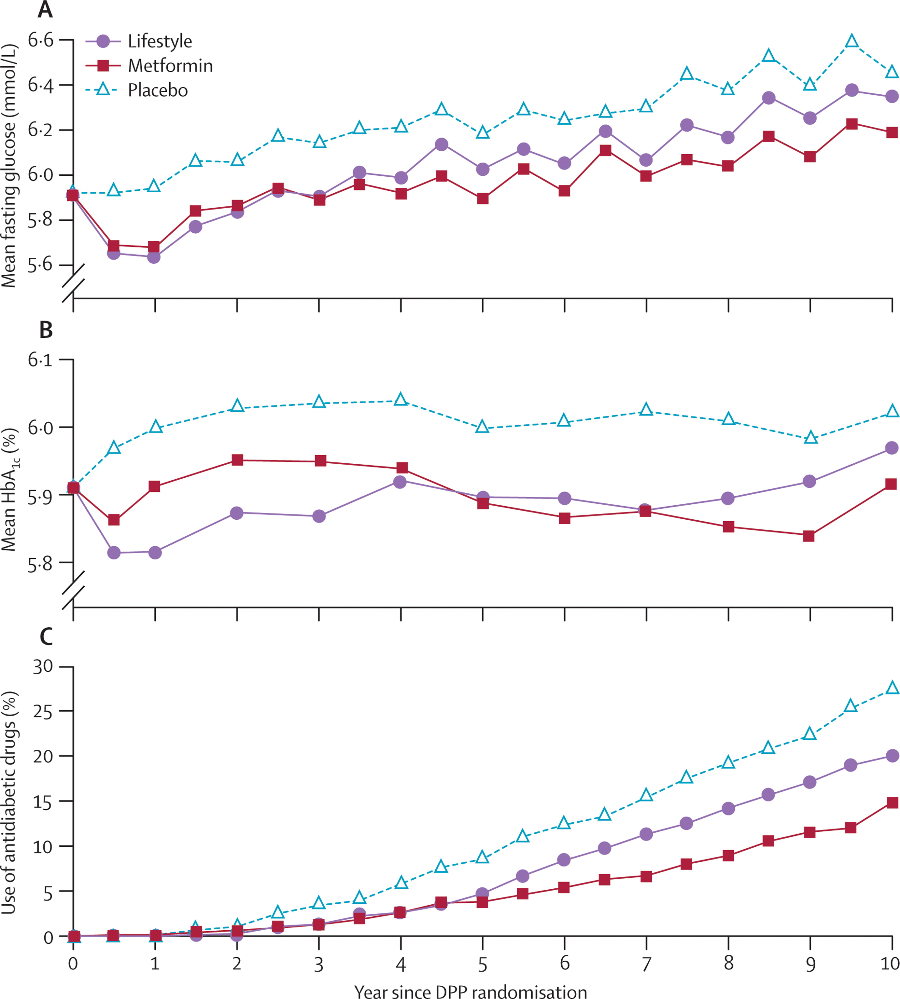
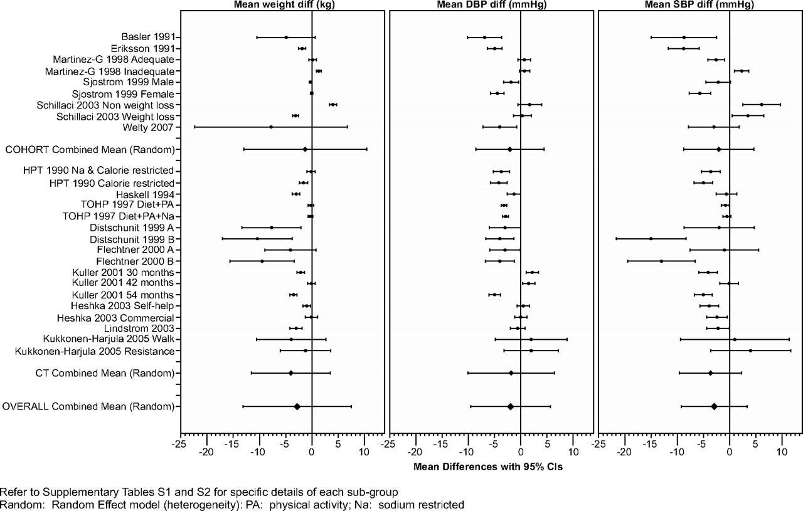
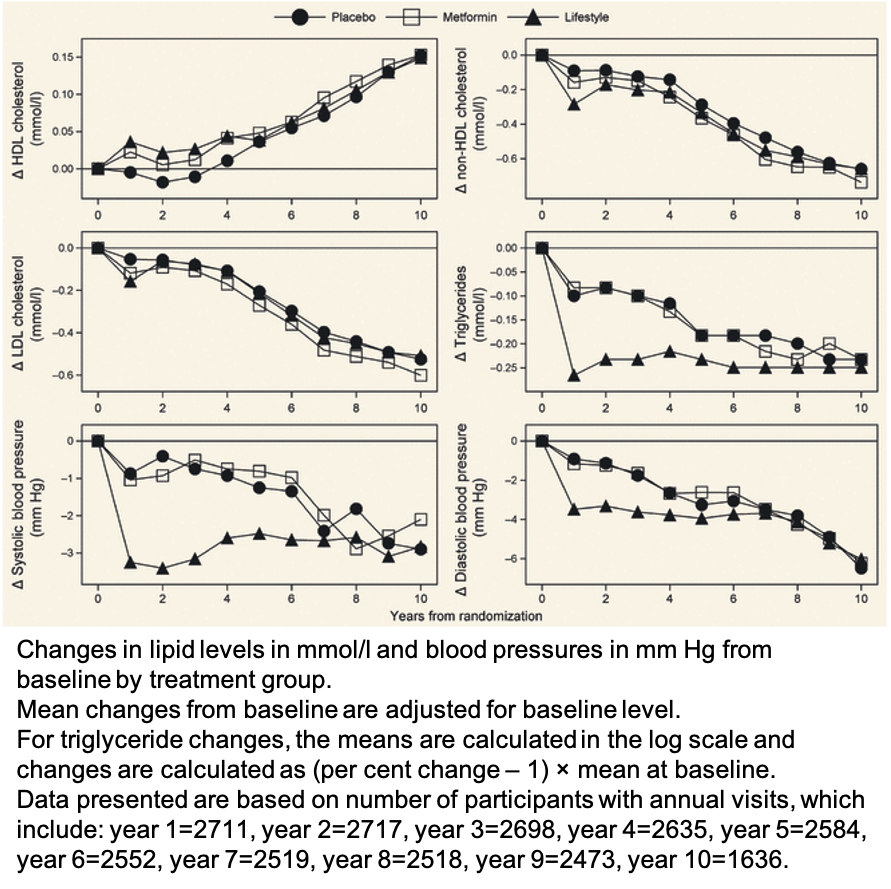

Vivarium Modeling Strategy - Lifestyle Intervention
---------------------------------------------------

Overview
++++++++

Participation in a structured program composed of education sessions and individualized coaching with the goal of reducing body weight and increasing physical activity for simulants. 

Scenarios
+++++++++
In the baseline scenario, no one is enrolled in structured lifestyle modification interventions.

In the alternate scenarios, simulants are eligible for enrollment if their BMI was >= 25, they had no known DM2, and their FPG was 100-125mg/dl (or HbA1C 5.7-6.4). All simulants have a propensity score between 0 to 1 (uniform distribution). If they are eligible and their score is <0.5, the simulant is enrolled. 

Assumptions: There are simulant and/or provider attributes other than eligibility criteria that might affect the likelihood of enrollment/participation but we are not modeling them at this time. 

Affected outcomes
+++++++++++++++++
**Body mass index (weight)**: participants saw a reduction of 6.5 ± 4.7 kg or 6.9 ± 4.5% of initial body weight over the first six months/16 visits. At 3 years after randomization, participants saw a reduction of 4.5 ± 7.6 kg or 4.9 ± 7.4% of initial body weight. 10 years after randomization, participants weighed 2 ± 9 kg on average less than their starting weight.

.. todo::
  Research team: Request data from the DDPOS investigators

.. todo::
  Software engineers: The research team would prefer to use absolute change in weight, as it allows us to use the results from the meta-analysis described below to account for the decrease in SBP that occurs with weight reduction. This will require the software engineers to assign height values to all simulants as the inputs from GBD are BMI values.

reference for DDPOS: Diabetes Prevention Program Research Group. 10-year follow-up of diabetes incidence and weight loss in the Diabetes Prevention Program Outcomes Study. Lancet 2009; published online Oct 29. DOI:10.1016/S0140-6736(09)61457-4.

**Fasting plasma glucose and HbA1c**: Over time, participants experienced an overall increase in both fasting plasma glucose and HbA1c measures. Means and SE for FPG and HbA1c levels over time since randomization in the initial DPP study can be found in /share/scratch/projects/cvd_gbd/cvd_re/simulation_science/ddpos_lifestyle_fpg_hba1c.csv

reference for DDPOS: Diabetes Prevention Program Research Group. 10-year follow-up of diabetes incidence and weight loss in the Diabetes Prevention Program Outcomes Study. Lancet 2009; published online Oct 29. DOI:10.1016/S0140-6736(09)61457-4.

**Systolic blood pressure**: SBP and weight are positively correlated, such that as weight decreases, SBP is expected to decrease. A meta-analysis of trials and cohort studies examined longitudinal changes in weight and the effect on SBP. 
SBP difference (mm Hg)=−0.981+0.921 (mean weight difference [kg]). 

reference for meta-analysis: https://www.ahajournals.org/doi/full/10.1161/HYPERTENSIONAHA.109.135178

reference for DDPOS: Diabetic Medicine, Volume: 30, Issue: 1, Pages: 46-55, First published: 19 July 2012, DOI: (10.1111/j.1464-5491.2012.03750.x) 

Decision tree and algorithm for lifestyle intervention 
++++++++++++++++++++++++++++++++++++++++++++++++++++++
There are two possible types of interactions with the health care system that we are accounting for in the lifestyle scenarios for this simulation.

1) No visit: no visit occurs for the simulant for this time step. 

2) Screening visit: this is a physical exam that may include blood work, based on the patient's age, risk factors, and state of health. This type of examination is typically done yearly and is intended to provide routine preventive care, identify risk factors for or early signs and symptoms of chronic diseases, and initiate medication treatment as appropriate.

Algorithm:
If the simulant has a regularly schedued visit during a time step and meets BMI and FPG thresholds for eligibility, then they can be enrolled in the intervention. If there is no screening visit during the time step, then simulants cannot be enrolled in the study.

.. image:: decision_tree_lifestyle_screening.svg

**Source information:**
Individuals were enrolled in the diabetes prevention program if their BMI was >= 25, they had no known DM2, and their FPG was 100-125mg/dl (or HgbA1C 5.7-6.4). They attended a median of 14 community-based sessions over a median of 134 days. Sessions included lifestyle and behavior counselling with a focus on increasing moderate physical activity, healthy eating, and weight loss. Each additional session attended led to 0.31% loss of body weight.  
[Ely-2017]_  

Variations on the above intervention increased support time or added meal replacements for the first month or full year  
[Metz-et-al-2000]_ 
