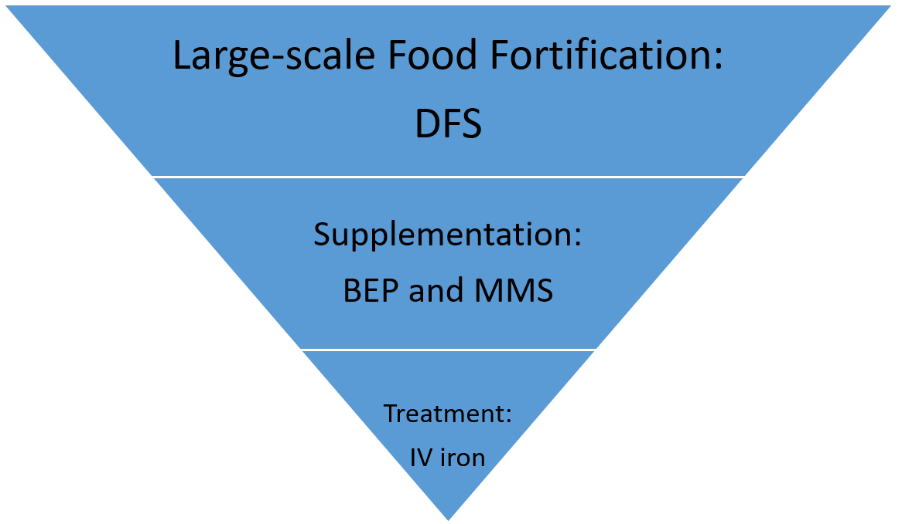

.. _maternal_anemia_intervention:

===================================
Tiered Maternal Anemia Intervention
===================================

.. contents::
   :local:
   :depth: 1

.. list-table:: Abbreviations
  :widths: 10 10
  :header-rows: 1

  * - Abbreviation
    - Definition
  * - BEP
    - Balanced Energy Protein
  * - DFS
    - Double Fortified Salt
  * - MMS
    - Multiple Micronutrient Supplement
  * - IFA
    - Iron-folic Acid
  * - ANC
    - Antenatal Care
  * - BMI
    - Body Mass Index
  * - PLW
    - Pregnant and Lactating Women
  * - LMICs
    - Low- and Middle-Income Countries
  * - Focal countries
    - Pakistan, Bangladesh, Nigeria, Malawi

Intervention Overview
---------------------
Tiered maternal anemia intervention is an integrated life course intervention 
designed for at-risk female popualtion (e.g., women during pregnancy, women of 
reprodictive age, etc.) for averting the burden of maternal anemia in LMICs. 
It consists of three tiers: 1) Large-scale food fortificaiton (DFS), 2) Supplmentation 
(BEP and MMS), and 3) treatment (IV iron).

The scope of our simulation work is to estimate following measures in 4 focal countries:
 - the size of eligible population at risk for each tier of the pyramid;
 - the burden of the maternal anemia in terms of deaths and DALYs occurring in 
   the population at risk within each tier of the pyramid if we assume 
   intervention is not applicable; 
 - the impact at each tier on maternal anemia in terms of averted deaths and DALYs 
   if we assume complete pyramid of interventions are applied.

.. list-table:: Tiered Intervention
  :header-rows: 1

  * - Tier
    - Intervention
    - Product name
    - Product definition
    - Target population
    - Note
  * - 1
    - Large-scale food fortification
    - DFS
    - 
    - Women of reproductive age (15 to 49 years)
    - 
  * - 2
    - Supplementation
    - BEP
    - 
    - PLW at ANC service with BMI less than 18.5
    - 
  * - 2
    - Supplementation
    - MMS
    - 
    - PLW at ANC service with BMI greater than or equal to 18.5
    - 
  * - 3
    - Treatment
    - IV iron
    - 
    - Pregnant women in 2nd/3rd trimester with moderate/severe anemia referred 
      from ANC to higher level facility
    - 

.. todo::

  Fill out the table above with intervention product definition.

.. list-table:: Affected Outcomes
  :header-rows: 1

  * - Outcome
    - Effect
    - Population
    - Note
  * - Population mean hemoglobin
    - Additive
    - General population/PLW/anemic PLW
    - LSFF/supplementation/treatment effect sizes and target populations vary. 
      Hemoglobin shift affects both anemia and maternal mortality

Baseline Coverage Data
++++++++++++++++++++++

.. todo::

  Document intervention coverage for eligible population

.. list-table:: Baseline coverage data
  :widths: 10 10 10 10 10
  :header-rows: 1

  * - Location
    - Subpopulation
    - Coverage parameter
    - Value
    - Note
  * - Bangladesh
    - 
    - 
    - 
    - 
  * - Malawi
    - 
    - 
    - 
    - 
  * - Nigeria
    - 
    - 
    - 
    - 
  * - Pakistan
    - 
    - 
    - 
    - 

Vivarium Modeling Strategy
--------------------------
How to model hemoglobin exposure in Vivarium:
 1. Construct hemoglobin distributions for each location-/age-/population- subgroup;
 2. Apply pregnancy adjustment factor to hemoglobin distributions for pregnant 
    and general populations;
 3. Modify hemoglobin distributions based on intervention effects;

Hemoglobin
++++++++++

The hemoglobin model in GBD 2019 can be found :ref:`Here <2019_hemoglobin_model>`.

.. list-table:: Modeled Outcomes
  :widths: 10 10 10 10 10 10 10
  :header-rows: 1

  * - Outcome
    - Outcome type
    - Outcome ID
    - Affected measure
    - Effect size measure
    - Effect size
    - Note
  * - Hemoglobin
    - GBD risk
    - rei_92
    - Exposure prevalence
    - Risk difference
    - Detailed in table `Effect Size`
    - 

.. list-table:: Restrictions
  :widths: 10 10 10
  :header-rows: 1

  * - Restriction
    - Value
    - Note
  * - Male only
    - False
    - 
  * - Female only
    - True
    - 
  * - Age group start
    - 15 years
    - 
  * - Age group end
    - 49 years
    - 

.. note::

  Reproductive age is defined as 10 to 54 years in GBD, we trimmed it for this 
  project by request of BMGF.

.. list-table:: Effect Size
  :widths: 10 10 10 10
  :header-rows: 1

  * - Intervention
    - Effect size
    - Relative to
    - Effect size Label
  * - DFS
    - 3.3 (95%CI 1.8-4.8)
    - No DFS intervention
    - A
  * - MMS (or IFA)
    - 7.8 (95%CI 4.08-11.52)
    - No iron in pregnancy
    - B
  * - BEP
    - 3.7 (95%CI 1.9-5.6)
    - IFA
    - C
  * - IV iron
    - 23 (95%CI TBD)
    - No IV iron intervention
    - D

.. list-table:: Changes in population hemoglobin
  :widths: 10 10 10
  :header-rows: 1

  * - Tier
    - **Addition** to non-PLW population hemoglobin
    - **Addition** to PLW population hemoglobin
  * - 1
    - :math:`+ A`
    - :math:`+ A`
  * - 2
    - :math:`+ A`
    - :math:`+ A + P_{anc1} * [P_{underweight} * (P_{IFA} * C + (1 - P_{IFA}) * (B + C)) + (1 - P_{underweight}) * (1 - P_{IFA}) * B]`
  * - 3
    - :math:`+ A`
    - Average of :math:`+ A + P_{anc1} * [P_{underweight} * (P_{IFA} * C + (1 - P_{IFA}) * (B + C)) + (1 - P_{underweight}) * (1 - P_{IFA}) * B + P_{low\; hb} * D]` and :math:`+ A + P_{anc1} * [(1 - P_{low\; hb}) * (P_{underweight} * (P_{IFA} * C + (1 - P_{IFA}) * (B + C)) + (1 - P_{underweight}) * (1 - P_{IFA}) * B) + P_{low\; hb} * D]`

Where,
 - :math:`P_{anc1}` = proportion of pregnant women have one time antenatal care 
   visit within a year
 - :math:`P_{underweight}` = proportion of pregnant women with BMI less than 
   18.5 kg/m^2
 - :math:`P_{IFA}` = proportion of pregnant women have already received iron-folic acid 
 - :math:`P_{low\; hb}` = proportion of pregnant women with hemoglobin concentrations 
   less than 100 g/L

Objective 1: Eligible population sizes
++++++++++++++++++++++++++++++++++++++

.. list-table:: Equations
  :widths: 10 10
  :header-rows: 1

  * - Population description
    - Calculation
  * - Women of reproductive age (15 to 49 years)
    - :math:`pop`
  * - PLW at ANC
    - :math:`pop * (asfr + sbr) * P_{anc1}`
  * - Pregnant women in 2nd/3rd trimester with moderate/severe anemia referred 
      from ANC to higher level facility
    - :math:`pop * (asfr + sbr) * P_{anc1} * P_{low\; hb}`

Where,
 - :math:`pop` = GBD 2019 population size of female aged 15 to 49 years
 - :math:`P_{asfr}` = GBD 2019 age-specific fertility rate, pulled using 
   `get_covariate_estimates` with `covariate_id = 13`
 - :math:`P_{sbr}` = GBD 2019 still birth rate (still birth to live birth ratio), 
   pulled using `get_covariate_estimates` with `covariate_id = 2267` 
 - :math:`P_{anc1}` = proportion of pregnant women have one time antenatal care 
   visit within a year, pulled using `get_covariate_estimates` with `covariate_id = 7`
 - :math:`P_{low\; hb}` = proportion of pregnant women with hemoglobin concentrations 
   less than 100 g/L

Objective 2: Anemia and Maternal Disorders Burden
+++++++++++++++++++++++++++++++++++++++++++++++++
:ref:`Effects of hemoglobin on anemia and maternal disorders can be found here <2019_hemoglobin_anemia_and_iron_deficiency>`.

Assumptions and Limitations
+++++++++++++++++++++++++++

Validation and Verification Criteria
++++++++++++++++++++++++++++++++++++

References
------------

