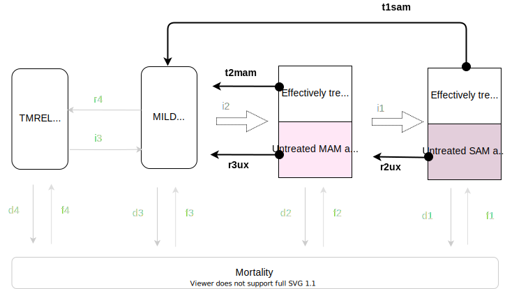

.. role:: underline
    :class: underline

..
  Section title decorators for this document:

  ==============
  Document Title
  ==============

  Section Level 1
  ---------------

  Section Level 2
  +++++++++++++++

  Section Level 3
  ~~~~~~~~~~~~~~~

  Section Level 4
  ^^^^^^^^^^^^^^^

  Section Level 5
  '''''''''''''''

  The depth of each section level is determined by the order in which each
  decorator is encountered below. If you need an even deeper section level, just
  choose a new decorator symbol from the list here:
  https://docutils.sourceforge.io/docs/ref/rst/restructuredtext.html#sections
  And then add it to the list of decorators above.

.. _intervention_wasting_treatment:

===============================================
Treatment and management for acute malnutrition 
===============================================

.. contents::
   :local:
   :depth: 1

.. list-table:: Abbreviations
  :widths: 5 15
  :header-rows: 1

  * - Abbreviation
    - Definition
  * - FMOH
    - Federal ministry of health
  * - SAM
    - severe acute malnutrition 
  * - MAM
    - moderate acute malnutrition
  * - DHS
    - demographic health survey
  * - IMNICI
    - Integrated Management of Newborn and Childhood illness
  * - HEWs
    - Health Extension Workers
  * - HDA
    - Health Development Army
  * - HDG
    - Health Development Group
  * - HP
    - Health post 
  * - OTP
    - Outpatient Therapeutic Programme
  * - TSFP
    - Targeted Supplementary Feeding Programme 
  * - SC
    - Stablisation Centre
  * - PSNP
    - Productive Safety Net Programme
  * - TSFP 
    - Targeted Supplementary Feeding Programme
  * - BSFP
    - Blanket Supplementary Feeding Programme
  * - IYCF
    - Infant and young child feeding
  * - WFL 
    - weight-for-length z-score (used in EMOH guideline)
  * - WFH 
    - weight-for-height z-score (used in EMOH guideline)
  * - WLZ 
    - weight-for-length z-score (used in GBD)
  * - WHZ 
    - weight-for-height z-score (used in GBD)
  * - 
    - 
  * - 
    - 
  * - 
    - 

This documentation focuses on treatment and management of acute malnutrition in Ethiopia based on 2019 National Guideline for the Management of Acute Malnutrition. [EMOH]_

The prevalence of stunting in Ethiopia has declined from 58% in 2000 to 38% in 2016. However, the prevalence of wasting has remained fairly static at 12% in 2000 and 10% in 2016. To address malnutrition in all its forms, the Government is applying two programmatic approaches. The first focuses on increasing access to and availability of food through improved economic growth, better agricultural production systems along with promotion of good nutrition practices and prevention of malnutrition. The second approach aims to strengthen early warning systems and timely emergency response, including wide-scale delivery of services for the management of acute
malnutrition.

The Federal Ministry of Health (FMOH) developed the first Protocol for the Management of Severe Acute
Malnutrition (SAM) in 2007, and the Guideline for the Management of Moderate Acute Malnutrition (MAM)
in 2012. This is the latest National Guideline for the Management of Acute Malnutrition in Ethiopia (2019). It includes the latest World Health Organisation (WHO) guidelines and recommendations, and emerging national and international evidence. It is also aligned to the National Nutrition Programme (NNP) II 2016-2020, the National Food and Nutrition Policy and the Health Sector Transformation Plan (HSTP) 2015/16 - 2019/20.

.. _waste_tx1.0:

Intervention Overview
---------------------

This flow chart summarizes the core aspects of the care and treatment for SAM and MAM, and integration into the
routine health system. 

.. image:: flow_chart_management_of_acute_malnutrition.svg
   :alt: Flow chart of management of acute malnutrition

.. todo::

   Add a general narrative overview of the intervention, including what it is, what outcomes it affects, if/how/when/where it has been used, etc.

.. _waste_tx1.1:

Health system delivery
++++++++++++++++++++++

Interventions for wasting treatment are delivered through different levels of the health system.

:underline:`Community and household level`
 
 Community outreach ensures early identification of SAM and MAM cases. Community outreach also aims to empower communities and families to understand the causes of malnutrition, and prevent and manage acute malnutrition in their communities. Health Extension Workers (HEWs) collaborate with the community-based structures such as health committees and engage with the Health Development Army (HDA)/Health Development Group (HDG) to screen and refer cases to the appropriate service for treatment.

:underline:`Health post level`

 The HPs provide primary health care services such as disease prevention and control, hygiene and environmental sanitation, family health services, and health education and communication. The service provider at the HP works closely with the network of the HDA/HDG to facilitate the management of SAM and MAM. The
 service provider diagnoses acute malnutrition and provides Outpatient Therapeutic Programme (OTP) and Targeted Supplementary Feeding Programme (TSFP) services. They also determine patients who have medical complications and refer them to the Stablisation Centre (SC).

:underline:`Health center level`

 The HC provides 24-hour SC for the management of SAM with medical complications. The HC also manages and provides technical support to a cluster of one to five HPs within its vicinity.

:underline:`Hospital level`

 Woreda, Zonal, Regional and referral Hospitals provide higher level referral points where further care can be provided to patients with SAM and more complex medical complications. The referral Hospitals have the facilities and expertise to manage situations that may require administration of oxygen, blood transfusion, and other critical care.

.. _waste_tx2.0:

Assessing and classifying acute malnutrition
--------------------------------------------

The classification of SAM and MAM cases is derived from the 2019 National Guideline for the Management of Acute Malnutrition. [EMOH]_

:download:`2019 guidelines<guidelines_2019.pdf>`

.. note:: 
  
  - Based on the guideline, we will need to make some modelling decisions on how we classifiy SAM, MAM, NONE and think about how it may bias our results. 

  - The ORs and ANDs in the classifications are not very clear or consistent in the guideline. It would be useful if we can clarify with a clinician when it should be OR/AND? 

  - I think for our model we will probably classify according to the WHZ scores, but it would be good to get an idea if that over-estimates or under-estimates SAM and MAM compared to classification criteria in the guideline. 

.. _waste_tx2.1:

In infants 0-6 months
+++++++++++++++++++++

:underline:`Classify SAM with or without medical complications`

* Any grade of bilateral pitting oedema (+, ++ or +++) OR
* WHZ < -3 zscore OR
* Recent weight loss or failure to gain weight OR
* Ineffective feeding (attachment, positioning and suckling) directly observed for 15-20, minutes, ideally in supervised separate area OR
* Presence of any of the following medical complications:

  - Poor appetite
  - Intractable vomiting
  - Convulsions
  - Lethargy, not alert
  - Unconsciousness
  - High fever (≥38.5 °C)
  - Pneumonia (Chest indrawing, fast breathing)
  - Dehydration
  - Persistent diarrhoea
  - Severe anaemia
  - Hypoglycaemia
  - Hypothermia
  - Severe skin lesions
  - Eye signs of vitamin A deficiency

**Treatment**

NOTE: All infants 0-6 months of age with SAM with or without medical complications should be referred to the SC.

.. note::

  The WHO classification criteria for infants 0-6mo is 

    1) weight-for-length <–3 Z-scores of the WHO Child Growth Standards median, or
    2) presence of bilateral pitting oedema 

:underline:`Classify MAM`

* MUAC of lactatating mother of infant 0-6 months <23.0 cm
* WHZ ≥-3 to <-2 zscores AND 
* No bilateral pitting oedema AND 
* No medical complications
* Clinically well and alert

**Treatment** 

Assess the infant’s feeding and counsel the mother or caregiver on appropriate IYCF practices. Emphasize on establishing effective exclusive
breastfeeding. If feeding problems, follow up in 5 days. If no feeding problem, follow up in 30 days. Admit the mother to TSFP. Refer the mother for Productive Safety Net Programme (PSNP).

:underline:`Classify no acute malnutrition`

* WHZ ≥-2 zscores AND 
* No bilateral pitting oedema

**Treatment** 

Congratulate and counsel the mother on appropriate IYCF practices.

.. todo::
    What about MAM with oedema? Are they treated as SAM or MAM?

.. _waste_tx2.2:

In children 6-59 months
++++++++++++++++++++++++

:underline:`Classify SAM with medical complications`

* Any grade of bilateral pitting oedema (+, ++, +++) OR 
* WHZ < -3 zscore OR
* Presence of any of the following medical complications:

  - Poor appetite
  - Intractable vomiting
  - Convulsions
  - Lethargy, not alert
  - Unconsciousness
  - High fever (≥38.5 °C)
  - Pneumonia (Chest indrawing, fast breathing)
  - Dehydration
  - Persistent diarrhoea
  - Severe anaemia
  - Hypoglycaemia
  - Hypothermia
  - Severe skin lesions
  - Eye signs of vitamin A deficiency

**Treatment**

Admit to SC

:underline:`Classify SAM without medical complications`

* Bilateral pitting oedema + or ++ OR 
* WHZ <-3 z-scores AND 
* Appetite test passed
* No medical complications
* Clinically well and alert

**Treatment**

Admit in OTP

:underline:`Classify MAM`

* WHZ ≥ -3 to <-2 z scores AND
* No bilateral pitting oedema 
* No medical complications
* Clinically well and alert

**Treatment**

Admit in TSFP and counsel on appropriate IYCF practices.

.. todo::
    What about MAM with oedema? Are they treated as SAM or MAM?! Unclear...

:underline:`Classify no acute malnutrition`

* WHZ ≥ -2 z score AND 
* No bilateral pitting oedema

**Treatment**

Congratulate and counsel the mother on appropriate IYCF practices.

.. todo::

  Fill out the following table with a list of known outcomes affected by the intervention, regardless of if they will be included in the simulation model or not, as it is important to recognize potential unmodeled effects of the intervention and note them as limitations as applicable.

  The table below provides example entries for large scale food fortification with iron.

.. list-table:: Affected Outcomes
  :widths: 15 15 15 15
  :header-rows: 1

  * - Outcome
    - Effect
    - Modeled?
    - Note (ex: is this relationship direct or mediated?)
  * - Hemoglobin concentration
    - Increases population mean
    - Yes
    - 
  * - Malaria
    - Increases incidence rate
    - No
    - 

Baseline Coverage Data
++++++++++++++++++++++++

Let us assume program coverage is a stand-in value of 40%. This will be updated. 

.. todo::

  We have been in contact with EMOH but seems like they only have DHIS data which does not give us coverage rate. We will dig a bit more into the literature, or reach out to CIFF/UNICEF since UNICEF is the implementation partner for treatment in Ethiopia. I think we should also send an input data to CIFF to make sure they agree with our model inputs. 

.. list-table:: Baseline coverage data
  :widths: 10 10 5 15 20
  :header-rows: 1

  * - Location
    - Subpopulation
    - Coverage
    - Value
    - Note
  * - Ethiopia
    - Kids 0-6 months with MAM 
    - :math:`C_{MAM_{0-6}}`
    - 0.4 ~ currently stand-in until we find better data
    - Coverage of TSFP for breastfeeding mothers among 0-6 month kids with MAM
  * - Ethiopia
    - Kids 0-6 months with any SAM 
    - :math:`C_{SAM_{0-6}}`
    - 0.4 ~ currently stand-in until we find better data
    - Coverage of SC for kids 0-6 months with any SAM
  * - Ethiopia
    - Kids 6-59 months with MAM 
    - :math:`C_{MAM_{6-59}}`
    - 0.4 ~ currently stand-in until we find better data
    - Coverage of TSFP for kids 6-59 months with MAM
  * - Ethiopia
    - Kids 6-59 months with SAM with oedema
    - :math:`C_{SAM_{6-59_{SC}}}` 
    - 0.4 ~ Currently stand-in until we find better data
    - Coverage of SC for SAM kids with medical complications (oedema)
  * - Ethiopia
    - Kids 6-59 months with SAM without complications (no oedema)
    - :math:`C_{SAM_{6-59_{OTP}}}`
    - 0.4 ~ currently stand-in until we find better data
    - Coverage of OTP for kids with un-complicated SAM

.. _waste_tx3.0:

Vivarium Modeling Strategy
--------------------------

For **MAM** 0-6 months

 - :math:`r3 =  r3_{ux}\times(1-C_{MAM_{0-6}}) + r3_{tx}\times(C_{MAM_{0-6}})`
 - :math:`d2 =  d2_{ux}\times(1-C_{MAM_{0-6}}) + d2_{tx}\times(C_{MAM_{0-6}})`
 - :math:`i1 =  i1_{ux}\times(1-C_{MAM_{0-6}}) + i1_{tx}\times(C_{MAM_{0-6}})`

For **SAM** 0-6 months

 - :math:`r2 =  r2_{ux}\times(1-C_{SAM_{0-6}}) + r2_{tx}\times(C_{SAM_{0-6}})`
 - :math:`d1 =  d1_{ux}\times(1-C_{SAM_{0-6}}) + d1_{tx}\times(C_{SAM_{0-6}})`

For **MAM** 6-59 months

 - :math:`r3 =  r3_{ux}\times(1-C_{MAM_{6-59}}) + r3_{tx}\times(C_{MAM_{6-59}})`
 - :math:`d2 =  d2_{ux}\times(1-C_{MAM_{6-59}}) + d2_{tx}\times(C_{MAM_{6-59}})`
 - :math:`i1 =  i1_{ux}\times(1-C_{MAM_{6-59}}) + i1_{tx}\times(C_{MAM_{6-59}})`

For **SAM** 6-59 months

Let s199 be the proportion of SAM with oedema among those with SAM

 - :math:`r2 = r2_{ux_{uncom}}\times(1-C_{SAM_{6-59_{OTP}}})\times(1-s199) + r2_{ux_{com}}\times(1-C_{SAM_{6-59_{SC}}})\times s199 + r2_{tx_{uncom}}\times C_{SAM_{6-59_{OTP}}}\times(1-s199) + r2_{tx_{com}}\times(C_{SAM_{6-59_{SC}}})\times s199`

 - :math:`d1 = d1_{ux_{uncom}}\times(1-C_{SAM_{6-59_{OTP}}})\times(1-s199) + d1_{ux_{com}}\times(1-C_{SAM_{6-59_{SC}}})\times s199 + d1_{tx_{uncom}}\times C_{SAM_{6-59_{OTP}}}\times(1-s199) + d1_{tx_{com}}\times(C_{SAM_{6-59_{SC}}})\times s199`

.. todo::

  Add an overview of the Vivarium modeling section.
  - We have r3, d2, i1, r2 and d1 from solving the wasting compartmental modeling (missing duration of cat3 as constraint)
  - Need to find programmatic data to obtain r3tx, d2tx, i1tx, r2tx and d1tx
  - Get coverage rate (currently use 0.4 as stand-in)
  - We can then derive r3ux, d2ux, i1ux, r2ux and d1ux

.. todo::

  Fill out the following table with all of the affected measures that have vivarium modeling strategies documented

.. list-table:: Modeled Outcomes **Table 1** MAM 0-6 months
  :widths: 5 5 20 15 15 15 15
  :header-rows: 1

  * - Outcome
    - Outcome type
    - Outcome definition
    - Effect size
    - Effect size application
    - Value, source
    - Note
  * - :math:`r3_{ux}`
    - transition probability
    - recovery probability of untreated MAM among 0-6 months
    - 
    - 
    - 
    - 
  * - :math:`r3_{tx}`
    - transition probability
    - recovery probability of treated MAM among 0-6 months
    - :math:`E_{r3_{0-6}}` recovery efficacy of MAM among 0-6 (>1)
    - :math:`r3_{ux}\times(E_{r3_{0-6}}) = r3_{tx}`
    -
    - May get :math:`E_{r3_{0-6}}` from programmatic data/studies
  * - :math:`d2_{ux}`
    - mortality probability
    - probability of death of untreated MAM among 0-6 months
    - 
    - 
    - 
    - 
  * - :math:`d2_{tx}`
    - mortality probability
    - probability of death of treated MAM among 0-6 months
    - :math:`E_{d2_{0-6}}` mortality efficacy of MAM among 0-6 (<1)
    - :math:`d2_{ux}\times(E_{d2_{0-6}}) = d2_{tx}`
    -
    - May get :math:`E_{d2_{0-6}}` from programmatic data/studies
  * - :math:`i1_{ux}`
    - transition probability
    - probability of deterioration to SAM of untreated MAM among 0-6 months
    - 
    - 
    - 
    - 
  * - :math:`i1_{tx}`
    - transition probability
    - probability of deterioration to SAM of treated MAM among 0-6 months
    - :math:`E_{i1_{0-6}}` prevention to SAM efficacy of MAM among 0-6 (<1)
    - :math:`i1_{ux}\times(E_{i1_{0-6}}) = i1_{tx}`
    -
    - May get :math:`E_{i1_{0-6}}` from programmatic data/studies

:underline:`Durations`

| :math:`Dur_{MAM_{ux}} = \frac{1}{r3_{ux} + d2_{ux} + i1_{ux}}` 
| :math:`Dur_{MAM_{tx}} = \frac{1}{r3_{tx} + d2_{tx} + i1_{tx}}` 

.. list-table:: Modeled Outcomes **Table 2** SAM 0-6 months
  :widths: 5 5 20 15 15 15 15
  :header-rows: 1

  * - Outcome
    - Outcome type
    - Outcome definition
    - Effect size
    - Effect size application
    - Value, source
    - Note
  * - :math:`r2_{ux}`
    - transition probability
    - recovery probability of untreated SAM among 0-6 months
    - 
    - 
    - 
    - 
  * - :math:`r2_{tx}`
    - transition probability
    - recovery probability of treated SAM among 0-6 months
    - :math:`E_{r2_{0-6}}` recovery efficacy of SC for SAM among 0-6 (>1)
    - :math:`r2_{ux}\times(E_{r2_{0-6}}) = r2_{tx}`
    -
    - May get :math:`E_{r2_{0-6}}` from programmatic data/studies
  * - :math:`d1_{ux}`
    - mortality probability
    - probability of death of untreated SAM among 0-6 months
    - 
    - 
    - 
    - 
  * - :math:`d1_{tx}`
    - mortality probability
    - probability of death of treated SAM among 0-6 months
    - :math:`E_{d1_{0-6}}` mortality efficacy of SC for SAM among 0-6 (<1)
    - :math:`d2_{ux}\times(E_{d1_{0-6}}) = d1_{tx}`
    -
    - May get :math:`E_{d1_{0-6}}` from programmatic data/studies

:underline:`Durations`

| :math:`Dur_{SAM_{ux}} = \frac{1}{r2_{ux} + d1_{ux}}` 
| :math:`Dur_{SAM_{tx}} = \frac{1}{r2_{tx} + d1_{tx}}` 

.. list-table:: Modeled Outcomes **Table 3** MAM 6-59 months
  :widths: 5 5 20 15 15 15 15
  :header-rows: 1

  * - Outcome
    - Outcome type
    - Outcome definition
    - Effect size
    - Effect size application
    - Value, source
    - Note
  * - :math:`r3_{ux}`
    - transition probability
    - recovery probability of untreated MAM among 6-59 months
    - 
    - 
    - 
    - 
  * - :math:`r3_{tx}`
    - transition probability
    - recovery probability of treated MAM among 6-59 months
    - :math:`E_{r3_{6-59}}` recovery efficacy of TSFP for MAM among 6-59 (>1)
    - :math:`r3_{ux}\times(E_{r3_{6-59}}) = r3_{tx}`
    -
    - May get :math:`E_{r3_{6-59}}` from programmatic data/studies
  * - :math:`d2_{ux}`
    - mortality probability
    - probability of death of untreated MAM among 6-59 months
    - 
    - 
    - 
    - 
  * - :math:`d2_{tx}`
    - mortality probability
    - probability of death of treated MAM among 6-59 months
    - :math:`E_{d2_{0-6}}` mortality efficacy of TSFP for MAM among 6-59 (<1)
    - :math:`d2_{ux}\times(E_{d2_{6-59}}) = d2_{tx}`
    -
    - May get :math:`E_{d2_{6-59}}` from programmatic data/studies
  * - :math:`i1_{ux}`
    - transition probability
    - probability of deterioration to SAM of untreated MAM among 6-59 months
    - 
    - 
    - 
    - 
  * - :math:`i1_{tx}`
    - transition probability
    - probability of deterioration to SAM of treated MAM among 6-59 months
    - :math:`E_{i1_{6-59}}` prevention to SAM efficacy of TSFP for MAM among 6-59 (<1)
    - :math:`i1_{ux}\times(E_{i1_{6-59}}) = i1_{tx}`
    -
    - May get :math:`E_{i1_{6-59}}` from programmatic data/studies

:underline:`Durations`

| :math:`Dur_{MAM_{ux}} = \frac{1}{r3_{ux} + d2_{ux} + i1_{ux}}` 
| :math:`Dur_{MAM_{tx}} = \frac{1}{r3_{tx} + d2_{tx} + i1_{tx}}` 

We need coverage rate and efficacy rate to solve for all the variables stratified by coverage

  | d2 = (d2_ux x 0.4) + (d2_ux x mortality efficacy x 0.6), where d2 is what we solved for in our mortality equations
  | r3 = (r3_ux x 0.4) + (r3_ux x recovery efficacy x 0.6), where r3 is what we solved for in our matrix
  | i1 = (i1_ux x 0.4) + (i1_ux x prevention efficacy x 0.6), where i1 is what we solved for in our matrix

.. note:: 
  
  Thinking out loud...

  our calculated mortality probability from MAM is d2 = 0.001874, 2 orders of magnitude higher than the MAM death rate of untreated in the James study...hence I don't think we can use transition probabilities from the literature. We can only get the relative probabilities (like relative risks or treatment efficacy)...I reckon we'd have to make assumption of programme coverage, then programme efficacy and then calculate back calculate the transition probabilities with and without treatment. We can then compare our calculated values to the literature? 

  :underline:`Recover probability among untreated MAM 6-59 months` from James et al

  :math:`rate of recovery among untreated MAM 6-59 months = \frac{479}{5230}` per child-month 
  :math:`rate of recovery among untreated MAM 6-59 months = \frac{479}{5230\times 30} = 0.00305` per child-day
  :math:`r3_{ux} = 1-e^(-0.00305) = 0.00305` 

  :underline:`Death probability among untreated MAM 6-59 months` from James et al

  :math:`rate of recovery among untreated MAM 6-59 months = \frac{4}{5230}` per child-month 
  :math:`death rate among untreated MAM 6-59 months = \frac{4}{5230\times 30} = 0.000025` per child-day
  :math:`d2_{ux} = 1-e^(-0.000025) = 0.000025` 

  :underline:`Deterioration to SAM probability among untreated MAM 6-59 months` from James et al

  :math:`rate of deterioration among untreated MAM 6-59 months = \frac{82}{5230}` per child-month
  :math:`death rate among untreated MAM 6-59 months = \frac{82}{5230\times 30} = 0.00052` per child-day
  :math:`d2_{ux} = 1-e^(-0.00052) = 0.00052` 

.. list-table:: Modeled Outcomes **Table 4** SAM 6-59 months
  :widths: 5 5 20 15 15 15 15
  :header-rows: 1

  * - Outcome
    - Outcome type
    - Outcome definition
    - Effect size
    - Effect size application
    - Value, source
    - Note
  * - :math:`r2_{ux_{uncom}}`
    - transition probability
    - recovery probability of untreated uncomplicated SAM among 6-59 months
    - 
    - 
    - 
    - 
  * - :math:`r2_{tx_{uncom}}`
    - transition probability
    - recovery probability of treated uncomplicated SAM among 6-59 months
    - :math:`E_{r2_{6-59_{otp}}}` recovery efficacy of OTP for uncomplicated SAM among 6-59 months (>1)
    - :math:`r2_{ux_{uncom}}\times(E_{r2_{6-59_{OTP}}}) = r2_{tx_{uncom}}`
    -
    - May get :math:`r2_{tx_{uncom}}` from programmatic data/studies
  * - :math:`d1_{ux_{uncom}}`
    - mortality probability
    - probability of death of untreated uncomplicated SAM among 6-59 months 
    - 
    - 
    - 
    - 
  * - :math:`d1_{tx_{uncom}}`
    - mortality probability
    - probability of death of treated uncomplicated SAM among 0-6 months
    - :math:`E_{d1_{6-59_{otp}}}` mortality efficacy of OTP for SAM among 6-59 months (<1)
    - :math:`d2_{ux_{uncom}}\times(E_{d1_{6-59_{OTP}}}) = d1_{tx_{uncom}}`
    -
    - May get :math:`d1_{tx_{uncom}}` from programmatic data/studies
  * - :math:`r2_{ux_{com}}`
    - transition probability
    - recovery probability of untreated complicated SAM among 6-59 months
    - 
    - 
    - 
    - 
  * - :math:`r2_{tx_{com}}`
    - transition probability
    - recovery probability of treated complicated SAM among 6-59 months 
    - :math:`E_{r2_{6-59_{sc}}}` recovery efficacy of SC for complicated SAM among 6-59 months (>1)
    - :math:`r2_{ux_{com}}\times(E_{r2_{6-59_{SC}}}) = r2_{tx_{com}}`
    -
    - May get :math:`r2_{tx_{com}}` from programmatic data/studies
  * - :math:`d1_{ux_{com}}`
    - mortality probability
    - probability of death of untreated complicated SAM among 6-59 months
    - 
    - 
    - 
    - 
  * - :math:`d1_{tx_{com}}`
    - mortality probability
    - probability of death of treated complicated SAM among 0-6 months
    - :math:`E_{d1_{6-59_{sc}}}` mortality efficacy of SC for SAM among 6-59 months(<1)
    - :math:`d2_{ux_{com}}\times(E_{d1_{6-59_{SC}}}) = d1_{tx_{uncom}}`
    -
    - May get :math:`d1_{tx_{com}}` from programmatic data/studies

:underline:`Durations`

| :math:`Dur_{SAM_{ux_{uncom}}} = \frac{1}{r2_{ux_{uncom}} + d1_{ux_{uncom}}}` 
| :math:`Dur_{SAM_{tx_{uncom}}} = \frac{1}{r2_{tx_{uncom}} + d1_{tx_{uncom}}}` 
| :math:`Dur_{SAM_{ux_{com}}} = \frac{1}{r2_{ux_{com}} + d1_{ux_{com}}}` 
| :math:`Dur_{SAM_{ux_{com}}} = \frac{1}{r2_{ux_{com}} + d1_{ux_{com}}}` 

Affected Outcome #1
+++++++++++++++++++++

.. important::

  Copy and paste this section for each affected outcome included in this document

.. todo::

  Replace "Risk Outcome Pair #1" with the name of an affected entity for which a modeling strategy will be detailed. For additional risk outcome pairs, copy this section as many times as necessary and update the titles accordingly.

.. todo::

  Link to existing document of the affected outcome (ex: cause or risk exposure model document)

.. todo::

  Describe exactly what measure the intervention will affect

.. todo::

  Fill out the tables below

.. list-table:: Affected Outcome #1 Restrictions
  :widths: 15 15 15
  :header-rows: 1

  * - Restriction
    - Value
    - Note
  * - Male only
    - 
    - 
  * - Female only
    - 
    - 
  * - Age group start
    - 
    - 
  * - Age group end
    - 
    - 
  * - Other
    - 
    - 

.. list-table:: Affected Outcome #1 Effect Size
  :widths: 15 15 15 
  :header-rows: 1

  * - Population
    - Effect size
    - Note
  * - Malnourished women
    - +50 g birthweight
    - 
  * - Adequately nourished women
    - +10 g birthweight
    - 

.. todo::

  Describe exactly *how* to apply the effect sizes to the affected measures documented above

.. todo::

  Note research considerations related to generalizability of the effect sizes listed above as well as the strength of the causal criteria, as discussed on the :ref:`general research consideration document <general_research>`.

Assumptions and Limitations
~~~~~~~~~~~~~~~~~~~~~~~~~~~~

Validation and Verification Criteria
~~~~~~~~~~~~~~~~~~~~~~~~~~~~~~~~~~~~~~

References
----------

.. [EMOH] Government of Ethiopia, Federal Ministry of Health. 2019. 
   National Guideline for the Management of Acute
   Malnutrition. Addis Ababa: FMOH.

