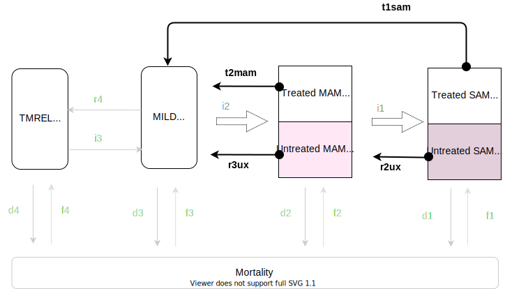

.. role:: underline
    :class: underline

..
  Section title decorators for this document:

  ==============
  Document Title
  ==============

  Section Level 1
  ---------------

  Section Level 2
  +++++++++++++++

  Section Level 3
  ~~~~~~~~~~~~~~~

  Section Level 4
  ^^^^^^^^^^^^^^^

  Section Level 5
  '''''''''''''''

  The depth of each section level is determined by the order in which each
  decorator is encountered below. If you need an even deeper section level, just
  choose a new decorator symbol from the list here:
  https://docutils.sourceforge.io/docs/ref/rst/restructuredtext.html#sections
  And then add it to the list of decorators above.

.. _intervention_wasting_treatment:

===============================================
Treatment and management for acute malnutrition 
===============================================

.. contents::
   :local:
   :depth: 1

.. list-table:: Abbreviations
  :widths: 5 15
  :header-rows: 1

  * - Abbreviation
    - Definition
  * - FMOH
    - Federal ministry of health
  * - SAM
    - severe acute malnutrition 
  * - MAM
    - moderate acute malnutrition
  * - DHS
    - demographic health survey
  * - IMNICI
    - Integrated Management of Newborn and Childhood illness
  * - HEWs
    - Health Extension Workers
  * - HDA
    - Health Development Army
  * - HDG
    - Health Development Group
  * - HP
    - Health post 
  * - OTP
    - Outpatient Therapeutic Programme
  * - TSFP
    - Targeted Supplementary Feeding Programme 
  * - SC
    - Stablisation Centre
  * - PSNP
    - Productive Safety Net Programme
  * - TSFP 
    - Targeted Supplementary Feeding Programme
  * - BSFP
    - Blanket Supplementary Feeding Programme
  * - IYCF
    - Infant and young child feeding
  * - WFL 
    - weight-for-length z-score (used in EMOH guideline)
  * - WFH 
    - weight-for-height z-score (used in EMOH guideline)
  * - WLZ 
    - weight-for-length z-score (used in GBD)
  * - WHZ 
    - weight-for-height z-score (used in GBD)
  * - 
    - 
  * - 
    - 
  * - 
    - 

This documentation focuses on treatment and management of acute malnutrition in Ethiopia based on 2019 National Guideline for the Management of Acute Malnutrition. [EMOH]_

The prevalence of stunting in Ethiopia has declined from 58% in 2000 to 38% in 2016. However, the prevalence of wasting has remained fairly static at 12% in 2000 and 10% in 2016. To address malnutrition in all its forms, the Government is applying two programmatic approaches. The first focuses on increasing access to and availability of food through improved economic growth, better agricultural production systems along with promotion of good nutrition practices and prevention of malnutrition. The second approach aims to strengthen early warning systems and timely emergency response, including wide-scale delivery of services for the management of acute
malnutrition.

The Federal Ministry of Health (FMOH) developed the first Protocol for the Management of Severe Acute
Malnutrition (SAM) in 2007, and the Guideline for the Management of Moderate Acute Malnutrition (MAM)
in 2012. This is the latest National Guideline for the Management of Acute Malnutrition in Ethiopia (2019). It includes the latest World Health Organisation (WHO) guidelines and recommendations, and emerging national and international evidence. It is also aligned to the National Nutrition Programme (NNP) II 2016-2020, the National Food and Nutrition Policy and the Health Sector Transformation Plan (HSTP) 2015/16 - 2019/20.

.. _1.0:

Intervention Overview
---------------------

This flow chart summarizes the core aspects of the care and treatment for SAM and MAM, and integration into the
routine health system. 

.. image:: flow_chart_management_of_acute_malnutrition.svg
   :alt: Flow chart of management of acute malnutrition

.. todo::

   Add a general narrative overview of the intervention, including what it is, what outcomes it affects, if/how/when/where it has been used, etc.

.. _1.1:

Health system delivery
++++++++++++++++++++++

Interventions for wasting treatment are delivered through different levels of the health system.

:underline:`Community and household level`
 
 Community outreach ensures early identification of SAM and MAM cases. Community outreach also aims to empower communities and families to understand the causes of malnutrition, and prevent and manage acute malnutrition in their communities. Health Extension Workers (HEWs) collaborate with the community-based structures such as health committees and engage with the Health Development Army (HDA)/Health Development Group (HDG) to screen and refer cases to the appropriate service for treatment.

:underline:`Health post level`

 The HPs provide primary health care services such as disease prevention and control, hygiene and environmental sanitation, family health services, and health education and communication. The service provider at the HP works closely with the network of the HDA/HDG to facilitate the management of SAM and MAM. The
 service provider diagnoses acute malnutrition and provides Outpatient Therapeutic Programme (OTP) and Targeted Supplementary Feeding Programme (TSFP) services. They also determine patients who have medical complications and refer them to the Stablisation Centre (SC).

:underline:`Health center level`

 The HC provides 24-hour SC for the management of SAM with medical complications. The HC also manages and provides technical support to a cluster of one to five HPs within its vicinity.

:underline:`Hospital level`

 Woreda, Zonal, Regional and referral Hospitals provide higher level referral points where further care can be provided to patients with SAM and more complex medical complications. The referral Hospitals have the facilities and expertise to manage situations that may require administration of oxygen, blood transfusion, and other critical care.

.. _2.0:

Assessing and classifying acute malnutrition
--------------------------------------------

The classification and management of SAM and MAM comes from the 2019 National Guideline for the Management of Acute Malnutrition. [EMOH]_
which are based on the 2013 WHO guidelines on management of SAM in children and infant [WHO_2013_SAM_guidelines]_

:download:`2019 guidelines<guidelines_2019.pdf>`

.. note:: 
  
    - In GBD, SAM and MAM are classified as using WHZ score. In reality, GBD-MAM kids with oedema are treated as SAM kids. We need to check the proportion (sequelae) of GBD-MAM kids to see if we need to make this adjustment in our model.    

.. _2.1:

In infants 0-6 months
+++++++++++++++++++++

:underline:`Classify SAM in infants`

* Any grade of bilateral pitting oedema (+, ++ or +++) OR
* WHZ < -3 zscore 

**Treatment**

NOTE: All infants 0-6 months of age with SAM with or without medical complications should be referred to the SC.

:underline:`Classify MAM in infants`

* MUAC of lactatating mother of infant 0-6 months <23.0 cm
* WHZ ≥-3 to <-2 AND 
  * No bilateral pitting oedema AND 
  * No medical complications
  * Clinically well and alert

**Treatment** 

Assess the infant’s feeding and counsel the mother or caregiver on appropriate IYCF practices. Emphasize on establishing effective exclusive
breastfeeding. If feeding problems, follow up in 5 days. If no feeding problem, follow up in 30 days. Admit the mother to TSFP. Refer the mother for Productive Safety Net Programme (PSNP).

:underline:`Classify no acute malnutrition in infants`

* WHZ ≥-2 zscores AND 
* No bilateral pitting oedema

**Treatment** 

Congratulate and counsel the mother on appropriate IYCF practices.

.. _2.1:

In children 6-59 months
++++++++++++++++++++++++

:underline:`Classify SAM with medical complications`

* Any grade of bilateral pitting oedema (+, ++, +++) OR 
* WHZ < -3 zscore OR
* Presence of any medical complications (see guideline for full list)

**Treatment**

Admit to SC (inpatient)

:underline:`Classify SAM without medical complications`

* Bilateral pitting oedema + or ++ OR 
* WHZ <-3 z-scores AND 
  * Appetite test passed
  * No medical complications
  * Clinically well and alert

**Treatment**

Admit in OTP (outpatient)

:underline:`Classify MAM`

* WHZ ≥ -3 to <-2 z scores AND
  * No bilateral pitting oedema 
  * No medical complications
  * Clinically well and alert

**Treatment**

Admit in TSFP (preferably with RUSF) and counsel on appropriate IYCF practices.

:underline:`Classify no acute malnutrition`

* WHZ ≥ -2 z score AND 
* No bilateral pitting oedema

**Treatment**

Congratulate and counsel the mother on appropriate IYCF practices.

.. todo::

  Fill out the following table with a list of known outcomes affected by the intervention, regardless of if they will be included in the simulation model or not, as it is important to recognize potential unmodeled effects of the intervention and note them as limitations as applicable.

  The table below provides example entries for large scale food fortification with iron.

.. list-table:: Affected Outcomes
  :widths: 15 15 15 30
  :header-rows: 1

  * - Outcome
    - Effect
    - Modeled?
    - Note (ex: is this relationship direct or mediated?)
  * - Median time-to-recovery
    - Decreases 
    - Yes
    - Direct relationship
  * - Death rate
    - Decreases death rate among the treated
    - No
    - Currently we do not have the relative risk of death of treated/untreated. We will capture some of the effect of tx on death by having the simulants recover faster, therefore leave the high risk state faster. However, by assigning utx simulants the mean death rate when they should have a higher death rate, we might overestimate the protective effect of tx on death.
  * - Proportion recovered within programme treatment length
    - Increases
    - No (but we can)
    - We assume that all treatment covered will recover within the time-to-recovery if they had not died. We can modify the treatment coverage by multiplying it by the 'cure rate' giving us the 'met-need' instead. 1 - 'met-need' will be the 'utx' population. 
  * - Proportion defaulted during programme
    - Decreases
    - We can capture this by using 'met-need'
    - This will decrease as 'met-need' increases.

Baseline Coverage Data
++++++++++++++++++++++++

| SAM programme coverage: 48.8% (37.4 - 60.4) (point coverage, assumes programmes are not good at case finding) [Isanaka_2021]_
| MAM programme coverage: same as SAM for now until this website is updated https://acutemalnutrition.org/en/countries 

.. todo::

  Discuss how coverage is estimated (SQUEAC surveys). Discuss difference in point-coverage and period-coverage. 

.. list-table:: Baseline coverage data
  :widths: 10 10 5 15 20
  :header-rows: 1

  * - Location
    - Subpopulation
    - Coverage
    - Value
    - Note
  * - Ethiopia
    - Tx for infants 0-6 months with MAM 
    - :math:`C_{MAM_{0-6}}`
    - Use post-natal care coverage  
    - Coverage of TSFP for breastfeeding mothers among 0-6 month kids with MAM
  * - Ethiopia
    - Tx for infants 0-6 months with any SAM 
    - :math:`C_{SAM_{0-6}}`
    - Use post-natal care coverage 
    - Coverage of SC for kids 0-6 months with any SAM
  * - Ethiopia
    - Tx for kids 6-59 months with MAM 
    - :math:`C_{MAM_{6-59}}`
    - 48.8% (37.4 - 60.4) ~ stand-in until we find updated data
    - Coverage of TSFP for kids 6-59 months with MAM
  * - Ethiopia
    - Tx for kids 6-59 months with SAM
    - :math:`C_{SAM_{6-59}}` 
    - 48.8% (37.4 - 60.4)
    - Coverage of SC or OTP for SAM kids

.. _3.0:

Vivarium Modeling Strategy
--------------------------

For **MAM** 0-6 months infants

 - :math:`r3 = r3_{ux}\times(1-C_{MAM_{0-6}}) + t2_{mam}\times(C_{MAM_{0-6}})`

For **MAM** 6-59 months kids

 - :math:`r3 =  r3_{ux}\times(1-C_{MAM_{6-59}}) + t2_{mam}\times(C_{MAM_{6-59}})`

For **SAM** 6-59 months kids

.. todo::

  THE FOLLOWING HAVE NOT BEEN FULLY UPDATED! 

.. list-table:: Modeled Outcomes **Table 1** MAM 0-6 months
  :widths: 5 5 20 15 15 15 15
  :header-rows: 1

  * - Outcome
    - Outcome type
    - Outcome definition
    - Effect size
    - Effect size application
    - Value, source
    - Note
  * - :math:`r3_{ux}`
    - transition probability
    - Daily recovery probability of untx MAM 
    - :math:`\frac{1}{\text{median time-to-recovery of utx MAM}}` 
    - 
    - 
    - 
  * - :math:`t2_{mam}`
    - transition probability
    - Daily recovery probability of tx MAM 
    - :math:`\frac{1}{\text{median time-to-recovery of tx MAM}}` 
    - 
    -
    - 

.. list-table:: Modeled Outcomes **Table 2** SAM 0-6 months
  :widths: 5 5 20 15 15 15 15
  :header-rows: 1

  * - Outcome
    - Outcome type
    - Outcome definition
    - Effect size
    - Effect size application
    - Value, source
    - Note
  * - :math:`r2_{ux}`
    - transition probability
    - Daily recovery prbability of untx SAM
    - :math:`\frac{1}{\text{median time-to-recovery of utx SAM}}`
    - 
    - 
    - 
  * - :math:`t1_{sam}`
    - transition probability
    - Daily recovery probability of tx SAM 
    - :math:`\frac{1}{\text{median time-to-recovery of tx SAM}}`
    - 
    -
    - 

.. list-table:: Modeled Outcomes **Table 3** MAM 6-59 months
  :widths: 5 5 20 15 15 15 15
  :header-rows: 1

  * - Outcome
    - Outcome type
    - Outcome definition
    - Effect size
    - Effect size application
    - Value, source
    - Note
  * - :math:`r3_{ux}`
    - transition probability
    - Daily recovery probability of untx MAM 
    - :math:`\frac{1}{\text{median time-to-recovery of utx MAM}}` 
    - 
    - 
    - 
  * - :math:`t2_{mam}`
    - transition probability
    - Daily recovery probability of tx MAM 
    - :math:`\frac{1}{\text{median time-to-recovery of tx MAM}}` 
    - 
    -
    - 

.. list-table:: Modeled Outcomes **Table 4** SAM 6-59 months
  :widths: 5 5 20 15 15 15 15
  :header-rows: 1

  * - Outcome
    - Outcome type
    - Outcome definition
    - Effect size
    - Effect size application
    - Value, source
    - Note
  * - :math:`r2_{ux}`
    - transition probability
    - Daily recovery prbability of untx SAM
    - :math:`\frac{1}{\text{median time-to-recovery of utx SAM}}`
    - 
    - 
    - 
  * - :math:`t1_{sam}`
    - transition probability
    - Daily recovery probability of tx SAM 
    - :math:`\frac{1}{\text{median time-to-recovery of tx SAM}}`
    - 
    -
    - 

Affected Outcome #1
+++++++++++++++++++++

.. important::

  Copy and paste this section for each affected outcome included in this document

.. todo::

  Replace "Risk Outcome Pair #1" with the name of an affected entity for which a modeling strategy will be detailed. For additional risk outcome pairs, copy this section as many times as necessary and update the titles accordingly.

.. todo::

  Link to existing document of the affected outcome (ex: cause or risk exposure model document)

.. todo::

  Describe exactly what measure the intervention will affect

.. todo::

  Fill out the tables below

.. list-table:: Affected Outcome #1 Restrictions
  :widths: 15 15 15
  :header-rows: 1

  * - Restriction
    - Value
    - Note
  * - Male only
    - 
    - 
  * - Female only
    - 
    - 
  * - Age group start
    - 
    - 
  * - Age group end
    - 
    - 
  * - Other
    - 
    - 

.. list-table:: Affected Outcome #1 Effect Size
  :widths: 15 15 15 
  :header-rows: 1

  * - Population
    - Effect size
    - Note
  * - Malnourished women
    - +50 g birthweight
    - 
  * - Adequately nourished women
    - +10 g birthweight
    - 

.. todo::

  Describe exactly *how* to apply the effect sizes to the affected measures documented above

.. todo::

  Note research considerations related to generalizability of the effect sizes listed above as well as the strength of the causal criteria, as discussed on the :ref:`general research consideration document <general_research>`.

Assumptions and Limitations
~~~~~~~~~~~~~~~~~~~~~~~~~~~~

Validation and Verification Criteria
~~~~~~~~~~~~~~~~~~~~~~~~~~~~~~~~~~~~~~

References
----------

.. [EMOH] Government of Ethiopia, Federal Ministry of Health. 2019. 
   National Guideline for the Management of Acute
   Malnutrition. Addis Ababa: FMOH.

.. [WHO_2013_SAM_guidelines] 
  
  View `WHO 2013 SAM guideline`_

    Updates on the management of severe acute malnutrition in infants and children

.. _`WHO 2013 SAM guidelines`: https://www.who.int/publications/i/item/9789241506328

.. [Isanaka_2021]

  View `Isanaka 2021`_

    Improving estimates of the burden of severe wasting: analysis of secondary prevalence and incidence data from 352 sites

.. _`Isanaka 2021`: https://gh.bmj.com/content/6/3/e004342

