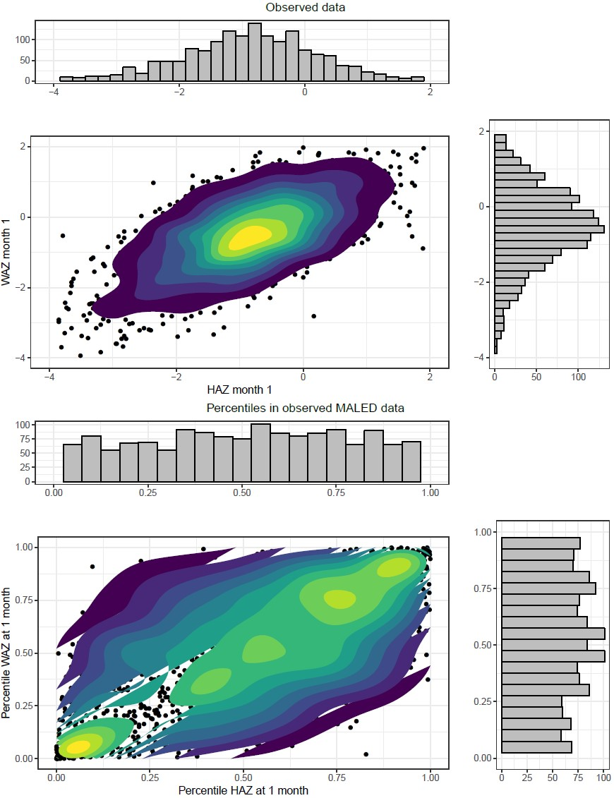
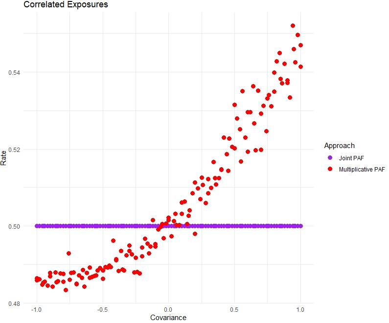
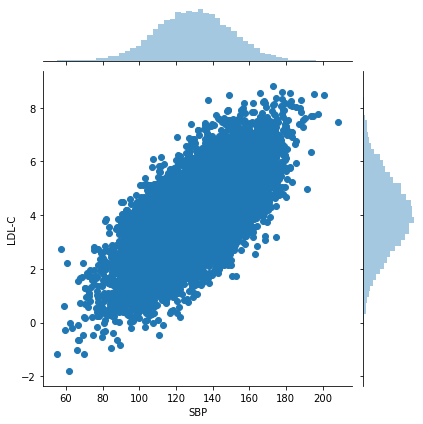
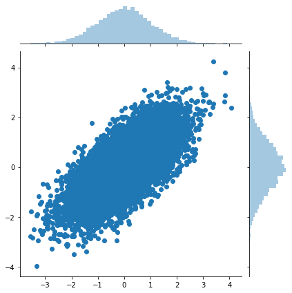
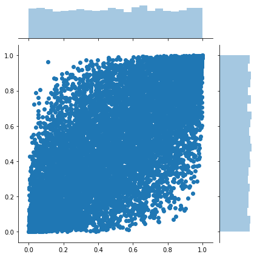
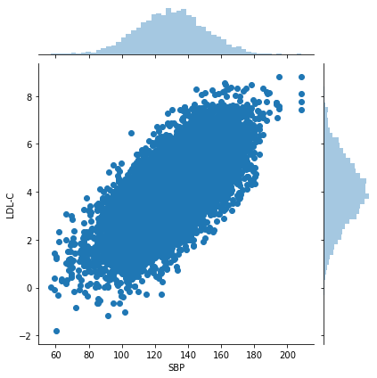
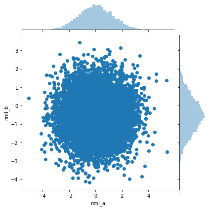
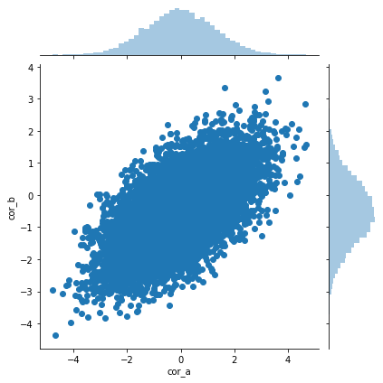

.. _2017_risk_models:

=========================
Risk Correlation Proposal
=========================

Background and motivation
-------------------------

At the individual level, exposure to risk factors are likely to be correlated. Several examples include high body mass index and high fasting plasma glucose, tobacco smoking and alcohol use, and childhood height and weight. Vivarium takes population exposure prevalence estimates by age/sex/year/location and determines the if a simulant is exposed to the risk factor such that the prevalence within the simulation matches the GBD estimate. The exposure status for multiple risk factors of the individuals within Vivarium should be adjusted so that they are correlated across those risks.

Although correlated risk factor exposure may be important in a variety of contexts, we are proposing using childhood height and weight as a testing and motivating example. Childhood growth is an important metric for how children are developing. Children with low height and weight for their age are at higher risk of getting and dying from infectious diseases like diarrhea, lower respiratory infections, and measles. Height and weight should be correlated between children and each child should have dynamic but correlated height and weight over time as they age.

Risk exposure correlation
------------------------------

The proposed method to introduce correlation in risk factor exposure is by finding the Spearman’s correlation coefficient between two or more risks and sampling from a multivariate normal distribution when assigning a position on an exposure distribution. This plot shows data from a joint distribution reflecting the variance and covariance between height and weight at one month using data from a cohort study. The top panel shows the values for the height and weight and the bottom panel shows the percentiles within the distributions (propensity values).

Please see the ipynb Notebook for an example of how we intend to code this.

Attributable fraction correlation
-------------------------------------
Suppose that we introduce correlation in risk exposure but don’t properly adjust for the changes this causes in the combined attributable fractions between the two or more risks. The rate of disease among individuals and in aggregate will be wrong and the amount of error increases with larger values of the combined attributable fractions.

With some testing and simulation, we are able to show that the population attributable fraction for multiple risk factors depends on the correlation in those risks. To date, Vivarium has been using a risk deleted rate (e.g. incidence or mortality) based on an assumption that the risk exposures are independent. However, the more correlated the risks exposures, the more wrong this assumption will be. The overall idea is to take GBD rates and remove the combined contribution of risk factor attributable fractions (PAFs):

.. math::
	i_0 = \left(1-\text{PAF}\right) \cdot i_{\text{GBD}}

Where i_0 is the risk-deleted rate, PAF is the population attributable fraction for a single or multiple risk factors, and  i_GBDis the rate from GBD. A combined PAF for multiple risk factors is the product of 1 minus the independent PAFs.

.. math::
	1 - \text{PAF}_{\text{Multiplicative}} = \left(1 - \text{PAF}_{\text{Risk1}}\right)\cdot\left(1 - \text{PAF}_{\text{Risk2}}\right)

This can be written in a slightly different way for each individual in the simulation and what we are calling the Multiplicative approach to combined PAFs:

.. math::
	PAF_{multiplicative} = 1 - (1 - \frac{1}{\frac{1}{n}\sum_{i=1}^{n}RR_1^{e1_i}}) \cdot (1 - \frac{1}{\frac{1}{n}\sum_{i=1}^{n}RR_2^{e2_i}})

Where RR is a relative risk and e1 & e2 are indicators {0,1} for exposure status to each risk factor for each individual. We are proposing a slight variation on this formulation, what we are calling the Joint approach to combined PAFs:

.. math::
	PAF_{joint} = 1 - \frac{1}{\frac{1}{n}\sum_{i=1}^{n} RR_1^{e1_i} \cdot RR_2^{e2_i}}

These two approaches give nearly the same value for the attributable fraction when the exposure to each risk is independent. However, when the exposures to the risk factors are correlated, the so-called Joint approach gives a higher value of the attributable fraction than the Multiplicative (current Vivarium) approach.
We have conducted some simple tests to determine how this impacts the final rate of events among individuals. In this test, we calculate a risk deleted rate as:

.. math::
	i_0 = \left(1-\text{PAF}\right) \cdot i_{\text{GBD}}

And calculate the attributable fraction in the two ways described above, as a multiplicative and a joint PAF that we compared.

.. math::
	i_{multi,0} = (1-{PAF_{multi}}) \cdot i_{{GBD}}
.. math::
	i_{joint,0} = (1-{PAF_{joint}}) \cdot i_{{GBD}}

Each individual then has a rate of event defined by

.. math::
	i_{e_1, e_2} = i_0 \cdot \left(\text{RR}_1\right)^{e_1}\cdot \left(\text{RR}_2\right)^{e_2}

Where i is the rate for an individual, i0 is the risk deleted rate, RR is a relative risk and e is an indicator {0,1} denoting if the individual is exposed to that risk factor.

Our simple tests show that when evaluating these attributable fractions on individuals with a known rate of event, the joint PAFs return rates nearly identical to the known rate of events. In contrast, the multiplicative PAFs return rates that are too high when the risk exposures are correlated (rate here is 0.5).

Proposal to test
-----------------------
We would like to test these two changes for exposures and attributable fractions in the Balanced Energy Protein model as sensitivity analyses supplementing the primary analysis. The risks that we want to test are childhood growth failure: stunting, underweight, and wasting. We are proposing using correlation structures for these exposures from analyses of individual-level data.

Also in the BEP model, we would like to attempt creating correlated changes to propensity scores for stunting, underweight, and wasting within individuals over time. This would involve implementing multiple samples for these risk factors to determine propensity and risk exposure for each simulant. There would not be any changes to the attributable fractions for these risks, the only change would be in allowing these propensity values to change at defined time points, corresponding with GBD age groups.

Illustrative code example
-----------------------

This file is a practical example and test of approaches to change the population attributable fraction (PAF) for risk factors in Vivarium such that they account for observed correlation in exposure between risks.
====================================================================================================================================================================================================================

This file will investigate the approach that Vivarium currently uses to
calculate the PAF for multiple risk factors, which we will call the
*multiplicative* approach. In comparison, Abie and Chris and proposing a
*joint* approach.

The first part of the file looks at how we will jointly estimate
exposure probabilities from copulae. The second part of the file
proposes our alternative formulation of a *joint* PAF. The last part of
the file tests our assumptions in a very simple step by step model.

.. code:: ipython3

    import numpy as np
    import matplotlib as matplot
    import pandas as pd

.. code:: ipython3

    import seaborn as sns
    import scipy.stats

Gaussian copula to correlation two risk factor exposures
========================================================

And then some investigation of how much error this introduces in the
PAF.

This part of our file shows how we can introduce correlation from a
multivariate normal distribution. All we need is correlation
(variance/covariance) in our exposures.

.. code:: ipython3

    # Simulate for testing purposes

    N = 10_000  # number of individuals

    # set random seed for reproducibility
    np.random.seed(12345)

    # simulate data (to be replaced with real data, e.g. from NHANES, eventually)
    df = pd.DataFrame(index=range(N))
    df['SBP'] = np.random.normal(130, 20, size=N)
    df['LDL-C'] = np.random.normal(4+(df.SBP-130)/20, 1, size=N)  # intentionally include correlation between SBP and LDL-C
    df

.. raw:: html

    

    
    <table border="1" class="dataframe">
      <thead>
        <tr style="text-align: right;">
          <th></th>
          <th>SBP</th>
          <th>LDL-C</th>
        </tr>
      </thead>
      <tbody>
        <tr>
          <th>0</th>
          <td>125.905847</td>
          <td>5.723323</td>
        </tr>
        <tr>
          <th>1</th>
          <td>139.578867</td>
          <td>3.322323</td>
        </tr>
        <tr>
          <th>2</th>
          <td>119.611226</td>
          <td>3.089911</td>
        </tr>
        <tr>
          <th>3</th>
          <td>118.885394</td>
          <td>3.845074</td>
        </tr>
        <tr>
          <th>4</th>
          <td>169.315611</td>
          <td>5.091290</td>
        </tr>
        <tr>
          <th>...</th>
          <td>...</td>
          <td>...</td>
        </tr>
        <tr>
          <th>9995</th>
          <td>112.742931</td>
          <td>3.499870</td>
        </tr>
        <tr>
          <th>9996</th>
          <td>173.045882</td>
          <td>8.809667</td>
        </tr>
        <tr>
          <th>9997</th>
          <td>129.865889</td>
          <td>5.465636</td>
        </tr>
        <tr>
          <th>9998</th>
          <td>105.705538</td>
          <td>3.818431</td>
        </tr>
        <tr>
          <th>9999</th>
          <td>143.099773</td>
          <td>7.605454</td>
        </tr>
      </tbody>
    </table>
    
10000 rows × 2 columns

    

.. code:: ipython3

    sns.jointplot(df['SBP'], df['LDL-C'])

.. parsed-literal::

    <seaborn.axisgrid.JointGrid at 0x21892019648>

What we want from the microdata is simply the Spearman R value, which captures the correlation of SBP and LDL-C as continuous variables
=======================================================================================================================================

.. code:: ipython3

    rho, p_val = scipy.stats.spearmanr(df['SBP'], df['LDL-C'])
    rho

.. parsed-literal::

    0.6942625526106255

What will we use that for?
==========================

We will generate a multivariate normal with that rho, and then use that
to generate a distribution that is marginally uniform, but with that
rho, and then use that to generate a distribution that in its margins
matches the SPB and LDL-C from GBD, but also has Spearman correlation
rho:

.. code:: ipython3

    probit_propensity = np.random.multivariate_normal([0,0], [[1, rho],
                                                             [rho, 1]], size=N)
    sns.jointplot(probit_propensity[:,0], probit_propensity[:,1])
    rho, p_val = scipy.stats.spearmanr(probit_propensity[:,0], probit_propensity[:,1])
    rho

.. parsed-literal::

    0.6797538355495384

.. code:: ipython3

    propensity = scipy.stats.norm().cdf(probit_propensity)
    sns.jointplot(propensity[:,0], propensity[:,1])
    rho, p_val = scipy.stats.spearmanr(propensity[:,0], propensity[:,1])
    rho

.. parsed-literal::

    0.6797538355495384

.. code:: ipython3

    # HACK: instead of loading marginals from GBD, I'm going to re-use the ones
    # I synthesized above

    exposure1_vals = df['SBP'].sort_values().values
    exposure2_vals = df['LDL-C'].sort_values().values

    def exposure1_from_propensity(p):
        p = np.array(p)
        i = np.array(np.floor(p*len(exposure1_vals)), dtype=int)
        return exposure1_vals[i]

    def exposure2_from_propensity(p):
        p = np.array(p)
        i = np.array(np.floor(p*len(exposure2_vals)), dtype=int)
        return exposure2_vals[i]

.. code:: ipython3

    # now map from propensity to value
    df_synthetic = pd.DataFrame(index=range(N))
    df_synthetic['SBP'] = exposure1_from_propensity(propensity[:,0])
    df_synthetic['LDL-C'] = exposure2_from_propensity(propensity[:,1])
    df_synthetic

.. raw:: html

    

    
    <table border="1" class="dataframe">
      <thead>
        <tr style="text-align: right;">
          <th></th>
          <th>SBP</th>
          <th>LDL-C</th>
        </tr>
      </thead>
      <tbody>
        <tr>
          <th>0</th>
          <td>134.011378</td>
          <td>5.192848</td>
        </tr>
        <tr>
          <th>1</th>
          <td>116.002529</td>
          <td>3.155872</td>
        </tr>
        <tr>
          <th>2</th>
          <td>120.862054</td>
          <td>1.630903</td>
        </tr>
        <tr>
          <th>3</th>
          <td>110.848538</td>
          <td>2.214022</td>
        </tr>
        <tr>
          <th>4</th>
          <td>133.763781</td>
          <td>4.926610</td>
        </tr>
        <tr>
          <th>...</th>
          <td>...</td>
          <td>...</td>
        </tr>
        <tr>
          <th>9995</th>
          <td>135.609528</td>
          <td>5.082792</td>
        </tr>
        <tr>
          <th>9996</th>
          <td>91.988864</td>
          <td>3.282778</td>
        </tr>
        <tr>
          <th>9997</th>
          <td>90.701909</td>
          <td>1.307473</td>
        </tr>
        <tr>
          <th>9998</th>
          <td>122.352818</td>
          <td>4.338779</td>
        </tr>
        <tr>
          <th>9999</th>
          <td>136.862764</td>
          <td>3.626774</td>
        </tr>
      </tbody>
    </table>
    
10000 rows × 2 columns

    

.. code:: ipython3

    sns.jointplot(df_synthetic['SBP'], df_synthetic['LDL-C'])
    rho, p_val = scipy.stats.spearmanr(df_synthetic['SBP'], df_synthetic['LDL-C'])
    rho

.. parsed-literal::

    0.6797565466113832

The anticipated problem with this approach: how does correlation affect the joint PAF?
======================================================================================

This is not relevant to the material above—using the Gaussian Copula to
capture the correlation between risk-factor exposure will be fine. The
problem is when we then layer at RiskEffect component into our model, to
make the risk have a effect on the incidence or mortality rate of our
cause model. Without loss of generality, suppose the risk effect will
change the rate of disease.

We have traditionally handled this by calculating a risk-deleted
incidence:

.. math::

   i_0 = \left(1-\text{PAF}\right) \cdot i_{\text{GBD}}

If we *just* include one risk effect, we should still be ok, even with
correlation. But if we have two risk effects, we have previously used
assumption

.. math::

   1 - \text{PAF}_{\text{Multiplicative}} = \left(1 - \text{PAF}_{\text{Risk1}}\right)\cdot\left(1 - \text{PAF}_{\text{Risk2}}\right).

The more correlated the risk exposure, the more wrong this assumption.

I propose we continue to assume that the relative risks have a “log
linear” relationship with incidence:

.. math::

   i_{e_1, e_2} = i_0 \cdot \left(\text{RR}_1\right)^{e_1}\cdot \left(\text{RR}_2\right)^{e_2},

where we have written :math:`e_1` and :math:`e_2` as “standardized”
exposures, after scaling and shifting so that the TMREL is 0.0 and a one
unit increment gives the relative increase in disease burden reported by
GBD.

With the log-linear assumption, we can calculate the PAF from first
principles as a double integral (below :math:`p_{e_1,e_2}` denotes the
joint probability density of exposure level :math:`(e_1,e_2)` in the
population:

:raw-latex:`\begin{align*}
i_{\text{GBD}} &= \int_{e_1} \int_{e_2} i_{e_1, e_2} p_{e_1,e_2} de_1 de_2\\
&= \int_{e_1} \int_{e_2} i_0 \cdot \left(\text{RR}_1\right)^{e_1}\cdot \left(\text{RR}_2\right)^{e_2}
p_{e_1,e_2} de_1 de_2\\
&= \int_{e_1} \int_{e_2} \left(1-\text{PAF}\right) \cdot i_{\text{GBD}} \cdot \left(\text{RR}_1\right)^{e_1}\cdot \left(\text{RR}_2\right)^{e_2}
p_{e_1,e_2} de_1 de_2\\
\end{align*}`

Dividing through and cancelling terms yields a solution:

.. math::

   \frac{1}{1-\text{PAF}} = \int_{e_1} \int_{e_2} \left(\text{RR}_1\right)^{e_1}\cdot \left(\text{RR}_2\right)^{e_2}
   p_{e_1,e_2} de_1 de_2,

.. code:: ipython3

    # there are lots of ways to approximate this integral, but here is a cool one:
    rr_1 = 1.5
    rr_2 = 3

    e1 = np.clip((df['SBP'] - 120)/10, 0, np.inf)  # rescale exposures
    e2 = np.clip((df['LDL-C'] - 4), 0, np.inf)

    one_over_one_minus_paf = np.mean(rr_1**e1 * rr_2**e2)
    paf = 1 - 1/(one_over_one_minus_paf)
    paf

.. parsed-literal::

    0.936944660107624

.. code:: ipython3

    # how does this compare to multiplicative approx of paf?
    ooomp_1 = np.mean(rr_1**e1)
    paf_1 = 1 - 1/ooomp_1

    ooomp_2 = np.mean(rr_2**e2)
    paf_2 = 1 - 1/ooomp_2

    1 - (1 - paf_1) * (1 - paf_2)

.. parsed-literal::

    0.8708098034918508

These values are somewhat different, reflecting the impact of the
correlation in SBP and LDL-C in our simulated data. If we used the
*multiplicative* PAF, our estimated rate would be quite different. Let’s
look at a simpler model of categorical risks.

Here is an example of categorial risk exposures
=======================================================

.. code:: ipython3

    # simulate categorical data (to be replaced with real data, e.g. from MALED/Surveys, eventually)
    df = pd.DataFrame(index=range(N))
    # Uncorrelated, binomial
    df['bin_a'] = np.random.binomial(1, 0.3, size=N)
    df['bin_b'] = np.random.binomial(1, 0.1, size=N)

    rr_1 = 2.5
    rr_2 = 5

Define what we will call a joint PAF:

.. math::

   PAF_{joint} = 1 - \frac{1}{\frac{1}{n}\sum_{i=1}^{n} RR_1^{e1_i} \cdot RR_2^{e2_i}}

And also what we will call a multiplicative PAF:

.. math::

   PAF_{multiplicative} = 1 - (1 - \frac{1}{\frac{1}{n}\sum_{i=1}^{n}RR_1^{e1_i}}) \cdot (1 - \frac{1}{\frac{1}{n}\sum_{i=1}^{n}RR_2^{e2_i}})

.. code:: ipython3

    one_over_one_minus_paf = np.mean(rr_1**df['bin_a'] * rr_2**df['bin_b'])
    paf = 1 - 1/(one_over_one_minus_paf)
    paf

.. parsed-literal::

    0.5127418018808165

.. code:: ipython3

    # how does this compare to multiplicative approx of paf?
    ooomp_1 = np.mean(rr_1**df['bin_a'])
    paf_1 = 1 - 1/ooomp_1

    ooomp_2 = np.mean(rr_2**df['bin_b'])
    paf_2 = 1 - 1/ooomp_2

    1 - (1 - paf_1) * (1 - paf_2)

.. parsed-literal::

    0.5145153501895934

The approaches give nearly the same estimate of the combined PAF when
the exposures are independent.

Now we are making it a bit more complicated, sim some data for continuous exposures
---------------------------------------------------------------------------------

We have made two pairs of random distributions with the same means and
standard deviations. First, sim without correlation (nml_a, nml_b).
Next, sim with some correlation (cor_a, cor_b). I have continuous
distributions at this point so we create four new variables that are
binary if they are below -2. The variables “exp_na” and “exp_nb” are for
the normal uncorrelated distributions while “exp_ca” and “exp_cb” are
for the correlated distributions. This is just intended as an exercise
based on the height-for-age z-score definitions of stunting (stunted is
<= -2 SD).

.. code:: ipython3

    # Uncorrelated, continuous normal
    mean_a = 0
    sd_a = 1.3

    mean_b = -0.5
    sd_b = 1

    rho = 0.8

    df['nml_a'] = np.random.normal(mean_a, sd_a, size=N)
    df['nml_b'] = np.random.normal(mean_b, sd_b, size=N)

    # Correlated continuous normal
    cor_nml = np.random.multivariate_normal([mean_a,mean_b], [[sd_a**2, rho],[rho, sd_b**2]], size=N)
    #cor_nml
    df['cor_a'] = cor_nml[:,0]
    df['cor_b'] = cor_nml[:,1]

    # For this example, I am thinking about HAZ, so I will set 'exposed' to less than -2

    ## Does this work how I am expecting it to in Python?!
    df['exp_na'] = 0
    df['exp_nb'] = 0
    df['exp_ca'] = 0
    df['exp_cb'] = 0
    for i in range(0,N):
        if (df['nml_a'][i] < (-2)):
            df['exp_na'][i] = 1
    for i in range(0,N):
        if(df['nml_b'][i] < (-2)):
            df['exp_nb'][i] = 1
        if(df['cor_a'][i] < (-2)):
            df['exp_ca'][i] = 1
        if(df['cor_b'][i] < (-2)):
            df['exp_cb'][i] = 1
    df

.. parsed-literal::

    C:\Users\ctroeger\AppData\Local\Continuum\miniconda3\lib\site-packages\ipykernel_launcher.py:28: SettingWithCopyWarning:
    A value is trying to be set on a copy of a slice from a DataFrame

    See the caveats in the documentation: https://pandas.pydata.org/pandas-docs/stable/user_guide/indexing.html#returning-a-view-versus-a-copy
    C:\Users\ctroeger\AppData\Local\Continuum\miniconda3\lib\site-packages\ipykernel_launcher.py:35: SettingWithCopyWarning:
    A value is trying to be set on a copy of a slice from a DataFrame

    See the caveats in the documentation: https://pandas.pydata.org/pandas-docs/stable/user_guide/indexing.html#returning-a-view-versus-a-copy
    C:\Users\ctroeger\AppData\Local\Continuum\miniconda3\lib\site-packages\ipykernel_launcher.py:33: SettingWithCopyWarning:
    A value is trying to be set on a copy of a slice from a DataFrame

    See the caveats in the documentation: https://pandas.pydata.org/pandas-docs/stable/user_guide/indexing.html#returning-a-view-versus-a-copy
    C:\Users\ctroeger\AppData\Local\Continuum\miniconda3\lib\site-packages\ipykernel_launcher.py:31: SettingWithCopyWarning:
    A value is trying to be set on a copy of a slice from a DataFrame

    See the caveats in the documentation: https://pandas.pydata.org/pandas-docs/stable/user_guide/indexing.html#returning-a-view-versus-a-copy

.. raw:: html

    

    
    <table border="1" class="dataframe">
      <thead>
        <tr style="text-align: right;">
          <th></th>
          <th>bin_a</th>
          <th>bin_b</th>
          <th>nml_a</th>
          <th>nml_b</th>
          <th>cor_a</th>
          <th>cor_b</th>
          <th>exp_na</th>
          <th>exp_nb</th>
          <th>exp_ca</th>
          <th>exp_cb</th>
        </tr>
      </thead>
      <tbody>
        <tr>
          <th>0</th>
          <td>0</td>
          <td>1</td>
          <td>-0.057584</td>
          <td>-0.950021</td>
          <td>-1.818019</td>
          <td>-0.826437</td>
          <td>0</td>
          <td>0</td>
          <td>0</td>
          <td>0</td>
        </tr>
        <tr>
          <th>1</th>
          <td>1</td>
          <td>0</td>
          <td>0.382862</td>
          <td>0.206593</td>
          <td>0.126023</td>
          <td>-1.564974</td>
          <td>0</td>
          <td>0</td>
          <td>0</td>
          <td>0</td>
        </tr>
        <tr>
          <th>2</th>
          <td>0</td>
          <td>0</td>
          <td>0.287244</td>
          <td>-0.582161</td>
          <td>1.631291</td>
          <td>-0.496486</td>
          <td>0</td>
          <td>0</td>
          <td>0</td>
          <td>0</td>
        </tr>
        <tr>
          <th>3</th>
          <td>0</td>
          <td>0</td>
          <td>-2.595732</td>
          <td>-0.208823</td>
          <td>0.671197</td>
          <td>0.529351</td>
          <td>1</td>
          <td>0</td>
          <td>0</td>
          <td>0</td>
        </tr>
        <tr>
          <th>4</th>
          <td>0</td>
          <td>0</td>
          <td>-0.603832</td>
          <td>-0.572606</td>
          <td>0.681999</td>
          <td>-0.739108</td>
          <td>0</td>
          <td>0</td>
          <td>0</td>
          <td>0</td>
        </tr>
        <tr>
          <th>...</th>
          <td>...</td>
          <td>...</td>
          <td>...</td>
          <td>...</td>
          <td>...</td>
          <td>...</td>
          <td>...</td>
          <td>...</td>
          <td>...</td>
          <td>...</td>
        </tr>
        <tr>
          <th>9995</th>
          <td>0</td>
          <td>0</td>
          <td>1.413890</td>
          <td>0.426929</td>
          <td>-0.502449</td>
          <td>-1.987269</td>
          <td>0</td>
          <td>0</td>
          <td>0</td>
          <td>0</td>
        </tr>
        <tr>
          <th>9996</th>
          <td>0</td>
          <td>0</td>
          <td>0.182369</td>
          <td>-0.633904</td>
          <td>0.503280</td>
          <td>-1.297071</td>
          <td>0</td>
          <td>0</td>
          <td>0</td>
          <td>0</td>
        </tr>
        <tr>
          <th>9997</th>
          <td>0</td>
          <td>0</td>
          <td>-0.937989</td>
          <td>-0.543358</td>
          <td>0.014530</td>
          <td>-1.185948</td>
          <td>0</td>
          <td>0</td>
          <td>0</td>
          <td>0</td>
        </tr>
        <tr>
          <th>9998</th>
          <td>0</td>
          <td>1</td>
          <td>1.806999</td>
          <td>0.142196</td>
          <td>-0.099585</td>
          <td>-0.248132</td>
          <td>0</td>
          <td>0</td>
          <td>0</td>
          <td>0</td>
        </tr>
        <tr>
          <th>9999</th>
          <td>0</td>
          <td>0</td>
          <td>-1.193765</td>
          <td>0.860961</td>
          <td>-0.972553</td>
          <td>-1.269407</td>
          <td>0</td>
          <td>0</td>
          <td>0</td>
          <td>0</td>
        </tr>
      </tbody>
    </table>
    
10000 rows × 10 columns

    

.. code:: ipython3

    # Does this do what I expected it to?
    print(np.mean(df['exp_na']), np.mean(df['exp_nb']),
          np.mean(df['exp_ca']), np.mean(df['exp_cb']))

.. parsed-literal::

    0.0573 0.069 0.0611 0.0721

.. code:: ipython3

    # Compare just to make sure I got what I expected
    sns.jointplot(df['nml_a'], df['nml_b'])

.. parsed-literal::

    <seaborn.axisgrid.JointGrid at 0x21893f77a48>

.. code:: ipython3

    sns.jointplot(df['cor_a'], df['cor_b'])

.. parsed-literal::

    <seaborn.axisgrid.JointGrid at 0x21893cece48>

When the exposures are independent, it seems that the PAFs from the multiplicative and joint risk approaches are similar.
-------------------------------------------------------------------------------------------------------------------------

.. code:: ipython3

    # What is the value of the joint risk approach?
    one_over_one_minus_paf = np.mean(rr_1**df['exp_na'] * rr_2**df['exp_nb'])
    paf_j_ind = 1 - 1/(one_over_one_minus_paf)
    paf_j_ind

.. parsed-literal::

    0.2772216399840989

.. code:: ipython3

    # how does this compare to multiplicative approx of paf?
    ooomp_1 = np.mean(rr_1**df['exp_na'])
    paf_1 = 1 - 1/ooomp_1

    ooomp_2 = np.mean(rr_2**df['exp_nb'])
    paf_2 = 1 - 1/ooomp_2

    paf_m_ind = 1 - (1 - paf_1) * (1 - paf_2)
    paf_m_ind

.. parsed-literal::

    0.2783285974850329

However, when the exposures are correlated, it seems that the PAFs from the the joint risk approach are higher than the multiplicative approach which returns similar values to the independent exposures.
----------------------------------------------------------------------------------------------------------------------------------------------------------------------------------------------------------

.. code:: ipython3

    # What is the value of the joint risk approach?
    one_over_one_minus_paf = np.mean(rr_1**df['exp_ca'] * rr_2**df['exp_cb'])
    paf_j_cor = 1 - 1/(one_over_one_minus_paf)
    paf_j_cor

.. parsed-literal::

    0.3420403329275915

.. code:: ipython3

    # how does this compare to multiplicative approx of paf?
    ooomp_1 = np.mean(rr_1**df['exp_ca'])
    paf_1 = 1 - 1/ooomp_1

    ooomp_2 = np.mean(rr_2**df['exp_cb'])
    paf_2 = 1 - 1/ooomp_2

    paf_m_cor = 1 - (1 - paf_1) * (1 - paf_2)
    paf_m_cor

.. parsed-literal::

    0.2890061162964448

Now, calculate individual incidences for the individuals in our simulated data
==============================================================================

Our proposal is that we leave the general approach to risk deleted
incidence the same:

.. math::

   i_0 = \left(1-\text{PAF}\right) \cdot i_{\text{GBD}}

But now we can compare two different approaches to calculating this PAF,
multiplicative and joint:

.. math::

   i_{multi,0} = (1-{PAF_{multi}}) \cdot i_{{GBD}}

.. math::

   i_{joint,0} = (1-{PAF_{joint}}) \cdot i_{{GBD}}

And we can continue to find an individual’s rate the same way:

.. math::

   i_{e_1, e_2} = i_0 \cdot \left(\text{RR}_1\right)^{e_1}\cdot \left(\text{RR}_2\right)^{e_2}

.. code:: ipython3

    rate = 0.8

    # Independent draws
    multi_rate0 = (1-paf_m_ind) * rate
    joint_rate0 = (1-paf_j_ind) * rate
    df['ind_multi_rate'] = multi_rate0 * rr_1**df['exp_na'] * rr_2**df['exp_nb']
    df['ind_joint_rate'] = joint_rate0 * rr_1**df['exp_na'] * rr_2**df['exp_nb']

    # Correlated draws
    multi_rate0 = (1-paf_m_cor) * rate
    joint_rate0 = (1-paf_j_cor) * rate
    df['cor_multi_rate'] = multi_rate0 * rr_1**df['exp_ca'] * rr_2**df['exp_cb']
    df['cor_joint_rate'] = joint_rate0 * rr_1**df['exp_ca'] * rr_2**df['exp_cb']

.. code:: ipython3

    np.mean(df['ind_multi_rate'])

.. parsed-literal::

    0.7987747751596663

.. code:: ipython3

    np.mean(df['ind_joint_rate'])

.. parsed-literal::

    0.8

.. code:: ipython3

    np.mean(df['cor_multi_rate'])

.. parsed-literal::

    0.8644832433174788

.. code:: ipython3

    np.mean(df['cor_joint_rate'])

.. parsed-literal::

    0.7999999999999998

My interpretation of these results is that the *Joint PAF* approach produces (near) exact matches for both independent and correlated exposures. When the exposures are independent, the *Multiplicative PAF* approach seems to be very close. However, when the exposures are correlated, the *Multiplicative PAF* returns a rate that is too high.
~~~~~~~~~~~~~~~~~~~~~~~~~~~~~~~~~~~~~~~~~~~~~~~~~~~~~~~~~~~~~~~~~~~~~~~~~~~~~~~~~~~~~~~~~~~~~~~~~~~~~~~~~~~~~~~~~~~~~~~~~~~~~~~~~~~~~~~~~~~~~~~~~~~~~~~~~~~~~~~~~~~~~~~~~~~~~~~~~~~~~~~~~~~~~~~~~~~~~~~~~~~~~~~~~~~~~~~~~~~~~~~~~~~~~~~~~~~~~~~~~~~~~~~~~~~~~~~~~~~~~~~~~~~~~~~~~~~~~~~~~~~~~~~~~~~~~~~~~~~~~~~~~~~~~~~~~~~~~~~~~~~~~~~~~~~~~~~~~~~~

Apply this same structure in R to produce a function that can be used to test different values of the means, standard deviations, rate, correlation, and relative risks for two risk factors.
---------------------------------------------------------------------------------------------------------------------------------------------------------------------------------------------------------

.. code:: ipython3

    ## Not run (in R):
    # set.seed(4)
    # library(MASS)
    # library(ggplot2)
    # library(reshape2)
    # library(data.table)
    #
    # run_paf_testing <- function(n, mean_a, mean_b, sd_a, sd_b, rho, rate, rr_1, rr_2){
    #   df <- data.frame(id = 1:n)
    #   df$nml_a = rnorm(n = n, mean_a, sd_a)
    #   df$nml_b = rnorm(n, mean_b, sd_b)
    #
    #   # Correlated continuous normal
    #   sigma <- matrix(c(sd_a^2,rho,rho,sd_b^2), ncol=2)
    #   cor_nml <- mvrnorm(n= n, mu = c(mean_a, mean_b), Sigma=sigma)
    #
    #   #cor_nml
    #   df$cor_a = cor_nml[,1]
    #   df$cor_b = cor_nml[,2]
    #
    #   # For this example, I am thinking about HAZ, so I will set 'exposed' to less than -2
    #   for(l in c("nml_a","nml_b","cor_a","cor_b")){
    #     y <- ifelse(df[,l] < (-2), 1, 0)
    #     df[,paste0("exp_",l)] <- y
    #   }
    #
    #   # What is the value of the joint risk approach?
    #   one_over_one_minus_paf = mean(rr_1^df$exp_nml_a * rr_2^df$exp_nml_b)
    #   paf_j_ind = 1 - 1/(one_over_one_minus_paf)
    #
    #   ooomp_1 = mean(rr_1^df$exp_nml_a)
    #   paf_1 = 1 - 1/ooomp_1
    #
    #   ooomp_2 = mean(rr_2^df$exp_nml_b)
    #   paf_2 = 1 - 1/ooomp_2
    #
    #   paf_m_ind = 1 - (1 - paf_1) * (1 - paf_2)
    #
    #   # What is the value of the joint risk approach?
    #   one_over_one_minus_paf = mean(rr_1^df$exp_cor_a * rr_2^df$exp_cor_b)
    #   paf_j_cor = 1 - 1/(one_over_one_minus_paf)
    #
    #   # how does this compare to multiplicative approx of paf?
    #   ooomp_1 = mean(rr_1^df$exp_cor_a)
    #   paf_1 = 1 - 1/ooomp_1
    #
    #   ooomp_2 = mean(rr_2^df$exp_cor_b)
    #   paf_2 = 1 - 1/ooomp_2
    #
    #   paf_m_cor = 1 - (1 - paf_1) * (1 - paf_2)
    #
    #   # Finally test rates
    #   # Independent draws
    #   multi_rate0 = (1-paf_m_ind) * rate
    #   joint_rate0 = (1-paf_j_ind) * rate
    #   df$ind_multi_rate = multi_rate0 * rr_1^df$exp_nml_a * rr_2^df$exp_nml_b
    #   df$ind_joint_rate = joint_rate0 * rr_1^df$exp_nml_a * rr_2^df$exp_nml_b
    #
    #   # Correlated draws
    #   multi_rate0 = (1-paf_m_cor) * rate
    #   joint_rate0 = (1-paf_j_cor) * rate
    #   df$cor_multi_rate = multi_rate0 * rr_1^df$exp_cor_a * rr_2^df$exp_cor_b
    #   df$cor_joint_rate = joint_rate0 * rr_1^df$exp_cor_a * rr_2^df$exp_cor_b
    #
    #   output <- data.frame(rate, rr_1, rr_2, mean_a, mean_b, rho, n, paf_j_cor, paf_m_cor, paf_j_ind, paf_m_ind,
    #                        ind_multi_rate = mean(df$ind_multi_rate),
    #                        ind_joint_rate = mean(df$ind_joint_rate),
    #                        cor_joint_rate = mean(df$cor_joint_rate),
    #                        cor_multi_rate = mean(df$cor_multi_rate))
    #   return(output)
    # }
    #
    # loop_df <- data.frame()
    # for(i in seq(0.02, 1, 0.02)){
    #   p <- run_paf_testing(n=1000, mean_a = (-1), mean_b = mean_b, sd_a = 1.2, sd_b, rate=0.5, rho=i, rr_1 = 2, rr_2 = 4)
    #   loop_df <- rbind(loop_df, p)
    # }
    #
    # ggplot(subset(melt_df, variable %like% "cor_"), aes(x=rho, y=value, col=variable)) + geom_point(size=3) + ylab("Rate") +
    #   xlab("Covariance") + theme_minimal() + ggtitle("Correlated Exposures") +
    #   scale_color_manual("Approach", values = c("purple","red"), labels=c("Joint PAF",
    #                                                                       "Multiplicative PAF"))

Output of the R code looks like this:

