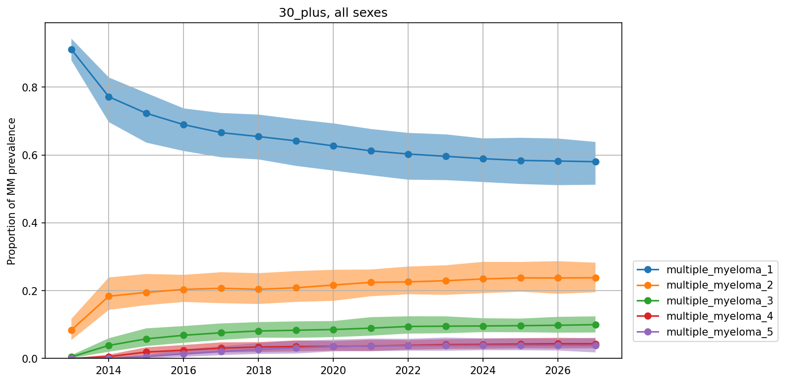

=================
Burn-in Periods
=================

For some models, we may choose to run a burn-in period before the simulation begins in 
order to initialize unknown parameters or correlations between parameters. 
Running a burn-in period involves 
initializing the model with simple "best guess" or approximate values, and then running the model for a period 
of time before the simulation start (the point at which we begin making the observations
of simulants we will analyze to answer our "business question"). 

The model's state at the end 
of the burn-in period is the initial state of the simulation. Over the course of the 
burn-in period, the simple initialized values will change according to their modeled
relationsips with other parameters, and eventually reach an equilibrium where the 
parameter values and correlations between them reflect our assumptions about the population.

.. note::
    The burn-in period and simulation period are continuous with each other and there are 
    no adjustments made to the model in between them.  

    So on a technical level, both the burn-in and the simulation are usually performed together with just one Vivarium microsimulation.
    
    Conceptually, however, they serve very different purposes. 
    The difference is that during the simulation period, we observe the population and record the 
    data we will use to answer the "business question" associated with the model. 
    We consider the burn-in period to be outside the time period we are simulating, 
    with the model not yet fully initialized,
    therefore we would not want to consider the events of the burn-in period in our analysis of the 
    business question.

When to use a burn-in period
============================

We always use the best available data in our simulations, but there won't be perfect data in GBD or 
the literature for every parameter and correlation between parameters we wish to be initialized at 
the beginning of the model. 

We may not find any data directly informing a parameter value during 
our literature search, or we may only have "starting point" data we are not very confident in,
for reasons such as a small sample size, or a study environment that differs from our simulation. 

Burn-in periods are only one way to address a lack of direct data. For example, if we have multiple
data sources that are inconsistent with each other, we may run an :ref:`optimization <facility_choice_calibration>`
to determine a consistent set of starting values. Analytical methods such as solving a system of equations
is another possible way to initialize a simulation, though in practice a burn-in period tends to be easier.

.. note::
    The term "burn-in" may originate from electronics testing, in which components undergo an initial 
    stress test before being distributed to catch early failures. This term 
    `has also been used <https://web.archive.org/web/20200807013910/https://www.tested.com/tech/accessories/459117-science-and-myth-burning-headphones/>`_ 
    in the context of sound equipment to refer to a similar period of utilization, also called "break-in", after 
    which components reach their peak performance. 

Example: Multiple Myeloma
=========================

Let's make this more concrete using our :ref:`Multiple Myeloma (MM) model <2019_cancer_model_multiple_myeloma>`
as an example. The MM model has :ref:`two disease states <2019_cancer_model_multiple_myeloma_cause_model_diagram>`, 
one for newly-diagnosed multiple myeloma (NDMM) and one for relapsed and/or refractory multiple myeloma (RRMM), which consists of stages corresponding to the 
number of relapses. 

We had GBD data for incidence rates as well as survival rates from the literature, so we were able to use a burn-in period to estimate prevalences for each stage.
The simulation period was 4 years, preceded by a 10 year burn-in period.

The `graph <https://github.com/ihmeuw/vivarium_research_multiple_myeloma/blob/abeee2266f62c2f01be676fed5fdb2a055b5e7d6/verification/model_3/mm_rrmm_prevalence.ipynb>`_ 
below shows MM prevalence by stage during the burn-in period (2013 through 2022) and simulation (2023 on). Initially, NDMM ("multiple_myeloma_1")
had a prevalence near .9, but throughout the burn-in period, simulants experience relapses and mortality based on the modeled incidence and survival rates. 
Eventually, we reach an equilibrium where the prevalence of NDMM is near .6 and the RRMM stages make up the remaining prevalence.

The graph also demonstrates how we can visually determine when we reach equilibrium by plotting the parameters of interest and running the simulation until 
they reach a steady state. Once we run the simulation long enough to reach an equilibrium (by trial and error, for instance), we know how long our burn-in period
must last.

Example: CVD
============
We can also take a look at our :ref:`Cardiovascular Disease (CVD) model <us_cvd_concept_model>` 
as another example. The CVD model has :ref:`several parameters <uscvd4.5>` 
which are initialized using a burn-in period of :ref:`two years <uscvd3.2>`.

Medication buckets
------------------
Two of these are medication buckets for treatments for the Systolic Blood Pressure (SBP) and Low Density 
Lipoprotein Cholestorol (LDL-C) Risk Factors. 

:ref:`Blood pressure treatments <uscvd4.4_treatment_effects>`
are split into 6 buckets based on the number of medications and dosage. However, we only had data 
informing the ratio of people on one medication versus two or more medications. So, we used only these two buckets
at the initalization of our burn-in period, and allowed our :ref:`treatment ramp <uscvd4.3>`, 
which models how people move through the healthcare system and change medications,
to determine how people fall into the more granular medication buckets. 

The below graph gives an idea of how these buckets change during the burn-in and simulation periods.
Initially, all the treatment buckets except for "one drug at half dose" and "two drugs at half dose"
are near zero, but increase through 2025, at the expense of the two initial buckets, while "no treatment" 
remains stable. 
By 2025, all six buckets are populated and we begin the simulation period. 
The buckets continue to change during the simulation period as more people receive treatment.

.. image:: cvd_buckets.png

.. todo:: 
    Could create plots from model data to show how burn-ins can initialize correlations. 
    Eg blood pressure is a risk factor for both heart disease and stroke -
    plot increasing prevalence of both as they are affected by their common risk factor 
    of blood pressure.

More information
================

For more information on burn-in periods in our Simulation Science Vivarium models, you can read about other models with 
burn-in periods such as :ref:`Acute Malnutrition <2019_concept_model_vivarium_ciff_sam>`.

Additionally, for a more hands-on introduction, you could try adding on to the `Vivarium simulation tutorial <https://vivarium-research.readthedocs.io/en/latest/onboarding_resources/tutorial/index.html>`_
and creating your own burn-in period. For example, you could model a second risk factor, besides child wasting, for the diarrheal diseases cause, and you 
could run a burn-in period to initialize the correlation between child wasting and your new risk factor, by plotting how the number of simulants with 
both risk factors changes over time.
