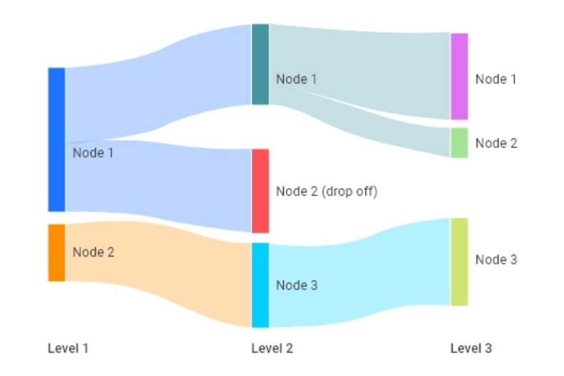

..
  Section title decorators for this document:
  
  ==============
  Document Title
  ==============
  Section Level 1
  ---------------
  Section Level 2
  +++++++++++++++
  Section Level 3
  ~~~~~~~~~~~~~~~
  Section Level 4
  ^^^^^^^^^^^^^^^
  Section Level 5
  '''''''''''''''

  The depth of each section level is determined by the order in which each
  decorator is encountered below. If you need an even deeper section level, just
  choose a new decorator symbol from the list here:
  https://docutils.sourceforge.io/docs/ref/rst/restructuredtext.html#sections
  And then add it to the list of decorators above.

.. _vivarium_interactive_simulation:

====================================
Utilizing the Interactive Simulation
====================================

.. contents::
   :local:
   :depth: 2

Intro to Interactive Simulations
--------------------------------

Interactive simulations are a way to step inside of a simulation instead of 
just receiving final outputs. This can be very helpful for a number of tasks 
including V&V, debugging, and generating primary outputs. These are described 
in detail :ref:`below <interactive_tasks>`. 

The interactive sim allows a user to see all of the data available for any simulant. 
For example, in the main simulation you might record the average BMI in the population 
by age and sex. In the interactive simulation, you can see each simulant's individual 
BMI as well as their propensity score for BMI. 

In addition, you can move the simulation forward in time to watch and record how 
simulants change and experience health events. 

However, since we don't parallelize runs in the interactive sim, we tend to use much 
smaller populations and generally only 1 draw and seed combination to limit run time. 
This makes some tasks more difficult to complete interactively. 

.. _interactive_process:

Setting up an Interactive Sim
-----------------------------

Setting up an interactive sim for the first time can be confusing. Follow these 
instructions along with the example notebook included for help. 
Another useful resource is the `Vivarium InteractiveContext documentation <https://vivarium.readthedocs.io/en/latest/api_reference/interface/interactive.html?highlight=InteractiveContext#vivarium.interface.interactive.InteractiveContext>`_. 

.. _interactive_setup_example:

Example notebook
++++++++++++++++

This `notebook <https://github.com/ihmeuw/vivarium_research_nih_us_cvd/blob/main/interactive_sim_example_setup.ipynb>`_ includes all of the steps seen below using the CVD project as an example.

.. todo::
  Update this example.

.. _interactive_setup_1:

Step 1: General Prep
++++++++++++++++++++

  - Create a conda environment with the appropriate version of Python, if you haven't already.
  - If you haven't installed the simulation in this environment yet, install it with :code:`pip install git+https://github.com/ihmeuw/<REPO>.git` or :code:`pip install git+https://github.com/ihmeuw/<REPO>.git@<BRANCH>` if you need a specific branch.
  - If you have installed the simulation repository before and just want to update to the latest version or a different branch, run one of the above commands with :code:`--no-deps --force-install` added.
    In very rare cases this may not work; in that case, try running :code:`pip uninstall <YOUR_MODEL_NAME>` and then running the appropriate :code:`pip install` command.
  - Check that you have `vivarium` installed in your environment and can import `InteractiveContext` in a Jupyter notebook.
  - If you need more general help with Git or environments for this part, see these :ref:`computing resources <computing>`.
  - At the beginning of your notebook, include the output of :code:`pip list | grep vivarium` and :code:`pip freeze | grep vivarium` to preserve a record of exactly which versions you ran with.
  - Lastly, it is helpful but not required to add code that suppresses warnings generated by the interactive sim. These warnings can add clutter to notebooks and make them difficult to navigate. 

First, include two (separate) Jupyter cells of:

.. code::

  ! pip list | grep vivarium

and

.. code::

  ! pip freeze | grep vivarium

Then, a Python cell with:

.. code:: python

  import warnings
  warnings.simplefilter(action='ignore', category=FutureWarning)
  
  from vivarium import InteractiveContext 

Step 2: Customizing the Model Specification
+++++++++++++++++++++++++++++++++++++++++++

You will almost always want to do some customization of the model specification (the settings and components used in the model).
For example, most of the time you'll want to remove all observers in the simulation, since they add runtime and
you won't be using them.
You may also want to remove other components if you are running a stripped-down version of the model, or change configuration
like population size or input draw.

You'll do this by building a model specification object from the default YAML file, and then changing it. Here is an example:

.. code:: python

  import <YOUR_MODEL_NAME>
  # model_specifications/model_spec.yaml is the typical location within the engineering repo for the
  # default spec to live. Ask the engineers if you can't find it.
  path = Path(<YOUR_MODEL_NAME>.__file__.replace('__init__.py', 'model_specifications/model_spec.yaml'))

  from vivarium.framework.configuration import build_model_specification

  custom_model_specification = build_model_specification(path)

  # Customizations: will be specific to your model and use case!
  # Delete observer configuration
  del custom_model_specification.configuration.observers
  # Change population size
  custom_model_specification.configuration.population.population_size = 50_000

  # Delete the "metrics" component (an observer)
  del custom_model_specification.components.vivarium_public_health.metrics
  # Filter out components with 'Observer' or 'Stratifier' in the name
  custom_model_specification.components.<YOUR_MODEL_NAME>.components = [
      c for c in custom_model_specification.components.<YOUR_MODEL_NAME>.components
      if 'Observer' not in c and 'Stratifier' not in c
  ]

This is essentially like editing the YAML file of the model specification, which you should
be able to view in the engineering repository for reference.
If you want to delete an entire section, for example:

.. code:: yaml

  configuration:
    observers:
      ...

you use :code:`del custom_model_specification.configuration.observers`.
You can do this with any section, using :code:`del custom_model_specification.X.Y.Z` where X, Y, and Z
are the first, second, and third level keys.

If you just want to change a value, you can set it, as we have with the population size in the example.

You can also use the default value to create your new value. That's what's happening with the last lines in
the example, where we take whatever is in the list at :code:`<YOUR_MODEL_NAME>.components` under :code:`components`
and remove only the items that have 'Observer' or 'Stratifier' in them.
This is equivalent to editing a YAML file that looks like this...

.. code:: yaml

  components:
    <YOUR_MODEL_NAME>.components:
      - ComponentOne()
      - ComponentTwo()
      - ComponentThree()
      - ObserverOne()
      - ObserverTwo()
      - StratifierOne()
      - StratifierTwo()

... by simply removing the lines specified, leaving everything else:

.. code:: yaml

  components:
    <YOUR_MODEL_NAME>.components:
      - ComponentOne()
      - ComponentTwo()
      - ComponentThree()

.. _interactive_setup_3:

Step 3: Creating a Simulation
+++++++++++++++++++++++++++++

Now that you're prepped, we can actually load the sim! To 
do this, we will use the `InteractiveContext` function in Vivarium. 

.. code:: python

  sim = InteractiveContext(custom_model_specification)

This creates an object called `sim` that is the simulation.
Running this command will take some time and possibly generate 
some pink warning text. Don't worry! Just wait for the cell to finish running. 

.. _interactive_setup_4:

Step 4: Loading Data from the Simulation 
++++++++++++++++++++++++++++++++++++++++

You now have a simulated population. You can use `get_population` to create a dataset 
with your population. Some simulant data automatically gets recorded for your sim. To find a list of these, 
list the columns in your dataset. Other simulant data does not automatically get added, but can also 
be saved. To find a list of additional sim data available, use `list_values`. If you find 
something from the list that you want included in your data, just add it using `get_value`. 

The below will show using all of these in practice: 

.. code:: python

  pop0 = sim.get_population() # Generates a dataset with some simulant data included 
  pop0.columns # Lists the columns in your simulant dataset 
  sim.list_values() # Lists the additional columns you can add to the dataset 

  # Pulls in new data for all simulants and adds it to a dataframe 
  data1 = pd.concat([
    pop0,
    sim.get_value('<item_in_list_values>')(pop0.index),
  ], axis=1)
  data1.head()

.. _interactive_setup_5:

Step 5: Taking a Step Forward 
+++++++++++++++++++++++++++++

The above steps only include a base population. You can also run the simulation forward 
by taking time steps. The most popular way to do this is using the 'step' function. This 
function takes a single step forward in the simulation. Most commonly, researchers will 
take a single step, record needed information and then take another step. An example 
of this is in the notebook below. 

There are other methods to run a simulation forward which are shown in the docstring 
above such as `run_for` and `run_until`. These are designed to run the simulation forward 
without recording data. These can be useful for burn-in periods. 

Code example: 

.. code:: python

  sim.step() 

The example notebook at the top expands on this to include an example of how to track simulant 
data over time and record subsequent time steps. 

.. _interactive_tasks:

Example Tasks Using the Interactive Sim
---------------------------------------

Below are some common tasks that use the interactive sim. Please note that several of 
these are related to V&V. For more general information and best practices on V&V, see this 
:ref:`vivarium page <vivarium_best_practices_results_processing>` 

.. todo::

  Add further example notebooks to table below if/when they are received. 

.. list-table:: Common Interactive Simulation Tasks 
  :widths: 15 15 15 15
  :header-rows: 1

  * - Task 
    - Why is this done interactively? 
    - Example Notebook
    - Relevant Concept Model
  * - V&V for Risks with Many Categories (E.g., LBWSG)
    - Stratifying simulation outcomes by many categories may be too much of a drain on computation time 
    - `LBWSG exposure <https://github.com/ihmeuw/vivarium_research_ciff_sam/blob/b6fc8cc68eaaeafc563ad373977e7e4495b4db47/model_validation/interactive_simulations/model_5/lbwsg_exposure_model_7.ipynb>`_ 
    - :ref:`CIFF malnutrition model<2019_concept_model_vivarium_ciff_sam>`
  * - V&V for Continuous Risks
    - Summary measures such as mean exposure or proportions below a threshold can be simulation outputs. Interactive sims can verify risk exposure standard deviation, look at spread, or check for outliers. You can also verify correlation between risks. 
    - Examples: 
      
      - `Continous risk standard deviation and visualization <https://github.com/ihmeuw/vivarium_research_nih_us_cvd/blob/6108f8076e4cb9d79991be618b660c00c887515a/interactive_example_continuous_risks.ipynb>`_ 
      - `Risk correlation <https://github.com/ihmeuw/vivarium_research_nih_us_cvd/blob/6108f8076e4cb9d79991be618b660c00c887515a/interactive_correlation.ipynb>`_ 
    - :ref:`CVD model<us_cvd_concept_model>`
  * - V&V for Events with Multiple Risk Factors
    - Stratifying event rates by many risk factors might not be computationally feasible; you can verify risk effects by calculating the event rate at the simulant level.
    - `Multiple risks impacting CVD <https://github.com/ihmeuw/vivarium_research_nih_us_cvd/blob/6108f8076e4cb9d79991be618b660c00c887515a/Interactive_RR_GregGraphs.ipynb>`_ 
    - :ref:`CVD model<us_cvd_concept_model>`
  * - V&V for Relative Risks based on Continuous Risks 
    - For continuous risks with risk effects, simulant level data is needed to validate risk and outcome rates. 
    - `Same example as prior row <https://github.com/ihmeuw/vivarium_research_nih_us_cvd/blob/6108f8076e4cb9d79991be618b660c00c887515a/Interactive_RR_GregGraphs.ipynb>`_ 
    - :ref:`CVD model<us_cvd_concept_model>`
  * - Check for Simulant Level Continuity 
    - Can check that simulant values which are not meant to change, remain constant over time (example: propensities)
    - `Testing propensities drift <https://github.com/ihmeuw/vivarium_research_nih_us_cvd/blob/6108f8076e4cb9d79991be618b660c00c887515a/Old_VV_unresolved/Interactive_Sim_Tests_06.18.2023_testing_propensity.ipynb>`_
    - :ref:`CVD model<us_cvd_concept_model>`
  * - Debugging 
    - This is very general, but simulant level data can be helpful in finding potential issues. Some examples include: propensity drift over time or finding problematic outliers. You can also "remove" parts of the sim to see where a problem might be. 
    - Examples: 

      - `Finding common random number error <https://github.com/ihmeuw/vivarium_research_iv_iron/blob/b1ca9e95f40942a92a9c8ed544d8adef6dc68695/validation/child/interactive_simulations/20221003%20Common%20random%20numbers%20investigation.ipynb>`_. 
      - The `propensity drift notebook above <https://github.com/ihmeuw/vivarium_research_nih_us_cvd/blob/6108f8076e4cb9d79991be618b660c00c887515a/Old_VV_unresolved/Interactive_Sim_Tests_06.18.2023_testing_propensity.ipynb>`_ was also an effort at debugging using the interactive sim. 
    - Concept Models:

      - :ref:`IV iron model<2019_concept_model_vivarium_iv_iron>`
      - :ref:`CVD model<us_cvd_concept_model>`
  * - Primary Output Graphs 
    - Creating visualizations when individual data is needed - such as simulant interactions with healthcare or continuous risk factor spreads over time. 
    - Examples: 

      - `Simulant level hemoglobin changes over time <https://github.com/ihmeuw/vivarium_research_iv_iron/blob/b1ca9e95f40942a92a9c8ed544d8adef6dc68695/validation/maternal/interactive_simulations/Hemoglobin%20trajectory%20plots%2020220616.ipynb>`_ 
      - `Simulant healthcare interactions <https://github.com/ihmeuw/vivarium_research_nih_us_cvd/blob/main/Single_Simulant_Graph_Lifestyle.ipynb>`_  
      - `Sankey diagrams of transitions between states <https://github.com/ihmeuw/vivarium_research_multiple_myeloma/tree/8ca7c6d23354ffb08f532d163990f18745f4c80a/verification/interactive_simulations/sankey_diagrams>`_ (example pictured below). Note that this repo is **private** which means you'll need a team member to add you before you can view it. 
    - Concept Models:

      - :ref:`IV iron model<2019_concept_model_vivarium_iv_iron>`
      - :ref:`CVD model<us_cvd_concept_model>`
      - :ref:`Multiple Myeloma model<2019_concept_model_vivarium_csu_multiple_myeloma_phase_2>`

You might notice that in a lot of the tasks above, especially making primary output graphs, 
you will make new "observers" for the sim and then run time forward, capturing this 
additional data. You might ask yourself, why not just make those the built-in observers 
to my actual sim? The answer is that the "dimensions" of complexity of a model run 
combine multiplicatively, so it is super expensive to do all of them at once. For example, 
you can run the simulation with 60 draws and simple observers, and you can run an 
interactive sim with 1 draw and complicated observers, but 60 draws and complicated 
observers takes way more resources than adding up those two runs. Therefore we sometimes 
choose to make plots in the interactive sim instead! 

.. _interactive_challenges:

Common Challenges
-----------------

Using the interactive sim is fundamentally different than looking at simulation outputs 
and this can lead to challenges. Because you are running a mini-simulation on your computer, 
you overlap a lot more with engineering workflow and have to watch out for some common pitfalls.

1. Using the correct branch and simulation version:

To run an interactive sim, you install the simulation itself from the engineering repo.
Be sure that you are installing updated versions as needed (with the installation commands described in the :ref:`set-up guide above <interactive_setup_1>`).
If you forget, the latest work 
might not be present in your version of the sim, leading to confusion.

If you need to look at an old version of the sim or are actively debugging something, you might 
not work from the main branch. Work with engineering to ensure you've installed from the correct branch for 
your needed task.

In some cases you may need to install unreleased versions of upstream repos on GitHub, like
vivarium or vivarium public health. If you run into this type of situation, consult with the 
engineers to find the best strategy to move forward. 

1. Differing environments: 

Engineers create their own environments, and might use different versions of packages or 
of Python than you are using. This can cause confusion if something isn't running as 
expected.

If you created your environment a while ago and you think you might have gotten out of sync,
you should try re-running the install commands or
re-creating the environment entirely. If you're not sure what version of Python to use, 
ask the engineers what they are using.
